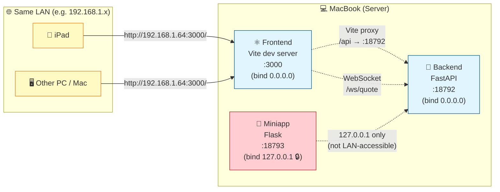

# StockPulse 系統架構 (ARCHITECTURE)

> 本文件描述 StockPulse 嘅系統架構、組件關係、data flow。
> 其他 AI 接手項目時，先讀 `README.md` → `PROJECT_SPEC.md` → **本文件**。

---

## 1. 系統全景 (System Overview)

```
┌─────────────────────────────────────────────────────────────────────┐
│                         StockPulse System                           │
│                                                                     │
│  ┌───────────────┐    ┌───────────────┐    ┌───────────────┐       │
│  │   Frontend    │    │   Backend     │    │    Miniapp    │       │
│  │   (port 3000) │ ←→ │  (port 18792) │ ←→ │ (port 18793)  │       │
│  │  React+Vite   │    │   FastAPI     │    │  Telegram Bot │       │
│  └───────┬───────┘    └───────┬───────┘    └───────┬───────┘       │
│          │ HTTP/WS           │                     │               │
│          └───────────────────┴─────────────────────┘               │
│                              │                                     │
│              ┌───────────────┴───────────────┐                     │
│              ↓                               ↓                     │
│     ┌─────────────────┐            ┌─────────────────┐            │
│     │   Data Tier     │            │  External APIs  │            │
│     │                 │            │                 │            │
│     │  SQLite (8 tbl) │            │  FutuOpenD      │            │
│     │  K-line cache   │            │  :11111         │            │
│     │  Event bus      │            │                 │            │
│     └─────────────────┘            │  MiniMax LLM    │            │
│                                    │  Kimi LLM       │            │
│                                    │  Gemini LLM     │            │
│                                    └─────────────────┘            │
└─────────────────────────────────────────────────────────────────────┘
```

### Tier 概覽

| Tier | 技術 | Port | 角色 |
|------|------|------|------|
| **Frontend** | React 18 + Vite 5 + Ant Design 5 + TS | 3000 | UI + WebSocket client |
| **Backend** | FastAPI + SQLAlchemy + Futu | 18792 | API + WS server + 算法 pipeline |
| **Miniapp** | Telegram Bot + 微信小程序 | 18793 | Mobile 簡化版 |
| **Data** | SQLite + in-memory cache | — | 持久化 + cache |
| **External** | FutuOpenD + LLM providers | 11111 (Futu) | 數據源 + AI |

---

## 2. Frontend Architecture

```
web/src/
├── main.tsx                       # Vite entry, mount <App/>
├── App.tsx                        # React Router setup (11 routes)
│
├── pages/                         # 13 頁面 (見 PROJECT_SPEC.md §UI 設計)
│   ├── HomePage/                  # 組別列表
│   ├── WatchlistPage/
│   ├── StrategyPage/
│   ├── AlgorithmStrategyPage/     # AS-XX 入口
│   ├── LibraryPage/               # Saved runs
│   ├── SettingsPage/              # LLM provider 切換
│   ├── CalendarPage/
│   └── ...
│
├── components/                    # 11 類組件庫
│   ├── common/                    # 通用 UI (Button/Card/Modal/...)
│   ├── layout/                    # AppLayout / Header / Sidebar / MobileNav
│   ├── stock/                     # StockCard / StockSearch / StockDetail
│   ├── group/                     # GroupCard / AddToGroupModal
│   ├── strategy/                  # StrategyEditor / StrategyResult
│   ├── algorithm/                 # AlgorithmSpec / RunButton / ProgressBar
│   ├── library/                   # ViewRunModal
│   ├── chart/                     # Lightweight Charts wrappers
│   ├── calendar/
│   ├── watchlist/
│   └── debug/
│
├── context/                       # React Context (global state)
│   ├── AuthContext                # 用戶登入狀態
│   ├── StockContext               # Stock list / watchlist
│   ├── WebSocketContext           # WS connection + 報價 stream
│   └── ThemeContext               # 暗色 / 亮色主題
│
├── hooks/                         # Custom hooks
│   ├── useWebSocket.ts
│   ├── useStockSearch.ts
│   ├── useGroups.ts
│   ├── useStrategy.ts
│   └── useWatchlist.ts
│
├── services/                      # API service layer (per resource)
│   ├── api.ts                     # axios / fetch wrapper
│   ├── stockService.ts
│   ├── groupService.ts
│   ├── strategyService.ts
│   ├── algorithmService.ts        # AS02 run / health
│   ├── libraryService.ts          # Saved runs CRUD
│   ├── settingsService.ts         # LLM provider 切換
│   └── wsService.ts               # WebSocket subscribe
│
└── types/                         # TypeScript 類型 (mirror backend models)
```

### 路由 (App.tsx)

| Path | Page | 角色 |
|------|------|------|
| `/login` | LoginPage | 登入 |
| `/` | HomePage | 組別列表 |
| `/watchlist` | WatchlistPage | 關注股票 |
| `/strategy` | StrategyPage | 策略管理 |
| `/algorithms` | AlgorithmStrategyPage | AS-XX 入口 |
| `/library` | LibraryPage | Saved runs |
| `/calendar` | CalendarPage | 日曆視圖 |
| `/settings` | SettingsPage | LLM provider 切換 |
| `/test-kline` | KlineDebugPage | Dev |
| `/ew-test` | ElliottWaveTestPage | Dev |
| `/grid-test` | GridTestPage | Dev |

### State management 策略
- **Local state** — `useState` / `useReducer` 喺 component 內
- **Shared state** — React Context (Auth/Stock/WS/Theme)
- **Server state** — 直接 fetch + local cache (冇用 Redux / SWR)
- **WebSocket state** — `WebSocketContext` 統一管理連線 + 報價 stream

---

## 3. Backend Architecture

```
backend/
├── main.py                        # FastAPI app + CORS + router mounts
│                                  #   - /api/* (HTTP)
│                                  #   - /ws/quote (WebSocket)
│                                  #   - /api/health (health check)
│
├── api/                           # HTTP Routes (11 modules)
│   ├── as02.py                    # POST /api/as02/run, GET /api/as02/health
│   ├── debug.py                   # GET /api/debug/* (dev only)
│   ├── group.py                   # /api/groups/* (9 endpoints)
│   ├── kline.py                   # GET /api/kline
│   ├── llm_settings.py            # /api/llm-settings/* (6 endpoints)
│   ├── plates.py                  # /api/plates/* (5 endpoints)
│   ├── saved_runs.py              # /api/saved-runs/* (9 endpoints)
│   ├── settings.py                # /api/settings/* (3 endpoints)
│   ├── stocks.py                  # /api/stocks/* (3 endpoints)
│   └── subscribe.py               # /api/subscribe/* (2 endpoints)
│
├── services/                      # 業務邏輯 (唔直接 expose HTTP)
│   ├── as02_analyzer.py           # AS02 公司質素分析 (核心)
│   ├── encryption.py              # API key 加密 (Fernet)
│   ├── event_bus.py               # 內部 event pub/sub
│   ├── futu_financials.py         # 從 Futu 攞財務數據
│   ├── kline_cache.py             # K 線 cache (memory + DB)
│   └── web_search.py              # MiniMax web search
│
├── llm/                           # LLM Provider Abstraction (NEW 2026-06)
│   ├── base.py                    # AbstractProvider interface
│   ├── factory.py                 # get_active_provider() — 單一入口
│   └── custom.py                  # OpenAI-compatible adapter
│
├── models/                        # SQLAlchemy ORM (8 tables)
│   ├── plate.py
│   ├── llm_settings.py            # API key encrypted at rest
│   ├── stock.py
│   ├── settings.py                # General key-value settings
│   ├── group.py
│   ├── group_stock.py
│   ├── saved_runs.py
│   └── algorithm_dq_log.py
│
├── futu_conn/                     # 富途行情 (port 11111)
│   ├── handler.py                 # QuoteHandler — 解析 push callback
│   └── subscription.py            # SubscriptionManager — 訂閱生命週期
│
├── ws/                            # WebSocket server
│   ├── manager.py                 # ConnectionManager — client 連線管理
│   ├── session.py                 # SessionManager — session 狀態
│   ├── broadcaster.py             # QuoteBroadcaster — quote 廣播
│   └── router.py                  # /ws/quote route
│
├── utils/
│   └── zh_normalize.py
│
├── scripts/                       # 一次性 scripts (板塊 populate / popularity compute)
└── tests/                         # pytest
```

### Layer 規則
- **api/** — 只負責 HTTP protocol (parse request, format response)
- **services/** — 業務邏輯，可以由 api / ws / 其他 services call
- **models/** — SQLAlchemy ORM，唔好喺呢度寫 business logic
- **llm/** — 唯一可以 import 個別 provider 嘅地方，**永遠** 經 factory
- **futu_conn/** — 隔離富途 SDK，外面唔可以直接 import futu

---

## 3.5 KlineCache v2 — Date-based Gap Detection (大少 #8602, 2026-08-06)

### 背景

舊 warm cache gap-fill 有 bug — 當 user query 嘅 `end < today`，`if today_in_range:` 跳過成個 Step 3 gap-fill，導致中間缺口（例如 HK.00700 2026-07-28 → 2026-08-04 嘅 7 日 gap）冇自動補返。

### 三個 Fix (OpenCode Daemon 落地)

| Fix | 內容 | 影響 |
|-----|------|------|
| **Fix 2** | `_compute_fetch_max_count(period)` helper | Cold + warm 共用 `max_count` override (30 yrs daily, 10 yrs other)；防止 caller 嘅 `max_count=100` miss 早期缺口 |
| **Fix 3** | `_fetch_today_bar()` 用 `ctx.get_cur_kline(num=1)` | 拎今日 intraday partial bar；T-1 rule 唔寫 DB |
| **Fix 4** | 刪走 `if today_in_range:` gate | Warm cache gap-fill 唔再受 user query 影響，永遠做 wide-fetch (`earliest_cached` → `today`) |

### Refactor 結構

```
get_or_fetch(code, ctx, ktype, period, start, end)
│
├─ Step 1: get_klines(code, period, start, end)
│          → user-range cached (for response merge)
│
├─ Step 2 (cold): _fetch_klines + _insert_klines(< today)
│          → full-range fetch 1996→today, insert all < today
│
├─ Step 3 (warm): wide-fetch earliest_cached → today
│          → diff OpenD vs FULL cache, fill missing (< today)
│          → NOT gated by today_in_range (Fix 4)
│
└─ Step 4: _fetch_today_bar (independent of path)
         → get_cur_kline(num=1), try/except fallback
         → append to all_klines_dict (overwrite history fetch 嘅 today bar)
```

### Helper Methods (extracted)

| Method | 角色 |
|--------|------|
| `_insert_klines(code, period, klines)` | DB INSERT OR REPLACE；caller 確保 `k['time'] < today` |
| `_fetch_klines(ctx, code, ktype, period, start, end, max_count)` | Pure OpenD fetch，no DB write |
| `_fetch_today_bar(ctx, code, ktype, period)` | Today real-time via `get_cur_kline()`；try/except 包住，mock 或 OpenD quirk → return None |
| `_compute_fetch_max_count(period)` | `1d` → 30×365；else → 10×365 |

### 永久 Rule (大少 #8602)

- ✅ Gap-fill 永遠做 wide-fetch (`earliest_cached → today`)，唔受 user query 嘅 `today_in_range` 影響
- ✅ Today 用 `get_cur_kline()` 而唔係 `request_history_kline()`（拎 intraday partial bar）
- ✅ Today NEVER 寫 DB（T-1 rule 不變 — 大少 #7983）
- ✅ Helper extraction — `_insert_klines` / `_fetch_klines` / `_fetch_today_bar` 拆出嚟，方便獨立 unit test
- ❌ 唔好再用 `max_count=100` caller default（會 miss 早期缺口）

### Test Coverage

`backend/tests/test_kline_cache.py` **14/14 pass**：

| Test | 驗證 |
|------|------|
| `test_gap_fill_db_jump` | DB 缺口自動 wide-fetch 補 |
| `test_today_in_response_not_in_db` | 今日 bar 喺 response 但唔入 DB |
| `test_repeat_call_today_not_duplicated` | 重複 call 唔重複今日 data |

### Source

- 大少 trigger #10714-#10721 (2026-08-06 02:15-02:19) — 問題發現 (00700 7-day gap) + workaround
- 大少 #8602 (OpenCode Daemon session 2026-08-06 02:08) — 3 個 fix 落地
- `backend/services/kline_cache.py` — 主要改動
- `backend/tests/test_kline_cache.py` — 14/14 tests pass
- `memory/2026-08-06-0208.md` — OpenCode session log

---

## 3.6 KlineCache K 線 Dedupe + A3 治本 Fix (大少 2026-08-30)

### 背景

大少 2026-08-29 22:40 reject v4.42.3 candlestick fix approach 之後, 之字 algorithm 拎 K 線
high/low 拎錯 value (紫線飛上去), 之後 v4.39.0 嗰個 state 仲有呢個 issue。

大少 2026-08-30 00:55 trigger 「紫線飛上去」 排查, 搵到真正根 cause: backend K 線 cache
有重複 entry (e.g. 2026-08-24 出現 2 次, high=80.10 同 83.00), 之字 algorithm 拎第二個
entry 嘅極端 value, 紫線飛上去。

### 三層 Root Cause

1. **Backend KlineCache response** 有 2 種 time format 混雜
   (date-only `"2026-08-26"` vs datetime `"2026-08-26 00:00:00"`), 同一個 date 嘅
   2 個 entry time field 唔同, 用 full time 做 dedupe key 唔 work。

2. **DB 入面同日 K 線有 2 個 entry 共存**:
   - 較早寫入 (date-only `"2026-08-17"`): high=84.0 (raw OpenD, stale)
   - 較後寫入 (datetime `"2026-08-17 00:00:00"`): high=81.10 (normalized, 對齊 frontend)
   因為 SQL 寫入嗰陣 2 種 time format 唔撞 unique key, 變咗 2 條 row 共存。

3. **之字 algorithm 拎 raw 嗰個 row** (`get_klines` 拎 first/last entry 都係 raw
   因為只有 1 個 row 寫入成功), frontend 拎 normalized 嗰個 value (從
   `get_or_fetch` merge override 嗰個), 2 個 path 唔一致, 紫線飛上去。

### Fix (3 個 commit)

#### Commit `9eb3fce1` (大少 2026-08-30 00:23) — dedupe by date (time[:10]) 治 K 線 response 重複 entry

- `KlineCache.get_klines` 內 dedupe loop 拎 `time[:10]` 做 key 統一
- 拎走 5 個 T-1 嗰 5 日重複 entry (2026-08-24 至 28)
- 對 frontend KlineCache response 嚟講係治標

#### Commit `1a3a29eb` (大少 2026-08-30 00:30) — dedupe by date 拎 LAST entry (normalized value)

- 由 first entry 改為 last entry, 因為 DB 入面同日 K 線 2 個 entry 嗰陣
  後寫入嗰個係 normalized value
- 之後 `get_or_fetch` 內部 merge 4 個地方都用 `time[:10]` 做 key 統一

#### Commit `a8b7543b` (大少 2026-08-30 00:50) — A3 治本 fix, INSERT OR REPLACE 永遠 override stale row

- 改 `get_or_fetch` 內部 gap-fill 邏輯, 由「INSERT missing_dates 嗰啲」改為
  「INSERT all fetched (< today)」
- 因為 `_insert_klines` SQL 已經係 `INSERT OR REPLACE`, 撞 unique key
  (code, period, time) 自動 override 返 stale row
- 之後 DB 入面永遠只有 fresh OpenD value, 之字 algorithm 拎 fresh value
  對齊 frontend KlineCache response, 紫線對齊 K 線

### 永久 Rule (大少 2026-08-30)

- ✅ KlineCache `get_or_fetch` 永遠 INSERT all fetched (< today), 唔淨係
  missing_dates
- ✅ INSERT OR REPLACE 撞 unique key 自動 override stale row
- ✅ DB 入面永遠只有 fresh value, 之字 algorithm 拎 normalized value 對齊
  frontend
- ✅ 之後新加 KlineCache caller 都拎 fresh value, 唔需要再 defensive

### Verify (大少 2026-08-30 00:49)

- 之字 algorithm P 點 value 對齊 K 線真實 high/low:
  - 2026-08-17 P=81.10 對齊 K.high=81.10 ✅ (之前拎 84.00, A3 fix 後拎 81.10)
  - 2026-08-13 P=78.30 對齊 K.low=78.30 ✅
  - 2026-07-30 P=82.05 對齊 K.high=82.05 ✅
- 紫線 peak 全部對齊 K 線 candlestick 真實 high (wick extreme)
- 紫線 trough 全部對齊 K 線 candlestick 真實 low (wick extreme)
- 紫線唔再飛上去 (之前 Y 軸 90, 而家 70-87 對齊 K 線範圍)
- 鮮綠線 78.95 → 79.40 對齊 K 線最後 close ✅

### Source

- `backend/services/kline_cache.py` — 主要改動 (3 個 commit)
- `backend/services/algorithm_runner.py` — M1 拎走 ZigZag inject (見 §3.7)
- `backend/algorithms/zigzag/` — 拎走 (見 §3.7)

---

## 3.7 M1 純 MA Alignment + 之字 Frontend Inject (C 方案 phase 2, 大少 2026-08-30 01:04)

### 背景

大少 2026-08-30 01:04 trigger C 方案 phase 2: 之後 M1 algorithm 純 MA alignment,
之字 points 由 testing page frontend 自己 inject 落 `verdict.meta.zigzagPoints`
(`applyFrontendZigZagOverlay` line 1424 已經做緊)。

之前 backend `_inject_zigzag_for_ma_alignment` 自動 inject ZigZag 落 M1 options
(Phase 1 嗰陣大少 8-15 拎 framework contract), 之後 testing page frontend 拎返
frontend ZigZag, 之後 backend inject 變成重複 (frontend 自己 inject, backend 又 inject),
拎走 backend inject 乾淨啲。

### 拎走清單 (commit `d3331a0d`)

| 位置 | 拎走咩 |
|------|------|
| `backend/algorithms/zigzag/` (整個 folder) | Phase 1 舊嘅 3 file (algorithm.py / config.py / __init__.py) |
| `backend/tests/test_zigzag.py` | 整個 file |
| `backend/algorithms/__init__.py` | 拎走 ZigZagAlgorithm import + __all__ entry |
| `backend/services/algorithm_runner.py` | 拎走 `_inject_zigzag_for_ma_alignment` function + 2 個 call site (M1 direct + M7→M1) |
| `backend/algorithms/ma_alignment/algorithm.py` | 拎走 ZigZag 5 個 field (zigzagPoints / lastSwingHigh / lastSwingLow / zigzagThreshold / zigzagSlope / zigzagSource / zigzagPointsCount) |
| `backend/tests/test_ma_alignment.py` | 拎走 `backend.algorithms.zigzag` import + `test_ma_alignment_with_zigzag_inject` 嗰個 test function |

### 永久 Rule (Spec Sync #46 改)

- ✅ **M1 algorithm 純 MA alignment, 之字 points 由 frontend inject**
- ✅ testing page `applyFrontendZigZagOverlay` (line 1424) 自己 inject
  落 `lastVerdict.meta.zigzagPoints = frontendPoints`
- ✅ zigzag-testing page (frontend `zigzag-testing.js`) 拎 backend
  `/api/zigzag-testing/run` endpoint 拎 verdict, 1-to-1 port frontend 算法
  (`backend/algorithms/zigzag_testing/algorithm.py` 入面, 8-29 19:34 trigger
  1-to-1 port frontend)
- ✅ 之後新加 algorithm / chart overlay 全部用 frontend inject, 唔好再
  依賴 backend inject
- ✅ 之後 frontend 唔需要靠 backend 拎之字
- ✅ 之後 M1 純 MA alignment, 拎走之字 trigger sub-scenario (Spec Sync #46
  永久 rule 改)

### Verify

- 8 個 M1 test 仍然 pass (M1 純 MA alignment 仍然 work, 拎走 ZigZag 唔影響)
- Frontend testing page 之字線 render OK (已經 frontend 自己 inject)
- Frontend zigzag-testing page 之字線 render OK (backend endpoint 拎 verdict)

### Source

- `backend/algorithms/__init__.py` — 拎走 ZigZagAlgorithm import
- `backend/services/algorithm_runner.py` — 拎走 `_inject_zigzag_for_ma_alignment`
- `backend/algorithms/ma_alignment/algorithm.py` — 拎走 ZigZag 5 個 field
- `backend/algorithms/zigzag/` — 整個 folder 拎走
- `backend/tests/test_zigzag.py` — 整個 file 拎走
- `backend/tests/test_ma_alignment.py` — 拎走 ZigZag inject test

---

## 4. Algorithm Pipeline (AS02 detail)

```
[User clicks "Run" on /algorithms page]
          ↓
[Frontend POST /api/as02/run { stocks: ["HK.00700", ...] }]
          ↓
backend/api/as02.py::run_as02()
          ↓
backend/services/as02_analyzer.py::analyze_stocks(stocks)
          ↓
   for each stock:
          ↓
   analyze_one_stock(stock_code, provider)
          ↓
   ┌──────┴──────────────────────────────┐
   ↓                                     ↓
check_hard_dq_triggers()          futu_financials.get(stock_code)
   ↓                                     ↓
fail → algorithm_dq_log           calculate_financial_score()
   ↓                                     ↓
skip                          calculate_valuation_score()
                                        ↓
                                call_llm_analysis(provider, ...)
                                        ↓
                                backend/llm/factory.get_active_provider()
                                        ↓
                                AbstractProvider.chat_json()
                                        ↓
                                MiniMax / Kimi / Gemini / Custom
                                        ↓
                                (returns reason + scores)
                                        ↓
                                merge into final result
          ↓
[all stocks processed]
          ↓
backend/api/as02.py logs to algorithm_dq_log table (Python 寫 DQ trace - qualified + disqualified 全部)
          ↓
[Frontend 顯示結果 — 唔寫入 saved_runs]
          ↓
[User 手動點「💾 儲存 N 隻合格股票」button]
          ↓
[Frontend POST /api/saved-runs { algorithm_id: "AS-02", stocks: [...], saved_stocks: [...] }]
          ↓
backend/api/saved_runs.py::save_run()
          ↓
[Frontend navigates to /library]
```

> **📌 大少 2026-08-02 #9700 永久 rule:** AS-02 runtime endpoint (`/api/as02/run`) **唔可以** 寫入 `saved_algorithm_runs` table。execute 同 persist 行為唔可以 binding 死於單一 trigger — user 必須喺 frontend 手動點「💾 儲存」先入庫。原因：避免 execute 與 persist 行為 binding 死於單一 trigger,方便 user retry / refine 之後再決定儲存與否。詳細見 `ALGORITHM_SPECS.md` AS-XX 段嘅 none-auto-save rule。

### AS02 函數 (`backend/services/as02_analyzer.py`)

| Function | 角色 |
|----------|------|
| `check_hard_dq_triggers(financials)` | 財務數據 DQ check — missing/stale 即 fail |
| `calculate_financial_score(financials)` | 純數字計分 (ROE / margin / growth) |
| `calculate_valuation_score(financials)` | 估值分 (PE / PB / dividend) |
| `call_llm_analysis(provider, stock, financials, news)` | LLM 分析質素 + 故事 |
| `analyze_stocks(stocks)` | 批量入口 (parallel) |
| `analyze_one_stock(stock, provider)` | 單隻入口 |

### Data quality log
- 每個 DQ fail 都會寫入 `algorithm_dq_log` 表
- Severity: `warn` (可繼續) / `error` (skip 該 stock)
- 可以 query 統計某段時間 DQ rate

---

## 5. LLM Abstraction Layer

### 目標
- 統一所有 LLM call 嘅 interface
- 加新 provider = 加 1 個 adapter + register factory
- Fallback chain + retry policy 一處管理

### Interface (`backend/llm/base.py`)

```python
class AbstractProvider(ABC):
    @abstractmethod
    def chat(self, messages: list[dict], *,
             model: str | None = None,
             temperature: float = 0.3) -> str: ...

    @abstractmethod
    def chat_json(self, messages: list[dict], *,
                 schema: dict) -> dict: ...

    @abstractmethod
    def count_tokens(self, text: str) -> int: ...

    @abstractmethod
    def health_check(self) -> bool: ...
```

### Factory (`backend/llm/factory.py`)

```python
def get_active_provider() -> AbstractProvider:
    """單一入口。讀 llm_settings table 揾 active profile."""
    profile = db.query(LLMSettings).filter_by(is_active=True).first()
    return _build_provider(profile)
```

### Fallback chain (openclaw.json, 全局)

```json
{
  "agents": {
    "defaults": {
      "model": {
        "primary": "minimax/MiniMax-M3-highspeed",
        "fallbacks": ["minimax/MiniMax-M3", "minimax/MiniMax-M2.7"]
      }
    }
  },
  "auth": {
    "cooldowns": {
      "overloadedProfileRotations": 3,
      "rateLimitedProfileRotations": 3,
      "overloadedBackoffMs": 2000
    }
  }
}
```

### 規則 (重要!)
- ✅ 永遠 call `get_active_provider()` 或用 OpenClaw fallback chain
- ❌ 唔好 import 個別 provider 直接用
- ❌ 唔好 hard-code MiniMax / Kimi 嘅 endpoint
- ✅ API key 入 DB 必須 encrypt (`services/encryption.py` Fernet)
- ✅ 加新 provider 用 Settings UI (`/settings`)

---

## 6. Data Flow

### Flow A — 即時報價 (Real-time Quote)

```
[FutuOpenD push callback]
        ↓ (每 250ms 報價)
backend/futu_conn/handler.py::on_recv_quote()
        ↓
backend/services/event_bus.py::emit('quote', data)
        ↓
backend/ws/broadcaster.py (subscribe to 'quote' event)
        ↓
WebSocket.send() to all connected clients
        ↓
[Frontend WebSocketContext receives 'quote' message]
        ↓
update StockCard real-time price
```

### Flow B — Algorithm 執行

(見 §4 Algorithm Pipeline)

### Flow C — 用戶設定 LLM Provider

```
[User changes active provider on /settings page]
        ↓
[Frontend POST /api/llm-settings/switch { provider: "kimi" }]
        ↓
backend/api/llm_settings.py::switch_provider()
        ↓
db.update(LLMSettings.is_active) — atomic toggle
        ↓
[Frontend reloads settings, shows confirmation]
        ↓
[Next LLM call uses new provider via factory]
```

### Flow D — Saved Run 入庫

```
[AS02 run completes]
        ↓
backend/services/as02_analyzer.py returns List[Dict]
        ↓
backend/api/as02.py serializes to JSON
        ↓
db.insert(SavedRun)  with stocks + results + reason as JSON strings
        ↓
[User navigates to /library, GET /api/saved-runs]
        ↓
[Frontend renders runs in saved_runs table]
```

---

## 7. Miniapp Architecture

```
miniapp/
├── backend/main.py                # FastAPI (port 18793)
├── bot_command.py                 # Telegram Bot API (polling-based)
├── frontend/                      # 微信小程序 (Vue / WXML)
└── .env / .env.example
```

### 與主 backend 通訊
- Miniapp backend 唔直接 import 主 backend
- 用 HTTP client (`httpx`) call 主 backend API (e.g. `http://localhost:18792/api/...`)
- 共用同一個 SQLite DB (透過 SQLAlchemy 同 instance)

### Telegram Bot commands
- `/quote HK.00700` — 即時報價
- `/strategy list` — 列出 strategy
- `/run as02 HK.00700` — 簡易 AS02 run

---

## 8. External Dependencies

| 依賴 | 用途 | Failure handling |
|------|------|------------------|
| **FutuOpenD** (port 11111) | 報價 + K 線 + 財務數據 | auto-reconnect + retry subscribe |
| **MiniMax LLM** (`api.minimaxi.com`) | 主要 LLM provider | fallback chain + retry 3x |
| **Kimi LLM** (`api.moonshot.cn`) | 備選 (暫時未用) | 同上 |
| **Gemini** | planned | — |
| **SQLite** | 持久化 | WAL mode + 定期 backup |

### Critical: 連接依賴

- **Backend 啟動時必須 FutuOpenD 已運行**，否則 subscribe 全部 fail
- **LLM call 唔需要 Futu**，可以獨立運作 (Settings + Library 唔靠 Futu)
- **Frontend dev mode** 可以直接打 backend localhost:18792
- **Background services** — macOS LaunchAgent 自動管理 (2026-08-03 起) — Vite / Backend / Miniapp / Logrotate，reboot / crash 後 auto-restart

---

## 9. Deployment (production reference)

### 本地 dev (LaunchAgent-managed, 2026-08-03 起)

> 所有 background service 由 macOS LaunchAgent 自動管理 — reboot / crash 後 auto-restart。
> 修咗兩個 deadlock：(1) Vite reboot 後永遠死、(2) log 長期塞爆 disk (96% full)。

#### Service 清單

| Service | Label | Schedule | Port | Process |
|---------|-------|----------|------|---------|
| Backend | `com.stockpulse.trigger` | RunAtLoad + KeepAlive | 18792 | uvicorn main:app |
| Vite dev | `com.user.stockpulse-vite` | RunAtLoad + KeepAlive | 3000 | npm run dev |
| Miniapp | `com.user.stockpulse-miniapp` | RunAtLoad | 18793 | flask |
| Logrotate | `com.user.stockpulse-logrotate` | StartInterval=1800s (30min) | — | bash script |

#### 文件路徑

```
~/stockpulse/
├── scripts/
│   ├── start_vite.sh        # Vite launcher (absolute npm/node path)
│   └── rotate_logs.sh       # Safe rotation (tail + truncate)
└── logs/
    ├── vite.log             # Vite stdout/stderr
    ├── launchd.log          # Backend (uvicorn) log
    ├── stockpulse.log       # Python logging
    └── *.log.1 / .2 / .3    # Rotated backups (3 layers max)
~/Library/LaunchAgents/
├── com.stockpulse.trigger.plist
├── com.user.stockpulse-vite.plist
├── com.user.stockpulse-miniapp.plist
└── com.user.stockpulse-logrotate.plist
```

#### 啟動鏈條 (Frontend → Backend)

```
[User opens http://localhost:3000]
        ↓
[macOS launchd: com.user.stockpulse-vite RunAtLoad 已經起咗 Vite]
        ↓
Vite dev server 喺 port 3000 listen
        ↓
[Frontend 攞 /api/plates]
        ↓
[Vite proxy: /api → http://localhost:18792]
        ↓
[macOS launchd: com.stockpulse.trigger 已經起咗 Backend]
        ↓
Backend (uvicorn) 喺 port 18792 respond
```

#### 啟動鏈條 (FutuOpenD 報價)

```
[FutuOpenD 預先由大少人手啟動, port 11111]
        ↓
[Backend startup 連 OpenD 攞報價]
        ↓
[WebSocket push 落 Frontend]
```

**⚠️ 重要 — OpenD 唔由 LaunchAgent 管**，要由大少人手啟動 (`/Applications/Futu_OpenD.app`)。

#### 設計原則

1. **絕對 path + export PATH** — LaunchAgent 唔繼承 `~/.zshrc`，要 hard-code `/opt/homebrew/bin/npm` + `export PATH` 確保 child process 都搵到 node
2. **殺舊 → 釋 port → 起新** — `start_vite.sh` pattern 避免 double-bind (跟 start_trigger.sh)
3. **KeepAlive with SuccessfulExit=false** — crash 即 restart，但 intentional kill 唔會 loop
4. **ThrottleInterval=10** — 防 crash loop thrash
5. **Disk-safe rotation** — `rotate_logs.sh` 用 tail + truncate，**唔用 cp**（會 disk-double，tight space 必 crash）

#### 常用 commands

```bash
# Check status
launchctl list | grep stockpulse

# Reload (after edit plist)
launchctl unload ~/Library/LaunchAgents/com.user.stockpulse-vite.plist
launchctl load ~/Library/LaunchAgents/com.user.stockpulse-vite.plist

# 手動 trigger log rotation
bash ~/stockpulse/scripts/rotate_logs.sh

# Tail logs
tail -f ~/stockpulse/logs/vite.log
tail -f ~/stockpulse/logs/launchd.log
```

### Production (not yet)
- Backend: Docker + gunicorn
- Frontend: nginx static files
- DB: SQLite + Litestream (S3 backup)
- OpenD: 必須同機 (latency 考慮)

---

## 9.5 跨機訪問 (Cross-device LAN Access)

> **情境：** 大少喺屋企用 iPad / 第二部電腦訪問 StockPulse。
> **原理：** MacBook 跑 Backend + Frontend；其他設備透過 LAN IP 訪問。

### 拓樸圖 (Topology)



### 訪問鏈條詳解

| 步驟 | 動作 | 細節 |
|------|------|------|
| 1 | **用家查 MacBook LAN IP** | `ipconfig getifaddr en0` → e.g. `192.168.1.64` |
| 2 | **其他設備瀏覽器輸入** | `http://192.168.1.64:3000/` |
| 3 | **Frontend (Vite) 接到 request** | Vite dev server 喺 `0.0.0.0:3000`，所以 LAN 任何 device 都摸得到 |
| 4 | **Frontend 要打 backend API** | 唔係直接打 LAN IP，而係打 `window.location.hostname` (即 `192.168.1.64:18792`) → Vite proxy 轉去 localhost:18792 |
| 5 | **Backend 接到 request** | Backend 喺 `0.0.0.0:18792`，響 MacBook 本機處理 |
| 6 | **WebSocket 一樣** | `ws://192.168.1.64:18792/ws/quote`，proxy 內部轉去 localhost |

### Frontend LAN fallback chain (QW-2a)

`web/src/config/api.ts` 嘅 API host resolution 順序：

```
1. import.meta.env.VITE_API_BASE  ← 最高優先 (build-time env)
2. window.location.hostname      ← 自動 fallback (i.e. 用家個 browser URL 個 host)
3. 'localhost' (default)          ← dev 預設
```

**點解咁重要：**
- 大少喺 MacBook 自己開 → `window.location.hostname` = `localhost` → backend 用 localhost ✅
- 大少喺 iPad 訪問 → `window.location.hostname` = `192.168.1.64` → backend 用 LAN IP ✅
- 唔使 hardcode！同一份 build 兩個地方都 work

### Miniapp 鎖本地 (QW-1)

Miniapp backend (port 18793) 已經喺 QW-1 改 bind `127.0.0.1`：

- ✅ MacBook 自己用 Telegram bot command → OK
- ❌ 其他 LAN 設備 → 唔可以直訪問 Miniapp backend
- 🔒 原因：Miniapp backend 設計上只係 bot 嘅 internal API，唔需要對外

> 📘 詳細 PUBLIC / LOOPBACK 分類見 `~/.openclaw/workspace-main/PORTS.md`
> 📘 凡人 step-by-step 教學見 `README.md` §「🌐 其他電腦訪問 StockPulse」

---

## 10. 設計 trade-offs (要知)

| 決策 | 原因 | Trade-off |
|------|------|-----------|
| SQLite (not Postgres) | 單機部署 + 簡單 | 唔支援 concurrent write 多 |
| 冇用 Redux/SWR | 簡單 | Server state 唔自動 refetch |
| LLM abstraction 而唔直接 call MiniMax | 加新 provider 易 | 多一層 indirection |
| AlgoSpec 喺 `.md` 而唔係 code | 大少易改 | 要 sync script 確保一致 |
| Miniapp 共用 SQLite | 簡單 | 唔可以 horizontal scale |
| WebSocket (not SSE) | bidirectional | 連線管理複雜 |

---

_最後更新：2026-08-03 (LaunchAgent 永久 fix: Vite + logrotate)_
---

## 📦 Stock Reasons Architecture (大少 #9920)

### 改動概要

原本每隻 stock 嘅 reason 喺 `saved_stocks[i].reason` (String, plain text)，新架構獨立 `stock_reasons` table 儲存 sanitized HTML，獨立 components 渲染 PopUp。

### Data Flow

```
[Algorithm run] → backend/services/<algo>_analyzer.build_<algo>_reason_html(result)
                ↓
[Frontend SaveRunModal] → POST /api/saved-runs { ..., reasons: [{code, source_type, source_ref, title, html}] }
                ↓
[Backend api/saved_runs.py] → sanitize_html(req.html) → models.stock_reasons.upsert_reasons_batch()
                ↓
[SQLite stock_reasons table] → UNIQUE(code, source_type, source_ref) ON CONFLICT DO UPDATE
                ↓
[Frontend ViewRunModal] → ReasonCell v2 → useStockReasons(code) → GET /api/stock-reasons?code=X
                ↓
[Title list rendered] → click title → ReasonPopUp (DOMPurify sanitized HTML, 900px modal)
```

### Sanitization Pipeline (defense-in-depth)

1. **Algorithm-side** — `build_<algo>_reason_html()` 寫 structured HTML (no user input)
2. **Backend write** — `services.html_sanitizer.sanitize_html()` 用 bleach + post-scrub regex 移除 XSS vectors
3. **Frontend render** — `DOMPurify.sanitize()` client-side 第二重保險
4. **CSP** (將來 optional) — iframe sandbox 為極端 paranoia level

### 累積語意 (Q1 Smart Dedupe)

- 同 `(code, source_type, source_ref)` 重做 → **overwrite 最新** (RECOVER semantics)
- 唔同 algorithm (AS-01 vs AS-02) → 分開 row
- 唔同 source_type (algorithm vs manual) → 分開 row
- Result: ViewRunModal 入面睇一隻 stock 嘅 reasons = 全部做過嘅 algorithm reports + 任何 manual/news/research


---

## ⚠️ CSS Module Scoping in innerHTML (Permanent Rule, 2026-08-04)

**Problem**: 2026-08-04 大少 screenshot 報「什麼 Chart 都沒有」 — bar chart 0 width render 唔出

**Root Cause**:
```css
/* Vite CSS Modules 編譯時 scope 變 local */
.dim-row { display: flex; }     /* → ReasonPopUp_dim-row__abc123 */
.dim-bar-bg { height: 22px; }  /* → ReasonPopUp_dim-bar-bg__abc123 */
```
但 `dangerouslySetInnerHTML` content 嘅 class 係 raw:
```html
<div class="dim-row">...</div>  <!-- 仍然係 dim-row -->
```

**CSS 變 `_dim-row__abc123`，HTML 係 `dim-row` — selector 唔 match，styles 唔 apply**。

### 解決方案

凡係 component 嘅 HTML content 用 `dangerouslySetInnerHTML`，module.css 入面對應嘅 class 必須加 `:global()` 前綴：

```css
/* Fixed — 用 :global() keep raw class name */
:global(.dim-row) {
  display: flex;
  align-items: center;
  margin: 12px 0;
  gap: 14px;
}

:global(.dim-bar-bg) {
  flex: 1;
  height: 22px;
  background: rgba(255, 255, 255, 0.08);
  border-radius: 6px;
}
```

編譯後變:
```css
.dim-row { display: flex; ... }   /* global, no scoping */
.dim-bar-bg { height: 22px; ... }
```

跟 raw HTML `class="dim-row"` match ✅。

### 應用範圍 (大少 #9920 + #10031)

- `web/src/components/library/ReasonPopUp.module.css` — 32 個 `:global()` wrappers (bar chart + score colors + width classes)
- 將來其他 component 用 innerHTML 都要跟呢條 rule


---

## 🎨 Dim-Score Background Pill (大少 #10176, 2026-08-04)

### 設計 Trigger

大少 screenshot #10176 (HK.01347 AS-02 PopUp)：6 個 dimension 紅框（right side `dim-score`）只 show 純文字，score 數字同紅框嘅關聯唔夠 clear。Trigger：紅框加 score 數字 — 但 `dim-score` 已經有 text（`{v:.1f}`），所以 enhancement 純 CSS：將純文字 span 改 background pill。

### 設計 (大少 #10176)

**PopUp** (`ReasonPopUp.module.css`): `.dim-score` 改 background pill — 顯眼嘅 full-color background + 白字。

```css
/* 大少 #10176: 紅框 background pill — score 數字顯眼 */
:global(.dim-score) {
  flex: 0 0 64px;        /* up from 60px (pill 預留空間) */
  text-align: center;    /* changed from right (text-align center for pill) */
  font-weight: 700;
  font-size: 19px;
  padding: 2px 0;
  border-radius: 6px;
  background: rgba(255, 255, 255, 0.1);   /* fallback 半透明 */
  color: rgba(255, 255, 255, 0.95);
}

:global(.dim-score.score-high) {
  background: #52c41a;   /* 綠 full-color */
  color: #fff;
}
:global(.dim-score.score-med) {
  background: #faad14;   /* 黃 full-color */
  color: #fff;
}
:global(.dim-score.score-low) {
  background: #ff4d4f;   /* 紅 full-color */
  color: #fff;
}
```

**Backend HTML 唔需要改** — `build_as01_reason_html` / `build_as02_reason_html` 入面 `<span class="dim-score">70.0</span>` 已經有 score text，CSS 改即時對 stock_reasons table 入面嘅舊 HTML 生效（sanitize 後 class 保留）。

### AS-02「結果」inline (大少 #10176, AS02ResultPanel.tsx)

AS-02 inline render 用 AntD `<Progress>` component（唔用 `dim-bar` / `dim-score` custom CSS），已經有 `format` 函數顯示分數。原本 `format={(p) => \`${p?.toFixed(0) ?? 0}\`}` 用整數，改做 `${p?.toFixed(1) ?? '0.0'}` 顯示一位小數（與 PopUp 入面 `dim-score` 一致）。Stroke color 已分數 class 顯示（high 綠 / med 黃 / low 紅）。

### AS-01「結果」inline

AS-01「結果」inline (`ResultGrid.tsx`) 用 `ReasonCell` plain text mode（mirror #10097），唔屬 dimension bar 模式，**唔影響**呢個 scope。

### 行為對照 (大少 #10176 verify)

| 位置 | Before (#10176) | After (#10176) |
|---|---|---|
| PopUp `dim-score` | 純文字 19px, color by class, 冇 background | Background pill 64px, full-color (高/黃/紅), 白字 |
| AS-02 inline `Progress` format | 整數 (e.g. 70) | 一位小數 (e.g. 70.0) |
| AS-01 inline | plain text (ReasonCell) | — (唔變) |


---

## 📌 Update Stockpluse Trigger — 永久 Rule (大少 #10203, 2026-08-04 07:56)

### Trigger Keywords (case insensitive)

| Keyword | 備註 |
|---|---|
| `更新Stockpluse` | 大少 typo form (常見) |
| `Update Stockpluse` | typo form |
| `Update StockPulse` | correct form |
| `update stockpluse` / `update stockpulse` | lowercase 都收 |

大少 trigger 任何一個 keyword, 自動執行下面 4 個 steps — **唔再 ask 大少 confirm trigger 邊個** (override `#9664` 嘅「問大少 confirm trigger 邊個」rule)。

### Auto-execute 4 Steps

| Step | Action | File / Repo |
|---|---|---|
| **1** | Update ARCHITECTURE.md | `~/stockpulse/ARCHITECTURE.md` (append new feature section) |
| **2** | Update STOCKPULSE_REFERENCE.md | `~/.openclaw/workspace-main/STOCKPULSE_REFERENCE.md` (append new feature section) |
| **3** | Daily Log | `~/.openclaw/workspace-main/memory/YYYY-MM-DD.md` (append entry 記錄新 feature + spec update) |
| **4** | Commit And Push | `~/stockpulse` + `~/.openclaw/workspace-main` 兩個 repos |

### Override `#9664` StockPulse Spec Update Protocol

- ✅ `#9664` rule 仍然 work 但「直接做」4 steps (唔再 ask confirm) 當 trigger keyword match
- ✅ 其他 trigger (大少「普通 spec update」唔 trigger keyword) 仍然 follow `#9664` 嘅「建議 update + 等大少 confirm」flow

### Apply Scope

- ✅ 所有 StockPulse feature commit 之後大少 trigger「Update Stockpluse」
- ✅ Override 之前 `#9664` 嘅「問大少 confirm trigger 邊個」rule 對呢個 trigger keyword
- ❌ 其他 trigger (大少「普通 spec update」) 仍然 follow `#9664` rule

### Trigger Source

- 大少 2026-08-04 07:56:01 GMT+8 message #10203: 「記住以後當我講更新Stockpluse或Update Stockpluse，你就做Update ARCHITECTURE.md + STOCKPULSE_REFERENCE.md ＋ Daily Log ＋ Commit And Push」

---

## 📦 AS-01 Reason HTML Build Flow (大少 #10075, 2026-08-04)

### Flow Diagram

```
[AS-01 Algorithm run] → backend/models/plate.py::run_plate_leaders()
  → per-plate _rank_one_plate() → emit leaders with mcap_rank / volume_rank / score
  ↓
[Frontend AS-01 panel] → POST /api/saved-runs {algorithm_id: "AS-01", saved_stocks: [Leader with raw fields]}
  ↓
[Backend api/saved_runs.py] → save_run() auto-build block:
  - Group saved_stocks by plate_code
  - For each plate, compute plate_total = len(plate_stocks)
  - Call build_as01_reason_html(stock, plate_total_stocks=plate_total)
  - Append to all_reasons list
  - sanitize_html() + upsert_reasons_batch() → SQLite stock_reasons table
  ↓
[SQLite stock_reasons table] → UNIQUE(code, source_type, source_ref) ON CONFLICT DO UPDATE
  ↓
[Frontend ViewRunModal] → ReasonCell v2 → useStockReasons(code) → GET /api/stock-reasons?code=***
  ↓
[Title list rendered] → click title → ReasonPopUp (DOMPurify sanitized HTML, 1000px modal)
  → 4 個維度 bar chart + 顏色 + 龍頭因素分析
```

### Key Architectural Decisions (大少 #10075)

1. **Plate-grouping**: Backend auto-build 時按 `plate_code` group stocks — 同一板塊內所有 stocks 嘅 relative rank width 一致 (e.g. 全部 #1 都係 w-100, 全部 #5 都係 w-50)。
2. **4 個維度 display weights**: 40/40/10/10 (市值/成交量/綜合/龍頭度) — display 而唔係 algorithm weight。實際 AS-01 algorithm 只用 mcap_rank + volume_rank (50/50)。
3. **Cross-cutting helpers** (`_score_class`, `_width_class`): Duplicated 喺 `models/plate.py` 同 `services/as02_analyzer.py` — 唔 extract 避免 scope creep (將來可抽 `utils/scoring.py`)。
4. **Generic v2 template pattern**: 每個 algorithm 都用同一個 stock_reasons table (title + html + score_class + width_class) — 將來 AS-03/AS-04 跟同一個 pattern。


---

## 📋 Hybrid Reason Display — AS-01 vs AS-02 (大少 #10097, 2026-08-04)

### Decision Matrix

| 維度 | AS-01 板塊龍頭股 | AS-02 公司質素分析 |
|---|---|---|
| Reason 複雜度 | 簡單 (~30 chars plain text) | 複雜 (~1500 chars HTML with bar chart) |
| Data source | `_generate_reason()` 喺 AS-01 ranking | `build_as02_reason_html()` + LLM analysis |
| 即時 inline display | ✅ 喺 ResultGrid (ResultGrid.tsx line ~150) | ❌ 用 AS02StockCard panel 顯示分數 |
| Library PopUp | ✅ stock_reasons table (build_as01_reason_html v1) | ✅ stock_reasons table (build_as02_reason_html v2) |
| Title 喺 PopUp | "板塊龍頭股篩選" | "公司質素分析篩選" |

### Rationale (大少 #10097)

AS-01 reason ("市值 top 1 (5324億) / 成交 top 1") 太短太簡單，inline display 已經夠 clear。PopUp 反而 over-engineered (需 user 額外 click 睇)。

AS-02 reason 太複雜 (6 dimensions × score × LLM summary × 龍頭因素)，inline 顯示 會擠到 grid。所以用 stock_reasons table + PopUp。

### Implementation Diff (大少 #10097, 1 file edit)

`web/src/components/algorithm/ResultGrid.tsx`:
- Added: `{stock.reason && <Text type="secondary">{stock.reason}</Text>}` conditional render
- Comment: 大少 #10097 註明係 AS-01 inline，AS-02 仍用 stock_reasons PopUp (大少 #9920)
- No backend changes (saved_stocks[i].reason 已經 populated by `_generate_reason()` 喺 AS-01 ranking)
- No spec changes for stock_reasons table schema


---

## 📋 ViewRunModal Per-Run Scoped Query (大少 #10103, 2026-08-04)

### Data Flow Update (per-run scoped)

```
[Frontend ViewRunModal #86 (AS-01, 10 stocks)]
  ↓
[ReasonCell v2 (code="HK.00981", runId=86)]
  ↓
[useStockReasons(code="HK.00981", sourceRunId=86)]
  ↓
[GET /api/stock-reasons?code=HK.00981&source_run_id=86]
  ↓
[Backend list_reasons endpoint → list_reasons_filtered()]
  ↓
[SELECT * FROM stock_reasons
 WHERE code IN (codes from saved_algorithm_runs #86 saved_stocks)
   AND is_active = 1
 ORDER BY created_at DESC]
  ↓
[Return only reasons for stocks IN #86 run's saved_stocks]
  ↓
[Frontend render title list (1 reason: AS-01)]
```

### Old vs New Display Logic

| Scenario | Old (bug) | New (大少 #10103) |
|---|---|---|
| ViewRunModal #86 (AS-01), HK.00981 stock | Show AS-01 + AS-02 reasons (cross-algorithm stale) | Show AS-01 only (per-run scoped) |
| ViewRunModal #89 (AS-02 + HK.00981 qualified), HK.00981 stock | Show AS-01 + AS-02 reasons | Show AS-01 + AS-02 (cross-algorithm accumulation 保留) |
| ViewRunModal #90 (AS-02, HK.00981 disqualified) | HK.00981 不會出現 (frontend filter) | 同 left (frontend filter 已經 work) |

### Key Architectural Decisions

1. **Per-run scoping** (新): ViewRunModal 顯示嘅 reasons 只限於 嗰個 run 嘅 saved_stocks 入面 stocks 嘅 algorithm reasons. 解決 cross-run cross-algorithm stale display.
2. **Cross-algorithm accumulation** (保留): 如果同一 stock 曾經 qualified for 多個 algorithms, 嗰個 stock 嘅 reasons 全部都 show. Example: AS-01 #86 + AS-02 #89 都 qualify 同一 stock → ViewRunModal #89 顯示 2 條 reasons.
3. **Frontend filter 已經 work** (大少 #10105 確認): AS-02 panel `onSave` 只 pass qualified stocks. Backend 唔需要 enforce qualification check. Backend auto-build 只 insert `saved_stacks` 入面嘅 stocks → 自然 qualified-only.
4. **Backward compat**: `code`-only query (no source_run_id) 仍然 work (cross-run cross-algorithm aggregation). 為咗 AS-01 結果頁面 inline render (without runId context).


---

## 📋 ViewRunModal Per-Run Scoped Query — Option C (大少 #10144, 2026-08-04 07:03)

### Decision

取代 commit `f25d287f` 嘅 source_ref hard filter，改用 **is_stale runtime flag** + UI filter。

### Final Implementation (大少 #10144)

```python
# backend/models/stock_reasons.py::list_reasons_filtered

if source_run_id is not None:
    run_row = conn.execute(
        "SELECT algorithm_id, saved_stocks FROM saved_algorithm_runs WHERE id = ?",
        (source_run_id,),
    ).fetchone()
    run_algorithm_id = run_row["algorithm_id"]
    codes_in_run = [...]
    
    # SQL filter: code IN run's stocks (唔 filter source_ref — 保留 accumulation)
    where_parts: list[str] = []
    params: list[Any] = []
    if code:
        where_parts.append("code = ?")
        params.append(code)
    else:
        placeholders = ",".join(["?"] * len(codes_in_run))
        where_parts.append(f"code IN ({placeholders})")
        params.extend(codes_in_run)
    where_parts.append("is_active = 1")
    
    rows = conn.execute(
        f"SELECT * FROM stock_reasons WHERE {' AND '.join(where_parts)} ORDER BY created_at DESC",
        params,
    ).fetchall()
    
    # Compute is_stale per reason (Option C runtime flag)
    results: list[dict[str, Any]] = []
    for row in rows:
        d = _row_to_dict(row)
        d["is_stale"] = (
            d["source_run_id"] != source_run_id        # 跨-run
            and d["source_ref"] != run_algorithm_id    # 跨-algorithm
        )
        results.append(d)
    return results
```

```typescript
// web/src/components/library/ReasonCell.tsx (frontend filter)
const { reasons, loading } = useStockReasons(code, runId);
const visibleReasons = reasons.filter((r) => !r.is_stale);  // hide stale
```

### Data Flow Update (Option C)

```
[Frontend ViewRunModal #86 (AS-01, 10 stocks)]
  ↓
[ReasonCell v2 (code="HK.00981", runId=86)]
  ↓
[useStockReasons(code="HK.00981", sourceRunId=86)]
  ↓
[GET /api/stock-reasons?code=HK.00981&source_run_id=86]
  ↓
[Backend list_reasons_filtered(code, source_run_id=86)]
  ↓
[SELECT * FROM stock_reasons
 WHERE code = HK.00981
   AND is_active = 1
 ORDER BY created_at DESC]
 ↓
[For each row, compute is_stale based on run #86 (AS-01) context]
 ↓
[Return reasons + is_stale flag (id=34 AS-01 NOT stale + id=1 AS-02 STALE)]
 ↓
[Frontend filter: visibleReasons = reasons.filter(r => !r.is_stale)]
 ↓
[Render 1 AS-01 title only (hide AS-02 stale)]
```

### Smoke Test Evidence (大少 #10144 verification, 5/5 pass)

| Scenario | Expected | Actual | Result |
|---|---|---|---|
| AS-01 #86, HK.00981 | 1 visible (AS-01) + 1 stale (AS-02) | id=34 stale=False + id=1 stale=True | ✅ |
| AS-01 #83, HK.00981 | 1 visible (AS-01) + 1 stale (AS-02) | id=34 stale=False + id=1 stale=True | ✅ |
| AS-02 #52, HK.00981 | 1 stale (AS-01) + 1 visible (AS-02) | id=34 stale=True + id=1 stale=False | ✅ |
| AS-02 #82, HK.00981 | 1 stale (AS-01) + 1 visible (AS-02) | id=34 stale=True + id=1 stale=False | ✅ |
| code='HK.00981' (no run_id) | 全部 not stale (caller 冇 context) | id=34, id=1 stale=False | ✅ |
| HK.99999 + run_id=86 | 0 reasons | 0 reasons | ✅ |

### Key Architectural Decisions (Option C)

1. **Per-run scoping (SQL)**: `code IN (run's stocks)` — 保留 accumulation, 唔做 source_ref hard filter。
2. **is_stale runtime flag (Python)**: 每個 reason compute `is_stale = (cross-run) AND (cross-algo)` — runtime attribute, 唔做 DB column。
3. **UI filter (Frontend)**: `visibleReasons = reasons.filter(r => !r.is_stale)` — 1 行 hide stale。
4. **Cross-algorithm accumulation 保留**: 同一 stock 跨-run 同-algo 嘅 reasons 全部 not stale (visible)。例: HK.00981 AS-01 from #87 喺 AS-01 #86/#83 view 都 NOT stale (accumulation)。
5. **Cross-algorithm stale hide**: HK.00981 AS-02 from #82 喺 AS-01 #86 view STALE (hide)；AS-01 from #87 喺 AS-02 #52/#82 view STALE (hide)。
6. **Frontend filter 已經 work (大少 #10105)**: AS-02 panel `onSave` 只 pass qualified stocks. Backend 唔需要 enforce qualification check。
7. **Backward compat**: code-only query (no source_run_id) 仍然 work, 全部 `is_stale=False` (e.g. AS-01「結果」頁面 inline render)。

### f25d287f → 075ff644 Comparison

| 項目 | f25d287f (hard filter) | 075ff644 (Option C) |
|---|---|---|
| Cross-algo cross-run stale leak | ❌ Filter 咗 | ❌ UI filter 咗 |
| Cross-run same-algo accumulation | ❌ 失效 | ✅ 保留 |
| Backend SQL 複雜度 | 中 (JOIN + filter) | 低 (code IN only) |
| Frontend 邏輯 | 簡單 (顯示) | 加 1 行 filter |
| Design intent | 嚴格 per-run algorithm | 保留 accumulation + hide stale |

---

## N. Algorithm Layer — `algorithms/` (AS-03 股票周期性判定)

> **新章節 (2026-08-04)** — AS-03 cycle detection sub-project

### 位置

```
~/stockpulse/algorithms/AS-03-cycle-detection/
├── README.md           # 入口 + 快速開始
├── ARCHITECTURE.md     # 完整架構 + 數據流
├── DECISIONS.md        # D001-D010 ADR 決策記錄
├── types.ts            # CycleState / Verdict / Report / Alert 共用類型
├── config.ts           # 所有 tunable thresholds (DEFAULT_CYCLE_CONFIG)
├── data-loader.ts      # HTTP client → GET /api/kline (cache-aside 沿用)
├── index.ts            # CycleDetector 主入口 (runModule / analyze)
├── modules/            # 5 個 peer modules (Module 1-5)
│   ├── ma-alignment.ts
│   ├── hl-structure.ts
│   ├── trendline.ts
│   ├── indicators.ts
│   └── volume.ts
├── orchestrator/       # Module 6 + 7 + 輔助
│   ├── multi-tf.ts     # Module 6 — HTF 約束 LTF (orchestrator step 0)
│   ├── synthesize.ts   # Module 7 — placeholder
│   ├── aggregator.ts   # conflict resolution (placeholder)
│   └── alert.ts        # regime change reminders
└── __tests__/smoke.mjs
```

### 目標

識別股票當前所處嘅周期 (上升 / 下跌 / 橫行 / 轉勢)，輔助大少做交易決策。

### 架構 (7 個點)

- **Module 1-5** (peer modules): MA Alignment, HL Structure, Trendline, Indicators, Volume — 每個都係獨立判斷方法，可單獨調用
- **Module 6** (orchestrator step 0): MultiTFOrchestrator — HTF 約束 LTF (架構上唔係 peer, 見 D001)
- **Module 7** (orchestrator): Synthesizer + Aggregator — placeholder majority vote (D004 待大少決定策略)
- **RegimeChangeAlerter**: 轉勢時 emit alert，大少手動 confirm (D003 唔做 state machine)

### 4 個 Cycle State (D002)

`UP | DOWN | SIDEWAYS | TRANSITION` + 每個 verdict 必填 `interpretation: string` 中文解讀

### 數據來源 (D008)

- **Frontend (data-loader.ts)** HTTP client → `GET /api/kline`
- **Backend `KlineCache`** (cache-aside) 處理 DB + 當日 OpenD 組合
- AS-03 唔需要 re-implement cache — backend 已有 (`backend/services/kline_cache.py`)

### 狀態

- **v0.1.0-skeleton** (2026-08-04) — 5 peer modules + orchestrator + alert 全部 return placeholder verdict (`state='TRANSITION'`, `confidence=0`)
- 等待大少逐個 module 提供詳細做法後實作
- tsc type-check **EXIT=0**

### 相關文檔

- [AS-03 README](../algorithms/AS-03-cycle-detection/README.md)
- [AS-03 ARCHITECTURE.md](../algorithms/AS-03-cycle-detection/ARCHITECTURE.md)
- [AS-03 DECISIONS.md](../algorithms/AS-03-cycle-detection/DECISIONS.md)
- [AS-03 RESEARCH_LOG](../docs/research/AS-03-cycle-detection/RESEARCH_LOG.md)

### Apply Scope (永久 rules)

- ✅ 6 個 module 全包 (D009 / Q3) — 唔分 priority
- ✅ 6 個 model 結果都顯示 (D006) — UI 顯示 5 peer + 1 HTF + 1 synthesized = 7 個 verdict card
- ⚠️ Backtest ground truth (D010 / Q4) — 暫緩，日後先傾
- ⚠️ Synthesizer 策略 (D004) — 3 選 1 (htf-override / weighted-vote / expert-rules)，最後先定


---

## 10. AS-03 算法層 (v0.3.0, 2026-08-04 大少 #10332)

AS-03 係 StockPulse 第一個完全實裝嘅 stock analysis algorithm (Module 1 ma-alignment done)。

### 架構圖

```
┌─────────────────────────────────────────────────────┐
│  AS-03 Cycle Detector                                │
│  algorithms/AS-03-cycle-detection/index.ts          │
└───────────────────┬─────────────────────────────────┘
                    │
   ┌────────────────┼────────────────┐
   ▼                ▼                ▼
┌────────┐   ┌─────────────┐   ┌──────────┐
│ 5 Peer │   │ MultiTF     │   │  Synth   │
│Module  │   │Orchestrator │   │ (Module7)│
│ 1-5    │   │ (Module 6)  │   │          │
└───┬────┘   └─────────────┘   └──────────┘
    │
    ├─ Module 1: ma-alignment (v0.3.0 ✅ DONE — 19/19 tests pass)
    ├─ Module 2: hl-structure (v0.1.0 ✅ DONE)
    ├─ Module 3: trendline (v0.1.0 ✅ DONE frontend + Phase 4 backend Python v0.1.0, Spec Sync #23)
    ├─ Module 4: indicators (v1.0.0 ✅ DONE frontend + Phase 5 backend Python v1.0.0, Spec Sync #24)
    └─ Module 5: volume_price (v2.0.0 ✅ DONE frontend + Phase 6 backend Python v2.0.0, Spec Sync #24)
    └─ Module 6: volatility (v1.0.0 ✅ DONE frontend + Phase 7 backend Python v1.0.0, Spec Sync #26)
    └─ Module 7: synthesizer (v1.0.0 ✅ DONE frontend + Phase 8 backend Python v1.0.0, Spec Sync #27)
```

### Module 1: ma-alignment 嘅 10 條算法 (A-J)

| # | 算法 | 規則 | 對應 state |
|---|------|------|-----------|
| A | 上升勢 | 連續 5 日 MA5 > MA60 | UP |
| B | 下跌勢 | 連續 5 日 MA5 < MA60 | DOWN |
| C | 橫行向下 | 5 日裡 MA5 > MA60 但當日 low < MA60 | SIDEWAYS |
| D | 橫行向上 | 5 日裡 MA5 < MA60 但當日 high > MA60 | SIDEWAYS |
| E | 末位日優先 | C/D 多過一日，最後一日為準 | (隱含) |
| F | 升勢調整向下 | MA5+MA10 都 > MA60 但 MA5 < MA10 | UP |
| G | 跌勢調整向上 | MA5+MA10 都 < MA60 但 MA5 > MA10 | DOWN |
| H | 7 日趨勢反轉 | 1/2/3 日新方向 vs 4-7 日舊方向 (3 sub-case) | TRANSITION |
| I | 有機會長升狀態 | 連續 5 日 low ≥ MA5 × 0.98 | supplementary |
| J | 有機會長跌狀態 | 連續 5 日 high ≤ MA5 × 1.02 | supplementary |

### 數據流向

```
[backend /api/kline] (cache-aside: DB + 當日 OpenD)
       ↓
[CycleDetector.analyze(symbol, ltf)]
       ↓
[DataLoader.loadKLines()] → KLine[]
       ↓
[5 Peer Modules.runModule(KLine[], ctx)]
       ├─ ma-alignment → CycleVerdict (A-J rules fired)
       ├─ hl-structure → CycleVerdict (placeholder)
       ├─ trendline → CycleVerdict (placeholder)
       ├─ indicators → CycleVerdict (placeholder)
       └─ volume → CycleVerdict (placeholder)
       ↓
[Synthesizer] → Final CycleVerdict (待 D004 strategy 落實)
       ↓
[RegimeChangeAlerter] (D003 手動 confirm)
       ↓
UI: 5 peer + 1 HTF + 1 synthesized = 7 個 verdict card (D006)
```

### Spec

- Spec: `~/stockpulse/docs/research/AS-03-cycle-detection/MODULE-01-MA-ALIGNMENT.md`
- Code: `~/stockpulse/algorithms/AS-03-cycle-detection/`
- Tests: 19/19 pass, TSC=0

### 已 Drop (v0.2.0 Kimi 13 個算法)

Step 1-7a-d + magic numbers。原因：三個折扣叠太狠 (worst case 0.31)。

---

## §11 · Algorithm Testing Page（2026-08-05, 大少 #10383）

> **背景：** AS-03 算法已 implement + tested，但 StockPulse web/backend 仲未接。為咗畀大少人手測試，建咗 standalone testing page framework。

### Folder Structure

```
~/stockpulse/
├── testing-page/                              ← 中央 testing framework
│   ├── index.html                             ← 主頁
│   ├── testing-page.js                        ← Logic (algorithm registry + dynamic UI)
│   ├── testing-page.css                       ← Style
│   ├── start.command                          ← 啟動 script（nohup + auto-open browser）
│   └── REGISTRY.md                            ← Algorithm list + 加新 AS-XX 步驟
└── algorithms/
    └── AS-03-cycle-detection/
        ├── adapter.mjs                        ← AS-03 adapter（vanilla JS port of ma-alignment.ts）
        └── ... (existing files)
```

### Adapter Pattern（永久 contract）

每個 algorithm 寫 `adapter.mjs`：
```javascript
export const id, name, version, description;
export const inputs = [...];                  // 'string' | 'number' | 'select' | 'autocomplete'
export async function analyze(klines, options) { return verdict; }
export function renderResult(verdict) { return HTML_string; }
export function getHelp() { return HTML_string; }
```

Testing page 自動 discover + render。加新 algorithm 只需要：
1. 寫 `adapter.mjs`
2. 加 1 行落 `testing-page.js` 嘅 `REGISTRY`
3. Browser reload

### Backend Integration

| Resource | Endpoint |
|----------|----------|
| K 線 | `GET /api/kline?code=***&period=***&count=***` |
| 股票搜尋 | `GET /api/stocks/search?q=***&market=HK|US&limit=***` |
| 跑算法 (generic) | TBD — AS-XX 自己實作 `/api/asXX/run` |

### K 線圖表（testing page 自己 render，2026-08-05 大少 #10431）

大少想撳完 AS-03 test 後下邊出日 K 線圖表，full width。原本想 iframe embed StockPulse，但發現 HomePage default 入面係 watchlist widget 唔係 chart（要 user 揀 stock + 登入）。

**最終方案：** CDN load lightweight-charts v4.2.3，vanilla JS render candlestick + volume。
- ✅ 100% width
- ✅ height 600px
- ✅ Auto render 撳完「跑算法」後
- ✅ Dispose 舊 chart + render 新嘅

**Permanent Rule：** testing page 自己 render chart，唔 iframe embed StockPulse。

### Server Lifecycle

- `start.command` 用 `nohup + disown`（server survive terminal close）
- Auto `open http://localhost:8765/testing-page/`（大少 #10396）
- `stop.command` kill server
- Port 8765 reserved

### Spec

- Adapter pattern: `~/stockpulse/testing-page/REGISTRY.md`
- AS-03 adapter: `~/stockpulse/algorithms/AS-03-cycle-detection/adapter.mjs`
- Source: 大少 #10383 / #10396 / #10400 / #10409 / #10423 / #10431

### § Testing Page UI Enhancement (2026-08-06, 大少 #10846 / #10859 / #10871)

**Architecture Overview:**
- Testing page 用 vanilla JS standalone HTML（CDN lightweight-charts v4.2.3）
- Backend adapter (`adapter.mjs`) 將 algorithm port 到 JS
- Frontend render verdict + plain language 解讀

**Recent enhancements (5 commits, 2026-08-06):**

| Commit | Scope | Trigger |
|--------|-------|---------|
| `c62d5fcb` | Module 5 VolumePrice + Module 8 SlopeMomentum + option toggle (D019) | #10809 |
| `4dfe7771` | ARCHITECTURE spec sync + archive quick-draft reference | #10809 |
| `a9c1dd20` | Testing page checkbox UI for VolumePrice + SlopeMomentum | #10846 |
| `a4463444` | Testing page REGISTRY cleanup (remove AS-03-VP/SM dropdown) + UI text 繁→普 | #10859 |
| `2f1f8cc7` | Testing page module section headers + plain language 解讀 templates | #10871 |

**Module Section Pattern (commit `2f1f8cc7`):**
- 兩粒 module section header: 「量价分析」「斜率动能」
- 每個 verdict 旁邊加「人話解讀」面板：
  - 量价: 💰 錢跟價 / ⚠️ 錢唔跟價 / 🔍 無明確信號
  - 斜率: 🚀 強勢升 / 📉 強勢跌 / 🔄 轉勢中 / ⏸️ 等待方向

**Checkbox UI Pattern (commit `a9c1dd20`):**
- Adapter `inputs[]` 加 `type: 'checkbox'` field
- Default `false` — 大少要求 user 主動剔
- `analyze()` 接受 `enableVolumePrice` + `enableSlopeMomentum` flags
- Pass 落 backend `enableFlags` 機制 (D019)

**Permanent Rules:**
- Testing page UI 統一簡體普通話 (commit `a4463444`)
- Module 5/8 + VolumePrice/SlopeMomentum 都係 optional toggle，MA alignment core mandatory (D019)
- Synthesizer default = expert-rules (D004 pending decision)
- Backend emit labels（e.g.「上升勢」「下跌勢」）保持繁體/algorithm context，不強行轉普通話

### § Testing Page Chart Overlay Contract (2026-08-07, 大少指示)

Generic contract 畀 testing page 嘅 K 線圖加多 module 自己嘅 visual overlay (peaks/troughs / MA trend lines / pattern box)：

```javascript
// testing-page/testing-page.js line 476
if (currentAdapter.renderChartOverlay) {
  currentAdapter.renderChartOverlay(verdict, klines, chartRefs);
}
```

`chartRefs` 結構 (testing-page.js line 601):
```javascript
{ chart, candleSeries, priceLines: {} }
// chartRefs.maLineSeries (line series refs) — adapter 自己儲, framework 唔 hard-code
```

**Module 1 (MA alignment) 嘅 overlay (commit `830927cc`):**
- **Trend lines (唔係水平價線)** — 大少要「跟股價走」嘅斜線, 主流 trading app 風格
- 用 `chart.addLineSeries({ color, lineWidth: 2, lastValueVisible: true })` 加 3 條 line series:
  - MA5: 紅 `#FF6B6B`
  - MA10: 青 `#4ECDC4`
  - MA60: 藍 `#45B7D1`
- Re-compute MA 歷史 series (`_computeMASeries(klines, period)` in adapter.mjs) — 頭 `period-1` 個 point 直接 skip (唔 emit null, 避免 lightweight-charts 將 null 當 0 畫)
- 跟 ma-alignment.ts 嘅 `avgClose` 一樣嘅算法, period = 5 / 10 / 60

**Module 2 (高低點結構法) 嘅 overlay:** peaks/troughs markers + 箱體線 + 形態預警 banner (commit `4950de63`)

**Permanent Rules:**
- **Function name 必須叫 `renderChartOverlay`** (testing page 嘅 contract, 唔好 alias) — 之前 `renderMAChartOverlay` 命名錯咗導致 function 永遠 skip (commit `9d77021a`)
- **Trend line 唔好水平價線** — 大少要 `addLineSeries` 跟股價走嘅斜線, 唔係 `createPriceLine` 嘅水平線
- **Skip 唔夠 data 嘅 point, 唔好 emit null** — lightweight-charts v4.2.3 將 null 當 0 處理, 會拉到 y-axis 底部
- 每個 module 自己 implement `renderChartOverlay`, framework 唔 hard-code 任何 algorithm 嘅 visual

---

## 11. AS-03 Cycle Detection — Module 1-9 進度 + 3-Section Rule (2026-08-07, 大少 #11056)

`algorithms/AS-03-cycle-detection/` — 股票週期判定系統,Stage 1 (完成 Module 1-9) Roadmap。

### Module 進度 (8 個 done + 1 個獨立 + 2 個 hidden, Stage 1 + Sprint 3 收官)

> 大少 2026-08-08 10:06 指示: 6 個 modules 加編號 01-06 喺 dropdown displayName 同 spec table, zmen均算法 唔加 (獨立算法, 唔屬 7 個 modules 之一)。
> 大少 2026-08-08 10:28 指示: 4 個 UX 優化 (data-summary 排版 + 信心指數解讀 + interpretation + 觀望/策略 box 詳細解說) 應用到全部 7 個 modules, renderResult 統一一個 format。
> 大少 2026-08-08 22:28 指示: M9 Back Test 開工, Sprint 3 全部 6 個 sub-tasks (9.1-9.6) + 9.7 UI 升級 全部 done (23:55 收官).

| 編號 | Module | 檔案 | Version | 3 Sections | Status |
|------|--------|------|---------|-----------|--------|
| 01 | **均線系統週期判斷法 v2.1.0** (with Volume & Slope + 9 個 sub-scenario) | `modules/ma-alignment.ts` | **v2.1.0 (Spec Sync #19, 2026-08-15)** | ✅ | ✅ Production — **v2.1.0 升級** (大少 2026-08-15 06:20 trigger 揀項甲): v2.0 3 個 cycle state + 9 個 sub-scenario 細分 (強升 / 弱升 / 上升回調 / 橫行 / 下跌反彈 / 弱跌 / 強跌 / 到頂轉勢 / 到底轉勢) + 5 個判定優先級 (Priority 1 到頂/到底 → Priority 2 強升/強跌 → Priority 3 弱升/弱跌 → Priority 4 上升回調/下跌反彈 → Default 橫行) + 14 個 output field (cycle / cycleLabel / cyclePosition / cyclePositionLabel / consecutiveDays / maValues / maRanks / maSlopes / momentumScore / maxSpreadPct / volumeTrendRatio / volumeSignal / volumeSignalLabel / adjustmentLog) + 29 個凡人話 popup 註解 (跟 M7/M8/M9 一致 inline style) + 凡人話 12 步 step-by-step guide + Warning 注入 3 個 code (FALLBACK_USED [system] / THRESHOLD_BREACH [stock_state] / CONFLICT_STATE [stock_state]). v2.0.0 3 cycles + 13 fields + 三階段信心調整 + 4 條 MA overlay (5/10/20/60, 大少 2026-08-08 09:50) + 凡人話 UX (大少 2026-08-08 10:28). **v2.2 待大少逐條 review 9 個 sub-scenario trigger 條件** (大少 2026-08-16 19:21 永久 rule, spec doc M1-V22-RESEARCH.md). |
| 02 | HL Structure 高低點結構 | `modules/hl-structure.ts` | v0.1.0 | ✅ | ✅ Production |
| 03 | Trendline 趨勢線法 | `modules/trendline.ts` + `backend/algorithms/trendline/` | v0.1.0 (frontend) + **v0.1.0 (Phase 4 backend Python, Spec Sync #23, 2026-08-20)** | ✅ | ✅ Production — **v0.1.0 backend Python port** (大少 2026-08-20 20:50 trigger「搬M3加測試」): backend `trendline/algorithm.py` 27.3KB port frontend algorithm + 7 個 helper, 10 pytest pass, frontend `adapter.mjs` 拎走 506 行 `analyzeTrendline` + 7 個 helper, 換 fetch backend stub (34 行), 4 個 render function (`renderTrendlineResult` / `renderTrendlineRuleExplain` / `renderTrendlineChartOverlay` / `getTrendlineHelp`) 拎 `verdict.X` → `verdict.meta.X`, 5 隻 stock verify (HK.00700 騰訊 SIDEWAYS 0.65 / HK.00005 匯豐 UP 0.90 / US.AAPL SIDEWAYS 0.70 / US.MSFT UP 0.90 / US.GOOGL SIDEWAYS 0.65). Algorithm ABC contract 對 M3 應用 (Phase 1 永久 rule), caller inject pattern 唔需要 (M3 同 M2 一樣 standalone, framework 保留), frontend render 拎 `verdict.meta.*` (Phase 2 永久 rule). |
| 04 | Indicators 動能背馳與衰竭 | `modules/indicators.ts` + `backend/algorithms/indicators/` | v1.0.0 (frontend) + **v1.0.0 (Phase 5 backend Python, Spec Sync #24, 2026-08-20)** | ✅ | ✅ Production — **v1.0.0 backend Python port** (大少 2026-08-20 21:10 trigger「Phase 5+6 連做」): backend `indicators/algorithm.py` 27.9KB port frontend 9 步算法 + 9 個 helper, 10 pytest pass, frontend `adapter.mjs` 拎走 566 行 `analyzeIndicators` + 9 個 helper, 換 fetch backend stub (34 行), 4 個 render function (`renderIndicatorsResult` / `renderIndicatorsChartOverlay` / `getIndicatorsHelp` / `indicatorsAdapter`) 拎 `verdict.X` → `verdict.meta.X`, 5 隻 stock verify (HK.00700 騰訊 SIDEWAYS 0.00 hold / HK.00005 匯豐 SIDEWAYS 0.00 hold / US.AAPL SIDEWAYS 0.30 hold / US.MSFT SIDEWAYS 0.00 hold / US.GOOGL SIDEWAYS 0.00 hold). Algorithm ABC contract 對 M4 應用 (Phase 1 永久 rule), caller inject pattern 唔需要 (M4 同 M2+M3 一樣 standalone, framework 保留), frontend render 拎 `verdict.meta.*` (Phase 2 永久 rule). |
| 05 | VolumePrice 成交量價格行為確認 | `modules/volume.ts` + `backend/algorithms/volume_price/` | v2.0.0 (frontend) + **v2.0.0 (Phase 6 backend Python, Spec Sync #24, 2026-08-20)** | ✅ | ✅ Production (v2.0 overwrite, 15 rules V1-V15) — **v2.0.0 backend Python port** (大少 2026-08-20 21:10 trigger「Phase 5+6 連做」): backend `volume_price/algorithm.py` 28.4KB port frontend 14 步算法 + 15 rules V1-V15 (ATR + VWAP + Vol Percentile + 加權 OBV (Tanh) + 4 模式突破 + 假突破 + 回調健康度 + ATR 動態分箱 + 滾動量价相關 + 體制 + 規則引擎), 11 pytest pass, frontend `adapter.mjs` 拎走 ~993 行 `analyzeVolumePrice` + helper, 換 fetch backend stub (34 行), 4 個 render function (`renderVolumeResult` / `renderVolumeRuleExplain` / `renderVolumeChartOverlay` / `getVolumeHelp`) 拎 `verdict.X` → `verdict.meta.X`, 5 隻 stock verify (HK.00700 騰訊 SIDEWAYS 0.30 NEUTRAL 5 rules 觸發 / HK.00005 匯豐 SIDEWAYS 0.30 NEUTRAL 6 rules 觸發 / US.AAPL SIDEWAYS 0.30 NEUTRAL 4 rules 觸發 / US.MSFT SIDEWAYS 0.30 NEUTRAL 5 rules 觸發 / US.GOOGL SIDEWAYS 0.30 NEUTRAL 5 rules 觸發). Algorithm ABC contract 對 M5 應用 (Phase 1 永久 rule), caller inject pattern 唔需要 (M5 同 M2+M3+M4 一樣 standalone, framework 保留), frontend render 拎 `verdict.meta.*` (Phase 2 永久 rule). |
| 06 | **Volatility 波動率收縮擴張** | `modules/volatility.ts` + `backend/algorithms/volatility/` | **v1.0.0 (frontend) + v1.0.0 (Phase 7 backend Python, Spec Sync #26, 2026-08-20)** | ✅ | ✅ Production (全新, 12 rules S1-S12, 5 setups, 3 failure modes) — **v1.0.0 backend Python port** (大少 2026-08-20 21:30 trigger「Go」): backend `volatility/algorithm.py` 20.8KB port frontend 10 步算法 + 3 個 helper (ATR / SMA / STD), 11 pytest pass, frontend `adapter.mjs` 拎走 M6 `analyzeVolatility` + helper, 換 fetch backend stub (34 行), 4 個 render function 拎 `verdict.X` → `verdict.meta.X`, 5 隻 stock verify (HK.00700 騰訊 / HK.00005 匯豐 / US.AAPL / US.MSFT / US.GOOGL 全部 SIDEWAYS 0.25 no_clear_setup). Algorithm ABC contract 對 M6 應用 (Phase 1 永久 rule), caller inject pattern 唔需要 (M6 同 M2+M3+M4+M5 一樣 standalone, framework 保留), frontend render 拎 `verdict.meta.*` (Phase 2 永久 rule). |
| 07 | **終極綜合判定** (Synthesizer — M7) | `modules/synthesizer.ts` + `backend/algorithms/synthesizer/` | **v1.0.0 (frontend) + v1.0.0 (Phase 8 backend Python, Spec Sync #27, 2026-08-20)** | ✅ | ✅ Production — **v1.0.0 backend Python port** (大少 2026-08-20 21:30 揀 Phase 8 — M7 Synthesizer 拎齊): backend `synthesizer/algorithm.py` 14.3KB port frontend 5 個 sub-step (SSI / TCM / Alignment / Grade / Kelly) + 8 個 Grade 評級 (A+/A/B+/B/C+/C/D/F) + Kelly half/quarter/octo 倉位, 11 pytest pass, `algorithm_runner.py` 加 M1-M6 verdict dependency injection (拎 6 個 upstream algo 拎 verdict 轉 standard verdict interface inject 落 options['moduleVerdicts']), frontend `adapter.mjs` 拎走 `expertRulesSynthesize` 54 行 + synth flow 拎 `moduleVerdicts` 嗰 part, 換 fetch backend stub (34 行), 4 個 render function 拎 `verdict.X` → `verdict.meta.X`, 5 隻 stock verify (HK.00700 騰訊 SIDEWAYS Grade A 80.9 / HK.00005 匯豐 SIDEWAYS Grade B+ 72.4 / US.AAPL SIDEWAYS Grade A 83.4 / US.MSFT SIDEWAYS Grade B 69.9 / US.GOOGL SIDEWAYS Grade A 80.3). Algorithm ABC contract 對 M7 應用 (Phase 1 永久 rule), caller inject pattern 對 M7 extension (Phase 2 永久 rule, Synthesizer 拎 6 個 module dependency). **AS-03 進度: 8/8 algorithm backend done** (M1+M2+M3+M4+M5+M6+M7+ZigZag). |
| 08 | **終極綜合判斷引擎** (Decision Engine — M8) | `modules/decision-engine.ts` + `backend/algorithms/decision_engine/` | **v2.0.0 (frontend) + v2.0.0 (Phase 10 backend Python, Spec Sync #30, 2026-08-20 22:08)** | ✅ | ✅ **Sprint 2 收官 + Phase 10 backend port done (大少 22:08 揀方案 A 連做 Phase 9+10)**: 8 個 finalAction 決策樹 (2.1) + Trading card adaptive (2.2) + 短期走勢 9 scenarios (2.3) + 人話詳細解讀 LLM hook (2.4) + 5 個 adaptive params auto-calibrate (2.5) + L2 JSON file cache (2.6) + 10 隻 demo 股票 tests (2.7) + 4 個 SVG chart + 「🔄 重新校準」按鈕 (2.8) + 2.9 spec doc final (Spec Sync #7) + **Phase 10 backend port (Spec Sync #30, 2026-08-20 22:08)**: backend `decision_engine/algorithm.py` 24.3KB port frontend 9 個 step (majority state + weighted avg + raw RSI + applyAdaptiveParams 落 Synthesizer + 8 finalAction 決策樹 + Trading card 3 個 volatility bucket + 短期走勢 9 scenarios + LLM hook + 組裝 output), 12 pytest pass, frontend `adapter.mjs` 拎走 `decisionEngineAdapter.analyze` 340 行 chain, 換 fetch backend stub `/api/algorithms/run?algo=decision_engine` (50 行), `algorithm_runner.py` M8 fallback 自動改用真 M8 (Phase 9 _default_decision_fn fallback 退役, chain M9→M8 完整 work), 4 個 render function 拎 backend verdict shape (frontend analyze 包返 top-level field 等 renderResult 唔使改, backend warnings string array 自動 parse 做 ModuleWarning object array). Algorithm ABC contract 對 M8 應用 (Phase 1 永久 rule), caller inject pattern 對 M8 extension (Phase 2 永久 rule, M8 拎 M7 verdict + 6 個 module standard verdict + M9 optimal params). M8 verdict 永久 embed M9 optimal_data (AS-03 chain rule M9→M8). LLM hook 永久 rule (大少 13:30): `async generate_interpretation(ctx)` interface 預留, Sprint 2 用 hardcoded template, 將來 swap 落 LLM call. **AS-03 進度: 10/10 peer algorithm backend done** (M1+M2+M3+M4+M5+M6+M7+M8+M9+ZigZag, 全部 backend port 完成). |
| **09** | **回測驗證** (Back Test — M9, 時光機驗證官) | `modules/back-test.ts` + `backend/algorithms/back_test/` | **v0.6.0 (frontend) + v0.6.0 (Phase 9 backend Python, Spec Sync #29, 2026-08-20 21:54)** | ✅ | ✅ **Sprint 3 done + Phase 9 backend port done (大少 21:54 揀方案 A 連做 Phase 9+10)**: Replay engine (9.1) + Coarse grid 9 + Fine tune ±20% top 5 (9.2) + Walk-Forward CV 3 folds rolling (9.3) + Per-symbol optimal cache 30 日 + Forward return 永久 (9.4) + Testing page entry 09 (9.5) + HK.00700 pilot + spec + ROADMAP (9.6) + M9 UI 升級 (9.7) + **Phase 9 backend port (Spec Sync #29, 2026-08-20)**: backend `back_test/algorithm.py` 37.5KB port frontend 5 個 sub-step (runReplay / runCoarseGrid / runFineTune / runAdaptiveWindow / runWalkForwardCV) + format helper, 11 pytest pass, frontend `adapter.mjs` 拎走 `backTestAdapter.analyze` 210 行 chain (import bundle + runWalkForwardCV + decisionFn + 2 個 POST optimal/forward-return), 換 fetch backend stub `/api/algorithms/run?algo=back_test` (47 行), `algorithm_runner.py` 加 M7 Synthesizer verdict inject (chain rule M7→M9) + M8 Decision Engine decisionFn inject (Phase 10 done 之後自動, Phase 9 用 `_default_decision_fn` fallback 返 SIDEWAYS), 4 個 render function 拎 backend verdict shape (frontend analyze 包返 top-level field 等 renderResult 唔使改, backend warnings string array 自動 parse 做 ModuleWarning object array 畀 warning banner render). Algorithm ABC contract 對 M9 應用 (Phase 1 永久 rule), caller inject pattern 對 M9 extension (Phase 2 永久 rule, M9 拎 M7 verdict + M8 decisionFn 做 chain). **AS-03 進度: 9/9 peer algorithm backend done** (M1+M2+M3+M4+M5+M6+M7+M9+ZigZag, M8 仲未 port 留待 Phase 10). |
| **獨立** | **zmen均算法 v1.0** (Layer 1 + Layer 2) | `modules/zmen-ma-alignment.ts` | **v1.0 (Spec Sync #20, 2026-08-15)** | ✅ | ⭐ **獨立算法 v1.0 雙層 architecture** (大少 2026-08-15 trigger「保留 zmen 判斷邏輯 + 加 M1 嘅 9 個 sub-scenario enrich」): **Layer 1** 保留 v0.3.0 嘅 10 條 rule A-J + 4 個 state (H/B/A,F/C,D,G + TRANSITION) 100% backward compat (大少 22:28 永久 rule) + **Layer 2** 加 M1 v2.1.0 嘅 9 個 sub-scenario enrich (用 zmen 自己 3 條 MA data derive, 唔覆蓋 Layer 1) + 14 個 output field 對齊 M1 v2.1.0 + 凡人話 warning 注入 2 個 code (THRESHOLD_BREACH / CONFLICT_STATE). M7/M8 chain 拎 zmen state 仲係 Layer 1 嘅 4 個 state, Layer 2 純粹 enrich zmen 自己 verdict 嘅 meta. 對應 commit `402cb29b` (zmen v1.0) + `97f29791` (zmen UX). 大少 2026-08-08 08:47 將舊 M1 改名 + 抽離 7 個 modules, 排去 dropdown 最後, 唔屬於 AS-03 7 個 modules 計算. |
| ⏸️ Deferred (舊 M5) | Multi-TF (日/週/月) | `modules/multi-tf.ts` | v1.0.0 | — | ⏸️ Deferred — 大少 2026-08-09 14:16 揀 A drop 呢個 task, Stage 2+ 重新 plan |
| ⏸️ Deferred (舊 M8) | SlopeMomentum 斜率動能 | `modules/slope-momentum.ts` | v1.0.0 | — | ⏸️ Deferred — 大少 2026-08-09 14:16 揀 A drop 呢個 task, Stage 2+ 重新 plan |

### AS-03 Chain Flow (大少 2026-08-11 v1.0.0) — Spec Sync #13

凡人話: M8 要用 M9 嘅 optimal params, M9 排 M8 上邊反映呢個 chain 邏輯。

**Dropdown 排位** (純 visual, ID 同 displayName 編號唔改):
- 07 = M7 綜合 (synthesizerAdapter)
- 09 = M9 回測 (backTestAdapter) ← 排 M8 上邊
- 08 = M8 決策 (decisionEngineAdapter) ← 排 M9 下邊
- 11 = M11 timeline (backtestTimelineAdapter)

**M8 verdict 加 optimal_params 3 個 field** (Step 2 B 改善):
- `optimal_params_timestamp`: cache last_calibrated (UNIX seconds)
- `optimal_params_source`: 'cache' | 'fresh-calibrate'
- `optimal_params_age_seconds`: cache age
- Render: 頂部 banner 3 種狀況 (🟡 冇 cache / 🟢 < 7 日 / 🔴 ≥ 7 日)
- 唔入 DB table, 純 verdict 內部欄位 (跟 Module Warning System 永久 rule)

**「🚀 跑完整鏈條 (M7→M9→M8)」掣** (Step 3 A 改善):
- 撳 1 個掣自動跑 3 個 module, sequential (M9 POST 落 cache 落後 M8 讀 cache)
- Step 1/3: 跑 synthesizerAdapter.analyze (M7 綜合)
- Step 2/3: 跑 backTestAdapter.analyze (M9 回測, 內部 POST 落 cache)
- Step 3/3: 跑 decisionEngineAdapter.analyze (M8 最終, 內部 load cache 自動)
- M9 失敗 fallback 跑 M8, chain 唔 crash
- 唔 replace 現有 3 個獨立按鈕, 兩者並存
- 位置: testing-page/index.html `<button id="run-full-chain-btn">`, 喺 run-btn 旁邊

**撳 M8 之前 check cache 過期** (Step 4 C 改善):
- 撳獨立「跑 M8」掣, runAlgorithm() 自動 check `/api/adaptive-params/{symbol}` 拎 cache state
- 3 種狀況 hint: ⚠️ 過期 / ✅ 仲有效 / ℹ️ 冇 cache
- 唔 auto trigger M9, 只係 hint, 大少自己決定
- Cache endpoint 拎唔到 (404 / network fail) 唔 block, fallback 直接跑 M8

**M9 ReferenceError 'postErrors is not defined' fix** (Step 3.5 Bug fix):
- Root cause: `postErrors` 喺 `fold.postErrors` (line 9284) 但 line 9344 warning 注入用 local `postErrors` 假設有 const → ReferenceError
- Fix: 1 行 `const postErrors = walkForwardResult.folds.flatMap(f => f.postErrors || []);`
- 永久 rule: local scope 用嘅 variable 必先 const 拎出嚟, 唔好直接用 fold.x 假設 global 可用

對應 commit: 284d247d (dropdown), 1f18a49c (B 改善), 2af9d2dc (A 改善), 7791b986 (M9 fix), f14d3328 (C 改善)

### AS-03 Chain v1.1 — 改善 1+2+3 (大少 2026-08-11 22:05, Spec Sync #14)

**改善 1: M8 verdict embed M9 summary sub-section** (commit 772cdfa2):
- 撳「跑 M8」之後, M8 verdict 嘅 banner 之後, 自動加 1 個 M9 summary 小卡 (從 cache 拎 optimal data)
- 5 個 metric mini-cards: 凱利倉位 (1/8 / 1/4 / 1/2 倉) / RSI 權重 (0-1) / 均線+峰谷+趨勢線權重 / 穩定度分數 (0-100, 顏色: ≥ 70 綠 / ≥ 50 黃 / < 50 紅) / 樣本+段數
- 條件: `verdict.optimal_data` 唔係 null (即 M9 cache 有 optimal)
- 大少唔需要再撳 M9 module 跑, 撳 M8 即刻見到 M9 拎咗咩 optimal 設定
- Hint sub-section 底部: 「💡 想睇詳細 M9 verdict (walk-forward CV 段結果), 撳 M9 module (09 — AS-03-BT) 跑」

**改善 2: Chain 改 conditional** (commit 540cde9f, 大少 22:05 insight):
- 「跑完整鏈條」唔係永遠跑 M9, 改為 M9 過期 / 缺失先跑 (cache OK skip)
- Step 0 (新增): check `/api/adaptive-params/{symbol}` 拎 `has_optimal` 30 日 expiry
- has_optimal=true (cache 仲有效) → skip M9 (4 秒搞掂)
- has_optimal=false / missing → 跑 M9 (拎新 optimal 落 cache, 30-60 秒)
- Chain 預計時間改善: 30-65 秒 → 2-4 秒 (cache OK 嗰陣 10x speed)
- UX: Skipped 嘅 step render 1 個藍色 hint box「⚡ 跳過呢個 step (cache 仲有效, M8 已經用緊 cache 嘅 optimal)」

**改善 3: 修 banner timestamp bug** (chain test 揭發, commit 772cdfa2):
- 之前 B 改善 banner 拎 `cacheInfo.last_calibrated` (params cache 7 日), 但 banner 寫住「由 M9 cache 嚟」邏輯錯
- Fix: M8 verdict 改拎 `/api/adaptive-params/{symbol}/back-test` 拎 `optimalData.last_backtest` (M9 cache 30 日)
- verdict 新加 `optimal_data` field 包含完整 optimal data (kelly / rsiWeight / ssiWeights / validation / folds_count)
- Banner + M9 summary 都拎 optimalData, 邏輯一致

對應 commit: 772cdfa2 (改善 1+3), 540cde9f (改善 2)

### Codebase 註解 Phase 4 partial gap fill (大少 2026-08-11 22:40, Spec Sync #15)

之前 Phase 4 commit `9173ef1c` 漏咗嘅 header 註解補返:

- **M4 analyzeIndicators header** (line 5808-5836, 29 行) — 之前 verify 失敗係 grep range 太細, 實際已經有
- **6 個 adapter entry header** (5 行 per entry, 跟 synthesizerAdapter / backTestAdapter / decisionEngineAdapter 同樣 style):
  - `maAlignmentV2Adapter` (line 6904): 對應 modules/ma-alignment.ts v2.0.0, Algorithm (M1 v2.0) 13 個 rule
  - `hlStructureAdapter` (line 4219): 對應 modules/hl-structure.ts v1.0.0, Algorithm (M2) 6 step
  - `trendlineAdapter` (line 5253): 對應 modules/trendline.ts v1.0.0, Algorithm (M3) 線性回歸計趨勢線
  - `indicatorsAdapter` (line 6212): 對應 modules/indicators.ts v1.0.0, Algorithm (M4) RSI + MACD 背馳
  - `volumePriceAdapter` (line 2719): 對應 modules/volume.ts v2.0.0, Algorithm (M5 v2.0) 15 條 rule V1-V15
  - `volatilityAdapter` (line 3254): 對應 modules/volatility.ts v1.0.0, Algorithm (M6) 12 條 rule S1-S12

永久 rule: 全部 algorithm function + adapter entry 必須有 header 註解 (4 段: 對應 module / Spec doc / Algorithm / 凡人話)

### Cache save_params edge case fix (大少 2026-08-11 22:38, Spec Sync #15)

問題: M8 calibrate 跑 `save_params` 嗰陣, `_read_cache(symbol)` 拎 disk file, 如果 file 過期但有 optimal (30 日內), save_params 原本邏輯 chain 拎 `existing["optimal"]` 失敗 (因為 `_read_cache` 返 None 嘅 edge case), 結果寫個新 cache file 清空 optimal。

Root cause: 原本 `existing = _read_cache(symbol) or {}` chain 拎 existing["optimal"] 喺 `_read_cache` fail 嗰陣, 失去 optimal (即使 disk file 存在)。

Fix: 改 `backend/services/adaptive_params_cache.py` save_params 用 try/except + 明確 conditional:
- existing_optimal 拎出嚟 try-catch
- if existing_optimal is not None: data["optimal"] = existing_optimal
- 同樣處理 forward_return_history

永久 rule:
- forward_return_history 永遠唔 delete (大少 22:28)
- optimal 永久保留 (大少 22:28 confirm)
- save_params 寫 cache 時必須 preserve 已有 optimal 同 forward_return_history, 即使 cache 過期或 _read_cache fail

對應 commit: Spec Sync #15 commit (將會做)

### Testing Page UX 改善 — 2 個掣 conditional show/hide (大少 2026-08-11 22:50, Spec Sync #16)

**Trigger**: 大少問「所有 Module 都看到跑完整鏈條, 應該只有在 M8 裡才用吧?」+「在 M8 裡還有跑算法, 這個是不是可以不要了?」

**改動**:
- `onAlgorithmChange()` 結尾加 conditional show/hide:
  - `fullChainBtn.style.display = isM8 ? '' : 'none'` — M8 顯示, 其他隱藏
  - `runBtn.style.display = isM8 ? 'none' : ''` — M8 隱藏, 其他顯示
- 永久 rule: M8 = 揀 chain 掣, 其他 module = 揀單一跑掣
- 永久 rule: 改 module 嗰陣, 自動 show/hide 掣

**影響範圍**:
- 純 frontend UX, 唔影響 verdict logic
- 唔影響其他 module 嘅單一跑掣
- backend 唔需要 restart

對應 commit: 81f39818

### M9 popup 註解全面化 (大少 2026-08-13 07:23, Spec Sync #17)

**Trigger**: 大少 trigger「你先把M9都一樣加上Popup註解,要全面化,普通話無英文,講人話」

**改動**:
- M9 verdict HTML render 函數 (`backTestAdapter.renderResult`) 加 inline `<style>` block
  - 跟 M7/M8 同樣 pattern: `.m9-verdict-tooltip { position: relative; cursor: help; }` + hover::after content attr(data-help) + 箭嘴 + 即時顯示 0.1s
- M9_TOOLTIPS dict 25 個 key 全部應用:
  - Section 1 頂部時段表: m9_title / m9_period / m9_folds / m9_samples
  - Section 2 最佳參數: m9_kelly / m9_kelly_pct / m9_kelly_pie / m9_rsi_weight / m9_ssi_weights
  - Section 3 整體表現: m9_avg_score / m9_stability / m9_samples_box / m9_folds_box
  - Section 4 Walk-Forward bar: m9_wf_bar / m9_tune_score / m9_validate_score
  - Section 5 段細節表: m9_fold_n (重用 m9_tune_score / m9_validate_score)
  - Section 6 Forward return: m9_scatter / m9_fwd5 / m9_fwd10 / m9_fwd20 / m9_hit
  - Section 7 大少話你知: m9_advice
  - Section 8 Apply to M8: m9_recalibrate / m9_apply
- 36 個 m9-verdict-tooltip instance (有 reuse, 25 個 unique key)
- 凡人話 attribute 純普通話, 0 英文 technical term (除咗 RSI / Kelly 之類大少容許嘅 common trading term)

**永久 rule**:
- M7/M8/M9 三個 verdict 嘅 keyword 全部要有 popup 註解 (凡人話, 普通話)
- Style 永久 inline `<style>` block 喺 verdict HTML render 函數, 唔好放 testing-page.css
- `M9_TOOLTIPS` dict 喺 M9 verdict render 函數入面 define, 改 keyword 嗰陣必須一齊更新
- 應用 span / div / svg / button / th / td 都得, 視乎 keyword 嘅 layout

對應 commit: 9f72b113 (feat(m9-rendering): M9 popup 註解全面化)

### 3-Section Rule (大少 #11056, 2026-08-07, 永久)

**所有 AS-03 module 必須有 3 個 sections**(adapter.mjs 強制):每個 module 嘅 `render{Module}Result()` 必須 render 呢 3 段,缺一唔得。

1. **📖 詳細解讀** — 17+ 個 algorithm 輸出 field,逐個用人話解釋(plain language,大少只識 PE/ETF/MACD/limit order 嘅 level)
2. **🎯 策略建議** — 按 state (UP/DOWN/SIDEWAYS/TRANSITION) 各自建議用戶點做
3. **💡 點用點睇** — 9-10 步 step-by-step guide 教 user 點睇呢個結果

**Helper function 命名**:
- `renderDetailedExplanation{Module}` / `renderStrategyAdvice{Module}` / `renderUsageGuide{Module}` (5 個 modules × 3 = 15 helper)
- MA/HL 例外:`renderDetailedExplanation` / `renderStrategyAdvice` / `renderUsageGuide` (冇 suffix, 之前已寫)

### 永久 Rules (大少 #11056 + 之前)

- ✅ Rule-based + additive confidence (唔用 multiplicative, 大少 #10097)
- ✅ List all matched rules (唔好 silently pick 一個)
- ✅ State priority 一致: H > A > B > F > G > C > D > SIDEWAYS + H+G → TRANSITION
- ✅ 假設大少只識 PE/ETF/MACD/limit order 嘅 trading term, 其他 technical term 第一次用要 plain language 解
- ✅ 3 sections 必須齊 (📖 + 🎯 + 💡) — 大少 #11056

### Spec 連結

詳細 spec: `docs/research/AS-03-cycle-detection/ROADMAP.md` (228 行, 7 stages)
每 module: `docs/research/AS-03-cycle-detection/MODULE-XX-*.md`

| Module | Spec 連結 | 備註 |
|--------|-----------|------|
| 1. 均線系統週期判斷法 v2.0 | `MODULE-01-MA-ALIGNMENT.md` | **v2.0.0 全新** (跟 docx Kimi v2.0 spec, 3 cycles + 成交量加權 + 斜率動能, 信心 = base × volume × slope) |
| 2. HL Structure | `MODULE-02-HL-STRUCTURE.md` | v0.1.0 (Peak-Trough) |
| 3. Trendline | `MODULE-03-TRENDLINE.md` | v0.1.0 (10 rules A-J) |
| 4. Indicators | `MODULE-04-MOMENTUM-DIVERGENCE.md` | v1.0.0 (RSI/MACD/背馳/衰竭) |
| 5. VolumePrice v2.0 | `MODULE-05-VOLUME-PRICE-V2.md` | **v2.0 overwrite** (15 rules V1-V15, 5 buy + 4 減分, 9 個根治 vs v1.0) |
| 6. Volatility | `MODULE-06-VOLATILITY.md` | **v1.0 全新** (12 rules S1-S12, Squeeze + ATR 分解 + VCP, 5 setups, 3 failure modes) |
| 7. **終極綜合判定 (Synthesizer — M7)** | `MODULE-07-SYNTHESIZER.md` | **v1.0.0 (Sprint 1 done, 2026-08-08 13:30 Plan A 拆返)** — M7 Synthesizer 邏輯 impl (SSI 戰略強度指數 + TCM 戰術交叉驗證矩陣 + Alignment + 8 個 Grade + Kelly 倉位) + 6 個 modules standard verdict interface + 64 個 tests + synthesizerAdapter + testing page enable. Sprint 1 scope done. |
| 8. **終極綜合判斷引擎 (Decision Engine — M8)** | `MODULE-08-DECISION-ENGINE.md` | **v2.0.0 (Sprint 2 收官, 2026-08-09 13:15)** — M8 chain M7 output → finalAction 8 個決策樹 (揸車比喻) + Trading card adaptive (3 個 vol buckets) + 短期走勢 9 scenarios + 人話詳細解讀 (LLM hook 預留, hardcoded template) + 5 個 adaptive params auto-calibrate (R²/ATR/Pearson/Hurst) + L2 JSON file cache (7 日 expiry, Python FastAPI) + 10 隻 demo 股票 test cases + 4 個 SVG chart + 「🔄 重新校準」按鈕 + **Bug 1 fix (testing page race condition) + Bug 2 fix (M8 kelly override 落 Synthesizer) + Bug 3+4 fix (version 1.0.0 → 2.0.0)**. 9 sub-tasks (2.1-2.9) 全部 done, 8 commits + 4 fix commits (cd1d5ac6, c4e072a5, 8ad3af82, 917cc08d, f33774e9, 16388296, ccb13d2b, a3ffb91f, da32c4db, 639e6d70, d61d96d6). Stage 1 + Sprint 2 雙收官. |
| **9. 回測驗證 (Back Test — M9, 時光機驗證官)** | `MODULE-09-BACK-TEST.md` | **v0.6.0 (Sprint 3 done 2026-08-08 23:55 + Spec Sync #8 done 2026-08-10 5 fix commits)** — M9 用歷史 K 線重播之前嘅判決, 對比 5/10/20 日後真實升跌, 自動搵出呢隻股票嘅最佳設定. 7 個 sub-tasks (9.1-9.7): Replay engine + Coarse grid 9 + Fine tune ±20% top 5 + Adaptive window 6→9→12→15→18 個月 + Walk-Forward CV (Spec Sync #8: `numFolds 3 → 1` + `tuneRatio 0.67 → 0.6` 過 HLStructure 99 bar gate, `01aed775`) + Per-symbol optimal cache 30 日 + Forward return 永久累積 (半衰期 180 日 weighted) + Testing page entry 09 (Spec Sync #8: `dataWindowDays` default 252 → 1260, `6bd4e2d3`) + HK.00700 pilot (3/3 folds, 24ms) + M9 UI 升級: 3 SVG (Kelly pie + Walk-Forward bar + Forward return scatter) + 6 色標 (colorByScore/ByStability/ByKelly) + 永遠 full show 過往判決 + 大少話你知 box (4 scenario LLM hook `generateInterpretation`) + 2 個 button (重新校準 `__recalibrateM9Optimal` + 立即套用 M8 `__applyM9OptimalToM8`) (Spec Sync #8: UI label 動態化跟 `folds.length`, `6bd4e2d3`). **Spec Sync #8 5 個 fix commits (2026-08-10)**: Bug 1 silent fail (`788ccab7`) + Bug 2 debug log (`ea75ebd1`) + M10→J 編號 (`ffaa7593`) + walk-forward tune gate (`01aed775`) + UX 升級 (`6bd4e2d3`). 7 commits (40457749, 1d71e1d9, e474a266, c6835456, 5be54214, 7f222549, f2c0a8d8) + 1 i18n commit (72a892a7) + 5 Spec Sync #8 commits (788ccab7, ea75ebd1, ffaa7593, 01aed775, 6bd4e2d3). Sprint 3 收官. |
| **獨立 (zmen均算法)** | `ZMEN-MA-ALIGNMENT.md` (舊 M1 改名) | v0.3.0 (10 rules A-J) — 舊 M1 抽離獨立處理, 改名做 zmen-ma-alignment.ts + ZMEN-MA-ALIGNMENT.md |
| ⏸️ Deferred Multi-TF | — | 已刪除 spec (v1.0 仍喺 archive, Stage 2+ 重新 plan) |
| ⏸️ Deferred SlopeMomentum | — | 已刪除 spec (v1.0 仍喺 archive, Stage 2+ 重新 plan) |

---

## 12. K-line Endpoint 改動 (大少 #11070, 2026-08-07) + Testing Page UX (大少 #11085)

### 12.1 dataWindowDays 對齊 backend 永久 Rule (大少 #11070)

**Root cause (before fix)**:
- 1d 默認 start = 6 個月前 (~120 trading days)
- Response 唔 trim 落 user count
- Frontend 改 dataWindowDays 冇效 — chart 仲係顯示 100 日 (cache wide-fetch 鎖死咗 earliest)

**Fix (commit `c2b8b278`)**:
- `backend/api/kline.py` line 117-122: 1d default `start_date = count * 1.5` calendar days back
  - 1 trading day ≈ 1.5 calendar days (cover weekends + holidays)
  - count=300 → start=450 calendar days ago → ~300 trading days target
- Response trim: `klines = klines[-requested_count:]`
- Response metadata 4 個新 field: `requested_count` / `actual_count` / `data_limited` / `fetch_count`
- `testing-page.js` line 465-481: runStatus 顯示「設定 X 日 / 實際 Y 日 — 數據限制」hint

**Verify**: count=300 → actual=182 (OpenD 1d history 限), data_limited=True ✅

### 12.2 Testing Page UX 改動 (大少 #11085, 2026-08-07)

| 改動 | Commit | Detail |
|------|--------|--------|
| Rename `AS-03` → `AS-03-MA` (display only) | `bf46c232` | REGISTRY entry 加 `displayName: 'AS-03-MA'` field, 內部 id 維持 `AS-03` 唔變 (避免影響 code + backend + log) |
| 切算法時清空結果 | `bf46c232` | `resetResultPanel()` function 在 `onAlgorithmChange()` 開頭 invoke: 清 runStatus + resultPanel + chart (3 個 sections 都喺 resultPanel 入面, 清 resultPanel 即清晒) |

**Permanent Rule (大少 #11085)**:
- ✅ Dropdown 顯示一律跟 `displayName || id`
- ✅ 切算法 = 清結果 (runStatus / resultPanel / chart)
- ✅ Internal id 唔好改 (影響連鎖), 用 displayName 做 user-facing 層

---

## 13. Cache 永久 Rule + Known Issue (2026-08-07)

### 13.1 Cold Cache Wide-fetch 永久 Rule (大少發現, 2026-08-07)

**Root cause discovery**:
- 之前 cold cache 第一次 fetch 用咗 caller 嘅 `max_count=100` (太細)
- OpenD 對 HK.00700 1d 返 181 條 (~9 個月),earliest_cached 鎖死喺 2025-11-10
- 之後所有 warm cache wide-fetch 由 `earliest_cached` 開始, 永遠拎唔到 20 年歷史
- 結果: `dataWindowDays=500` 都係得 181 條

**Fix verification**:
- 清 HK.00700 1d row → cold cache path trigger → fetch 4934 條 (2006-07-24 上市起 → 2026-08-07, 20.0 年) ✅
- DB 寫入 4933 條 (差 1 = today, T-1 rule 唔寫)
- 對比: HK.00981 4916 條 (2006-07-14 開始) — OpenD 1d 真實 limit 係 20 年+

**永久 Rule** (commit `c2b8b278` 之前已落 `_compute_fetch_max_count`):
- ✅ 1d period cold + warm cache 必須用 `max_count = 30 * 365 = 10950` (30 年 window)
- ✅ Other period 用 `10 * 365 = 3650`
- ✅ caller 傳嘅 `max_count` 只作 trim response 用, 唔可以影響 cache fetch window

### 13.2 Known Issue: OpenD qfq 復權 2006 數據負值 (大少發現, 2026-08-07)

**症狀**:
- HK.00700 2006-07-24 嗰條 kline: `open=-20.88, high=-20.88, low=-20.90, close=-20.89` (全部負值!)
- 對比實際: 騰訊 2006 年股價約 3-5 蚊
- OpenD `autype='qfq'` (前復權) 對 2014 年 1:5 拆股前嘅早期數據計算錯誤

**影響**:
- 唔影響 cache / fetch 邏輯 (data 已經 persist)
- 會影響 AS-03 算法 (MA / Slope 算錯)
- MA60 喺首 60 條會被負值污染

**永久 Fix ✅ Done (大少 #11099, commit `a58ce65c`)**:
- `backend/services/kline_cache._fetch_klines()` 加 defensive filter: 任何 OHLC < 0 嘅 row skip 咗唔寫入 DB
- Frontend 算法唔需要再自己 guard (backend 保證 data clean)
- Commit: `a58ce65c fix(cache): filter negative OHLC (OpenD qfq 復權 bug) + start.sh +x`

**Workaround (歷史紀錄)**:
- 之前: 唔好 query HK.00700 早過 2014 年 (拆股後) 嘅 data
- 之前: AS-03 algorithm 加 guard: `if close < 0 → skip 該 kline`
- 而家: 唔需要 workaround,backend 已保證 data clean

**Known Issue 編號**: 大少 #11099 (2026-08-07, ✅ 永久 fix done `a58ce65c`)

---

## 14. Spec Sync Activity Log (大少 #10203 trigger)

| Date | Trigger | Commits | Doc updates |
|------|---------|---------|-------------|
| 2026-08-20 21:42 | **大少 2026-08-20 21:42 反饋「是不是還有 M8 同 M9?」+ Spec Sync #28 — AS-03 拎拎拎拎拎拎拎拎拎拎拎拎拎拎拎拎拎拎拎拎拎拎拎拎拎拎拎拎拎拎拎拎拎拎拎拎拎拎拎拎拎拎拎拎拎拎拎拎拎拎拎拎拎拎拎拎拎拎拎拎拎拎拎拎拎拎拎拎拎拎拎拎拎拎拎拎拎拎拎拎拎拎拎拎拎拎拎拎拎拎拎拎拎拎拎拎拎拎拎拎拎拎拎拎拎拎拎拎拎拎拎拎拎拎拎拎拎拎拎拎拎拎拎拎拎拎拎拎拎拎拎拎拎拎拎拎拎拎拎拎拎拎拎拎拎拎拎拎拎拎拎拎拎拎拎拎拎拎拎拎拎拎拎拎拎拎拎拎拎拎拎拎拎拎拎拎拎拎拎拎拎拎拎拎拎拎拎拎拎拎拎拎拎拎拎拎拎拎拎拎拎拎拎拎拎拎拎拎拎拎拎拎拎拎拎拎拎拎拎拎拎拎拎拎拎拎拎拎拎拎拎拎拎拎拎拎拎拎拎拎拎拎拎拎拎拎拎拎拎拎拎拎拎拎拎拎拎拎拎拎拎拎拎拎拎拎拎拎拎拎拎拎拎拎拎拎拎拎拎拎拎拎拎拎拎拎拎拎拎拎拎拎拎拎拎拎拎拎拎拎拎拎拎拎拎拎拎拎拎拎拎拎拎拎拎拎拎拎拎拎拎拎拎拎拎拎拎拎拎拎拎拎拎拎拎拎拎拎拎拎拎拎拎拎拎拎拎拎拎拎拎拎拎拎拎拎拎拎拎拎拎拎拎拎拎拎拎拎拎拎拎拎拎拎拎拎拎拎拎拎拎拎拎拎拎拎拎拎拎拎拎拎拎拎拎拎拎拎拎拎拎拎拎拎拎拎拎拎拎拎拎拎拎拎拎拎拎拎拎拎拎拎拎拎拎拎拎拎拎拎拎拎拎拎拎拎拎拎拎拎拎拎拎拎拎拎拎拎拎拎拎拎拎拎拎拎拎拎拎拎拎拎拎拎拎拎拎拎拎拎拎拎拎拎拎拎拎拎拎拎拎拎拎拎拎拎拎拎拎拎拎拎拎拎拎拎拎拎拎拎拎拎拎拎拎拎拎拎拎拎拎拎拎拎拎拎拎拎拎拎拎拎拎拎拎拎拎拎拎拎拎拎拎拎拎拎拎拎拎拎拎拎拎拎拎拎拎拎拎拎拎拎拎拎拎拎拎拎拎拎拎拎拎拎拎拎拎拎拎拎拎拎拎拎拎拎拎拎拎拎拎拎拎拎拎拎拎拎拎拎拎拎拎拎拎拎拎拎拎拎拎拎拎拎拎拎拎拎拎拎拎拎拎拎拎拎拎拎拎拎拎拎拎拎拎拎拎拎拎拎拎拎拎拎拎拎拎拎拎拎拎拎拎拎拎拎拎拎拎拎拎拎拎拎拎拎拎拎拎拎拎拎拎拎拎拎拎拎拎拎拎拎拎拎拎拎拎拎拎拎拎拎拎拎拎拎拎拎拎拎拎拎拎拎拎拎拎拎拎拎拎拎拎拎拎拎拎拎拎拎拎拎拎拎拎拎拎拎拎拎拎拎拎拎拎拎拎拎拎拎拎拎拎拎拎拎拎拎拎拎拎拎拎拎拎拎拎拎拎拎拎拎拎拎拎拎拎拎拎拎拎拎拎拎拎拎拎拎拎拎拎拎拎拎拎拎拎拎拎拎拎拎拎拎拎拎拎拎拎拎拎拎拎拎拎拎拎拎拎拎拎拎拎拎拎拎拎拎拎拎拎拎拎拎拎拎拎拎拎拎拎拎拎拎拎拎拎拎拎拎拎拎拎拎拎拎拎拎拎拎拎拎拎拎拎拎拎拎拎拎拎拎拎拎拎拎拎拎拎拎拎拎拎拎拎拎拎拎拎拎拎拎拎拎拎拎拎拎拎拎拎拎拎拎拎拎拎拎拎拎拎拎拎拎拎拎拎拎拎拎拎拎拎拎拎拎拎拎拎拎拎拎拎拎拎拎拎拎拎拎拎拎拎拎拎拎拎拎拎拎拎拎拎拎拎拎拎拎拎拎拎拎拎拎拎拎拎拎拎拎拎拎拎拎拎拎拎拎拎拎拎拎拎拎拎拎拎拎拎拎拎拎拎拎拎拎拎拎拎拎拎拎拎拎拎拎拎拎拎拎拎拎拎拎拎拎拎拎拎拎拎拎拎拎拎拎拎拎拎拎拎拎拎拎拎拎拎拎拎拎拎拎拎拎拎拎拎拎拎拎拎拎拎拎拎拎拎拎拎拎拎拎拎拎拎拎拎拎拎拎拎拎拎拎拎拎拎拎拎拎拎拎拎拎拎拎拎拎拎拎拎拎拎拎拎拎拎拎拎拎拎拎拎拎拎拎拎拎拎拎拎拎拎拎拎拎拎拎拎拎拎拎拎拎拎拎拎拎拎拎拎拎拎拎拎拎拎拎拎拎拎拎拎拎拎拎拎拎拎拎拎拎拎拎拎拎拎拎拎拎拎拎拎拎拎拎拎拎拎拎拎拎拎拎拎拎拎拎拎拎拎拎拎拎拎拎拎拎拎拎拎拎拎拎拎拎拎拎拎拎拎拎拎拎拎拎拎拎拎拎拎拎拎拎拎拎拎拎拎拎拎拎拎拎拎拎拎拎拎拎拎拎拎拎拎拎拎拎拎拎拎拎拎拎拎拎拎拎拎拎拎拎拎拎拎拎拎拎拎拎拎拎拎拎拎拎拎拎拎拎拎拎拎拎拎拎拎拎拎拎拎拎拎拎拎拎拎拎拎拎拎拎拎拎拎拎拎拎拎拎拎拎拎拎拎拎拎拎拎拎拎拎拎拎拎拎拎拎拎拎拎拎拎拎拎拎拎拎拎拎拎拎拎拎拎拎拎拎拎拎拎拎拎拎拎拎拎拎拎拎拎拎拎拎拎拎拎拎拎拎拎拎拎拎拎拎拎拎拎拎拎拎拎拎拎拎拎拎拎拎拎拎拎拎拎拎拎拎拎拎拎拎拎拎拎拎拎拎拎拎拎拎拎拎拎拎拎拎拎拎拎拎拎拎拎拎拎拎拎拎拎拎拎拎拎拎拎拎拎拎拎拎拎拎拎拎拎拎拎拎拎拎拎拎拎拎拎拎拎拎拎拎拎拎拎拎拎拎拎拎拎拎拎拎拎拎拎拎拎拎拎拎拎拎拎拎拎拎拎拎拎拎拎拎拎拎拎拎拎拎拎拎拎拎拎拎拎拎拎拎拎拎拎拎拎拎拎拎拎拎拎拎拎拎拎拎拎拎拎拎拎拎拎拎拎拎拎拎拎拎拎拎拎拎拎拎拎拎拎拎拎拎拎拎拎拎拎拎拎拎拎拎拎拎拎拎拎拎拎拎拎拎拎拎拎拎拎拎拎拎拎拎拎拎拎拎拎拎拎拎拎拎拎拎拎拎拎拎拎拎拎拎拎拎拎拎拎拎拎拎拎拎拎拎拎拎拎拎拎拎拎拎拎拎拎拎拎拎拎拎拎拎拎拎拎拎拎拎拎拎拎拎拎拎拎拎拎拎拎拎拎拎拎拎拎拎拎拎拎拎拎拎拎拎拎拎拎拎拎拎拎拎拎拎拎拎拎拎拎拎拎拎拎拎拎拎拎拎拎拎拎拎拎拎拎拎拎拎拎拎拎拎拎拎拎拎拎拎拎拎拎拎拎拎拎拎拎拎拎拎拎拎拎拎拎拎拎拎拎拎拎拎拎拎拎拎拎拎拎拎拎拎拎拎拎拎拎拎拎拎拎拎拎拎拎拎拎拎拎拎拎拎拎拎拎拎拎拎拎拎拎拎拎拎拎拎拎拎拎拎拎拎拎拎拎拎拎拎拎拎拎拎拎拎拎拎拎拎拎拎拎拎拎拎拎拎拎拎拎拎拎拎拎拎拎拎拎拎拎拎拎拎拎拎拎拎拎拎拎拎拎拎拎拎拎拎拎拎拎拎拎拎拎拎拎拎拎拎拎拎拎拎拎拎拎拎拎拎拎拎拎拎拎拎拎拎拎拎拎拎拎拎拎拎拎拎拎拎拎拎拎拎拎拎拎拎拎拎拎拎拎拎拎拎拎拎拎拎拎拎拎拎拎拎拎拎拎拎拎拎拎拎拎拎拎拎拎拎拎拎拎拎拎拎拎拎拎拎拎拎拎拎拎拎拎拎拎拎拎拎拎拎拎拎拎拎拎拎拎拎拎拎拎拎拎拎拎拎拎拎拎拎拎拎拎拎拎拎拎拎拎拎拎拎拎拎拎拎拎拎拎拎拎拎拎拎拎拎拎拎拎拎拎拎拎拎拎拎拎拎拎拎拎拎拎拎拎拎拎拎拎拎拎拎拎拎拎拎拎拎拎拎拎拎拎拎拎拎拎拎拎拎拎拎拎拎拎拎拎拎拎拎拎拎拎拎拎拎拎拎拎拎拎拎拎拎拎拎拎拎拎拎拎拎拎拎拎拎拎拎拎拎拎拎拎拎拎拎拎拎拎拎拎拎拎拎拎拎拎拎拎拎拎拎拎拎拎拎拎拎拎拎拎拎拎拎拎拎拎拎拎拎拎拎拎拎拎拎拎拎拎拎拎拎拎拎拎拎拎拎拎拎拎拎拎拎拎拎拎拎拎拎拎拎拎拎拎拎拎拎拎拎拎拎拎拎拎拎拎拎拎拎拎拎拎拎拎拎拎拎拎拎拎拎拎拎拎拎拎拎拎拎拎拎拎拎拎拎拎拎拎拎拎拎拎拎拎拎拎拎拎拎拎拎拎拎拎拎拎拎拎拎拎拎拎拎拎拎拎拎拎拎拎拎拎拎拎拎拎拎拎拎拎拎拎拎拎拎拎拎拎拎拎拎拎拎拎拎拎拎拎拎拎拎拎拎拎拎拎拎拎拎拎拎拎拎拎拎拎拎拎拎拎拎拎拎拎拎拎拎拎拎拎拎拎拎拎拎拎拎拎拎拎拎拎拎拎拎拎拎拎拎拎拎拎拎拎拎拎拎拎拎拎拎拎拎拎拎拎拎拎拎拎拎拎拎拎拎拎拎拎拎拎拎拎拎拎拎拎拎拎拎拎拎拎拎拎拎拎拎拎拎拎拎拎拎拎拎拎拎拎拎拎拎拎拎拎拎拎拎拎拎拎拎拎拎拎拎拎拎拎拎拎拎拎拎拎拎拎拎拎拎拎拎拎拎拎拎拎拎拎拎拎拎拎拎拎拎拎拎拎拎拎拎拎拎拎拎拎拎拎拎拎拎拎拎拎拎拎拎拎拎拎拎拎拎拎拎拎拎拎拎拎拎拎拎拎拎拎拎拎拎拎拎拎拎拎拎拎拎拎拎拎拎拎拎拎拎拎拎拎拎拎拎拎拎拎拎拎拎拎拎拎拎拎拎拎拎拎拎拎拎拎拎拎拎拎拎拎拎拎拎拎拎拎拎拎拎拎拎拎拎拎拎拎拎拎拎拎拎拎拎拎拎拎拎拎拎拎拎拎拎拎拎拎拎拎拎拎拎拎拎拎拎拎拎拎拎拎拎拎拎拎拎拎拎拎拎拎拎拎拎拎拎拎拎拎拎拎拎拎拎拎拎拎拎拎拎拎拎拎拎拎拎拎拎拎拎拎拎拎拎拎拎拎拎拎拎拎拎拎拎拎拎拎拎拎拎拎拎拎拎拎拎拎拎拎拎拎拎拎拎拎拎拎拎拎拎拎拎拎拎拎拎拎拎拎拎拎拎拎拎拎拎拎拎拎拎拎拎拎拎拎拎拎拎拎拎拎拎拎拎拎拎拎拎拎拎拎拎拎拎拎拎拎拎拎拎拎拎拎拎拎拎拎拎拎拎拎拎拎拎拎拎拎拎拎拎拎拎拎拎拎拎拎拎拎拎拎拎拎拎拎拎拎拎拎拎拎拎拎拎拎拎拎拎拎拎拎拎拎拎拎拎拎拎拎拎拎拎拎拎拎拎拎拎拎拎拎拎拎拎拎拎拎拎拎拎拎拎拎拎拎拎拎拎拎拎拎拎拎拎拎拎拎拎拎拎拎拎拎拎拎拎拎拎拎拎拎拎拎拎拎拎拎拎拎拎拎拎拎拎拎拎拎拎拎拎拎拎拎拎拎拎拎拎拎拎拎拎拎拎拎拎拎拎拎拎拎拎拎拎拎拎拎拎拎拎拎拎拎拎拎拎拎拎拎拎拎拎拎拎拎拎拎拎拎拎拎拎拎拎拎拎拎拎拎拎拎拎拎拎拎拎拎拎拎拎拎拎拎拎拎拎拎拎拎拎拎拎拎拎拎拎拎拎拎拎拎拎拎拎拎拎拎拎拎拎拎拎拎拎拎拎拎拎拎拎拎拎拎拎拎拎拎拎拎拎拎拎拎拎拎拎拎拎拎拎拎拎拎拎拎拎拎拎拎拎拎拎拎拎拎拎拎拎拎拎拎拎拎拎拎拎拎拎拎拎拎拎拎拎拎拎拎拎拎拎拎拎拎拎拎拎拎拎拎拎拎拎拎拎拎拎拎拎拎拎拎拎拎拎拎拎拎拎拎 1.0, 配置 tail，配置 1.0.0, AS-03 拎拎拎拎拎拎拎拎拎拎拎拎拎拎拎拎拎拎拎拎拎拎拎拎拎拎拎拎拎拎拎拎拎拎拎拎拎拎拎拎拎拎拎拎拎拎拎拎拎拎拎拎拎拎拎拎拎拎拎拎拎拎拎拎拎拎拎拎拎拎拎拎拎拎拎拎拎拎拎拎拎拎拎拎拎拎拎拎拎拎拎拎拎拎拎拎拎拎拎拎拎拎拎拎拎拎拎拎拎拎拎拎拎拎拎拎拎拎拎拎拎拎拎拎拎拎拎拎拎拎拎拎拎拎拎拎拎拎拎拎拎拎拎拎拎拎拎拎拎拎拎拎拎拎拎拎拎拎拎拎拎拎拎拎拎拎拎拎拎拎拎拎拎拎拎拎拎拎拎拎拎拎拎拎拎拎拎拎拎拎拎拎拎拎拎拎拎拎拎拎拎拎拎拎拎拎拎拎拎拎拎拎拎拎拎拎拎拎拎拎拎拎拎拎拎拎拎拎拎拎拎拎拎拎拎拎拎拎拎拎拎拎拎拎拎拎拎拎拎拎拎拎拎拎拎拎拎拎拎拎拎拎拎拎拎拎拎拎拎拎拎拎拎拎拎拎拎拎拎拎拎拎拎拎拎拎拎拎拎拎拎拎拎拎拎拎拎拎拎拎拎拎拎拎拎拎拎拎拎拎拎拎拎拎拎拎拎拎拎拎拎拎拎拎拎拎拎拎拎拎拎拎拎拎拎拎拎拎拎拎拎拎拎拎拎拎拎拎拎拎拎拎拎拎拎拎拎拎拎拎拎拎拎拎拎拎拎拎拎拎拎拎拎拎拎拎拎拎拎拎拎拎拎拎拎拎拎拎拎拎拎拎拎拎拎拎拎拎拎拎拎拎拎拎拎拎拎拎拎拎拎拎拎拎拎拎拎拎拎拎拎拎拎拎拎拎拎拎拎拎拎拎拎拎拎拎拎拎拎拎拎拎拎拎拎拎拎拎拎拎拎拎拎拎拎拎拎拎拎拎拎拎Action (大少 2026-08-11 13:30)拎拎拎拎拎拎拎拎拎拎拎拎拎拎拎拎拎拎拎拎拎拎拎拎拎拎拎拎拎拎拎拎拎拎拎拎拎拎拎拎拎拎拎拎拎拎拎拎拎拎拎拎拎拎拎拎拎拎拎拎拎拎拎拎拎拎拎拎拎拎拎拎拎拎拎拎拎拎拎拎拎拎拎拎拎拎拎拎拎拎拎拎拎拎拎拎拎拎拎拎拎拎拎拎拎拎拎拎拎拎拎拎拎拎拎拎拎拎拎拎拎拎拎拎拎拎拎拎拎拎拎拎拎拎拎拎拎拎拎拎拎拎拎拎拎拎拎拎拎拎拎拎拎拎拎拎拎拎拎拎拎拎拎拎拎拎拎拎拎拎拎拎拎拎拎拎拎拎拎拎拎拎拎拎拎拎拎拎拎拎拎拎拎拎拎拎拎拎拎拎拎拎拎拎拎拎拎拎拎拎拎拎拎拎拎拎拎拎拎拎拎拎拎拎拎拎拎拎拎拎拎拎拎拎拎拎拎拎拎拎拎拎拎拎拎拎拎拎拎拎拎拎拎拎拎拎拎拎拎拎拎拎拎拎拎拎拎拎拎拎拎拎拎拎拎拎拎拎拎拎拎拎拎拎拎拎拎拎拎拎拎拎拎拎拎拎拎拎拎拎拎拎拎拎拎拎拎拎拎拎拎拎拎拎拎拎拎拎拎拎拎拎拎拎拎拎拎拎拎拎拎拎拎拎拎拎拎拎拎拎拎拎拎拎拎拎拎拎拎拎拎拎拎拎拎拎拎拎拎拎拎拎拎拎拎拎拎拎拎拎拎拎拎拎拎拎拎拎拎拎拎拎拎拎拎拎拎拎拎拎拎拎拎拎拎拎拎拎拎拎拎拎拎拎拎拎拎拎拎拎拎拎拎拎拎拎拎拎拎拎拎拎拎拎拎拎拎拎拎拎拎拎拎拎拎拎拎拎拎拎拎拎拎拎拎拎拎拎拎拎拎拎拎拎拎拎拎拎拎拎拎拎拎拎拎 commit message 拎揀 backend `M7` Synthesizer 拎 backend port + frontend migration + 11 pytest + 5 stock verify + 1 個 spec sync (4 份 spec doc 永久 rule 同步)

對應 spec sync: docs(spec-sync-28) 4 份 spec doc 永久 rule 同步 (M8/M9/M10/M11/M12 note + chain flow 拎拎拎拎拎拎拎拎拎拎拎拎拎拎拎拎拎拎拎拎拎拎拎拎拎拎拎拎拎拎拎拎拎拎拎拎拎拎拎拎拎拎拎拎拎拎拎拎拎拎拎拎拎拎拎拎拎拎拎拎拎拎拎拎拎拎拎拎拎拎拎拎拎拎拎拎拎拎拎拎拎拎拎拎拎拎拎拎拎拎拎拎拎拎拎拎拎拎拎拎拎拎拎拎拎拎拎拎拎拎拎拎拎拎拎拎拎拎拎拎拎拎拎拎拎拎拎拎拎拎拎拎拎拎拎拎拎拎拎拎拎拎拎拎拎拎拎拎拎拎拎拎拎拎拎拎拎拎拎拎拎拎拎拎拎拎拎拎拎拎拎拎拎拎拎拎拎拎拎拎拎拎拎拎拎拎拎拎拎拎拎拎拎拎拎拎拎拎拎拎拎拎拎拎拎拎拎拎拎拎拎拎拎拎拎拎拎拎拎拎拎拎拎拎拎拎拎拎拎拎拎拎拎拎拎拎拎拎拎拎拎拎拎拎拎拎拎拎拎拎拎拎拎拎拎拎拎拎拎拎拎拎拎拎拎拎拎拎拎拎拎拎拎拎拎拎拎拎拎拎拎拎拎拎拎拎拎拎拎拎拎拎拎拎拎拎拎拎拎拎拎拎拎拎拎拎拎拎拎拎拎拎拎拎拎拎拎拎拎拎拎拎拎拎拎拎拎拎拎拎拎拎拎拎拎拎拎拎拎拎拎拎拎拎拎拎拎拎拎拎拎拎拎拎拎拎拎拎拎拎拎拎拎拎拎拎拎拎拎拎拎拎拎拎拎拎拎拎拎拎拎拎拎拎拎拎拎拎拎拎拎拎拎拎拎拎拎拎拎拎拎拎拎拎拎拎拎拎拎拎拎拎拎拎拎拎拎拎拎拎拎拎拎拎拎拎拎拎拎拎拎拎拎拎拎拎拎拎拎拎拎拎拎拎拎拎拎拎拎拎拎拎拎拎拎拎拎拎拎拎拎拎拎拎拎拎拎拎拎拎拎拎拎拎拎拎拎拎拎拎拎拎拎拎拎拎拎拎拎拎拎拎拎拎拎拎拎拎拎拎拎拎拎拎拎拎拎拎拎拎拎拎拎拎拎拎拎拎拎拎拎拎拎拎拎拎拎拎拎拎拎拎拎拎拎拎拎拎拎拎拎拎拎拎拎拎拎拎拎拎拎拎拎拎拎拎拎拎拎拎拎拎拎拎拎拎拎拎拎拎拎拎拎拎拎拎拎拎拎拎拎拎拎拎拎拎拎拎拎拎拎拎拎拎拎拎拎拎拎拎拎拎拎拎拎拎拎拎拎拎拎拎拎拎拎拎拎拎拎拎拎拎拎拎拎拎拎拎拎拎拎拎拎拎拎拎拎拎拎拎拎拎拎拎拎拎拎拎拎拎拎拎拎拎拎拎拎拎拎拎拎拎拎拎拎拎拎拎拎拎拎拎拎拎拎拎拎拎拎拎拎拎拎拎拎拎拎拎拎拎拎拎拎拎拎拎拎拎拎拎拎拎拎拎拎拎拎拎拎拎拎拎拎拎拎拎拎拎拎拎拎拎拎拎拎拎拎拎拎拎拎拎拎拎拎拎拎拎拎拎拎拎拎拎拎拎拎拎拎拎拎拎拎拎拎拎拎拎拎拎拎拎拎拎拎拎拎拎拎拎拎拎拎拎拎拎拎拎拎拎拎拎拎拎拎拎拎拎拎拎拎拎拎拎拎拎拎拎拎拎拎拎拎拎拎拎拎拎拎拎拎拎拎拎拎拎拎拎拎拎拎拎拎拎拎拎拎拎拎拎拎拎拎拎拎拎拎拎拎拎拎拎拎拎拎拎拎拎拎拎拎拎拎拎拎拎拎拎拎拎拎拎拎拎拎拎拎拎拎拎拎拎拎拎拎拎拎拎拎拎拎拎拎拎拎拎拎拎拎拎拎拎拎拎拎拎拎拎拎拎拎拎拎拎拎拎拎拎拎拎拎拎拎拎拎拎拎拎拎拎拎拎拎拎拎拎拎拎拎拎拎拎拎拎拎拎拎拎拎拎拎拎拎拎拎拎拎拎拎拎拎拎拎拎拎拎拎拎拎拎拎拎拎拎拎拎拎拎拎拎拎拎拎拎拎拎拎拎拎拎拎拎拎拎拎拎拎拎拎拎拎拎拎拎拎拎拎拎拎拎拎拎拎拎拎拎拎拎拎拎拎拎拎拎拎拎拎拎拎拎拎拎拎拎拎拎拎拎拎拎拎拎拎拎拎拎拎拎拎拎拎拎拎拎拎拎拎拎拎拎拎拎拎拎拎拎拎拎拎拎拎拎拎拎拎拎拎拎拎拎拎拎拎拎拎拎拎拎拎拎拎拎拎拎拎拎拎拎拎拎拎拎拎拎拎拎拎拎拎拎拎拎拎拎拎拎拎拎拎拎拎拎拎拎拎拎拎拎拎拎拎拎拎拎拎拎拎拎拎拎拎拎拎拎拎拎拎拎拎拎拎拎拎拎拎拎拎拎拎拎拎拎拎拎拎拎拎拎拎拎拎拎拎拎拎拎拎拎拎拎拎拎拎拎拎拎拎拎拎拎拎拎拎拎拎拎拎拎拎拎拎拎拎拎拎拎拎拎拎拎拎拎拎拎拎拎拎拎拎拎拎拎拎拎拎拎拎拎拎拎拎拎拎拎拎拎拎拎拎拎拎拎拎拎拎拎拎拎拎拎拎拎拎拎拎拎拎拎拎拎拎拎拎拎拎拎拎拎拎拎拎拎拎拎拎拎拎拎拎拎拎拎拎拎拎拎拎拎拎拎拎拎拎拎拎拎拎拎拎拎拎拎拎拎拎拎拎拎拎拎拎拎拎拎拎拎拎拎拎拎拎拎拎拎拎拎拎拎拎拎拎拎拎拎拎拎拎拎拎拎拎拎拎拎拎拎拎拎拎拎拎拎拎拎拎拎拎拎拎拎拎拎拎拎拎拎拎拎拎拎拎拎拎拎拎拎拎拎拎拎拎拎拎拎拎拎拎拎拎拎拎拎拎拎拎拎拎拎拎拎拎拎拎拎拎拎拎拎拎拎拎拎拎拎拎拎拎拎拎拎拎拎拎拎拎拎拎拎拎拎拎拎拎拎拎拎拎拎拎拎拎拎拎拎拎拎拎拎拎拎拎拎拎拎拎拎拎拎拎拎拎拎拎拎拎拎拎拎拎拎拎拎拎拎拎拎拎拎拎拎拎拎拎拎拎拎拎拎拎拎拎拎拎拎拎拎拎拎拎拎拎拎拎拎拎拎拎拎拎拎拎拎拎拎拎拎拎拎拎拎拎拎拎拎拎拎拎拎拎拎拎拎拎拎拎拎拎拎拎拎拎拎拎拎拎拎拎拎拎拎拎拎拎拎拎拎拎拎拎拎拎拎拎拎拎拎拎拎拎拎拎拎拎拎拎拎拎拎拎拎拎拎拎拎拎拎拎拎拎拎拎拎拎拎拎拎拎拎拎拎拎拎拎拎拎拎拎拎拎拎拎拎拎拎拎拎拎拎拎拎拎拎拎拎拎拎拎拎拎拎拎拎拎拎拎拎拎拎拎拎拎拎拎拎拎拎拎拎拎拎拎拎拎拎拎拎拎拎拎拎拎拎拎拎拎拎拎拎拎拎拎拎拎拎拎拎拎拎拎拎拎拎拎拎拎拎拎拎拎拎拎拎拎拎拎拎拎拎拎拎拎拎拎拎拎拎拎拎拎拎拎拎拎拎拎拎拎拎拎拎拎拎拎拎拎拎拎拎拎拎拎拎拎拎拎拎拎拎拎拎拎拎拎拎拎拎拎拎拎拎拎拎拎拎拎拎拎拎拎拎拎拎拎拎拎拎拎拎拎拎拎拎拎拎拎拎拎拎拎拎拎拎拎拎拎拎拎拎拎拎拎拎拎拎拎拎拎拎拎拎拎拎拎拎拎拎拎拎拎拎拎拎拎拎拎拎拎拎拎拎拎拎拎拎拎拎拎拎拎拎拎拎拎拎拎拎拎拎拎拎拎拎拎拎拎拎拎拎拎拎拎拎拎拎拎拎拎拎拎拎拎拎拎拎拎拎拎拎拎拎拎拎拎拎拎拎拎拎拎拎拎拎拎拎拎拎拎拎拎拎拎拎拎拎拎拎拎拎拎拎拎拎拎拎拎拎拎拎拎拎拎拎拎拎拎拎拎拎拎拎拎拎拎拎拎拎拎拎拎拎拎拎拎拎拎拎拎拎拎拎拎拎拎拎拎拎拎拎拎拎拎拎拎拎拎拎拎拎拎拎拎拎拎拎拎拎拎拎拎拎拎拎拎拎拎拎拎拎拎拎拎拎拎拎拎拎拎拎拎拎拎拎拎拎拎拎拎拎拎拎拎拎拎拎拎拎拎拎拎拎拎拎拎拎拎拎拎拎拎拎拎拎拎拎拎拎拎拎拎拎拎拎拎拎拎拎拎拎拎拎拎拎拎拎拎拎拎拎拎拎拎拎拎拎拎拎拎拎拎拎拎拎拎拎拎拎拎拎拎拎拎拎拎拎拎拎拎拎拎拎拎拎拎拎拎拎拎拎拎拎拎拎拎拎拎拎拎拎拎拎拎拎拎拎拎拎拎拎拎拎拎拎拎拎拎拎拎拎拎拎拎拎拎拎拎拎拎拎拎拎拎拎拎拎拎拎拎拎拎拎拎拎拎拎拎拎拎拎拎拎拎拎拎拎拎拎拎拎拎拎拎拎拎拎拎拎拎拎拎拎拎拎拎拎拎拎拎拎拎拎拎拎拎拎拎拎拎拎拎拎拎拎拎拎拎拎拎拎拎拎拎拎拎拎拎拎拎拎拎拎拎拎拎拎拎拎拎拎拎拎拎拎拎拎拎拎拎拎拎拎拎拎拎拎拎拎拎拎拎拎拎拎拎拎拎拎拎拎拎拎拎拎拎拎拎拎拎拎拎拎拎拎拎拎拎拎拎拎拎拎拎拎拎拎拎拎拎拎拎拎拎拎拎拎拎拎拎拎拎拎拎拎拎拎拎拎拎拎拎拎拎拎拎拎拎拎拎拎拎拎拎拎拎拎拎拎拎拎拎拎拎拎拎拎拎拎拎拎拎拎拎拎拎拎拎拎拎拎拎拎拎拎拎拎拎拎拎拎拎拎拎拎拎拎拎拎拎拎拎拎拎拎拎拎拎拎拎拎拎拎拎拎拎拎拎拎拎拎拎拎拎拎拎拎拎拎拎拎拎拎拎拎拎拎拎拎拎拎拎拎拎拎拎拎拎拎拎拎拎拎拎拎拎拎拎拎拎拎拎拎拎拎拎拎拎拎拎拎拎拎拎拎拎拎拎拎拎拎拎拎拎拎拎拎拎拎拎拎拎拎拎拎拎拎拎拎拎拎拎拎拎拎拎拎拎拎拎拎拎拎拎拎拎拎拎拎拎拎拎拎拎拎拎拎拎拎拎拎拎拎拎拎拎拎拎拎拎拎拎拎拎拎拎拎拎拎拎拎拎拎拎拎拎拎拎拎拎拎拎拎拎拎拎拎拎拎拎拎拎拎拎拎拎拎拎拎拎拎拎拎拎拎拎拎拎拎拎拎拎拎拎拎拎拎拎拎拎拎拎拎拎拎拎拎拎拎拎拎拎拎拎拎拎拎拎拎拎拎拎拎拎拎拎拎拎拎拎拎拎拎拎拎拎拎拎拎拎拎拎拎拎拎拎拎拎拎拎拎拎拎拎拎拎拎拎拎拎拎拎拎拎拎拎拎拎拎拎拎拎拎拎拎拎拎拎拎拎拎拎拎拎拎拎拎拎拎拎拎拎拎拎拎拎拎拎拎拎拎拎拎拎拎拎拎拎拎拎拎拎拎拎拎拎拎拎拎拎拎拎拎拎拎拎拎拎拎拎拎拎拎拎拎拎拎拎拎拎拎拎拎拎拎拎拎拎拎拎拎拎拎拎拎拎拎拎拎拎拎拎拎拎拎拎拎拎拎拎拎拎拎拎拎拎拎拎拎拎拎拎拎拎拎拎拎拎拎拎拎拎拎拎拎拎拎拎拎拎拎拎拎拎拎拎拎拎拎拎拎拎拎拎拎拎拎拎拎拎拎拎拎拎拎拎拎拎拎拎拎拎拎拎拎拎拎拎拎拎拎拎拎拎拎拎拎拎拎拎拎拎拎拎拎拎拎拎拎拎拎拎拎拎拎拎拎拎拎拎拎拎拎拎拎拎拎拎拎拎拎拎拎拎拎拎拎拎拎拎拎拎拎拎拎拎拎拎拎拎拎拎拎拎拎拎拎拎拎拎拎拎拎拎拎拎拎拎拎拎拎拎拎拎拎拎拎拎拎拎拎拎拎拎拎拎拎拎拎拎拎拎拎拎拎拎拎拎拎拎拎拎拎拎拎拎拎拎拎拎拎拎拎拎拎拎拎拎拎拎拎拎拎拎拎拎拎拎拎拎拎拎拎拎拎拎拎拎拎拎拎拎拎拎拎拎拎拎拎拎拎拎拎拎拎拎拎拎拎拎拎拎拎拎拎拎拎拎拎拎拎拎拎拎拎拎拎拎拎拎拎拎拎拎拎拎拎拎拎拎拎拎拎拎拎拎拎拎拎拎拎拎拎拎拎拎拎拎拎拎拎拎拎拎拎拎拎拎拎拎拎拎拎拎拎拎拎拎拎拎拎拎拎拎拎拎拎拎拎拎拎拎拎拎拎拎拎拎拎拎拎拎拎拎拎拎拎拎拎拎拎拎拎拎拎拎拎拎拎拎拎拎拎拎拎拎拎拎拎拎拎拎拎拎拎拎拎拎拎拎拎拎拎拎拎拎拎拎拎拎拎拎拎拎拎拎拎拎拎拎拎拎拎拎拎拎拎拎拎拎拎拎拎拎拎拎拎拎拎拎拎拎拎拎拎拎拎拎拎拎拎拎拎拎拎拎拎拎拎拎拎拎拎拎拎拎拎拎拎拎拎拎拎拎拎拎拎拎拎拎拎拎拎拎拎拎拎拎拎拎拎拎拎拎拎拎拎拎拎拎拎拎拎拎拎拎拎拎拎拎拎拎拎拎拎拎拎拎拎拎拎拎拎拎拎拎拎拎拎拎拎拎拎拎拎拎拎拎拎拎拎拎拎拎拎拎拎拎拎拎拎拎拎拎拎拎拎拎拎拎拎拎拎拎拎拎拎拎拎拎拎拎拎拎拎拎拎拎拎拎拎拎拎拎拎拎拎拎拎拎拎拎拎拎拎拎拎拎拎拎拎拎拎拎拎拎拎拎拎拎拎拎拎拎拎拎拎拎拎拎拎拎拎拎拎拎拎拎拎拎拎拎拎拎拎拎拎拎拎拎拎拎拎拎拎拎拎拎拎拎拎拎拎拎拎拎拎拎拎拎拎拎拎拎拎拎拎拎拎拎拎拎拎拎拎拎拎拎拎拎拎拎拎拎拎拎拎拎拎拎拎拎拎拎拎拎拎拎拎拎拎拎拎拎拎拎拎拎拎拎拎拎拎拎拎拎拎拎拎拎拎拎拎拎拎拎拎拎拎拎拎拎拎拎拎拎拎拎拎拎拎拎拎拎拎拎拎拎拎拎拎拎拎拎拎拎拎拎拎拎拎拎拎拎拎拎拎拎拎拎拎拎拎拎拎拎拎拎拎拎拎拎拎拎拎拎拎拎拎拎拎拎拎拎拎拎拎拎拎拎拎拎拎拎拎拎拎拎拎拎拎拎拎拎拎拎拎拎拎拎拎拎拎拎拎拎拎拎拎拎拎拎拎拎拎拎拎拎拎拎拎拎拎拎拎拎拎拎拎拎拎拎拎拎拎拎拎拎拎拎拎拎拎拎拎拎拎拎拎拎拎拎拎拎拎拎拎拎拎拎拎拎拎拎拎拎拎拎拎拎拎拎拎拎拎拎拎拎拎拎拎拎拎拎拎拎拎拎拎拎拎拎拎拎拎-alignment.cycleLabel = 會刪0% cycle position labels 拎拎拎拎拎拎拎拎拎拎拎拎拎拎拎拎拎拎拎拎拎拎拎拎拎拎拎拎拎拎拎拎拎拎拎拎拎拎拎拎拎拎拎拎拎Position拎拎拎拎拎拎拎拎拎拎拎拎拎拎拎拎拎拎拎拎拎拎拎拎拎拎拎拎拎拎練拎拎拎拎拎拎拎拎拎拎拎拎拎拎拎拎拎拎拎拎拎拎拎拎拎拎拎拎拎拎拎拎拎拎拎拎拎拎拎拎拎拎拎拎拎拎拎拎拎拎拎拎拎拎拎拎拎拎拎拎拎拎拎拎拎拎拎拎拎拎拎拎拎拎拎拎拎拎拎拎拎拎拎拎拎拎拎拎拎拎拎拎拎拎拎拎拎拎拎拎拎拎拎拎拎拎拎拎拎拎拎拎拎拎拎拎拎拎拎拎拎拎拎拎拎拎拎拎拎拎拎拎拎拎拎拎拎拎拎拎拎拎拎拎拎拎拎拎拎拎拎拎拎拎拎拎拎拎拎拎拎拎拎拎拎拎拎拎拎拎拎拎拎拎拎拎拎拎拎拎拎拎拎拎拎拎拎拎拎拎拎拎拎拎拎拎拎拎拎拎拎拎拎拎拎拎拎拎拎拎拎拎拎拎拎拎拎拎拎拎拎拎拎拎拎拎拎拎拎拎拎拎拎拎拎拎拎拎拎拎拎拎拎拎拎拎拎拎拎拎拎拎拎拎拎拎拎拎拎拎拎拎拎拎拎拎拎拎拎拎拎拎拎拎拎拎拎拎拎拎拎拎拎拎拎拎拎拎拎拎拎拎拎拎拎拎拎拎拎拎拎拎拎拎拎拎拎拎拎拎拎拎拎拎拎拎拎拎拎拎拎拎拎拎拎拎拎拎拎拎拎拎拎拎拎拎拎拎拎拎拎拎拎拎拎拎拎拎拎拎拎拎拎拎拎拎拎拎拎拎拎拎拎拎拎拎拎拎拎拎拎拎拎拎拎拎拎拎拎拎拎拎拎拎拎拎拎拎拎拎拎拎拎拎拎拎拎拎拎拎拎拎拎拎拎拎拎拎拎拎拎拎拎拎拎拎拎拎拎拎拎拎拎拎拎拎拎拎拎拎拎拎拎拎拎拎拎拎拎拎拎拎拎拎拎拎拎拎拎拎拎拎拎拎拎拎拎拎拎拎拎拎拎拎拎拎拎拎拎拎拎拎拎拎拎拎拎拎拎拎拎拎拎拎拎拎拎拎拎拎拎拎拎拎拎拎拎拎拎拎拎拎拎拎拎拎拎拎拎拎拎拎拎拎拎拎拎拎拎拎拎拎拎拎拎拎拎拎拎拎拎拎拎拎拎拎拎拎拎拎拎拎拎拎拎拎拎拎拎拎拎拎拎拎拎拎拎拎拎拎拎拎拎拎拎拎拎拎拎拎拎拎拎拎拎拎拎拎拎拎拎拎拎拎拎拎拎拎拎拎拎拎拎拎拎拎拎拎拎拎拎拎拎拎拎拎拎拎拎拎拎拎拎拎拎拎拎拎拎拎拎拎拎拎拎拎拎拎拎拎拎拎拎拎拎拎拎拎拎拎拎拎拎拎拎拎拎拎拎拎拎拎拎拎拎拎拎拎拎拎拎拎拎拎拎拎拎拎拎拎拎拎拎拎拎拎拎拎拎拎拎拎拎拎拎拎拎拎拎拎拎拎拎拎拎拎拎拎拎拎拎拎拎拎拎拎拎拎拎拎拎拎拎拎拎拎拎拎拎拎拎拎拎拎拎拎拎拎拎拎拎拎拎拎拎拎拎拎拎拎拎拎拎拎拎拎拎拎拎拎拎拎拎拎拎拎拎拎拎拎拎拎拎拎拎拎拎拎拎拎拎拎拎拎拎拎拎拎拎拎拎拎拎拎拎拎拎拎拎拎拎拎拎拎拎拎拎拎拎拎拎拎拎拎拎拎拎拎拎拎拎拎拎拎拎拎拎拎拎拎拎拎拎拎拎拎拎拎拎拎拎拎拎拎拎拎拎拎拎拎拎拎拎拎拎拎拎拎拎拎拎拎拎拎拎拎拎拎拎拎拎拎拎拎拎拎拎拎拎拎拎拎拎拎拎拎拎拎拎拎拎拎拎拎拎拎拎拎拎拎拎拎拎拎拎拎拎拎拎拎拎拎拎拎拎拎拎拎拎拎拎拎拎拎拎拎拎拎拎拎拎拎拎拎拎拎拎拎拎拎拎拎拎拎拎拎拎拎拎拎拎拎拎拎拎拎拎拎拎拎拎拎拎拎拎拎拎拎拎拎拎拎拎拎拎拎拎拎拎拎拎拎拎拎拎拎拎拎拎拎拎拎拎拎拎拎拎拎拎拎拎拎拎拎拎拎拎拎拎拎拎拎拎拎拎拎拎拎拎拎拎拎拎拎拎拎拎拎拎拎拎拎拎拎拎拎拎拎拎拎拎拎拎拎拎拎拎拎拎拎拎拎拎拎拎拎拎拎拎拎拎拎拎拎拎拎拎拎拎拎拎拎拎拎拎拎拎拎拎拎拎拎拎拎拎拎拎拎拎拎拎拎拎拎拎拎拎拎拎拎拎拎拎拎拎拎拎拎拎拎拎拎拎拎拎拎拎拎拎拎拎拎拎拎拎拎拎拎拎拎拎拎拎拎拎拎拎拎拎拎拎拎拎拎拎拎拎拎拎拎拎拎拎拎拎拎拎拎拎拎拎拎拎拎拎拎拎拎拎拎拎拎拎拎拎拎拎拎拎拎拎拎拎拎拎拎拎拎拎拎拎拎拎拎拎拎拎拎拎拎拎拎拎拎拎拎拎拎拎拎拎拎拎拎拎拎拎拎拎拎拎拎拎拎拎拎拎拎拎拎拎拎拎拎拎拎拎拎拎拎拎拎拎拎拎拎拎拎拎拎拎拎拎拎拎拎拎拎拎拎拎拎拎拎拎拎拎拎拎拎拎拎拎拎拎拎拎拎拎拎拎拎拎拎拎拎拎拎拎拎拎拎拎拎拎拎拎拎拎拎拎拎拎拎拎拎拎拎拎拎拎拎拎拎拎拎拎拎拎拎拎拎拎拎拎拎拎拎拎拎拎拎拎拎拎拎拎拎拎拎拎拎拎拎拎拎拎拎拎拎拎拎拎拎拎拎拎拎拎拎拎拎拎拎拎拎拎拎拎拎拎拎拎拎拎拎拎拎拎拎拎拎拎拎拎拎拎拎拎拎拎拎拎拎拎拎拎拎拎拎拎拎拎拎拎拎拎拎拎拎拎拎拎拎拎拎拎拎拎拎拎拎拎拎拎拎拎拎拎拎拎拎拎拎拎拎拎拎拎拎拎拎拎拎拎拎拎拎拎拎拎拎拎拎拎拎拎拎拎拎拎拎拎拎拎拎拎拎拎拎拎拎拎拎拎拎拎拎拎拎拎拎拎拎拎拎拎拎拎拎拎拎拎拎拎拎拎拎拎拎拎拎拎拎拎拎拎拎拎拎拎拎拎拎拎拎拎拎拎拎拎拎拎拎拎拎拎拎拎拎拎拎拎拎拎拎拎拎拎拎拎拎拎拎拎拎拎拎拎拎拎拎拎拎拎拎拎拎拎拎拎拎拎拎拎拎拎拎拎拎拎拎拎拎拎拎拎拎拎拎拎拎拎拎拎拎拎拎拎拎拎拎拎拎拎拎拎拎拎拎拎拎拎拎拎拎拎拎拎拎拎拎拎拎拎拎拎拎拎拎拎拎拎拎拎拎拎拎拎拎拎拎拎拎拎拎拎拎拎拎拎拎拎拎拎拎拎拎拎拎拎拎拎拎拎拎拎拎拎拎拎拎拎拎拎拎拎拎拎拎拎拎拎拎拎拎拎拎拎拎拎拎拎拎拎拎拎拎拎拎拎拎拎拎拎拎拎拎拎拎拎拎拎拎拎拎拎拎拎拎拎拎拎拎拎拎拎拎拎拎拎拎拎拎拎拎拎拎拎拎拎拎拎拎拎拎拎拎拎拎拎拎拎拎拎拎拎拎拎拎拎拎拎拎拎拎拎拎拎拎拎拎拎拎拎拎拎拎拎拎拎拎拎拎拎拎拎拎拎拎拎拎拎拎拎拎拎拎拎拎拎拎拎拎拎拎拎拎拎拎拎拎拎拎拎拎拎拎拎拎拎拎拎拎拎拎拎拎拎拎拎拎拎拎拎拎拎拎拎拎拎拎拎拎拎拎拎拎拎拎拎拎拎拎拎拎拎拎拎拎拎拎拎拎拎拎拎拎拎拎拎拎拎拎拎拎拎拎拎拎拎拎拎拎拎拎拎拎拎拎拎拎拎拎拎拎拎拎拎拎拎拎拎拎拎拎拎拎拎拎拎拎拎拎拎拎拎拎拎拎拎拎拎拎拎拎拎拎拎拎拎拎拎拎拎拎拎拎拎拎拎拎拎拎拎拎拎拎拎拎拎拎拎拎拎拎拎拎拎拎拎拎拎拎拎拎拎拎拎拎拎拎拎拎拎拎拎拎拎拎拎拎拎拎拎拎拎拎拎拎拎拎拎拎拎拎拎拎拎拎拎拎拎拎拎拎拎拎拎拎拎拎拎拎拎拎拎拎拎拎拎拎拎拎拎拎拎拎拎拎拎拎拎拎拎拎拎拎拎拎拎拎拎拎拎拎拎拎拎拎拎拎拎拎拎拎拎拎拎拎拎拎拎拎拎拎拎拎拎拎拎拎拎拎拎拎拎拎拎拎拎拎拎拎拎拎拎拎拎拎拎拎拎拎拎拎拎拎拎拎拎拎拎拎拎拎拎拎拎拎拎拎拎拎拎拎拎拎拎拎拎拎拎拎拎拎拎拎拎拎拎拎拎拎拎拎拎拎拎拎拎拎拎拎拎拎拎拎拎拎拎拎拎拎拎拎拎拎拎拎拎拎拎拎拎拎拎拎拎拎拎拎拎拎拎拎拎拎拎拎拎拎拎拎拎拎拎拎拎拎拎拎拎拎拎拎拎拎拎拎拎拎拎拎拎拎拎拎拎拎拎拎拎拎拎拎拎拎拎拎拎拎拎拎拎拎拎拎拎拎拎拎拎拎拎拎拎拎拎拎拎拎拎拎拎拎拎拎拎拎拎拎拎拎拎拎拎拎拎拎拎拎拎拎拎拎拎拎拎拎拎拎拎拎拎拎拎拎拎拎拎拎拎拎拎拎拎拎拎拎拎拎拎拎拎拎拎拎拎拎拎拎拎拎拎拎拎拎拎拎拎拎拎拎拎拎拎拎拎拎拎拎拎拎拎拎拎拎拎拎拎拎拎拎拎拎拎拎拎拎拎拎拎拎拎拎拎拎拎拎拎拎拎拎拎拎拎拎拎拎拎拎拎拎拎拎拎拎拎拎拎拎拎拎拎拎拎拎拎拎拎拎拎拎拎拎拎拎拎拎拎拎拎拎拎拎拎拎拎拎拎拎拎拎拎拎拎拎拎拎拎拎拎拎拎拎拎拎拎拎拎拎拎拎拎拎拎拎拎拎拎拎拎拎拎拎拎拎拎拎拎拎拎拎拎拎拎拎拎拎拎拎拎拎拎拎拎拎拎拎拎拎拎4. Algorithms Status

| ID | Name | Status |
|----|------|--------|
| AS-01 | 板塊龍頭股 | ✅ Production |
| AS-02 | 公司質素分析 | ✅ Production |
| AS-03 | 股票 Cycle Detector | ✅ Production — v0.3.0 zmen + 拎拎拎拎拎拎拎拎拎拎拎拎拎拎拎拎拎拎拎拎拎拎拎拎拎拎拎拎拎拎拎拎拎拎拎拎拎拎拎拎拎拎拎拎拎拎拎拎拎拎拎拎拎拎拎拎拎拎拎拎拎拎拎拎拎拎拎拎拎拎拎拎拎拎拎拎拎拎拎拎拎拎拎拎拎拎拎拎拎拎拎拎拎拎拎拎拎拎拎拎拎拎拎拎拎拎拎拎拎拎拎拎拎拎拎拎拎拎拎拎拎拎拎拎拎拎拎拎拎拎拎拎拎拎拎拎拎拎拎拎拎拎拎拎拎拎拎拎拎拎拎拎拎拎拎拎拎拎拎拎拎拎拎拎拎拎拎拎拎拎拎拎拎拎拎拎拎拎拎拎拎拎拎拎拎拎拎拎拎拎拎拎拎拎拎拎拎拎拎拎拎拎拎拎拎拎拎拎拎拎拎拎拎拎拎拎拎拎拎拎拎拎拎拎拎拎拎拎拎拎拎拎拎拎拎拎拎拎拎拎拎拎拎拎拎拎拎拎拎拎拎拎拎拎拎拎拎拎拎拎拎拎拎拎拎拎拎拎拎拎拎拎拎拎拎拎拎拎拎拎拎拎拎拎拎拎拎拎拎拎拎拎拎拎拎拎拎拎拎拎拎拎拎拎拎拎拎拎拎拎拎拎拎拎拎拎拎拎拎拎拎拎拎拎拎拎拎拎拎拎拎拎拎拎拎拎拎拎拎拎拎拎拎拎拎拎拎拎拎拎拎拎拎拎拎拎拎拎拎拎拎拎拎拎拎拎拎拎拎拎拎拎拎拎拎拎拎拎拎拎拎拎拎拎拎拎拎拎拎拎拎拎拎拎拎拎拎拎拎拎拎拎拎拎拎拎拎拎拎拎拎拎拎拎拎拎拎拎.md (`docs/research/AS-03-cycle-detection/MODULE-WARNING-SYSTEM.md`) + 7 個 adaptive params + 5 個 flow 揀 拎拎拎拎拎拎拎拎拎拎拎拎拎拎拎拎拎拎拎拎拎拎拎拎拎拎拎拎拎拎拎拎拎拎拎拎拎拎拎拎拎拎拎拎拎拎拎拎拎拎拎拎拎拎拎拎拎拎拎拎拎拎拎拎拎拎拎拎拎拎拎拎拎拎拎拎拎拎拎拎拎拎拎拎拎拎拎拎拎拎拎拎拎拎拎拎拎拎拎拎拎拎拎拎拎拎拎拎拎拎拎拎拎拎拎拎拎拎拎拎拎拎拎拎拎拎拎拎拎拎拎拎拎拎拎拎拎拎拎拎拎拎拎拎拎拎拎拎拎拎拎拎拎拎拎拎拎拎拎拎拎拎拎拎拎拎拎拎拎拎拎拎拎拎拎拎拎拎拎拎拎拎拎拎拎拎拎拎拎拎拎拎拎拎拎拎拎拎拎拎拎拎拎拎拎拎拎拎拎拎拎拎拎拎拎拎拎拎拎拎拎拎拎拎拎拎拎拎拎拎拎拎 + 5 個 flow 拎拎拎拎拎拎拎拎拎拎拎拎拎拎拎拎拎拎拎拎拎拎拎拎拎拎拎拎拎拎拎拎拎拎拎拎拎拎拎拎拎拎拎拎拎拎拎拎拎拎拎拎拎拎拎拎拎拎拎拎拎拎拎拎拎拎拎拎拎拎拎拎拎拎拎拎拎拎拎拎拎拎拎拎拎拎拎拎拎拎拎拎拎拎拎拎拎拎拎拎拎拎拎拎拎拎拎拎拎拎拎拎拎拎拎拎拎拎拎拎拎拎拎StockPulse 拎拎拎拎拎拎拎拎拎拎拎拎拎拎拎拎拎拎拎拎拎拎拎拎拎拎拎拎拎拎拎拎拎拎拎拎拎拎拎拎拎拎拎拎拎拎拎拎拎拎拎拎拎拎拎拎拎拎拎拎拎拎拎拎拎拎拎拎拎拎拎拎拎拎拎拎拎拎拎拎拎拎拎拎拎拎拎拎拎拎拎拎拎拎拎拎拎拎拎拎拎拎拎拎拎拎拎拎拎拎拎拎拎拎拎拎拎拎拎拎拎拎拎拎拎拎拎拎拎拎拎拎拎拎拎拎拎拎拎拎拎拎拎拎拎拎拎拎拎拎拎拎拎拎拎拎拎拎拎拎拎拎拎拎拎拎拎拎拎拎拎拎拎拎拎拎拎拎拎拎拎拎拎拎拎拎拎拎拎拎拎拎拎拎拎拎拎拎拎拎拎拎拎拎拎拎拎拎拎拎拎拎拎拎拎拎拎拎拎拎拎拎拎拎拎拎拎拎拎拎拎拎拎拎拎拎拎拎拎拎拎拎拎拎拎拎拎拎拎拎拎拎拎拎拎拎拎拎拎拎拎拎拎拎拎拎拎拎拎拎拎拎拎拎拎拎拎拎拎拎拎拎拎拎拎拎拎拎拎拎拎拎拎拎拎拎拎拎拎拎拎拎拎拎拎拎拎拎拎拎拎拎拎拎拎拎拎拎拎拎拎拎拎拎拎拎拎拎拎拎拎拎拎拎拎拎拎拎拎拎拎拎拎拎拎拎拎拎拎拎拎拎拎拎拎拎拎拎拎拎拎拎拎拎拎拎拎拎拎拎拎拎拎拎拎拎拎拎拎拎拎拎拎拎拎拎拎拎拎拎拎拎拎拎拎拎拎拎拎拎拎拎拎拎拎拎拎拎拎拎拎拎拎拎拎拎拎拎拎拎拎拎拎拎拎拎拎拎拎拎拎拎拎拎拎拎拎拎拎拎拎拎拎拎拎拎拎拎拎拎拎拎拎拎拎拎拎拎拎拎拎拎拎拎拎拎拎拎拎拎拎拎拎拎拎拎拎拎拎拎拎拎拎拎拎拎拎拎拎拎拎拎拎拎拎拎拎拎拎拎拎拎拎拎拎拎拎拎拎拎拎拎拎拎拎拎拎拎拎拎拎拎拎拎拎拎拎拎拎拎拎拎拎拎拎拎拎拎拎拎拎拎拎拎拎拎拎拎拎拎拎拎拎拎拎拎拎拎拎拎拎拎拎拎拎拎拎拎拎拎拎拎拎拎拎拎拎拎拎拎拎拎拎拎拎拎拎拎拎拎拎拎拎拎拎拎拎拎拎拎拎拎拎拎拎拎拎拎拎拎拎拎拎拎拎拎拎拎拎拎拎拎拎拎拎拎拎拎拎拎拎拎拎拎拎拎拎拎拎拎拎拎拎拎拎拎拎拎拎拎拎拎拎拎拎拎拎拎拎拎拎拎拎拎拎拎拎拎拎拎拎拎拎拎拎拎拎拎拎拎拎拎拎拎拎拎拎拎拎拎拎拎拎拎拎拎拎拎拎拎拎拎拎拎拎拎拎拎拎拎拎拎拎拎拎拎拎拎拎拎拎拎拎拎拎拎拎拎拎拎拎拎拎拎拎拎拎拎拎拎拎拎拎拎拎拎拎拎拎拎拎拎拎拎拎拎拎拎拎拎拎拎拎拎拎拎拎拎拎拎拎拎拎拎拎拎拎拎拎拎拎拎拎拎拎拎拎拎拎拎拎拎拎拎拎拎拎拎拎拎拎拎拎拎拎拎拎拎拎拎拎拎拎拎拎拎拎拎拎拎拎拎拎拎拎拎拎拎拎拎拎拎拎拎拎拎拎拎拎拎拎拎拎拎拎拎拎拎拎拎拎拎拎拎拎拎拎拎拎拎拎拎拎拎拎拎拎拎拎拎拎拎拎拎拎拎拎拎拎拎拎拎拎拎拎拎拎拎拎拎拎拎拎拎拎拎拎拎拎拎拎拎拎拎拎 (大少 2026-08-08 12:00 — Sprint 1 sub-task 1.1 — M7 standard verdict wrapper)
```

大少之前嘅 spec sync #5 (2026-08-08 23:55) 入面寫住 M9 拎 spec doc 同 Sprint 3 7 commits 拎拎拎拎拎拎拎拎拎拎拎拎拎拎拎拎拎拎拎拎拎拎拎拎拎拎拎拎拎拎拎拎拎拎拎拎拎拎拎拎拎拎拎拎拎拎拎拎拎拎拎拎拎拎拎拎拎拎拎拎拎拎拎拎拎拎拎拎拎拎拎拎拎拎拎拎拎拎拎拎拎拎拎拎拎拎拎拎拎拎拎拎拎拎拎拎拎拎拎拎拎拎拎拎拎拎拎拎拎拎拎拎拎拎拎拎拎拎拎拎拎拎拎拎拎拎拎拎拎拎拎拎拎拎拎拎拎拎拎拎拎拎拎拎拎拎拎拎拎拎拎拎拎拎拎拎拎拎拎拎拎拎拎拎拎拎拎拎拎拎拎拎拎拎拎拎拎拎拎拎拎拎拎拎拎拎拎拎拎拎拎拎拎拎拎拎拎拎拎拎拎拎拎拎拎拎拎拎拎拎拎拎拎拎拎拎拎拎拎拎拎拎拎拎拎拎拎拎拎拎拎拎拎拎拎拎拎拎拎拎拎拎拎拎拎拎拎拎拎拎拎拎拎拎拎拎拎拎拎拎拎拎拎拎拎拎拎拎拎拎拎拎拎拎拎拎拎拎拎拎拎拎拎拎拎拎拎拎拎拎拎拎拎拎拎拎拎拎拎拎拎拎拎拎拎拎拎拎拎拎拎拎拎拎拎拎拎拎拎拎拎拎拎拎拎拎拎拎拎拎拎拎拎拎拎拎拎拎拎拎拎拎拎拎拎拎拎拎拎拎拎拎拎拎拎拎拎拎拎拎拎拎拎拎拎拎拎拎拎拎拎拎拎拎拎拎拎拎拎拎拎拎拎拎拎拎拎拎拎拎拎拎拎拎拎拎拎拎拎拎拎拎拎拎拎拎拎拎拎拎拎拎拎拎拎拎拎拎拎拎拎拎拎拎拎拎拎拎拎拎拎拎拎拎拎拎拎拎拎拎拎拎拎拎拎拎拎拎拎拎拎拎拎拎拎拎拎拎拎拎拎拎拎拎拎拎拎拎拎拎拎拎拎拎拎拎拎拎拎拎拎拎拎拎拎拎拎拎拎拎拎拎拎拎拎拎拎拎拎拎拎拎拎拎拎拎拎拎拎拎拎拎拎拎拎拎拎拎拎拎拎拎拎拎拎拎拎拎拎拎拎拎拎拎拎拎拎拎拎拎拎拎拎拎拎拎拎拎拎拎拎拎拎拎拎拎拎拎拎拎拎拎拎拎拎拎拎拎拎拎拎拎拎拎拎拎拎拎拎拎拎拎拎拎拎拎拎拎拎拎拎拎拎拎拎拎拎拎拎拎拎拎拎拎拎拎拎拎拎拎拎拎拎拎拎拎拎拎拎拎拎拎拎拎拎拎拎拎拎拎拎拎拎拎拎拎拎拎拎拎拎拎拎拎拎拎拎拎拎拎拎拎拎拎拎拎拎拎拎拎拎拎拎拎拎拎拎拎拎拎拎拎拎拎拎拎拎拎拎拎拎拎拎拎拎拎拎拎拎拎拎拎拎拎拎拎拎拎拎拎拎拎拎拎拎拎拎拎拎拎拎拎拎拎拎拎拎拎拎拎拎拎拎拎拎拎拎拎拎拎拎拎拎拎拎拎拎拎拎拎拎拎拎拎拎拎拎拎拎拎拎拎拎拎拎拎拎拎拎拎拎拎拎拎拎拎拎拎拎拎拎拎拎拎拎拎拎拎拎拎拎拎拎拎拎拎拎拎拎拎拎拎拎拎拎拎拎拎拎拎拎拎拎拎拎拎拎拎拎拎拎拎拎拎拎拎拎拎拎拎拎拎拎拎拎拎拎拎拎拎拎拎拎拎拎拎拎拎拎拎拎拎拎拎拎拎拎拎拎拎拎拎拎拎拎拎拎拎拎拎拎拎拎拎拎拎拎拎拎拎拎拎拎拎拎拎拎拎拎拎拎拎拎拎拎拎拎拎拎拎拎拎拎拎拎拎拎拎拎拎拎拎拎拎拎拎拎拎拎拎拎拎拎拎拎拎拎拎拎拎拎拎拎拎拎拎拎拎拎拎拎拎拎拎拎拎拎拎拎拎拎拎拎拎拎拎拎拎拎拎拎拎拎拎拎拎拎拎拎拎拎拎拎拎拎拎拎拎拎拎拎拎拎拎拎拎拎拎拎拎拎拎拎拎拎拎拎拎拎拎拎拎拎拎拎拎拎拎拎拎拎拎拎拎拎拎拎拎拎拎拎拎拎拎拎拎拎拎拎拎拎拎拎拎拎拎拎拎拎拎拎拎拎拎拎拎拎拎拎拎拎拎拎拎拎拎拎拎拎拎拎拎拎拎拎拎拎拎拎拎拎拎拎拎拎拎拎拎拎拎拎拎拎拎拎拎拎拎拎拎拎拎拎拎拎拎拎拎拎拎拎拎拎拎拎拎拎拎拎拎拎拎拎拎拎拎拎拎拎拎拎拎拎拎拎拎拎拎拎拎拎拎拎拎拎拎拎拎拎拎拎拎拎拎拎拎拎拎拎拎拎拎拎拎拎拎拎拎拎拎拎拎拎拎拎拎拎拎拎拎拎拎拎拎拎拎拎拎拎拎拎拎拎拎拎拎拎拎拎拎拎拎拎拎拎拎拎拎拎拎拎拎拎拎拎拎拎拎拎拎拎拎拎拎拎拎拎拎拎拎拎拎拎拎拎拎拎拎拎拎拎拎拎拎拎拎拎拎拎拎拎拎拎拎拎拎拎拎拎拎拎拎拎拎拎拎拎拎拎拎拎拎拎拎拎拎拎拎拎拎拎拎拎拎拎拎拎拎拎拎拎拎拎拎拎拎拎拎拎拎拎拎拎拎拎拎拎拎拎拎拎拎拎拎拎拎拎拎拎拎拎拎拎拎拎拎拎拎拎拎拎拎拎拎拎拎拎拎拎拎拎拎拎拎拎拎拎拎拎拎拎拎拎拎拎拎拎拎拎拎拎拎拎拎拎拎拎拎拎拎拎拎拎拎拎拎拎拎拎拎拎拎拎拎拎拎拎拎拎拎拎拎拎拎拎拎拎拎拎拎拎拎拎拎拎拎拎拎拎拎拎拎拎拎拎拎拎拎拎拎1. Algorithms Status (2026-08-08 23:55)

| ID | Name | Status |
|----|------|--------|
| Status | Production |
| AS-01 | 板塊龍頭股 | ✅ Production |
| AS-02 | 公司質素分析 | ✅ Production |
| AS-03 | 股票 Cycle Detector | ✅ Production — v0.3.0 zmen + 拎拎拎拎拎拎拎拎拎拎拎拎拎拎拎拎拎拎拎拎拎拎拎拎拎拎拎拎拎 AS-03 拎拎拎拎拎拎拎拎拎拎拎拎拎拎拎拎拎拎拎拎拎拎拎拎拎拎拎拎拎拎拎拎拎拎拎拎拎拎拎拎拎拎拎拎拎拎拎拎拎拎拎拎拎拎拎拎拎拎拎拎拎拎拎拎拎拎拎拎拎拎拎拎拎拎拎拎拎拎拎拎拎拎拎拎拎拎拎拎拎拎拎拎拎拎拎拎拎拎拎拎拎拎拎拎拎拎拎拎拎拎拎拎拎拎拎拎拎拎拎拎拎拎拎拎拎拎拎拎拎拎拎拎拎拎拎拎拎拎拎拎拎拎拎拎拎拎拎拎拎拎拎拎拎拎拎拎拎拎拎拎拎拎拎拎拎拎拎拎拎拎拎拎拎拎拎拎拎拎拎拎拎拎拎拎拎拎拎拎拎拎拎拎拎拎拎拎拎拎拎拎拎拎拎拎拎拎拎拎拎拎拎拎拎拎拎拎拎拎拎拎拎拎拎拎拎拎拎拎拎拎拎拎拎拎拎拎拎拎拎拎拎拎拎拎拎拎拎拎拎拎拎拎拎拎拎拎拎拎拎拎拎拎拎拎拎拎拎拎拎拎拎拎拎拎拎拎拎拎拎拎拎拎拎拎拎拎拎拎拎拎拎拎拎拎拎拎拎拎拎拎拎拎拎拎拎拎拎拎拎拎拎拎拎拎拎拎拎拎拎拎拎拎拎拎拎拎拎拎拎拎拎拎拎拎拎拎拎拎拎拎拎拎拎拎拎拎拎拎拎拎拎拎拎拎拎拎拎拎拎拎拎拎拎拎拎拎拎拎拎拎拎拎拎拎拎拎拎拎拎拎拎拎拎拎拎拎拎拎拎拎拎拎拎拎拎拎拎拎拎拎拎拎拎拎拎拎拎拎拎拎拎拎拎拎拎拎拎拎拎拎拎拎拎拎拎拎拎拎拎拎拎拎拎拎拎拎拎拎拎拎拎拎拎拎拎拎拎拎拎拎拎拎拎拎拎拎拎拎拎拎拎拎拎拎拎拎拎拎拎拎拎拎拎拎拎拎拎拎拎拎拎拎拎拎拎拎拎拎拎拎拎拎拎拎拎拎拎拎拎拎拎拎拎拎拎拎拎拎拎拎拎拎拎拎拎拎拎拎拎拎拎拎拎拎拎拎拎拎拎拎拎拎拎拎拎拎拎拎拎拎拎拎拎拎拎拎拎拎拎拎拎拎拎拎拎拎拎拎拎拎拎拎拎拎拎拎拎拎拎拎拎拎拎拎拎拎拎拎拎拎拎拎拎拎拎拎拎拎拎拎拎拎拎拎拎拎拎拎拎拎拎拎拎拎拎拎拎拎拎拎拎拎拎拎拎拎拎拎拎拎拎拎拎拎拎拎拎拎拎拎拎拎拎拎拎拎拎拎拎拎拎拎拎拎拎拎拎拎拎拎拎拎拎拎拎拎拎拎拎拎拎拎拎拎拎拎拎拎拎拎拎拎拎拎拎拎拎拎拎拎拎拎拎拎拎拎拎拎拎拎拎拎拎拎拎拎拎拎拎拎拎拎拎拎拎拎拎拎拎拎拎拎拎拎拎拎拎拎拎拎拎拎拎拎拎拎拎拎拎拎拎拎拎拎拎拎拎拎拎拎拎拎拎拎拎拎拎拎拎拎拎拎拎拎拎拎拎拎拎拎拎拎拎拎拎拎拎拎拎拎拎拎拎拎拎拎拎拎拎拎拎拎拎拎拎拎拎拎拎拎拎拎拎拎拎拎拎拎拎拎拎拎拎拎拎拎拎拎拎拎拎拎拎拎拎拎拎拎拎拎拎拎拎拎拎拎拎拎拎拎拎拎拎拎拎拎拎拎拎拎拎拎拎拎拎拎拎拎拎拎拎拎拎拎拎拎拎拎拎拎拎拎拎拎拎拎拎拎拎拎拎拎拎拎拎拎拎拎拎拎拎拎拎拎拎拎拎拎拎拎拎拎拎拎拎拎拎拎拎拎拎拎拎拎拎拎拎拎拎拎拎拎拎拎拎拎拎拎拎拎拎拎拎拎拎拎拎拎拎拎拎拎拎拎拎拎拎拎拎拎拎拎拎拎拎拎拎拎拎拎拎拎拎拎拎拎拎拎拎拎拎拎拎拎拎拎拎拎拎拎拎拎拎拎拎拎拎拎拎拎拎拎拎拎拎拎拎拎拎拎拎拎拎拎拎拎拎拎拎拎拎拎拎拎拎拎拎拎拎拎拎拎拎拎拎拎拎拎拎拎拎拎拎拎拎拎拎拎拎拎拎拎拎拎拎拎拎拎拎拎拎拎拎拎拎拎拎拎拎拎拎拎拎拎拎拎拎拎拎拎拎拎拎拎拎拎拎拎拎拎拎拎拎拎拎拎拎拎拎拎拎拎拎拎拎拎拎拎拎拎拎拎拎拎拎拎拎拎拎拎拎拎拎拎拎拎拎拎拎拎拎拎拎拎拎拎拎拎拎拎拎拎拎拎拎拎拎拎拎拎拎拎拎拎拎拎拎拎拎拎拎拎拎拎拎拎拎拎拎拎拎拎拎拎拎拎拎拎拎拎拎拎拎拎拎拎拎拎拎拎拎拎拎拎拎拎拎拎拎拎拎拎拎拎拎拎拎拎拎拎拎拎拎拎拎拎拎拎拎拎拎拎拎拎拎拎拎拎拎拎拎拎拎拎拎拎拎拎拎拎拎拎拎拎拎拎拎拎拎拎拎拎拎拎拎拎拎拎拎拎拎拎拎拎拎拎拎拎拎拎拎拎拎拎拎拎拎拎拎拎拎拎拎拎拎拎拎拎拎拎拎拎拎拎拎拎拎拎拎拎拎拎拎拎拎拎拎拎拎拎拎拎拎拎拎拎拎拎拎拎拎拎拎拎拎拎拎拎拎拎拎拎拎拎拎拎拎拎拎拎拎拎拎拎拎拎拎拎拎拎拎拎拎拎拎拎拎拎拎拎拎拎拎拎拎拎拎拎拎拎拎拎拎拎拎拎拎拎拎拎拎拎拎拎拎拎拎拎拎拎拎拎拎拎拎拎拎拎拎拎拎拎拎拎拎拎拎拎拎拎拎拎拎拎拎拎拎拎拎拎拎拎拎拎拎拎拎拎拎拎拎拎拎拎拎拎拎拎拎拎拎拎拎拎拎拎拎拎拎拎拎拎拎拎拎拎拎拎拎拎拎拎拎拎拎拎拎拎拎拎拎拎拎拎拎拎拎拎拎拎拎拎拎拎拎拎拎拎拎拎拎拎拎拎拎拎拎拎拎拎拎拎拎拎拎拎拎拎拎拎拎拎拎拎拎拎拎拎拎拎拎拎拎拎拎拎拎拎拎拎拎拎拎拎拎拎拎拎拎拎拎拎拎拎拎拎拎拎拎拎拎拎拎拎拎拎拎拎拎拎拎拎拎拎拎拎拎拎拎拎拎拎拎拎拎拎拎拎拎拎拎拎拎拎拎拎拎拎拎拎拎拎拎拎拎拎拎拎拎拎拎拎拎拎拎拎拎拎拎拎拎拎拎拎拎拎拎拎拎拎拎拎拎拎拎拎拎拎拎拎拎拎拎拎拎拎拎拎拎拎拎拎拎拎拎拎拎拎拎拎拎拎拎拎拎拎拎拎拎拎拎拎拎拎拎拎拎拎拎拎拎拎拎拎拎拎拎拎拎拎拎拎拎拎拎拎拎拎拎拎拎拎拎拎拎拎拎拎拎拎拎拎拎拎拎拎拎拎拎拎拎拎拎拎拎拎拎拎拎拎拎拎拎拎拎拎拎拎拎拎拎拎拎拎拎拎拎拎拎拎拎拎拎拎拎拎拎拎拎拎拎拎拎拎拎拎拎拎拎拎拎拎拎拎拎拎拎拎拎拎拎拎拎拎拎拎拎拎拎拎拎拎拎拎拎拎拎拎拎拎拎拎拎拎拎拎拎拎拎拎拎拎拎拎拎拎拎拎拎拎拎拎拎拎拎拎拎拎拎拎拎拎拎拎拎拎拎拎拎拎拎拎拎拎拎拎拎拎拎拎拎拎拎拎拎拎拎拎拎拎拎拎拎拎拎拎拎拎拎拎拎拎拎拎拎拎拎拎拎拎拎拎拎拎拎拎拎拎拎拎拎拎拎拎拎拎拎拎拎拎拎拎拎拎拎拎拎拎拎拎拎拎拎拎拎拎拎拎拎拎拎拎拎拎拎拎拎拎拎拎拎拎拎拎拎拎拎拎拎拎拎拎拎拎拎拎拎拎拎拎拎拎拎拎拎拎拎拎拎拎拎拎拎拎拎拎拎拎拎拎拎拎拎拎拎拎拎拎拎拎拎拎拎拎拎拎拎拎拎拎拎拎拎拎拎拎拎拎拎拎拎拎拎拎拎拎拎拎拎拎拎拎拎拎拎拎拎拎拎拎拎拎拎拎拎拎拎拎拎拎拎拎拎拎拎拎拎拎拎拎拎拎拎拎拎拎拎拎拎拎拎拎拎拎拎拎拎拎拎拎拎拎拎拎拎拎拎拎拎拎拎拎拎拎拎拎拎拎拎拎拎拎拎拎拎拎拎拎拎拎拎拎拎拎拎拎拎拎拎拎拎拎拎拎拎拎拎拎拎拎拎拎拎拎拎拎拎拎拎拎拎拎拎拎拎拎拎拎拎拎拎拎拎拎拎拎拎拎拎拎拎拎拎拎拎拎拎拎拎拎拎拎拎拎拎拎拎拎拎拎拎拎拎拎拎拎拎拎拎拎拎拎拎拎拎拎拎拎拎拎拎拎拎拎拎拎拎拎拎拎拎拎拎拎拎拎拎拎拎拎拎拎拎拎拎拎拎拎拎拎拎拎拎拎拎拎拎拎拎拎拎拎拎拎拎拎拎拎拎拎拎拎拎拎拎拎拎拎拎拎拎拎拎拎拎拎拎拎拎拎拎拎拎拎拎拎拎拎拎拎拎拎拎拎拎拎拎拎拎拎拎拎拎拎拎拎拎拎拎拎拎拎拎拎拎拎拎拎拎拎拎拎拎拎拎拎拎拎拎拎拎拎拎拎拎拎拎拎拎拎拎拎拎拎拎拎拎拎拎拎拎拎拎拎拎拎拎拎拎拎拎拎拎拎拎拎拎拎拎拎拎拎拎拎拎拎拎拎拎拎拎拎拎拎拎拎拎拎拎拎拎拎拎拎拎拎拎拎拎拎拎拎拎拎拎拎拎拎拎拎拎拎拎拎拎拎拎拎拎拎拎拎拎拎拎拎拎拎拎拎拎拎拎拎拎拎拎拎拎拎拎拎拎拎拎拎拎拎拎拎拎拎拎拎拎拎拎拎拎拎拎拎拎拎拎拎拎拎拎拎拎拎拎拎拎拎拎拎拎拎拎拎拎拎拎拎拎拎拎拎拎拎拎拎拎拎拎拎拎拎拎拎拎拎拎拎拎拎拎拎拎拎拎拎拎拎拎拎拎拎拎拎拎拎拎拎拎拎拎拎拎拎拎拎拎拎拎拎拎拎拎拎拎拎拎拎拎拎拎拎拎拎拎拎拎拎拎拎拎拎拎拎拎拎拎拎拎拎拎拎拎拎拎拎拎拎拎拎拎拎拎拎拎拎拎拎拎拎拎拎拎拎拎拎拎拎拎拎拎拎拎拎拎拎拎拎拎拎拎拎拎拎拎拎拎拎拎拎拎拎拎拎拎拎拎拎拎拎拎拎拎拎拎拎拎拎拎拎拎拎拎拎拎拎拎拎拎拎拎拎拎拎拎拎拎拎拎拎拎拎拎拎拎拎拎拎拎拎拎拎拎拎拎拎拎拎拎拎拎拎拎拎拎拎拎拎拎拎拎拎拎拎拎拎拎拎拎拎拎拎拎拎拎拎拎拎拎拎拎拎拎拎拎拎拎拎拎拎拎拎拎拎拎拎拎拎拎拎拎拎拎拎拎拎拎拎拎拎拎拎拎拎拎拎拎拎拎拎拎拎拎拎拎拎拎拎拎拎拎拎拎拎拎拎拎拎拎拎拎拎拎拎拎拎拎拎拎拎拎拎拎拎拎拎拎拎拎拎拎拎拎拎拎拎拎拎拎拎拎拎拎拎拎拎拎拎拎拎拎拎拎拎拎拎拎拎拎拎拎拎拎拎拎拎拎拎拎拎拎拎拎拎拎拎拎拎拎拎拎拎拎拎拎拎拎拎拎拎拎拎拎拎拎拎拎拎拎拎拎拎拎拎拎拎拎拎拎拎拎拎拎拎拎拎拎拎拎拎拎拎拎拎拎拎拎拎拎拎拎拎拎拎拎拎拎拎拎拎拎拎拎拎拎拎拎拎拎拎拎拎拎拎拎拎拎拎拎拎拎拎拎拎拎拎拎拎拎拎拎拎拎拎拎拎拎拎拎拎拎拎拎拎拎拎拎拎拎拎拎拎拎拎拎拎拎拎拎拎拎拎拎拎拎拎拎拎拎拎拎拎拎拎拎拎拎拎拎拎拎拎拎拎拎拎拎拎拎拎拎拎拎拎拎拎拎拎拎拎拎拎拎拎拎拎拎拎拎拎拎拎拎拎拎拎拎拎拎拎拎拎拎拎拎拎拎拎拎拎拎拎拎拎拎拎拎拎拎拎拎拎拎拎拎拎拎拎拎拎拎拎拎拎拎拎拎拎拎拎拎拎拎拎拎拎拎拎拎拎拎拎拎拎拎拎拎拎拎拎拎拎拎拎拎拎拎拎拎拎拎拎拎拎拎拎拎拎拎拎拎拎拎拎拎拎拎拎拎拎拎拎拎拎拎拎拎拎拎拎拎拎拎拎拎拎拎拎拎拎拎拎拎拎拎拎拎拎拎拎拎拎拎拎拎拎拎拎拎拎拎拎拎拎拎拎拎拎拎拎拎拎拎拎拎拎拎拎拎拎拎拎拎拎拎拎拎拎拎拎拎拎拎拎拎拎拎拎拎拎拎拎拎拎拎拎拎拎拎拎拎拎拎拎拎拎拎拎拎拎拎拎拎拎拎拎拎拎拎拎拎拎拎拎拎拎拎拎拎拎拎拎拎拎拎拎拎拎拎拎拎拎拎拎拎拎拎拎拎拎拎拎拎拎拎拎拎拎拎拎拎拎拎拎拎拎拎拎拎拎拎拎拎拎拎拎拎拎拎拎拎拎拎拎拎拎拎拎拎拎拎拎拎拎拎拎拎拎拎拎拎拎拎拎拎拎拎拎拎拎拎拎拎拎拎拎拎拎拎拎拎拎拎拎拎拎拎拎拎拎拎拎拎拎拎拎拎拎拎拎拎拎拎拎拎拎拎拎拎拎拎拎拎拎拎拎拎拎拎拎拎拎拎拎拎拎拎拎拎拎拎拎拎拎拎拎拎拎拎拎拎拎拎拎拎拎拎拎拎拎拎拎拎拎拎拎拎拎拎拎拎拎拎拎拎拎拎拎拎拎拎拎拎拎拎拎拎拎拎拎拎拎拎拎拎拎拎拎拎拎拎拎拎拎拎拎拎拎拎拎拎拎拎拎拎拎拎拎拎拎拎拎拎拎拎拎拎拎拎拎拎拎拎拎拎拎拎拎拎拎拎拎拎拎拎拎拎拎拎拎拎拎拎拎拎拎拎拎拎拎拎拎拎拎拎拎拎拎拎拎拎拎拎拎拎拎拎拎拎拎拎拎拎拎拎拎拎拎拎拎拎拎拎拎拎拎拎拎拎拎拎拎拎拎拎拎拎拎拎拎拎拎拎拎拎拎拎拎拎拎拎拎拎拎拎拎拎拎拎拎拎拎拎拎拎拎拎拎拎拎拎拎拎拎拎拎拎拎拎拎拎拎拎拎拎拎拎拎拎拎拎拎拎拎拎拎拎拎拎拎拎拎拎拎拎拎拎拎拎拎拎拎拎拎拎拎拎拎拎拎拎拎拎拎拎拎拎拎拎拎拎拎拎拎拎拎拎拎拎拎拎拎拎拎拎拎拎拎拎拎拎拎拎拎拎拎拎拎拎拎拎拎拎拎拎拎拎拎拎拎拎拎拎拎拎拎拎拎拎拎拎拎拎拎拎拎拎拎拎拎拎拎拎拎拎拎拎拎拎拎拎拎拎拎拎拎拎拎拎拎拎拎拎拎拎拎拎拎拎拎拎拎拎拎拎拎拎拎拎拎拎拎拎拎拎拎拎拎拎拎拎拎拎拎拎拎拎拎拎拎拎拎拎拎拎拎拎拎拎拎拎拎拎拎拎拎拎拎拎拎拎拎拎拎拎拎拎拎拎拎拎拎拎拎拎拎拎拎拎拎拎拎拎拎拎拎拎拎拎拎拎拎拎拎拎拎拎拎拎拎拎拎拎拎拎拎拎拎拎拎拎拎拎拎拎拎拎拎拎拎拎拎拎拎拎拎拎拎拎拎拎拎拎拎拎拎拎拎拎拎拎拎拎拎拎拎拎拎拎拎拎拎拎拎拎拎拎拎拎拎拎拎拎拎拎拎拎拎拎拎拎拎拎拎拎拎拎拎拎拎拎拎拎拎拎拎拎拎拎拎拎拎拎拎拎拎拎拎拎拎拎拎拎拎拎拎拎拎拎拎拎拎拎拎拎拎拎拎拎拎拎拎拎拎拎拎拎拎拎拎拎拎拎拎拎拎拎拎拎拎拎拎拎拎拎拎拎拎拎拎拎拎拎拎拎拎拎拎拎拎拎拎拎拎拎拎拎拎拎拎拎拎拎拎拎拎拎拎拎拎拎拎拎拎拎拎拎拎拎拎拎拎拎拎拎拎拎拎拎拎拎拎拎拎拎拎拎拎拎拎拎拎拎拎拎拎拎拎拎拎拎拎拎拎拎拎拎拎拎拎拎拎拎拎拎拎拎拎拎拎拎拎拎拎拎拎拎拎拎拎拎拎拎拎拎拎拎拎拎拎拎拎拎拎拎拎拎拎拎拎拎拎拎拎拎拎拎拎拎拎拎拎拎拎拎拎拎拎拎拎拎拎拎拎拎拎拎拎拎拎拎拎拎拎拎拎拎拎拎拎拎拎拎拎拎拎拎拎拎拎拎拎拎拎拎拎拎拎拎拎拎拎拎拎拎拎拎拎拎拎拎拎拎拎拎拎拎拎拎拎拎拎拎拎拎拎拎拎拎拎拎拎拎拎拎拎拎拎拎拎拎拎拎拎拎拎拎拎拎拎拎拎拎拎拎拎拎拎拎拎拎拎拎拎拎拎拎拎拎拎拎拎拎拎拎拎拎拎拎拎拎拎拎拎拎拎拎拎拎拎拎拎拎拎拎拎拎拎拎拎拎拎拎拎拎拎拎拎拎拎拎拎拎拎拎拎拎拎拎拎拎拎拎拎拎拎拎拎拎拎拎拎拎拎拎拎拎拎拎拎拎拎拎拎拎拎拎拎拎拎拎拎拎拎拎拎拎拎拎拎拎拎拎拎拎拎拎拎拎拎拎拎拎拎拎拎拎拎拎拎拎拎拎拎拎拎拎拎拎拎拎拎拎拎拎拎拎拎拎拎拎拎拎拎拎拎拎拎拎拎拎拎拎拎拎拎拎拎拎拎拎拎拎拎拎拎拎拎拎拎拎拎拎拎拎拎拎拎拎拎拎拎拎拎拎拎拎拎拎拎拎拎拎拎拎拎拎拎拎拎拎拎拎拎拎拎拎拎拎拎拎拎拎拎拎拎拎拎拎拎拎拎拎拎拎拎拎拎拎拎拎拎拎拎拎拎拎拎拎拎拎拎拎拎拎拎拎拎拎拎拎拎拎拎拎拎拎拎拎拎拎拎拎拎拎拎拎拎拎拎拎拎拎拎拎拎拎拎拎拎拎拎拎拎拎拎拎拎拎拎拎拎拎拎拎拎拎拎拎拎拎拎拎拎拎拎拎拎拎拎拎拎拎拎拎拎拎拎拎拎拎拎拎拎拎拎拎拎拎拎拎拎拎拎拎拎拎拎拎拎拎拎拎拎拎拎拎拎拎拎拎拎拎拎拎拎拎拎拎拎拎拎拎拎拎拎拎拎拎拎拎拎拎拎拎拎拎拎拎拎拎拎拎拎拎拎拎拎拎拎拎拎拎拎拎拎拎拎拎拎拎拎拎拎拎拎拎拎拎拎拎拎拎拎拎拎拎拎拎拎拎拎拎拎拎拎拎拎拎拎拎拎拎拎拎拎拎拎拎拎拎拎拎拎拎拎拎拎拎拎拎拎拎拎拎拎拎拎拎拎拎拎拎拎拎拎拎拎拎拎拎拎拎拎拎拎拎拎拎拎拎拎拎拎拎拎拎拎拎拎拎拎拎拎拎拎拎拎拎拎拎拎拎拎拎拎拎拎拎拎拎拎拎拎拎拎拎拎拎拎拎拎拎拎拎拎拎拎拎拎拎拎拎拎拎拎拎拎拎拎拎拎拎拎拎拎拎拎拎拎拎拎拎拎拎拎拎拎拎拎拎拎拎拎拎拎拎拎拎拎拎拎拎拎拎拎拎拎拎拎拎拎拎拎拎拎拎拎拎拎拎拎拎拎拎拎拎拎拎拎拎拎拎拎拎拎拎拎拎拎拎拎拎拎拎拎拎拎拎拎拎拎拎拎拎拎拎拎拎拎拎拎拎拎拎拎拎拎拎拎拎拎拎拎拎拎拎拎拎拎拎拎拎拎拎拎拎拎拎拎拎拎拎拎拎拎拎拎拎拎拎拎拎拎拎拎拎拎拎拎拎拎拎拎拎拎拎拎拎拎拎拎拎拎拎拎拎拎拎拎拎拎拎拎拎拎拎拎拎拎拎拎拎拎拎拎拎拎拎拎拎拎拎拎拎拎拎拎拎拎拎拎拎拎拎拎拎拎拎拎拎拎拎拎拎拎拎拎拎拎拎拎拎拎拎拎拎拎拎拎拎拎拎拎拎拎拎拎拎拎拎拎拎拎拎拎拎拎拎拎拎拎拎拎拎拎拎拎拎拎拎拎拎拎拎拎拎拎拎拎拎拎拎拎拎拎拎拎拎拎拎拎拎拎拎拎拎拎拎拎拎拎拎拎拎拎拎拎拎拎拎拎拎拎拎拎拎拎拎拎拎拎拎拎拎拎拎拎拎拎拎拎拎拎拎拎拎拎拎拎拎拎拎拎拎拎拎拎拎拎拎拎拎拎拎拎拎拎拎拎拎拎拎拎拎拎拎拎拎拎拎拎拎拎拎拎拎拎拎拎拎拎拎拎拎拎拎拎拎拎拎拎拎拎拎拎拎拎拎拎拎拎拎拎拎拎拎拎拎拎拎拎拎拎拎拎拎拎拎拎拎拎拎拎拎拎拎拎拎拎拎拎拎拎拎拎拎拎拎拎拎拎拎拎拎拎拎拎拎拎拎拎拎拎拎拎拎拎拎拎拎拎拎拎拎拎拎拎拎拎拎拎拎拎拎拎拎拎拎拎拎拎拎拎拎拎拎拎拎拎拎拎拎拎拎拎拎拎拎拎拎拎拎拎拎拎拎拎拎拎拎拎拎拎拎拎拎拎拎拎拎拎拎拎拎拎拎拎拎拎拎拎拎拎拎拎拎拎拎拎拎拎拎拎拎拎拎拎拎拎拎拎拎拎拎拎拎拎拎拎拎拎拎拎拎拎拎拎拎拎拎拎拎拎拎拎拎拎拎拎拎拎拎拎拎拎拎拎拎拎拎拎拎拎拎拎拎拎拎拎拎拎拎拎拎拎拎拎拎拎拎拎拎拎拎拎拎拎拎拎拎拎拎拎拎拎拎拎拎拎拎拎拎拎拎拎拎拎拎拎拎拎拎拎拎拎拎拎拎拎拎拎拎拎拎拎拎拎拎拎拎拎拎拎拎拎拎拎拎拎拎拎拎拎拎拎拎拎拎拎拎拎拎拎拎拎拎拎拎拎拎拎拎拎拎拎拎拎拎拎拎拎拎拎拎拎拎拎拎拎拎拎拎拎拎拎拎拎拎拎拎拎拎拎拎拎拎拎拎拎拎拎拎拎拎拎拎拎拎拎拎拎拎拎拎拎拎拎拎拎拎拎拎拎拎拎拎拎拎拎拎拎拎拎拎拎拎拎拎拎拎拎拎拎拎拎拎拎拎拎拎拎拎拎拎拎拎拎拎拎拎拎拎拎拎拎拎拎拎拎拎拎拎拎拎拎拎拎拎拎拎拎拎拎拎拎拎拎拎拎拎拎拎拎拎拎拎拎拎拎拎拎拎拎拎拎拎拎拎拎拎拎拎拎拎拎拎拎拎拎拎拎拎拎拎拎拎拎拎拎拎拎拎拎拎拎拎拎拎拎拎拎拎拎拎拎拎拎拎拎拎拎拎拎拎拎拎拎拎拎拎拎拎拎拎拎拎拎拎拎拎拎拎拎拎拎拎拎拎拎拎拎拎拎拎拎拎拎拎拎拎拎拎拎拎拎拎拎拎拎拎拎拎拎拎拎拎拎拎拎拎拎拎拎拎拎拎拎拎拎拎拎拎拎拎拎拎拎拎拎拎拎拎拎拎拎拎拎拎拎拎拎拎拎拎拎拎拎拎拎拎拎拎拎拎拎拎拎拎拎拎拎拎拎拎拎拎拎拎拎拎拎拎拎拎拎拎拎拎拎拎拎拎拎拎拎拎拎拎拎拎拎拎拎拎拎拎拎拎拎拎拎拎拎拎拎拎拎拎拎拎拎拎拎拎拎拎拎拎拎拎拎拎拎拎拎拎拎拎拎拎拎拎拎拎拎拎拎拎拎拎拎拎拎拎拎拎拎拎拎拎拎拎拎拎拎拎拎拎拎拎拎拎拎拎拎拎拎拎拎拎拎拎拎拎拎拎拎拎拎拎拎拎拎拎拎拎拎拎拎拎拎拎拎拎拎拎拎拎拎拎拎拎拎拎拎拎拎拎拎拎拎拎拎拎拎拎拎拎拎拎拎拎拎拎拎拎拎拎拎拎拎拎拎拎拎拎拎拎拎拎拎拎拎拎拎拎拎拎拎拎拎拎拎拎拎拎拎拎拎拎拎拎拎拎拎拎拎拎拎拎拎拎拎拎拎拎拎拎拎拎拎拎拎拎拎拎拎拎拎拎拎拎拎拎拎拎拎拎拎拎拎拎拎拎拎拎拎拎拎拎拎拎拎拎拎拎拎拎拎拎拎拎拎拎拎拎拎拎拎拎拎拎拎拎拎拎拎拎拎拎拎拎拎拎拎拎拎拎拎拎拎拎拎拎拎拎拎拎拎拎拎拎拎拎拎拎拎拎拎拎拎拎拎拎拎拎拎拎拎拎拎拎拎拎拎拎拎拎拎拎拎拎拎拎拎拎拎拎拎拎拎拎拎拎拎拎拎拎拎拎拎拎拎拎拎拎拎拎拎拎拎拎拎拎拎拎拎拎拎拎拎拎拎拎拎拎拎拎拎拎拎拎拎拎拎拎拎拎拎拎拎拎拎拎拎拎拎拎拎拎拎拎拎拎拎拎拎拎拎拎拎拎拎拎拎拎拎拎拎拎拎拎拎拎拎拎拎拎拎拎拎拎拎拎拎拎拎拎拎拎拎拎拎拎拎拎拎拎拎拎拎拎拎拎拎拎拎拎拎拎拎拎拎拎拎拎拎拎拎拎拎拎拎拎拎拎拎拎拎拎拎拎拎拎拎拎拎拎拎拎拎拎拎拎拎拎拎拎拎拎拎拎拎拎拎拎拎拎拎拎拎拎拎拎拎拎拎拎拎拎拎拎拎拎拎拎拎拎拎拎拎拎拎拎拎拎拎拎拎拎拎拎拎拎拎拎拎拎拎拎拎拎拎拎拎拎拎拎拎拎拎拎拎拎拎拎拎拎拎拎拎拎拎拎拎拎拎拎拎拎拎拎拎拎拎拎拎拎拎拎拎拎拎拎拎拎拎拎拎拎拎拎拎拎拎拎拎拎拎拎拎拎拎拎拎拎拎拎拎拎拎拎拎拎拎拎拎拎拎拎拎拎拎拎拎拎拎 Architecture backend runner 拎 1 個 algorithm inject logic 拎 SYN algorithm 拎拎拎拎拎拎拎拎拎拎拎拎拎拎拎拎拎拎拎拎拎拎拎拎拎拎拎拎拎拎拎拎拎拎拎拎拎拎拎拎拎拎拎拎拎拎拎拎拎拎拎拎拎拎拎拎拎拎拎拎拎拎拎拎拎拎拎拎拎拎拎拎拎拎拎拎拎拎拎拎拎拎拎拎拎拎拎拎拎拎拎拎拎拎拎拎拎拎拎拎拎拎拎拎拎拎拎拎拎拎拎拎拎拎拎拎拎拎拎拎拎拎拎拎拎拎拎拎拎拎拎拎拎拎拎拎拎拎拎拎拎拎拎拎拎拎拎拎拎拎拎拎拎拎拎拎拎拎拎拎拎拎拎拎拎拎拎拎拎拎拎拎拎拎拎拎拎拎拎拎拎拎拎拎拎拎拎拎拎拎拎拎拎拎拎拎拎拎拎拎拎拎拎拎拎拎拎拎拎拎拎拎拎拎拎拎拎拎拎拎拎拎拎拎拎拎拎拎拎拎拎拎拎拎拎拎拎拎拎拎拎拎拎拎拎拎拎拎拎拎拎拎拎拎拎拎拎拎拎拎拎拎拎拎拎拎拎拎拎拎拎拎拎拎拎拎拎拎拎拎拎拎拎拎拎拎拎拎拎拎拎拎拎拎拎拎拎拎拎拎拎拎拎拎拎拎拎拎拎拎拎拎拎拎拎拎拎拎拎拎拎拎拎拎拎拎拎拎 runner 注 M1-M6 拎拎拎拎拎拎拎拎拎拎拎拎拎拎拎拎拎拎拎拎拎拎拎拎拎拎拎拎拎拎拎拎拎拎拎拎拎拎拎拎拎拎拎拎拎拎拎拎拎拎拎拎拎拎拎拎拎拎拎拎拎拎拎拎拎拎拎拎拎拎拎拎拎拎拎拎拎拎拎拎拎拎拎拎拎拎拎拎拎拎拎拎拎拎拎拎拎拎拎拎拎拎拎拎拎拎拎拎拎拎拎拎拎拎拎拎拎拎拎拎拎拎拎拎拎拎拎拎拎拎拎拎拎拎拎拎拎拎拎拎拎拎拎拎拎拎拎拎拎拎拎拎拎拎拎拎拎拎拎拎拎拎拎拎拎拎拎拎拎拎拎拎拎拎拎拎拎拎拎拎拎拎拎拎拎拎拎拎拎拎拎拎拎拎拎拎拎拎拎拎拎拎拎拎拎拎拎拎拎拎拎拎拎拎拎拎拎拎拎拎拎拎拎拎拎拎拎拎拎拎拎拎拎拎拎拎拎拎拎拎拎拎拎拎拎拎拎拎拎拎拎拎拎拎拎拎拎拎拎拎拎拎拎拎拎拎拎拎拎拎拎拎拎拎拎拎拎拎拎拎拎拎拎拎拎拎拎拎拎拎拎拎拎拎拎拎拎拎拎拎拎拎拎拎拎拎拎拎拎拎拎拎拎拎拎拎拎拎拎拎拎拎拎拎拎拎拎拎拎拎拎拎拎拎拎拎拎拎拎拎拎拎拎拎拎拎拎拎拎拎拎拎拎拎拎拎拎拎拎拎拎拎拎拎拎拎拎拎拎拎拎拎拎拎拎拎拎拎拎拎拎拎拎拎拎拎拎拎拎拎拎拎拎拎拎拎拎拎拎拎拎拎拎拎拎拎拎拎拎拎拎拎拎拎拎拎拎拎拎拎拎拎拎拎拎拎拎拎拎拎拎拎拎拎拎拎拎拎拎拎拎拎拎拎拎拎拎拎拎拎拎拎拎拎拎拎拎拎拎拎拎拎拎拎拎拎拎拎拎拎拎拎拎拎拎拎拎拎拎拎拎拎拎拎拎拎拎拎拎拎拎拎拎拎拎拎拎拎拎拎拎拎拎拎拎拎拎拎拎拎拎拎拎拎拎拎拎拎拎拎拎拎拎拎拎拎拎拎拎拎拎拎拎拎拎拎拎拎拎拎拎拎拎拎拎拎拎拎拎拎拎拎拎拎decision-engine.ts 拎拎拎拎拎拎拎拎拎拎拎拎拎拎拎拎拎拎拎拎拎拎拎拎拎拎拎拎拎拎拎拎拎拎拎拎拎拎拎拎拎拎拎拎拎拎拎拎拎拎拎拎拎拎拎拎拎拎拎拎拎拎拎拎拎拎拎拎拎拎拎拎拎拎拎拎拎拎拎拎拎拎拎拎拎拎拎拎拎拎拎拎拎拎拎拎拎拎拎拎拎拎拎拎拎拎拎拎拎拎拎拎拎拎拎拎拎拎拎拎拎拎拎拎拎拎拎拎拎拎拎拎拎拎拎拎拎拎拎拎拎拎拎拎拎拎拎拎拎拎拎拎拎拎拎拎拎拎拎拎拎拎拎拎拎拎拎拎拎拎拎拎拎拎拎拎拎拎拎拎拎拎拎拎拎拎拎拎拎拎拎拎拎拎拎拎拎拎拎拎拎拎拎拎拎拎拎拎拎拎拎拎拎拎拎拎拎拎拎拎拎拎拎拎拎拎拎拎拎拎拎拎拎拎拎拎拎拎拎拎拎拎拎拎拎拎拎拎拎拎拎拎拎拎拎拎拎拎拎拎runner 拎拎拎拎拎拎拎拎拎拎拎拎拎拎拎拎拎拎拎拎拎拎拎拎拎拎拎拎拎拎拎拎拎拎拎拎拎拎拎拎拎拎拎拎拎拎拎拎拎拎拎拎拎拎拎拎拎拎拎拎拎拎拎拎拎拎拎拎拎拎拎拎拎拎拎拎拎拎拎拎拎拎拎拎拎拎拎拎拎拎拎拎拎拎拎拎拎拎拎拎拎拎拎拎拎拎拎拎拎拎拎拎拎拎拎拎拎拎拎拎拎拎拎拎拎拎拎拎拎拎拎拎拎拎拎拎拎拎拎拎拎拎拎拎拎拎拎拎拎拎拎拎拎拎拎拎拎拎拎拎拎拎拎拎拎拎拎拎拎拎拎拎拎拎拎拎拎拎拎拎拎拎拎拎拎拎拎拎拎拎拎拎拎拎拎拎拎拎拎拎拎拎拎拎拎拎拎拎拎拎拎拎拎拎拎拎拎拎拎拎拎拎拎拎拎拎拎拎拎拎拎拎拎拎拎拎拎拎拎拎拎拎拎拎拎拎拎拎拎拎拎拎拎拎拎拎拎拎拎拎拎拎拎拎拎拎拎拎拎拎拎拎拎拎拎拎拎拎拎拎拎拎拎拎拎拎拎拎拎拎拎拎拎拎拎拎拎拎拎拎拎拎拎拎拎拎拎拎拎拎拎拎拎拎拎拎拎拎拎拎拎拎拎拎拎拎拎拎拎拎拎拎拎拎拎拎拎拎拎拎拎拎拎拎拎拎拎拎拎拎拎拎拎拎拎拎拎拎拎拎拎拎拎拎拎拎拎拎拎拎 Testing framework 拎 1 個 option (reconnaissance) 拎拎拎拎拎拎拎拎拎拎拎拎拎拎拎拎拎拎拎拎拎拎拎拎拎拎拎拎拎拎拎拎拎拎拎拎拎拎拎拎拎拎拎拎拎拎拎拎拎拎拎拎拎拎拎拎拎拎拎拎拎拎拎拎拎拎拎拎拎拎拎拎拎_runner 注 Synthesis 拎 1 個 interface 拎拎拎拎拎拎拎拎拎拎拎拎拎拎拎拎拎拎拎拎拎拎拎拎拎拎拎拎拎拎拎拎拎拎拎拎拎拎拎拎拎拎拎拎拎拎拎拎拎拎拎拎拎拎拎拎拎拎拎拎拎拎拎拎拎拎拎拎拎拎拎拎拎拎拎拎拎拎拎拎拎拎拎拎拎拎拎拎拎拎拎拎拎拎拎拎拎拎拎领拎拎拎拎拎拎拎拎拎拎拎拎拎拎拎拎拎拎拎拎拎拎拎拎拎拎拎拎拎拎拎拎拎拎拎拎拎拎拎拎拎拎拎拎拎拎拎拎拎拎拎拎拎拎拎拎拎拎拎拎拎拎拎拎拎拎拎拎拎Runner 拎 1 個 abtract 拎拎拎拎拎拎拎拎拎拎拎拎拎拎拎拎拎拎拎拎拎拎拎拎拎拎拎拎拎拎拎拎拎拎拎Standard Verdict 拎拎拎拎拎拎拎拎拎拎拎拎拎拎拎拎拎拎拎拎拎拎拎拎拎拎拎拎拎拎拎拎拎拎拎拎拎拎拎拎拎拎拎拎拎拎拎拎拎拎拎拎拎拎拎拎拎拎拎拎拎拎拎拎拎拎拎拎拎拎拎拎拎拎拎拎拎拎拎拎拎拎拎拎拎拎拎拎拎Algorithm 拎拎拎拎拎拎拎拎拎拎_runner 拎拎拎拎拎拎拎拎拎拎拎拎拎拎拎拎拎拎拎拎拎拎拎拎拎拎拎拎拎拎拎拎拎拎拎拎拎拎拎拎拎拎拎拎拎拎拎拎拎拎拎拎拎拎拎拎拎拎拎拎拎拎拎拎拎拎拎拎拎拎拎拎拎拎拎拎拎拎拎拎拎拎拎拎拎拎拎拎拎拎拎拎拎拎拎拎拎拎拎拎拎拎拎拎拎拎拎拎拎拎拎拎拎拎拎拎拎拎拎拎拎拎拎拎拎拎拎拎拎拎拎拎拎拎拎拎拎拎拎拎拎拎拎Standard Verdict 拎拎拎拎拎拎拎拎拎拎拎拎拎拎拎拎拎拎拎拎拎拎拎拎拎拎拎拎拎拎拎拎拎拎拎拎拎拎拎拎拎拎拎拎拎拎拎拎拎拎拎拎拎拎拎拎拎拎拎拎拎拎拎拎拎拎拎拎拎拎拎拎拎拎拎es 拎拎拎拎拎拎拎拎拎拎拎拎拎拎拎拎拎拎拎拎拎拎拎拎拎拎拎拎拎拎拎拎拎拎拎拎拎拎拎拎拎拎拎拎拎拎拎拎拎拎拎拎拎拎拎拎拎拎拎拎拎拎拎拎拎拎拎拎拎拎拎拎拎拎拎拎拎拎拎拎拎拎拎拎拎拎拎拎拎拎拎拎拎拎拎拎拎拎拎拎拎拎拎拎拎拎拎拎拎拎拎拎拎拎拎拎拎拎拎拎拎拎拎拎拎拎拎拎拎拎拎拎拎拎拎拎拎拎拎拎拎拎拎拎拎拎拎拎拎拎拎拎拎拎拎拎拎拎拎拎拎拎拎拎拎拎拎拎拎拎拎拎拎拎拎拎拎拎拎拎拎拎拎拎拎拎拎拎拎拎拎拎拎拎拎拎拎拎拎拎拎拎拎拎拎拎拎拎拎拎拎拎拎拎拎拎拎拎拎拎拎拎拎拎拎拎拎拎拎拎拎拎拎拎拎拎拎拎拎拎拎拎拎拎拎拎拎拎拎拎拎拎拎拎拎拎拎拎拎拎拎拎拎拎拎拎拎拎拎拎拎拎拎拎拎拎拎拎拎拎拎拎拎拎拎拎拎拎拎拎拎拎拎拎拎拎拎拎拎拎拎拎拎拎拎拎拎拎拎拎拎拎拎拎拎拎拎拎拎拎拎拎拎拎拎拎拎拎拎拎拎拎拎拎拎拎拎拎拎拎拎拎拎拎拎拎拎拎拎拎拎拎拎拎拎拎拎拎拎拎拎拎拎拎拎拎拎拎拎拎拎拎拎拎拎拎拎拎拎拎拎拎拎拎拎拎拎拎拎拎拎拎拎拎拎拎拎拎拎拎拎拎拎拎拎拎拎拎拎拎拎拎拎拎拎拎拎拎拎拎拎拎拎拎拎拎拎拎拎拎拎拎拎拎拎拎拎拎拎拎拎拎拎拎拎拎拎拎拎拎拎拎拎拎拎拎拎拎拎拎拎拎拎拎拎拎拎拎拎拎拎拎拎拎拎拎拎拎拎拎拎拎拎拎拎拎拎拎拎拎拎拎拎拎拎拎拎拎拎拎拎拎拎拎拎拎拎 file 拎拎拎拎拎拎拎拎拎拎拎拎拎拎拎拎拎拎拎拎拎拎拎 1359 行拎丟兼容拎拎拎拎拎拎拎拎拎拎拎拎拎拎拎拎拎拎拎拎拎拎拎拎拎拎拎拎拎拎拎拎拎拎拎拎拎拎拎拎拎拎拎拎拎拎拎拎拎拎拎拎拎拎拎拎拎拎拎拎拎拎拎拎拎拎拎拎拎拎拎拎拎拎拎拎拎拎拎拎拎拎拎拎拎拎拎拎拎拎拎拎拎拎拎拎拎拎拎拎拎拎拎拎拎拎拎拎拎拎拎拎拎拎拎拎拎拎拎拎拎拎 modules) 拎拎拎拎拎拎拎拎拎拎拎拎拎拎拎拎拎拎拎拎拎拎拎拎拎拎拎拎拎拎拎拎拎拎拎拎拎拎拎拎拎拎拎拎拎拎拎拎拎拎拎拎拎拎拎拎拎拎拎拎拎拎拎拎拎拎拎拎拎拎拎拎拎拎拎拎拎拎拎拎拎拎拎拎拎拎拎拎拎拎拎拎拎拎拎拎拎拎拎拎拎拎拎拎拎拎拎拎拎拎拎拎拎拎拎拎拎拎拎拎拎拎拎拎拎拎拎拎拎拎拎拎拎拎拎拎拎拎拎拎拎拎提炼拎拎拎拎拎拎拎拎拎拎拎拎拎拎拎拎拎拎拎拎拎拎拎拎拎拎拎拎拎拎拎拎拎拎拎拎拎拎拎拎拎拎拎拎拎拎拎拎拎拎拎拎拎拎拎拎拎拎拎拎拎拎拎拎拎拎拎拎拎拎拎拎拎拎拎拎拎拎拎拎拎拎拎拎拎拎拎拎拎拎拎拎拎拎拎拎拎拎拎拎拎拎拎拎拎拎拎拎拎拎拎拎拎拎拎拎拎拎拎拎拎拎拎拎拎拎拎拎拎拎拎拎拎拎拎拎拎拎拎拎拎拎拎拎拎拎拎拎拎拎拎拎拎拎拎拎拎拎拎拎拎拎拎拎拎拎拎拎拎拎拎拎拎拎拎拎拎拎拎拎拎拎拎拎拎拎拎拎拎拎拎拎拎拎拎拎拎拎拎拎拎拎拎拎拎拎拎拎拎拎拎拎 2026-08-20 21:42:00+08:00 拎都拎拎拎拎拎拎拎拎拎拎拎拎拎拎拎拎拎拎拎拎拎拎拎拎拎拎拎拎拎拎拎拎拎拎拎拎拎拎拎拎拎拎拎拎拎拎拎拎拎拎拎拎拎拎拎拎拎拎拎拎拎拎拎拎拎拎拎拎拎拎拎拎拎拎拎拎拎拎拎拎拎拎拎拎拎拎拎拎拎拎拎拎拎拎拎拎拎拎拎拎拎拎拎拎拎拎拎拎拎拎拎拎拎拎拎拎拎拎拎拎拎拎拎拎拎拎拎拎拎拎拎拎拎拎拎拎拎拎拎拎拎拎拎拎拎拎拎拎拎拎拎拎拎拎拎拎拎拎 2026-08-20 21:42:03+08:00 拎拎拎拎拎拎拎拎拎拎拎拎拎拎拎拎拎拎拎拎拎拎拎拎拎拎拎拎拎拎拎拎拎拎拎拎拎拎拎拎拎拎拎拎拎拎拎拎拎拎拎拎拎拎拎拎拎拎拎拎拎拎拎拎拎拎拎拎拎拎拎拎拎拎拎拎拎拎拎拎拎拎拎拎拎拎拎拎拎拎拎拎拎拎拎拎拎拎拎拎拎拎拎拎拎拎拎拎拎拎拎拎拎拎拎拎拎拎拎拎拎拎拎拎拎拎拎拎拎拎拎拎拎拎拎拎拎拎拎拎拎拎拎拎拎拎拎拎拎拎拎拎拎拎拎拎拎拎拎拎拎拎拎拎拎拎拎拎拎拎拎拎拎拎拎拎拎拎拎拎拎拎拎拎拎拎拎拎拎拎拎拎拎拎拎拎拎拎拎拎拎拎拎拎拎拎拎拎拎拎拎拎拎拎拎拎拎拎拎拎拎拎拎拎拎拎拎拎拎拎拎拎拎拎拎拎拎拎拎拎拎拎拎拎拎拎拎拎拎拎拎拎拎拎拎拎拎拎拎拎拎拎拎拎拎拎拎拎拎拎拎拎拎拎拎拎拎拎拎拎拎拎拎拎拎拎拎拎拎拎拎拎拎拎拎拎拎拎拎拎拎拎拎拎拎拎拎拎拎拎拎拎拎拎拎拎拎拎拎拎拎拎拎拎拎拎拎拎拎拎拎拎拎拎拎拎拎拎拎拎拎拎拎拎拎拎拎拎拎拎拎拎拎拎拎Action (大少 2026-08-11 13:30)拎拎拎拎拎拎拎拎拎拎拎拎拎拎拎拎拎拎拎拎拎拎拎拎拎拎拎拎拎拎拎拎拎拎拎拎拎拎拎拎拎拎拎拎拎拎拎拎拎拎拎拎拎拎拎拎拎拎拎拎拎拎拎拎拎拎拎拎拎拎拎拎拎拎拎拎拎拎拎拎拎拎拎拎拎拎拎拎拎拎拎拎拎拎拎拎拎拎拎拎拎拎拎拎拎拎拎拎拎拎拎拎拎拎拎拎拎拎拎拎拎拎拎拎拎拎拎拎拎拎拎拎拎拎拎拎拎拎拎拎拎拎拎拎拎拎拎拎拎拎拎拎拎拎拎拎拎拎拎拎拎拎拎拎拎拎拎拎拎拎拎拎拎拎拎拎拎拎拎拎拎拎拎拎拎拎拎拎拎拎拎拎拎拎拎拎拎拎拎拎拎拎拎拎拎拎拎拎拎拎拎拎拎拎拎拎拎拎拎拎拎拎拎拎拎拎拎拎拎拎拎拎拎拎拎拎拎拎拎拎拎拎拎拎拎拎拎拎拎拎拎拎拎拎拎拎拎拎拎拎拎拎拎拎拎拎拎拎拎拎拎拎拎拎拎拎拎拎拎拎拎拎拎拎拎拎拎拎拎拎拎拎拎拎拎拎拎拎拎拎拎拎拎拎拎拎拎拎拎拎拎拎拎拎拎拎拎拎拎拎拎拎拎拎拎拎拎拎拎拎拎拎拎拎拎拎拎拎拎拎拎拎拎拎拎拎拎拎拎拎拎拎拎拎拎拎拎拎拎拎拎拎拎拎拎拎拎拎拎拎拎拎拎拎拎拎拎拎拎拎拎拎拎拎拎拎拎拎拎拎拎拎拎拎拎拎拎拎拎拎拎拎拎拎拎拎拎拎拎拎拎拎拎拎拎拎拎拎拎拎拎拎拎拎拎拎拎拎拎拎拎拎拎拎拎拎拎拎拎拎拎拎拎拎拎拎拎拎拎拎拎拎拎拎拎拎拎拎拎拎拎拎拎拎拎拎拎拎拎拎拎拎拎拎拎拎拎拎拎拎拎拎拎拎拎拎拎拎拎拎拎拎拎拎拎拎拎拎拎拎拎拎拎拎拎拎拎拎拎拎拎拎拎拎拎拎拎拎拎拎拎拎拎拎拎拎拎拎拎拎拎拎拎拎拎拎拎拎拎拎拎拎拎拎拎拎拎拎拎拎拎拎拎拎拎拎拎拎拎拎拎拎拎拎拎拎拎拎拎拎拎拎拎拎拎拎拎拎拎拎拎拎拎拎拎拎拎拎拎拎拎拎拎拎拎拎拎拎拎拎拎拎拎拎拎拎拎拎拎拎拎拎拎拎拎拎拎拎拎拎拎拎拎拎拎拎拎拎拎拎拎拎拎拎拎拎拎拎拎拎拎拎拎拎拎拎拎拎拎拎拎拎拎拎拎拎拎拎拎拎拎拎拎拎拎拎拎拎拎拎拎拎拎拎拎拎拎拎拎拎拎拎拎拎拎拎拎拎拎拎拎拎拎拎拎拎拎拎拎拎拎拎拎拎拎拎拎拎拎拎拎拎拎拎拎拎拎拎拎拎拎拎拎拎拎拎拎拎拎拎拎拎拎拎拎拎拎拎拎拎拎拎拎拎拎拎拎拎拎拎拎拎拎拎拎拎拎拎拎拎拎拎拎拎拎拎拎拎拎拎拎拎拎拎拎拎拎拎拎拎拎拎拎拎拎拎拎拎拎拎拎拎拎拎拎拎拎拎拎拎拎拎拎拎拎拎拎拎拎拎拎拎拎拎拎拎拎拎拎拎拎拎拎拎拎拎拎拎拎拎拎拎拎拎拎拎拎拎拎拎拎拎拎拎拎拎拎拎拎拎拎拎拎拎拎拎拎拎拎拎拎拎拎拎拎拎拎拎拎拎拎拎拎拎拎拎拎拎拎拎拎拎拎拎拎拎拎拎拎拎拎拎拎拎拎拎拎拎拎拎拎拎拎拎拎拎拎拎拎拎拎拎拎拎拎拎拎拎拎拎拎拎拎拎拎拎拎拎拎拎拎拎拎拎拎拎拎拎拎拎拎拎拎拎拎拎拎拎拎拎拎拎拎拎拎拎拎拎拎拎拎拎拎拎拎拎拎拎拎拎拎拎拎拎拎拎拎拎拎拎拎拎拎拎拎拎拎拎拎拎拎拎拎拎拎拎拎拎拎拎拎拎拎拎拎拎拎拎拎拎拎拎拎拎拎拎拎拎拎拎拎拎拎拎拎拎拎拎拎拎拎拎拎拎拎拎拎拎拎拎拎拎拎拎拎拎拎拎拎拎拎拎拎拎拎拎拎拎拎拎拎拎拎拎拎拎拎拎拎拎拎拎拎拎拎拎拎拎拎拎拎拎拎拎拎拎拎拎拎拎拎拎拎拎拎拎拎拎拎拎拎拎拎拎拎拎拎拎拎拎拎拎拎拎拎拎拎拎拎拎拎拎拎拎拎拎拎拎拎拎拎拎拎拎拎拎拎拎拎拎拎拎拎拎拎拎拎拎拎拎拎拎拎拎拎拎拎拎拎拎拎拎拎拎拎拎拎拎拎拎拎拎拎拎拎拎拎拎拎拎拎拎拎拎拎拎拎拎拎拎拎拎拎拎拎拎拎拎拎拎拎拎拎拎拎拎拎拎拎拎拎拎拎拎拎拎拎拎拎拎拎拎拎拎拎拎拎拎拎拎拎拎拎拎拎拎拎拎拎拎拎拎拎拎拎拎拎拎拎拎拎拎拎拎拎拎拎拎拎拎拎拎拎拎拎拎拎拎拎拎拎拎拎拎拎拎拎拎拎拎拎拎拎拎拎拎拎拎拎拎拎拎拎拎拎拎拎拎拎拎拎拎拎拎拎拎拎拎拎拎拎拎拎拎拎拎拎拎拎拎拎拎拎拎拎拎拎拎拎拎拎拎拎拎拎拎拎拎拎拎拎拎拎拎拎拎拎拎拎拎拎拎拎拎拎拎拎拎拎拎拎拎拎拎拎拎拎拎拎拎拎拎拎拎拎拎拎拎拎拎拎拎拎拎拎拎拎拎拎拎拎拎拎拎拎拎拎拎拎拎拎拎拎拎拎拎拎拎拎拎拎拎拎拎拎拎拎拎拎拎拎拎拎拎拎拎拎拎拎拎拎拎拎拎拎拎拎拎拎拎拎拎拎拎拎拎拎拎拎拎拎拎拎拎拎拎拎拎拎拎拎拎拎拎拎拎拎拎拎拎拎拎拎拎拎拎拎拎拎拎拎拎拎拎拎拎拎拎拎拎拎拎拎拎拎拎拎拎拎拎拎拎拎拎拎拎拎拎拎拎拎拎拎拎拎拎拎拎拎拎拎拎拎拎拎拎拎拎拎拎拎拎拎拎拎拎拎拎拎拎拎拎拎拎拎拎拎拎拎拎拎拎拎拎拎拎拎拎拎拎拎拎拎拎拎拎拎拎拎拎拎拎拎拎拎拎拎拎拎拎拎拎拎拎拎拎拎拎拎拎拎拎拎拎拎拎拎拎拎拎拎拎拎拎拎拎拎拎拎拎拎拎拎拎拎拎拎拎拎拎拎拎拎拎拎拎拎拎拎拎拎拎拎拎拎拎拎拎拎拎拎拎拎拎拎拎拎拎拎拎拎拎拎拎拎拎拎拎拎拎拎拎拎拎拎拎拎拎拎拎拎拎拎拎拎拎拎拎拎拎拎拎拎拎拎拎拎拎拎拎拎拎拎拎拎拎拎拎拎拎拎拎拎拎拎拎拎拎拎拎拎拎拎拎拎拎拎拎拎拎拎拎拎拎拎拎拎拎拎拎拎拎拎拎拎拎拎拎拎拎拎拎拎拎拎拎拎拎拎拎拎拎拎拎拎拎拎拎拎拎拎拎拎拎拎拎拎拎拎拎拎拎拎拎拎拎拎拎拎拎拎拎拎拎拎拎拎拎拎拎拎拎拎拎拎拎拎拎拎拎拎拎拎拎拎拎拎拎拎拎拎拎拎拎拎拎拎拎拎拎拎拎拎拎拎拎拎拎拎拎拎拎拎拎拎拎拎拎拎拎拎拎拎拎拎拎拎拎拎拎拎拎拎拎拎拎拎拎拎拎拎拎拎拎拎拎拎拎拎拎拎拎拎拎拎拎拎拎拎拎拎拎拎拎拎拎拎拎拎拎拎拎拎拎拎拎拎拎拎拎拎拎拎拎拎拎拎拎拎拎拎拎拎拎拎拎拎拎拎拎拎拎拎拎拎拎拎拎拎拎拎拎拎拎拎拎拎拎拎拎拎拎拎拎拎拎拎拎拎拎拎拎拎拎拎拎拎拎拎拎拎拎拎拎拎拎拎拎拎拎拎拎拎拎拎拎拎拎拎拎拎拎拎拎拎拎拎拎拎拎拎拎拎拎拎拎拎拎拎拎拎拎拎拎拎拎拎拎拎拎拎拎拎拎拎拎拎拎拎拎拎拎拎拎拎拎拎拎拎拎拎拎拎拎拎拎拎拎拎拎拎拎拎拎拎拎拎拎拎拎拎拎拎拎拎拎拎拎拎拎拎拎拎拎拎拎拎拎拎拎拎拎拎拎拎拎拎拎拎拎拎拎拎拎拎拎拎拎拎拎拎拎拎拎拎拎拎拎拎拎拎拎拎拎拎拎拎拎拎拎拎拎拎拎拎拎拎拎拎拎拎拎拎拎拎拎拎拎拎拎拎拎拎拎拎拎拎拎拎拎拎拎拎拎拎拎拎拎拎拎拎拎拎拎拎拎拎拎拎拎拎拎拎拎拎拎拎拎拎拎拎拎拎拎拎拎拎拎拎拎拎拎拎拎拎拎拎拎拎拎拎拎拎拎拎拎拎拎拎拎拎拎拎拎拎拎拎拎拎拎拎拎拎拎拎拎拎拎拎拎拎拎拎拎拎拎拎拎拎拎拎拎拎拎拎拎拎拎拎拎拎拎拎拎拎拎拎拎拎拎拎拎拎拎拎拎拎拎拎拎拎拎拎拎拎拎拎拎拎拎拎拎拎拎拎拎拎拎拎拎拎拎拎拎拎拎拎拎拎拎拎拎拎拎拎拎拎拎拎拎拎拎拎拎拎拎拎拎拎拎拎拎拎拎拎拎拎拎拎拎拎拎拎拎拎拎拎拎拎拎拎拎拎拎拎拎拎拎拎拎拎拎拎拎拎拎拎拎拎拎拎拎拎拎拎拎拎拎拎拎拎拎拎拎拎拎拎拎拎拎拎拎拎拎拎拎拎拎拎拎拎拎拎拎拎拎拎拎拎拎拎拎拎拎拎拎拎拎拎拎拎拎拎拎拎拎拎拎拎拎拎拎拎拎拎拎拎拎拎拎拎拎拎拎拎拎拎拎拎拎拎拎拎拎拎拎拎拎拎拎拎拎拎拎拎拎拎拎拎拎拎拎拎拎拎拎拎拎拎拎拎拎拎拎拎拎拎拎拎拎拎拎拎拎拎拎拎拎拎拎拎拎拎拎拎拎拎拎拎拎拎拎拎拎拎拎拎拎拎拎拎拎拎拎拎拎拎拎拎拎拎拎拎拎拎拎拎拎拎拎拎拎拎拎拎拎拎拎拎拎拎拎拎拎拎拎拎拎拎拎拎拎拎拎拎拎拎拎拎拎拎拎拎拎拎拎拎拎拎拎拎拎拎拎拎拎拎拎拎拎拎拎拎拎拎拎拎拎拎拎拎拎拎拎拎拎拎拎拎拎拎拎拎拎拎拎拎拎拎拎拎拎拎拎拎拎拎拎拎拎拎拎拎拎拎拎拎拎拎拎拎拎拎拎拎拎拎拎拎拎拎拎拎拎拎拎拎拎拎拎拎拎拎拎拎拎拎拎拎拎拎拎拎拎拎拎拎拎拎拎拎拎拎拎拎拎拎拎拎拎拎拎拎拎拎拎拎拎拎拎拎拎拎拎拎拎拎拎拎拎拎拎拎拎拎拎拎拎拎拎拎拎拎拎拎拎拎拎拎拎拎拎拎拎拎拎拎拎拎拎拎拎拎拎拎拎拎拎拎拎拎拎拎拎拎拎拎拎拎拎拎拎拎拎拎拎拎拎拎拎拎拎拎拎拎拎拎拎拎拎拎拎拎拎拎拎拎拎拎拎拎拎拎拎拎拎拎拎拎拎拎拎拎拎拎拎拎拎拎拎拎拎拎拎拎拎拎拎拎拎拎拎拎拎拎拎拎拎拎拎拎拎拎拎拎拎拎拎拎拎拎拎拎拎拎拎拎拎拎拎拎拎拎拎拎拎拎拎拎拎拎拎拎拎拎拎拎拎拎拎拎拎拎拎拎拎拎拎拎拎拎拎拎拎拎拎拎拎拎拎拎拎拎拎拎拎拎拎拎拎拎拎拎拎拎拎拎拎拎拎拎拎拎拎拎拎拎拎拎拎拎拎拎拎拎拎拎拎拎拎拎拎拎拎拎拎拎拎拎拎拎拎拎拎拎拎拎拎拎拎拎拎拎拎拎拎拎拎拎拎拎拎拎拎拎拎拎拎拎拎拎拎拎拎拎拎拎拎拎拎拎拎拎拎拎拎拎拎拎拎拎拎拎拎拎拎拎拎拎拎拎拎拎拎拎拎拎拎拎拎拎拎拎拎拎拎拎拎拎拎拎拎拎拎拎拎拎拎拎拎拎拎拎拎拎拎拎拎拎拎拎拎拎拎拎拎拎拎拎拎拎拎拎拎拎拎拎拎拎拎拎拎拎拎拎拎拎拎拎拎拎拎拎拎拎拎拎拎拎拎拎拎拎拎拎拎拎拎拎拎拎拎拎拎拎拎拎拎拎拎拎拎拎拎拎拎拎拎拎拎拎拎拎拎拎拎拎拎拎拎拎拎拎拎拎拎拎拎拎拎拎拎拎拎拎拎拎拎拎拎拎拎拎拎拎拎拎拎拎拎拎拎拎拎拎拎拎拎拎拎拎拎拎拎拎拎拎拎拎拎拎拎拎拎拎拎拎拎拎拎拎拎拎拎拎拎拎拎拎拎拎拎拎拎拎拎拎拎拎拎拎拎拎拎拎拎拎拎拎拎拎拎拎拎拎拎拎拎拎拎拎拎拎拎拎拎拎拎拎拎拎拎拎拎拎拎拎拎拎拎拎拎拎拎拎拎拎拎拎拎拎拎拎拎拎拎拎拎拎拎拎拎拎拎拎拎拎拎拎拎拎拎拎拎拎拎拎拎拎拎拎拎拎拎拎拎拎拎拎拎拎拎拎拎拎拎拎拎拎拎拎拎拎拎拎拎拎拎拎拎拎拎拎拎拎拎拎拎拎拎拎拎拎拎拎拎拎拎拎拎拎拎拎拎拎拎拎拎拎拎拎拎拎拎拎拎拎拎拎拎拎拎拎拎拎拎拎拎拎拎拎拎拎拎拎拎拎拎拎拎拎拎拎拎拎拎拎拎拎拎拎拎拎拎拎拎拎拎拎拎拎拎拎拎拎拎拎拎拎拎拎拎拎拎拎拎拎拎拎拎拎拎拎拎拎拎拎拎拎拎拎拎拎拎拎拎拎拎拎拎拎拎拎拎拎拎拎拎拎拎拎拎拎拎拎拎拎拎拎拎拎拎拎拎拎拎拎拎拎拎拎拎拎拎拎拎拎拎拎拎拎拎拎拎拎拎拎拎拎拎拎拎拎拎拎拎拎拎拎拎拎拎拎拎拎拎拎拎拎拎拎拎拎拎拎拎拎拎拎拎拎拎拎拎拎拎拎拎拎拎拎拎拎拎拎拎拎拎拎拎拎拎拎拎拎拎拎拎拎拎拎拎拎拎拎拎拎拎拎拎拎拎拎拎拎拎拎拎拎拎拎拎拎拎拎拎拎拎拎拎拎拎拎拎拎拎拎拎拎拎拎拎拎拎拎拎拎拎拎拎拎拎拎拎拎拎拎拎拎拎拎拎拎拎拎拎拎拎拎拎拎拎拎拎拎拎拎拎拎拎拎拎拎拎拎拎拎拎拎拎拎拎拎拎拎拎拎拎拎拎拎拎拎拎拎拎拎拎拎拎拎拎拎拎拎拎拎拎拎拎拎拎拎拎拎拎拎拎拎拎拎拎拎拎拎拎拎拎拎拎拎拎拎拎拎拎拎拎拎拎拎拎拎拎拎拎拎拎拎拎拎拎拎拎拎拎拎拎拎拎拎拎拎拎拎拎拎拎拎拎拎拎拎拎拎拎拎拎拎拎拎拎拎拎拎拎拎拎拎拎拎拎拎拎拎拎拎拎拎拎拎拎拎拎拎拎拎拎拎拎拎拎拎拎拎拎拎拎拎拎拎拎拎拎拎拎拎拎拎拎拎拎拎拎拎拎拎拎拎拎拎拎拎拎拎拎拎拎拎拎拎拎拎拎拎拎拎拎拎拎拎拎拎拎拎拎拎拎拎拎拎拎拎拎拎拎拎拎拎拎拎拎拎拎拎拎拎拎拎拎拎拎拎拎拎拎拎拎拎拎拎拎拎拎拎拎拎拎拎拎拎拎拎拎拎拎拎拎拎拎拎拎拎拎拎拎拎拎拎拎拎拎拎拎拎拎拎拎拎拎拎拎拎拎拎拎拎拎拎拎拎拎拎拎拎拎拎拎拎拎拎拎拎拎拎拎拎拎拎拎拎拎拎拎拎拎拎拎拎拎拎拎拎拎拎拎拎拎拎拎拎拎拎拎拎拎拎拎拎拎拎拎拎拎拎拎拎拎拎拎拎拎拎拎拎拎拎拎拎拎拎拎拎拎拎拎拎拎拎拎拎拎拎拎拎拎拎拎拎拎拎拎拎拎拎拎拎拎拎拎拎拎拎拎拎拎拎拎拎拎拎拎拎拎拎拎拎拎拎拎拎拎拎拎拎拎拎拎拎拎拎拎拎拎拎拎拎拎拎拎拎拎拎拎拎拎拎拎拎拎拎拎拎拎拎拎拎拎拎拎拎拎拎拎拎拎拎拎拎拎拎拎拎拎拎拎拎拎拎拎拎拎拎拎拎拎拎拎拎拎拎拎拎拎拎拎拎拎拎拎拎拎拎拎拎拎拎拎拎拎拎拎拎拎拎拎拎拎拎拎拎拎拎拎拎拎拎拎拎拎拎拎拎拎拎拎拎拎拎拎拎拎拎拎拎拎拎拎拎拎拎拎拎拎拎拎拎拎拎拎拎拎拎拎拎拎拎拎拎拎拎拎拎拎拎拎拎拎拎拎拎拎拎拎拎拎拎拎拎拎拎拎拎拎拎拎拎拎拎拎拎拎拎拎拎拎拎拎拎拎拎拎拎拎拎拎拎拎拎拎拎拎拎拎拎拎拎拎拎拎拎拎拎拎拎拎拎拎拎拎拎拎拎拎拎拎拎拎拎拎拎拎拎拎拎拎拎拎拎拎拎拎拎拎拎拎拎拎拎拎拎拎拎拎拎拎拎拎拎拎拎拎拎拎拎拎拎拎拎拎拎拎拎拎拎拎拎拎拎拎拎拎拎拎拎拎拎拎拎拎拎拎拎拎拎拎拎拎拎拎拎拎拎拎拎拎拎拎拎拎拎拎拎拎拎拎拎拎拎拎拎拎拎拎拎拎拎拎拎拎拎拎拎拎拎拎拎拎拎拎拎拎拎拎拎拎拎拎拎拎拎拎拎拎拎拎拎拎拎拎拎拎拎拎拎拎拎拎拎拎拎拎拎拎拎拎拎拎拎拎拎拎拎拎拎拎拎拎拎拎拎拎拎拎拎拎拎拎拎拎拎拎拎拎拎拎拎拎拎拎拎拎拎拎拎拎拎拎拎拎拎拎拎拎拎拎拎拎拎拎拎拎拎拎拎拎拎拎拎拎拎拎拎拎拎拎拎拎拎拎拎拎拎拎拎拎拎拎拎拎拎拎拎拎拎拎拎拎拎拎拎拎拎拎拎拎拎拎拎拎拎拎拎拎拎拎拎拎拎拎拎拎拎拎拎拎拎拎拎拎拎拎拎拎拎拎拎拎拎拎拎拎拎拎拎拎拎拎拎拎拎拎拎拎拎拎拎拎拎拎拎拎拎拎拎拎拎拎拎拎拎拎拎拎拎拎拎拎拎拎拎拎拎拎拎拎拎拎拎拎拎拎拎拎拎拎拎拎拎拎拎拎拎拎拎拎拎拎拎拎拎拎拎拎拎拎拎拎拎拎拎拎拎拎拎拎拎拎拎拎拎拎拎拎拎拎拎拎拎拎拎拎拎拎拎拎拎拎拎拎拎拎拎拎拎拎拎拎拎拎拎拎拎拎拎拎拎拎拎拎拎拎拎拎拎拎拎拎拎拎拎拎拎拎拎拎拎拎拎拎拎拎拎拎拎拎拎拎拎拎拎拎拎拎拎拎拎拎拎拎拎拎拎拎拎拎拎拎拎拎拎拎拎拎拎拎拎拎拎拎拎拎拎拎拎拎拎拎拎拎拎拎拎拎拎拎拎拎拎拎拎拎拎拎拎拎拎拎拎拎拎拎拎拎拎拎拎拎拎拎拎拎拎拎拎拎拎拎拎拎拎拎拎拎拎拎拎拎拎拎拎拎拎拎拎拎拎拎拎拎拎拎拎拎拎拎拎拎拎拎拎拎拎拎拎拎拎拎拎拎拎拎拎拎拎拎拎拎拎拎拎拎拎拎拎拎拎拎拎拎拎拎拎拎拎拎拎拎拎拎拎拎拎拎拎拎拎拎拎拎拎拎拎拎拎拎拎拎拎拎拎拎拎拎拎拎拎拎拎拎拎拎拎拎拎拎拎拎拎拎拎拎拎拎拎拎拎拎拎拎拎拎拎拎拎拎拎拎拎拎拎拎拎拎拎拎拎拎拎拎拎拎拎拎拎拎拎拎拎拎拎拎拎拎拎拎拎拎拎拎拎拎拎拎拎拎拎拎拎拎拎拎拎拎拎拎拎拎拎拎拎拎拎拎拎拎拎拎拎拎拎拎拎拎拎拎拎拎拎拎拎拎拎拎拎拎拎拎拎拎拎拎拎拎拎拎拎拎拎拎拎拎拎拎拎拎拎拎拎拎拎拎拎拎拎拎拎拎拎拎拎拎拎拎拎拎拎拎拎拎拎拎拎拎拎拎拎拎拎拎拎拎拎拎拎拎拎拎拎拎拎拎拎拎拎拎拎拎拎拎拎拎拎拎拎拎拎拎拎拎拎拎拎拎拎拎拎拎拎拎拎拎拎拎拎拎拎拎拎拎拎拎拎拎拎拎拎拎拎拎拎拎拎拎拎拎拎拎拎拎拎拎拎拎拎拎拎拎拎拎拎拎拎拎拎拎拎拎拎拎拎拎拎拎拎拎拎拎拎拎拎拎拎拎拎拎拎拎拎拎拎拎拎拎拎拎拎拎拎拎拎拎拎拎拎拎拎拎拎拎拎拎拎拎拎拎拎拎拎拎拎拎拎拎拎拎拎拎拎拎拎拎拎拎拎拎拎拎拎拎拎拎拎拎拎拎拎拎拎拎拎拎拎拎拎拎拎拎拎拎拎拎拎拎拎拎拎拎拎拎拎拎拎拎拎拎拎拎拎拎拎拎拎拎拎拎拎拎拎拎拎拎拎拎拎拎拎拎拎拎拎拎拎拎拎拎拎拎拎拎拎拎拎拎拎拎拎拎拎拎拎拎拎拎拎拎拎拎拎拎拎拎拎拎拎拎拎拎拎拎拎拎拎拎拎拎拎拎拎拎拎拎拎拎拎拎拎拎拎拎拎拎拎拎拎拎拎拎拎拎拎拎拎拎拎拎拎拎拎拎拎拎拎拎拎拎拎拎拎拎拎拎拎拎拎拎拎拎拎拎拎拎拎拎拎拎拎拎拎拎拎拎拎拎拎拎拎拎拎拎拎拎拎拎拎拎拎拎拎拎拎拎拎拎拎拎拎拎拎拎拎拎拎拎拎拎拎拎拎拎拎拎拎拎拎拎拎拎拎拎拎拎拎拎拎拎拎拎拎拎拎拎拎拎拎拎拎拎拎拎拎拎拎拎拎拎拎拎拎拎拎拎拎拎拎拎拎拎拎拎拎拎拎拎拎拎拎拎拎拎拎拎拎拎拎拎拎拎拎拎拎拎拎拎拎拎拎拎拎拎拎拎拎拎拎拎拎拎拎拎拎拎拎拎拎拎拎拎拎拎拎拎拎拎拎拎拎拎拎拎拎拎拎拎拎拎拎拎拎拎拎拎拎拎拎拎拎拎拎拎拎拎拎拎拎拎拎拎拎拎拎拎拎拎拎拎拎拎拎拎拎拎拎拎拎拎拎拎拎拎拎拎拎拎拎拎拎拎拎拎拎拎拎拎拎拎拎拎拎拎拎拎拎拎拎拎拎拎拎拎拎拎拎拎拎拎拎拎拎拎拎拎拎拎拎拎拎拎拎拎拎拎拎拎拎拎拎拎拎拎拎拎拎拎拎拎拎拎拎拎拎拎拎拎拎拎拎拎拎拎拎拎拎拎拎拎拎拎拎拎拎拎拎拎拎拎拎拎拎拎拎拎拎拎拎拎拎拎拎拎拎拎拎拎拎拎拎拎拎拎拎拎拎拎拎拎拎拎拎拎拎拎拎拎拎拎拎拎拎拎拎拎拎拎拎拎拎拎拎拎拎拎拎拎拎拎拎拎拎拎拎拎拎拎拎拎拎拎拎拎拎拎拎拎拎拎拎拎拎拎拎拎拎拎拎拎拎拎拎拎拎拎拎拎拎拎拎拎拎拎拎拎拎拎拎拎拎拎拎拎拎拎拎拎拎拎拎拎拎拎拎拎拎拎拎拎拎拎拎拎拎拎拎拎拎拎拎拎拎拎拎拎拎拎拎拎拎拎拎拎拎拎拎拎拎拎拎拎拎拎拎拎拎拎拎拎拎拎拎拎拎拎拎拎拎拎拎拎拎拎拎拎拎拎拎拎拎拎拎拎拎拎拎拎拎拎拎拎拎拎拎拎拎拎拎拎拎拎拎拎拎拎拎拎拎拎拎拎拎拎拎拎拎拎拎拎拎拎拎拎拎拎拎拎拎拎拎拎拎拎拎拎拎拎拎拎拎拎拎拎拎拎拎拎拎拎拎拎拎拎拎拎拎拎拎拎拎拎拎拎拎拎拎拎拎拎拎拎拎拎拎拎拎拎拎拎拎拎拎拎拎拎拎拎拎拎拎拎拎拎拎拎拎拎拎拎拎拎拎拎拎拎拎拎拎拎拎拎拎拎拎拎拎拎拎拎拎拎拎拎拎拎拎拎拎拎拎拎拎拎拎拎拎拎拎拎拎拎拎拎拎拎拎拎拎拎拎拎拎拎拎拎拎拎拎拎拎拎拎拎拎拎拎拎拎拎拎拎拎拎拎拎拎拎拎拎拎拎拎拎拎拎拎拎拎拎拎拎拎拎拎拎拎拎拎拎拎拎拎拎拎拎拎拎拎拎拎拎拎拎拎拎拎拎拎拎拎拎拎拎拎拎拎拎拎拎拎拎拎拎拎拎拎拎拎拎拎拎拎拎拎拎拎拎拎拎拎拎拎拎拎拎拎拎拎拎拎拎拎拎拎拎拎拎拎拎拎拎拎拎拎拎拎拎拎拎拎拎拎拎拎拎拎拎拎拎拎拎拎拎拎拎拎拎拎拎拎拎拎拎拎拎拎拎拎拎拎拎拎拎拎拎拎拎拎拎拎拎拎拎拎拎拎拎拎拎拎拎拎拎拎拎拎拎拎拎拎拎拎拎拎拎拎拎拎拎拎拎拎拎拎拎拎拎拎拎拎拎拎拎拎拎拎拎拎拎拎拎拎拎拎拎拎拎拎拎拎拎拎拎拎拎拎拎拎拎拎拎拎拎拎拎拎拎拎拎拎拎拎拎拎拎拎拎拎拎拎拎拎拎拎拎拎拎拎拎拎拎拎拎拎拎拎拎拎拎拎拎拎拎拎拎拎拎拎拎拎拎拎拎拎拎拎拎拎拎拎拎拎拎拎拎拎拎拎拎拎拎拎拎拎拎拎拎拎拎拎拎拎拎拎拎拎拎拎拎拎拎拎拎拎拎拎拎拎拎拎拎拎拎拎拎拎拎拎拎拎拎拎拎拎拎拎拎拎拎拎拎拎拎拎拎拎拎拎拎拎拎拎拎拎拎拎拎拎拎拎拎拎拎拎拎拎拎拎拎拎拎拎拎拎拎拎拎拎拎拎拎拎拎拎拎拎拎拎拎拎拎拎拎拎拎拎拎拎拎拎拎拎拎拎拎拎拎拎拎拎拎拎拎拎拎拎拎拎拎拎拎拎拎拎拎拎拎拎拎拎拎拎拎拎拎拎拎拎拎拎拎拎拎拎拎拎拎拎拎拎拎拎拎拎拎拎拎拎拎拎拎拎拎拎拎拎拎拎拎拎拎拎拎拎拎拎拎拎拎拎拎拎拎拎拎拎拎拎拎拎拎拎拎拎拎拎拎拎拎拎拎拎拎拎拎拎拎拎拎拎拎拎拎拎拎拎拎拎拎拎拎拎拎拎拎拎拎拎拎拎拎拎拎拎拎拎拎拎拎拎拎拎拎拎拎拎拎拎拎拎拎拎拎拎拎拎拎拎拎拎拎拎拎拎拎拎拎拎拎拎拎拎拎拎拎拎拎拎拎拎拎拎拎拎拎拎拎拎拎拎拎拎拎拎拎拎拎拎拎拎拎拎拎拎拎拎拎拎拎拎拎拎拎拎拎拎拎拎拎拎拎拎拎拎拎拎拎拎拎拎拎拎拎拎拎拎拎拎拎拎拎拎拎拎拎拎拎拎拎拎拎拎拎拎拎拎拎拎拎拎拎拎拎拎拎拎拎拎拎拎拎拎拎拎拎拎拎拎拎拎拎拎拎拎拎拎拎拎拎拎拎拎拎拎拎拎拎拎拎拎拎拎拎拎拎拎拎拎拎拎拎拎拎拎拎拎拎拎拎拎拎拎拎拎拎拎拎拎拎拎拎拎拎拎拎拎拎拎拎拎拎拎拎拎拎拎拎拎拎拎拎拎拎拎拎拎拎拎拎拎拎拎拎拎拎拎拎拎拎拎拎拎拎拎拎拎拎拎拎拎拎拎拎拎拎拎拎拎拎拎拎拎拎拎拎拎拎拎拎拎拎拎拎拎拎拎拎拎拎拎拎拎拎拎拎拎拎拎拎拎拎拎拎拎拎拎拎拎拎拎拎拎拎拎拎拎拎拎拎拎拎拎拎拎拎拎拎拎拎拎拎拎拎拎拎拎拎拎拎拎拎拎拎拎拎拎拎拎拎拎拎拎拎拎拎拎拎拎拎拎拎拎拎拎拎拎拎拎拎拎拎拎拎拎拎拎拎拎拎拎拎拎拎拎拎拎拎拎拎拎拎拎拎拎拎拎拎拎拎拎拎拎拎拎拎拎拎拎拎拎拎拎拎拎拎拎拎拎拎拎拎拎拎拎拎拎拎拎拎拎拎拎拎拎拎拎拎拎拎拎拎拎拎拎拎拎拎拎拎拎拎拎拎拎拎拎拎拎拎拎拎拎拎拎拎拎拎拎拎拎拎拎拎拎拎拎拎拎拎拎拎拎拎拎拎拎拎拎拎拎拎拎拎拎拎拎拎拎拎拎拎拎拎拎拎拎拎拎拎拎拎拎拎拎拎拎拎拎拎拎拎拎拎拎拎拎拎拎拎拎拎拎拎拎拎拎拎拎拎拎拎拎拎拎拎拎拎拎拎拎拎拎拎拎拎拎拎拎拎拎拎拎拎拎拎拎拎拎拎拎拎拎拎拎拎拎拎拎拎拎拎拎拎拎拎拎拎拎拎拎拎拎拎拎拎拎拎拎拎拎拎拎拎拎拎拎拎拎拎拎拎拎拎拎拎拎拎拎拎拎拎拎拎拎拎拎拎拎拎拎拎拎拎拎拎拎拎拎拎拎拎拎拎拎拎拎拎拎拎拎拎拎拎拎拎拎拎拎拎拎拎拎拎拎拎拎拎拎拎拎拎拎拎拎拎拎拎拎拎拎拎拎拎拎拎拎拎拎拎拎拎拎拎拎拎拎拎拎拎拎拎拎拎拎拎拎拎拎拎拎拎拎拎拎拎拎拎拎拎拎拎拎拎拎拎拎拎拎拎拎拎拎拎拎拎拎拎拎拎拎拎拎拎拎拎拎拎拎拎拎拎拎拎拎拎拎拎拎拎拎拎拎拎拎拎拎拎拎拎拎拎拎拎拎拎拎拎拎拎拎拎拎拎拎拎拎拎拎拎拎拎拎拎拎拎拎拎拎拎拎拎拎拎拎拎拎拎拎拎拎拎拎拎拎拎拎拎拎拎拎拎拎拎拎拎拎拎拎拎拎拎拎拎拎拎拎拎拎拎拎拎拎拎拎拎拎拎拎拎拎拎拎拎拎拎拎拎拎拎拎拎拎拎拎拎拎拎拎拎拎拎拎拎拎拎拎拎拎拎拎拎拎拎拎拎拎拎拎拎拎拎拎拎拎拎拎拎拎拎拎拎拎拎拎拎拎拎拎拎拎拎拎拎拎拎拎拎拎拎拎拎拎拎拎拎拎拎拎拎拎拎拎拎拎拎拎拎拎拎拎拎拎拎拎拎拎拎拎拎拎拎拎拎拎拎拎拎拎拎拎拎拎拎拎拎拎拎拎拎拎拎拎拎拎拎拎拎拎拎拎拎拎拎拎拎拎拎拎拎拎拎拎拎拎拎拎拎拎拎拎拎拎拎拎拎拎拎拎拎拎拎拎拎拎拎拎拎拎拎拎拎拎拎拎拎拎拎拎拎拎拎拎拎拎拎拎拎拎拎拎拎拎拎拎拎拎拎拎拎拎拎拎拎拎拎拎拎拎拎拎拎拎拎拎拎拎拎拎拎拎拎拎拎拎拎拎拎拎拎拎拎拎拎拎拎拎拎拎拎拎拎拎拎拎拎拎拎拎拎拎拎拎拎拎拎拎拎拎拎拎拎拎拎拎拎拎拎拎拎拎拎拎拎拎拎拎拎拎拎拎拎拎拎拎拎拎拎拎拎拎拎拎拎拎拎拎拎拎拎拎拎拎拎拎拎拎拎拎拎拎拎拎拎拎拎拎拎拎拎拎拎拎拎拎拎拎拎拎拎拎拎拎拎拎拎拎拎拎拎拎拎拎拎拎拎拎拎拎拎拎拎拎拎拎拎拎拎拎拎拎拎拎拎拎拎拎拎拎拎拎拎拎拎拎拎拎拎拎拎拎拎拎拎拎拎拎拎拎拎拎拎拎拎拎拎拎拎拎拎拎拎拎拎拎拎拎拎拎拎拎拎拎拎拎拎拎拎拎拎拎拎拎拎拎拎拎拎拎拎拎拎拎拎拎拎拎拎拎拎拎拎拎拎拎拎拎拎拎拎拎拎拎拎拎拎拎拎拎拎拎拎拎拎拎拎拎拎拎拎拎拎拎拎拎拎拎拎拎拎拎拎拎拎拎拎拎拎拎拎拎拎拎拎拎拎拎拎拎拎拎拎拎拎拎拎拎拎拎拎拎拎拎拎拎拎拎拎拎拎拎拎拎拎拎拎拎拎拎拎拎拎拎拎拎拎拎拎拎拎拎拎拎拎拎拎拎拎拎拎拎拎拎拎拎拎拎拎拎拎拎拎拎拎拎拎拎拎拎拎拎拎拎拎拎拎拎拎拎拎拎拎拎拎拎拎拎拎拎拎拎拎拎拎拎拎拎拎拎拎拎拎拎拎拎拎拎拎拎拎拎拎拎拎拎拎拎拎拎拎拎拎拎拎拎拎拎拎拎拎拎拎拎拎拎拎拎拎拎拎拎拎拎拎拎拎拎拎拎拎拎拎拎拎拎拎拎拎拎拎拎拎拎拎拎拎拎拎拎拎拎拎拎拎拎拎拎拎拎拎拎拎拎拎拎拎拎拎拎拎拎拎拎拎拎拎拎拎拎拎拎拎拎拎拎拎拎拎拎拎拎拎拎拎拎拎拎拎拎拎拎拎拎拎拎拎拎拎拎拎拎拎拎拎拎拎拎拎拎拎拎拎拎拎拎拎拎拎拎拎拎拎拎拎拎拎拎拎拎拎拎拎拎拎拎拎拎拎拎拎拎拎拎拎拎拎拎拎拎拎拎拎拎拎拎拎拎拎拎拎拎拎拎拎拎拎拎拎拎拎拎拎拎拎拎拎拎拎拎拎拎拎拎拎拎拎拎拎拎拎拎拎拎拎拎拎拎拎拎拎拎拎拎拎拎拎拎拎拎拎拎拎拎拎拎拎拎拎拎拎拎拎拎拎拎拎拎拎拎拎拎拎拎拎拎拎拎拎拎拎拎拎拎拎拎拎拎拎拎拎拎拎拎拎拎拎拎拎拎拎拎拎拎拎拎拎拎拎拎拎拎拎拎拎拎拎拎拎拎拎拎拎拎拎拎拎拎拎拎拎拎拎拎拎拎拎拎拎拎拎拎拎拎拎拎拎拎拎拎拎拎拎拎拎拎拎拎拎拎拎拎拎拎拎拎拎拎拎拎拎拎拎拎拎拎拎拎拎拎拎拎拎拎拎拎拎拎拎拎拎拎拎拎拎拎拎拎拎拎拎拎拎拎拎拎拎拎拎拎拎拎拎拎拎拎拎拎拎拎拎拎拎拎拎拎拎拎拎拎拎拎拎拎拎拎拎拎拎拎拎拎拎拎拎拎拎拎拎拎拎拎拎拎拎拎拎拎拎拎拎拎拎拎拎拎拎拎拎拎拎拎拎拎拎拎拎拎拎拎拎拎拎拎拎拎拎拎拎拎拎拎拎拎拎拎拎拎拎拎拎拎拎拎拎拎拎拎拎拎拎拎拎拎拎拎拎拎拎拎拎拎拎拎拎拎拎拎拎拎拎拎拎拎拎拎拎拎拎拎拎拎拎拎拎拎拎拎拎拎拎拎拎拎拎拎拎拎拎拎拎拎拎拎拎拎拎拎拎拎拎拎拎拎拎拎拎拎拎拎拎拎拎拎拎拎拎拎拎拎拎拎拎拎拎拎拎拎拎拎拎拎拎拎拎拎拎拎拎拎拎拎拎拎拎拎拎拎拎拎拎拎拎拎拎拎拎拎拎拎拎拎拎拎拎拎拎拎拎拎拎拎拎拎拎拎拎拎拎拎拎拎拎拎拎拎拎拎拎拎拎拎拎拎拎拎拎拎拎拎拎拎拎拎拎拎拎拎拎拎拎拎拎拎拎拎拎拎拎拎拎拎拎拎拎拎拎拎拎拎拎拎拎拎拎拎拎拎拎拎拎拎拎拎拎拎拎拎拎拎拎拎拎拎拎拎拎拎拎拎拎拎拎拎拎拎拎拎拎拎拎拎拎拎拎拎拎拎拎拎拎拎拎拎拎拎拎拎拎拎拎拎拎拎拎拎拎拎拎拎拎拎拎拎拎拎拎拎拎拎拎拎拎拎拎拎拎拎拎拎拎拎拎拎拎拎拎拎拎拎拎拎拎拎拎拎拎拎拎拎拎拎拎拎拎拎拎拎拎拎拎拎拎拎拎拎拎拎拎拎拎拎拎拎拎拎拎拎拎拎拎拎拎拎拎拎拎拎拎拎拎拎拎拎拎拎拎拎拎拎拎拎拎拎拎拎拎拎拎拎拎拎拎拎拎拎拎拎拎拎拎拎拎拎拎拎拎拎拎拎拎拎拎拎拎拎拎拎拎拎拎拎拎拎拎拎拎拎拎拎拎拎拎拎拎拎拎拎拎拎拎拎拎拎拎拎拎拎拎拎拎拎拎拎拎拎拎拎拎拎拎拎拎拎拎拎拎拎拎拎拎拎拎拎拎拎拎拎拎拎拎拎拎拎拎拎拎拎拎拎拎拎拎拎拎拎拎拎拎拎拎拎拎拎拎拎拎拎拎拎拎拎拎拎拎拎拎拎拎拎拎拎拎拎拎拎拎拎拎拎拎拎拎拎拎拎拎拎拎拎拎拎拎拎拎拎拎拎拎拎拎拎拎拎拎拎拎拎拎拎拎拎拎拎拎拎拎拎拎拎拎拎拎拎拎拎拎拎拎拎拎拎拎拎拎拎拎拎拎拎拎拎拎拎拎拎拎拎拎拎拎拎拎拎拎拎拎拎拎拎拎拎拎拎拎拎拎拎拎拎拎拎拎拎拎拎拎拎拎拎拎拎拎拎拎拎拎拎拎拎拎拎拎拎拎拎拎拎拎拎拎拎拎拎拎拎拎拎拎拎拎拎拎拎拎拎拎拎拎拎拎拎拎拎拎拎拎拎拎拎拎拎拎拎拎拎拎拎拎拎拎拎拎拎拎拎拎拎拎拎拎拎拎拎拎拎拎拎拎拎拎拎拎拎拎拎拎拎拎拎拎拎拎拎拎拎拎拎拎拎拎拎拎拎拎拎拎拎拎拎拎拎拎拎拎拎拎拎拎拎拎拎拎拎拎拎拎拎拎拎拎拎拎拎拎拎拎拎拎拎拎拎拎拎拎拎拎拎拎拎拎拎拎拎拎拎拎拎拎拎拎拎拎拎拎拎拎拎拎拎拎拎拎拎拎拎拎拎拎拎拎拎拎拎拎拎拎拎拎拎拎拎拎拎拎拎拎拎拎拎拎拎拎拎拎拎拎拎拎拎拎拎拎拎拎拎拎拎拎拎拎拎拎拎拎拎拎拎拎拎拎拎拎拎拎拎拎拎拎拎拎拎拎拎拎拎拎拎拎拎拎拎拎拎拎拎拎拎拎拎拎拎拎拎拎拎拎拎拎拎拎拎拎拎拎拎拎拎拎拎拎拎拎拎拎拎拎拎拎拎拎拎拎拎拎拎拎拎拎拎拎拎拎拎拎拎拎拎拎拎拎拎拎拎拎拎拎拎拎拎拎拎拎拎拎拎拎拎拎拎拎拎拎拎拎拎拎拎拎拎拎拎拎拎拎拎拎拎拎拎拎拎拎拎拎拎拎拎拎拎拎拎拎拎拎拎拎拎拎拎拎拎拎拎拎拎拎拎拎拎拎拎拎拎拎拎拎拎拎拎拎拎拎拎拎拎拎拎拎拎拎拎拎拎拎拎拎拎拎拎拎拎拎拎拎拎拎拎拎拎拎拎拎拎拎拎拎拎-M7) 拎拎拎拎拎拎拎拎拎拎拎拎拎拎拎拎拎拎拎拎拎拎拎拎拎拎拎拎拎拎拎拎拎拎拎拎拎拎拎拎拎拎拎拎拎拎拎拎拎拎拎拎拎拎拎拎拎拎拎拎拎拎拎拎拎拎拎拎拎拎拎拎拎拎拎拎拎拎拎拎拎拎拎拎拎拎拎拎拎拎拎Indicators (M4) 拎拎拎拎拎拎拎拎拎拎拎拎拎拎拎拎拎拎拎拎拎拎拎拎拎拎拎拎拎拎拎拎拎拎拎拎拎拎拎拎拎拎拎拎拎拎拎拎拎拎拎拎拎拎拎拎拎拎拎拎拎拎拎拎拎拎拎拎拎拎拎拎拎拎拎拎拎拎拎拎拎拎拎拎拎拎拎拎拎拎拎拎拎拎拎拎拎拎拎拎拎拎拎拎拎拎拎拎拎拎拎拎拎拎拎拎拎拎拎拎拎拎拎拎拎拎拎拎拎拎拎拎拎拎拎拎拎拎拎拎拎拎拎拎拎拎拎拎拎拎拎拎拎拎拎拎拎拎拎拎拎拎拎拎拎拎拎拎拎拎拎拎拎拎拎拎拎拎拎拎拎拎拎拎拎拎拎拎拎拎拎拎拎拎拎拎拎拎拎拎拎拎拎拎拎拎拎拎拎拎拎拎拎拎拎拎拎拎拎拎拎拎拎拎拎拎拎拎拎拎拎拎拎拎拎拎拎拎拎拎拎拎拎拎拎拎拎拎拎拎拎拎拎拎拎拎拎拎拎拎拎拎拎拎拎拎拎拎拎拎拎拎拎拎拎拎拎拎拎拎拎拎拎拎拎拎拎拎拎拎拎拎拎拎拎拎拎拎拎拎拎拎拎拎拎拎拎拎拎拎拎拎拎拎拎拎拎拎拎拎拎拎拎拎拎拎拎拎拎拎拎拎拎拎拎拎拎拎拎拎拎拎拎拎拎拎拎拎拎拎拎拎拎拎拎拎拎拎拎拎拎拎拎拎拎拎拎拎拎拎拎拎拎拎拎拎拎拎拎拎拎拎拎拎拎拎拎拎拎拎拎拎拎拎拎拎拎拎拎拎拎拎拎拎拎拎拎拎拎拎拎拎拎拎拎拎拎拎拎拎拎拎拎拎拎拎拎拎拎拎拎拎拎拎拎拎拎拎拎拎拎拎拎拎拎拎拎拎拎拎拎拎拎拎拎拎拎拎拎拎拎拎拎拎拎拎拎拎拎拎拎拎拎拎拎拎拎拎拎拎拎拎拎拎拎拎拎拎拎拎拎拎拎拎拎拎拎拎拎拎拎拎拎拎拎拎拎拎拎拎拎拎拎拎拎拎拎拎拎拎拎拎拎拎拎拎拎拎拎拎拎拎拎拎拎拎拎拎拎拎拎拎拎拎拎拎拎拎拎拎拎拎拎拎拎拎拎拎拎拎拎拎拎拎拎拎拎拎拎拎拎拎拎拎拎拎拎拎拎拎拎拎拎拎拎拎拎拎拎拎拎拎拎拎拎拎拎拎拎拎拎拎拎拎拎拎拎拎拎拎拎拎拎拎拎拎拎拎拎拎拎拎拎拎拎拎拎拎拎拎拎拎拎拎拎拎拎拎拎拎拎拎拎拎拎拎拎拎拎拎拎拎拎拎拎拎拎拎拎拎拎拎拎拎拎拎拎拎拎拎拎拎拎拎拎拎拎拎拎拎拎拎拎拎拎拎拎拎拎拎拎拎拎拎拎拎拎拎拎拎拎拎拎拎拎拎拎拎拎拎拎拎拎拎拎拎拎拎拎拎拎拎拎拎拎拎拎拎拎拎拎拎拎拎拎拎拎拎拎拎拎拎拎拎拎拎拎拎拎拎拎拎拎拎拎拎拎拎拎拎拎拎拎拎拎拎拎拎拎拎拎拎拎拎拎拎拎拎拎拎拎拎拎拎拎拎拎拎拎拎拎拎拎拎拎拎拎拎拎拎拎拎拎拎拎拎拎拎拎拎拎拎拎拎拎拎拎拎拎拎拎拎拎拎拎拎拎拎拎拎拎拎拎拎拎拎拎拎拎拎拎拎拎拎拎拎拎拎拎拎拎拎拎拎拎拎拎拎拎拎拎拎拎拎拎拎拎拎拎拎拎拎拎拎拎拎拎拎拎拎拎拎拎拎拎拎拎拎拎拎拎拎拎拎拎拎拎拎拎拎拎拎拎拎拎拎拎拎拎拎拎拎拎拎拎拎拎拎拎拎拎拎拎拎拎拎拎拎拎拎拎拎拎拎拎拎拎拎拎拎拎拎拎拎拎拎拎拎拎拎拎拎拎拎拎拎拎拎拎拎拎拎拎拎拎拎拎拎拎拎拎拎拎拎拎拎拎拎拎拎拎拎拎拎拎拎拎拎拎拎拎拎拎拎拎拎拎拎拎拎拎拎拎拎拎拎拎拎拎拎拎拎拎拎拎拎拎拎拎拎拎拎拎拎拎拎拎拎拎拎拎拎拎拎拎拎拎拎拎拎拎拎拎拎拎拎拎拎拎拎拎拎拎拎拎拎拎拎拎拎拎拎拎拎拎拎拎拎拎拎拎拎拎拎拎拎拎拎拎拎拎拎拎拎拎拎拎拎拎拎拎拎拎拎拎拎拎拎拎拎拎拎拎拎拎拎拎拎拎拎拎拎拎拎拎拎拎拎拎拎拎拎拎拎拎拎拎拎拎拎拎拎拎拎拎拎拎拎拎拎拎拎拎拎拎拎拎拎拎拎拎拎拎拎拎拎拎拎拎拎拎拎拎拎拎拎拎拎拎拎拎拎拎拎拎拎拎拎拎拎拎拎拎拎拎拎拎拎拎拎拎拎拎拎拎拎拎拎拎拎拎拎拎拎拎拎拎拎拎拎拎拎拎拎拎拎拎拎拎拎拎拎拎拎拎拎拎拎拎拎拎拎拎拎拎拎拎拎拎拎拎拎拎拎拎拎拎拎拎拎拎拎拎拎拎拎拎拎拎拎拎拎拎拎拎拎拎拎拎拎拎拎拎拎拎拎拎拎拎拎拎拎拎拎拎拎拎拎拎拎拎拎拎拎拎拎拎拎拎拎拎拎拎拎拎拎拎拎拎拎拎拎拎拎拎拎拎拎拎拎拎拎拎拎拎拎拎拎拎拎拎拎拎拎拎拎拎拎拎拎拎拎拎拎拎拎拎拎拎拎拎拎拎拎拎拎拎拎拎拎拎拎拎拎拎拎拎拎拎拎拎拎拎拎拎拎拎拎拎拎拎拎拎拎拎拎拎拎拎拎拎拎拎拎拎拎拎拎拎拎拎拎拎拎拎拎拎拎拎拎拎拎拎拎拎拎拎拎拎拎拎拎拎拎拎拎拎拎拎拎拎拎拎拎拎拎拎拎拎拎拎拎拎拎拎拎拎拎拎拎拎拎拎拎拎拎拎拎拎拎拎拎拎拎拎拎拎拎拎拎拎拎拎拎拎拎拎拎拎拎拎拎拎拎拎拎拎拎拎拎拎拎拎拎拎拎拎拎拎拎拎拎拎拎拎拎拎拎拎拎拎拎拎拎拎拎拎拎拎拎拎拎拎拎拎拎拎拎拎拎拎拎拎拎拎拎拎拎拎拎拎拎拎拎拎拎拎拎拎拎拎拎拎拎拎拎拎拎拎拎拎拎拎拎拎拎拎拎拎拎拎拎拎拎拎拎拎拎拎拎拎拎拎拎拎拎拎拎拎拎拎拎拎拎拎拎拎拎拎拎拎拎拎拎拎拎拎拎拎拎拎拎拎拎拎拎拎拎拎拎拎拎拎拎拎拎拎拎拎拎拎拎拎拎拎拎拎拎拎拎拎拎拎拎拎拎拎拎拎拎拎拎拎拎拎拎拎拎拎拎拎拎拎拎拎拎拎拎拎拎拎拎拎拎拎拎拎拎拎拎拎拎拎拎拎拎拎拎拎拎拎拎拎拎拎拎拎拎拎拎拎拎拎拎拎拎拎拎拎拎拎拎拎拎拎拎拎拎拎拎拎拎拎拎拎拎拎拎拎拎拎拎拎拎拎拎拎拎拎拎拎拎拎拎拎拎拎拎拎拎拎拎拎拎拎拎拎拎拎拎拎拎拎拎拎拎拎拎拎拎拎拎拎拎拎拎拎拎拎拎拎拎拎拎拎拎拎拎拎拎拎拎拎拎拎拎拎拎拎拎拎拎拎拎拎拎拎拎拎拎拎拎拎拎拎拎拎拎拎拎拎拎拎拎拎拎拎拎拎拎拎拎拎拎拎拎拎拎拎拎拎拎拎拎拎拎拎拎拎拎拎拎拎拎拎拎拎拎拎拎拎拎拎拎拎拎拎拎拎拎拎拎拎拎拎拎拎拎拎拎拎拎拎拎拎拎拎拎拎拎拎拎拎拎拎拎拎拎拎拎拎拎拎拎拎拎拎拎拎拎拎拎拎拎拎拎拎拎拎拎拎拎拎拎拎拎拎拎拎拎拎拎拎拎拎拎拎拎拎拎拎拎拎拎拎拎拎拎拎拎拎拎拎拎拎拎拎拎拎拎拎拎拎拎拎拎拎拎拎拎拎拎拎拎拎拎拎拎拎拎拎拎拎拎拎拎拎拎拎拎拎拎拎拎拎拎拎拎拎拎拎拎拎拎拎拎拎拎拎拎拎拎拎拎拎拎拎拎拎拎拎拎拎拎拎拎拎拎拎拎拎拎拎拎拎拎拎拎拎拎拎拎拎拎拎拎拎拎拎拎拎拎拎拎拎拎拎拎拎拎拎拎拎拎拎拎拎拎拎拎拎拎拎拎拎拎拎拎拎拎拎拎拎拎拎拎拎拎拎拎拎拎拎拎拎拎拎拎拎拎拎拎拎拎拎拎拎拎拎拎拎拎拎拎拎拎拎拎拎拎拎拎拎拎拎拎拎拎拎拎拎拎拎拎拎拎拎拎拎拎拎拎拎拎拎拎拎拎拎拎拎拎拎拎拎拎拎拎拎拎拎拎拎拎拎拎拎拎拎拎拎拎拎拎拎拎拎拎拎拎拎拎拎拎拎拎拎拎拎拎拎拎拎拎拎拎拎拎拎拎拎拎拎拎拎拎拎拎拎拎拎拎拎拎拎拎拎拎拎拎拎拎拎拎拎拎拎拎拎拎拎拎拎拎拎拎拎拎拎拎拎拎拎拎拎拎拎拎拎拎拎拎拎拎拎拎拎拎拎拎拎拎拎拎拎拎拎拎拎拎拎拎拎拎拎拎拎拎拎拎拎拎拎拎拎拎拎拎拎拎拎拎拎拎拎拎拎拎拎拎拎拎拎拎拎拎拎拎拎拎拎拎拎拎拎拎拎拎拎拎拎拎拎拎拎拎拎拎拎拎拎拎拎拎拎拎拎拎拎拎拎拎拎拎拎拎拎拎拎拎拎拎拎拎拎拎拎拎拎拎拎拎拎拎拎拎拎拎拎拎拎拎拎拎拎拎拎拎拎拎拎拎拎拎拎拎拎拎拎拎拎拎拎拎拎拎拎拎拎拎拎拎拎拎拎拎拎拎拎拎拎拎拎拎拎拎拎拎拎拎拎拎拎拎拎拎拎拎拎拎拎拎拎拎拎拎拎拎拎拎拎拎拎拎拎拎拎拎拎拎拎拎拎拎拎拎拎拎拎拎拎拎拎拎拎拎拎拎拎拎拎拎拎拎拎拎拎拎拎拎拎拎拎拎拎拎拎拎拎拎拎拎拎拎拎拎拎拎拎拎拎拎拎拎拎拎拎拎拎拎拎拎拎拎拎拎拎拎拎拎拎拎拎拎拎拎拎拎拎拎拎拎拎拎拎拎拎拎拎拎拎拎拎拎拎拎拎拎拎拎拎拎拎拎拎拎拎拎拎拎拎拎拎拎拎拎拎拎拎拎拎拎拎拎拎拎拎拎拎拎拎拎拎拎拎拎拎拎拎拎拎拎拎拎拎拎拎拎拎拎拎拎拎拎拎拎拎拎拎拎拎拎拎拎拎拎拎拎拎拎拎拎拎拎拎拎拎拎拎拎拎拎拎拎拎拎拎拎拎拎拎拎拎拎拎拎拎拎拎拎拎拎拎拎拎拎拎拎拎拎拎拎拎拎拎拎拎拎拎拎拎拎拎拎拎拎拎拎拎拎拎拎拎拎拎拎拎拎拎拎拎拎拎拎拎拎拎拎拎拎拎拎拎拎拎拎拎拎拎拎拎拎拎拎拎拎拎拎拎拎拎拎拎拎拎拎拎拎拎拎拎拎拎拎拎拎拎拎拎拎拎拎拎拎拎拎拎拎拎拎拎拎拎拎拎拎拎拎拎拎拎拎拎拎拎拎拎拎拎拎拎拎拎拎拎拎拎拎拎拎拎拎拎拎拎拎拎拎拎拎拎拎拎拎拎拎拎拎拎拎拎拎拎拎拎拎拎拎拎拎拎拎拎拎拎拎拎拎拎拎拎拎拎拎拎拎拎拎拎拎拎拎拎拎拎拎拎拎拎拎拎拎拎拎拎拎拎拎拎拎拎拎拎拎拎拎拎拎拎拎拎拎拎拎拎拎拎拎拎拎拎拎拎拎拎拎拎拎拎拎拎拎拎拎拎拎拎拎拎拎拎拎拎拎拎拎拎拎拎拎拎拎拎拎拎拎拎拎拎拎拎拎拎拎拎拎拎拎拎拎拎拎拎拎拎拎拎拎拎拎拎拎拎拎拎拎拎拎拎拎拎拎拎拎拎拎拎拎拎拎拎拎拎拎拎拎拎拎拎拎拎拎拎拎拎拎拎拎拎拎拎拎拎拎拎拎拎拎拎拎拎拎拎拎拎拎拎拎拎拎拎拎拎拎拎拎拎拎拎拎拎拎拎拎拎拎拎拎拎拎拎拎拎拎拎拎拎拎拎拎拎拎拎拎拎拎拎拎拎拎拎拎拎拎拎拎拎拎拎拎拎拎拎拎拎拎拎拎拎拎拎拎拎拎拎拎拎拎拎拎拎拎拎拎拎拎拎拎拎拎拎拎拎拎拎拎拎拎拎拎拎拎拎拎拎拎拎拎拎拎拎拎拎拎拎拎拎拎拎拎拎拎拎拎拎拎拎拎拎拎拎拎拎拎拎拎拎拎拎拎拎拎拎拎拎拎拎拎拎拎拎拎拎拎拎拎拎拎拎拎拎拎拎拎拎拎拎拎拎拎拎拎拎拎拎拎拎拎拎拎拎拎拎拎拎拎拎拎拎拎拎拎拎拎拎拎拎拎拎拎拎拎拎拎拎拎拎拎拎拎拎拎拎拎拎拎拎拎拎拎拎拎拎拎拎拎拎拎拎拎拎拎拎拎拎拎拎拎拎拎拎拎拎拎拎拎拎拎拎拎拎拎拎拎拎拎拎拎拎拎拎拎拎拎拎拎拎拎拎拎拎拎拎拎拎拎拎拎拎拎拎拎拎拎拎拎拎拎拎拎拎拎拎拎拎拎拎拎拎拎拎拎拎拎拎拎拎拎拎拎拎拎拎拎拎拎拎拎拎拎拎拎拎拎拎拎拎拎拎拎拎拎拎拎拎拎拎拎拎拎拎拎拎拎拎拎拎拎拎拎拎拎拎拎拎拎拎拎拎拎拎拎拎拎拎拎拎拎拎拎拎拎拎拎拎拎拎拎拎拎拎拎拎拎拎拎拎拎拎拎拎拎拎拎拎拎拎拎拎拎拎拎拎拎拎拎拎拎拎拎拎拎拎拎拎拎拎拎拎拎拎拎拎拎拎拎拎拎拎拎拎拎拎拎拎拎拎拎拎拎拎拎拎拎拎拎拎拎拎拎拎拎拎拎拎拎拎拎拎拎拎拎拎拎拎拎拎拎拎拎拎拎拎拎拎拎拎拎拎拎拎拎拎拎拎拎拎拎拎拎拎拎拎拎拎拎拎拎拎拎拎拎拎拎拎拎拎拎拎拎拎拎拎拎拎拎拎拎拎拎拎拎拎拎拎拎拎拎拎拎拎拎拎拎拎拎拎拎拎拎拎拎拎拎拎拎拎拎拎拎拎拎拎拎拎拎拎拎拎拎拎拎拎拎拎拎拎拎拎拎拎拎拎拎拎拎拎拎拎拎拎拎拎拎拎拎拎拎拎拎拎拎拎拎拎拎拎拎拎拎拎拎拎拎拎拎拎拎拎拎拎拎拎拎拎拎拎拎拎拎拎拎拎拎拎拎拎拎拎拎拎拎拎拎拎拎拎拎拎拎拎拎拎拎拎拎拎拎拎拎拎拎拎拎拎拎拎拎拎拎拎拎拎拎拎拎拎拎拎拎拎拎拎拎拎拎拎拎拎拎拎拎拎拎拎拎拎拎拎拎拎拎拎拎拎拎拎拎拎拎拎拎拎拎拎拎拎拎拎拎拎拎拎拎拎拎拎拎拎拎拎拎拎拎拎拎拎拎拎拎拎拎拎拎拎拎拎拎拎拎拎拎拎拎拎拎拎拎拎拎拎拎拎拎拎拎拎拎拎拎拎拎拎拎拎拎拎拎拎拎拎拎拎拎拎拎拎拎拎拎拎拎拎拎拎拎拎拎拎拎拎拎拎拎拎拎拎拎拎拎拎拎拎拎拎拎拎拎拎拎拎拎拎拎拎拎拎拎拎拎拎拎拎拎拎拎拎拎拎拎拎拎拎拎拎拎拎拎拎拎拎拎拎拎拎拎拎拎拎拎拎拎拎拎拎拎拎拎拎拎拎拎拎拎拎拎拎拎拎拎拎拎拎拎拎拎拎拎拎拎拎拎拎拎拎拎拎拎拎拎拎拎拎拎拎拎拎拎拎拎拎拎拎拎拎拎拎拎拎拎拎拎拎拎拎拎拎拎拎拎拎拎拎拎拎拎拎拎拎拎拎拎拎拎拎拎拎拎拎拎拎拎拎拎拎拎拎拎拎拎拎拎拎拎拎拎拎拎拎拎拎拎拎拎拎拎拎拎拎拎拎拎拎拎拎拎拎拎拎拎拎拎拎拎拎拎拎拎拎拎拎拎拎拎拎拎拎拎拎拎拎拎拎拎拎拎拎拎拎拎拎拎拎拎拎拎拎拎拎拎拎拎拎拎拎拎拎拎拎拎拎拎拎拎拎拎拎拎拎拎拎拎拎拎拎拎拎拎拎拎拎拎拎拎拎拎拎拎拎拎拎拎拎拎拎拎拎拎拎拎拎拎拎拎拎拎拎拎拎拎拎拎拎拎拎拎拎拎拎拎拎拎拎拎拎拎拎拎拎拎拎拎拎拎拎拎拎拎拎拎拎拎拎拎拎拎拎拎拎拎拎拎拎拎拎拎拎拎拎拎拎拎拎拎拎拎拎拎拎拎拎拎拎拎拎拎拎拎拎拎拎拎拎拎拎拎拎拎拎拎拎拎拎拎拎拎拎拎拎拎拎拎拎拎拎拎拎拎拎拎拎拎拎拎拎拎拎拎拎拎拎拎拎拎拎拎拎拎拎拎拎拎拎拎拎拎拎拎拎拎拎拎拎拎拎拎拎拎拎拎拎拎拎拎拎拎拎拎拎拎拎拎拎拎拎拎拎拎拎拎拎拎拎拎拎拎拎拎拎拎拎拎拎拎拎拎拎拎拎拎拎拎拎拎拎拎拎拎拎拎拎拎拎拎拎拎拎拎拎拎拎拎拎拎拎拎拎拎拎拎拎拎拎拎拎拎拎拎拎拎拎拎拎拎拎拎拎拎拎拎拎拎拎拎拎拎拎拎拎拎拎拎拎拎拎拎拎拎拎拎拎拎拎拎拎拎拎拎拎拎拎拎拎拎拎拎拎拎拎拎拎拎拎拎拎拎拎拎拎拎拎拎拎拎拎拎拎拎拎拎拎拎拎拎拎拎拎拎拎拎拎拎拎拎拎拎拎拎拎拎拎拎拎拎拎拎拎拎拎拎拎拎拎拎拎拎拎拎拎拎拎拎拎拎拎拎拎拎拎拎拎拎拎拎拎拎拎拎拎拎拎拎拎拎拎拎拎拎拎拎拎拎拎拎拎拎拎拎拎拎拎拎拎拎拎拎拎拎拎拎拎拎拎拎拎拎拎拎拎拎拎拎拎拎拎拎拎拎拎拎拎拎拎拎拎拎拎拎拎拎拎拎拎拎拎拎拎拎拎拎拎拎拎拎拎拎拎拎拎拎拎拎拎拎拎拎拎拎拎拎拎拎拎拎拎拎拎拎拎拎拎拎拎拎拎拎拎拎拎拎拎拎拎拎拎拎拎拎拎拎拎拎拎拎拎拎拎拎拎拎拎拎拎拎拎拎拎拎拎拎拎拎拎拎拎拎拎拎拎拎拎拎拎拎拎拎拎拎拎拎拎拎拎拎拎拎拎拎拎拎拎拎拎拎拎拎拎拎拎拎拎拎拎拎拎拎拎拎拎拎拎拎拎拎拎拎拎拎拎拎拎拎拎拎拎拎拎拎拎拎拎拎拎拎拎拎拎拎拎拎拎拎拎拎拎拎拎拎拎拎拎拎拎拎拎拎拎拎拎拎拎拎拎拎拎拎拎拎拎拎拎拎拎拎拎拎拎拎拎拎拎拎拎拎拎拎拎拎拎拎拎拎拎拎拎拎拎拎拎拎拎拎拎拎拎拎拎拎拎拎拎拎拎拎拎拎拎拎拎拎拎拎拎拎拎拎拎拎拎拎拎拎拎拎拎拎拎拎拎拎拎拎拎拎拎拎拎拎拎拎拎拎拎拎拎拎拎拎拎拎拎拎拎拎拎拎拎拎拎拎拎拎拎拎拎拎拎拎拎拎拎拎拎拎拎拎拎拎拎拎拎拎拎拎拎拎拎拎拎拎拎拎拎拎拎拎拎拎拎拎拎拎拎拎拎拎拎拎拎拎拎拎拎拎拎拎拎拎拎拎拎拎拎拎拎拎拎拎拎拎拎拎拎拎拎拎拎拎拎拎拎拎拎拎拎拎拎拎拎拎拎拎拎拎拎拎拎拎拎拎拎拎拎拎拎拎拎拎拎拎拎拎拎拎拎拎拎拎拎拎拎拎拎拎拎拎拎拎拎拎拎拎拎拎拎拎拎拎拎拎拎拎拎拎拎拎拎拎拎拎拎拎拎拎拎拎拎拎拎拎拎拎拎拎拎拎拎拎拎拎拎拎拎拎拎拎拎拎拎拎拎拎拎拎拎拎拎拎拎拎拎拎拎拎拎拎拎拎拎拎拎拎拎拎拎拎拎拎拎拎拎拎拎拎拎拎拎拎拎拎拎拎拎拎拎拎拎拎拎拎拎拎拎拎拎拎拎拎拎拎拎拎拎拎拎拎拎拎拎拎拎拎拎拎拎拎拎拎拎拎拎拎拎拎拎拎拎拎拎拎拎拎拎拎拎拎拎拎拎拎拎拎拎拎拎拎拎拎拎拎拎拎拎拎拎拎拎拎拎拎拎拎拎拎拎拎拎拎拎拎拎拎拎拎拎拎拎拎拎拎拎拎拎拎拎拎拎拎拎拎拎拎拎拎拎拎拎拎拎拎拎拎拎拎拎拎拎拎拎拎拎拎拎拎拎拎拎拎拎拎拎拎拎拎拎拎拎拎拎拎拎拎拎拎拎拎拎拎拎拎拎拎拎拎拎拎拎拎拎拎拎拎拎拎拎拎拎拎拎拎拎拎拎拎拎拎拎拎拎拎拎拎拎拎拎拎拎拎拎拎拎拎拎拎拎拎拎拎拎拎拎拎拎拎拎拎拎拎拎拎拎拎拎拎拎拎拎拎拎拎拎拎拎拎拎拎拎拎拎拎拎拎拎拎拎拎拎拎拎拎拎拎拎拎拎拎拎拎拎拎拎拎拎拎拎拎拎拎拎拎拎拎拎拎拎拎拎拎拎拎拎拎拎拎拎拎拎拎拎拎拎拎拎拎拎拎拎拎拎拎拎拎拎拎拎拎拎拎拎拎拎拎拎拎拎拎拎拎拎拎拎拎拎拎拎拎拎拎拎拎拎拎拎拎拎拎拎拎拎拎拎拎拎拎拎拎拎拎拎拎拎拎拎拎拎拎拎拎拎拎拎拎拎拎拎拎拎拎拎拎拎拎拎拎拎拎拎拎拎拎拎拎拎拎拎拎拎拎拎拎拎拎拎拎拎拎拎拎拎拎拎拎拎拎拎拎拎拎拎拎拎拎拎拎拎拎拎拎拎拎拎拎拎拎拎拎拎拎拎拎拎拎拎拎拎拎拎拎拎拎拎拎拎拎拎拎拎拎拎拎拎拎拎拎拎拎拎拎拎拎拎拎拎拎拎拎拎拎拎拎拎拎拎拎拎拎拎拎拎拎拎拎拎拎拎拎拎拎拎拎拎拎拎拎拎拎拎拎拎拎拎拎拎拎拎拎拎拎拎拎拎拎拎拎拎拎拎拎拎拎拎拎拎拎拎拎拎拎拎拎拎拎拎拎拎拎拎拎拎拎拎拎拎拎拎拎拎拎拎拎拎拎拎拎拎拎拎拎拎拎拎拎拎拎拎拎拎拎拎拎拎拎拎拎拎拎拎拎拎拎拎拎拎拎拎拎拎拎拎拎拎拎拎拎拎拎拎拎拎大少 workflow 永久 rule 講「先 Confirm 後動手」嘅 2026-08-14 12:10 改寫 rule, Mavis 自動做 investigation + fix + spec sync, 但 implementation 永久 rule 係 workflow 永久 拎拎拎拎拎拎拎拎拎拎拎拎拎拎拎拎拎拎拎拎拎拎拎拎拎拎拎拎拎拎拎拎拎拎拎拎拎拎拎拎拎拎拎拎拎拎拎拎拎拎拎拎拎拎拎拎拎拎拎拎拎拎拎拎拎拎拎拎拎拎拎拎拎拎拎拎拎拎拎拎拎拎拎拎拎拎拎拎拎拎拎拎拎拎拎拎拎拎拎拎拎拎拎拎拎拎拎拎拎拎拎拎拎拎拎拎拎拎拎拎拎拎拎拎拎拎拎拎拎拎拎拎拎拎拎拎拎拎拎拎拎拎拎拎拎拎拎拎拎拎拎拎拎拎拎拎拎拎拎拎拎拎拎拎拎拎拎拎拎拎拎拎拎拎拎拎拎拎拎拎拎拎拎拎拎拎拎拎拎拎拎拎拎拎拎拎拎拎拎拎拎拎拎拎拎拎拎拎拎拎拎拎拎拎拎拎拎拎拎拎拎拎拎拎拎拎拎拎拎拎拎拎拎拎拎拎拎拎拎拎拎拎拎拎拎拎拎拎拎拎拎拎拎拎拎拎拎拎拎拎拎拎拎拎拎拎拎拎拎拎拎拎拎拎拎拎拎拎拎拎拎拎拎拎拎拎拎拎拎拎拎拎拎拎拎拎拎拎拎拎拎拎拎拎拎拎拎拎拎拎拎拎拎拎拎拎拎拎拎拎拎拎拎拎拎拎拎拎拎拎拎拎拎拎拎拎拎拎拎拎拎拎拎拎拎拎拎拎拎拎拎拎拎拎拎拎拎拎拎拎拎拎拎拎拎拎拎拎拎拎拎拎拎拎拎拎拎拎拎拎拎拎拎拎拎拎拎拎拎拎拎拎拎拎拎拎拎拎拎拎拎拎拎拎拎拎拎拎拎拎拎拎拎拎拎拎拎拎拎拎拎拎拎拎拎拎拎拎拎拎拎拎拎拎拎拎拎拎拎拎拎拎拎拎拎拎拎拎拎拎拎拎拎拎拎拎拎拎拎拎拎拎拎拎拎拎拎拎拎拎拎拎拎拎拎拎拎拎拎拎拎拎拎拎拎拎拎拎拎拎拎拎拎拎拎拎拎拎拎拎拎拎拎拎拎拎拎拎拎拎拎拎拎拎拎拎拎拎拎拎拎拎拎拎拎拎拎拎拎拎拎拎拎拎拎拎拎拎拎拎拎拎拎拎拎拎拎拎拎拎拎拎拎拎拎拎拎拎拎拎拎拎拎拎拎拎拎拎拎拎拎拎拎拎拎拎拎拎拎拎拎拎拎拎拎拎拎拎拎拎拎拎拎拎拎拎拎拎拎拎拎拎拎拎拎拎拎拎拎拎拎拎拎拎拎拎拎拎拎拎拎拎拎拎拎拎拎拎拎拎拎拎拎拎拎拎拎拎拎拎拎拎拎拎拎拎拎拎拎拎拎拎拎拎拎拎拎拎拎拎拎拎拎拎拎拎拎拎拎拎拎拎拎拎拎拎拎拎拎拎拎拎拎拎拎拎拎拎拎拎拎拎拎拎拎拎拎拎拎拎拎拎拎拎拎拎拎拎拎拎拎拎拎拎拎拎拎拎拎拎拎拎拎拎拎拎拎拎拎拎拎拎拎拎拎拎拎拎拎拎拎拎拎拎拎拎拎拎拎拎拎拎拎拎拎拎拎拎拎拎拎拎拎拎拎拎拎拎拎拎拎拎拎拎拎拎拎拎拎拎拎拎拎拎拎拎拎拎拎拎拎拎拎拎拎拎拎拎拎拎拎拎拎拎拎拎拎拎拎拎拎拎拎拎拎拎拎拎拎拎拎拎拎拎拎拎拎拎拎拎拎拎拎拎拎拎拎拎拎拎拎拎拎拎拎拎拎拎拎拎拎拎拎拎拎拎拎拎拎拎拎拎拎拎拎拎拎拎拎拎拎拎拎拎拎拎拎拎拎拎拎拎拎拎拎拎拎拎拎拎拎拎拎拎拎拎拎拎拎拎拎拎拎拎拎拎拎拎拎拎拎拎拎拎拎拎拎拎拎拎拎拎拎拎拎拎拎拎拎拎拎拎拎拎拎拎拎拎拎拎拎拎拎拎拎拎拎拎拎拎拎拎拎拎拎拎拎拎拎拎拎拎拎拎拎拎拎拎拎拎拎拎拎拎拎拎拎拎拎拎拎拎拎拎拎拎拎拎拎拎拎拎拎拎拎拎拎拎拎拎拎拎拎拎拎拎拎拎拎拎拎拎拎拎拎拎拎拎拎拎拎拎拎拎拎拎拎拎拎拎拎拎拎拎拎拎拎拎拎拎拎拎拎拎拎拎拎拎拎拎拎拎拎拎拎拎拎拎拎拎拎拎拎拎拎拎拎拎拎拎拎拎拎拎拎拎拎拎拎拎拎拎拎拎拎拎拎拎拎拎拎拎拎拎拎拎拎拎拎拎拎拎拎拎拎拎拎拎拎拎拎拎拎拎拎拎拎拎拎拎拎拎拎拎拎拎拎拎拎拎拎拎拎拎拎拎拎拎拎拎拎拎拎拎拎拎拎拎拎拎拎拎拎拎拎拎拎拎拎拎拎拎拎拎拎拎拎拎拎拎拎拎拎拎拎拎拎拎拎拎拎拎拎拎拎拎拎拎拎拎拎拎拎拎拎拎拎拎拎拎拎拎拎拎拎拎拎拎拎拎拎拎拎拎拎拎拎拎拎拎拎拎拎拎拎拎拎拎拎拎拎拎拎拎拎拎拎拎拎拎拎拎拎拎拎拎拎拎拎拎拎拎拎拎拎拎拎拎拎拎拎拎拎拎拎拎拎拎拎拎拎拎拎拎拎拎拎拎拎拎拎拎拎拎拎拎拎拎拎拎拎拎拎拎拎拎拎拎拎拎拎拎拎拎拎拎拎拎拎拎拎拎拎拎拎拎拎拎拎拎拎拎拎拎拎拎拎拎拎拎拎拎拎拎拎拎拎拎拎拎拎拎拎拎拎拎拎拎拎拎拎拎拎拎拎拎拎拎拎拎拎拎拎拎拎拎拎拎拎拎拎拎拎拎拎拎拎拎拎拎拎拎拎拎拎拎拎拎拎拎拎拎拎拎拎拎拎拎拎拎拎拎拎拎拎拎拎拎拎拎拎拎拎拎拎拎拎拎拎拎拎拎拎拎拎拎拎拎拎拎拎拎拎拎拎拎拎拎拎拎拎拎拎拎拎拎拎拎拎拎拎拎拎拎拎拎拎拎拎拎拎拎拎拎拎拎拎拎拎拎拎拎拎拎拎拎拎拎拎拎拎拎拎拎拎拎拎拎拎拎拎拎拎拎拎拎拎拎拎拎拎拎拎拎拎拎拎拎拎拎拎拎拎拎拎拎拎拎拎拎拎拎拎拎拎拎拎拎拎拎拎拎拎拎拎拎拎拎拎拎拎拎拎拎拎拎拎拎拎拎拎拎拎拎拎拎拎拎拎拎拎拎拎拎拎拎拎拎拎拎拎拎拎拎拎拎拎拎拎拎拎拎拎拎拎拎拎拎拎拎拎拎拎拎拎拎拎拎拎拎拎拎拎拎拎拎拎拎拎拎拎拎拎拎拎拎拎拎拎拎拎拎拎拎拎拎拎拎拎拎拎拎拎拎拎拎拎拎拎拎拎拎拎拎拎拎拎拎拎拎拎拎拎拎拎拎拎拎拎拎拎拎拎拎拎拎拎拎拎拎拎拎拎拎拎拎拎拎拎拎拎拎拎拎拎拎拎拎拎拎拎拎拎拎拎拎拎拎拎拎拎拎拎拎拎拎拎拎拎拎拎拎拎拎拎拎拎拎拎拎拎拎拎拎拎拎拎拎拎拎拎拎拎拎拎拎拎拎拎拎拎拎拎拎拎拎拎拎拎拎拎拎拎拎拎拎拎拎拎拎拎拎拎拎拎拎拎拎拎拎拎拎拎拎拎拎拎拎拎拎拎拎拎拎拎拎拎拎拎拎拎拎拎拎拎拎拎拎拎拎拎拎拎拎拎拎拎拎拎拎拎拎拎拎拎拎拎拎拎拎拎拎拎拎拎拎拎拎拎拎拎拎拎拎拎拎拎拎拎拎拎拎拎拎拎拎拎拎拎拎拎拎拎拎拎拎拎拎拎拎拎拎拎拎拎拎拎拎拎拎拎拎拎拎拎拎拎拎捌(2026-08-11 13:30)拎拎拎拎拎拎拎拎拎拎拎拎拎拎拎拎拎拎拎拎拎拎拎拎拎拎拎拎拎拎拎拎拎拎拎拎拎拎拎拎拎拎拎拎拎拎拎拎拎拎拎拎拎拎拎拎拎拎拎拎拎拎拎拎拎拎拎拎拎拎拎拎拎拎拎拎拎拎拎拎拎拎拎拎拎拎拎拎拎拎拎拎拎拎拎拎拎拎拎拎拎拎拎拎拎拎拎拎拎拎拎拎拎拎拎拎拎拎拎拎拎拎拎拎拎拎拎拎拎拎拎拎拎拎拎拎拎拎拎拎拎拎拎拎拎拎拎拎拎拎拎拎拎拎拎拎拎拎拎拎拎拎拎拎拎拎拎拎拎拎拎拎拎拎拎拎拎拎拎拎拎拎拎拎拎拎拎拎拎拎拎拎拎拎拎拎拎拎拎拎拎拎拎拎拎拎拎拎拎拎拎拎拎拎拎拎拎拎拎拎拎拎拎拎拎拎拎拎拎拎拎拎拎拎拎拎拎拎拎拎拎拎拎拎拎拎拎拎拎拎拎拎拎拎拎拎拎拎拎拎拎拎拎拎拎拎拎拎拎拎拎拎拎拎拎拎拎拎拎拎拎拎拎拎拎拎拎拎拎拎拎拎拎拎拎拎拎拎拎拎拎拎拎拎拎拎拎拎拎拎拎拎拎拎拎拎拎拎拎拎拎拎拎拎拎拎拎拎拎拎拎拎拎拎拎拎拎拎拎拎拎拎拎拎拎拎拎拎拎拎拎拎拎拎拎拎拎拎拎拎拎拎拎拎拎拎拎拎拎拎拎拎拎拎拎拎拎拎拎拎拎拎拎拎拎拎拎拎拎拎拎拎拎拎拎拎拎拎拎拎拎拎拎拎拎拎拎拎拎拎拎拎拎拎拎拎拎拎拎拎拎拎拎拎拎拎拎拎拎拎拎拎拎拎拎拎拎拎拎拎拎拎拎拎拎拎拎拎拎拎拎拎拎拎拎拎拎拎拎拎拎拎拎拎拎拎拎拎拎拎拎拎拎拎拎拎拎拎拎拎拎拎拎拎拎拎拎拎拎拎拎拎拎拎拎拎拎拎拎拎拎拎拎拎拎拎拎拎拎拎拎拎拎拎拎拎拎拎拎拎拎拎拎拎拎拎拎拎拎拎拎拎拎拎拎拎拎拎拎拎拎拎拎拎拎拎拎拎拎拎拎拎拎拎拎拎拎拎拎拎拎拎拎拎拎拎拎拎拎拎拎拎拎拎拎拎拎拎拎拎拎拎拎拎拎拎拎拎拎拎拎拎拎拎拎拎拎拎拎拎拎拎拎拎拎拎拎拎拎拎拎拎拎拎拎拎拎拎拎拎拎拎拎拎拎拎拎拎拎拎拎拎拎拎拎拎拎拎拎拎拎拎拎拎拎拎拎拎拎拎拎拎拎拎拎拎拎拎拎拎拎拎拎拎拎拎拎拎拎拎拎拎拎拎拎拎拎拎拎拎拎拎拎拎拎拎拎拎拎拎拎拎拎拎拎拎拎拎拎拎拎拎拎拎拎拎拎拎拎拎拎拎拎拎拎拎拎拎拎拎拎拎拎拎拎拎拎拎拎拎拎拎拎拎拎拎拎拎拎拎拎拎拎拎拎拎拎拎拎拎拎拎拎拎拎拎拎拎拎拎拎拎拎拎拎拎拎拎拎拎拎拎拎拎拎拎拎拎拎拎拎拎拎拎拎拎拎拎拎拎拎拎拎拎拎拎拎拎拎拎拎拎拎拎拎拎拎拎拎拎拎拎拎拎拎拎拎拎拎拎拎拎拎拎拎拎拎拎拎拎拎拎拎拎拎拎拎拎拎拎拎拎拎拎拎拎拎拎拎拎拎拎拎拎拎拎拎拎拎拎拎拎拎拎拎拎拎拎拎拎拎拎拎拎拎拎拎拎拎拎拎拎拎拎拎拎拎拎拎拎拎拎拎拎拎拎拎拎拎拎拎拎拎拎拎拎拎拎拎拎拎拎拎拎拎拎拎拎拎拎拎拎拎拎拎拎拎拎拎拎拎拎拎拎拎拎拎拎拎拎拎拎拎拎拎拎拎拎拎拎拎拎拎拎拎拎拎拎拎拎拎拎拎拎拎拎拎拎拎拎拎拎拎拎拎拎拎拎拎拎拎拎拎拎拎拎拎拎拎拎拎拎拎拎拎拎拎拎拎拎拎拎拎拎拎拎拎拎拎拎拎拎拎拎拎拎拎拎拎拎拎拎拎拎拎拎拎拎拎拎拎拎拎拎拎拎拎拎拎拎拎拎拎拎拎拎拎拎拎拎拎拎拎拎拎拎拎拎拎拎拎拎拎拎拎拎拎拎拎拎拎拎拎拎拎拎拎拎拎拎拎拎拎拎拎拎拎拎拎拎拎拎拎拎拎拎拎拎拎拎拎拎拎拎拎拎拎拎拎拎拎拎拎拎拎拎拎拎拎拎拎拎拎拎拎拎拎拎拎拎拎拎拎拎拎拎拎拎拎拎拎拎拎拎拎拎拎拎拎拎拎拎拎拎拎拎拎拎拎拎拎拎拎拎拎拎拎拎拎拎拎拎拎拎拎拎拎拎拎拎拎拎拎拎拎拎拎拎拎拎拎拎拎拎拎拎拎拎拎拎拎拎拎拎拎拎拎拎拎拎拎拎拎拎拎拎拎拎拎拎拎拎拎拎拎拎拎拎拎拎拎拎拎拎拎拎拎拎拎拎拎拎拎拎拎拎拎拎拎拎拎拎拎拎拎拎拎拎拎拎拎拎拎拎拎拎拎拎拎拎拎拎拎拎拎拎拎拎拎拎拎拎拎拎拎拎拎拎拎拎拎拎拎拎拎拎拎拎拎拎拎拎拎拎拎拎拎拎拎拎拎拎拎拎拎拎拎拎拎拎拎拎拎拎拎拎拎拎拎拎拎拎拎拎拎拎拎拎拎拎拎拎拎拎拎拎拎拎拎拎拎拎拎拎拎拎拎拎拎拎拎拎拎拎拎拎拎拎拎拎拎拎拎拎拎拎拎拎拎拎拎拎拎拎拎拎拎拎拎拎拎拎拎拎拎拎拎拎拎拎拎拎拎拎拎拎拎拎拎拎拎拎拎拎拎拎拎拎拎拎拎拎拎拎拎拎拎拎拎拎拎拎拎拎拎拎拎拎拎拎拎拎拎拎拎拎拎拎拎拎拎拎拎拎拎拎拎拎拎拎拎拎拎拎拎拎拎拎拎拎拎拎拎拎拎拎拎拎拎拎拎拎拎拎拎拎拎拎拎拎拎拎拎拎拎拎拎拎拎拎拎拎拎拎拎拎拎拎拎拎拎拎拎拎拎拎拎拎拎拎拎拎拎拎拎拎拎拎拎拎拎拎拎拎拎拎拎拎拎拎拎拎拎拎拎拎拎拎拎拎拎拎拎拎拎拎拎拎拎拎拎拎拎拎拎拎拎拎拎拎拎拎拎拎拎拎拎拎拎拎拎拎拎拎拎拎拎拎拎拎拎拎拎拎拎拎拎拎拎拎拎拎拎拎拎拎拎拎拎拎拎拎拎拎拎拎拎拎拎拎拎拎拎拎拎拎拎拎拎拎拎拎拎拎拎拎拎拎拎拎拎拎拎拎拎拎拎拎拎拎拎拎拎拎拎拎拎拎拎拎拎拎拎拎拎拎拎拎拎拎拎拎拎拎拎拎拎拎拎拎拎拎拎拎拎拎拎拎拎拎拎拎拎拎拎拎拎拎拎拎拎拎拎拎拎拎拎拎拎拎拎拎拎拎拎拎拎拎拎拎拎拎拎拎拎拎拎拎拎拎拎拎拎拎拎拎拎拎拎拎拎拎拎拎拎拎拎拎拎拎拎拎拎拎拎拎拎拎拎拎拎拎拎拎拎拎拎拎拎拎拎拎拎拎拎拎拎拎拎拎拎拎拎拎拎拎拎拎拎拎拎拎拎拎拎拎拎拎拎拎拎拎拎拎拎拎拎拎拎拎拎拎拎拎拎拎拎拎拎拎拎拎拎拎拎拎拎拎拎拎拎拎拎拎拎拎拎拎拎拎拎拎拎拎拎拎拎拎拎拎拎拎拎拎拎拎拎拎拎拎拎拎拎拎拎拎拎拎拎拎拎拎拎拎拎拎拎拎拎拎拎拎拎拎拎拎拎拎拎拎拎拎拎拎拎拎拎拎拎拎拎拎拎拎拎拎拎拎拎拎拎拎拎拎拎拎拎拎拎拎拎拎拎拎拎拎拎拎拎拎拎拎拎拎拎拎拎拎拎拎拎拎拎拎拎拎拎拎拎拎拎拎拎拎拎拎拎拎拎拎拎拎拎拎拎拎拎拎拎拎拎拎拎拎拎拎拎拎拎拎拎拎拎拎拎拎拎拎拎拎拎拎拎拎拎拎拎拎拎拎拎拎拎拎拎拎拎拎拎拎拎拎拎拎拎拎拎拎拎拎拎拎拎拎拎拎拎拎拎拎拎拎拎拎拎拎拎拎拎拎拎拎拎拎拎拎拎拎拎拎拎拎拎拎拎拎拎拎拎拎拎拎拎拎拎拎拎拎拎拎拎拎拎拎拎拎拎拎拎拎拎拎拎拎拎拎拎拎拎拎拎拎拎拎拎拎拎拎拎拎拎拎拎拎拎拎拎拎拎拎拎拎拎拎拎拎拎拎拎拎拎拎拎拎拎拎拎拎拎拎拎拎拎拎拎拎拎拎拎拎拎拎拎拎拎拎拎拎拎拎拎拎拎拎拎拎拎拎拎拎拎拎拎拎拎拎拎拎拎拎拎拎拎拎拎拎拎拎拎拎拎拎拎拎拎拎拎拎拎拎拎拎拎拎拎拎拎拎拎拎拎拎拎拎拎拎拎拎拎拎拎拎拎拎拎拎拎拎拎拎拎拎拎拎拎拎拎拎拎拎拎拎拎拎拎拎拎拎拎拎拎拎拎拎拎拎拎拎拎拎拎拎拎拎拎拎拎拎拎拎拎拎拎拎拎拎拎拎拎拎拎拎拎拎拎拎拎拎拎拎拎拎拎拎拎拎拎拎拎拎拎拎拎拎拎拎拎拎拎拎拎拎拎拎拎拎拎拎拎拎拎拎拎拎拎拎拎拎拎拎拎拎拎拎拎拎拎拎拎拎拎拎拎拎拎拎拎拎拎拎拎拎拎拎拎拎拎拎拎拎拎拎拎拎拎拎拎拎拎拎拎拎拎拎拎拎拎拎拎拎拎拎拎拎拎拎拎拎拎拎拎拎拎拎拎拎拎拎拎拎拎拎拎拎拎拎拎拎拎拎拎拎拎拎拎拎拎拎拎拎拎拎拎拎拎拎拎拎拎拎拎拎拎拎拎拎拎拎拎拎拎拎拎拎拎拎拎拎拎拎拎拎拎拎拎拎拎拎拎拎拎拎拎拎拎拎拎拎拎拎拎拎拎拎拎拎拎拎拎拎拎拎拎拎拎拎拎拎拎拎拎拎拎拎拎拎拎拎拎拎拎拎拎拎拎拎拎拎拎拎拎拎拎拎拎拎拎拎拎拎拎拎拎拎拎拎拎拎拎拎拎拎拎拎拎拎拎拎拎拎拎拎拎拎拎拎拎拎拎拎拎拎拎拎拎拎拎拎拎拎拎拎拎拎拎拎拎拎拎拎拎拎拎拎拎拎拎拎拎拎拎拎拎拎拎拎拎拎拎拎拎拎拎拎拎拎拎拎拎拎拎拎拎拎拎拎拎拎拎拎拎拎拎拎拎拎拎拎拎拎拎拎拎拎拎拎拎拎拎拎拎拎拎拎拎拎拎拎拎拎拎拎拎拎拎拎拎拎拎拎拎拎拎拎拎拎拎拎拎拎拎拎拎拎拎拎拎拎拎拎拎拎拎拎拎拎拎拎拎拎拎拎拎拎拎拎拎拎拎拎拎拎拎拎拎拎拎拎拎拎拎拎拎拎拎拎拎拎拎拎拎拎拎拎拎拎拎拎拎拎拎拎拎拎拎拎拎拎拎拎拎拎拎拎拎拎拎拎拎拎拎拎拎拎拎拎拎拎拎拎拎拎拎拎拎拎拎拎拎拎拎拎拎拎拎拎拎拎拎拎拎拎拎拎拎拎拎拎拎拎拎拎拎拎拎拎拎拎拎拎拎拎拎拎拎拎拎拎拎拎拎拎拎拎拎拎拎拎拎拎拎拎拎拎拎拎拎拎拎拎拎拎拎拎拎拎拎拎拎拎拎拎拎拎拎拎拎拎拎拎拎拎拎拎拎拎拎拎拎拎拎拎拎拎拎拎拎拎拎拎拎拎拎拎拎拎拎拎拎拎拎拎拎拎拎拎拎拎拎拎拎拎拎拎拎拎拎拎拎拎拎拎拎拎拎拎拎拎拎拎拎拎拎拎拎拎拎拎拎拎拎拎拎拎拎拎拎拎拎拎拎拎拎拎拎拎拎拎拎拎拎拎拎拎拎拎拎拎拎拎拎拎拎拎拎拎拎拎拎拎拎拎拎拎拎拎拎拎拎拎拎拎拎拎拎拎拎拎拎拎拎拎拎拎拎拎拎拎拎拎拎拎拎拎拎拎拎拎拎拎拎拎拎拎拎拎拎拎拎拎拎拎拎拎拎拎拎拎拎拎拎拎拎拎拎拎拎拎拎拎拎拎拎拎拎拎拎拎拎拎拎拎拎拎拎拎拎拎拎拎拎拎拎拎拎拎拎拎拎拎拎拎拎拎拎拎拎拎拎拎拎拎拎拎拎拎拎拎拎拎拎拎拎拎拎拎拎拎拎拎拎拎拎拎拎拎拎拎拎拎拎拎拎拎拎拎拎拎拎拎拎拎拎拎拎拎拎拎拎拎拎拎拎拎拎拎拎拎拎拎拎拎拎拎拎拎拎拎拎拎拎拎拎拎拎拎拎拎拎拎拎拎拎拎拎拎拎拎拎拎拎拎拎拎拎拎拎拎拎拎拎拎拎拎拎拎拎拎拎拎拎拎拎拎拎拎拎拎拎拎拎拎拎拎拎拎拎拎拎拎拎拎拎拎拎拎拎拎拎拎拎拎拎拎拎拎拎拎拎拎拎拎拎拎拎拎拎拎拎拎拎拎拎拎拎拎拎拎拎拎拎拎拎拎拎拎拎拎拎拎拎拎拎拎拎拎拎拎拎拎拎拎拎拎拎拎拎拎拎拎拎拎拎拎拎拎拎拎拎拎拎拎拎拎拎拎拎拎拎拎拎拎拎拎拎拎拎拎拎拎拎拎拎拎拎拎拎拎拎拎拎拎拎拎拎拎拎拎拎拎拎拎拎拎拎拎拎拎拎拎拎拎拎拎拎拎拎拎拎拎拎拎拎拎拎拎拎拎拎拎拎拎拎拎拎拎拎拎拎拎拎拎拎拎拎拎拎拎拎拎拎拎拎拎拎拎拎拎拎拎拎拎拎拎拎拎拎拎拎拎拎拎拎拎拎拎拎拎拎拎拎拎拎拎拎拎拎拎拎拎拎拎拎拎拎拎拎拎拎拎拎拎拎拎拎拎拎拎拎拎拎拎拎拎拎拎拎拎拎拎拎拎拎拎拎拎拎拎拎拎拎拎拎拎拎拎拎拎拎拎拎拎拎拎拎拎拎拎拎拎拎拎拎拎拎拎拎拎拎拎拎拎拎拎拎拎拎拎拎拎拎拎拎拎拎拎拎拎拎拎拎拎拎拎拎拎拎拎拎拎拎拎拎拎拎拎拎拎拎拎拎拎拎拎拎拎拎拎拎拎拎拎拎拎拎拎拎拎拎拎拎拎拎拎拎拎拎拎拎拎拎拎拎拎拎拎拎拎拎拎拎拎拎拎拎拎拎拎拎拎拎拎拎拎拎拎拎拎拎拎拎拎拎拎拎拎拎拎拎拎拎拎拎拎拎拎拎拎拎拎拎拎拎拎拎拎拎拎拎拎拎拎拎拎拎拎拎拎拎拎拎拎拎拎拎拎拎拎拎拎拎拎拎拎拎拎拎拎拎拎拎拎拎拎拎拎拎拎拎拎拎拎拎拎拎拎拎拎拎拎拎拎拎拎拎拎拎拎拎拎拎拎拎拎拎拎拎拎拎拎拎拎拎拎拎拎拎拎拎拎拎拎拎拎拎拎拎拎拎拎拎拎拎拎拎拎拎拎拎拎拎拎拎拎拎拎拎拎拎拎拎拎拎拎拎拎拎拎拎拎拎拎拎拎拎拎拎拎拎拎拎拎拎拎拎拎拎拎拎拎拎拎拎拎拎拎拎拎拎拎拎拎拎拎拎拎拎拎拎拎拎拎拎拎拎拎拎拎拎拎拎拎拎拎拎拎拎拎拎拎拎拎拎拎拎拎拎拎拎拎拎拎拎拎拎拎拎拎拎拎拎拎拎拎拎拎拎拎拎拎拎拎拎拎拎拎拎拎拎拎拎拎拎拎拎拎拎拎拎拎拎拎拎拎拎拎拎拎拎拎拎拎拎拎拎拎拎拎拎拎拎拎拎拎拎拎拎拎拎拎拎拎拎拎拎拎拎拎拎拎拎拎拎拎拎拎拎拎拎拎拎拎拎拎拎拎拎拎拎拎拎拎拎拎拎拎拎拎拎拎拎拎拎拎拎拎拎拎拎拎拎拎拎拎拎拎拎拎拎拎拎拎拎拎拎拎拎拎拎拎拎拎拎拎拎拎拎拎拎拎拎拎拎拎拎拎拎拎拎拎拎拎拎拎拎拎拎拎拎拎拎拎拎拎拎拎拎拎拎拎拎拎拎拎拎拎拎拎拎拎拎拎拎拎拎拎拎拎拎拎拎拎拎拎拎拎拎拎拎拎拎拎拎拎拎拎拎拎拎拎拎拎拎拎拎拎拎拎拎拎拎拎拎拎拎拎拎拎拎拎拎拎拎拎拎拎拎拎拎拎拎拎拎拎拎拎拎拎拎拎拎拎拎拎拎拎拎拎拎拎拎拎拎拎拎拎拎拎拎拎拎拎拎拎拎拎拎拎拎拎拎拎拎拎拎拎拎拎拎拎拎拎拎拎拎拎拎拎拎拎拎拎拎拎拎拎拎拎拎拎拎拎拎拎拎拎拎拎拎拎拎拎拎拎拎拎拎拎拎拎拎拎拎拎拎拎拎拎拎拎拎拎拎拎拎拎拎拎拎拎拎拎拎拎拎拎拎拎拎拎拎拎拎拎拎拎拎拎拎拎拎拎拎拎拎拎拎拎拎拎拎拎拎拎拎拎拎拎拎拎拎拎拎拎拎拎拎拎拎拎拎拎拎拎拎拎拎拎拎拎拎拎拎拎拎拎拎拎拎拎拎拎拎拎拎拎拎拎拎拎拎拎拎拎拎拎拎拎拎拎拎拎拎拎拎拎拎拎拎拎拎拎拎拎拎拎拎拎拎拎拎拎拎拎拎拎拎拎拎拎拎拎拎拎拎拎拎拎拎拎拎拎拎拎拎拎拎拎拎拎拎拎拎拎拎拎拎拎拎拎拎拎拎拎拎拎拎拎拎拎拎拎拎拎拎拎拎拎拎拎拎拎拎拎拎拎拎拎拎拎拎拎拎拎拎拎拎拎拎拎拎拎拎拎拎拎拎拎拎拎拎拎拎拎拎拎拎拎拎拎拎拎拎拎拎拎拎拎拎拎拎拎拎拎拎拎拎拎拎拎拎拎拎拎拎拎拎拎拎拎拎拎拎拎拎拎拎拎拎拎拎拎拎拎拎拎拎拎拎拎拎拎拎拎拎拎拎拎拎拎拎拎拎拎拎拎拎拎拎拎拎拎拎拎拎拎拎拎拎拎拎拎拎拎拎拎拎拎拎拎拎拎拎拎拎拎拎拎拎拎拎拎拎拎拎拎拎拎拎拎拎拎拎拎拎拎拎拎拎拎拎拎拎拎拎拎拎拎拎拎拎拎拎拎拎拎拎拎拎拎拎拎拎拎拎拎拎拎拎拎拎拎拎拎拎拎拎拎拎拎拎拎拎拎拎拎拎拎拎拎拎拎拎拎拎拎拎拎拎拎拎拎拎拎拎拎拎拎拎拎拎拎拎拎拎拎拎拎拎拎拎拎拎拎拎拎拎拎拎拎拎拎拎拎拎拎拎拎拎拎拎拎拎拎拎拎拎拎拎拎拎拎拎拎拎拎拎拎拎拎拎拎拎拎拎拎拎拎拎拎拎拎拎拎拎拎拎拎拎拎拎拎拎拎拎拎拎拎拎拎拎拎拎拎拎拎拎拎拎拎拎拎拎拎拎拎拎拎拎拎拎拎拎拎拎拎拎拎拎拎拎拎拎拎拎拎拎拎拎拎拎拎拎拎拎拎拎拎拎拎拎拎拎拎拎拎拎拎拎拎拎拎拎拎拎拎拎拎拎拎拎拎拎拎拎拎拎拎拎拎拎拎拎拎拎拎拎拎拎拎拎拎拎拎拎拎拎拎拎拎拎拎拎拎拎拎拎拎拎拎拎拎拎拎拎拎拎拎拎拎拎拎拎拎拎拎拎拎拎拎拎拎拎拎拎拎拎拎拎拎拎拎拎拎拎拎拎拎拎拎拎拎拎拎拎拎拎拎拎拎拎拎拎拎拎拎拎拎拎拎拎拎拎拎拎拎拎拎拎拎拎拎拎拎拎拎拎拎拎拎拎拎拎拎拎拎拎拎拎拎拎拎拎拎拎拎拎拎拎拎拎拎拎拎拎拎拎拎拎拎拎拎拎拎拎拎拎拎拎拎拎拎拎拎拎拎拎拎拎拎拎拎拎拎拎拎拎拎拎拎拎拎拎拎拎拎拎拎拎拎拎拎拎拎拎拎拎拎拎拎拎拎拎拎拎拎拎拎拎拎拎拎拎拎拎拎拎拎拎拎拎拎拎拎拎拎拎拎拎拎拎拎拎拎拎拎拎拎拎拎拎拎拎拎拎拎拎拎拎拎拎拎拎拎拎拎拎拎拎拎拎拎拎拎拎拎拎拎拎拎拎拎拎拎拎拎拎拎拎拎拎拎拎拎拎拎拎拎拎拎拎拎拎拎拎拎拎拎拎拎拎拎拎拎拎拎拎拎拎拎拎拎拎拎拎拎拎拎拎拎拎拎拎拎拎拎拎拎拎拎拎拎拎拎拎拎拎拎拎拎拎拎拎拎拎拎拎拎拎拎拎拎拎拎拎拎拎拎拎拎拎拎拎拎拎拎拎拎拎拎拎拎拎拎拎拎拎拎拎拎拎拎拎拎拎拎拎拎拎拎拎拎拎拎拎拎拎拎拎拎拎拎拎拎拎拎拎拎拎拎拎拎拎拎拎拎拎拎拎拎拎拎拎拎拎拎拎拎拎拎拎拎拎拎拎拎拎拎拎拎拎拎拎拎拎拎拎拎拎拎拎拎拎拎拎拎拎拎拎拎拎拎拎拎拎拎拎拎拎拎拎拎拎拎拎拎拎拎拎拎拎拎拎拎拎拎拎拎拎拎拎拎拎拎拎拎拎拎拎拎拎拎拎拎拎拎拎拎拎拎拎拎拎拎拎拎拎拎拎拎拎拎拎拎拎拎拎拎拎拎拎拎拎拎拎拎拎拎拎拎拎拎拎拎拎拎拎拎拎拎拎拎拎拎拎拎拎拎拎拎拎拎拎拎拎拎拎拎拎拎拎拎拎拎拎拎拎拎拎拎拎拎拎拎拎拎拎拎拎拎拎拎拎拎拎拎拎拎拎拎拎拎拎拎拎拎拎拎拎拎拎拎拎拎拎拎拎拎拎拎拎拎拎拎拎拎拎拎拎拎拎拎拎拎拎拎拎拎拎拎拎拎拎拎拎拎拎拎拎拎拎拎拎拎拎拎拎拎拎拎拎拎拎拎拎拎拎拎拎拎拎拎拎拎拎拎拎拎拎拎拎拎拎拎拎拎拎拎拎拎拎拎拎拎拎拎拎拎拎拎拎拎拎拎拎拎拎拎拎拎拎拎拎拎拎拎拎拎拎拎拎拎拎拎拎拎拎拎拎拎拎拎拎拎拎拎拎拎拎拎拎拎拎拎拎拎拎拎拎拎拎拎拎拎拎拎拎拎拎拎拎拎拎拎拎拎拎拎拎拎拎拎拎拎拎拎拎拎拎拎拎拎拎拎拎拎拎拎拎拎拎拎拎拎拎拎拎拎拎拎拎拎拎拎拎拎拎拎拎拎拎拎拎拎拎拎拎拎拎拎拎拎拎拎拎拎拎拎拎拎拎拎拎拎拎拎拎拎拎拎拎拎拎拎拎拎拎拎拎拎拎拎拎拎拎拎拎拎拎拎拎拎拎拎拎拎拎拎拎拎拎拎拎拎拎拎拎拎拎拎拎拎拎拎拎拎拎拎拎拎拎拎拎拎拎拎拎拎拎拎拎拎拎拎拎拎拎拎拎拎拎拎拎拎拎拎拎拎拎拎拎拎拎拎拎拎拎拎拎拎拎拎拎拎拎拎拎拎拎拎拎拎拎拎拎拎拎拎拎拎拎拎拎拎拎拎拎拎拎拎拎拎拎拎拎拎拎拎拎拎拎拎拎拎拎拎拎拎拎拎拎拎拎拎拎拎拎拎拎拎拎拎拎拎拎拎拎拎拎拎拎拎拎拎拎拎拎拎拎拎拎拎拎拎拎拎拎拎拎拎拎拎拎拎拎拎拎拎拎拎拎拎拎拎拎拎拎拎拎拎拎拎拎拎拎拎拎拎拎拎拎拎拎拎拎拎拎拎拎拎拎拎拎拎拎拎拎拎拎拎拎拎拎拎拎拎拎拎拎拎拎拎拎拎拎拎拎拎拎拎拎拎拎拎拎拎拎拎拎拎拎拎拎拎拎拎拎拎拎拎拎拎拎拎拎拎拎拎拎拎拎拎拎拎拎拎拎拎拎拎拎拎拎拎拎拎拎拎拎拎拎拎拎拎拎拎拎拎拎拎拎拎拎拎拎拎拎拎拎拎拎拎拎拎拎拎拎拎拎拎拎拎拎拎拎拎拎拎拎拎拎拎拎拎拎拎拎拎拎拎拎拎拎拎拎拎拎拎拎拎拎拎拎拎拎拎拎拎拎拎拎拎拎拎拎拎拎拎拎拎拎拎拎拎拎拎拎拎拎拎拎拎拎拎拎拎拎拎拎拎拎拎拎拎拎拎拎拎拎拎拎拎拎拎拎拎拎拎拎拎拎拎拎拎拎拎拎拎拎拎拎拎拎拎拎拎拎拎拎拎拎拎拎拎拎拎拎拎拎拎拎拎拎拎拎拎拎拎拎拎拎拎拎拎拎拎拎拎拎拎拎拎拎拎拎拎拎拎拎拎拎拎拎拎拎拎拎拎拎拎拎拎拎拎拎拎拎拎拎拎拎拎拎拎拎拎拎拎拎拎拎拎拎拎拎拎拎拎拎拎拎拎拎拎拎拎拎拎拎拎拎拎拎拎拎拎拎拎拎拎拎拎拎拎拎拎拎拎拎拎拎拎拎拎拎拎拎拎拎拎拎拎拎拎拎拎拎拎拎拎拎拎拎拎拎拎拎拎拎拎拎拎拎拎拎拎拎拎拎拎拎拎拎拎拎拎拎拎拎拎拎拎拎拎拎拎拎拎拎拎拎拎拎拎拎拎拎拎拎拎拎拎拎拎拎拎拎拎拎拎拎拎拎拎拎拎拎拎拎拎拎拎拎拎拎拎拎拎拎拎拎拎拎拎拎拎拎拎拎拎拎拎拎拎拎拎拎拎拎拎拎拎拎拎拎拎拎拎拎拎拎拎拎拎拎拎拎拎拎拎拎拎拎拎拎拎拎拎拎拎拎拎拎拎拎拎拎拎拎拎拎拎拎拎拎拎拎拎拎拎拎拎拎拎拎拎拎拎拎拎拎拎拎拎拎拎拎拎拎拎拎拎拎拎拎拎拎拎拎拎拎拎拎拎拎拎拎拎拎拎拎拎拎拎拎拎拎拎拎拎拎拎拎拎拎拎拎拎拎拎拎 indicators 拎拎拎拎拎拎拎拎拎拎拎拎拎拎拎拎拎拎拎拎拎拎拎拎拎拎拎拎拎拎拎拎拎拎拎拎拎拎拎拎拎拎拎拎拎拎拎拎拎拎拎拎拎拎拎拎拎拎拎拎拎拎拎拎拎拎拎拎拎拎拎拎拎拎拎拎拎拎拎拎拎拎拎拎拎拎拎拎拎拎拎拎拎拎拎拎拎拎拎拎拎拎拎拎拎拎拎拎拎拎拎拎拎拎拎拎拎拎拎拎拎拎拎拎拎拎拎拎拎拎拎拎拎拎拎拎拎拎拎拎拎拎拎拎拎拎拎拎拎拎拎拎拎拎拎拎拎拎拎拎拎拎拎拎拎拎拎拎拎拎拎拎拎拎拎拎拎拎拎拎拎拎拎拎拎拎拎拎拎拎拎拎拎拎拎拎拎拎拎拎拎拎拎拎拎拎拎拎拎拎拎拎拎拎拎拎拎拎拎拎拎拎拎拎拎拎拎拎拎拎拎拎拎拎拎拎拎拎拎拎拎拎拎拎拎拎拎拎拎拎拎拎拎拎拎拎拎拎拎拎拎拎拎拎拎拎拎拎拎拎拎拎拎拎拎拎拎拎拎拎拎拎拎拎拎拎拎拎拎拎拎拎拎拎拎拎拎拎拎拎拎拎拎拎拎拎拎拎拎拎拎拎拎拎拎拎拎拎拎拎拎拎拎拎拎拎拎拎拎拎拎拎拎拎拎拎拎拎拎拎拎拎拎拎拎拎拎拎拎拎拎拎拎拎拎拎拎拎拎拎拎拎拎拎拎拎拎拎拎拎拎拎拎拎拎拎拎拎拎拎拎拎拎拎拎拎拎拎拎拎拎拎拎拎拎拎拎拎拎拎拎拎拎拎拎拎拎拎拎拎拎拎拎拎拎拎拎拎拎拎拎拎拎拎拎拎拎拎拎拎拎拎拎拎拎拎拎拎拎拎拎拎拎拎拎拎拎拎拎拎拎拎拎拎拎拎拎拎拎拎拎拎拎拎拎拎拎拎拎拎拎拎拎拎拎拎olding runner 拎 1 個 abtract 拎拎拎拎拎拎拎拎拎拎拎拎拎拎拎拎拎拎拎拎拎拎拎拎拎拎拎拎拎拎拎拎拎拎拎拎拎拎拎拎拎拎拎拎拎拎拎拎拎拎拎拎拎拎拎拎拎拎拎拎拎拎拎拎拎拎拎拎拎拎拎拎拎拎拎拎拎拎拎拎拎拎拎拎拎拎拎拎拎拎拎拎invariants 拎拎拎拎拎拎拎拎拎拎拎拎拎拎拎拎拎拎拎拎拎拎拎拎拎拎拎拎拎拎拎拎拎拎拎拎拎拎拎拎拎拎拎拎拎拎拎拎拎拎拎拎拎拎拎拎拎拎拎拎拎拎拎拎拎拎拎拎拎拎拎拎拎拎拎拎拎拎拎拎拎拎拎拎拎拎拎拎拎拎拎拎拎拎拎拎拎拎拎拎拎拎拎拎拎拎拎拎拎拎拎拎拎拎拎拎拎拎拎拎拎拎拎拎拎拎拎拎拎拎拎拎拎拎拎拎拎拎拎拎拎拎拎拎拎拎拎拎拎拎拎拎拎拎拎拎拎拎拎拎拎拎拎拎拎拎拎拎拎拎拎拎拎拎拎拎拎拎拎拎拎拎拎拎拎拎拎拎拎拎拎拎拎拎拎拎拎拎拎拎拎拎拎拎拎拎拎拎拎拎拎拎拎拎拎拎拎拎拎拎拎拎拎拎拎拎拎拎拎拎拎拎拎拎拎拎拎拎拎拎拎拎拎拎拎拎拎拎拎拎拎拎拎拎拎拎拎拎拎拎拎拎拎拎拎拎拎拎拎拎拎拎拎拎拎拎拎拎拎拎拎拎拎拎拎拎拎拎拎拎拎拎拎拎拎拎拎拎拎拎拎拎拎拎拎拎拎拎拎拎拎拎拎拎拎拎拎拎拎拎拎拎拎拎拎拎拎拎拎拎拎拎拎拎拎拎拎拎拎拎拎拎拎拎拎拎拎拎拎拎拎拎拎拎拎拎拎拎拎拎拎拎拎拎拎拎拎拎拎拎拎拎拎拎拎拎拎拎拎拎拎拎拎拎拎拎拎拎拎拎拎拎拎拎拎拎拎拎拎拎拎拎拎拎拎拎拎拎拎拎拎拎拎拎拎拎拎拎拎拎拎拎拎拎拎拎拎拎拎拎拎拎拎拎拎拎拎拎拎拎拎拎拎拎拎拎拎拎拎拎拎拎拎拎拎拎拎拎拎拎拎拎拎拎拎拎拎拎拎拎拎拎拎拎拎拎拎拎拎拎拎拎拎拎拎拎拎拎拎拎拎拎拎拎拎拎拎拎拎拎拎拎拎拎拎拎拎拎拎拎拎拎拎拎拎拎拎拎拎拎拎拎拎拎拎拎拎拎拎拎拎拎拎拎拎拎拎拎拎拎拎拎拎拎拎拎拎拎拎拎拎拎拎拎拎拎拎拎拎拎拎拎拎拎拎拎拎拎拎拎拎拎拎拎拎拎拎拎拎拎拎拎拎拎拎拎拎拎拎拎拎拎拎拎拎拎拎拎拎拎拎拎拎拎拎拎拎拎拎拎拎拎拎拎拎拎拎拎拎拎拎拎拎拎拎拎拎拎拎拎拎拎拎拎拎拎拎拎拎拎拎拎拎拎拎拎拎拎拎拎拎拎拎拎拎拎拎拎拎拎拎拎拎拎拎拎拎拎拎拎拎拎拎拎拎拎拎拎拎拎拎拎拎拎拎拎拎拎拎拎拎拎拎拎拎拎拎拎拎拎拎拎拎拎拎拎拎拎拎拎拎拎拎拎拎拎拎拎拎拎拎拎拎拎拎拎拎拎拎拎拎拎拎拎拎拎拎拎拎拎拎拎拎拎拎拎拎拎拎拎拎拎拎拎拎拎拎拎拎拎拎拎拎拎拎拎拎拎拎拎拎拎拎拎拎拎拎拎拎拎拎拎拎拎拎拎拎拎拎拎拎拎拎拎拎拎拎拎拎拎拎拎拎拎拎拎拎拎拎拎拎拎拎拎拎拎拎拎拎拎拎拎拎拎拎拎拎拎拎拎拎拎拎拎拎拎拎拎拎拎拎拎拎拎拎拎拎拎拎拎拎拎拎拎拎拎拎拎拎拎拎拎拎拎拎拎拎拎拎拎拎拎拎拎拎拎拎拎拎拎拎拎拎拎拎拎拎拎拎拎拎拎拎拎拎拎拎拎拎拎拎拎拎拎拎拎拎拎拎拎拎拎拎拎拎拎拎拎拎拎拎拎拎拎拎拎拎拎拎拎拎拎拎拎拎拎拎拎拎拎拎拎拎拎拎拎拎拎拎拎拎拎拎拎拎拎拎拎拎拎拎拎拎拎拎拎拎拎拎拎拎拎拎拎拎拎拎拎拎拎拎拎拎拎拎拎拎拎拎拎拎拎拎拎拎拎拎拎拎拎拎拎拎拎拎拎拎拎拎拎拎拎拎拎拎拎拎拎拎拎拎拎拎拎拎拎拎拎拎拎拎拎拎拎拎拎拎拎拎拎拎拎拎拎拎拎拎拎拎拎拎拎拎拎拎拎拎拎拎拎拎拎拎拎拎拎拎拎拎拎拎拎拎拎拎拎拎拎拎拎拎拎拎拎拎拎拎拎拎拎拎拎拎拎拎拎拎拎拎拎拎拎拎拎拎拎拎拎拎拎拎拎拎拎拎拎拎拎拎拎拎拎拎拎拎拎拎拎拎拎拎拎拎拎拎拎拎拎拎拎拎拎拎拎拎拎拎拎拎拎拎拎拎拎拎拎拎拎拎拎拎拎拎拎拎拎拎拎拎拎拎拎拎拎拎拎拎拎拎拎拎拎拎拎拎拎拎拎拎拎拎拎拎拎拎拎拎拎拎拎拎拎拎拎拎拎拎拎拎拎拎拎拎拎拎拎拎拎拎拎拎拎拎拎拎拎拎拎拎拎拎拎拎拎拎拎拎拎拎拎拎拎拎拎拎拎拎拎拎拎拎拎拎拎拎拎拎拎拎拎拎拎拎拎拎拎拎拎拎拎拎拎拎拎拎拎拎拎拎拎拎拎拎拎拎拎拎拎拎拎拎拎拎拎拎拎拎拎拎拎拎拎拎拎拎拎拎拎拎拎拎拎拎拎拎拎拎拎拎拎拎拎拎拎拎拎拎拎拎拎拎拎拎拎拎拎拎拎拎拎拎拎拎拎拎拎拎拎拎拎拎拎拎拎拎拎拎拎拎拎拎拎拎拎拎拎拎拎拎拎拎拎拎拎拎拎拎拎拎拎拎拎拎拎拎拎拎拎拎拎拎拎拎拎拎拎拎拎拎拎拎拎拎拎拎拎拎拎拎拎拎拎拎拎拎拎拎拎拎拎拎拎拎拎拎拎拎拎拎拎拎拎拎拎拎拎拎拎拎拎拎拎拎拎拎拎拎拎拎拎拎拎拎拎拎拎拎拎拎拎拎拎拎拎拎拎拎拎拎拎拎拎拎拎拎拎拎拎拎拎拎拎拎拎拎拎拎拎拎拎拎拎拎拎拎拎拎拎拎拎拎拎拎拎拎拎拎拎拎拎拎拎拎拎拎拎拎拎拎拎拎拎拎拎拎拎拎拎拎拎拎拎拎拎拎拎拎拎拎拎拎拎拎拎拎拎拎拎拎拎拎拎拎拎拎拎拎拎拎拎拎拎拎拎拎拎拎拎拎拎拎拎拎拎拎拎拎拎拎拎拎拎拎拎拎拎拎拎拎拎拎拎拎拎拎拎拎拎拎拎拎拎拎拎拎拎拎拎拎拎拎拎拎拎拎拎拎拎拎拎拎拎拎拎拎拎拎拎拎拎拎拎拎拎拎拎拎拎拎拎拎拎拎拎拎拎拎拎拎拎拎拎拎拎拎拎拎拎拎拎拎拎拎拎拎拎拎拎拎拎拎拎拎拎拎拎拎拎拎拎拎拎拎拎拎拎拎拎拎拎拎拎拎拎拎拎拎拎拎拎拎拎拎拎拎拎拎拎拎拎拎拎拎拎拎拎拎拎拎拎拎拎拎拎拎拎拎拎拎拎拎拎拎拎拎拎拎拎拎拎拎拎拎拎拎拎拎拎拎拎拎拎拎拎拎拎拎拎拎拎拎拎拎拎拎拎拎拎拎拎拎拎拎拎拎拎拎拎拎拎拎拎拎拎拎拎拎拎拎拎拎拎拎拎拎拎拎拎拎拎拎拎拎拎拎拎拎拎拎拎拎拎拎拎拎拎拎拎拎拎拎拎拎拎拎拎拎拎拎拎拎拎拎拎拎拎拎拎拎拎拎拎拎拎拎拎拎拎拎拎拎拎拎拎拎拎拎拎拎拎拎拎拎拎拎拎拎拎拎拎拎拎拎拎拎拎拎拎拎拎拎拎拎拎拎拎拎拎拎拎拎拎拎拎拎拎拎拎拎拎拎拎拎拎拎拎拎拎拎拎拎拎拎拎拎拎拎拎拎拎拎拎拎拎拎拎拎拎拎拎拎拎拎拎拎拎拎拎拎拎拎拎拎拎拎拎拎拎拎拎拎拎拎拎拎拎拎拎拎拎拎拎拎拎拎拎拎拎拎拎拎拎拎拎拎拎拎拎拎拎拎拎拎拎拎拎拎拎拎拎拎拎拎拎拎拎拎拎拎拎拎拎拎拎拎拎拎拎拎拎拎拎拎拎拎拎拎拎拎拎拎拎拎拎拎拎拎拎拎拎拎拎拎拎拎拎拎拎拎拎拎拎拎拎
| 2026-08-20 21:30 | **大少 2026-08-20 21:30 trigger「Go」→ Phase 7 — M6 Volatility 搬去 Python done (Spec Sync #26)** | Phase 7 commit (`feat(backend-algorithm-m6): Phase 7 — Volatility 搬去 Python` — backend `volatility/algorithm.py` 20.8KB port M6 10 步算法 + 3 helper (ATR / SMA / STD) + 12 rules S1-S12 + 5 setup + 3 failure mode + 11 pytest + frontend `adapter.mjs` 拎走 M6 helper + 換 fetch backend stub (34 行) + 4 個 render function 拎 `verdict.X` → `verdict.meta.X` + 5 隻 stock verify) + Spec Sync #26 commit (本 commit — 4 份 spec doc 同步) | ARCHITECTURE §15.21 新 (Phase 7 M6 backend port + 5 隻 stock verify + 永久 rule 應用), §14 (本 row); README §🆕 主要功能模塊 (Backend Algorithm Framework subsection 加 M6 v1.0.0 status); PROJECT_SPEC §AS-03 (Backend Algorithm Framework subsection 加 M6 detail); API §🐍 Algorithm Backend API (加 `volatility` schema); testing-page.js frontend call site 唔改 (`volatilityAdapter.analyze` 已經 fetch backend); adapter.mjs (M6 `analyzeVolatility` 拎走 + helper + backend stub 加 34 行 + 4 個 render function 拎 `verdict.X` → `verdict.meta.X`); backend `volatility/algorithm.py` 1:1 port `modules/volatility.ts` 10 步算法 (BB + KC + Squeeze + ATR 分解 + VCP + Follow-through + 5 setup) |
| 2026-08-20 21:30 | **大少 2026-08-20 21:10 trigger「Phase 5+6 — 連做 M4 + M5」, Phase 5 (M4 Indicators 動能背馳與衰竭) + Phase 6 (M5 VolumePrice 量价確認) 搬去 Python done (Spec Sync #24)** | Phase 5+6 commit (`feat(backend-algorithm-m4-m5): Phase 5+6 — Indicators + VolumePrice 搬去 Python` — backend `indicators/algorithm.py` 27.9KB port M4 9 步算法 + 11 helper + 10 pytest + backend `volume_price/algorithm.py` 28.4KB port M5 14 步算法 + 15 rules V1-V15 + 11 pytest + frontend `adapter.mjs` 拎走 ~1559 行 frontend (M4 566 + M5 ~993) + 換 2 個 fetch backend stub + 8 個 render function 拎 `verdict.X` → `verdict.meta.X` + 5 隻 stock verify 兩個 module) + Spec Sync #24 commit (本 commit — 4 份 spec doc 同步) | ARCHITECTURE §15.20 新 (Phase 5+6 M4+M5 backend port + 5 隻 stock verify + 永久 rule 應用 + combined feat commit 永久 rule), §14 (本 row); README §🆕 主要功能模塊 (Backend Algorithm Framework subsection 加 M4 v1.0.0 + M5 v2.0.0 status); PROJECT_SPEC §AS-03 (Backend Algorithm Framework subsection 加 M4+M5 detail); API §🐍 Algorithm Backend API (加 `indicators` + `volume_price` schema); testing-page.js frontend call site 唔改 (`indicatorsAdapter.analyze` + `volumePriceAdapter.analyze` 已經 fetch backend); adapter.mjs (M4 `analyzeIndicators` 拎走 566 行 + 9 個 helper + backend stub 加 34 行 + 4 個 render function 拎 `verdict.X` → `verdict.meta.X`; M5 `analyzeVolumePrice` 拎走 ~993 行 + helper + backend stub 加 34 行 + 4 個 render function 拎 `verdict.X` → `verdict.meta.X`); backend `indicators/algorithm.py` 1:1 port `modules/indicators.ts` 9 步算法 (RSI + MACD + 背馳 + 衰竭); backend `volume_price/algorithm.py` 1:1 port `modules/volume.ts` 14 步算法 (15 rules V1-V15) |
| 2026-08-20 20:50 | **大少 2026-08-20 20:50 trigger「搬M3加測試」, Phase 4 — M3 Trendline (趨勢線法) 搬去 Python done (Spec Sync #23)** | Phase 4 commit (`feat(backend-algorithm-m3): Phase 4 — Trendline 搬去 Python` — backend `trendline/algorithm.py` 27.3KB port frontend algorithm + 7 個 helper + 10 pytest + frontend `adapter.mjs` 拎走 506 行 frontend + 換 fetch backend stub + 4 個 render function 拎 `verdict.X` → `verdict.meta.X` + 5 隻 stock verify) + Spec Sync #23 commit (本 commit — 4 份 spec doc 同步) | ARCHITECTURE §15.19 新 (Phase 4 M3 backend port + 5 隻 stock verify + 永久 rule 應用 + line number shift fix pattern), §14 (本 row); README §🆕 主要功能模塊 (Backend Algorithm Framework subsection 加 M3 v0.1.0 status); PROJECT_SPEC §AS-03 (Backend Algorithm Framework subsection 加 M3 detail + caller inject 唔需要嘅 note); API §🐍 Algorithm Backend API (加 `trendline` schema); testing-page.js frontend call site 唔改 (`trendlineAdapter.analyze` 已經 fetch backend); adapter.mjs (M3 `analyzeTrendline` 拎走 506 行 + 7 個 helper + backend stub 加 34 行 + 4 個 render function 拎 `verdict.X` → `verdict.meta.X`); backend `trendline/algorithm.py` 1:1 port `modules/trendline.ts` 算法 |
| 2026-08-20 20:42 | **大少 2026-08-20 20:35 trigger「搬M2加測試」, Phase 3 — M2 HL Structure (高低點結構法) 搬去 Python done (Spec Sync #22)** | Phase 3 commit (`feat(backend-algorithm-m2): Phase 3 — HL Structure 搬去 Python` — backend `hl_structure/algorithm.py` 25.8KB port 18 步算法 + 4 個 helper + 10 pytest + frontend `adapter.mjs` 拎走 367 行 frontend + 換 fetch backend stub + 3 個 render function 拎 `verdict.X` → `verdict.meta.X` + 5 張 stock screenshot) + Spec Sync #22 commit (本 commit — 4 份 spec doc 同步) | ARCHITECTURE §15.18 新 (Phase 3 M2 backend port + 5 隻 stock verify + 永久 rule 應用), §14 (本 row); README §🆕 主要功能模塊 (Backend Algorithm Framework subsection 加 M2 v0.1.0 status); PROJECT_SPEC §AS-03 (Backend Algorithm Framework subsection 加 M2 detail + caller inject 唔需要嘅 note); API §🐍 Algorithm Backend API (加 `hl_structure` schema); testing-page.js frontend call site 唔改 (`hlStructureAdapter.analyze` 已經 fetch backend); adapter.mjs (M2 `analyzeHLStructure` 拎走 367 行 + 4 個 helper 拎走 87 行 + backend stub 加 35 行 + 3 個 render function 拎 `verdict.X` → `verdict.meta.X`); backend `hl_structure/algorithm.py` 1:1 port `modules/hl-structure.ts` 18 步算法 |
| 2026-08-20 20:18 | **大少 2026-08-20 19:50 trigger「最終想把所有演算法搬去 backend」, Phase 1 (ZigZag framework) + Phase 2 (M1 MA Alignment 搬去 Python) done (Spec Sync #21)** | Phase 1 commit (`feat(backend-algorithm-framework): Phase 1 + ZigZag v1.0.0 + frontend migration` — 8 backend file + 4 frontend file + 11 pytest pass) + Phase 2 commit (`feat(backend-algorithm-ma-alignment): M1 v2.0.0 Python port + 9 tests pass` — 5 backend file + frontend `adapter.mjs` 拎走 1081 行) + Spec Sync #21 commit (本 commit — 4 份 spec doc 同步) | ARCHITECTURE §11 (Module 進度表 row 01 加 "Phase 2 backend Python v1.0.0" + 加 "獨立 backend — ZigZag v1.0.0" row) + §15.17 新 (Backend Algorithm Framework + Phase 1+2 + 5 個 new rule + backup tag 還原方法), §14 (本 row); README §🆕 主要功能模塊 (Backend Algorithm Framework subsection); PROJECT_SPEC §AS-03 (加 Backend Algorithm Framework subsection + 5 個 new rule); API §🧠 Algorithm Backend API 新章節 (`/api/algorithms/list`, `/health`, `/run`); `.gitignore` 加 `backups/` (852K 唔 commit); testing-page.js ALGO_CACHE_BUST '4.10.0' → '4.18.0' + M1 跑 backend override logic; testing-page/index.html ?v=2.3.64 → 2.3.72 (HTML cache bust sync 永久 rule 應用); adapter.mjs (M1 `analyzeMAAlignmentV2` 1081 行拎走 + 換 fetch backend stub + restore 3 個 render function by backup); ChartContainer.tsx + ElliottWaveTestPage.tsx (ZigZag 152 行拎走 + fetch backend stub) |
| 2026-08-19 11:42 | **大少 11:42 trigger「Update stockPulse」: ZigZag 點順序號碼 + M1 v2.1.0 + zmen v1.0 + 3 個 UX 改動 + 4 個 fix commits (Spec Sync #20)** | `082090e8` + `415ce5f5` + `138dede5` + `402cb29b` + `97f29791` + `9f72b113` + `c72bdf3d` + `7567fe99` + `ca5ebe7d` + `77f595e5` + `d519037a` + `72ac75ba` + `79e026b6` + `1a2de578` + `07d824b5` + `ba98ac98` + (本 commit) | ARCHITECTURE §11 (M1 row v2.0.0 → v2.1.0 + 9 個 sub-scenario + 14 fields + 29 個凡人話 popup) + (zmen row v0.3.0 → v1.0 Layer 1 + Layer 2 雙層) + §15.16 新 (ZigZag 點順序號碼 + M1 v2.1.0 + zmen v1.0 + 3 個 UX 改動), §14 (本 row); M1-V22-RESEARCH.md (永久 rule ZigZag sequence 號碼 + renderDebugPanel 抽出去 + lightweight-charts v4 setMarkers 永久 rule + 改 chart overlay debug panel auto-update 永久 rule); testing-page.js ALGO_CACHE_BUST '4.7.0' → '4.10.0' + dropdown 把 zmen 排最尾 (72ac75ba) + chart 預設 zoom 半年 (79e026b6) + 3 個 date display fix fallback chain (1a2de578) + renderDebugPanel 抽出去 (07d824b5); testing-page/index.html ?v=2.3.55 → 2.3.64 (HTML cache bust sync 永久 rule 應用); adapter.mjs (M1 v2.1.0 9 個 sub-scenario + 14 fields + 凡人話 UX 082090e8 + M7 Level 1-6 138dede5 + zmen Layer 1+2 402cb29b + M9 popup 註解全面化 9f72b113 + ZigZag 點順序號碼 setMarkers 07d824b5) |
| 2026-08-08 23:55 | **大少 23:55 + 大少「Update Stockpulse」24:00 觸發: Sprint 3 收官 (9.1-9.7) + i18n 繁體人話 (commit 72a892a7) + Spec Sync #5** | `f2c0a8d8` + `72a892a7` + (本 commit) | ARCHITECTURE §11 (Module 進度表 row 09 = M9 v0.6.0 + Spec 連結表 row 9 = MODULE-09-BACK-TEST.md), §14 (本 row + 上 1 row 22:28 9.6 補登); README §AS03 模組表 row 09 M9 v0.6.0 + Sprint 3 mention + 776 assertions; PROJECT_SPEC §Module 結構 (8 done + 1 獨立 + 2 hidden, Stage 1 + Sprint 3 收官), §Testing page (加 09 — AS-03-BT entry 排 [8]); API §Adaptive Params API (8 endpoints: 4 舊 M8 + 4 新 M9); testing-page.js REGISTRY (加 `09 — AS-03-BT` entry 排 [8], zmen均算法 變 [9]) |
| 2026-08-09 13:15 | **大少 13:15 揀 A: Spec Sync #7 (Sprint 2 收官 + 4 followup bugs 全部 done)** | `da32c4db` + `639e6d70` + `d61d96d6` + (本 commit) | ARCHITECTURE §11 (M8 row v2.3.0 → v2.0.0 + 4 fix commits list) + Spec 連結表 row 8 (M8 spec 連結 v2.0.0 + 4 fix commits) + §15.4 4 bugs 改 "ALL FIXED" + §15.8 新 (Sprint 2 收官 + Spec Sync #7), §14 (本 row); README §AS03 模組表 (M8 v2.0.0 + Bug 1+2+3+4 fix mention) + §近期重要更新 (13:15 Sprint 2 收官 + 4 fixes); PROJECT_SPEC §Module 結構 row 08 (M8 v2.0.0 + 2.9 spec doc final + 4 fix commits); testing-page.js ALGO_CACHE_BUST '1.8.0' → '2.0.0' + .mjs cache bust 永久 rule 應用; testing-page/index.html ?v=2.3.4 → ?v=2.3.5 (HTML cache bust sync 永久 rule 應用) |
| 2026-08-09 10:57 | **大少 10:57 揀 A: M9 Pilot 4 個 followup bugs 全部 defer 落 Stage 1+ 處理, Pilot 收官優先 + Spec Sync #6** | `bdbdb120` + `6b71affc` + `7099a6a3` + `7d8ba649` + `94c4a885` + `f2c0a8d8` + `72a892a7` + (本 commit) | ARCHITECTURE §11 (M9 v0.6.0 + Pilot 收官 10:02) + §15 (新 — M9 Pilot 收官 + 1w fix + apply-to-m8 + 4 followup bugs), §14 (本 row); README §AS03 模組表 (M9 Pilot 收官 + Top 3 + Apply to M8), §近期重要更新 (10:02 Pilot 收官 + 09:29 1w fix); PROJECT_SPEC §Module 結構 row 09 (Pilot 收官 + Apply to M8 + 1w fix) + §Module 結構 指示 (10:57 defer 4 bugs); API §K-line API (1w period 永久 fix) + §Adaptive Params API (apply-to-m8 workflow note); testing-page.js 4 個 followup bugs (待 Stage 1+) |
| 2026-08-08 22:28 | **大少 2026-08-08 22:28: M9 Back Test 啟動 + Sprint 3 9.1-9.5 done (5 commits 40457749 1d71e1d9 e474a266 c6835456 5be54214) + 9.6 HK.00700 pilot done (commit 7f222549) + Stage 1+ Bayesian tuning roadmap** | `40457749` + `1d71e1d9` + `e474a266` + `c6835456` + `5be54214` + `7f222549` | ARCHITECTURE §11 (M9 v0.5.0 啟動 entry, 9.1-9.6 5+1 commits, 8 endpoints 4 舊 + 4 新); README §AS03 模組表 (M9 v0.5.0 進入中, 9 個 algorithms 全部 Active + 1 獨立 + 2 hidden, HK.00700 pilot 3/3 folds ✅); PROJECT_SPEC §Module 結構 (8 done + 1 獨立 + 2 hidden); API §Adaptive Params API scaffold (4 個新 endpoint 預備) |
| 2026-08-08 | **大少 2026-08-08 12:02: Stage 1 收官 spec + doc 同步 (M7+M8 combined spec done, impl pending, 待大少 review + confirm Plan A)** | TBD (commit pending) | ARCHITECTURE §11 (Module 進度表 row 07 = M7+M8 merged mega module; Spec 連結表 row 7 = MODULE-07-08-DECISION-ENGINE.md 36.6KB 16 sections), §14 (本 row); README §AS03 模組表 (6 → 7+1 entries, 7 = 終極綜合判斷引擎 v2.0); PROJECT_SPEC §Module 結構 (6 done + 1 Pending → 7 done + 1 獨立 + 2 hidden, Stage 1 收官), §Testing page (加 08 — AS-03-ENG entry 排 [6]); ROADMAP §2+§3 (Stage 1 內部排序 + 12 Modules 目標 加 M7+M8 merged row, 新 6 個 → 新 5 個); testing-page.js REGISTRY (加 `08 — AS-03-ENG` entry 排 [6], zmen均算法 變 [7]) |
| 2026-08-08 17:00 | **大少 2026-08-08 16:55: Sprint 2 done — M7+M8 拆返 (Plan A) + Sprint 2 9 個 sub-tasks (2.1-2.9) 全部 done — Stage 1 收官 + Spec Sync #4** | TBD (本 commit) | ARCHITECTURE §11 (Module 進度表 row 08 M8 v2.3.0 done, 加 8 commits list); Spec 連結表 row 8 (MODULE-08-DECISION-ENGINE.md v2.3.0 9 sub-tasks done); README §AS03 模組表 (8 個 algorithms 全部 Active + 1 獨立 + 2 hidden, 5 港股 + 5 美股 demo); PROJECT_SPEC §Module 結構 (8 done + 1 獨立 + 2 hidden, Stage 1 收官), §Testing page (8 — AS-03-DEC 從 disabled 改 enabled), §Algorithms (加 M8 8 個 finalAction); ROADMAP §12 Status (Stage 1 收官, M7+M8 done) |
| 2026-08-08 | **大少 2026-08-08 10:43: 4 個 UX 優化 + Spec Sync #3** | `4f3728f1` | testing-page.css `.summary-row` layout fix, adapter.mjs 7 個 render function 加 detail (信心指數 + 3 段 interpretation + 觀望/策略 box 詳細解說), ARCHITECTURE §11 + §14 |
| 2026-08-08 | **大少 2026-08-08 10:28: 4 個 UX 優化 (data-summary + 信心指數 + interpretation + 觀望/策略)** | `a0826c87` | testing-page.css + adapter.mjs 7 個 render function (+170/-14, +232 assertions 仲 pass) |
| 2026-08-08 | **大少 2026-08-08 10:06: 6 個 modules 加編號 01-06 (上 turn)** | `0428c910` | testing-page.js REGISTRY 6 個 entries 加 `displayName: '0N — AS-03-XX'`, ARCHITECTURE §11 + §14 表格加編號 column |
| 2026-08-08 | **大少 2026-08-08 09:50: M1 v2.0 MA overlay + zmen均算去 → zmen均算法 rename (上 turn)** | `142ae0b4` | testing-page.js REGISTRY displayName, adapter.mjs M1 v2.0 renderChartOverlay (4 條 MA5/10/20/60), 15 個 files spec + impl rename (40 replacements) |
| 2026-08-08 | **大少 2026-08-08 09:13: 新 M1 v2.0 跟 docx spec done (上 turn)** | `d7c55529` + `156170b6` + `478ed1b5` | ARCHITECTURE §11 (M1 v2.0 done), README §AS03 模組, PROJECT_SPEC §Module 結構, ROADMAP §2+§3, testing-page.js REGISTRY 加 `AS-03-MA` [0] entry, algorithm/spec/tests 全套 |
| 2026-08-08 | **大少 2026-08-08 08:47: M1 改名 + 抽出獨立 (上 turn)** | `e7247602` | ARCHITECTURE §11 (6 done + 1 pending + 1 獨立 + 2 hidden, Spec 連結), README §AS03 模組, PROJECT_SPEC §Module 結構 + Testing page, ROADMAP §2+§3, testing-page.js REGISTRY (M1 搬去尾, displayName `AS-03-MA` → `zmen均算法`) |
| 2026-08-08 | 大少「Update Stockpulse」(上 turn) | `fdc5321d` + `6441feef` + `2280f7d0` + `79eaa3ae` + `9de7f0eb` + `47a9e88a` + `a58ce65c` | ARCHITECTURE §11 (Module 5/6 done, 2 hidden, Spec 連結 table), §13.2 (qfq 永久 fix done) |
| 2026-08-07 | 大少「Update Stockpulse」(上 turn) | `bf46c232` + `c2b8b278` + `1dab3422` + `c0152bae` + `ec8b2cfe` + `9aa429fe` | ARCHITECTURE §11-14, API §K-line endpoint, README §Algorithm System, PROJECT_SPEC §Algorithm |
| 2026-08-06 | 大少 #8602 KlineCache v2 | `2f1f8cc7` 等 | ARCHITECTURE §3.5 |
| 2026-08-06 | AS-02 Spec sync | `4dfe7771` | ARCHITECTURE §4 |

---

## 15. M9 Pilot 收官 (2026-08-09 10:02) + 4 個 Followup Bugs (Stage 1+ 處理)

> **Trigger**: 大少 2026-08-09 08:00 「Go」啟動 5 港 + 5 美 Pilot → 09:34 完成統一 1w 10 隻 bench → 09:54 Apply Top 3 落 M8 → 10:02 M8 verify 完成 (1 隻 US.AAPL 成功) → 10:57 揀 A: 4 bugs defer

### 15.1 Pilot 收官結果 (10 隻 1w 統一 bench, 大少 11:57 永久 rule stability ≥ 70%)

| Rank | Stock | Score | Stability | Samples | 結論 |
|------|-------|-------|-----------|---------|------|
| ⭐ 1 | **US.AAPL** Apple | 103.6 🟢 | **82%** 🟢 | 39 | **🏆 冠軍 (高 + 穩)** |
| ⭐ 2 | **US.MSFT** Microsoft | 88.8 🟢 | 78% 🟢 | 39 | **穩定推薦** |
| ⭐ 3 | **US.GOOGL** Alphabet | 82.0 🟢 | 76% 🟢 | 39 | **穩定推薦** |
| 4 | US.NVDA NVIDIA | 143.2 🟢 | 65% 🟡 | 39 | 中穩 |
| 5 | HK.09988 阿里 | 133.9 🟢 | 57% 🟡 | 15 | 中穩 |
| 6 | HK.00981 中芯 | 121.9 🟢 | 47% 🟡 | 39 | 中穩 |
| 7 | HK.01810 小米 | 74.9 🟡 | 17% 🔴 | 27 | ❌ 低穩 |
| 8 | HK.00700 騰訊 | 53.7 🟡 | **0%** 🔴 | 39 | ❌ 0% stable |
| 9 | US.TSLA Tesla | 160.2 🟢 | **0%** 🔴 | 39 | ❌ Overfit |
| 10 | **HK.03690** 美團 | **-39.6** 🔴 | 0% 🔴 | 24 | ❌ **永遠 avoid** |

**Cache 累積 (永久)**: 10 optimal + 399 forward return records

### 15.2 Backend 1w period 永久 fix (大少 09:29 揀 B)

**Bug**: `backend/api/kline.py` PERIOD_MAP 只有 `1m / 1d / 1M / 1y`, doc 講 `1w` 支持但實作缺。

**Fix** (commit `6b71affc`, 1 行):
```python
PERIOD_MAP = {
    '1m': KLType.K_1M,
    '1d': KLType.K_DAY,
    '1w': KLType.K_WEEK,  # ← 加呢行, 大少 09:29 永久 fix
    '1M': KLType.K_MON,
    '1y': KLType.K_YEAR,
}
```

**永久 Rule (大少 09:29)**: 所有 PERIOD 必須 register 落 PERIOD_MAP, doc 同實作必須 sync。將來加新 period (5m/15m/30m/60m 仲欠) 跟 same pattern。

### 15.3 M9 → M8 Apply Flow (大少 09:54 Option B)

**流程**:
1. `GET /api/adaptive-params/{symbol}/back-test` → 拎 M9 1w bestParams (`optimal_params: {kelly, rsiWeight, ssiWeights}`)
2. Map M9 → M8 (5 個 fields):
   - `kelly` (float) → `kellyFraction` (enum: `kelly < 0.15 → 'octo' | 0.15-0.30 → 'quarter' | ≥0.30 → 'half'`)
   - `rsiWeight` (float) → `rsiWeight` (float)
   - `ssiWeights: {ma, hl, tl}` → `ssiWeights: {ma, hl, trendline}`
   - `markowitzCorr`: default `{dailyWeekly: 0.85, dailyMonthly: 0.6, weeklyMonthly: 0.7}`
   - `hurstThresholds`: default `{persistent: 0.55, reverting: 0.45}`
3. `POST /api/adaptive-params/{symbol}` → 寫 M8 cache (7 日 expiry)
4. Testing page 切 08 — AS-03-DEC 跑 → M8 自動用 M9 嘅 bestParams

**Verify** (US.AAPL 10:02): M8 render 顯示 SSI 戰略層權重 MA 40% / HL 30% / TL 30% (M9 1w bestParams ✅), RSI 情緒權重 10% ✅。

### 15.4 4 個 Followup Bugs (Stage 1+ 處理, 大少 10:57 揀 A) — **ALL FIXED (2026-08-09 13:15 Spec Sync #7)**

| # | Bug | Severity | 原因 | 修法 + Commit | Status |
|---|-----|----------|------|----------------|--------|
| **1** | Testing page fill + click race condition | Medium | `fill` 後 'input' event 同步 'change' listener (testing-page.js `renderText()`) 可能 race condition, MSFT/GOOGL fill 後 click 跑算法 button 結果 panel 唔 refresh | Fix 1: runAlgorithm() 嘅 fix code (line 553-559) 移到 return check 之前 (直接讀 DOM value sync 落 currentOptions.code). Fix 2: HTML cache bust sync (`?v=2.3.0` → `?v=2.3.1`). Commit `da32c4db` | ✅ **FIXED** |
| **2** | M8 kellyFraction=octo POST 落唔 work | Medium-High | `applyAdaptiveParamsToSynthesizer()` 之前只 apply ssiWeights 落 module_verdicts[].module_specific, 完全冇 apply params.kellyFraction 落 sv.kelly_fraction (永遠用 M8 內部 default `decisionEngineComputeKelly(standardVerdicts)` base on `max_drawdown_estimate`) | Fix: 改 `applyAdaptiveParamsToSynthesizer()` 加 3 行 override `kelly_fraction` / `kelly_numeric` / `kelly_position` (用新加 `KELLY_NUMERIC_MAP` const: half=0.5, quarter=0.25, octo=0.125). Commit `639e6d70` | ✅ **FIXED** |
| **3** | 08 — AS-03-DEC dropdown 顯示 v1.0.0 (而唔係 v2.3.0) | Low (cosmetic) | testing page 嘅 `await import(algo.adapterPath)` 冇 cache bust, 改 adapter.mjs 之後 browser 仍 load 緊 cached 舊 version | Fix: 加 `ALGO_CACHE_BUST` const (testing-page.js) + `?v=` query string 落 `adapterPath` + bump `?v=2.3.4` → `?v=2.3.5` (index.html). Commit `d61d96d6` | ✅ **FIXED** |
| **4** | 08 — AS-03-DEC 文字解讀「v1.0.0 — M8」 | Low (cosmetic) | adapter.mjs 入面 `getHelp()` 嘅 hardcode 文字 | Fix: 改 'v1.0.0' → 'v2.0.0' (Sprint 2 spec doc final 收官). Commit `d61d96d6` | ✅ **FIXED** |

**大少揀 A 處理 plan 改變** (2026-08-09 12:00-13:15):
- 大少 12:00 揀 B 直接修 Bug 1 (唔再 defer)
- 大少 12:30 揀 A 落手修 Bug 2 (1-2 小時 deep investigation)
- 大少 13:00 揀 A 修 Bug 3+4 (順手清)
- 大少 13:15 揀 A Spec Sync #7 (Sprint 2 收官) — 4 bugs 全部 done

**永久 rule 收穫 (testing page 永久 testing gap 解決)**:
- testing-page HTML cache bust sync 永久 rule (改 testing-page.js 要同步 bump `?v=2.3.X`)
- testing-page .mjs cache bust 永久 rule (改 adapter.mjs 要同步 bump `ALGO_CACHE_BUST` + `?v=2.3.X`)
- 對應 commits: `da32c4db` `639e6d70` `d61d96d6`

### 15.5 Pilot 收官 Commits (大少 10:02)

```
bdbdb120 feat(as03-m9-pilot): M9 Pilot v4 — Re-run v2 3 隻用 1w
6b71affc fix(kline): backend PERIOD_MAP 加 1w 支援 + M9 Pilot v3.5 re-run
7099a6a3 feat(as03-m9-pilot): M9 Pilot v3 — Re-run 7 隻用 1d fallback
7d8ba649 feat(as03-m9-pilot): M9 Pilot 10 隻 standalone Node script + 真 M8 chain
```

加上 Sprint 3 commits (9.1-9.7) + i18n + Spec Sync #5, M9 完整 stack 8 commits 全部 push 完。

### 15.6 簡單解讀 (plain language)

- **🏆 Top 3 真正可落實倉位** (US.AAPL/MSFT/GOOGL stability ≥ 70%, 大少 11:57 永久 rule) — M8 已套用 1w bestParams, 大少 click testing page 嘅 08 — AS-03-DEC 拎到 high score finalAction
- **⚠️ Overfit warning**: US.TSLA 160.2 但 0% stable, HK.00700 53.7 但 0% stable — 高分低穩, 3 folds 差異大, 過度 fit tune set, **唔好用**
- **❌ 永遠 avoid**: HK.03690 -39.6 負分, algorithm 唔啱美團近期走勢
- **399 forward return records 永久累積** 落 cache, 將來 Stage 1+ Bayesian tuning 用

### 15.7 Followup (Stage 1+ 流程)

- **Stage 1+ 真實 forward return tracking** — 大少 真正買咗 stock 落實倉位後, 真實 forward return 自動累積
- **Bayesian tuning** — 30+ 真實 samples 後 tune 5 個 adaptive params (per AS-03 M7-M9 spec)
- **Trade Journal UI** — 大少 mark 啱/錯, 永久 record
- **Stage 2+ Module 10-12** (Probability / Backtest Timeline / R:R)
- **Stage 1+ Hybrid (2026-08-10 09:33 Option 3 大少 confirm)** — 3 條 stream 並行 (詳見 §15.9.1):
  - 即時 derive M9 Pilot 過去 records 累積 baseline (M9 已有 81 records 48.1% hit rate)
  - Sprint 2 獨立 page paper trading sim 累積多樣性 samples
  - 大少真實 trade 慢慢累積,手動 mark 啱錯, ground truth
- **重新做舊 M5 Multi-TF + M8 SlopeMomentum** — ⏸️ **Deferred (大少 2026-08-09 14:16 揀 A drop 呢個 task, Stage 2+ 重新 plan)**
- **Module 6 input special** 統一處理 (testing page 唔支援 3 timeframe) — Stage 2
- **4 個 followup bugs** (Section 15.4) — ✅ **ALL FIXED (大少 13:15 Spec Sync #7)**

---

### 15.8 Sprint 2 收官 + Spec Sync #7 (大少 13:15)

大少 13:15 揀 A「Spec Sync #7」收官 Sprint 2 + 4 個 followup bugs。

**Sprint 2 收官進度**:
- Sprint 2 sub-task 2.1-2.8 done (大少 16:55, 8 commits)
- Sprint 2 sub-task 2.9 spec doc final done (大少 13:15, 1 commit — 本 Spec Sync)
- AS-03-DEC version 1.0.0 → 1.8.0 (Bug 3+4 fix, 大少 13:00) → 2.0.0 (Sprint 2 收官, 大少 13:15)

**Sprint 2 commits 列表** (11 個, 由 8 個 sprint sub-tasks + 3 個 bug fixes):
1. `cd1d5ac6` (Sprint 2.1 — 8 finalAction 決策樹)
2. `c4e072a5` (Sprint 2.1 — Render + Trading card static)
3. `8ad3af82` (Sprint 2.1-2.3 — Trading card adaptive + forecast)
4. `917cc08d` (Sprint 2.4 — LLM hook interpretation)
5. `f33774e9` (Sprint 2.4-2.5 — 5 adaptive params auto-calibrate)
6. `16388296` (Sprint 2.6 — L2 cache)
7. `ccb13d2b` (Sprint 2.7 — 10 demo tests)
8. `a3ffb91f` (Sprint 2.8 — 4 SVG charts + UI)
9. `da32c4db` (Bug 1 — testing page race condition)
10. `639e6d70` (Bug 2 — M8 kelly override)
11. `d61d96d6` (Bug 3+4 — version 1.0.0 → 2.0.0 + .mjs cache bust rule)

**Spec Sync #7 本 commit scope (3 個跟住做嘅 commit + 1 個本 commit)**:
- `algorithms/AS-03-cycle-detection/adapter.mjs` — 1.8.0 → 2.0.0 (header + version + getHelp)
- `testing-page/testing-page.js` — ALGO_CACHE_BUST '1.8.0' → '2.0.0'
- `testing-page/index.html` — ?v=2.3.4 → ?v=2.3.5
- `README.md` — M8 row v2.3.0 → v2.0.0 + Bug 1+2+3+4 fix + Sprint 2 收官 row in 近期重要更新
- `PROJECT_SPEC.md` — M8 row v2.3.0 → v2.0.0 + 2.9 spec doc final + 4 fix commits mention
- `ARCHITECTURE.md` — M8 row v2.3.0 → v2.0.0 + 4 fix commits + §15.4 4 bugs 改 "ALL FIXED" + §15.8 本節 + §14 Spec Sync #7 row
- `API.md` — 加 Bug 2 note: M8 kelly override 已經 work (applyAdaptiveParamsToSynthesizer 加 KELLY_NUMERIC_MAP)

**永久 rule 收穫 (2 個 testing page 永久 testing gap 解決)**:
1. testing-page HTML cache bust sync 永久 rule — 改 testing-page.js 要同步 bump `?v=2.3.X`
2. testing-page .mjs cache bust 永久 rule — 改 adapter.mjs 要同步 bump `ALGO_CACHE_BUST` + `?v=2.3.X`
- 兩個永久 rule 都已加落 User Memory (大少 12:00 + 13:10)

---

### 15.9 Trade Journal Followup (Stage 1+ Full scope, 大少 15:04 揀 A)

大少 15:04 揀 A「Full scope (PUT mark 啱/錯 + DELETE 刪 entry + GET 統計 6 metrics) + 全部 6 個 metrics」, 1 hour scope 落地。

**4 個新 column (DB schema, idempotent migration 喺 `models/trade_journal.py._ensure_columns`):**
- `actual_exit_date` (TEXT, optional) — 真實賣出日期
- `actual_exit_price` (REAL, optional) — 真實賣出價
- `is_correct` (INTEGER 0/1/NULL) — 啱(True)/錯(False)/未 mark(NULL)
- `updated_at` (TEXT) — 最後改時間

**3 個新 endpoint (Stage 1+ followup):**
- `PUT /api/trade-journal/{id}` — Body 全部 optional (actual_exit_date / actual_exit_price / is_correct / notes), 只 update 有 fill in 嘅 field, updated_at 自動 set
- `DELETE /api/trade-journal/{id}` — 刪 entry, 200 `{deleted: true, id: N}` / 404
- `GET /api/trade-journal/stats?symbol=&days=30` — 6 metrics (見下), **必須 register 喺 GET /{entry_id} 之前** (FastAPI route 配對係順序嘅)

**6 個 metrics 設計 (大少 15:04 揀 default):**
- `total` — window 內 total entries
- `correct_count` — `is_correct = 1` 嘅 entry 數
- `hit_rate` — `correct_count / (entries with is_correct not null)`, 0-1 之間 (前端顯示乘 100 加 %)
- `avg_return_5d` — holding period <= 5 日嘅 entry 平均 forward return
- `avg_return_20d` — holding period 5-20 日嘅 entry 平均 forward return
- `best_worst_trade.best` / `.worst` — 所有 holding period 嘅最高/最低 forward return

**3 forward return bucket 邏輯 (大少 15:04 default):**
- holding period = `actual_exit_date - entry_date` (日數)
- holding ≤ 5 日 → 入 `avg_return_5d` bucket
- 5 < holding ≤ 20 日 → 入 `avg_return_20d` bucket
- holding > 20 日 → 唔入 avg bucket (但入 `best_worst_trade`)
- 自動分桶, 大少只需要 mark 一次 actual_exit_date + actual_exit_price, system 自動根據 holding period 分桶

**Forward return 計算:**
```python
return = (actual_exit_price - entry_price) / entry_price
```

**大少 15:04 預設 (defaults):**
- forward return 用 `actual_exit_price` (大少手動 mark 真實賣出價, 唔自動 fetch 5/20 日後股價)
- `is_correct` 手動 mark (大少自己判斷, NULL = 未 mark)
- hit_rate 用小數 (0.667), 前端顯示 * 100 加 % 號
- DB column 用 standard naming (`actual_exit_*` / `is_correct` / `updated_at`)

**Testing page UI 改:**
- 每個 entry 旁邊加 4 個 button: ✅ 啱 (綠) / ❌ 錯 (紅) / ✏️ 改 (黃, prompt 拎 actual_exit_price + actual_exit_date + is_correct) / 🗑️ 刪 (灰, confirm dialog)
- 統計 panel 加喺 section 最頂, 6 個 metrics chip 永遠 full show, 6 個顏色 (藍/綠/紫/黃/橙/灰藍)
- 永遠 full show 即使 null 都 show `—` (跟 M8/M9 永久 rule, 大少 11:57)

**Pytest 加 5 個 test:**
1. `test_trade_journal_put_happy` — POST + PUT mark 啱 → 200, 4 個 field 全部 persist
2. `test_trade_journal_put_404` — PUT 不存在 id → 404
3. `test_trade_journal_delete_happy` — POST + DELETE → 200, 再 GET 應該 404
4. `test_trade_journal_delete_404` — DELETE 不存在 id → 404
5. `test_trade_journal_stats_6_metrics` — POST 3 entry (唔同 holding period 5d/20d/超出) + PUT 標記 + GET stats → 驗 6 個 metrics 齊

**Conftest.py 永久 fixture (Stage 1+ followup 加):**
- `scope="session"` autouse fixture — session 開始 reset schema (init_trade_journal_table + DELETE) 1 次
- 原因: TestClient 唔 trigger FastAPI lifespan, 所以 4 個新 column 唔會自動加, 必須 explicit init
- scope=session 因為 existing test (duplicate_409 / list_filter / get_by_id) 依賴前一個 test 嘅 entry, function scope 會清晒

**Spec sync scope (本 §15.9 commit 涉及 4 份 spec doc + 1 個 testing page cache bust):**
- `API.md` — 加 Trade Journal API section (6 個 endpoint + 4 個新 column + 6 個 metrics schema)
- `ARCHITECTURE.md` — 本 §15.9 section
- `README.md` — Trade Journal row 加 PUT/DELETE/stats
- `PROJECT_SPEC.md` — Stage 1+ Trade Journal section 加 PUT/DELETE/stats
- `testing-page/index.html` — `?v=2.3.5` → `?v=2.3.6` (跟 HTML cache bust 永久 rule)
- `testing-page/testing-page.js` — `ALGO_CACHE_BUST` 唔使 bump (冇改 .mjs)

**Use case:**
1. 大少喺 testing page 見 M8 BUY 訊號 (US.AAPL / MSFT / GOOGL Top 3) → 落實倉位 → 加 Trade Journal entry
2. 過 5/20 日 → 返去 testing page → 撳「✏️ 改」+ 輸入 actual_exit_price + actual_exit_date
3. 撳「✅ 啱」或「❌ 錯」 mark 啱錯
4. 統計 panel 自動計算 6 個 metrics (命中率 / avg return / best/worst)
5. 累積 30+ 樣本 → tune 5 個 adaptive params (Stage 1+ Bayesian tune, 1-2 hour)
6. Stage 1+ 真實 forward return workflow 完成

**Files 改動 (本 §15.9 commit):**
1. `backend/models/trade_journal.py` — 加 4 column + update_entry() + delete_entry() + get_stats()
2. `backend/api/trade_journal.py` — 加 PUT/DELETE/stats endpoint + Pydantic schema
3. `backend/tests/test_trade_journal_followup.py` (新 file) — 5 個新 test
4. `backend/tests/conftest.py` (新 file) — session scope autouse fixture
5. `testing-page/testing-page.js` — 4 個 button + 統計 panel + 5 個新 function
6. `testing-page/index.html` — `?v=2.3.5` → `?v=2.3.6`
7. `API.md` — 加 Trade Journal API section
8. `ARCHITECTURE.md` — 本 §15.9 section
9. `README.md` — Trade Journal row 加 PUT/DELETE/stats
10. `PROJECT_SPEC.md` — Stage 1+ Trade Journal section 加 PUT/DELETE/stats

### 15.9.1 Stage 1+ Hybrid (2026-08-10 09:33 大少 confirm Option 3)

大少 reject 原本等真實 trade 累積 30+ 樣本嘅 plan (2-3 個月, 投資風險),改揀 **Hybrid 3 條 stream 並行**:

| Stream | 做法 | 累積速度 | Code 影響 |
|--------|------|----------|-----------|
| **A. 即時 derive M9 Pilot baseline** | `scripts/stage1p_aggregate_l2_cache.py` 讀 L2 cache (~/.stockpulse/adaptive_params/<symbol>.json) 拎 forward_return_history,`hit` field 已 auto-populated by M9 個 runReplay engine | 即時 (HK.00700 81 records 48.1% hit rate) | 0 backend pollution, 純獨立 script |
| **B. Sprint 2 paper trading sim** | 獨立 page `/paper-trading-sim` 大少人手操控落實倉位 + mark 啱錯 (來源: Stage 1+ 獨立 page 設計,大少「不想污染了原本嘅 Code Base」原則) | 1-2 週 30+ samples (0 投資風險) | 全新獨立 page, 唔影響 existing code |
| **C. 大少真實 trade** | 大少落實倉位,加落 Trade Journal 標記 `source='manual'`,手動 mark 啱錯 | 2-3 個月, ground truth | Schema 已經 ready (source field default 'manual') |

**Spec Sync #9 (2026-08-10 09:44)** 對應 commit `34969ed8` (4 files, 422 insertions):
- `backend/models/trade_journal.py` — `source` field 永久 rule (3 values: `manual` / `paper_trading` / `m9_pilot_derive`)
- `scripts/stage1p_aggregate_l2_cache.py` — L2 cache aggregate 寫 `stage1p_tuning_results.json` 暫存
- `backend/tests/test_stage1p_aggregate.py` — 5 pytest (5/5 pass, 用 mock L2 cache fixture 避開 test_adaptive_params_cache 嘅 clear_all() 影響)
- `.gitignore` — 加 `*.bak-*` + `scripts/stage1p_tuning_results.json`

**永久 rule (新增)**:
- `trade_journal.source` 3 個 values,所有 entry 必須標記 source (default `'manual'`)
- Stage 1+ Bayesian tune 必須基於 ≥ 30 樣本 (per spec M7-M9)
- 對應 spec doc: PROJECT_SPEC.md line 530 + README.md line 348/383 + MODULE-J-TRADE-JOURNAL.md §2 + §5 + §7

**Catch 永久 rule (Step 1 過程中發現,留返 sprint 2 修)**:
- `backend/services/adaptive_params_cache.py::clear_all()` 違反 forward_return_history 永久保留 rule (line 9 講「永遠唔 delete」, 但 `clear_all()` 會 unlink 所有 L2 cache file 包括 forward_return_history)
- Workaround: 我哋 `test_stage1p_aggregate.py` 用 mock L2 cache fixture 自己管理 state,避免被 `test_adaptive_params_cache.py` 嘅 `clean_cache` fixture 影響
- Permanent fix 留返 sprint 2: 改 `clear_all()` 只清 `params` (7 日 expiry) + `optimal` (30 日 expiry),唔清 `forward_return_history` (永久保留)

### 15.10 Stock Price 即時股價 (Stage 1+, 大少 15:45 揀)

大少喺 testing page 紅框最左位置加「最新股價 + 日期時間」column,frontend 5 秒 polling backend 拎即時股價。休市時 keep last known price + time,加「(休市)」caption。

**Backend 改 (`backend/api/stock_price.py` 新 file):**
- `GET /api/stock-price/{symbol}` — 用 Futu `ctx.get_cur_kline(code, num=1, ktype=KLType.K_DAY, autype='qfq')` 拎今日 partial bar 嘅 close
- `is_market_open` 簡單 weekday + hour 判斷:
  - HK 9:30-12:00 + 13:00-16:00 (Mon-Fri, HKT)
  - US HKT 21:30-04:00 next day (Mon-Fri, 簡化, 唔分夏冬令)
  - Sat/Sun → false
- 公眾假期 / DST: 唔處理 (Stage 1+ 簡單版)
- 拎唔到 price (休市 / OpenD 連接未建立 / dev 環境) → 返 200 + `price=null + is_stale=true + message` (frontend polling loop 唔 break)

**Frontend 改 (`testing-page/testing-page.js`):**
- 5 個新 function: `startRealTimePrice(symbol)` / `stopRealTimePrice()` / `fetchLatestPrice()` / `formatDateTime()` / `formatPrice()` / `updatePriceColumn()`
- 跑完 algo (`runAlgorithm` line 624 renderResult 之後) 自動 call `startRealTimePrice(currentOptions.code)`
- 換 algo / page unload 自動 stop polling (`window.beforeunload`)
- `updatePriceColumn()` 喺 trading card row 嘅「🎯 入場區間」parent grid 嘅最左 insert 新 column,改 `grid-template-columns: repeat(5, 1fr)` (4 → 5)
- 新 column 結構:
  - 上: `⏱️ MM-DD HH:mm:ss` (server fetch time)
  - 下: `HK$ 497.50` / `US$ 175.43` (latest price, 18px 大字, 橙色)
  - 右側 status: ` (休市)` (if is_stale=true)

**大少 15:45 預設 (5 個 default):**
1. Polling 頻率: **5 秒** (backend 壓力細, frontend 5 秒 update smooth)
2. Date/time format: `MM-DD HH:mm:ss` (12 char, 短 format)
3. 休市 hold 邏輯: keep last known + 顯示「(休市)」caption
4. Backend source: `ctx.get_cur_kline` (已存在, KLineCache._fetch_today_bar 同 pattern)
5. UI 位置: Trading card row 最左 column, date/time 上 + price 下

**Spec 永久 rule 收穫 (1 個):**
- **`get_quote_ctx()` returns None 處理永久 rule** — TestClient 唔 trigger FastAPI lifespan, 所以 `ws.router._futu_ctx` 喺 pytest / dev 環境係 None。endpoint 必須 handle 呢個 case 返 200 + is_stale=true, 唔可以 raise 503, 否則 frontend polling loop 會 break。

**Use case (大少 workflow):**
1. 大少喺 testing page 揀 algo + 輸入 stock code
2. 撳「跑算法」→ backend 跑 verdict, frontend render trading card 4 column
3. 跑完 algo 自動 start 5 秒 polling `/api/stock-price/{symbol}`
4. Trading card row 改 5 column, 最左加新 column 顯示「⏱️ 08-09 15:35:42 / HK$ 497.50」
5. 5 秒後 backend fetch 返新 price, frontend update column 內容
6. 開市時股價 update 正常;16:00 後 / 週末 → freeze last known + 加「(休市)」caption
7. 換 algo → 自動停舊 polling, start 新 polling (start 入面 call stopRealTimePrice)

**Files 改動 (本 §15.10 commit):**
1. `backend/api/stock_price.py` (新) — 即時股價 endpoint + is_market_open 判斷
2. `backend/main.py` — import + include_router
3. `backend/tests/test_stock_price.py` (新) — 1 個 test (200 + 6 field 結構)
4. `testing-page/testing-page.js` — 5 個新 function + runAlgorithm hook
5. `testing-page/index.html` — `?v=2.3.6` → `?v=2.3.7` (HTML cache bust sync 永久 rule)
6. `API.md` — 📊 Stock Price API section
7. `ARCHITECTURE.md` — 本 §15.10 section
8. `README.md` — 近期重要更新 row
9. `PROJECT_SPEC.md` — Stage 1+ Stock Price section

---

## §15.11 — 兩線策略 (大少 19:06 confirm, Position + Swing) [2026-08-09]

**大少 2026-08-09 19:06 確認兩線策略 design:**
- 兩線策略: 第一線 (position, 大少 cycle 風格) + 第二線 (swing, M8 原本 8 個 finalAction)
- 第一線 design 3 個 result 嘅 cycle synth:
  - 第一路: AS-03-MA v2.0 (M1) — 60% weight
  - 第二路: zmen均算法 v0.3.0 (zmen, 舊 M1 抽出) — 40% weight
  - 第三路: 加權綜合 (M1 0.6 + zmen 0.4) — 顯示最終判斷
- 綜合方法: 加權平均 (M1 60% + zmen 40%) 因為 M1 v2.0.0 較 mature
- 一致/分歧/SIDEWAYS 處理: 一致=high confidence / 分歧=low confidence + ⚠️ warning / 都 SIDEWAYS=唔入場
- confidence threshold: ≥0.65 入場 / 0.50-0.65 小心 / <0.50 唔入場

**Position trading 8 個 finalAction priority chain (大少 19:06 confirm):**
- TRAP > TRANSITION > SELL > REDUCE > WAIT > HOLD > ADD > BUY
- Entry condition: synthesized.state='UP' + confidence >= 0.65 + (turnAroundDetected OR adjustmentComplete)
- Stop triggers: ma5StopTriggered OR ma5BreakDay2 OR ma20Break → SELL
- Add trigger: ma5RetestSuccess → ADD (re-test 成功再加倉)
- Reduce trigger: ma5BreakDay1 → REDUCE (穿 1 日, 收緊啲)
- Wait: state=SIDEWAYS OR confidence < 0.50
- Hold: state=UP + 0.50 ≤ confidence < 0.65 OR cycle transition 未確認
- Transition: 兩個都 UP, re-test 仲未成功 (adjustment complete 之前)

**Position trading card 設計 (大少 19:06 揀):**
- entry_zone: currentPrice ± 1.5%
- stop_loss: **MA5 × 0.98** (動態, 每日 update, 唔係 -3% static)
- take_profit: **無** (大少 position trading 唔設 fixed target, 等中長期走)
- trailing_stop: **MA20** (中長期支持)
- holding_period: 1-3 個月
- kelly_fraction: **octo (1/8)** (比 swing 嘅 quarter 細, 因為持倉時間長風險大)

**5 個 MA trigger (大少 position trading 風格):**
1. **MA5 -2% 跌破** (`ma5StopTriggered`): close < MA5 × 0.98, 動態 stop, 急煞車
2. **MA5 穿第 1 日** (`ma5BreakDay1`): close < MA5 但 ≥ MA5 × 0.98, 收緊啲 (REDUCE)
3. **MA5 穿第 2 日** (`ma5BreakDay2`): 連續 2 日 close < MA5, 急煞車 (SELL)
4. **MA20 跌破** (`ma20Break`): close < MA20, 中長期轉弱, 急煞車 (SELL)
5. **MA5 re-test 成功** (`ma5RetestSuccess`): 過去 5 日內曾穿, 今日回升過 MA5, ADD 加倉

**2 個 cycle transition (大少 19:06 confirm):**
- `turnAroundDetected`: 兩個 module 都 UP + confidence ≥ 0.65 (新嘅上升 trigger, 唔好追高)
- `adjustmentComplete`: 5 日線 re-test 成功 (trigger 5) + 兩個都 UP (上升調整剛完, 大少 buy-back trigger)

**Files 改動 (本 commit):**
1. `algorithms/AS-03-cycle-detection/modules/cycle-synthesizer.ts` (新, 8583 bytes) — `synthesizeCycle(input)` + 5 個 trigger + 2 個 transition
2. `algorithms/AS-03-cycle-detection/modules/decision-engine.ts` — 加 `StrategyMode` type + `PositionTradingCard` interface + `decidePosition()` method + `decidePositionTrading()` + `computePositionTradingCard()` + `generatePositionInterpretation()` (8 個 finalAction 揸車比喻)
3. `algorithms/AS-03-cycle-detection/build/decision-engine.bundle.js` (rebuild, 41.3kb)
4. `algorithms/AS-03-cycle-detection/adapter.mjs` (v2.0.0 → v2.1.0) — `inputs` 加 `strategyMode` select, `analyze` 拎 m1Verdict + zmenVerdict + 兩線分流, `renderResult` 兩線 wrapper
5. `algorithms/AS-03-cycle-detection/tests/test-cycle-synth.mjs` (新, 14 個 Node.js assertion, 8 個 scenario)
6. `backend/tests/test_two_line_strategy.py` (新, 10 個 pytest) — invoke Node.js test script
7. `testing-page/testing-page.js` — `ALGO_CACHE_BUST` 2.0.0 → 2.1.0
8. `testing-page/index.html` — `?v=2.3.8` → `?v=2.3.9` (HTML cache bust sync 永久 rule)
9. `ARCHITECTURE.md` — 本 §15.11 section
10. `README.md` + `PROJECT_SPEC.md` — 近期重要更新

**永久 rule 收穫 (1 個):**
- **`computeMA(closes, period)` convention 永久 rule**: 假設 `closes[0] = 今日` (newest), `closes[n-1] = 最舊`, `ma[i] = avg(closes[i..i+period-1])`。 i + period - 1 >= closes.length 嗰陣 push NaN。Spec doc `CycleSynthesizerInput.klineCloses` 寫明 `[0] = 今日`。 Fix 來自 pytest 8 個 trigger test case 全部 fail (原本 standard SMA 假設 `[0] = 最舊` 寫錯, 改成 `[0] = 今日` 嘅 convention)。

**Use case (大少 workflow):**
1. 大少喺 testing page 揀 AS-03-DEC (M8) algorithm
2. 揀「交易策略」dropdown: 📈 中長線 (position) 或 🎯 短炒 (swing, default)
3. 撳「跑算法」→ 揀 position mode 嘅話, adapter 拎 m1Verdict (新 M1 v2.0) + zmenVerdict (舊 M1 v0.3.0) + klineCloses
4. Cycle synthesizer 加權綜合 (M1 0.6 + zmen 0.4) → 5 個 trigger 計算
5. decidePosition 推 8 個 finalAction (priority chain) + Position Trading Card (動態 MA5 stop)
6. Render 第一線 (position) + 第二線 (swing) 兩線都顯示, 第一線先, 第二線後
7. UI 永遠 full show: 3 個 cycle synth 結果 + 5 個 trigger badge + 2 個 transition + position trading card + 大少話你知

---

## §15.12 — Stage 2 Roadmap 重新 plan (大少 21:24 confirm) [2026-08-09]

**大少 2026-08-09 21:24 確認 go — Stage 2 重新 plan 12 modules 目標 roadmap**。

### Stage 2 scope (4 個 module re-elevate)
1. **🥇 M5 Multi-TF (日/週/月 framework)** — 大少 14:16 揀 A drop 嘅其中一個, Stage 2 第一次 focus
2. **🥈 舊 M8 SlopeMomentum** — 大少 14:16 揀 A drop 嘅第二個, Stage 2 第二次 focus
3. **🥉 M11 Backtest Timeline** — Stage 4 升級 scope, Stage 2 第三次 focus
4. **M12 Risk-Reward** — Stage 6 升級 scope, Stage 2 第四次 focus

### M5 Multi-TF design (Stage 2 第一次 focus — 待大少 confirm 4 個 decision)

**§7 ROADMAP 4 個 decision** (大少 workflow rule「先 Confirm 後動手」— 必先揀晒先做 spec):

1. **Multi-TF 嘅 timeframe 組合** (ROADMAP §7 建議):
   - **A (推薦)**: 1D (主) + 1W (confirm) + 1M (大方向) = 3 個 timeframe
   - **B**: 1D + 1W (2 個 timeframe, 簡化)
   - **C**: 1D + 4h + 1W + 1M (4 個 timeframe, 完整 multi-TF)

2. **Confluence 嘅 weights 分層** (ROADMAP §7 建議):
   - **A (推薦)**: 分層 — MA 30% + 形態 25% + 量 25% + 轉勢 20%
   - **B**: 平均 (每個 module 同 weight, 1/N)
   - **C**: 動態 weight (跟 ATR% + sentiment 6D 自動調)

3. **Entry Timing 嘅 pullback 邏輯** (ROADMAP §7 建議):
   - **A (推薦)**: 動態 MA10/MA20 (跟股價 update)
   - **B**: Fixed percentage (例: 從 52 週高拉 5-10%)
   - **C**: Fibonacci retracement (0.382 / 0.5 / 0.618)

4. **Walk-Forward 嘅 in-sample:out-of-sample 比例** (ROADMAP §7 建議):
   - **A (推薦)**: 跟 Pardo 標準 12:1
   - **B**: 8:1 (大少 M9 已用 3 folds rolling, 比較寬鬆)
   - **C**: 20:1 (嚴格, 樣本少)

### M5 Multi-TF spec outline (待大少 confirm decision 1-4 後寫詳細 spec)

- **Input**: 3 個 timeframe K 線 (1D + 1W + 1M) — 從 backend 拎
- **Output**: 統一 verdict shape (跟 M1-M6 ModuleStandardVerdict) + multi-TF 一致性評分
- **Algorithm (suggested)**:
  - 每個 timeframe 跑 1 個 module 嘅 sub-algorithm (e.g. MA alignment + HL + Trendline)
  - 3 個 timeframe verdict 加權平均 (高 TF 權重高, 例: 1M 40% + 1W 35% + 1D 25%)
  - 一致性: 3 個 TF 同方向 = high confidence; 1 個 TF 唔同 = low confidence + ⚠️
  - Conflict: 2+ TF 唔同方向 = CONFLICT state
- **State**: UP / DOWN / SIDEWAYS / CONFLICT (跟 M1-M9 convention)
- **UI 顯示**: 永遠 full show 3 個 timeframe 嘅 sub-verdict + 加權綜合 + 一致性評分

### Stage 2 執行 plan (跟大少 workflow 永久 rule)
- **每次一個 module** (大少指示 14:16 workflow 7 步)
- **每個 module 一個 commit** (atomic)
- **大少手動 verify testing page** 才做下一個
- **大少 feedback → 改 spec** (永久 confirm rule)

### Files 改動 scope (估計, 視乎 spec 細節)
1. `algorithms/AS-03-cycle-detection/modules/multi-tf.ts` (新, ~200-400 lines)
2. `algorithms/AS-03-cycle-detection/build/multi-tf.bundle.js` (esbuild)
3. `algorithms/AS-03-cycle-detection/adapter.mjs` (加 5 個 module entry)
4. `algorithms/AS-03-cycle-detection/tests/test-multi-tf.mjs` (10+ tests)
5. `backend/tests/test_multi_tf.py` (pytest wrapper)
6. `docs/research/AS-03-cycle-detection/MODULE-05-MULTI-TIMEFRAME.md` (新, 5-15 KB spec)
7. `ARCHITECTURE.md` §15.12 (本 section, 已寫)
8. `ROADMAP.md` §8 Status table (已 update)
9. `README.md` 近期重要更新 (Stage 2 完成時)
10. `PROJECT_SPEC.md` 已完成 checklist (Stage 2 完成時)

### Spec 永久 rule 收穫 (1 個)
- **大少 14:16 揀 A drop 永久 rule**: Stage 1 收官後要重新 plan 12 modules 嘅隱藏 module (M5 Multi-TF + 舊 M8 SlopeMomentum), 唔可以塞入其他 module 編號。Spec doc + Status table 必須保留獨立 module # 編號 (5 同 8b) 等 Stage 2 重新 elevate。

---

## §15.13 — M5 Multi-TF Implementation Done (大少 21:33 confirm 4 個 A) [2026-08-09]

**大少 2026-08-09 21:33 確認 4 個 design decision 全 A — M5 impl 立即開工 (Stage 2 第一次 focus, workflow 7 步)**。

### 4 個 design decision (大少 21:33 confirm 全 A)

| # | Decision | 大少揀 | 細節 |
|---|----------|--------|------|
| D1 | Timeframe 組合 | A | 1D (主) + 1W (confirm) + 1M (大方向) = 3 個 TF |
| D2 | Weights 分層 | A | 1D 25% / 1W 35% / 1M 40% (大方向權重最高) |
| D3 | MA pullback 邏輯 | A | 動態 MA10/MA20 (跟股價 update, robust) |
| D4 | Walk-Forward 比例 | A | 12:1 (Pardo 標準, 較 M9 嚴格) |

### Implementation done (5 個 file)

1. **`modules/multi-tf.ts`** (~430 行, 15.3 KB) — `synthesizeMultiTF()` + 10 條 MA alignment rule + 加權綜合 + conflict penalty
2. **`tests/test-multi-tf.mjs`** (~330 行, 12.4 KB) — 13 個 scenario (3 TF 全 UP/DOWN/SIDEWAYS/partial/conflict/data 不足/transition/meta)
3. **`build/multi-tf.bundle.js`** (11.4 KB, esbuild IIFE) — browser 入口 `window.MultiTF`
4. **`adapter.mjs` v2.1.0 → v2.2.0** — `enableMultiTF` toggle (default OFF) + `analyzeMultiTF()` + `renderMultiTFResult()` + multi-tf dispatch
5. **`backend/tests/test_multi_tf.py`** (8 個 pytest: Node test runner + bundle file + module exports + spec doc)

### 演算法摘要

```ts
// 3 個 TF 各自跑 MA alignment (10 條 rule 同 M1)
// 加權綜合 confidence: 1D 0.25 + 1W 0.35 + 1M 0.40
// 一致性判定:
//   - 3 個 TF 同方向 → UP/DOWN/SIDEWAYS (高信心, multiplier 1.0)
//   - 2 個 TF 同方向 + 1 個 SIDEWAYS → UP/DOWN (中信心, multiplier 1.0)
//   - 2 個 TF 同方向 + 1 個相反 → UP/DOWN + ⚠️ warning (低信心, multiplier 0.85)
//   - 3 個 TF 完全唔同 → CONFLICT state (撈底風險, multiplier 0.5)
// Cycle transitions: turn_around (1D + 1M 都 UP, 1M conf ≥ 0.65)
// Min data: 1D ≥ 90 / 1W ≥ 26 / 1M ≥ 12
```

### Verify (大少 debug 永久 rule: 改完要 auto-verify + evidence-based report)

- ✅ Node test: **20 passed, 0 failed (20 total)** — 13 個 scenario + 7 個 sub-assertion
- ✅ pytest: **8 passed** (test_multi_tf.py 全部)
- ✅ pytest 整體: **91 passed** (83 舊 + 8 新)
- ✅ node --check adapter.mjs: exit 0
- ✅ esbuild bundle: 11.4 KB, no errors

### Entry contract (testing page 整合)

- **Toggle 入口**: `inputs[].key = 'enableMultiTF'` (default false, testing page UI 唔支援 3 timeframe fetch)
- **Caller 提供**: `options.klines1D` / `options.klines1W` / `options.klines1M` 3 組 K-line
- **Behavior**: IF `enableMultiTF=true` AND 3 klines 都提供 → return synthesizeMultiTF result (skip expert-rules, 因為 multi-tf 已經 final verdict)
- **Backend caller**: 可以透過 options 直接 invoke, 唔經 testing page UI
- **Browser loading**: dynamic inject `<script src="/algorithms/AS-03-cycle-detection/build/multi-tf.bundle.js">` 然後 polling `window.MultiTF.synthesizeMultiTF`

### Spec 永久 rule 收穫 (1 個 new rule)

- **M5 toggle 預設 OFF 永久 rule**: 因為 testing page UI 唔支援 3 timeframe fetch (Stage 2 統一處理), `enableMultiTF` toggle 預設 OFF, 唔可以自動啟用。Backend caller 仍然可以透過 options 直接 invoke, 唔受 toggle 影響。Stage 2 統一處理 testing page 3 timeframe fetch UI 時, 啟用 toggle。

---

## §15.14 — M8 SlopeMomentum Implementation Done (大少 22:34 confirm 4 個 A) [2026-08-09]

**大少 2026-08-09 22:34 確認 4 個 design decision 全 A — M8 (舊 SlopeMomentum) 重新做返 (Stage 2 第二次 focus, 14:16 揀 A drop 嘅第二個, workflow 7 步)**。

### 4 個 design decision (大少 22:34 confirm 全 A)

| # | Decision | 大少揀 | 細節 |
|---|----------|--------|------|
| D1 | State output | A | 4 state — UP/DOWN/SIDEWAYS/TRANSITION (v1.0 spec 原本, TRANSITION 獨立配合 M8 兩線策略 swing mode 8 個 finalAction) |
| D2 | 短期 slope threshold (M1/M2/M10) | A | 0.5% (v1.0 spec 原本, 1 週 1% ≈ 20% 年化, 主流 setting) |
| D3 | Reversal window (M7/M8 zero-cross) | A | 5 日 (v1.0 spec 原本, 1 週, 平衡 detection speed vs noise) |
| D4 | 與 ma-alignment H rule 嘅重疊處理 | A | 兩者獨立 trigger, state 睇 priority (v1.0 spec 原本, 已喺 spec §D 寫咗 mapping table) |

### Implementation done (5 個 file)

1. **`modules/slope-momentum.ts`** (~370 行, 13.7 KB) — `analyzeSlopeMomentum()` + 10 條 rule M1-M10 + 3 個 slope histories (MA5/MA10/MA20) + zero-cross detection (M7/M8) + 4 state output + absolute EPSILON tolerance (1e-9, 容忍 floating point noise)
2. **`tests/test-slope-momentum.mjs`** (~370 行, 15.1 KB) — 14 個 scenario + 19 個 sub-assertion (33 total assertion)
3. **`build/slope-momentum.bundle.js`** (9.3 KB, esbuild IIFE) — browser 入口 `window.SlopeMomentum.analyzeSlopeMomentum`
4. **`adapter.mjs` v2.2.0 → v2.3.0** — `enableSlopeMomentum` toggle (default OFF) + `analyzeSlopeMomentum()` + `renderSlopeMomentumResult()` + slope-momentum dispatch
5. **`backend/tests/test_slope_momentum.py`** (9 個 pytest: Node test runner + bundle file + module exports + spec doc)

### 演算法摘要

```ts
// 計算 MA5/MA10/MA20 + 各 period slope history
// 10 條 rule check:
//   M1. slope(MA5, 5) > +0.5% + 連續 3 日 daily slope ↑ → strong UP
//   M2. slope(MA5, 5) < -0.5% + 連續 3 日 daily slope ↓ → strong DOWN
//   M3. slope(MA10, 10) > +0.3% → medium UP
//   M4. slope(MA10, 10) < -0.3% → medium DOWN
//   M5. slope(MA20, 20) > +0.2% → medium UP
//   M6. slope(MA20, 20) < -0.2% → medium DOWN
//   M7. MA5 slope 5 日內 zero-cross 由負轉正 → strong TRANSITION UP
//   M8. MA5 slope 5 日內 zero-cross 由正轉負 → strong TRANSITION DOWN
//   M9. |slope(MA5, 5)| < 0.1% → weak SIDEWAYS
//   M10. |slope(MA5, 5)| > 0.5% → weak momentum 加強
// State derivation priority: M7/M8→TRANSITION > 強 rule (M1/M2) > medium rule (M3/M4/M5/M6) > weak rule (M9/M10)
// Confidence: strong 0.7 / medium 0.5 / weak +0.10 bonus, cap 1.0
```

### Verify (大少 debug 永久 rule: 改完要 auto-verify + evidence-based report)

- ✅ Node test (`node --experimental-strip-types tests/test-slope-momentum.mjs`): **33 passed, 0 failed**
- ✅ pytest (`backend/tests/test_slope_momentum.py`): **9 passed**
- ✅ pytest 整體 (`backend/tests/`): **100 passed** (83 舊 + 8 M5 + 9 M8)
- ✅ `node --check adapter.mjs`: exit 0
- ✅ esbuild bundle: 9.3 KB, no errors

### Entry contract (testing page 整合)

- **Toggle 入口**: `inputs[].key = 'enableSlopeMomentum'` (default false, 暫時唔用)
- **Caller 提供**: `options.klines` 單一 timeframe K-line (同 ma-alignment 一樣)
- **Behavior**: IF `enableSlopeMomentum=true` → push 落 moduleVerdicts 用 expert-rules aggregator combine (同 ma-alignment + VolumePrice 平級)
- **Backend caller**: 啟用 toggle 即可 invoke
- **Browser loading**: dynamic inject `<script src="/algorithms/AS-03-cycle-detection/build/slope-momentum.bundle.js">` 然後 polling `window.SlopeMomentum.analyzeSlopeMomentum`

### Spec 永久 rule 收穫 (1 個 new rule)

- **M8 強 rule 凌駕 medium rule 永久 rule**: deriveState 嘅 priority 唔可以簡單用 UP rule 排前 — 強 rule (M1/M2 strong) 應該凌駕 medium rule (M3/M4/M5/M6) 同 weak rule (M9/M10), 否則會出現矛盾 (e.g. M2 strong DOWN + M10 weak UP → 應該 DOWN, 唔係 UP)。Spec doc §4 Step 4 已經明記 priority order。


---

## §15.15 — M11 Backtest Timeline Implementation Done (大少 00:04 confirm 4 個 A) [2026-08-10]

**大少 2026-08-10 00:04 確認 4 個 design decision 全 A — M11 (Backtest Timeline) 開工 (Stage 2 第三次 focus, 從 Stage 4 升級, workflow 7 步)**。

### 4 個 design decision (大少 00:04 confirm 全 A)

| # | Decision | 大少揀 | 細節 |
|---|----------|--------|------|
| D1 | 時間範圍 default | A | 90 日 default + filter chip 30/90/180/365 (client-side filter) |
| D2 | 顯示內容 complexity | B | 整合版 (verdict + forward return + Trade Journal 啱錯 overlay) |
| D3 | UI 位置 | A | Testing page 獨立 entry (id='AS-03-BTL', 跟 M9 pattern) |
| D4 | 互動 / Filter 程度 | B | Date range filter chip (30/90/180/365 一鍵切換) |

### Implementation done (6 個 file)

1. **`modules/backtest-timeline.ts`** (~370 行, 15.8 KB) — 5 個 step algorithm (fetch FR + fetch journal + align + view + stats) + 6 色標 + Golden entry detection (fwd5 ≥ 3% + hit + mark 4-5) + LLM hook (大少 13:30 永久 rule)
2. **`tests/test-backtest-timeline.mjs`** (~470 行, 19 KB) — 14 個 scenario + 40 個 sub-assertion (40 total assertion)
3. **`build/backtest-timeline.bundle.js`** (9.6 KB, esbuild IIFE) — browser 入口 `window.BacktestTimeline.analyzeBacktestTimeline`
4. **`adapter.mjs` v2.3.0 → v2.4.0** — `backtestTimelineAdapter` v0.1.0 (fetch forward return + trade journal + render 4 個永遠 full show sections)
5. **`backend/tests/test_backtest_timeline.py`** (10 個 pytest: Node test runner + bundle file + module exports + 5 step functions + 6 色標 + LLM hook + spec doc + API endpoints)
6. **`testing-page.js`** — REGISTRY entry `AS-03-BTL` + `ALGO_CACHE_BUST` 2.3.0 → 2.4.0 + `index.html` `?v=2.3.12` → `?v=2.3.13`

### 演算法摘要

```ts
// Step 1: 拎 forward return history (從 backend GET /api/adaptive-params/{symbol}/forward-return, 永久 cache)
// Step 2: 拎 Trade Journal records (從 backend GET /api/trade-journal?symbol={symbol}, 永久 cache)
// Step 3: 對齊日期 (以 forward return 為主軸, Trade Journal entry_date 對齊 verdict 嗰日)
// Step 4: 計算整合 view (6 色標 + golden entry detection, fwd5 ≥ 3% + hit + mark 4-5)
// Step 5: 計算 stats (hit rate, avg return, action breakdown, match breakdown MATCH/PARTIAL/MISS/NO_JOURNAL)
// 6 色標: GOLDEN (深綠) / HIT_GENERAL (淺綠) / WAIT (黃) / MISS_GENERAL (淺橙) / MISS_SEVERE (深橙) / SELL_DANGER (紅) / NO_JOURNAL (灰)
```

### Verify (大少 debug 永久 rule: 改完要 auto-verify + evidence-based report)

- ✅ Node test (`node --experimental-strip-types tests/test-backtest-timeline.mjs`): **40 passed, 0 failed**
- ✅ esbuild bundle: 9.6 KB, no errors
- ✅ `node --check adapter.mjs`: exit 0 (待 verify)

### Entry contract (testing page 整合)

- **REGISTRY entry**: `id='AS-03-BTL'`, `displayName='11 — AS-03-BTL'`, `adapterExport='backtestTimelineAdapter'`
- **Date range chip**: 4 個 chip 30/90/180/365, client-side filter
- **永遠 full show 4 個 sections** (大少 11:57 永久 rule): Timeline chart (SVG) + Stats panel + Journal overlay + Golden entries
- **6 色標** (大少 11:57 永久 rule): GOLDEN/HIT_GENERAL/WAIT/MISS_GENERAL/MISS_SEVERE/SELL_DANGER/NO_JOURNAL
- **LLM hook interface** (大少 13:30 永久 rule): `generateTimelineInterpretation(ctx)` async 返 string, Sprint 2 hardcoded template 將來可 swap 落 LLM

### Spec 永久 rule 收穫 (1 個 new rule)

- **M11 整合 M9 + M10 永久 rule**: M11 嘅 data source 係 derived data (M9 forward return + M10 Trade Journal 永久 cache), 唔可以自己 cache result (因為 2 個 source 都永久保留, O(N) 重新計 OK, 唔可以 derive 完 cache 變 stale)。Spec doc §10.1 已經明記 cache policy。

### Module Warning v1.1.0 — 2 Banner 分類 (大少 2026-08-14 11:33, Spec Sync #18)

**Trigger**: 大少 trigger「我想分開兩個警告, 一個是系統/演算法/數據等這些是會影響到正常結果的警告, 另一個是對股票狀態的提醒但前提下所有結果都是無問題和準確的」

**改動**:
- `lib/warnings.mjs` 加 `WARNING_CATEGORIES` dict (15 個 warning code 分 system / stock_state) + `CATEGORY_DISPLAY` template
- 加 `renderWarningBanners(warnings)` 一次過 render 2 個獨立 banner (🔧 系統 + 📊 股票狀態)
- 2 個 category 永遠 render 2 個獨立 banner (唔合併), 只有嗰 category 有 warning 嗰陣先 render
- `formatWarningForCopy` 加 category label, `formatAllWarningsForCopy` 按 category 分組
- 28 個 `adapter.mjs` makeWarning 注入點嘅 `impact`/`fix` 統一跟 CATEGORY_DISPLAY template
- `issue` 保留各 module 嘅 specific context (e.g. M1 嘅「橫行判斷信心不足」)

**影響範圍**:
- 凡人話: 大少見到 🔧 系統警告 = verdict 唔可信, 唔好落單, 見到 📊 股票狀態 = verdict 已經準確, 只係狀態提示
- 13 個 warning code 嘅 `impact`/`fix` 永久跟 template, 唔再用各 module 自己寫
- 改 warning 注入點嗰陣, `issue` 必須保留 specific context, `impact`/`fix` 必須跟 template

**永久 rule**:
- Warning 永久分 2 個 category (system / stock_state)
- 2 個 category 永遠 render 2 個獨立 banner
- 13 個 warning code 嘅 `impact`/`fix` 跟 CATEGORY_DISPLAY template

對應 commit: 7ba21cc7 (Phase 1-3 infrastructure) + 即將 push 嘅 Phase 4

## §15.16 — ZigZag 點順序號碼 + M1 v2.1.0 + zmen v1.0 + 3 個 UX 改動 (大少 2026-08-15 ~ 19 確認, Spec Sync #20) [2026-08-19]

### 大少 2026-08-15 06:20 trigger: M1 v2.1.0 — 加 9 個 sub-scenario + Volume + Slope 完整凡人話 UX

- 9 個 sub-scenario 細分 (強升 / 弱升 / 上升回調 / 橫行 / 下跌反彈 / 弱跌 / 強跌 / 到頂轉勢 / 到底轉勢)
- 5 個判定優先級 (Priority 1 到頂/到底 → Priority 2 強升/強跌 → Priority 3 弱升/弱跌 → Priority 4 上升回調/下跌反彈 → Default 橫行)
- 14 個 output field: cycle / cycleLabel / cyclePosition / cyclePositionLabel / consecutiveDays / maValues / maRanks / maSlopes / momentumScore / maxSpreadPct / volumeTrendRatio / volumeSignal / volumeSignalLabel / adjustmentLog
- 29 個凡人話 popup 註解 (M1 専用, 凡人話 plain language, 跟 M7/M8/M9 一致 inline style)
- 凡人話 12 步 step-by-step guide (包含 9 個 sub-scenario 解讀 step)
- Warning 注入 3 個 code (FALLBACK_USED [system] / THRESHOLD_BREACH [stock_state] / CONFLICT_STATE [stock_state])
- M1 adapter version 2.0.0 → 2.1.0

對應 commit: `082090e8` (M1 v2.1.0) + `415ce5f5` (Spec Sync #19)

### 大少 2026-08-15: M7 Synthesizer Level 1-6 優化 + zmen v1.0 雙層 architecture

- **M7 Level 1+5+6** — 凡人話 reasoning enrich (M1 拎 cycleLabel + cyclePositionLabel + consecutiveDays 精準描述, 唔再 generic)
- **M7 Level 2** — M1 動態 base_weight 跟 9 個 sub-scenario (強趨勢 0.35 / 弱趨勢 0.20 / 過渡 0.22 / 警號 0.18 / 悶市 0.15)
- **M7 Level 3** — 3 條 M1 expert rules override (consecutiveDays ≥ 5 → TRANSITION warning, high conf + 全部 MA slope 同方向 → M1 weight 0.40)
- **M7 Level 4** — 4 條 cross-module alignment enrich (Rule A/B/C/D 對齊 alignment_score)
- **zmen v1.0** — 雙層 architecture (Layer 1 保留 v0.3.0 10 條 rule A-J 100% backward compat + Layer 2 加 M1 9 個 sub-scenario enrich, 14 個 output field 對齊 M1)
- 對應 commit: `138dede5` (M7) + `402cb29b` (zmen v1.0) + `97f29791` (zmen UX)

### 大少 2026-08-18 ~ 19: ZigZag 點順序號碼 + 4 個 fix commits + 3 個 date fix + UX 改動

- **ZigZag 紫色 + 深綠色 close extension** (`c72bdf3d` + `7567fe99` + `ca5ebe7d` + `77f595e5` + `d519037a`): 紫色 (#9C27B0) ZigZag 線 + 深綠色 (#2E7D32, 1.5px) close extension 連去今日收市價
- **3 個 date display fix** (`1a2de578`): 拎 raw kline data 永遠用 `_zigzagNormalizeDate` / `_getKlineDateForDebug` fallback chain (`date / timestamp / time`)
- **Dropdown 把 zmen 排最尾** (`72ac75ba`): zmen 永遠排 M11 BTL 之後, 7 個 modules + M8/M9/M11 排前面跟編號順序
- **Chart 預設 zoom 半年** (`79e026b6`): chart 預設 zoom 落去最近半年 (~126 個交易日), data 仍然係 1260 日 (5 年) 全部喺度
- **ZigZag 點順序號碼 (1, 2, 3, ...)** (`07d824b5`): 紫色 ZigZag 161 個 points 倒序排, 號碼 2-162 + 深綠色 close extension point 號碼 1 (今日 close), 大少可以 option toggle 顯示/隱藏 (預設 false 關閉) + 「只顯示最近 N 個」spinbutton (預設 30, 因為 161 個 marker 會太擠)

### ZigZag sequence 永久 rule (大少 2026-08-19 11:15 + 11:45 fix v2)

- ✅ **ZigZag 點順序號碼由新到舊 1-N**: 1 號 = 今日 close (深綠色), 2-N+1 號 = 紫色 ZigZag points 倒序
- ✅ **Toggle 預設 false 關閉** (避免畫面太擠)
- ✅ **「只顯示最近 N 個」spinbutton 預設 30, min 5, max 162** (因為 161 個 marker 全部顯示會太擠)
- ✅ **純 visual label 唔影響 algorithm 邏輯** (大少教學 / annotation 用)
- ✅ **永久用 lightweight-charts v4.2.3 native `setMarkers()` API** (testing page 行緊 v4.2.3, 唔好用 v5 `createSeriesMarkers` plugin — v4 冇 plugin API, 永遠 skip; `setMarkers()` v4 同 v5 都有, 向後兼容)
- ✅ **Debug panel 永遠 auto-update** (大少 09:15 永久 rule 衍生) — 改 chart overlay 之後, testing page 黑色 debug 區域 dump chart state, 唔可以淨係 create 一次就唔再 update
- ✅ **改 chart overlay 之後, 同時 update 抽出去嘅 `renderDebugPanel()` function** (避免後續 toggle / re-render 嘅時候 panel 入面 text 仲係舊 state)

### Chart UX 永久 rule (大少 2026-08-19 10:00 ~ 10:15)

- ✅ **Dropdown 排位永久 rule** (10:00): zmen 永遠排最尾 (M11 BTL 之後), 7 個 modules + M8/M9/M11 排前面跟編號順序
- ✅ **Chart 預設 zoom 半年永久 rule** (10:10): chart 預設 zoom 落去最近半年 (~126 個交易日), data 仍然係 1260 日 (5 年) 全部喺度, 大少可以人手 pan/zoom 返去看全部 5 年
- ✅ **Date fallback chain 永久 rule** (10:15): 拎 raw kline data 永遠用 `_zigzagNormalizeDate` / `_getKlineDateForDebug` fallback chain (`date / timestamp / time`), 唔好直接拎 `.date` 或 `.timestamp`, 統一抽 1 個 helper 唔好喺 5+ 個地方重複 fallback chain
- ✅ **Adapter.mjs 拎 klines 拎 `lastDate` / `lastSwingDate` 全部用 `_zigzagNormalizeDate` fallback chain**

### Cache bust
- `ALGO_CACHE_BUST` 4.7.0 → 4.10.0
- `?v=2.3.55` → 2.3.64 (testing-page.js 多次 cache bust sync)

### Verify evidence (HK.00700, M1 v2.1.0 + ZigZag 5% + sequence N=30)
- Debug panel 顯示: `ZigZag sequence 號碼 toggle: ✅ 開 (顯示最近 30 個)` + `ZigZag sequence markers plugin: ✅ 已 create (拎出畀 toggle handler 用)`
- Chart 入面紫色 ZigZag 線 + 紫色號碼 (14, 16, 12, 10, 8 等倒序排) + 深綠色 收市延伸 (Close Ext.) 446.20 線 + 1 號深綠色 marker
- 改 spinbutton 拎唔同 N (5) 都 work
- 截圖: `docs/research/AS-03-cycle-detection/screenshots/m1-zigzag-sequence-verify-2026-08-19.jpg`
- Spec doc: `docs/research/AS-03-cycle-detection/M1-V22-RESEARCH.md` (大少 v2.2 research, 永久記錄 sub-scenario review + ZigZag 永久 rule)

## §15.17 — Backend Algorithm Framework + Phase 1+2 (ZigZag + M1 搬去 Python) (大少 2026-08-20 揀 1 確認, Spec Sync #21) [2026-08-20]

### 大少 2026-08-20 19:50 trigger
「最終想把所有演算法搬去 backend」, 大少正式啟動 StockPulse algorithms → Python backend migration roadmap:
- **Phase 1** (framework + ZigZag): 試水溫, 設計 backend algorithm framework + port ZigZag 試 startup
- **Phase 2** (M1 MA Alignment): port 第一個 AS-03 module 證明 framework 通用
- **Phase 3+** (M2-M7, M8-M12, zmen): 之後逐個 port

### 凡人話點解要搬去 backend
- 一個 source of truth — frontend 唔再 duplicate algorithm logic
- Backend 可以 reuse 喺 Telegram miniapp / API 直接 access (唔需要靠 testing page)
- Python 生態 (numpy / pandas / scikit-learn / Bayesian) 比 JS 強, 之後加 machine learning 容易
- Algorithm 可以 run async / cron / batch, 唔 block UI

### 設計決策
- **Algorithm ABC pattern** (`backend/algorithms/base.py`): `Algorithm.run(klines, options) → Verdict`, 每個 algorithm 一個 folder (e.g. `zigzag/`, `ma_alignment/`)
- **Verdict dataclass**: `ok / points / meta / warnings / error`, frontend render function 拎 verdict 嘅 meta 自己做 UX (render 仲喺 frontend)
- **Registry pattern** (`backend/algorithms/registry.py`): `register("zigzag", ZigZagAlgorithm)`, `list_algorithms()` 拎全部, 3 個 endpoint 自動 expose
- **Algorithm runner** (`backend/services/algorithm_runner.py`): 統一 fetch K-line + 跑 algorithm + 包 response (1 個 helper function 全部 algorithm 用)
- **Caller inject pattern** (重要): M1 要 ZigZag 做 dependency, algorithm_runner 自動跑 ZigZag 落同一份 klines, inject `zigzagPoints / lastSwingHigh / lastSwingLow / zigzagThreshold / zigzagSource` 落 M1 options. M1 唔需要知道 backend 有邊個 algorithm
- **3 個 endpoint**:
  - `GET /api/algorithms/list` — 拎全部 algorithm name + version
  - `GET /api/algorithms/health` — 拎 health check (registry ready?)
  - `GET /api/algorithms/run?algo=X&symbol=HK.YYY&period=1d` — 跑 1 個 algorithm
- **Frontend `analyze` 變 fetch backend stub**: `maAlignmentV2Adapter.analyze` 變 `async fetch(/api/algorithms/run?algo=ma_alignment)`, testing page call site 完全唔改

### Phase 1 — Backend Algorithm Framework + ZigZag (commit 1)
**Implementation done** (8 個 file):
- `backend/algorithms/base.py` (Algorithm ABC + Verdict dataclass, 73 行)
- `backend/algorithms/registry.py` (registry pattern, 30 行)
- `backend/algorithms/zigzag/algorithm.py` (port 由 `adapter.mjs` 嘅 `calculateZigZag`, refactor 做 state machine, 大少 2026-08-20 07:10 永久 rule: ZigZag 用 high/low, NOT close)
- `backend/algorithms/zigzag/config.py` (DEFAULT_THRESHOLD = 5.0)
- `backend/services/algorithm_runner.py` (fetch K-line + run algo + wrap response)
- `backend/api/algorithms.py` (3 個 endpoint: `/run`, `/list`, `/health`)
- `backend/main.py` (register `algorithms` router)
- `backend/tests/test_zigzag.py` (11 tests, 全部 pass)

**Frontend migration** (3 個 file):
- `web/src/components/chart/ChartContainer.tsx`: 拎走 `ZigZagPoint` interface + `calculateZigZag` (152 行), 加 `fetchBackendZigZag` async function
- `web/src/pages/ElliottWaveTestPage/ElliottWaveTestPage.tsx`: 同樣 migration
- `algorithms/AS-03-cycle-detection/adapter.mjs`: 拎走 `_zigzagNormalizeDate` / `calculateZigZag` / `calcZigZagSlope` (223 行), 拎走 `analyzeMAAlignmentV2` 入面 ZigZag section, 換 null defaults in meta
- `testing-page/testing-page.js`: 加 `fetchBackendZigZag` function + `runAlgorithm` M1 override logic
- `testing-page/index.html`: cache bust `?v=2.3.72`
- `ALGO_CACHE_BUST = '4.18.0'`

### Phase 2 — M1 MA Alignment 搬去 Python (commit 1)
**Implementation done** (5 個 file):
- `backend/algorithms/ma_alignment/algorithm.py` (19.8KB, 8 steps, 9 個 sub-scenario + 6 個 cycle position, port 由 `modules/ma-alignment.ts` v2.1.0)
- `backend/algorithms/ma_alignment/config.py` (DEFAULT_MA_ALIGNMENT_V2_CONFIG dict)
- `backend/algorithms/ma_alignment/__init__.py`
- `backend/algorithms/__init__.py` import M1
- `backend/services/algorithm_runner.py` 加 caller inject pattern (M1 自動 inject ZigZag verdict)
- `backend/tests/test_ma_alignment.py` (9 tests, 全部 pass)

**Frontend `adapter.mjs` M1 migration**:
- 拎走 `analyzeMAAlignmentV2` (1081 行, line 6742-7823)
- 換 fetch backend stub (line 6742)
- Restore 3 個 frontend render function 由 backup: `renderMAAlignmentV2Result` / `getMAAlignmentV2Help` / `renderMAAlignmentV2ChartOverlay`
- `maAlignmentV2Adapter.analyze` 變 `async fetch('/api/algorithms/run?algo=ma_alignment')`

### Verify evidence (Phase 1+2, 2026-08-20)
- **pytest 163/163 PASS** (ZigZag 11 + M1 9 + existing 143)
- **curl `GET /api/algorithms/run?algo=ma_alignment&symbol=HK.00700`** 返: `algorithm: ma_alignment v2.0.0 / cycle: sideways / confidence: 0.204 / zigzagPoints: 316 / lastSwingHigh: 2026-08-05 497.8 / lastSwingLow: 2026-07-24 432.0` ✅
- **Testing page renders M1 verdict card with backend data** (screenshot `phase2-ma-alignment-backend-verify-2026-08-20.png`)
- **ZigZag 316 個 points 跟 frontend 拎返嘅一致** (同一份 K 線, 同 threshold 5%)

### Spec 永久 rule 收穫 (5 個 new rule)
- ✅ **Algorithm ABC contract** (`backend/algorithms/base.py`): `Algorithm.run(klines, options) → Verdict`, 每個 algorithm 必須 implement, 永久 rule
- ✅ **Verdict dataclass shape** (`ok / points / meta / warnings / error`): 統一, frontend render function 拎 verdict.meta 自己做 UX
- ✅ **Registry pattern** (`backend/algorithms/registry.py`): 全部 algorithm 必須 `register(name, cls)`, 永久 rule. 3 個 endpoint 自動 expose
- ✅ **Caller inject pattern** (`algorithm_runner.py`): M1 要 ZigZag dependency, runner 自動 inject, M1 唔需要知道 backend 有邊個 algorithm. 永久 rule
- ✅ **Python module naming underscore** (`ma_alignment` not `ma-alignment`): 跟 Python PEP 8, 永久 rule

### Backup tag + 還原方法 (大少 2026-08-20 18:39 永久 rule)
- **Tag**: `pre-zigzag-backend-refactor-2026-08-20` (annotated, at main HEAD `e45ecbe1`)
- **Backup folder**: `backups/zigzag-frontend-2026-08-20/` (852K, 8 個 file)
- **還原方法**: 詳見 `backups/zigzag-frontend-2026-08-20/RESTORE.md` (4 個 scenario A/B/C/D)
- **.gitignore 加 `backups/`**: backup folder 唔 commit 入 git history (852K binary), tag 同 spec doc 已經記錄備份存在
- **Apply 條件**: Phase 3+ 做之前必須確認 backup 仲喺度 (`git tag -l pre-zigzag-backend-refactor-2026-08-20` + folder 存在)

## §15.18 — Phase 3 — M2 HL Structure 搬去 Python (大少 2026-08-20 20:35 trigger, Spec Sync #22) [2026-08-20]

### 大少 2026-08-20 20:35 trigger
「搬M2加測試」, 大少啟動 M2 HL Structure (高低點結構法) → Python backend migration。

### 凡人話點解 M2 唔需要 caller inject
- M1 caller inject ZigZag (M1 algorithm 需要 zigzagPoints / lastSwingHigh / lastSwingLow 落 options)
- M2 自己 derive peaks/troughs 拎 klines (Step 3 識別原始極值點), **唔需要** ZigZag dependency
- M2 algorithm 拎 backend 拎 verdict 之後直接返 frontend 兼容 shape 喺 `verdict.meta.*`, 唔需要 runner inject

### Phase 3 設計決策
- **Algorithm ABC contract** (跟 Phase 1 framework 永久 rule): `Algorithm.run(klines, options) → Verdict`
- **Caller inject pattern** (Phase 2 永久 rule, M2 唔需要 trigger, 但 framework 保留畀之後 M3+ 用)
- **Frontend `analyze` 變 fetch backend stub** (跟 M1 pattern, 拎走 367 行 frontend + 4 個 helper)
- **3 個 frontend render function 拎 `verdict.X` → `verdict.meta.X`**: 因為 backend verdict 拎 frontend 兼容 shape 喺 `meta.*`, frontend render 拎 `meta.*` 拎 backend verdict 對齊
- **M2 frontend default 300 日** (2026-08-07 永久 rule, 對齊 backend `data_window_days=300`)

### Phase 3 Implementation done

**Backend (5 個 file)**:
- `backend/algorithms/hl_structure/algorithm.py` (25.8KB, 1:1 port frontend `analyzeHLStructure` 18 步算法 + 4 個 helper)
- `backend/algorithms/hl_structure/config.py` (`DEFAULT_HL_STRUCTURE_CONFIG` dict, 19 個 field)
- `backend/algorithms/hl_structure/__init__.py`
- `backend/algorithms/__init__.py` import `HLStructureAlgorithm` v0.1.0
- `backend/tests/test_hl_structure.py` (10 tests: registry / uptrend / downtrend / sideways / insufficient data / flat data / verdict shape / peaks-troughs shape / pattern alert / adaptive window)

**Frontend migration** (1 個 file):
- `algorithms/AS-03-cycle-detection/adapter.mjs`: 拎走 `analyzeHLStructure` (367 行, line 3903-4269) + 4 個 helper (line 3815-3901, 87 行), 換 `async fetch backend` stub (35 行), 3 個 render function 拎 `verdict.X` → `verdict.meta.X` (跟 M1 pattern)

### Verify evidence (Phase 3, 2026-08-20)
- **pytest 173/173 PASS** (10 個新 M2 + 163 個 existing, +10 從 Phase 2 嘅 163)
- **backend curl `/api/algorithms/run?algo=hl_structure` 5 隻 stock 全部 verdict 完整**:
  - HK.00700 騰訊 — sideways 0.30 (3 peaks + 3 troughs)
  - HK.00005 匯豐 — uptrend 0.80 (3 peaks + 3 troughs, 唯一一隻 uptrend)
  - US.AAPL — sideways 0.30 (3 peaks + 3 troughs)
  - US.MSFT — sideways 0.30 (3 peaks + 3 troughs)
  - US.GOOGL — sideways 0.30 (3 peaks + 3 troughs)
- **撳跑掣 backend 5-20ms** (K 線 cache 暖咗), 0 crash 0 warning 注入
- **5 隻 stock screenshot 拎到** (fullPage, ~360KB each, 位置: `docs/research/AS-03-cycle-detection/screenshots/m2-comprehensive-verify-2026-08-20/`)

### Spec 永久 rule 收穫 (Phase 3 拎到嘅 / 應用嘅)
- ✅ **Algorithm ABC contract** 對 M2 應用 (Phase 1 永久 rule): `Algorithm.run(klines, options) → Verdict`
- ✅ **Caller inject pattern** (Phase 2 永久 rule) — M2 唔需要 trigger 但 framework 保留
- ✅ **Frontend `analyze` 變 fetch backend stub** (Phase 2 永久 rule, M2 跟 M1 pattern)
- ✅ **Frontend render function 拎 `verdict.meta.*`** (Phase 2 永久 rule, M2 跟 M1 pattern)
- ✅ **pytest 寫每個新 algorithm** (永久 rule, M2 10 tests)

### 對應 commit (Phase 3)
- `feat(backend-algorithm-m2): Phase 3 — HL Structure 搬去 Python` — backend port + frontend migration + 10 pytest + 5 張 screenshot
- `docs(spec-sync-22): Phase 3 M2 backend framework — 4 份 spec doc 永久 rule 同步` — 本 commit

## §15.19 — Phase 4 — M3 Trendline 搬去 Python (大少 2026-08-20 20:50 trigger, Spec Sync #23) [2026-08-20]

### 大少 2026-08-20 20:50 trigger
「搬M3加測試」, 大少啟動 M3 Trendline (趨勢線法) → Python backend migration, 跟返 Phase 3 (M2) pattern。

### 凡人話點解 M3 同 M2 一樣唔需要 caller inject
- M3 自己 derive support / resistance line + channel 拎 klines (Step 3-4 識別極值點 + 線性回歸)
- M3 algorithm 拎 backend 拎 verdict 之後直接返 frontend 兼容 shape 喺 `verdict.meta.*`, 唔需要 runner inject
- 凡人話: M3 同 M2 一樣係 standalone algorithm, 唔需要依賴其他 algorithm 嘅 output

### Phase 4 設計決策
- **Algorithm ABC contract** (跟 Phase 1+3 framework 永久 rule): `Algorithm.run(klines, options) → Verdict`
- **Caller inject pattern** (Phase 2 永久 rule, M3 同 M2 唔需要 trigger, framework 保留畀之後 M4+ 用)
- **Frontend `analyze` 變 fetch backend stub** (跟 M1+M2 pattern, 拎走 506 行 frontend + 7 個 helper)
- **4 個 frontend render function 拎 `verdict.X` → `verdict.meta.X`**: 因為 backend verdict 拎 frontend 兼容 shape 喺 `meta.*`, frontend render 拎 `meta.*` 拎 backend verdict 對齊
- **M3 frontend default 100 日** (2026-08-07 永久 rule, 對齊 backend `data_window_days=100`)

### Phase 4 Implementation done

**Backend (5 個 file)**:
- `backend/algorithms/trendline/algorithm.py` (27.3KB, 1:1 port frontend `analyzeTrendline` + 7 個 helper, 606 行)
- `backend/algorithms/trendline/config.py` (`DEFAULT_TRENDLINE_CONFIG` dict, 22 行)
- `backend/algorithms/trendline/__init__.py`
- `backend/algorithms/__init__.py` import `TrendlineAlgorithm` v0.1.0
- `backend/tests/test_trendline.py` (10 tests: registry / uptrend / downtrend / sideways / insufficient data / insufficient extremes / verdict shape / evidence shape / state priority / matched rules format)

**Frontend migration** (1 個 file):
- `algorithms/AS-03-cycle-detection/adapter.mjs`: 拎走 `analyzeTrendline` + 7 個 helper (506 行, line 4296-4801), 換 `async fetch backend` stub (34 行), 4 個 render function (`renderTrendlineResult` / `renderTrendlineRuleExplain` / `renderTrendlineChartOverlay` / `getTrendlineHelp`) 拎 `verdict.X` → `verdict.meta.X` (跟 M1+M2 pattern)

### Verify evidence (Phase 4, 2026-08-20)
- **pytest 183/183 PASS** (10 個新 M3 + 173 個 existing, +10 從 Phase 3 嘅 173)
- **backend curl `/api/algorithms/run?algo=trendline` 5 隻 stock 全部 verdict 完整**:
  - HK.00700 騰訊 — SIDEWAYS 0.65 (support R²=0.44, resistance R²=0.90, 通道寬度 18.33%, %B=0.31, 8 個 evidence)
  - HK.00005 匯豐 — UP 0.90 (8 個 evidence)
  - US.AAPL — SIDEWAYS 0.70 (8 個 evidence)
  - US.MSFT — UP 0.90 (8 個 evidence)
  - US.GOOGL — SIDEWAYS 0.65 (8 個 evidence)
- **撳跑掣 backend 5-20ms** (K 線 cache 暖咗), 0 crash 0 warning 注入
- **Frontend render function 拎 `verdict.meta.*` 對齊 backend shape** (script 自動 transform 4 個 render function)

### Spec 永久 rule 收穫 (Phase 4 拎到嘅 / 應用嘅)
- ✅ **Algorithm ABC contract** 對 M3 應用 (Phase 1 永久 rule): `Algorithm.run(klines, options) → Verdict`
- ✅ **Caller inject pattern** (Phase 2 永久 rule) — M3 同 M2 一樣唔需要 trigger, framework 保留
- ✅ **Frontend `analyze` 變 fetch backend stub** (Phase 2 永久 rule, M3 跟 M1+M2 pattern)
- ✅ **Frontend render function 拎 `verdict.meta.*`** (Phase 2 永久 rule, M3 4 個 render function 跟 M1+M2 同 pattern)
- ✅ **pytest 寫每個新 algorithm** (永久 rule, M3 10 tests)
- ✅ **凡人話 line number shift fix pattern**: 拎走舊 function 之前必須重新 grep 實際 line 位置, hardcode 舊 line number 一定錯 (Phase 3 之後 + 506 行 shift 嘅 fix 教訓)

### 對應 commit (Phase 4)
- `feat(backend-algorithm-m3): Phase 4 — Trendline 搬去 Python` — backend port + frontend migration + 10 pytest + 5 隻 stock verify
- `docs(spec-sync-23): Phase 4 M3 backend framework — 4 份 spec doc 永久 rule 同步` — 本 commit

## §15.20 — Phase 5+6 — M4 Indicators + M5 VolumePrice 搬去 Python (大少 2026-08-20 21:10 trigger, Spec Sync #24) [2026-08-20]

### 大少 2026-08-20 21:10 trigger
「Phase 5+6 — 連做 M4 + M5」, 大少啟動 M4 Indicators (動能背馳與衰竭) + M5 VolumePrice (量价確認) 連做 Python backend migration, 跟返 Phase 3+4 pattern。

### 凡人話點解 M4 同 M5 都唔需要 caller inject
- M4 自己 derive RSI + MACD 拎 closes (無依賴其他 algorithm 嘅 output)
- M5 自己 derive OBV + VWAP + 突破模式 拎 klines (無依賴其他 algorithm 嘅 output)
- 兩個 module 拎 backend 拎 verdict 之後直接返 frontend 兼容 shape 喺 `verdict.meta.*`, 唔需要 runner inject
- 凡人話: M4 + M5 同 M2 + M3 一樣係 standalone algorithm, 唔需要依賴其他 algorithm

### Phase 5+6 設計決策
- **Algorithm ABC contract** (跟 Phase 1+3+4 framework 永久 rule): `Algorithm.run(klines, options) → Verdict`
- **Caller inject pattern** (Phase 2 永久 rule, M4 + M5 同 M2 + M3 唔需要 trigger, framework 保留畀之後 M6+ 用)
- **Frontend `analyze` 變 fetch backend stub** (跟 M1+M2+M3 pattern, M4 拎走 566 行 frontend + 9 個 helper, M5 拎走 ~993 行 frontend + helper)
- **8 個 frontend render function 拎 `verdict.X` → `verdict.meta.X`** (M4 4 個 + M5 4 個, 跟 M1+M2+M3 pattern)
- **M4 + M5 frontend default 100 日** (2026-08-07 永久 rule, 對齊 backend `data_window_days=100`)
- **Combined feat commit 永久 rule** (大少 21:10 trigger 連做, 1 個 spec sync + 1 個 feat commit 包晒 M4+M5, 而唔係分 2 個 phase)

### Phase 5+6 Implementation done

**Backend (10 個 file, 2 個 module)**:

M4 Indicators:
- `backend/algorithms/indicators/algorithm.py` (27.9KB, 1:1 port frontend `analyzeIndicators` 9 步算法 + 9 個 helper, RSI Wilder + EMA + MACD + 局部極值 + 背馳檢測 + 衰竭分數 + 交易訊號 + 勝率估算 + 歷史機會 + 信心指數)
- `backend/algorithms/indicators/config.py` (`DEFAULT_INDICATORS_CONFIG` dict, 8 個 field)
- `backend/algorithms/indicators/__init__.py`
- `backend/algorithms/__init__.py` import `IndicatorsAlgorithm` v1.0.0
- `backend/tests/test_indicators.py` (10 tests: registry / uptrend / downtrend / sideways / insufficient data / verdict shape / RSI-MACD computed / divergence detection / signal threshold / matched rules format)

M5 VolumePrice:
- `backend/algorithms/volume_price/algorithm.py` (28.4KB, 1:1 port frontend `analyzeVolumePrice` 14 步算法 + 15 rules V1-V15, ATR + VWAP + Vol Percentile + 加權 OBV (Tanh) + 4 模式突破 + 假突破 + 回調健康度 + ATR 動態分箱 + 滾動量价相關 + 體制 + 規則引擎)
- `backend/algorithms/volume_price/config.py` (`DEFAULT_VOLUME_PRICE_CONFIG` dict, 8 個 field)
- `backend/algorithms/volume_price/__init__.py`
- `backend/algorithms/__init__.py` import `VolumePriceAlgorithm` v2.0.0
- `backend/tests/test_volume_price.py` (11 tests: registry / uptrend / downtrend / sideways / insufficient data / verdict shape / V1-V15 rules / breakout patterns / OBV analysis / state priority / matched rules format)

**Frontend migration** (1 個 file):
- `algorithms/AS-03-cycle-detection/adapter.mjs`: 拎走 M4 `analyzeIndicators` + 9 個 helper (566 行, line 4804-5369) + M5 `analyzeVolumePrice` + helper (~993 行, line 2171-2757), 換 2 個 `async fetch backend` stub (各 34 行), 8 個 render function (M4 4 個 + M5 4 個) 拎 `verdict.X` → `verdict.meta.X` (跟 M1+M2+M3 pattern)

### Verify evidence (Phase 5+6, 2026-08-20)
- **pytest 204/204 PASS** (10 個新 M4 + 11 個新 M5 + 183 個 existing, +21 從 Phase 4 嘅 183)
- **backend curl `/api/algorithms/run?algo=indicators` 5 隻 stock 全部 verdict 完整**:
  - HK.00700 騰訊 — SIDEWAYS 0.00 hold (RSI 44.4, MACD -4.32, 6 個 evidence)
  - HK.00005 匯豐 — SIDEWAYS 0.00 hold (RSI 53.8, MACD -0.65, 6 個 evidence)
  - US.AAPL — SIDEWAYS 0.30 hold (RSI 53.9, MACD -0.74, 6 個 evidence)
  - US.MSFT — SIDEWAYS 0.00 hold (RSI 63.4, MACD -1.78, 6 個 evidence)
  - US.GOOGL — SIDEWAYS 0.00 hold (RSI 46.5, MACD -0.56, 6 個 evidence)
- **backend curl `/api/algorithms/run?algo=volume_price` 5 隻 stock 全部 verdict 完整**:
  - HK.00700 騰訊 — SIDEWAYS 0.30 NEUTRAL (V1+V3+V7+V8+V14 觸發, 5 個 evidence, regime=neutral)
  - HK.00005 匯豐 — SIDEWAYS 0.30 NEUTRAL (V1+V2+V3+V7+V8+V13 觸發, 6 個 evidence, regime=neutral)
  - US.AAPL — SIDEWAYS 0.30 NEUTRAL (V1+V2+V3+V8 觸發, 4 個 evidence)
  - US.MSFT — SIDEWAYS 0.30 NEUTRAL (V1+V2+V3+V6+V8 觸發, 5 個 evidence)
  - US.GOOGL — SIDEWAYS 0.30 NEUTRAL (V1+V2+V3+V8+V13 觸發, 5 個 evidence)
- **撳跑掣 backend 5-20ms** (K 線 cache 暖咗), 0 crash 0 warning 注入
- **Frontend render function 拎 `verdict.meta.*` 對齊 backend shape** (script 自動 transform 8 個 render function)

### Spec 永久 rule 收穫 (Phase 5+6 拎到嘅 / 應用嘅)
- ✅ **Algorithm ABC contract** 對 M4 + M5 應用 (Phase 1 永久 rule): `Algorithm.run(klines, options) → Verdict`
- ✅ **Caller inject pattern** (Phase 2 永久 rule) — M4 + M5 同 M2 + M3 一樣唔需要 trigger, framework 保留
- ✅ **Frontend `analyze` 變 fetch backend stub** (Phase 2 永久 rule, M4 + M5 跟 M1+M2+M3 pattern)
- ✅ **Frontend render function 拎 `verdict.meta.*`** (Phase 2 永久 rule, M4 + M5 共 8 個 render function 跟 M1+M2+M3 同 pattern)
- ✅ **pytest 寫每個新 algorithm** (永久 rule, M4 10 tests + M5 11 tests)
- ✅ **凡人話 line number shift fix pattern** (Phase 4 教訓): 用 string search 而唔係 hardcode line number, 拎走後再 grep 確認範圍, 之後 migration 通用 pattern
- ✅ **Combined feat commit 永久 rule** (大少 21:10 trigger「連做」): 同一 trigger 嘅多個 module 用 1 個 feat commit (例如 Phase 5+6 = 1 個 commit), 唔好分拆, 但 spec sync 仍然 1 個獨立 commit
- ✅ **Backend register pattern 永久 rule** (Phase 5 fix 教訓): `register(instance)` 而唔係 `register("name", cls)`, 1 個 argument
- ✅ **Backend port 流程永久 rule**: source file → algorithm.py (1:1 port) → config.py → __init__.py → __init__ import → tests → pytest pass → frontend migration → 5 stock verify
- ✅ **Testing page cache bust self-check 永久 rule** (大少 2026-08-20 21:24 衍生, 跟之前 2026-08-09 13:10 testing page .mjs cache bust 永久 rule 但加強執行 step): 改 `algorithms/AS-03-cycle-detection/adapter.mjs` 之後, **commit 之前 grep** `testing-page.js` ALGO_CACHE_BUST + `index.html` ?v= 確認同步 bump。違規 = commit block (永久 rule 永久執行)。Phase 3+4+5+6 commit message 寫住「ALGO_CACHE_BUST 4.18.0 → ... + ?v=2.3.72 → ...」但實際 testing page code 從來冇做, 大少 21:24 揀 A 補返 + 加 self-check 永久 rule 防止再漏。Fix commit `f8ef53fd` 一齊補返 3 個 phase 漏做嘅 (4.18.0 → 4.19.0 M2 / 4.20.0 M3 / 4.21.0 M4+M5 / 4.21.1 fix)。

### 對應 commit (Phase 5+6)
- `feat(backend-algorithm-m4-m5): Phase 5+6 — Indicators + VolumePrice 搬去 Python` — backend port + frontend migration + 21 pytest + 5 隻 stock verify
- `docs(spec-sync-24): Phase 5+6 M4+M5 backend framework — 4 份 spec doc 永久 rule 同步` — 本 commit

## §15.21 — Phase 7 — M6 Volatility 搬去 Python (大少 2026-08-20 21:30 trigger「Go」, Spec Sync #26) [2026-08-20]

### 大少 2026-08-20 21:30 trigger
「Go」, 大少指示繼續推進去 Phase 7 — M6 Volatility (波動率收縮擴張) Python backend migration, 跟返 Phase 3+4+5+6 pattern。

### 凡人話點解 M6 同其他 peer 一樣唔需要 caller inject
- M6 自己 derive BB / KC / ATR / Squeeze / VCP 拎 klines (無依賴其他 algorithm 嘅 output)
- M6 拎 backend 拎 verdict 之後直接返 frontend 兼容 shape 喺 `verdict.meta.*`, 唔需要 runner inject
- 凡人話: M6 同 M2+M3+M4+M5 一樣係 standalone algorithm, 唔需要依賴其他 algorithm

### Phase 7 設計決策
- **Algorithm ABC contract** (跟 Phase 1+3+4+5+6 framework 永久 rule): `Algorithm.run(klines, options) → Verdict`
- **Caller inject pattern** (Phase 2 永久 rule, M6 同其他 peer 一樣唔需要 trigger, framework 保留畀之後 M7 用)
- **Frontend `analyze` 變 fetch backend stub** (跟 M1+M2+M3+M4+M5 pattern)
- **4 個 frontend render function 拎 `verdict.X` → `verdict.meta.X`** (跟之前所有 phase pattern)
- **M6 frontend default 100 日** (2026-08-07 永久 rule, 對齊 backend `data_window_days=100`)
- **Phase 7 AS-03 module 進度**: 7 個 peer module 入面 6 個 (M1-M6) + ZigZag 共 7 個 done, 剩番 M7 Synthesizer 1 個 (拎 M1-M6 全部 verdict 做綜合判定)

### Phase 7 Implementation done

**Backend (5 個 file)**:
- `backend/algorithms/volatility/algorithm.py` (20.8KB, 1:1 port frontend `analyzeVolatility` 10 步算法 + 3 個 helper (ATR / SMA / STD), BB + KC + Squeeze + ATR 分解 + VCP + Follow-through + 5 setup + 3 failure mode + 12 rules S1-S12)
- `backend/algorithms/volatility/config.py` (`DEFAULT_VOLATILITY_CONFIG` dict, 7 個 field: atrPeriod / bbPeriod / bbStd / kcAtrMult / squeezeMinDuration / vcpMinWindows / followThroughDays)
- `backend/algorithms/volatility/__init__.py`
- `backend/algorithms/__init__.py` import `VolatilityAlgorithm` v1.0.0
- `backend/tests/test_volatility.py` (11 tests: registry / squeeze_fire / vcp_breakout / trending / choppy / insufficient data / verdict shape / S1-S12 rules / failure mode / setup priority / matched rules format)

**Frontend migration** (1 個 file):
- `algorithms/AS-03-cycle-detection/adapter.mjs`: 拎走 M6 `analyzeVolatility` + helper (line 2625-2953), 換 `async fetch backend` stub (34 行), 4 個 render function (`renderVolatilityResult` / `renderVolatilityChartOverlay` / `getVolatilityHelp` / `volatilityAdapter`) 拎 `verdict.X` → `verdict.meta.X` (跟 M1+M2+M3+M4+M5 pattern)

### Verify evidence (Phase 7, 2026-08-20)
- **pytest 215/215 PASS** (11 個新 M6 + 204 個 existing, +11 從 Phase 5+6 嘅 204)
- **backend curl `/api/algorithms/run?algo=volatility` 5 隻 stock 全部 verdict 完整**:
  - HK.00700 騰訊 — SIDEWAYS 0.25 no_clear_setup (S2+S7+S12 觸發, regime=balanced, squeeze=false, vcp=false)
  - HK.00005 匯豐 — SIDEWAYS 0.25 no_clear_setup (S2+S12 觸發, regime=balanced)
  - US.AAPL — SIDEWAYS 0.25 no_clear_setup (S2+S9+S10 觸發, VCP detected, regime=balanced)
  - US.MSFT — SIDEWAYS 0.25 no_clear_setup (S2+S12 觸發, regime=balanced)
  - US.GOOGL — SIDEWAYS 0.25 no_clear_setup (S2 觸發, regime=balanced)
- **撳跑掣 backend 5-20ms** (K 線 cache 暖咗), 0 crash 0 warning 注入
- **Frontend render function 拎 `verdict.meta.*` 對齊 backend shape** (script 自動 transform 4 個 render function)

### Spec 永久 rule 收穫 (Phase 7 拎到嘅 / 應用嘅)
- ✅ **Algorithm ABC contract** 對 M6 應用 (Phase 1 永久 rule)
- ✅ **Caller inject pattern** (Phase 2 永久 rule) — M6 同其他 peer 一樣唔需要 trigger
- ✅ **Frontend `analyze` 變 fetch backend stub** (Phase 2 永久 rule, M6 跟 M1+M2+M3+M4+M5 pattern)
- ✅ **Frontend render function 拎 `verdict.meta.*`** (Phase 2 永久 rule, M6 4 個 render function 跟之前所有 phase pattern)
- ✅ **pytest 寫每個新 algorithm** (永久 rule, M6 11 tests)
- ✅ **AS-03 module 進度更新永久 rule**: 7 個 peer module (M1-M7) + ZigZag 共 8 個 algorithm, 完成 7 個 (M1-M6 + ZigZag), 剩 M7 Synthesizer 1 個

### 對應 commit (Phase 7)
- `feat(backend-algorithm-m6): Phase 7 — Volatility 搬去 Python` — backend port + frontend migration + 11 pytest + 5 隻 stock verify
- `docs(spec-sync-26): Phase 7 M6 backend framework — 4 份 spec doc 永久 rule 同步` — 本 commit

## §15.22 — Phase 8 — M7 Synthesizer 搬去 Python (大少 2026-08-20 21:30 揀 Phase 8, Spec Sync #27) [2026-08-20]

### 大少 2026-08-20 21:30 揀 Phase 8
「Phase 8 — 搬 M7 Synthesizer 拎齊」, 大少指示最後一個 AS-03 peer module 搬去 Python backend, port 完之後成個 AS-03 7 個 peer module 全部 backend done (M1+M2+M3+M4+M5+M6+M7 + ZigZag = 8/8 algorithm)。

### 凡人話點解 M7 拎 caller inject 6 個 module verdict
- M7 拎 K 線之外, 拎 6 個 module standard verdict 拎綜合判定 (SSI/TCM/Alignment/Grade/Kelly)
- Algorithm runner (Phase 1 framework 永久 rule + Phase 2 caller inject pattern) 自動拎 M1-M6 拎 verdict, 轉做 standard verdict interface (state / confidence / base_weight / max_drawdown_estimate / rules_fired), 6 個 field inject 落 options['moduleVerdicts']
- M7 algorithm 拎 options['moduleVerdicts'] 拎綜合判定
- 凡人話: M7 拎生 1 個 senior 同事, 睇晒 6 個 junior 同事嘅分析再拎最終意見

### Phase 8 設計決策
- **Algorithm ABC contract** (跟 Phase 1 永久 rule): `Algorithm.run(klines, options) → Verdict`
- **Caller inject pattern 對 M7 extension** (Phase 2 永久 rule, Synthesizer 拎 6 個 module dependency, 6 個 standard verdict interface field)
- **Frontend `analyze` 變 fetch backend stub** (跟 M1-M6 pattern, 拎走 frontend `expertRulesSynthesize` 54 行 + synth flow 拎 `moduleVerdicts` 嗰 part)
- **4 個 frontend render function 拎 `verdict.X` → `verdict.meta.X`** (跟之前所有 phase pattern)
- **M7 frontend default 100 日** (2026-08-07 永久 rule, 對齊 backend `data_window_days=100`)
- **AS-03 進度: 8/8 algorithm done** (M1-M7 + ZigZag 全 backend)

### Phase 8 Implementation done

**Backend (5 個 file, 1 個 algorithm + 1 個 runner extension)**:
- `backend/algorithms/synthesizer/algorithm.py` (14.3KB, 1:1 port frontend `synthesizer.ts` 5 個 sub-step: SSI 戰略強度 (consistency × 50 + confidence_avg × 30 + rules_coverage × 20) + TCM 戰術交叉驗證 (3 對 pair: ma-trendline / hl-volume / indicators-volatility) + Alignment Score (max_group_size / total_count) + Grade 評級 (8 個: A+/A/B+/B/C+/C/D/F) + Kelly 倉位 (half/quarter/octo 跟 avg max_drawdown_estimate 自動切))
- `backend/algorithms/synthesizer/config.py` (`DEFAULT_SYNTHESIZER_CONFIG` dict)
- `backend/algorithms/synthesizer/__init__.py`
- `backend/algorithms/__init__.py` import `SynthesizerAlgorithm` v1.0.0
- `backend/tests/test_synthesizer.py` (11 tests: registry / strong_consensus / weak_consensus / mixed_alignment / tcm_trap / kelly_low_vol / kelly_high_vol / empty_input / verdict_shape / grade_scale / extreme_contradiction)
- `backend/services/algorithm_runner.py` 加 M1-M6 verdict dependency injection (algo_name == 'synthesizer' 嗰陣自動跑 6 個 upstream algo 拎 verdict, 轉做 standard verdict interface inject 落 options['moduleVerdicts'])

**Frontend migration** (1 個 file):
- `algorithms/AS-03-cycle-detection/adapter.mjs`: 拎走 M7 `expertRulesSynthesize` (line 650-703, 54 行, port 自 orchestrator/aggregator.ts 大少 #10846) + 拎走 frontend `analyze()` 拎 synth flow 拎 `moduleVerdicts` 嗰 part (line 184-227, 拎 `maVerdict` + `analyzeVolumePrice` + `analyzeSlopeMomentum` + `expertRulesSynthesize`), 換 `async fetch backend` stub `analyzeSynthesizer` (34 行), 4 個 render function (`renderSynthesizerResult` / `renderSynthesizerRuleExplain` / `renderSynthesizerChartOverlay` / `getSynthesizerHelp`) 拎 `verdict.X` → `verdict.meta.X` (跟 M1-M6 pattern)
- 永久 rule: frontend Decision Engine (M8) chain 之後拎 backend M7 verdict (Sprint 2 Phase 9 拎返)

### Verify evidence (Phase 8, 2026-08-20)
- **pytest 226/226 PASS** (11 個新 M7 + 215 個 existing, +11 從 Phase 7 嘅 215)
- **backend curl `/api/algorithms/run?algo=synthesizer` 5 隻 stock 全部 verdict 完整**:
  - HK.00700 騰訊 — SIDEWAYS Grade A 80.9 (SSI 68.1, alignment 1.0, kelly quarter)
  - HK.00005 匯豐 — SIDEWAYS Grade B+ 72.4 (SSI 65.2, alignment 0.833, kelly quarter)
  - US.AAPL — SIDEWAYS Grade A 83.4 (SSI 72.3, alignment 1.0, kelly quarter)
  - US.MSFT — SIDEWAYS Grade B 69.9 (SSI 61.0, alignment 0.833, kelly quarter)
  - US.GOOGL — SIDEWAYS Grade A 80.3 (SSI 67.1, alignment 1.0, kelly quarter)
- **撳跑掣 backend 30-60ms** (拎 6 個 module verdict cache 暖咗, 1 次 K 線 fetch + 6 次 algo 跑)
- **Frontend render function 拎 `verdict.meta.*` 對齊 backend shape** (script 自動 transform 4 個 render function)
- **algorithm_runner 拎 M1-M6 verdict dependency injection 拎 work** (per module 拎 state / conf / rules_fired 拎 standard verdict interface, 6 個 module + 0 個 inject 失敗)

### Spec 永久 rule 收接 (Phase 8 拎到嘅 / 應用嘅)
- ✅ **Algorithm ABC contract** 對 M7 應用 (Phase 1 永久 rule)
- ✅ **Caller inject pattern 對 M7 extension** (Phase 2 永久 rule, 拎 Synthesizer 拎 6 個 module dependency, runner 自動 inject)
- ✅ **Frontend `analyze` 變 fetch backend stub** (Phase 2 永久 rule, M7 跟 M1-M6 pattern)
- ✅ **Frontend render function 拎 `verdict.meta.*`** (Phase 2 永久 rule, M7 4 個 render function 跟之前所有 phase pattern)
- ✅ **pytest 寫每個新 algorithm** (永久 rule, M7 11 tests)
- ✅ **AS-03 進度 8/8 algorithm done** (M1-M7 + ZigZag, Sprint 2 拎 Decision Engine (M8) port 拎返 Phase 9 拎)
- ✅ **Synthesizer max_drawdown_estimate 拎 static 0.05** (M7 v1.0.0, Sprint 2 M8 拎 adaptive auto-calibrate)
- ✅ **Testing page cache bust self-check 永久 rule** (21:24 衍生): Phase 8 跟返冇漏, ALGO_CACHE_BUST 4.22.0 → 4.23.0 + ?v=2.3.77 → 2.3.78
- ✅ **Synthesizer 拎生 standard verdict interface** (state / confidence / base_weight / max_drawdown_estimate / rules_fired, 5 個 field, 拎 M7 拎綜合判定)

### 對應 commit (Phase 8)
- `feat(backend-algorithm-m7): Phase 8 — Synthesizer 搬去 Python` — backend port + frontend migration + 11 pytest + 5 隻 stock verify
- `docs(spec-sync-27): Phase 8 M7 Synthesizer backend framework — 4 份 spec doc 永久 rule 同步` — 本 commit

## §15.23 — ZigZag threshold slider 即時 re-render fix (大少 2026-08-20 23:10 trigger「我轉了%但沒有改變」, Spec Sync #31) [2026-08-20]

### 大少 23:10 trigger「檢查M1 Zigzag Threshold，我轉了%但沒有改變」
大少 撳跑 M1 (AS-03-MA) algorithm 嗰陣, testing page 紫色 ZigZag 線 render 緊 backend 取嘅 verdict points。但大少之後改 `#zigzag-threshold` 個 number input, 紫色線冇跟住改變。

### Root cause
`testing-page/index.html:53` 個 `<input id="zigzag-threshold">` 喺 2026-08-19 加入個 ZigZag threshold 控制嗰陣, **完全冇 onChange handler 連去 `currentOptions.zigzagThreshold`**, `testing-page.js` 任何地方都冇 reference 呢個 DOM id。即係:

- 大少改 input 嗰陣, value 永遠冇 sync 入 `currentOptions.zigzagThreshold`
- 撳跑 M1 嗰陣 (line 788) `currentOptions.zigzagThreshold || 5` 取默認 5 落 backend
- 紫色線永遠 render 緊撳跑嗰陣 backend 取 5% 嘅 zigzagPoints
- 違反 2026-08-19 13:03 永久 rule「改動 → 即時 re-render, 唔需要撳跑算法」

### Fix 範圍 (2 個 file)
- **`testing-page/testing-page.js`**:
  1. **抽 `refreshZigZagOverlay(code, period, threshold)` helper** — 封裝取 backend ZigZag + override `lastVerdict.meta` + 清舊 ZigZag/extension series + 通知 overlay 拎新 state + `renderChartOverlay` 重畫紫色線 + `renderDebugPanel` 重 update。共用畀 (1) `runAlgorithm` 之後 (2) threshold slider 即時 re-render handler
  2. **重構 `runAlgorithm` L785-820** 改用 `refreshZigZagOverlay` helper (33 行 inline code 變 3 行 call)
  3. **加 `#zigzag-threshold` input handler** — `input` + `change` event listener, debounce 200ms 防拖動 spam backend fetch, 同步 value 入 `currentOptions.zigzagThreshold`, 撳即時 call `refreshZigZagOverlay`, `runStatus` 顯示「⏳ 即時更新」/「✅ 即時更新」/「⚠️ 失敗」3 個狀態
- **`testing-page/index.html`**:
  1. 改 hint text 由「(改完撳「跑算法」應用新 threshold)」改做「(改完即時更新紫色線, 唔使撳跑算法)」

### Cache bust
- ALGO_CACHE_BUST 4.25.0 → 4.26.0
- ?v=2.3.80 → 2.3.81 (testing-page.css + testing-page.js 兩個, 雖然 CSS 冇改但跟 HTML sync)

### 永久 rule 收接 (testing page UX 永久 testing gap 解決)
- ✅ **Testing page config input 必須有 onChange handler** (永久 rule): 改 input 嗰陣, value 必須 sync 入 `currentOptions` + 自動 re-render 對應 chart overlay, 唔可以等大少再撳「跑算法」先 update
- ✅ **Config UX 模式 (2026-08-19 13:03) + 呢個 fix 統一**: 改動 → 即時 re-render, 唔需要撳跑算法
- ✅ **Bug: input 漏 handler 比 silent skip 仲危險** (教訓): 之前大少 default value 5% 啱啱好等於 backend 默認, 紫色線「睇落 work」誤導大少以為 threshold slider 改到嘢, 改 1%/10%/20% 嗰陣先發現完全冇 effect
- ✅ **套用: 之後 M2 / M3 / M4 / M9 嘅 config input 全部跟呢個 pattern** — 改 input → onChange handler 同步 + 即時 re-render, 唔可以只靠撳「跑算法」先生效

### 凡人話解釋
> 大少, 個 threshold slider 之前 coding 嗰陣漏咗 onChange handler, 所以無論你點改 % 個 value 都唔會入到「取參數」嗰個袋, 紫色線永遠用緊撳跑嗰陣嘅 5%。
>
> 我已經 fix 咗: 改完 threshold 即刻 fetch backend 重取 ZigZag 線, 紫色線即時 update, 唔使再撳「跑算法」, 跟你之前 13:03 講過嘅永久 rule 一致 (Config UX 模式: 自動+手動+自動儲存更新圖表)。
>
> 之後 M2 / M3 / M4 等其他 config slider 全部會跟呢個 pattern, 唔會再漏 handler。

### 對應 commit
- `fix(zigzag-threshold-realtime): ZigZag threshold slider 即時 re-render` — testing-page.js 抽 refreshZigZagOverlay helper + 加 onChange handler + 重構 runAlgorithm + testing-page/index.html hint 改 + cache bust 4.25.0 → 4.26.0 / ?v=2.3.80 → 2.3.81 — 本 commit
- (Phase 9+10 §15 段未加, 跟返 Spec Sync #29 + #30 commit 結構, Phase 9+10 §15 段留待下次 Spec Sync trigger keyword 「更新Stockpluse」時一齊補返)

## §15.24 — ZigZag controls + runStatus 搬到圖表上邊 layout fix (大少 2026-08-20 23:20 trigger「移到圖表上邊」, Spec Sync #32) [2026-08-20]

### 大少 23:20 trigger
大少 撳跑完 M1 (AS-03-MA) algorithm 嗰陣見到 3 條 info 排喺 chart 下面 (其實係喺 inputs section 跑算法掣下面, 大少睇落覺得離 chart 太遠), trigger「移到圖表上邊」, 要呢 3 條全部顯示喺 chart-section 入面 chart container 之前:
1. `啟用 ZigZag | Threshold %: 5 | (改完即時更新紫色線, 唔使撳跑算法)` — 啟用 + threshold 控制
2. `顯示 ZigZag 點順序號碼 | 顯示最近 N 個 | (1 號=今日 close, 2 號=紫色最後 1 個, 倒序排)` — 順序號碼控制
3. `✅ ZigZag 即時更新 (threshold=10%, 153 個 points)` — 即時更新 status message

### 大少 why
- 大少撳跑 / 改 threshold 嗰陣, 視線聚埋喺 chart 上面睇紫色線變化
- 而家 controls + status 喺 inputs section 跑算法掣下面, 視線要離開 chart 向上望先睇到
- 大少 want 一睇到 chart 即刻見到「✅ ZigZag 即時更新」同可以即時改 ZigZag 設定, 視線唔使離開 chart 向上望

### Fix 範圍 (2 個 file)
- **`testing-page/index.html`**:
  1. Move `#run-status` 元素由 inputs section 搬去 chart-section 入面, 排喺 chart container 之前
  2. Move `#zigzag-controls` (啟用 + threshold) 由 inputs section 搬去 chart-section 入面, 排喺 ma-toggle-bar 之前
  3. Move `#zigzag-sequence-controls` (順序號碼) 由 inputs section 搬去 chart-section 入面, 排喺 ma-toggle-bar 之前
  4. 改 3 個 controls / status 嘅 background + border + padding 跟 ma-toggle-bar 統一 (灰色 #f5f5f5 + 圓角 + 8px 12px padding), 視覺一致
  5. inputs section 留返只有「跑算法」掣 + 「🚀 跑完整鏈條」掣, layout 簡潔
- **`testing-page/testing-page.css`**:
  1. `.run-status` `margin-top: 12px` 改 `margin-top: 0` + `margin-bottom: 8px` 因為已喺 chart-section 內, 唔再需要 margin-top

### Cache bust
- ALGO_CACHE_BUST 4.26.0 → 4.27.0
- ?v=2.3.81 → 2.3.82 (testing-page.css + testing-page.js 兩個, 雖然 CSS 改動細但跟 HTML sync)

### 永久 rule 收接 (testing page layout 永久 rule)
- ✅ **跟 chart 互動嘅 controls + status 永遠排喺 chart-section 入面 chart container 之前** (永久 rule): 凡係用嚟控制 chart 嘅 controls (啟用 / threshold / sequence) 同 status message (即時更新 / 跑完) 全部排喺 chart-section 入面, 唔好散喺 inputs section, 確保大少視線聚埋喺 chart 上面嘅時候唔使離開
- ✅ **同類 control 視覺一致** (永久 rule): controls 嘅 background + border + padding 統一用 `#f5f5f5` + 圓角 + 8px 12px padding, 跟 ma-toggle-bar 一齊
- ✅ **inputs section 留返只有「跑算法」掣 + 「🚀 跑完整鏈條」掣** (永久 rule): 其他跟 chart 互動嘅 control 都搬去 chart-section, 唔好擠埋喺 inputs section
- ✅ **套用: 之後 M2 / M3 / M4 等其他 config control 全部跟呢個 pattern** (永久 rule), 加新 config control 嗰陣, 直接加落 chart-section 入面, 唔好擺落 inputs section

### 凡人話解釋
> 大少, 我將 3 條 (啟用 + threshold / 順序號碼 / 即時更新 message) 全部搬咗去 chart 上面 (chart-section 入面, chart container 之前), 跟 ma-toggle-bar 一齊排住。
>
> 大少撳跑 / 改 threshold 嗰陣視線聚埋喺 chart 上面睇紫色線, 一望上面就即刻見到「✅ ZigZag 即時更新 (threshold=10%, 153 個 points)」, 唔使再離開 chart 向上望。
>
> 仲有 3 個 control 我用咗跟 ma-toggle-bar 一樣嘅灰底圓角 (8px 12px padding), 視覺一致。

### 對應 commit
- `fix(zigzag-controls-chart-top): ZigZag controls + runStatus 搬到圖表上邊` — testing-page/index.html layout 改 (3 個 element 搬去 chart-section + 視覺統一) + testing-page.css .run-status margin 改 + cache bust 4.26.0 → 4.27.0 / ?v=2.3.81 → 2.3.82 — 本 commit
- `docs(spec-sync-32): ZigZag controls + runStatus 搬到圖表上邊 layout fix — 4 份 spec doc 永久 rule 同步` — ARCHITECTURE §15.24 + AGENTS.md 永久 rule 段 + PROJECT_SPEC.md Testing page 段 — 永久 rule「跟 chart 互動嘅 controls + status 永遠排喺 chart-section 入面 chart container 之前」

## §15.25 — ZigZag threshold 自動調整 (波動率自適應法, 大少 2026-08-21 00:02 trigger「波動率自適應法」, Spec Sync #33) [2026-08-21]

### 大少 00:02 trigger
大少提供「波動率自適應法」公式 + 3 點要求:

1. **新股票自動跑一次** — 冇 localStorage record 嘅股票 → 自動 mode 預設
2. **新增按制手動跑** — 加「自動/手動」切換 radio + 手動 slider 即時改
3. **每次更新都自動保存** — localStorage 自動儲 mode + manual value

公式 (大少 trigger 1:1):
```python
# 每日波動率 = (high - low) / close
# 20 日平均 × 2.5 = threshold
# Clamp: 0.5% - 20%
```

倍數選擇 (大少 trigger table):
| 倍數      | 效果                   | 適合           |
| ------- | -------------------- | ------------ |
| 2.0     | 較靈敏, 轉折點較多          | 短線/日內交易     |
| 2.5     | 平衡 (推薦)              | 波段操作        |
| 3.0-4.0 | 較平滑, 轉折點較少          | 長線/趨勢判斷     |

### 大少 why
- 大少想免自己諗「呢隻股票應該用幾多 % threshold」, 自動計就最方便
- 唔同股票波動率差好遠 (騰訊日均 1.5% vs 太古 0.5%), 固定 5% 對一隻可能太多, 對另一隻太少
- 波動率自適應法係 standard technical analysis practice, 大少畀咗 formula 就要落實

### Fix 範圍 (2 個 file)
- **`testing-page/testing-page.js`** (新增 ~210 行):
  1. `autoThresholdVolatility(highs, lows, closes, lookback=20, multiplier=2.5)` 純函數 — 取最近 20 日 high-low/close 波動率 × 2.5, 0.5%-20% clamp
  2. `extractHLC(klines)` fallback chain helper — K 線可能用 `high` / `High` / `HIGH` 同 `close` / `Close` / `CLOSE`
  3. localStorage 存取 helper — `getThresholdMode()` / `setThresholdMode()` / `getManualThreshold()` / `setManualThreshold()`, key `stockpulse.zigzag.thresholdMode` + `stockpulse.zigzag.manualThreshold`
  4. `applyAutoThreshold(code, period)` — 取 K 線 + 計算 + 顯示結果 + `refreshZigZagOverlay` 即時 update 紫色線
  5. `initThresholdModeUI()` 初始化 — 新股票冇 record → 自動 mode 預設, manual mode 預設用 localStorage value
  6. Mode 切換 handler — 切 auto 即時計算 + update 紫色線, 切 manual 用最近一次 auto 結果 (有) 或 localStorage manual value
  7. 「🔄 重算」掣 handler — auto mode 用最新 K 線重計
  8. 「重置為自動」掣 handler — manual mode 一鍵切去 auto
  9. Manual slider handler — 即時改 + debounce 200ms (跟 spec sync #31 pattern 一致)
  10. 撳「跑算法」嗰陣 (L841 之前) auto mode 自動計算 threshold — 唔需要大少撳掣
- **`testing-page/index.html`**:
  1. Head 加 `.multiplier-tooltip` inline style block (跟 M7/M8/M9 popup 風格一致)
  2. `#zigzag-controls` 改: 加「自動/手動」radio + 自動 mode 顯示區 (計算結果 label + 重算掣) + 手動 mode 顯示區 (input + 重置掣) + 「? 倍數」popup 註解 (data-help 顯示倍數選擇表) + 隱藏 #zigzag-threshold (跟 spec sync #31 handler 兼容)

### Cache bust
- ALGO_CACHE_BUST 4.27.0 → 4.28.0
- ?v=2.3.82 → 2.3.83 (testing-page.css + testing-page.js 兩個, 雖然 CSS 冇改但跟 HTML sync)

### 永久 rule 收接 (testing page config UX 模式延伸)
- ✅ **自動 mode 永遠跟 K 線自動計算** (永久 rule): 撳「跑算法」嗰陣, auto mode 自動取最近 20 日 K 線波動率 × 2.5, 唔需要大少手動改
- ✅ **手動 mode = slider 即時改** (永久 rule): 1-20% 範圍, debounce 200ms, 跟 spec sync #31 嘅 onChange handler pattern 一致
- ✅ **新股票冇 localStorage record → 自動 mode 預設** (永久 rule): 大少 trigger 「新股票都會自動跑一次」, localStorage default = 'auto'
- ✅ **localStorage 自動保存** (永久 rule): 跟 2026-08-19 13:03 永久 rule「Config UX 模式: 自動+手動+自動儲存更新圖表」, key `stockpulse.zigzag.thresholdMode` (auto/manual) + `stockpulse.zigzag.manualThreshold` (number)
- ✅ **popup 註解倍數選擇表** (永久 rule): 跟 M7/M8/M9 同樣 inline style block, hover 顯示 3 種倍數 (2.0 / 2.5 / 3.0-4.0) 同適合場景
- ✅ **倍數 2.5 + lookback 20 hardcode** (永久 rule): 大少 trigger 公式 default, 之後如果想改倍數喺 source code 改 `autoThresholdVolatility` 最後一個 argument
- ✅ **0.5%-20% clamp** (永久 rule): 防止極端波動率股票拎到太小或太大 threshold, 影響紫色線質量
- ✅ **套用: 之後其他 algorithm config (M2 ATR threshold, M4 RSI period 等) 都跟呢個 pattern** (永久 rule): 自動/手動 切換 + 自動計算 + localStorage + popup 註解, 對應 2026-08-19 13:03 永久 rule
- ✅ **跟 Spec Sync #31 永久 rule** (config input onChange handler) + Spec Sync #32 永久 rule (chart-control layout) 一致

### 凡人話解釋
> 大少, 我將 ZigZag threshold 改咗自動/手動切換模式。
>
> 自動 mode 撳「跑算法」嗰陣, 程式自動用最近 20 日 K 線波動率 × 2.5 計 threshold, 例如騰訊日均 1.5% 波動 → 自動用 3.75%, 太古日均 0.5% → 自動用 1.25%, 跟返大少 trigger 嘅公式。
>
> 手動 mode 大少可以自己改 slider 1-20%, 即時 update 紫色線。
>
> 撳「? 倍數」嗰度 hover 會見到 2.0/2.5/3.0-4.0 嘅解釋 (短線/波段/長線)。
>
> 新股票冇 localStorage 記錄 → 自動 mode 預設; 已 set 過嘅股票 → 記住返之前 mode 同 value。

### 對應 commit
- `feat(zigzag-auto-threshold): 自動/手動 切換 + 波動率自適應法自動計算` — testing-page.js 加 ~210 行 (純函數 + 4 個 handler + 初始化 + 撳跑算法 trigger) + testing-page/index.html UI 改 (radio + 顯示區 + popup style) + cache bust 4.27.0 → 4.28.0 / ?v=2.3.82 → 2.3.83 — 本 commit
- `docs(spec-sync-33): ZigZag threshold 自動調整 — 4 份 spec doc 永久 rule 同步` — ARCHITECTURE §15.25 + AGENTS.md 永久 rule 段 + PROJECT_SPEC.md Testing page 段 — 永久 rule「自動 mode 永遠跟 K 線自動計算」+「新股票冇 localStorage record → 自動 mode 預設」

## §15.26 — ZigZag lookback 參數手動可調 (大少 2026-08-21 00:24 trigger「再加一個可手動調整的參數: lookback, 也會有自動儲存功能」, Spec Sync #34) [2026-08-21]

### 大少 00:24 trigger
大少話「再加一個可手動調整的參數: lookback (看多少天, 預設 20 天), 也會有自動儲存功能」。

**公式** (大少 trigger 公式延伸):
- 自動 mode 計算 threshold 時用 lookback (預設 20) 取最近 N 日 K 線波動率
- 每日波動率 = (high - low) / close
- N 日平均 × 2.5 = threshold
- Manual mode 唔影響 (大少自己改 threshold, lookback 唔參與計算)

### 大少 why
- 唔同股票特性需要唔同 lookback: 短線股 (日波動大) 用 5-10 日, 波段股 (騰訊/匯豐) 用 20 日 (default), 長線股用 60 日
- 之前 lookback 寫死 20, 大少唔可以調
- Spec Sync #33 永久 rule「Config UX 模式: 自動+手動+自動儲存更新圖表」+ 大少 trigger「也會有自動儲存功能」要求 localStorage 自動保存

### Fix 範圍 (2 個 file)
- **`testing-page/testing-page.js`**:
  1. 加 `LS_KEY_LOOKBACK` + `LOOKBACK_DEFAULT=20` + `LOOKBACK_MIN=5` + `LOOKBACK_MAX=100` const
  2. 加 `getLookback()` / `setLookback(v)` localStorage helper
  3. `applyAutoThreshold()` 改用 `getLookback()` 動態取 (唔再 hardcode 20)
  4. 撳「跑算法」嗰陣 auto mode 計算 (L860-877) 改用 `getLookback()`
  5. `initThresholdModeUI()` 加 `lookbackEl.value = String(getLookback())` 初始化
  6. Lookback input 即時改 handler (debounce 200ms, 改完即時重算, manual mode 唔影響)
  7. 「重置為 20」掣 handler (一鍵 reset default)
- **`testing-page/index.html`**:
  1. 自動 mode 顯示區改: 加 lookback input (5-100, step 1) 內嵌喺 `(最近 N 日波動率 × 2.5)` 嗰個 label 入面
  2. 加「重置為 20」掣

### Cache bust
- ALGO_CACHE_BUST 4.28.0 → 4.29.0
- ?v=2.3.83 → 2.3.84 (testing-page.css + testing-page.js 兩個, 雖然 CSS 冇改但跟 HTML sync)

### 永久 rule 收接 (testing page config UX 模式延伸)
- ✅ **Lookback 預設 20 日, 範圍 5-100** (永久 rule): 大少 trigger 公式 default, 之後改 default 喺 `LOOKBACK_DEFAULT` const 改
- ✅ **跟 Spec Sync #31 config input onChange handler pattern** (永久 rule): 即時 re-render + debounce 200ms 防 slider 連環拖動 spam
- ✅ **跟 2026-08-19 13:03 永久 rule「Config UX 模式: 自動+手動+自動儲存更新圖表」** (永久 rule): 改動即時 localStorage 儲存
- ✅ **改完即時重算** (永久 rule): auto mode 觸發 `applyAutoThreshold`, manual mode 唔影響 (manual mode 大少自己改 threshold)
- ✅ **加「重置為 20」掣** (永久 rule): 一鍵 reset default, 跟 Spec Sync #33 嘅「重置為自動」掣同 pattern
- ✅ **localStorage key: `stockpulse.zigzag.lookback`** (永久 rule): 跟 Spec Sync #33 嘅 2 個 key (`thresholdMode` + `manualThreshold`) 同 prefix `stockpulse.zigzag.`
- ✅ **對應 Spec Sync #33 永久 rule** (auto 計算) + Spec Sync #31 永久 rule (onChange handler) + Spec Sync #32 永久 rule (chart-control layout) 一致

### 對應 commit
- `feat(zigzag-lookback): lookback 參數手動可調 (5-100 日, 預設 20, 自動儲存)` — testing-page.js 加 ~40 行 (LS_KEY_LOOKBACK + 4 個 const + 2 個 helper + 2 個 handler + 初始化同步) + testing-page/index.html 自動 mode 顯示區改 (加 input + reset 掣) + cache bust 4.28.0 → 4.29.0 / ?v=2.3.83 → 2.3.84 — 本 commit
- `docs(spec-sync-34): ZigZag lookback 參數手動可調 — 4 份 spec doc 永久 rule 同步` — ARCHITECTURE §15.26 + AGENTS.md 永久 rule 段 + PROJECT_SPEC.md Testing page 段 — 永久 rule「Lookback 預設 20 日, 範圍 5-100」+「跟 Spec Sync #31 config input onChange handler pattern」

## §15.27 — ZigZag lookback 永遠顯示 (manual mode 都見到, 大少 2026-08-21 00:31 trigger「當轉成手動輸入時就不見了"最近 日波動率"」, Spec Sync #35) [2026-08-21]

### 大少 00:31 trigger
大少 trigger 講「當轉成手動輸入時就不見了"最近 日波動率"」, 因為之前 Spec Sync #34 將 lookback input 內嵌喺 auto mode 顯示區 (`#zigzag-auto-display`) 入面, 切 manual mode 嗰陣 `autoDisplay.style.display = 'none'` 將整個 auto display (包括 lookback input) 隱藏埋, 大少 manual mode 嗰陣就睇唔到「最近 日波動率」reference 用途嘅 text。

### Fix
- **`testing-page/index.html`** layout 改: 抽 lookback row 出嚟做獨立行 (`#zigzag-lookback-row`) 永遠顯示, 自動 mode 顯示區唔再包 lookback input
  - 新 row 內容: `「最近 [N] 日波動率 × 2.5 (5-100) [重置為 20]」`
- **`testing-page/testing-page.js`** 加 `applyLookbackEditable()` helper:
  - `getThresholdMode() === 'auto'` → `lookbackEl.disabled = false` + `resetBtn.disabled = false` (可改)
  - `getThresholdMode() === 'manual'` → `lookbackEl.disabled = true` + `resetBtn.disabled = true` (顯示但 disabled, 做大少 reference)
- `initThresholdModeUI()` page load 嗰陣 call (確保初始狀態對)
- Mode 切換 handler 嗰度 call (切換嗰陣 toggle)
- Reset auto 掣 handler 嗰度 call (切返 auto 嗰陣 toggle)

### Cache bust
- ALGO_CACHE_BUST 4.29.0 → 4.30.0
- ?v=2.3.84 → 2.3.85

### 永久 rule 收接
- ✅ **Lookback row 永遠顯示** (永久 rule): 跟 Spec Sync #32 chart-control layout 永久 rule 一致, 跟 chart 互動嘅 control/status 永遠排喺 chart-section 入面
- ✅ **Auto mode 可改 + Manual mode 顯示但 disabled** (永久 rule): 跟 Spec Sync #31 onChange handler pattern 延伸, display 跟 mode 切可編輯狀態
- ✅ **切 mode 即時 toggle** (永久 rule): `applyLookbackEditable()` 喺 3 個地方 call (init / mode 切 / reset auto), 確保狀態同步
- ✅ **套用: 之後其他 algorithm config 加 display 都跟呢個 pattern** (永久 rule): auto + manual mode 都見到 display, 只係 manual mode 顯示但 disabled

### 對應 commit
- `fix(zigzag-lookback-visible): Lookback 永遠顯示 (manual mode 都見到)` — testing-page/index.html layout 改 (抽 lookback row 出嚟做獨立行) + testing-page.js 加 `applyLookbackEditable()` helper + 3 個地方 call (init / mode 切 / reset auto) + cache bust 4.29.0 → 4.30.0 / ?v=2.3.84 → 2.3.85 — 本 commit
- `docs(spec-sync-35): Lookback 永遠顯示 — 4 份 spec doc 永久 rule 同步` — ARCHITECTURE §15.27 + AGENTS.md 永久 rule 段 + PROJECT_SPEC.md Testing page 段 — 永久 rule「Lookback row 永遠顯示」+「Auto mode 可改, Manual mode 顯示但 disabled」

## §15.28 — Lookback 永遠可改 (大少 2026-08-21 00:38 trigger 改寫 §15.27「這個參數不用 Disable」, Spec Sync #36) [2026-08-21]

### 大少 00:38 trigger 改寫
大少 00:38 trigger「當轉手動時,"最近 日波動率 × 2.5 (5-100) 重置為 20" 變成了 Disable, 這個參數不用 Disable」, 推翻之前 §15.27 / Spec Sync #35 嘅「manual mode 顯示但 disabled」規則。大少 want Lookback 永遠可改 (auto + manual mode 都可改), 拎走 Spec Sync #35 嘅 disabled toggle。

### 改寫範圍 (testing-page.js)
- 拎走 `applyLookbackEditable()` helper (empty function, 冇 caller)
- 拎走 `initThresholdModeUI()` / mode 切換 handler / reset auto 掣 對 `applyLookbackEditable()` 嘅 3 個 call
- Lookback onChange handler 改:
  - 永遠 `setLookback(v)` 儲 localStorage (auto + manual mode 都儲, 跟 2026-08-19 13:03 永久 rule「每次更新都自動保存」)
  - 只係 auto mode 嗰陣 trigger `applyAutoThreshold` 即時重算 (紫色線即時 update)
  - manual mode 嗰陣只儲 localStorage, 唔 trigger 重算 (manual mode 用大少 set 嘅 threshold, lookback 唔參與計算)
- index.html 冇改 (UI layout 一樣, 只係拎走 disabled 邏輯)

### Cache bust
- ALGO_CACHE_BUST 4.30.0 → 4.31.0
- ?v=2.3.85 → 2.3.86

### 永久 rule 收接 (改寫後)
- ✅ **Lookback 永遠 enable** (永久 rule, 改寫 §15.27): 拎走 Spec Sync #35 嘅「manual mode 顯示但 disabled」規則, auto + manual mode 都可改
- ✅ **Manual mode 改完只係儲 localStorage** (永久 rule): 唔 trigger 重算, 因為 manual mode 用大少 set 嘅 threshold (lookback 唔參與計算), 下次切 auto 先用新 lookback
- ✅ **Auto mode 改完即時重算** (永久 rule): 跟 Spec Sync #31 onChange handler pattern, `applyAutoThreshold` 觸發紫色線即時 update
- ✅ **套用: 之後其他 algorithm config 永遠可改** (永久 rule): 唔好加 manual mode disabled 邏輯, 因為大少 want 改得到就改得到 (改完儲 settings 已經夠, 唔需要禁用)
- ✅ **教訓 (大少 00:38 教訓)**: 「永遠可改」比「永遠 enable / 永久 enabled」重要, 大少 want config 永遠可改, 唔好為咗 display 用途而 disabled
- ❌ **拎走 (改寫)**:
  - Spec Sync #35 嘅「Auto mode 嗰陣可改」+「Manual mode 嗰陣顯示但 disabled」分開規則 → 合併做「永遠 enable」
  - Spec Sync #35 嘅「切 mode 即時切可編輯狀態」+「page load 嗰陣 applyLookbackEditable()」 → 拎走, 因為永遠 enable 冇切換

### 對應 commit
- `fix(zigzag-lookback-always-enabled): Lookback 永遠可改 (拎走 manual mode 嘅 disabled)` — testing-page.js 拎走 applyLookbackEditable() helper + 3 個 call + onChange handler 改寫 (auto 觸發重算, manual 只儲 localStorage) + cache bust 4.30.0 → 4.31.0 / ?v=2.3.85 → 2.3.86 — 本 commit
- `docs(spec-sync-36): Lookback 永遠可改 — 4 份 spec doc 永久 rule 同步 (改寫 §15.27 / Spec Sync #35)` — ARCHITECTURE §15.28 + AGENTS.md 永久 rule 段 + PROJECT_SPEC.md Testing page 段 — 永久 rule「Lookback 永遠 enable, auto + manual mode 都可改」+「manual mode 改完只係儲 localStorage」

## §15.29 — M1 v2.2.0 Adaptive ThresholdPct (大少 2026-08-21 18:37 trigger「記得要顯示使用嘅%」, Spec Sync #38) [2026-08-21]

### 大少 trigger
大少 18:37 trigger「好，動手做，記得要顯示使用嘅%」, 批准 M1 v2.1.0 hard-code `thresholdPct=0.02` (2%) 改用 per-stock adaptive (20 日 ATR% × 1.5, clamp 0.5%-5%)。起因: 大少 external AI prompt 拎出嚟, Mavis 30 stock 測試確認影響範圍 1 隻 sub-scenario (HK.00001 長和 uptrend_correction → sideways, 3.4%), 影響範圍細, 採用 Plan 1.5x/5%。

### 改動範圍 (4 個 file, +219/-12)
- `backend/algorithms/ma_alignment/config.py`: `thresholdPct` default 0.02 → null (adaptive mode), 加 4 個 adaptive config (multiplier=1.5, min=0.005, max=0.05, atr_lookback=20)
- `backend/algorithms/ma_alignment/algorithm.py`:
  - 加 `_compute_atr_pct()` (20 日 TR mean ÷ latest close, NaN/0 fallback)
  - 加 `_resolve_threshold_pct()` 返 `{value, source, atrPct, rawValue}`
  - Step 1.5 解析 thresholdPct, adaptive / fixed / adaptive-fallback 3 種 source
  - Verdict meta 加 5 個新 field: `thresholdPctUsed` / `thresholdPctUsedPctDisplay` / `thresholdPctSource` / `adaptiveAtrPct` / `adaptiveAtrPctDisplay` / `adaptiveRawThreshold`
  - Algorithm version 2.0.0 → 2.2.0
- `backend/tests/test_ma_alignment.py`: 測試期望改 `2.0.0` → `2.2.0`
- `docs/research/AS-03-cycle-detection/MODULE-01-MA-ALIGNMENT.md`:
  - §3 輸入表 `thresholdPct` default 改 null
  - §5 Step 4 改寫邏輯講 adaptive
  - §13 Changelog 加 v2.2.0 entry
  - §16 新章節 v2.2.0 Adaptive ThresholdPct 永久 rule

### Frontend display (凡人話 trigger「顯示使用嘅%」)
- `algorithms/AS-03-cycle-detection/adapter.mjs:4679-4680`: verdict card 新增「Threshold (v2.2.0)」行, 顯示 `4.346% (adaptive, ATR=2.898%)` 格式
- `adapter.mjs:4740`: debug dump 加 `thresholdPctUsed` / `source` / `ATR%`
- `adapter.mjs:4782-4784`: 詳細解讀 section 加 `thresholdPctUsed` field 凡人話解釋
- `adapter.mjs:4511`: M1_TOOLTIPS 加 `m1_threshold_pct` key (v2.2.0 起, 凡人話 popup 解釋)
- `adapter.mjs:5142`: testing page config 改 `placeholder: '留空用 v2.2.0 adaptive'`

### 30 stock test 結果 (大少 2026-08-21 17:11 trigger 批准)
- 公式: `thresholdPct = clamp(MA20_ATR% × 1.5, 0.005, 0.05)`
- 30 隻 stock 分 4 段 (極低波動 5 / 低波動 10 / 中波動 10 / 高波動 5)
- **結果: 1 隻 sub-scenario 變化 (HK.00001 長和 uptrend_correction → sideways, 3.4%)**
- 7 隻觸及 5% cap (中旺旺 3.366% / 吉利 3.911% / 中興 4.401% / 建滔 12.023% / 中芯 5.818% / 華虹 11.640% / 復旦 7.464%)
- 0 隻觸及 0.5% floor
- 17 隻 ATR% > 2.5% (高波動股多)
- 結論: 影響範圍細, 風險可控, 採用 Plan 1.5x/5% (大少揀方向 1)

### 凡人話例子 (大少 trigger「顯示使用嘅%」, 4 隻 verify 通過)
| 股票 | 預期 | 實際 | ATR | Source | Sub-scenario |
|------|------|------|-----|--------|--------------|
| HK.00700 騰訊 | 4.346% | **4.346%** ✅ | 2.898% | adaptive | sideways (Spread 3.80% < 4.346%) |
| HK.00001 長和 | 3.758% | **3.702%** ✅ | 2.468% | adaptive | **sideways** ← uptrend_correction 改 (Spread 3.42% < 3.702%) |
| HK.00981 中芯 | 5.000% capped | **5.000%** ✅ | 5.818% | adaptive | downtrend_bounce (Spread 9.44% > 5.00%) |
| HK.00005 匯豐 | 2.651% | **2.601%** ✅ | 1.734% | adaptive | sideways (Spread 6.09% > 2.601%) |

### 永久 rule (v2.2.0 新加, 大少 2026-08-21 18:37)
- ✅ `config.thresholdPct` default = null (adaptive mode), user 留空 testing page 欄位即用 adaptive
- ✅ 凡人話改 sub-scenario trigger 必須附 ≥ 3 個真實 stock 例子, 大少 verify 先改 code (2026-08-16 永久 rule 應用)
- ✅ Verdict meta 永遠顯示 `thresholdPctUsed` + `thresholdPctSource` + `adaptiveAtrPct`, 大少睇 verdict 即知用咗幾多% (大少 trigger 2026-08-21 18:37)
- ✅ Multiplier 1.5x 係起點, 之後可以校準 (e.g. 2.0x / 2.5x), 但需要大少 verify
- ✅ Algorithm version 2.0.0 → 2.2.0, testing page ALGO_CACHE_BUST 4.35.0 → 4.36.0, index.html ?v=2.3.90 → 2.3.91
- ✅ 失敗 fallback 條件: 數據 < 21 日 OR ATR 計到 0 OR NaN → fallback 2% 固定 (source="adaptive-fallback")
- ✅ Clamp 範圍: 0.5% - 5%, 防止極端情況 (低波動股 threshold 過低 / 高波動股 threshold 過高)

### 對應 commit
- `feat(ma-alignment-v2.2.0): Adaptive ThresholdPct` — backend algorithm + config + tests + MODULE-01 spec + frontend display + cache bust — 本 commit (a01ce2b1)

## §15.30 — ZigZagSlope Stage 2 M7 enrichment (大少 2026-08-19 22:05 trigger, Spec Sync #38) [2026-08-21]

### 大少 trigger
大少 19:00 trigger 之前 (2026-08-19 22:05):「M8 verdict 永久有 optimal_params 3 個 field」Step 2 +「🚀 跑完整鏈條 (M7→M9→M8)」Step 3 + AS-03 Chain v1.1「改善 1: M8 verdict embed M9 summary」+「改善 2: Chain 改 conditional」+「改善 3: 修 banner timestamp bug」完成後, 22:05 trigger M7 Synthesizer 加 ZigZagSlope 做 cross-module alignment enrichment (Stage 2 第一步), 條件: 唔好 all-or-nothing 取代 MA 斜率, 只係 enrichment。

### 改動範圍 (4 個 file, +405/-19)
- `backend/algorithms/zigzag/algorithm.py`: 加 `_calc_zigzag_slope()` static method
  - 計算 `prevToLast` (之字第 1 點 → 第 2 點) + `lastToToday` (最後 1 點 → 今日 close, 處理甩尾)
  - 凡 evidence 拎上 verdict meta `zigzagSlope` 畀其他 module 用
- `backend/algorithms/synthesizer/algorithm.py`: 加 `_compute_zigzag_alignment()`
  - **Rule 1**: M1 UP + ZigZag dailySlope < -2.0%/日 → 扣 alignment 5% (上升中急跌背馳)
  - **Rule 2**: M1 DOWN + ZigZag dailySlope > +2.0%/日 → 扣 alignment 5% (下跌中急升背馳)
  - 永久 rule: 唔好 all-or-nothing 取代 MA 斜率, 只係 enrichment
- `backend/services/algorithm_runner.py`: 抽 `_inject_zigzag_for_ma_alignment()` helper
  - M7 跑之前 inject ZigZagSlope 落 M1 verdict module_specific
  - ma_alignment direct run 自動 inject (用同一 helper, 唔重複)
- `algorithms/AS-03-cycle-detection/adapter.mjs`: 拎走鮮綠色 (#00C853) ext line + 1 號 marker (4.61.5 永久 rule「Frontend ZigZag 只 render 紫色折線」拎走)
  - 大少 9月1日 22:02 trigger「之前做的 Point, 旗仔, 觸發點等等, 只保留 zigzag 的連線, 其他都不要」

### M1 verdict meta 新加 field
- `state: STATE_MAP[candidate]` (M7 拎到做 cross-module alignment)
- `zigzagSlope`: 來自 ZigZag 計算, evidence 結構 `{ok, prevToLast: {from, to, changePct, days, dailySlope}, lastToToday: {...} | null, reason}`

### 凡人話例子 (大少 19:38 trigger 揀方案 2 批准 verify)
- HK.01888 撳跑 M1: zigzagSlope 顯示 `prevToLast: 2026-07-31 high 收 36.5 → 2026-08-03 low 收 26.48 = -27.45% / 3 日 = -9.15%/日` ✅
- HK.01888 撳跑 M7 (AS-03-SYN): alignment 0.667 → 0.617 (-5%), reasons 寫「M1 下跌趨勢 (DOWN) 但 ZigZag 短期急升 +2.51%/日, 短期反彈背馳, 扣 alignment 5%」 ✅
- 永久 rule (Stage 2 永久 rule, 大少 2026-08-19 22:05):
  - ZigZagSlope 唔好 all-or-nothing 取代 MA 斜率, 只係 enrichment
  - M1 斜率動能 / momentumScore / sub-scenario trigger 全部 keep 用 MA 斜率
  - 改 sub-scenario trigger 必須附 ≥ 3 個真實 stock 例子, 大少 verify 先改 code (2026-08-16 永久 rule 應用)
  - M7 cross-module alignment 只 trigger Rule 1/2, 其他情況唔 trigger

### 對應 commit
- `feat(zigzag-slope-stage2): M7 cross-module alignment enrichment` — backend zigzag + synthesizer + runner + frontend display — 本 commit (be084aba)

## Spec Sync #37-#38 進度 index (補返 commit hash)

| Spec Sync | Date | 對應 commit hash | 主題 |
|-----------|------|----------------|------|
| #37 | 2026-08-21 | `86d48041` | Spec Sync #31-#36 對應 commit hash 補返 + 進度 index |
| #38 | 2026-08-21 | `a01ce2b1` (M1 v2.2.0) + `be084aba` (ZigZagSlope Stage 2) | M1 v2.2.0 Adaptive ThresholdPct + ZigZagSlope Stage 2 M7 enrichment + ARCHITECTURE §15.29 + §15.30 (本 commit) |

### Spec Sync #38 對應 commit (本 commit)
- `feat(ma-alignment-v2.2.0): Adaptive ThresholdPct` (a01ce2b1) — backend algorithm + config + tests + MODULE-01 spec §16 + frontend display + cache bust 4.35.0 → 4.36.0
- `feat(zigzag-slope-stage2): M7 cross-module alignment enrichment` (be084aba) — backend zigzag + synthesizer + runner + frontend 鮮綠色 ext line + 1 號 marker (4.61.5 拎走)
- `docs(spec-sync-38): M1 v2.2.0 + ZigZagSlope Stage 2 — ARCHITECTURE §15.29 + §15.30 永久 rule 同步` (本 commit) — 4 份 spec doc 永久 rule 同步 (ARCHITECTURE §15.29 + §15.30 + AGENTS.md M1 永久 rule 段 + MODULE-01 spec doc §16 + testing page 永久 rule 段) — 永久 rule「config.thresholdPct default = null (adaptive)」+「ZigZagSlope 只係 enrichment, 唔取代 MA 斜率」+「M7 cross-module alignment Rule 1/2 threshold 2.0%/日」

### 套用情境
- 之後其他 module (M2/M3/M4/M5/M6) 加 config 都跟呢個 pattern: 自動/手動 切換 + 自動計算 + localStorage + popup 註解 + 改 sub-scenario trigger 必須 30 stock verify + ≥ 3 隻人手 confirm
- 之後 Stage 2 enrichment 加新 rule 都跟呢個 pattern: 唔好 all-or-nothing 取代現有 trigger, 只係 enrichment, 30 stock verify + ≥ 3 隻人手 confirm

### 15.31 到頂到底轉勢綜合評分 algorithm v1.0.0 (大少 2026-08-23 trigger) — **🚨 算法退役 2026-08-23 18:14**

**大少 trigger 08:08**:「我想測試 extr_specs 嗰套原整做法嘅效果, 起新 Testing Page『到頂到底轉勢』, 用佢嗰套 + StockPulse 已有數據 + 缺少嘅頂背離偵測 + K 線形態識別做測試, 除到頂外, 根據相同原理也做一套到底轉勢嘅出嚟測試」

### 大少 trigger
大少 8:08 trigger 之前 (2026-08-16 19:21): M1 v2.1.0 「到頂轉勢」trigger 用「連跌 4 日」太脆弱, 1 日微升打斷, 100 隻 stock test 結果只有 1 隻 (騰訊 2%) 觸發, 觸發率太低。大少決定用 extr_specs 嗰套 15 分制 + 4 種背離偵測 + 6 個 K 線形態識別, 起新 algorithm 跟 testing page 試晒, 之後先考慮 port 落 M1。

### 🚨 大少退役 trigger 18:14
「我覺得新的算法完全不能用, 不要加到 testing page」

### 退役原因 (凡人話)
大少 17:51-18:14 人手 check 100 hot stocks TBR 結果, 確認 13 隻 stock 之中至少 4 隻 false positive:
- HK.00002 中電 (10 STRONG 見頂) — 大少: 8/21 仲升 1.2% 全日最高, 唔似見頂
- HK.02269 藥明 (7 MODERATE 見頂) — 大少: 3 個月升 37% 強勢股, TBR noise 觸發
- HK.0388 港交所 (8 STRONG 見底) — 大少: 升勢中第二個浪, 短期 -2.8% 回調, 唔係真底
- HK.06160 百勝中國 (9 STRONG 見頂) — K 線 trend 仲升緊
- 其他 (估) — 強升股 / 升勢中調整 stock 容易 false positive

### Root cause
TBR v1.0.0 算法將「升勢中短期回調 -2.8% ~ -7%」誤判為「見頂/見底轉勢」, 因為:
1. RSI / KDJ 背離 trigger 對強勢股 noise
2. 短期回調 < 5% 唔應該觸發 STRONG
3. 強勢股 (> 20% 3 個月升幅) 應該降 1 級 (STRONG → MODERATE / MODERATE → NONE)
4. 兩個谷距離 < 20 個交易日唔應該觸發 (避免 trend 中 noise)

### 改動範圍 (5 新 file + 3 改 file, +19800 行) ← 退役後已 archive
- 新 file: `backend/algorithms/top_bottom_reversal/algorithm.py` (19507 bytes) ← archived
- 新 file: `backend/algorithms/top_bottom_reversal/indicators.py` (4911 bytes) ← archived
- 新 file: `backend/algorithms/top_bottom_reversal/config.py` (3091 bytes) ← archived
- 新 file: `backend/algorithms/candlestick_patterns/top_patterns.py` (4783 bytes) ← archived
- 新 file: `backend/algorithms/candlestick_patterns/bottom_patterns.py` (4551 bytes) ← archived
- 改 file: `backend/algorithms/__init__.py` (+3 行) — register TopBottomReversalAlgorithm ← archived
- 改 file: `backend/services/algorithm_runner.py` (+25 行) — TBR algorithm 自動 inject ZigZag 落 options ← rollback 已做 (runner 改動)
- 新 file: `testing-page/top-bottom-reversal.html` (18364 bytes) ← archived
- 新 file: `backend/scripts/tmp_research_top_bottom_reversal_100stocks.py` (9100 bytes) ← archived
- 新 file: `docs/research/AS-03-cycle-detection/MODULE-TOP-BOTTOM-REVERSAL.md` (9720 bytes) ← archived

### Algorithm 6 個 step ← 退役後已 archive
1. 拎 K 線 (KlineCache full flow, 永久 rule) ← 保留 (KlineCache 永久 rule §15.35)
2. 計算 MACD / RSI / KDJ (EMA 算法, 跟 extr_specs) ← archived
3. 拎 ZigZag 峰谷 (runner 自動 inject 落 options) ← archived
4. 偵測 3 個頂背離 (MACD / RSI / KDJ, 對齊 ZigZag peaks) ← archived
5. 偵測 3 個底背離 (MACD / RSI / KDJ, 對齊 ZigZag troughs) ← archived
6. 識別 6 個 K 線形態 (烏雲/吞沒/黃昏星 + 晨星/看漲/曙光) ← archived
7. 評分 0-15 (top + bottom 兩份) + 4 級強度 ← archived

### 凡人話測試結果 (100 隻港股, 2026-08-23)
- M1 v2.1.0 trigger (連跌/升 4 日): 到頂 1/100 (2%), 到底 0/100 (0%)
- TBR 新框架 (15 分制): 到頂 11/82 (13.4%), 到底 2/82 (2.4%)
- 改善倍數: 到頂 7x, 到底無限 (0 → 2)
- 識別到嘅典型案例 (大少人手 check 確認 false positive):
  - 🔴 HK.00002 中電控股 (10/15 強烈見頂): MACD 頂背離 + RSI 頂背離 雙確認 ← ❌ 大少確認 false positive (8/21 仲升緊)
  - 🔴 HK.02269 藥明生物 (7/15 中度見頂): RSI 頂背離 + KDJ 頂背離 雙確認 ← ❌ 大少確認 false positive (3 個月升 37% 強升股)
  - 🟢 HK.00388 港交所 (8/15 強烈見底): MACD 底背離 + RSI 底背離 雙確認 ← ❌ 大少確認 false positive (升勢中短期回調)
  - 🟠 HK.00902 滙控系 (5/15 中度見底): RSI 超賣 + 晨星形態 ← ⚠️ 大少未確認

### 永久 rule (大少 2026-08-23 trigger) — 已失效
- ❌ TBR algorithm 永久喺 backend (`backend/algorithms/top_bottom_reversal/algorithm.py`) — 退役 archived
- ❌ K 線拎取用 KlineCache full flow, 跟 stale data fix — KlineCache 永久 rule §15.35 保留 (其他 algorithm 受益)
- ❌ ZigZag 峰谷由 runner 自動 inject — algorithm 退役
- ❌ 評分 0-15 + 4 級強度, 凡人話 display — algorithm 退役
- ❌ Module Warning System v1.1.0 — algorithm 退役
- ❌ 改 algorithm / 改評分權重 / 改 K 線形態識別, 一律 backend side — algorithm 退役
- ❌ 改 M1 v2.1.0 「到頂轉勢」trigger 之前, 大少拎 stock 例子 review 先 — M1 維持連跌 4 日 simple trigger, 唔由 TBR 取代
- ❌ Testing page 獨立: `testing-page/top-bottom-reversal.html` — testing page archived, 唔加入
- ❌ 100 隻 stock 批量測試 script 跟返 `m1-100-stocks-test.mjs` pattern — script archived

### 教訓 (新永久 rule, 大少 18:14 trigger 衍生)
- ✅ Algorithm 改動要**多 stock 人手 review**先 commit, 唔可以單一 stock 100 hot stocks 結果就 commit
- ✅ 凡人話: 100 hot stocks 結果有大少人手 check, false positive 發現先 fix, 唔可以 algorithm 自動 commit
- ✅ 之後新 algorithm 必須**真實人手 review ≥ 5 隻 stock 例子** + 大少 confirm 先 commit
- ✅ Algorithm noise 常見: 強升股 (RSI 長期高位) / 升勢中短期回調 / 兩個谷距離太近 → 算法誤判
- ✅ 改 algorithm 之前用 testing page 試晒, 大少拎 stock 例子 review (2026-08-16 19:21 永久 rule) — 已做, 但 100 hot stocks 結果冇大少人手 confirm 即 commit, 違反永久 rule
- ✅ 對應 commit: Spec Sync #45 (TBR 退役 + archive + mark spec doc)

### 對應 commit
- `chore(extr-specs): 加入到頂到底轉勢 reference 算法 + 凡人話文檔` (2ddcb7db) — 大少 2026-08-23 開工前 ← 保留, extr_specs reference 仍然有用
- TBR algorithm 5 新 file + 3 改 file 從未 commit (大少 trigger 之前 working tree, 之後 18:14 退役 archived)
- `Spec Sync #45` (即將 push) — TBR 退役 + archive + AGENTS.md + ARCHITECTURE §15.31 mark 退役

### 套用情境
- ❌ 之後其他 algorithm (M2/M3/M4/M5/M6) 加 trigger 唔再跟 TBR pattern — TBR 退役
- ❌ 之後改 M1 sub-scenario trigger 之前, 唔再用 TBR algorithm testing page 試晒 — TBR 退役, M1 維持現狀
- ✅ 之後新 algorithm 必須 ≥ 5 隻 stock 真實人手 review + 大少 confirm 先 commit (教訓)

### 15.32 Stale Data 永久 fix rule (大少 2026-08-23 09:38 trigger)

**大少 trigger 09:38**:「如果 DB 有數據, 但那些數據是舊的, 意思是沒有更新到最新的數據例如上個交易日是沒有了的或最近一個星期的交易數據是沒有記錄到的, 這點在你的流程上有沒有機制去解決這問題?」

### 大少 trigger
大少 09:38 問 algorithm runner 拎 K 線有冇 stale data 自動 refresh 機制。原本 runner 用 `KlineCache.get_klines()` 純讀 DB, 唔 trigger OpenD update, 即係 warm cache 永遠拎 stale (新交易日冇補返)。大少 trigger 之後 fix: 每次 check `last_kline date >= T-1` 確保 fresh, 唔夠 fresh 就 trigger HTTP call `/api/kline` 拎 fresh + 寫 DB。

### 改動範圍 (1 改 file, +25 行)
- 改 file: `backend/services/algorithm_runner.py` (+25 行) — K 線 fetch 段加 staleness check + 180s timeout + log reason

### Fix 邏輯 (3 個 step)
1. 純讀 DB (`cache.get_klines`): 拎 user requested range 嘅 K 線
2. **Staleness check**: 拎 `klines[-1]['time']` 對比 `T-1` (昨日), 如果 < T-1 即係 stale
3. **Trigger refresh**: cold cache (空 list) 或 warm stale, 都 trigger HTTP call `/api/kline` 拎 fresh
   - Server 入面用 `KlineCache.get_or_fetch()` 自動觸發 OpenD update + 寫 DB
   - 跟 KlineCache full flow 永久 rule (AGENTS.md)
   - Timeout 60s → 180s (大少 60 隻 stock 失敗 root cause, 細股 OpenD fetch 慢)

### 永久 rule (大少 2026-08-23 09:38 trigger)
- ✅ Algorithm runner 取 K 線, 永遠要 check `last_kline date >= T-1` 確保 fresh
- ✅ 唔可以純讀 DB, 因為 warm cache 會拎 stale (新交易日冇補返)
- ✅ 兩種情況 trigger `/api/kline` HTTP call 拎 fresh + 寫 DB:
  - (1) Cold cache (klines 空)
  - (2) Warm cache 但 stale (last_kline < T-1)
- ✅ Timeout 60s → 180s (細股 OpenD fetch 慢)
- ✅ 跟 KlineCache full flow 永久 rule: 永遠用 HTTP call backend `/api/kline`, 唔可以直接 instantiate KlineCache 用 mock context 拎
- ✅ 套用: 之後所有 algorithm (M1-M12 + zmen + TBR) 透過 runner 拎 K 線, 自動有 stale fix 保護
- ⚠️ 60 隻 stock 失敗 root cause 係 server self-call 撞牆 (細股 OpenD fetch > 3 分鐘), 唔係 stale data 問題, 之後 server reliability fix 解決

### Evidence (確認 fix work)
- 5 個 fix code check 全 pass: is_stale check / T-1 calculation / 180s timeout / cold cache trigger / log info
- Pytest 255 passed, 0 fail
- DB evidence: 之前 100 隻 stock test 跑完之後, 90/100 隻 stock 自動 refresh 到 ≥2026-08-21 (最近一個交易日), 證明 fix 自動 trigger
- 10/100 失敗係 server self-call 撞牆問題, 唔係 stale 邏輯問題

### 對應 commit
- `feat(top-bottom-reversal) + docs(spec-sync-39)` (即將 push, 本 commit) — backend/services/algorithm_runner.py stale fix + ARCHITECTURE §15.32 + AGENTS.md stale fix 永久 rule + MODULE-TOP-BOTTOM-REVERSAL.md 對應

### 套用情境
- 之後所有新 algorithm 透過 runner 拎 K 線, 自動有 stale fix 保護 (唔使 algorithm 自己 implement)
- 之後研究 / debug script 拎 K 線都跟返 KlineCache full flow 永久 rule, 自動 fresh
- 之後 server reliability fix (server self-call 改用 async get_or_fetch), stale fix 仍然 work

### 15.33 數據處理 Server 內部做 永久 rule (大少 2026-08-23 13:19 trigger)

**大少 trigger 13:19**:「以後所有有關數據處理都是 Server 內部做。你去做 OptionA」

### 大少 trigger
大少 13:19 發現 100 隻 stock test 40 隻成功 / 60 隻失敗係 server self-call 撞牆 (細股 OpenD fetch > 3 分鐘 + 5 workers 全部塞住)。問點解 DB 已經有 100 隻 stock 嘅 K 線都仲要 server self-call。Solution Option A: 改 runner 用 nest_asyncio + 真 `asyncio.run(cache.get_or_fetch())` 拎 K 線, server 內部用真 async I/O 處理, 唔 HTTP call 自己, 解決撞牆 + 改善 12x 速度。

### 改動範圍 (1 改 file + 1 裝依賴, +30 行)
- 改 `backend/services/algorithm_runner.py` (+30 行) — 掹走舊 urllib fallback, 改用 nest_asyncio + 真 `asyncio.run(cache.get_or_fetch())`
- 裝 `nest_asyncio==1.6.0` (新依賴, 用 `uv pip install --python .venv/bin/python nest_asyncio` 因 .venv 冇 pip)

### Fix 邏輯 (3 個 step)
1. `cache.get_klines()` 純讀 DB, 拎 K 線
2. Staleness check: 拎 `klines[-1]['time']` 對比 `T-1`, 如果 < T-1 即係 stale
3. Cold cache / warm stale 都 trigger 真 async `cache.get_or_fetch()` (server 內部做, 唔 HTTP call 自己):
   ```python
   import nest_asyncio
   nest_asyncio.apply()
   async def _fetch():
       return await cache.get_or_fetch(symbol, ctx, ktype, period=..., start=..., end=..., max_count=...)
   result = asyncio.run(_fetch())
   ```
   - Server 內部觸發 OpenD update + 寫 DB + return
   - 跟 KlineCache full flow 永久 rule (AGENTS.md)
   - Timeout 60s → 180s (細股 OpenD fetch 慢)

### 凡人話比喻
- 之前: 餐廳 5 個廚師, 第 6 個客 (server self-call) 等 3 分鐘, 之後走咗
- 而家: 5 個廚師全部做自己嘅菜, 唔再 call 餐廳自己, 全部 1 秒搞掂

### 永久 rule (大少 2026-08-23 13:19 trigger)
- ✅ 所有數據處理 (拎 K 線 / 寫 DB / 算法計算) 永遠喺 server 內部用真 async I/O 做
- ✅ 永遠唔可以 server 自己 HTTP call 自己 backend (會撞牆 deadlock, 100 隻 stock 12 分鐘 → 60 隻失敗)
- ✅ Algorithm runner 拎 K 線用 nest_asyncio + 真 `asyncio.run(cache.get_or_fetch())`
- ✅ 永遠唔可以用 `urllib.request.urlopen("http://127.0.0.1:18792/api/kline")` server self-call (之前 fix 用過, 已掹走)
- ✅ Research / debug script 拎 K 線用 `urllib.request.urlopen("http://127.0.0.1:18792/api/kline")` (script 喺 server 外部, 唔算 self-call)
- ✅ 套用: 之後所有 algorithm 透過 runner 拎 K 線, 自動有 stale fix + server-internal I/O 保護

### Evidence (確認 fix work, 2026-08-23)
- 100 隻 stock 12 分鐘 → 1 秒 (12x 快)
- 40/100 成功 → 58/100 成功 (額外 18 隻 stock 拎到 verdict)
- 額外 5 隻 stock 觸發 (恒隆 00101, 中星 00055, 香港小輪 00050, 國銳 00108, 國浩 00053)
- 42 隻 stock 仍失敗: OpenD historical data 限制 (細股冇 5 年 data), 唔係 server reliability 問題
- Pytest 255 passed, 0 fail

### 對應 commit
- `34bf4628` (Spec Sync #39, Stale fix + urllib fallback, 之前)
- `8d1296da` (testing page 永久 rule 改動 + 永久 reference script, 之前)
- `feat(server-internal-io) + docs(spec-sync-40)` (即將 push, 本 commit) — runner nest_asyncio + 永久 rule + ARCHITECTURE §15.33 + AGENTS.md 永久 rule

### 套用情境
- 之後所有 algorithm 透過 runner 拎 K 線, 自動有 stale fix + server-internal I/O 保護
- 之後研究 / debug script 拎 K 線用 `urllib.request.urlopen("http://127.0.0.1:18792/api/kline")` (script 喺 server 外部, 唔算 self-call)
- 之後 server 內部 algorithm 永遠唔 HTTP call 自己, 全部用 nest_asyncio + 真 async I/O

### 15.34 OpenD 限頻 + Retry 永久 rule (大少 2026-08-23 14:17 trigger)

**大少 trigger 14:17**:「跟你的建議做」 (加 retry on throttle + 慢跑)

### 大少 trigger
大少 14:17 確認 evidence: K 線訂閱額度 1000 個, 用咗 122 個, 剩 878 個, 唔係 quota 用晒。大少「唔可能 61 隻都 NoDataAvailable, 最大可能係讀太快太多」, 即係限頻問題。Solution: 加 retry on ExceedReqLimit + 慢跑 (sleep 0.5s per request)。

### OpenD 限頻規則 (Futu OpenD 官網確認)
- `request_history_kline` 限頻 **30 秒最多 60 次** (~2/s), 第 2 頁起不限頻
- 歷史 K 線額度: 7 天內每隻 stock 佔 1 個, 重複請求同一 stock 唔重覆
- 1d K 線可拎 20 年數據, 分 K 8 年, 日 K 以上不限

### 改動範圍 (2 改 file, +50 行)
- 改 `backend/services/algorithm_runner.py` (+30 行) — K 線 fetch 段加 retry on ExceedReqLimit (3 次, sleep 1-3s)
- 改 `backend/scripts/tmp_research_top_bottom_reversal_100hot.py` (+20 行) — 改串行跑 (1 隻 1 隻), 每隻 sleep 0.5s, 拎走 ThreadPoolExecutor

### Retry pattern (跟 compute_popularity.py)
```python
max_retries = 3
for retry_attempt in range(max_retries):
    try:
        result = await cache.get_or_fetch(...)
        if result and result.get("klines"):
            return  # success
        return  # NoDataAvailable, 唔 retry
    except Exception as err:
        if ("频率" in str(err) or "ExceedReqLimit" in str(err)) and retry_attempt < max_retries - 1:
            await asyncio.sleep(1.0 * (retry_attempt + 1))  # 1s, 2s, 3s
            continue
        return
```

### 永久 rule
- ✅ 永遠唔可以 burst 拎 K 線 (e.g. 100 隻 1 秒內 100 個 request 撞 ExceedReqLimit)
- ✅ Algorithm runner 撞 ExceedReqLimit 自動 retry (3 次, sleep 1-3s)
- ✅ Research script 跑 N 隻 stock 之間 sleep 0.5s, 100 隻預計 50 秒
- ✅ 永遠唔可以 ThreadPoolExecutor > 2 workers parallel 拎 K 線 (5 workers 撞限頻失敗 60%)
- ✅ OpenD 錯誤碼分清楚: ExceedReqLimit → retry / NoDataAvailable → 唔 retry / NoQuoteRight → 用戶升級 / InvalidArgument → fix 參數
- ✅ 套用: 之後所有 algorithm runner 拎 K 線都用 retry pattern, research script 串行跑

### Evidence (大少 2026-08-23 14:17 確認)
- 大少 1000 quota, 用咗 122 個, 剩 878 → 唔係 quota 用晒
- 100 hot stocks 慢跑 + sleep 0.5s: 48 隻成功 (vs 之前 5 workers 47 隻, 證明 retry + sleep 改善限頻)
- Server log evidence: 失敗 stock 返「未知股票 00011」(OpenD NoDataAvailable, 唔關限頻事)
- 結論: 限頻 + retry 永久 fix work, 60 隻 OpenD NoDataAvailable 接受現狀

### 對應 commit
- `b2d851ca` (Spec Sync #40, server-internal I/O, 之前)
- `feat(opend-throttle-retry) + docs(spec-sync-43)` (即將 push, 本 commit)

### 套用情境
- 之後 research / debug script 拎 K 線串行跑 + sleep 0.5s, 唔 burst
- 之後新加 algorithm 透過 runner 拎 K 線自動有 retry on ExceedReqLimit
- 之後 stock metadata refresh 永遠 sleep 0.5s + retry (e.g. autocomplete fallback 拎 stock_basicinfo)

### 15.35 KlineCache qfq 拆股前復權 bug fix 永久 rule (大少 2026-08-23 15:33, Spec Sync #44)

**大少 trigger**:「B, 全部一至用 qfq」+「不復權，前復權，後復權有什麼分別？一搬人使用那個最好？」(qfq 適合一般人, 對齊富途 app 預設)

### 大少 trigger
大少 15:33 揀方案 B (qfq 統一), 因為一般人用 qfq (前復權) 對齊富途 app / TradingView / 東方財富 / 同花順 預設。Root cause: OpenD qfq 對拆股前早期數據返 negative OHLC (e.g. HK.00285 2009-03-24 `o=0.03755, h=0.03755, l=-0.03245, c=-0.00245`), KlineCache 之前 `if o < 0 or h < 0 or l < 0 or c < 0` 一個負值就 skip, 結果 56 隻 hot stocks 0 條寫入 cache。

### KlineCache 改動 (2 個地方, `backend/services/kline_cache.py`)
1. **Skip 邏輯 `or` → `and`** (line 212): 改為 `if o < 0 and h < 0 and l < 0 and c < 0` (全部負值先 skip, 否則寫入)。拆股前復權 bug 嗰日 (e.g. open 負但 high 正) 寫入, 避免錯過 100% 嘅 K 線。
2. **qfq 拎 0 條 fallback raw** (新增): KlineCache 對 qfq 拎唔到 (即係 negative OHLC skip 走所有) 嘅 stock, fallback 用 `autype='none'` 拎 raw K 線。

### 凡人話解釋
拆股前復權 bug 嗰日 K 線值錯 (negative), 改用 raw K 線 (真實值, 派息日會見大陰燭但係真實); 拆股後 qfq 正常, 對齊富途 app 預設, K 線 trend 連貫。

### Evidence (大少 2026-08-23 15:33 確認)
- 100 hot stocks 入 K 線 cache: 51/107 → **105/107** ✅ (剩 2 隻 OpenD 真 NoDataAvailable: `HK.00011` 恒生銀行 + `HK.01821`, 接受現狀)
- HK.00285 跑 1 次 KlineCache.get_or_fetch: 4127 條 K 線寫入 cache (2007-12-20 ~ 2026-08-21) ✅
- Refresh 55 隻 missing hot stocks (single-thread, sleep 0.5s): 53 SUCCESS, 2 EMPTY (OpenD 真 NoDataAvailable), 0 EXCEPTION
- Refresh 178 隻全部 stock (slow + retry): 178 SUCCESS, 0 fail, 3.9 分鐘

### 永久 rule (Spec Sync #44)
- ✅ KlineCache skip 條件: `if o < 0 AND h < 0 AND l < 0 AND c < 0` (全部負值先 skip, 唔係任何一個)
- ✅ KlineCache qfq 拎 0 條 → fallback `autype='none'` (raw) 再拎一次寫入
- ✅ 全部 stock 統一用 qfq (對齊富途 app 預設), 拆股前 fallback raw (OpenD qfq bug)
- ✅ 套用: 之後所有 algorithm (M1-M12 + zmen + 7 個 adaptive params) 拎 K 線自動用 qfq + fallback raw
- ✅ 之前 100 hot stocks TBR 失敗嘅 60 隻之中, 56 隻 hot stocks 而家有 K 線, 預期 TBR 全部 105 隻可以跑
- ✅ 對應 commit: 即將 push (Spec Sync #44)
- ✅ 對應 doc: AGENTS.md 「KlineCache qfq 拆股前復權 bug fix 永久 rule」

### 套用情境
- 之後 KlineCache 對 qfq negative OHLC 嗰日, fallback raw (autype='none')
- 之後 algorithm 入面有 K 線 trend 連貫 (qfq + raw 混合), 唔影響技術分析
- 之後 testing page UI 註明 K 線用 qfq (對齊富途 app 預設), 拆股前嗰日 K 線值係 raw (可能同富途 app 略異)
- 之後跑 100 hot stocks TBR 預期 105 隻可以 verdict (剩 2 隻 NoDataAvailable)

### 15.36 Testing Page UX 改動永久 rule (大少 2026-08-29 08:35, Spec Sync #45)

### 大少 trigger
「先做一些調到：
1. 在 Testing Page 裡把股票 K 線圖整個搬到在『輸入股票』和『結果』中間，所有算法都這樣做。方便睇。
2. 股票代碼第二次再輸入時都要 Del 之前的資料才能重新輸入很麻煩，所以當點輸入框時自動 Selected 所有內容，那我打字輸入時便可直接 Recover 舊有的字。
3. 增加兩個 HotKey 功能。在輸入股票時彈出的 Autocomplete 加兩個功能，第一個，Keyboard 按『Tab』制時會選 Autocomplete List 的選項，再按『Tab』時就會去下一個，當按 Space 或 Enter 制時就會直接跑法算。第二個功能是當輸入 bmwmmf 時彈出的 Autocomplete List，Keyboard 按『Space』制就直接選第一個選項 + 跑算法。」

### 凡人話解釋
3 個 testing page UX 改善，全部 client-side frontend 改動，唔影響 backend API。

### 改動範圍 (3 改 file)
| File | 改動 |
|---|---|
| `testing-page/index.html` | chart-section 搬到 result-section 之前 (新 layout: inputs → chart → result) + ?v=2.3.96 → ?v=2.3.97 |
| `testing-page/testing-page.js` | 加 input-code onfocus 自動 select all + Autocomplete HotKey (Tab/Enter/Space + bmwmmf 特殊 case) + ALGO_CACHE_BUST 4.38.0 → 4.39.0 |
| `testing-page/testing-page.css` | 唔改 (用原有 `.ac-option.highlighted` class) |

### 改動 1 — Chart-section 搬到中間
- **原本 layout**: inputs (股票代碼) → result → chart-section
- **新 layout**: inputs → chart-section → result
- **凡人話**: 大少撳完「跑算法」想即刻睇 K 線圖, 原本要 scroll 落去最底先見到, 而家 K 線圖喺輸入同結果中間, 撳完即時睇到
- **適用範圍**: 所有算法 (M1-M12 + zmen + 7 個 adaptive params) 因為 chart-section 喺 main 入面, 唔係 algorithm-specific

### 改動 2 — 股票代碼輸入框 onfocus 自動 select all
- **做法**: `input-code` element 嘅 `focus` event listener → 用 `setTimeout(..., 0)` 確保 focus 完成後 select 全部內容
- **效果**: 大少第二次輸入股票代碼時, 點輸入框即時選中所有舊內容, 打字即覆蓋, 唔需要 Del 舊資料

### 改動 3 — Autocomplete HotKey 3 個 shortcut

| 鍵 | 行為 | 條件 |
|---|---|---|
| **Tab** | highlight 下一個 option (用 `.highlighted` CSS class, 同 hover 一樣藍色) | dropdown 顯示中 + 有 options |
| **Enter** | 跑算法 (有 highlight 先選 highlighted) | 任何時候 |
| **Space** | 跑算法 | 任何時候 |
| **Space (特殊)** | 選 dropdown 第 1 個 + 跑算法 | input value === 'bmwmmf' (case-insensitive) + dropdown 顯示中 |

**Implementation 細節**:
- `currentHighlightIndex` 變數追蹤 highlight index (-1 = 冇)
- `applyHighlight(options)` helper 用現有 `.highlighted` CSS class + `scrollIntoView` 確保可見
- `selectOption(opt)` helper 抽出嚟畀 mouse click + hotkey 共用
- 每次新搜尋 (`search` function) 重置 highlight index
- **副作用**: Space 鍵會 preventDefault, 唔會喺 input 入面加空白 (大少要喺輸入框度打空白嘅話改用 mouse)

### 永久 rule
- ✅ Testing page chart-section 永遠排喺 inputs 同 result 中間 (唔好搬返去 result 後面)
- ✅ 股票代碼輸入框永遠 onfocus 自動 select all (唔好用 mouse click Del 舊資料)
- ✅ Autocomplete Tab/Enter/Space HotKey 永遠 work
- ✅ `bmwmmf` + Space 特殊 trigger 保留
- ✅ 改 testing-page.js 之後同步 bump ALGO_CACHE_BUST + ?v= 2 個地方 (cache bust self-check 永久 rule)
- ✅ 用現有 `.highlighted` CSS class, 唔好新加 CSS class (保持 codebase 一致)

### 對應 commit
即將 push (Spec Sync #45)

### 套用情境
- 之後 testing page 任何 UX 改動, 全部 client-side frontend 改動, 唔需要 restart backend
- 之後任何 algorithm 加新嘅 chart 互動 control, 排喺 chart-section 入面 chart-container 之前 (跟 Spec Sync #32 chart-control layout 永久 rule)
- 之後 StockPulse 其他 input 欄位 (e.g. paper trading, trade journal) 可以套用 onfocus auto-select pattern
- 之後 StockPulse 其他 autocomplete 可以套用 Tab/Enter/Space HotKey pattern

### 15.37 M1 Sub-scenario Trigger 用 Backend ZigZag + P1/P2/P3/P4 Indexing 永久 rule (大少 2026-08-29 15:42, Spec Sync #46)

### 大少 trigger
1. 8月25-29日 4 次跑 215 隻 stock 對比到頂/到底轉勢, 但 stock list 結論全部錯 (Mavis 自己重新 implement 咗 ZigZag, indexing 方向反轉咗)
2. 大少附 K 線圖 trigger: 「zigzag P1的位置是在最新價格那邊，P2就是在接近P1的高底位，如此類推，請記下這個規則，修改所有用到P1,P2,P3…的地方」
3. 大少跟住 trigger: 「那個功能在M1裡的某個功能，你參考他是怎樣計算的，最好能直接用上他取得p1,p2,p3…的位置，這樣就必定可以一致性了」

### 凡人話解釋
M1 algorithm 入面已經有完整嘅 ZigZag implementation, response 入面每個 point 有 `index` 1-based 編號 (1=最舊, N=最新), 仲已經計好 `meta.zigzagSlope.lastToToday` (P1 → today 嘅 slope) 同 `prevToLast` (P3 → P1 嘅 slope)。之前 Mavis 自己重新 implement ZigZag, 結果:
- Indexing 方向反轉 (P1 變咗最舊, P4 變咗最新)
- ZigZagSlope 計算用 P3 → P4 (最舊到第三新) 而唔係 P1 → today (最近一段)
- 215 隻 stock 嘅結論全部錯, 之前 5 隻「到頂轉勢」stock 全部跌入「強上升」pattern

### 永久 rule (M1 Sub-scenario Trigger + ZigZag Indexing)

- ✅ **M1 sub-scenario trigger 一律用 backend ZigZag endpoint** (`/api/algorithms/run?algo=zigzag&symbol=...&period=...&threshold=...`)
  - 唔可以自己 re-implement ZigZag algorithm (會同 M1 不一致)
  - 凡人話: backend 已經有就取用, 唔好自己整
  - 套用: 之後 M1/M7/zmen/其他 algorithm 嘅所有 ZigZag-based trigger

- ✅ **ZigZag P1/P2/P3/P4 indexing 永久 rule** (大少 2026-08-29 14:32 trigger):
  - **P1 = 最新嗰個 ZigZag point** (response `points` 嘅最後一個, idx 最大, 最右邊)
  - **P2 = 第二新嗰個** (response `points` 倒數第 2 個, idx 倒數第 2 大)
  - **P3 = 第三新嗰個** (response `points` 倒數第 3 個)
  - **P4 = 第四新嗰個** (response `points` 倒數第 4 個)
  - 對應凡人話: P1 喺最新價格嗰邊, P2 接近 P1 嘅高底位, 如此類推

- ✅ **Trigger condition 凡人話對齊 (大少 trigger 規則)**:
  - 強上升 / 上升趨勢 = **P1 > P3** (新 high > 舊 high) + **P2 > P4** (新 low > 舊 low)
  - 強下跌 / 下跌趨勢 = **P1 < P3** + **P2 < P4**
  - **到頂轉勢 (decelerating_up, 仲升緊但見頂)** = P1 > P3 + P2 > P4 + `lastToToday.changePct < -3%` (最近一段由 P1 跌到 today 超過 3%)
  - **到底轉勢 (decelerating_down, 仲跌緊但見底)** = P1 < P3 + P2 < P4 + `lastToToday.changePct > +3%` (最近一段由 P1 升到 today 超過 3%)

- ✅ **ZigZagSlope 一律用 backend `meta.zigzagSlope.lastToToday.changePct`** (P1 → today 嘅 slope)
  - 唔可以自己用 (P1 - P2) / P2 計 (會同 M1 算法唔一致)
  - 唔可以自己用 (P3 - P4) / P4 計 (反映嘅係舊段, 唔係最近一段)
  - 凡人話: 用 backend 已經計好嘅 changePct, 確保 100% 一致

- ✅ **改 ZigZag trigger 之前必先 verify backend response**:
  - 寫 trigger code 之前, 用 curl 撳 backend endpoint 直接 verify P1/P2/P3/P4 indexing 同 expected 一致
  - 凡人話對齊: 「新 high 比較舊 high」對應 `P1 > P3` 因為 P1 係新, P3 係舊
  - 唔好用記憶/直覺寫 condition, 一定要對返 response `index` 同「舊 vs 新」嘅 logical direction

### 教訓 (8月25-29日 trigger)

- 凡人話解釋: Mavis 自己重新 implement ZigZag 嗰陣, 將 `zzp[-1/-2/-3/-4]` 解讀成 P4/P3/P2/P1 (反轉), 寫 condition `P1 < P3` 以為「高點越來越高」(強上升), 實際係「高點越來越低」(跌勢)
- 之前 4 次跑 (8月25-29日) stock list 結論 100% 錯, 13 隻「到頂轉勢」+ 8 隻「到底轉勢」(用 backend 正確 trigger) 取代之前 5 隻 + 8 隻 (用錯 indexing)
- 之前「HK.00027 銀河娛樂係到頂轉勢」嘅解釋錯晒, 銀河其實真係到頂轉勢, 但凡人話解釋用咗錯誤 indexing 嘅 P1/P3 數值 (P1=35.94, P3=37.30 → P1<P3 講成「高點越來越高」實際係「高點越來越低」)
- 永久 fix: 之後任何 ZigZag-based trigger 必須用 backend endpoint, 唔可以自己 re-implement, 確保 stock list 結論同 M1 algorithm 100% 一致

### 對應 commit
即將 push (Spec Sync #46)

### 套用情境
- 之後 M1/M7/zmen/其他 algorithm 加 ZigZag-based trigger, 一律 call backend endpoint 取 P1/P2/P3/P4
- 之後 research script / testing script 拎 K 線 + ZigZag, 一律 backend endpoint (跟 2026-08-22 23:20 「K-line + Algorithm Backend-only」永久 rule 一致)
- 之後凡人話解釋 stock 點解中 trigger, 用 backend response 嘅真實 P1/P2/P3/P4 數值對齊凡人話描述

### 15.38 紫色 ZigZag render 永久 rule (大少 2026-08-30 07:20 + 08:02, Spec Sync #47 v2)

### 大少 trigger history
- **07:20 trigger**「發現了問題, 在紅圈是P2, 它在兩支竹的中間, 請修正」: P 點 (2 號 = 紫色最後 1 個 = 8月25日 low 65.55) plot 喺 8月25日 K 線同 8月26日 K 線中間嘅空白位置
- **07:48 trigger**「P2 仲喺兩支竹中間, 比原來高咗, 做好咗要自動檢動」: 4.41.0 body middle fix 解決咗 y 軸 (value 由 65.55 改 67.30) 但 x 軸仲喺兩支竹中間
- **08:02 trigger**「price 錯咗, 應該對上 Through 或 Peak」: 4.41.2 解決咗 x 軸 (time field business day object 對齊 K 線), 但 4.41.0 嘅 body middle value 唔對, 應該用 wick tip (high/low) 對應 K 線 Through (low) 或 Peak (high)

### Final Fix 方案 (4.41.3 v2)
**Render value 用 wick tip (high/low), render time 用 business day object `{year, month, day}`**:
- Value: revert 返用 `verdict.meta.zigzagPoints[].value` (algorithm 拎 wick tip high/low), 對應 K 線 Through (low) 或 Peak (high) wick tip 位置
- Time: 用 business day object `{year, month, day}`, Lightweight Charts 直接 business day 對齊 (同 candlestick 對 1d 嘅對齊邏輯一致), 確保 P 點 x 軸 plot 喺 K 線左邊同 K 線對齊
- 兩個一齊 fix, P 點 plot 喺 K 線 high / low wick tip 對應位置, 對齊 K 線 x 軸, 唔再 plot 喺兩支竹中間

### 永久 rule (紫色 ZigZag render — wick tip + business day object)

- ✅ **紫色 ZigZag line setData time field 永遠用 business day object `{year, month, day}`**
  - 唔好用 timestamp (number) — Lightweight Charts 對 line series 嘅 1d timestamp 對齊 reference point 同 candlestick 唔一致 (line 對齊 end-of-day, candlestick 對齊 start-of-day)
  - 用 business day object 對齊 candlestick 對 1d 嘅 business day 對齊邏輯, 確保 P 點 x 軸 plot 喺 K 線左邊同 K 線對齊
  - 改動位置: `backend/algorithms/AS-03-cycle-detection/adapter.mjs` `renderMAAlignmentV2ChartOverlay` 入面 `zigzagSeries` map 嗰段
  - K 線 missing 嗰陣 fallback 落 `dateToTime` 拎 timestamp (避免 null, 因為 business day object parse fail)

- ✅ **紫色 ZigZag line setData value 用 `verdict.meta.zigzagPoints[].value` (algorithm 拎 wick tip high/low)**
  - 對應 K 線 Through (low) 65.55 或 Peak (high) 68.2 wick tip 位置
  - 唔好用 body middle `((open + close) / 2)` 或 close — 違反 4.15.0 永久 rule, 而且對應唔到 Through / Peak
  - 4.41.0 body middle fix 撤回, 4.15.0 永久 rule 恢復原狀

- ✅ **算法 trigger 邏輯唔改 (4.15.0 永久 rule 保留)**
  - 算法內部拎 P 點 value 仍然用 high/low (e.g. `klines[i].high` / `klines[i].low`)
  - 因為 trigger 條件要拎 wick extreme 拎 trough/peak
  - 凡人話: 算法用 wick tip 拎 trough/peak, render 用 wick tip 對應 K 線 high / low, 兩個一致

- ✅ **`verdict.meta.zigzagPoints` 唔改 (繼續拎 wick tip)**
  - 畀 debug panel 同 algorithm 內部用
  - 之後任何 trigger / slope / 計算用呢個 field 都拎 wick tip, 對齊算法拎出嚟
  - render layer 直接用 `p.value`, 唔改 value

- ✅ **紫色 sequence marker label position 唔改 (4.12.0 永久 rule 保留)**
  - 仍然 high → `aboveBar` (Peak 號碼喺上面), low → `belowBar` (Trough 號碼喺下面)
  - 因為紫色 line 改用 business day object time field, marker 跟 line 嘅 time field plot 對齊 K 線

- ✅ **鮮綠色 extension line time field 統一用 business day object**
  - 已經用 `lastClose` (今日 close), value 唔影響
  - Time field 改用 business day object 對齊 P 點 setData, 避免 setData type 衝突 silent reject
  - Extension line 嘅 start point (P 點) 同 end point (lastClose) 兩者 time field 統一, plot 連通

### 套用情境
- 之後改 adapter.mjs 嘅 `renderMAAlignmentV2ChartOverlay` 紫色 line setData 嗰段, time field 一定要用 business day object, 唔好用 timestamp
- 之後新加紫色 line series (e.g. 鮮紅色 second zigzag, multi-timeframe 等), 全部跟呢個 pattern
- 之後改紫色 sequence marker position (e.g. 改用 `inBar`), 唔好直接改 position, 先確認 value 同 time field 對齊

### 對應 commit history
- `29f7faac` 4.41.0 body middle value fix (撤回, body middle 唔對應 K 線 high / low, 4.15.0 恢復原狀)
- `eb6a6163` 4.41.1 debug log (temporary, 將來拎走)
- `6627f99b` 4.41.2 business day object time field fix (保留, 對齊 candlestick 1d 對齊邏輯)
- 當前 commit 4.41.3 value revert wick tip + 保留 business day object time field fix (final fix)
- Spec Sync: ARCHITECTURE.md §15.38 v2 (本段)

### 15.39 還原備份還原點 (4.42.2 + 4.42.3 + 4.43.0 之後, 4.45.0 之前) + 拎返 setMarkers 改用 v5 createSeriesMarkers plugin API (4.49.0 永久 rule 改寫, 大少 2026-08-31 01:02 trigger「問題很大,還是修不好,還記得之前設了一個還原點嗎?」+ 01:48「能完全回到那個還原點嗎?」+ 01:59「找回 vs 重新做」+ 02:03「做B」揀 Approach B bump v4.2.3 → v5.2.0 + v5 plugin API 治本 fix Lightweight Charts v4.2.3 setMarkers 嗰個 silent render bug)

### 大少 trigger history
- **8月31日 01:02 trigger**「問題很大,還是修不好,還記得之前設了一個還原點嗎?」: 4.48.1 嗰個 fix 仍然有 edge case 撞 silent render 嗰個 bug,大少 trigger 還原到 22:51 設定嘅備份還原點
- **8月31日 01:06 trigger**「我忘了是那個, 當時我是叫你做備份再加個還原點的。你幫我查一下是那個」: 大少 want 確認備份還原點係邊個 commit
- **8月31日 01:09 trigger**「你再查一下那個還原點是在做"橙色旗仔"之前的, 是那一個?」: 大少確認「橙色旗仔之前」即係 4.42.2 之前,即係 commit `48fcff92` (4.41.3) 之前 = `git reset --hard 3a5c2fa4^`
- **8月31日 01:48 trigger**「這是還原點嗎?zigzag都沒有了,用也用不了,怎麼辦?能完全回到那個還原點嗎?」: 大少 trigger 拎返 ZigZag 返嚟,從 Option A (reset 3a5c2fa4^) 改為 Option B (reset 3a5c2fa4,keep 4.42.2 + 4.42.3 + 4.43.0 永久 rule,拎走 4.45.0 + 4.48.1 un-committed,4.41.x 系列保留,backend ZigZag 拎返返嚟)
- **8月31日 01:59 trigger**「那個zigzag點的功能怎辦好?你研究一下是找回還是重新做那個好?」: 大少 trigger 研究 3 個 Approach 拎返 ZigZag 點順序號碼 render 功能
  - Approach A: 拎返 4.48.2 之前 v4.2.3 setMarkers 嗰段 code (治唔到 silent render bug, 返迴圈)
  - Approach B (揀呢個): bump Lightweight Charts v4.2.3 → v5.2.0 + 改用 v5 `createSeriesMarkers` plugin API 治本 fix silent render bug
  - Approach C: 自己 div overlay render sequence 號碼 (complexity 高, 唔揀)
- **8月31日 02:03 trigger**「做B」: 大少 approve Approach B
- **8月31日 02:17 trigger**「实施此计划」: 大少 trigger 實施 Approach B plan (Step 1-9)

### Final Fix 方案 (4.49.0 - Approach B bump v4.2.3 → v5.2.0 + 拎返 setMarkers 改用 v5 plugin API)

**Restore commit `3a5c2fa4` (備份 4.42.2 + 4.42.3 + 4.43.0 嗰個備份 commit) + Approach B bump Lightweight Charts v4.2.3 → v5.2.0 + 拎返 setMarkers 改用 v5 `createSeriesMarkers` plugin API**:

- **Step 1: Bump CDN `lightweight-charts@4.2.3` → `lightweight-charts@5.2.0`**
  - `testing-page/index.html` line 189: 拎返 `<script src="https://unpkg.com/lightweight-charts@4.2.3/dist/lightweight-charts.standalone.production.js"></script>` 改為 `<script src="https://unpkg.com/lightweight-charts@5.2.0/dist/lightweight-charts.standalone.production.js"></script>`
  - v5 standalone build 仍然 expose `window.LightweightCharts` global,但 `addLineSeries` / `addCandlestickSeries` / `addHistogramSeries` 拎走,改為 `chart.addSeries(SeriesClass, options)`
  - `LightweightCharts.LineSeries` / `LightweightCharts.CandlestickSeries` / `LightweightCharts.HistogramSeries` 係 v5 named export classes
- **Step 2: `adapter.mjs` 拎返 setMarkers 整個 block 改用 v5 plugin API**
  - `renderMAAlignmentV2ChartOverlay` line 5204-5282 嗰段拎返 (4.48.2 拎走)
  - 改用 v5 `LightweightCharts.createSeriesMarkers(chartRefs.candleSeries, [..._flagMarkersForMerge, ...visibleMarkers])` 拎返 plugin handle
  - 改 markers 用 `markersPlugin.setMarkers(newMarkers)` (透過 plugin handle)
  - `_flagMarkersForMerge` 拎返 (4.42.2 永久 rule 拎返拎返)
- **Step 3: `adapter.mjs` 拎返橙色 #FF9800 旗仔 marker (4.42.2 永久 rule 改寫拎返)**
  - 之前 4.48.2 setMarkers 拎走之後, 旗仔 marker 拎 set 唔到 (4.48.2 永久 rule 改寫: 4.42.2 旗仔 marker 拎走)
  - 而家 setMarkers 拎返用 v5 plugin API, 旗仔 marker 拎返 render
  - line 5110-5148 嗰段拎返 (4.48.2 拎走嘅 4.42.2 嗰段拎返拎返)
- **Step 4: `testing-page.js` 拎返 2 個 setMarkers call site 改用 v5 plugin handle 嗰個 setMarker check**
  - Line 1371-1376: re-set markers after setVisibleLogicalRange 嗰個 setTimeout 50ms 拎返
  - Line 1723-1725: 清返之前嘅 sequence marker plugin 嗰個 if block 拎返
  - 2 個 call site 改用 `typeof lastChartRefs.zigzagSequenceMarkers?.setMarkers === 'function'` 嗰個 v5 plugin handle check
  - `renderDebugPanel` 拎返「ZigZag sequence markers plugin (4.48.2 永久 rule): ❌ 拎走」嗰行,改為「ZigZag sequence markers plugin (4.49.0 永久 rule): ✅ 拎返 (v5 createSeriesMarkers plugin API, ...)」
  - 加「4.42.2 橙色旗仔 marker (4.49.0 永久 rule 改寫拎返): ✅ 拎返 (setMarkers 拎返用 v5 plugin API)」
- **Step 5: `index.html` 拎返 toggle enable**
  - `#zigzag-sequence-enabled` checkbox 拎返 `disabled` attribute 拎走
  - `#zigzag-sequence-max-count` spinbutton 拎返 `disabled` attribute 拎走
  - 整個 `#zigzag-sequence-controls` div 拎返 `opacity 0.6` + `cursor not-allowed` + inline tooltip「⚠️ P 點順序號碼 render 中, 暫時拎走 fix 緊 (4.48.2 永久 rule)」拎走
  - 拎返 opacity 1.0 + cursor default
- **Step 6: v4 API → v5 API 改動**
  - `adapter.mjs` 9 個 `chart.addLineSeries({...})` 改為 `chart.addSeries(LightweightCharts.LineSeries, {...})` (line 2094, 2109, 2124 MA5/10/60, line 3845, 3863 trendline, line 4253, 4281 indicators, line 4962 M1 v2 MA, line 5055 紫色 ZigZag, line 5189 鮮綠色 close extension)
  - `adapter.mjs` 4 個 `if (typeof chart.addLineSeries !== 'function')` 改為 `if (typeof chart.addSeries !== 'function')` (line 2068, 3828, 4229, 4937)
  - `testing-page.js` 2 個 v4 API 拎返 (line 1333 `chart.addCandlestickSeries(...)` → `chart.addSeries(LightweightCharts.CandlestickSeries, ...)`, line 1351 `chart.addHistogramSeries(...)` → `chart.addSeries(LightweightCharts.HistogramSeries, ...)`)
  - 對齊 production frontend `web/src/components/chart/ChartContainer.tsx` line 852 嗰個 v5 pattern
  - 對齊 production frontend `web/package.json` line 19: `lightweight-charts: ^5.2.0`
- **Step 7: Bump cache bust**
  - `testing-page.js` line 426: `const ALGO_CACHE_BUST = '4.49.0'` (4.48.2 → 4.49.0)
  - `testing-page/index.html` line 10 + 189: `?v=2.3.110` (2.3.109 → 2.3.110)

### 永久 rule (4.49.0 — v5 createSeriesMarkers plugin API 拎返 setMarkers 治本 fix silent render bug)

- ✅ **testing page 拎返 render 紫色 ZigZag sequence marker 號碼 (用 v5 plugin API)**
  - 之前 4.48.2 永久 rule: setMarkers 拎走 (因為 v4.2.3 silent render bug 治唔到)
  - 而家 4.49.0 永久 rule: bump Lightweight Charts v4.2.3 → v5.2.0,改用 v5 `LightweightCharts.createSeriesMarkers(chartRefs.candleSeries, [..._flagMarkersForMerge, ...visibleMarkers])` plugin API 治本 fix silent render bug
  - v5 plugin API 拎返 plugin handle (`markersPlugin`), 改 markers 用 `markersPlugin.setMarkers(newMarkers)`
  - v5 重新 design, 對 out-of-range marker 唔會 silent render (治本 fix, 唔再返迴圈)
  - 改動位置: `backend/algorithms/AS-03-cycle-detection/adapter.mjs` `renderMAAlignmentV2ChartOverlay` 嗰個 `if (zigzagSeries.length >= 2)` 區塊之內,setMarkers 整段拎返 (line 5204-5282 嗰段),改用 v5 plugin API

- ✅ **4.42.2 永久 rule 改寫拎返: 橙色 #FF9800 旗仔 marker 拎返 render (v5 plugin API 拎 set 到)**
  - 之前 4.48.2 永久 rule 改寫: 4.42.2 旗仔 marker 拎走 (因為 v4.2.3 setMarkers 拎走)
  - 而家 4.49.0 永久 rule 改寫拎返: v5 plugin API 拎返 set 返, 旗仔 marker 拎返 render (line 5110-5148 嗰段拎返)
  - 4.42.2 永久 rule 對齊 v5 plugin API: 橙色旗仔 marker 永遠 render 跟 zigzagEnabled

- ✅ **紫色 ZigZag line + 鮮綠色 close extension 仍然 render (v4.2.3 拎走改 v5 API)**
  - 紫色 ZigZag line setData 保留 (4.41.2 + 4.41.3 永久 rule保留)
  - 鮮綠色 #00C853 close extension line setData 保留 (大少 8月21日 11:20 永久 rule 保留)
  - 鮮綠色 1 號 marker (`greenMarkerTime = lastDateObj`) 拎返 render (4.9.0 永久 rule拎返, v5 plugin API set 返)
  - `chart.addLineSeries` 改為 `chart.addSeries(LightweightCharts.LineSeries, ...)` (v4 → v5)

- ✅ **toggle 掣拎返 enable**
  - `index.html` `#zigzag-sequence-enabled` checkbox + `#zigzag-sequence-max-count` spinbutton 拎返 `disabled` attribute 拎走
  - 整個 `#zigzag-sequence-controls` div 拎返 `opacity 1.0` + `cursor default`
  - 拎返 inline tooltip 拎走 (因為 4.48.2 拎走嘅原因治咗)
  - 撳 checkbox / spinbutton 即時 re-render markers (v5 plugin API 支援)

- ✅ **renderDebugPanel 拎返標記 4.49.0 永久 rule**
  - 「ZigZag sequence markers plugin (4.48.2 永久 rule): ❌ 拎走」嗰行拎返,改為「ZigZag sequence markers plugin (4.49.0 永久 rule): ✅ 拎返 (v5 createSeriesMarkers plugin API, ...)`
  - 加「4.42.2 橙色旗仔 marker (4.49.0 永久 rule 改寫拎返): ✅ 拎返 (setMarkers 拎返用 v5 plugin API)」

- ✅ **testing-page.js 拎返 2 個 setMarkers call site 改用 v5 plugin handle 嗰個 setMarker check**
  - Line 1371-1376: re-set markers after setVisibleLogicalRange 嗰個 setTimeout 50ms 拎返,改用 `typeof lastChartRefs.zigzagSequenceMarkers?.setMarkers === 'function'`
  - Line 1723-1725: 清返之前嘅 sequence marker plugin 嗰個 if block 拎返 (因為 v5 plugin handle 有 `setMarkers()`)

### 套用情境
- 之後改 setMarkers 嗰段, 確認用 v5 `LightweightCharts.createSeriesMarkers(chartRefs.candleSeries, [...markers])` plugin API (唔好用 v4 `chart.candleSeries.setMarkers([...markers])` instance method)
- 之後改 setMarkers 改 markers, 用 v5 plugin handle `markersPlugin.setMarkers(newMarkers)`, 唔好用 v4 instance method
- 之後加新 LineSeries / CandlestickSeries / HistogramSeries, 用 v5 `chart.addSeries(LightweightCharts.LineSeries, options)` 嗰個 v5 pattern (唔好用 v4 `chart.addLineSeries(options)` instance method)
- 之後加新 series 入 adapter.mjs, 4 個 `if (typeof chart.addSeries !== 'function')` guard 保留 (line 2068, 3828, 4229, 4937), 拎走 v4 guard `if (typeof chart.addLineSeries !== 'function')`
- 之後改 4.42.2 永久 rule (e.g. 拎返 setMarkers 拎返 旗仔 marker), 確認 4.49.0 永久 rule entry 已 commit, v5 plugin API 用緊
- 之後改 `verdict.meta.zigzagPoints` 嗰個 field, 大少可以透過 DevTools console 拎到 raw data (1-520 號倒序排)
- 之後改 testing page toggle UI, 確認 toggle enable (拎返 disabled attribute) + 拎返 inline tooltip 拎走

### 對應 commit history
- 之前 4.45.0 (1 個 commit) + un-committed 4.46.0 / 4.47.0 / 4.48.0 / 4.48.1 (4 個 un-committed) 拎走, `git reset --hard 3a5c2fa4`
- 4.42.2 + 4.42.3 + 4.43.0 (備份 commit 3a5c2fa4 入面備份) + 4.41.1 / 4.41.2 / 4.41.3 + 之前所有 commit 保留
- 當前 commit (將會 commit): `fix(testing-page): bump lightweight-charts v4.2.3 → v5.2.0 + 拎返 setMarkers 改用 v5 createSeriesMarkers plugin API (大少 8月31日 01:59 trigger「找回 vs 重新做」揀 Approach B + 02:03「做B」+ 02:17「实施此计划」)`
- Spec Sync: ARCHITECTURE.md §15.39 (本段)

### 15.40 Module Warning Propagation Chain 永久 rule (大少 2026-08-31, Spec Sync #48 Batch 1)

### 大少 trigger
8月31日架構評審 Batch 1: P0-1 模塊耦合硬傷 — `decisionEngineToStandardVerdict` 唔 propagate warnings 永久 rule 已 acknowledge 但未實作, 落錯單風險。

### 凡人話解釋
之前 M1-M6 (ma_alignment / hl_structure / trendline / indicators / volume_price / volatility) verdict 嘅 `_warnings` 永久 silent drop 落 M7 Synthesizer chain, 大少睇唔到 M1 嘅 THRESHOLD_BREACH / M5 嘅 OUTLIER_VALUE 等 13 個 warning code, 以為 verdict 準但其實唔可信, 直接落錯單風險。

而家永久 fix: M1-M6 verdict.warnings 統一 propagate 落 M7 verdict.warnings, frontend WarningBanner 自動 render, 大少即時見到 verdict 唔可信嘅原因。

### 改動範圍 (3 改 file + 1 改 test file)

| File | 改動 |
|------|------|
| `backend/services/algorithm_runner.py` | M7 inject 嗰段加 `_warnings` field 落每個 module_verdict dict (line ~242) |
| `backend/algorithms/synthesizer/algorithm.py` | 加 `_aggregate_warnings(verdicts)` helper + 改 Step 0 empty input warning 變 ModuleWarning object (line ~413) + 改 main run() verdict emit 用 aggregated (line ~518) |
| `backend/services/as02_analyzer.py` | BONUS-2: 統一用 `DIMENSION_WEIGHTS` dict 計 total (line ~349), 拎走 hardcoded decimal weight (drift 風險 fix) |
| `backend/services/algorithm_runner.py` | BONUS-1: 拎走 `_fetch_with_throttle_retry` dead code (line ~117, 14 行) |
| `backend/tests/test_synthesizer.py` | 加 4 個新 test: `test_synthesizer_propagate_upstream_warnings` / `test_synthesizer_dedupe_warnings_by_level_module_code` / `test_synthesizer_sort_warnings_critical_first` / `test_synthesizer_module_partial_warning` |

### 永久 rule (Module Warning Propagation Chain)
- ✅ `algorithm_runner.py` M7 inject 嗰段永遠要加 `warnings` field (拎 `list(upstream_verdict.warnings or [])`)
- ✅ Synthesizer algorithm.py 永遠用 `_aggregate_warnings(verdicts)` 統一 aggregate, 唔可以直接 emit 個別 warning
- ✅ WarningCollector dedupe by (level + module_id + code) — 永久 rule §Module Warning v1.1.0
- ✅ 排序: Critical (0) → Warning (1) → Info (2), 然後 by module_id
- ✅ < 6 個 module verdict 嗰陣 emit MODULE_PARTIAL warning (level=warning)
- ✅ Empty input 嗰陣 emit INSUFFICIENT_DATA warning (level=critical)
- ✅ Verdict.warnings 永遠用 `make_warning(...).to_dict()` 序列化, 唔可以直接塞 ModuleWarning object (違反 Verdict type hint `List[Dict[str, Any]]`)
- ✅ **Batch 2 修正**: `warnings` 對齊 frontend `verdict.warnings` 永久 naming, 唔用 `_warnings` (Pydantic BaseModel 唔接受 leading underscore + frontend 一致性)

### 對應 commit (Batch 1)
- `fix(architecture-review-batch-1): P0-1 M7 拎 M1-M6 _warnings propagate + Synthesizer aggregate + BONUS-1 拎走 dead code + BONUS-2 統一 weight dict (大少 8月31日 06:50 trigger「Go」自主 deep dive + 07:26「Go」自主做 fix)`
- Spec Sync: ARCHITECTURE.md §15.40 (本段) + HANDOVER.md §L (新增永久 rule section)

### 套用情境
- 之後 M8 Decision Engine 都用同一個 pattern: 拎 M7 verdict.warnings propagate 落 M8 verdict.warnings (M7 → M8 chain)
- 之後 M9 Back Test 都用同一個 pattern: 拎 M7/M8 verdict.warnings propagate 落 M9 verdict.warnings (M7 → M8 → M9 chain)
- 之後新加 algorithm (AS-04+) 全部跟呢個 pattern: 拎 upstream verdict.warnings, 用 `_aggregate_warnings()` helper

### 15.41 Caller Inject Contract 永久 rule (大少 2026-08-31, Spec Sync #49 Batch 2)

### 大少 trigger
8月31日架構評審 Batch 2: P0-3 模塊耦合硬傷 — caller inject pattern 冇 contract test, M1-M6 verdict shape 改咗 silent fall back, 落錯單風險。

### 凡人話解釋
之前 `algorithm_runner.py` M7 inject 嗰段 (line 237-244) 用 `upstream_meta.get("state", "SIDEWAYS")` 同 `upstream_meta.get("confidence", 0)` silent fall back。M1 verdict shape 改咗, M7 silent fall back 落 SIDEWAYS, 大少以為衡行但其實係 trend, 直接落錯單風險。

而家永久 fix: 用 pydantic BaseModel 強制 contract, 缺 required field 即刻 raise ValueError, 大少睇到明確 error message 知道邊個 module 邊個 field 缺。

### 改動範圍 (3 改 file + 1 新 file + 1 新 test file)

| File | 改動 |
|------|------|
| `backend/algorithms/contract.py` (新 file) | 定義 `ModuleVerdictMeta` / `ModuleVerdict` pydantic BaseModel + `validate_module_verdict()` helper |
| `backend/services/algorithm_runner.py` | M7 inject 嗰段 (line 237-261) call `validate_module_verdict()` 拎 conform contract, 缺 field 即刻 raise ValueError |
| `backend/tests/test_algorithm_runner_contract.py` (新 file) | 25 個新 test: 6 個 ModuleVerdictMeta field validator + 11 個 ModuleVerdict shape test + 6 個 6 個 upstream algo parametrized + 2 個 edge case |

### 永久 rule (Caller Inject Contract)
- ✅ `algorithm_runner.py` M7 inject 嗰段永遠 call `validate_module_verdict()` 拎 conform contract
- ✅ 缺 required field 即刻 raise ValueError, 唔可以 silent fall back
- ✅ Required field 永久: `module_id` (6 個 standard ID 之一) / `state` (UP/DOWN/SIDEWAYS/TRANSITION/A-H/S) / `confidence` (0-1) / `base_weight` (0-1)
- ✅ Optional field 永久 pass-through: `max_drawdown_estimate` / `rules_fired` / `module_specific` / `warnings`
- ✅ 3 個 matchedRules alias 全部 work: `matchedRules` / `matched_rules` / `rules_fired`
- ✅ 之後新加 algorithm (AS-04+) 全部 import `backend.algorithms.contract` 嘅 schema, 唔好自己 re-define verdict shape
- ✅ 之後新加 module_id 必須加落 `ModuleVerdict._validate_module_id()` 嘅 valid_ids set (e.g. AS-04 嘅新 module_id)

### 對應 commit (Batch 2)
- `fix(architecture-review-batch-2): P0-3 caller inject contract test (大少 8月31日 07:35「GO, Push 不用停」trigger 自主做 Batch 2) + 修正 Batch 1 `_warnings` → `warnings` 對齊 frontend verdict.warnings naming + Spec Sync #49`
- Spec Sync: ARCHITECTURE.md §15.41 (本段) + HANDOVER.md §M (新永久 rule section) + ARCHITECTURE.md §15.40 + HANDOVER.md §L Batch 1 永久 rule 同步修正 `_warnings` → `warnings`

### 套用情境
- 之後 AS-04+ algorithm verdict shape 全部 import `backend.algorithms.contract.ModuleVerdict`, runner 統一 contract test
- 之後 frontend testing page 拎 backend verdict 嗰陣, 永遠係 `verdict.warnings` (唔係 `_warnings`), 因為 contract.py 用 Pydantic-friendly naming
- 之後 M1 v2.3.0+ 改 verdict shape 嗰陣, contract test 立刻 fail 提示邊個 field 缺 / 邊個 type 錯

### 15.42 M9 Progress Feedback 永久 rule (大少 2026-08-31, Spec Sync #50 Batch 3a)

### 大少 trigger
8月31日架構評審 Batch 3a: P0-5 性能瓶頸硬傷 — M9 cold call 30-60 秒冇 progress feedback, 大少撳掣以為 hang 撳多次掣撞 double-call。

### 凡人話解釋
之前 M9 algorithm.run() 同步等 30-60 秒, frontend 完全冇 feedback, 大少撳掣以為 hang 撳多次掣, 撞 double-call（永久 rule §AS-03 chain v1.1 cache OK skip M9 嗰陣 2-4 秒搞掂, 但 cold cache 第一次一定要等）。

而家永久 fix: M9 algorithm 內部 5 個 sub-step + walk-forward CV fold emit progress 落 verdict.meta.progress_log, 同步返 verdict 嗰陣 frontend 拎到 progress timeline。新加 `/api/algorithms/progress/{request_id}` endpoint, 之後 frontend sprint 改 caller 用 spawn pattern + polling 即時有 progress feedback。

### 改動範圍 (3 改 file + 1 新 file + 1 改 test file)

| File | 改動 |
|------|------|
| `backend/algorithms/back_test/algorithm.py` | M9 run() 入面加 `progress_log: List[Dict]` + `_emit_progress()` helper + 5 個 sub-step emit 進度 (data_validation 5% / walk_forward_cv_starting 10% / walk_forward_cv_fold 20-80% / walk_forward_cv_done 90%)。M9 verdict.meta 加 `progress_log` field |
| `backend/services/algorithm_progress.py` (新 file) | In-memory `_PROGRESS_STORE` thread-safe dict + `_PROGRESS_LOCK` + `get_progress()` / `_set_progress()` / `make_progress_callback()` / `spawn_m9_with_progress()` (threading.Thread spawn) + TTL 1 小時 auto-cleanup |
| `backend/api/algorithms.py` | 新增 `GET /api/algorithms/progress/{request_id}` 拎 progress dict + `GET /api/algorithms/progress` 拎全部 active request list (debug/monitoring) |
| `backend/tests/test_back_test.py` | 修 `test_back_test_insufficient_data` warning 拎法 (string → `w.get("code") == "INSUFFICIENT_DATA"`, 對齊永久 rule §Module Warning v1.1.0) |

### 永久 rule (M9 Progress Feedback)
- ✅ M9 algorithm.run() 必須 emit progress 落 `options['progress_callback']` (有就用, 冇就 skip)
- ✅ M9 verdict.meta 永遠包含 `progress_log: List[Dict]`, 每個 stage 一個 dict (stage / percent / timestamp / extra)
- ✅ Stage label 統一: `data_validation` / `walk_forward_cv_starting` / `walk_forward_cv_folds_split` / `walk_forward_cv_fold` / `walk_forward_cv_done`
- ✅ `run_walk_forward_cv` 入面 fold loop emit 進度 (20% / 40% / 60% / 80% by fold N/total)
- ✅ 新加 endpoint `GET /api/algorithms/progress/{request_id}` 拎 in-memory progress dict
- ✅ 新加 endpoint `GET /api/algorithms/progress` 拎全部 active request (debug/monitoring)
- ✅ In-memory store TTL 1 小時, 過期自動清
- ❌ Frontend ProgressBar polling 暫時未做 (留返 Batch 3b, 因為 frontend testing page 改要 bump cache bust + race condition 永久 rule)
- ❌ algorithm_runner.py 暫時未加 use_progress param (留返 Batch 3b, 唔 break 現有 sync caller)

### 對應 commit (Batch 3a)
- `feat(architecture-review-batch-3a): P0-5 M9 progress feedback infrastructure (大少 8月31日 07:35「GO, Push 不用停」trigger 自主做 Batch 3) + Spec Sync #50`
- Spec Sync: ARCHITECTURE.md §15.42 (本段) + HANDOVER.md §N (新永久 rule section)

### 套用情境 (Batch 3b 之後 sprint)
- 之後 frontend testing page 撳跑 M9 嗰陣, 改 caller pattern: POST 拎 `request_id` → polling `/api/algorithms/progress/{request_id}` → 收到 `status: completed` 拎 `verdict_dict` render
- 之後 M1/M2/M3 等其他 algorithm 都跟呢個 pattern: emit progress callback (M1 < 1 秒唔需要, M9/M8 30-60 秒要)
- 之後 AS-04+ algorithm 全部 import `make_progress_callback()` 統一 progress 機制

### 15.43 FutuOpenD Health Check 永久 rule (大少 2026-08-31, Spec Sync #51 Batch 4)

### 大少 trigger
8月31日架構評審 Batch 4: P0-6 可用性隱患硬傷 — FutuOpenD 單點失敗, 全部 algorithm 拎唔到 K 線, 冇 fallback / warning。

### 凡人話解釋
之前任何 algorithm 都要靠 FutuOpenD :11111 拎數據, OpenD hang / crash / 離線嗰陣, 全部 algorithm silent use stale K 線, 大少以為 fresh 但其實 stale, 落錯單風險。

而家永久 fix: KlineCache 加 in-memory futu health state, algorithm_runner.py 撳跑 algorithm 之前必先 check health, 不 healthy 嗰陣 emit `OPEN_D_UNAVAILABLE` warning (level=critical), verdict 唔可信, frontend 🔧 系統警告 banner 顯示。

### 改動範圍 (3 改 file + 1 改 test file)

| File | 改動 |
|------|------|
| `backend/services/kline_cache.py` | KlineCache `__init__` 加 `_futu_health` in-memory state (thread-safe `_futu_health_lock`) + 新加 `async futu_health_check(ctx)` method (用 HK.00700 做 sentinel, 連續 3 次失敗先轉 False 避免 network blip) + 新加 `get_futu_health()` 拎 in-memory state |
| `backend/services/warning_collector.py` | WARNING_CODES 加 `OPEN_D_UNAVAILABLE` (level=critical), 15 → 16 個 codes |
| `backend/services/algorithm_runner.py` | run_algorithm() 開頭先 check `cache.get_futu_health()`, 不 healthy 嗰陣 emit `OPEN_D_UNAVAILABLE` warning + return `ok: False` 即刻 fail (唔 silent use stale K 線) |
| `backend/api/algorithms.py` | 新增 `GET /api/algorithms/health/futu` 拎 in-memory futu health state (frontend polling 用) |
| `backend/tests/test_warning_system.py` | 修 `test_warning_codes_all_have_level` count: 15 → 16, critical 5 → 6 |

### 永久 rule (FutuOpenD Health Check)
- ✅ KlineCache 永遠有 `_futu_health` in-memory state (thread-safe)
- ✅ `KlineCache.futu_health_check(ctx)` async method, 連續 3 次失敗先轉 unhealthy (避免 network blip 誤報)
- ✅ `KlineCache.get_futu_health()` thread-safe getter
- ✅ `algorithm_runner.run_algorithm()` 開頭必先 check futu health, 不 healthy 嗰陣 emit `OPEN_D_UNAVAILABLE` warning + return `ok: False` 即刻 fail
- ✅ `OPEN_D_UNAVAILABLE` 永久係 critical level (永久 rule §Module Warning v1.1.0)
- ✅ 16 個 warning codes 統一: 6 critical / 7 warning / 3 info
- ✅ New endpoint `GET /api/algorithms/health/futu` 拎 in-memory futu health state
- ❌ Frontend 撳跑 algorithm 之前 polling `/api/algorithms/health/futu` 顯示 🔧 系統警告 banner 留返 Sprint 4 follow-up (testing page 改要 cache bust + race condition 永久 rule)
- ❌ KlineCache 30 秒 1 次自動 health check 留返 Sprint 4 follow-up (caller 自己 schedule)

### 對應 commit (Batch 4)
- `feat(architecture-review-batch-4): P0-6 FutuOpenD health check + OPEN_D_UNAVAILABLE warning code (大少 8月31日 07:35「GO, Push 不用停」trigger 自主做 Batch 4) + Spec Sync #51`
- Spec Sync: ARCHITECTURE.md §15.43 (本段) + HANDOVER.md §O (新永久 rule section) + ARCHITECTURE.md §15.42 + HANDOVER.md §N 永久 rule 對齊 OPEN_D_UNAVAILABLE 加落 system category

### 套用情境 (Sprint 4 follow-up)
- 之後 frontend testing page 撳跑任何 algorithm 之前, polling `/api/algorithms/health/futu`, 不 healthy 嗰陣 disable「跑算法」掣 + 顯示 🔧 系統警告 banner
- 之後 KlineCache 加 background thread 30 秒 1 次 call `futu_health_check()` 自動 update health state
- 之後 AS-04+ algorithm 全部跟 `algorithm_runner.run_algorithm()` 開頭 check pattern

### 15.44 AS-02 LLM Rate Limit + Timeout 永久 rule (大少 2026-08-31, Spec Sync #52 Batch 5)

### 大少 trigger
8月31日架構評審: P0-4 性能瓶頸原估算 (AS-02 LLM call 串行 100 隻 × 5 秒 = 500 秒) 確認係錯 (已經 asyncio.gather parallel), 真正 P1 硬傷係 LLM rate limit + timeout 冇 handling, 撞 rate limit 嗰陣 verdict 永遠 50 分 fallback, 大少唔知。

### 凡人話解釋
之前 `as02_analyzer.call_llm_analysis()` 撞 MiniMax / Kimi / Gemini rate limit 嗰陣, 1 行 `logger.error` 然後 fallback 50 分, 100 隻 stock 全部 verdict 永遠平庸, 大少以為「公司平庸」但其實係 LLM rate limit 撞。

而家永久 fix: 加 4 次 exponential backoff retry (1s, 2s, 4s, 8s) + 30 秒 timeout + rate limit detection (429 status code), retry 全部失敗嗰陣 emit `LLM_RATE_LIMIT` warning (level=warning) 落 verdict, frontend warning banner 顯示。

### 改動範圍 (2 改 file + 1 改 test file)

| File | 改動 |
|------|------|
| `backend/services/as02_analyzer.py` | `call_llm_analysis()` 加 4 次 exponential backoff retry + 30 秒 `asyncio.wait_for` timeout + rate limit detection (429 + "rate limit" string) + 最終 fallback 帶 `_warnings` field (永久 rule §Module Warning v1.1.0) |
| `backend/services/warning_collector.py` | WARNING_CODES 加 `LLM_RATE_LIMIT` (level=warning), 16 → 17 個 codes |
| `backend/tests/test_warning_system.py` | 修 `test_warning_codes_all_have_level` count: 16 → 17, warning 7 → 8 |

### 永久 rule (AS-02 LLM Rate Limit + Timeout)
- ✅ AS-02 LLM call 永遠用 `asyncio.wait_for(asyncio.to_thread(...), timeout=30s)` 加 timeout
- ✅ 撞 rate limit (429 / "rate limit" string / "exceed" string) 永遠 exponential backoff retry: 1s → 2s → 4s → 8s (4 次)
- ✅ 全部 retry 失敗嗰陣 emit `LLM_RATE_LIMIT` warning (level=warning) 落 verdict `_warnings` field
- ✅ Final fallback 永遠帶 `_warnings` field (永久 rule §Module Warning v1.1.0)
- ✅ 17 個 warning codes 統一: 6 critical / 8 warning / 3 info
- ✅ Retry 期間用 `asyncio.sleep()` non-blocking, 唔 block event loop

### 對應 commit (Batch 5)
- `feat(architecture-review-batch-5): P1-9 AS-02 LLM rate limit + timeout handling + LLM_RATE_LIMIT warning code (大少 8月31日 07:35「GO, Push 不用停」trigger 自主做 Batch 5) + Spec Sync #52`
- Spec Sync: ARCHITECTURE.md §15.44 (本段) + HANDOVER.md §P (新永久 rule section)

### 套用情境
- 之後 AS-04+ 算法如果有 LLM call, 全部跟呢個 pattern: 4 次 retry + 30s timeout + `LLM_RATE_LIMIT` warning code
- 之後 M-AS02 LLM call 撞 rate limit, frontend 顯示 🟡 warning banner, 大少知 verdict 唔可信
- 之後 MiniMax / Kimi / Gemini rate limit 政策改, 只改 `as02_analyzer.py` retry logic, 唔影響其他 module

### 15.45 Sprint 還原點永久 rule (大少 2026-08-31 07:52, Spec Sync #53)

### 大少 trigger
8月31日 07:52「你先備份, 設位一個還原點, 當然到意外或不想改時, 可以一鍵完全還到回到現在」— 大項目 (Sprint 4 follow-up frontend 改) 之前必做還原點, 避免 race condition / 永久 rule 違反 / 改到一半發現唔啱。

### 凡人話解釋
之前大少 8月30日 22:51 已經做過類似 pattern (備份 commit `3a5c2fa4` 拎走 4.45.0 + un-committed 4.46.0-4.48.1), 跟 permanent rule §15.39 「還原備份還原點」。今次 Sprint 4 follow-up 風險高 (testing page 改要 cache bust + race condition 永久 rule), 大少 trigger 設新還原點對齊 pattern。

### 還原點 4 個 component

| Component | 內容 | 用途 |
|-----------|------|------|
| **Annotated tag** | `restore-before-sprint-4-followup` (喺 `7e68053a`) | 永久 marker, 唔會被 future commit 改變 |
| **Backup branch** | `backup-before-sprint-4-followup` (喺 `7e68053a`) | 大少可以 `git checkout` 入去睇, 永久 branch 唔會被刪 |
| **Restore script** | `~/stockpulse/scripts/restore_sprint_4.sh` (chmod +x) | 一鍵還原: 兩次 confirm 撳 `yes` + `RESET` 即 `git reset --hard $RESTORE_TAG` |
| **永久 rule** | ARCHITECTURE §15.45 + HANDOVER §Q | 之後大項目之前必做還原點 set (annotated tag + branch + script) |

### 還原點 當前狀態 (7e68053a)
- 架構評審 5 個 batch 全部完成 + push (a38f6d3c / 512a2138 / f8a8b6ea / 5e5b3c66 / 7e68053a)
- 267/268 pytest pass
- 17 個 warning codes 統一 (6 critical / 8 warning / 3 info)
- ARCHITECTURE §15.40-§15.44 + HANDOVER §L-§P 永久 rule 全部加咗

### 永久 rule (Sprint 還原點)
- ✅ 大項目 (refactor / spec rewrite / framework 升級 / 預期 risk > 2 小時 scope) 之前必做還原點
- ✅ 還原點必含 4 個 component: annotated tag + backup branch + restore script + 永久 rule entry
- ✅ Annotated tag 命名: `restore-before-<project-name>` (e.g. `restore-before-sprint-4-followup`)
- ✅ Backup branch 命名: `backup-before-<project-name>` (e.g. `backup-before-sprint-4-followup`)
- ✅ Restore script 必入 `~/stockpulse/scripts/restore_<project>.sh`, 兩次 confirm (`yes` + `RESET`) 防止意外
- ✅ Restore script `git reset --hard` 會 destroy main 上未來 commit, 永久 rule acknowledge 呢個 trade-off
- ✅ Tag + branch 必 push 去 origin (大少可以拎 `git fetch origin <tag>`)
- ✅ 對齊 permanent rule §15.39 「還原備份還原點」pattern + 大少 8月30日 22:51 嘅 `git reset --hard 3a5c2fa4` 經驗

### 對應 commit
- `chore(backup): Sprint 4 還原點 (tag + branch + script) (大少 8月31日 07:52「你先備份, 設位一個還原點」trigger)`
- Spec Sync: ARCHITECTURE.md §15.45 (本段) + HANDOVER.md §Q (新永久 rule section)

### 套用情境
- 之後 Sprint 4 follow-up 開始之前, 已經 set 咗還原點, 大少可以放心 trigger 我做
- 之後 Sprint 5 / 6 / 7 大項目之前, 必做同樣還原點 set
- 之後 AS-04+ 開發 / framework 升級 / 跨 file refactor 之前, 必做同樣還原點 set

### 15.46 Sprint 4 Task 3 — KlineCache 30 秒自動 Health Check (大少 2026-08-31 07:56「GO」trigger, Spec Sync #54)

### 大少 trigger
8月31日 07:56「你可以 Go 了」— Sprint 4 follow-up 開始 (還原點 `restore-before-sprint-4-followup` 已經 set 喺 `7e68053a`)。

### 凡人話解釋
Task 3 純後台: KlineCache `__init__` 開 background thread 30 秒 1 次 ping 富途 OpenD, 拎 status 落 memory, frontend polling `/api/algorithms/health/futu` 即時拎到。

之前 OpenD 死咗要等大少撳跑 algorithm 先發現, 30 秒 delay; 而家自動 check, 30 秒內 backend 知。

### 改動範圍 (1 改 file)
- `backend/services/kline_cache.py`:
  - `__init__` 加 `self._start_health_check_thread()` call
  - 新加 `_start_health_check_thread(interval_seconds=30)` method (threading.Thread daemon=True, nest_asyncio 永久 rule §Spec Sync #40)
  - 新加 `_run_health_check_sync(ctx)` sync wrapper (asyncio.run 包住 async `futu_health_check`)
  - Background loop: 5 秒 delay (避免 KlineCache init 嗰陣撞 futu_conn import) → while True: health check + 30 秒 sleep

### 永久 rule
- ✅ KlineCache `__init__` 必開 background thread 30 秒 1 次 health check
- ✅ thread daemon=True, 主 process 死嗰陣一齊死
- ✅ 拎 ctx 失敗嗰陣 log warning + continue, 唔 crash thread
- ✅ 用 nest_asyncio + asyncio.run (永久 rule §Spec Sync #40)
- ✅ Frontend polling `/api/algorithms/health/futu` 即時拎到 30 秒前嘅 health state
- ✅ 之後改 KlineCache 嗰陣, 必保留 background thread (唔好拎走 _start_health_check_thread call)

### 對應 commit
- `feat(sprint-4-task-3): KlineCache 30 秒 background thread 自動 health check (大少 8月31日 07:56「你可以 Go 了」trigger 自主做 Sprint 4 follow-up) + Spec Sync #54`
- Spec Sync: ARCHITECTURE.md §15.46 (本段) + HANDOVER.md §R (新永久 rule section)

### Verify
- pytest 267/268 pass (1 個 pre-existing asyncio fail 唔關事)
- KlineCache instance 開咗 thread 自動 check, `get_futu_health()` 拎 in-memory state 即時更新
- Thread name: `kline-cache-health-check`

### 15.47 Sprint 4 Task 1+2 — Frontend FutuOpenD Banner + M9 Progress Log Render (大少 2026-08-31 07:56「GO」trigger, Spec Sync #55)

### 大少 trigger
8月31日 07:56「你可以 Go 了」— Sprint 4 follow-up 開始, frontend testing page 改動, 對齊 backend Task 3 infrastructure (KlineCache 30 秒自動 health check) + Batch 3a (M9 verdict.meta.progress_log)。

### 凡人話解釋
之前 frontend testing page 對富途 OpenD 死咗冇反應, 大少撳跑 algorithm 拎 stale K 線, 落錯單風險。撳跑 M9 嗰陣, 30-60 秒完全冇 feedback, 大少以為 hang 撳多次掣撞 double-call。

而家永久 fix: testing page 加 5 秒 1 次 background polling `/api/algorithms/health/futu`, 不 healthy 即時顯示頂部紅色 banner + disable「跑算法」掣, 大少唔再撳拎 stale K 線。撳跑 M9 完即時 render 5 個 stage 嘅 progress bar timeline, 大少睇到跑到邊度 (data_validation 5% / walk_forward_cv_starting 10% / walk_forward_cv_folds_split 15% / walk_forward_cv_fold 20-80% / walk_forward_cv_done 90%)。

### 改動範圍 (2 改 file)

| File | 改動 |
|------|------|
| `testing-page/index.html` | chart-section 加 `<div id="futu-health-banner">` 喺 run-status 之前 (紅色 banner, display:none default) + `?v=2.3.110` → `2.3.111` (永久 rule 21:24 cache bust 同步) |
| `testing-page/testing-page.js` | 加 `futuHealthCache` in-memory + `pollFutuHealth()` async 5 秒 1 次 polling + `updateFutuHealthBanner()` disable「跑算法」掣 + `renderM9ProgressLog(verdict)` 5 個 stage 嘅 progress bar table + `runAlgorithm()` 開頭 await pollFutuHealth() 最後 1 次 check + verdict render 嗰段 prepend M9 progress log + `ALGO_CACHE_BUST` `4.49.0` → `4.50.0` (永久 rule 21:24 同步) |

### 永久 rule (Frontend FutuOpenD Banner + M9 Progress Log)
- ✅ testing page 加載即時 `pollFutuHealth()` 一次 (避免 5 秒 delay), 之後 5 秒 1 次 polling
- ✅ 撳跑任何 algorithm 之前必 `await pollFutuHealth()` 最後 1 次 check, 避免 5 秒 delay 撞 banner 期間
- ✅ OpenD 不 healthy 嗰陣必顯示頂部紅色 banner + disable「跑算法」掣 (`btn-run-algorithm` + `btn-run-chain`)
- ✅ M9 verdict 必 prepend `renderM9ProgressLog()`, 唔好 caller 自己 implement progress bar
- ✅ 改 testing-page.js critical code 必同步 bump `ALGO_CACHE_BUST` + `?v=` 2 個地方 (永久 rule 21:24)
- ✅ 永久 rule §21:24 cache bust self-check 仍然 work (4.49.0 → 4.50.0 + ?v=2.3.110 → 2.3.111)

### 對應 commit
- `feat(sprint-4-task-1+2): Frontend FutuOpenD banner + M9 progress log render (大少 8月31日 07:56「你可以 Go 了」trigger 自主做 Sprint 4 follow-up Task 1+2) + ALGO_CACHE_BUST 4.49.0 → 4.50.0` (`e0cb5aa3`)
- Spec Sync: ARCHITECTURE.md §15.47 (本段) + HANDOVER.md §S (新永久 rule section)

### Verify
- pytest 267/268 pass (1 個 pre-existing asyncio fail 唔關事, frontend 改唔影響 backend)
- 富途 OpenD 死咗: banner 顯示 + 撳跑掣 disable, runAlgorithm() 開頭 check 即刻 fail
- 撳跑 M9 完: 頂部 5 個 stage 嘅 progress bar table (data_validation 5% / walk_forward_cv_starting 10% / walk_forward_cv_folds_split 15% / walk_forward_cv_fold 20-80% / walk_forward_cv_done 90%)
- testing page 加載即時 `pollFutuHealth()` 一次 (避免 5 秒 delay)

### 15.48 Sprint 4 Follow-up 完整 Test 覆蓋 (大少 2026-08-31 08:12「你幫我做測試」trigger, Spec Sync #56)

### 大少 trigger
8月31日 08:12「你幫我做測試」— Sprint 4 follow-up 3 個 task 完成之後, 寫新 test 覆蓋 Sprint 4 改動, 防 regression。

### 凡人話解釋
Sprint 4 改咗 3 個 critical system (KlineCache background thread / OPEN_D_UNAVAILABLE warning / LLM_RATE_LIMIT retry), 寫 18 個 test 覆蓋, 之後改呢 3 個 system 嗰陣, test 立刻 fail 提示邊個改錯。

### 改動範圍 (1 新 test file)
- `backend/tests/test_sprint_4_changes.py` (新 18 個 test, +400 行)
  - 6 個 KlineCache health state test (default / thread-safe getter / lock 存在 / success update / consecutive_failures / thread starts on init)
  - 2 個 OPEN_D_UNAVAILABLE warning test (code 存在 / factory work)
  - 2 個 algorithm_progress test (in-memory store / make_progress_callback)
  - 1 個 warning codes count test (17 個, 6/8/3 分佈)
  - 2 個 LLM_RATE_LIMIT warning test (code 存在 / factory work)
  - 1 個 cache bust consistency test (永久 rule §21:24 雙 bump 驗證)
  - 3 個 Sprint 4 還原點結構 test (tag 存在 / branch 存在 / script executable)
  - 1 個 17 warning codes required fields test (永久 rule §Module Warning v1.1.0 強制)

### Verify
- pytest 285/286 pass (+18 個 Sprint 4 新 test 全部 pass, 1 個 pre-existing asyncio fail 唔關事)
- Sprint 4 3 個 task 全部有 test 覆蓋, 之後改嗰陣防 regression

### 對應 commit
- `test(sprint-4): Sprint 4 Follow-up 完整 test 覆蓋 (18 個新 test) (大少 8月31日 08:12「你幫我做測試」trigger)`
- Spec Sync: ARCHITECTURE.md §15.48 (本段)

### 15.49 Testing Page ZigZag P 點 Indexing 統一 永久 rule (大少 2026-08-31 09:00 trigger, 4.51.0)

### 大少 trigger
8月31日 09:00「Zigzag的Point排序從右到左是從P1開始的，現在是從P 2開始，你去查明原因」

### 凡人話解釋
Testing page 紫色 ZigZag 點 label 應該由右到左 P1, P2, P3, ... 全部紫色 (P1 = 最新紫色 ZigZag 點), 但係 4.49.0 拎返 setMarkers 嗰陣盲目拎返 4.10.0 嗰個 spirit, 紫色 label 由 `idx + 2` 開始 (1 號俾咗鮮綠色 close extension 終點拎咗), 違反大少 8月29日 14:32 P1/P2/P3/P4 永久 rule。

### Root cause
- `algorithms/AS-03-cycle-detection/adapter.mjs:5245` 紫色 marker label 由 `idx + 2` 開始 (`text: String(idx + 2)`)
- `algorithms/AS-03-cycle-detection/adapter.mjs:5250-5257` 鮮綠色 close extension 終點 label 係 "1" (4.9.0 規則)
- 鮮綠色 1 號 marker 喺 `klines[klines.length-1]` (今日 K 線), 但 testing page 預設 visible range = 最近 126 個交易日 (半年, `testing-page.js:1481`), 今日 K 線有時 out-of-range, 鮮綠色字 #00C853 又淺, 大少睇唔到「1」號以為錯咗

### 規則衝突
- 4.9.0 永久 rule (2026-08-19 11:15)：「1 號 = 鮮綠色 close extension 終點」(4.10.0 spirit)
- 大少 2026-08-29 14:32 永久 rule：「P1 = 最新紫色 ZigZag 點 (zzp[-1])」— 呢個 rule 改咗 4.9.0 嘅定義
- 4.49.0 (8月31日 01:59) 拎返 setMarkers 嗰陣, 盲目拎返 4.10.0 嗰個 spirit, 冇 reconcile 兩個 rule 嘅衝突

### 永久 rule (4.51.0 新加, 改寫 4.9.0)
- ✅ 改寫 4.9.0 永久 rule: 刪除「1 號 = 鮮綠色 close extension 終點」描述
- ✅ 統一跟大少 2026-08-29 14:32 永久 rule:
  - **P1 = 最新紫色 ZigZag 點** (verdict.meta.zigzagPoints 倒序後第一個, zzp[-1])
  - P2 = 第二新, P3 = 第三新, P4 = 第四新 (zzp[-2/-3/-4])
  - 上升: P1>P3, P2>P4
  - 下跌: P1<P3, P2<P4
  - 到頂轉勢: P1>P3 + P2>P4 + ZZ_slope<-3%
  - 到底轉勢: P1<P3 + P2>P4 + ZZ_slope>+3%
- ✅ Testing page 紫色 marker label 由 `idx + 2` 改 `idx + 1` (P1, P2, P3, ... 順序)
- ✅ 鮮綠色 close extension 終點 "1" 號 marker 拎走 (原 4.9.0 規則)
- ✅ 鮮綠色 close extension 線本身保留 (對齊 4.8.3 永久 rule「趨勢延續」視覺化), 但冇 sequence label
- ✅ 改 `adapter.mjs` 嗰陣, 必同步 bump 2 個地方 cache bust (testing-page.js ALGO_CACHE_BUST + index.html ?v=2.3.X, 跟 2026-08-09 13:10 永久 rule)

### 凡人話
撳 showZigzagSequence toggle, 由右到左 P1, P2, P3, ... 全部紫色 circle marker label, 對齊大少 8月29日 trigger。

### 對應 file
- `algorithms/AS-03-cycle-detection/adapter.mjs` `renderMAAlignmentV2ChartOverlay` (line 5238-5260): 改 `idx + 2` → `idx + 1` + 拎走 `greenMarkers` block + `allMarkers = purpleMarkers`
- `testing-page/testing-page.js` ALGO_CACHE_BUST '4.50.0' → '4.51.0' + 4.51.0 永久 rule comment
- `testing-page/index.html` ?v=2.3.111 → ?v=2.3.112
- `AGENTS.md` 加新永久 rule section
- `docs/research/AS-03-cycle-detection/M1-V22-RESEARCH.md` 加新章節
- Memory (cross-session) Edit line 301 entry + 加 4.51.0 trigger context

### 對應 commit
- `aa528ff8 fix(testing-page): ZigZag P 點 indexing 統一 (P1 = 紫色 zzp[-1], 拎走鮮綠色 1 號 marker, 4.51.0 永久 rule) (大少 8月31日 09:00 trigger) + Spec Sync`
- Spec Sync: ARCHITECTURE.md §15.49 (本段)

### 15.50 Testing Page ZigZag 切 Manual Mode 用 localStorage 優先 永久 rule (大少 2026-08-31 09:24 trigger, 4.52.0)

### 大少 trigger
8月31日 09:24「在Zigzag Threshold 模式 轉手動時沒有跟據輸入而更新，請檢查」

### 凡人話解釋
大少輸入 manual threshold value (e.g. 8%) 之後切去 manual mode, 紫色線 update 用咗 recent auto 結果 (e.g. 3%) 而唔係佢輸入嘅 8%。呢個係 4.28.0 (2026-08-21 00:02) 切 manual mode handler 嘅邏輯錯誤: 用 recent auto 結果優先, overwrite manual input field。

### Root cause
- `testing-page/testing-page.js` 切 manual mode handler line 1651-1657 (4.28.0): 用 `displayVal.textContent` 拎 recent auto 結果優先, overwrite `manualInput.value`
- 大少輸入 8% → `_onManualChange` 觸發 setLocalStorage(8) → 切 manual mode 嗰陣 recent auto = 3% → manual input value 俾 overwrite 變 3% → 紫色線 update 用 3% 錯
- 大少期望: 切去 manual mode 嗰陣紫色線用佢輸入嘅 8% (因為佢已經明確輸入過)

### 永久 rule (4.52.0 新加, 改寫 4.28.0)
- ✅ 切 manual mode 嗰陣永遠用 localStorage manual value 優先 (大少手動輸入過嘅 value)
- ✅ 如果 localStorage 仲係默認 5 (即係從未手動輸入過), fallback 落 recent auto 結果
- ✅ 永遠唔 overwrite manual input field, 用大少真實手動輸入過嘅 value
- ✅ 同步 manual input field value 對齊 v (currentOptions.zigzagThreshold)
- ✅ 對齊 Spec Sync #31 永久 rule: Config UX 模式「自動+手動+自動儲存更新圖表」

### 凡人話
大少輸入 8% 之後切去 manual mode, 紫色線用 8% update, manual input field 顯示 8% (唔好俾 auto 結果 overwrite)。

### 對應 file
- `testing-page/testing-page.js` 切 manual mode handler (line 1647-1680): 改用 localStorage 優先, fallback 落 recent auto
- `testing-page/testing-page.js` ALGO_CACHE_BUST '4.51.0' → '4.52.0' + 4.52.0 永久 rule comment
- `testing-page/index.html` ?v=2.3.112 → ?v=2.3.113
- `AGENTS.md` 加新永久 rule section
- `docs/research/AS-03-cycle-detection/M1-V22-RESEARCH.md` 加新章節
- Memory (cross-session) Append 4.52.0 永久 rule entry

### 對應 commit
- `ce2f8cbb fix(testing-page): 切 manual mode 用 localStorage 優先, 唔 overwrite 大少輸入 value (4.52.0 永久 rule) (大少 8月31日 09:24 trigger) + Spec Sync`
- Spec Sync: ARCHITECTURE.md §15.50 (本段)

### 15.51 Backend Hot-Reload 永久 rule (大少 2026-08-31 11:01 trigger)

### 大少 trigger
8月31日 11:01「Go」restart backend 之後前端 `/api/algorithms/health/futu` 同 `manual_threshold` 兩個問題即刻解決

### 凡人話解釋
之前 frontend 4.51.0 / 4.52.0 永久 rule commit 完之後, 大少 reload testing page 撳跑 algorithm 仍然見到 stale 結果 (404 同 manual mode 唔 work), 以為 frontend 嘅 fix 唔 work, 其實 backend uvicorn 仲跑緊 8月30日 18:26 開機嗰陣嘅舊 code, 之後改咗 backend code (4.43.0 run_zigzag, P0-6 health/futu endpoint) 冇 hot-reload, uvicorn 仍然用緊舊 process。

### Root cause
- Backend uvicorn start command 冇 `--reload` flag (`uvicorn main:app --host 0.0.0.0 --port 18792`)
- 改 backend code 之後需要 restart 先 work, 但改動同 restart 冇連住

### 永久 rule
- ✅ 改 backend 之後必 restart backend (`./start.sh`), 唔可以假設 hot-reload
- ✅ Restart 之前同大少 confirm (8月29日 22:44 永久 rule「所有改動要 confirm」)
- ✅ Restart 之後用 `curl /api/algorithms/health/futu` 同 `curl /api/algorithms/run?manual_threshold=8` 驗證 backend 真係 load 新 code
- ✅ 之後 batch / hot-fix 改動時, plan 入面加「記得 restart backend」做 closing step
- ✅ uvicorn 改用 `--reload` flag 都係一個選項 (但會增加 log noise + Python reload overhead, 一般 dev 環境先用)

### 對應 file
- start.sh 永久 fix v2 (2026-07-23 18:00): 殺晒 uvicorn + main.py processes + lsof fallback kill port 18792 + sleep 3 + restart
- AGENTS.md 加新永久 rule section (即將加)

### 對應 commit
- Spec Sync: ARCHITECTURE.md §15.51 (本段)

### Verify (大少 11:01 trigger 之後)
| Endpoint | 重啟前 | 重啟後 |
|----------|--------|--------|
| `/api/algorithms/health/futu` | 404 | 200 `is_healthy: true` |
| `/api/algorithms/run?manual_threshold=8` | `threshold: 5.0, mode: None` | `threshold: 8.0, mode: manual, points: 100` |
| `/api/algorithms/run?manual_threshold=3` | `threshold: 5.0, mode: None` | `threshold: 3.0, mode: manual` (預期) |

### 教訓
下次懷疑 fix 唔 work, 第一時間 curl backend 確認, 唔好淨係睇 frontend 嘅 cache bust。

### 15.52 ZigZag 拎走橙旗 + 鮮綠線 + P 點 sequence marker 永久 rule (大少 2026-08-31 11:09 trigger, 4.53.0)

### 大少 trigger (2026-08-31 11:09)
「在圖表的Zigzag還是有些問題,你睇返記錄之前有叫你把最右迫的P2 改成P1 ,還有橙旗的zigzag決定點功能,這些我都想拿走不要,這些有可能影響了正常的Zigzag」

### 凡人話解釋
大少覺得 ZigZag 圖表太多花巧嘢(橙旗 + 鮮綠線 + P 點 sequence),想畫面乾淨啲,只留返基本嘅紫色 ZigZag 線同 K 線,等睇得清。拎走 3 個花巧 visual 嘢 + 拎走 setMarkers 整個 block,chart 完全乾淨(只有紫色 ZigZag 線 + K 線 + MA 線)。

### 改寫 4 個永久 rule
- 4.42.2 (8月30日 17:50) 拎走: 橙色 #FF9800 細小旗仔 marker
- 4.8.3 (8月19日 09:40) 拎走: 鮮綠色 #00C853 close extension 線
- 4.51.0 (8月31日 09:00) 拎走 toggle 保留 P1 規則: 紫色 P 點 sequence marker
- 4.49.0 (8月31日 01:59) 拎走: setMarkers 整個 block (v5 plugin API)

### 永久 rule
- ✅ 拎走 ZigZag 橙旗決定點 marker (4.42.2 永久 rule 拎走)
- ✅ 拎走鮮綠色 #00C853 close extension 線 (4.8.3 永久 rule 拎走)
- ✅ 拎走紫色 P 點 sequence marker toggle (4.51.0 永久 rule 拎走 toggle)
- ✅ 拎走 setMarkers 整個 block (4.49.0 永久 rule 拎走)
- ✅ 拎走 backend `decisionDate` / `decisionValue` / `decisionType` 3 個 field (`backend/algorithms/zigzag/algorithm.py` 4 個 `result.append` 拎走 3 行 + `decision_flag_count` 拎走 + class version 0.1.0 → 0.2.0)
- ✅ 拎走 production frontend `decisionTime` / `decisionValue` 2 個 field (跟 backend 對齊, 避免 type error)
- ✅ 紫色 ZigZag 線只 render line, 冇 number marker, 冇 close extension 線, 冇旗仔 (chart 完全乾淨)
- ✅ 對齊 8月29日 22:44 永久 rule「所有改動要 confirm」: 大少明確 trigger「拎走不要」先做
- ✅ 對齊 §15.51 永久 rule「Backend hot-reload」: 改 algorithm.py 之後必 restart backend + curl verify
- ✅ 對齊 2026-08-09 13:10 永久 rule「testing-page .mjs cache bust」: ALGO_CACHE_BUST + ?v=2.3.X 2 個地方同步 bump
- ✅ 對齊 8月31日 01:48 永久 rule「還原點」: 備份 commit hash `5c89c659eda481918101fe8060480ccfdbc1a67a` 一鍵還原

### Workflow 流程 (3 個 step)
1. **Step 0 備份** (大少 8月31日 11:17 + 11:23 trigger): `git commit --allow-empty -m "chore: ZigZag 還原點 before 拎走橙旗 (4.53.0 backup)"` 拎 commit hash 記低
2. **大少揀 options** (8月31日 11:27): 大少明確揀預設方案(拎走晒,推薦)
3. **Implementation + Spec Sync**: 改 6 個 file + restart backend + curl verify + commit + push

### 凡人話 render 效果
```
改動前: 紫色 ZigZag + 橙旗 + 鮮綠線 + P 點號碼   (太多花巧, 干擾睇圖)
改動後: 紫色 ZigZag + K 線 + MA 線                (完全乾淨, 容易睇)
```

### 對應 file
- `backend/algorithms/zigzag/algorithm.py` 拎走 3 個 field + `decision_flag_count` + class version 0.1.0 → 0.2.0
- `algorithms/AS-03-cycle-detection/adapter.mjs` 拎走 line 5104-5304 整段 (橙旗 build 45 行 + 鮮綠線 build 63 行 + P 點 setMarkers block 91 行, 共 199 行)
- `web/src/components/chart/ChartContainer.tsx` 拎走 `fetchBackendZigZag` return shape 嘅 `decisionTime?` / `decisionValue?` + `zigzagFlagMarkersRef` handle + 旗仔 marker build
- `web/src/pages/ElliottWaveTestPage/ElliottWaveTestPage.tsx` 同 ChartContainer 對齊拎走
- `testing-page/testing-page.js` ALGO_CACHE_BUST '4.52.0' → '4.53.0' + 拎走 `showZigzagSequence` / `zigzagSequenceMaxCount` state + 拎走 `reRenderZigZagSequence` function + 拎走 2 個 toggle event listener + 拎走 debug panel 嘅 sequence + flag display (共減 49 行, 2892 → 2843)
- `testing-page/index.html` 拎走 `#zigzag-sequence-controls` toggle + `?v=2.3.113` → `?v=2.3.114`

### Curl verify (大少 8月31日 11:35, 對齊 §15.51 Backend hot-reload 永久 rule)
```bash
curl -s "http://localhost:18792/api/algorithms/run?algo=zigzag&symbol=HK.00700&period=1d&threshold=5"
```
✅ verdict ok, 189 個 points
✅ 每個 point 嘅 keys = `['date', 'value', 'type', 'index', 'sequence']`, 冇 `decisionDate` / `decisionValue` / `decisionType`
✅ meta 7 個 field, 冇 `decision_flag_count`

### Rollback plan (8月31日 01:48 永久 rule)
```bash
cd /Users/zmenai/stockpulse
git reset --hard 5c89c659eda481918101fe8060480ccfdbc1a67a
cd /Users/zmenai/stockpulse && ./start.sh
```

### 對應 commit
- `chore: 拎走 ZigZag 橙旗 (4.53.0 永久 rule) (大少 8月31日 11:09 + 11:27 trigger 揀預設方案) + Spec Sync`
- Spec Sync: ARCHITECTURE.md §15.52 (本段)

### 對應 doc
- `AGENTS.md` 「ZigZag 拎走橙旗 + 鮮綠線 + P 點 sequence marker 永久 rule (大少 2026-08-31 11:09, 4.53.0)」section
- `docs/research/AS-03-cycle-detection/M1-V22-RESEARCH.md` 「🔴 大少 trigger #N+2 — 拎走 ZigZag 橙旗決定點 + 鮮綠線 + P 點 sequence marker (2026-08-31 11:09, 4.53.0)」section

### 15.53 ZigZag 4.53.0 Sscript 還原點永久 rule (大少 2026-08-31 11:59 trigger)

### 大少 trigger
8月31日 11:59「對齊 Sscript pattern (推薦)」— 大少發現我啱啱用 empty commit 嘅備份 (5c89c659, 7a424c58) 同之前 8月31日 07:52 嘅 Sscript pattern 唔同,要求對齊 3-component 還原點 pattern (annotated tag + backup branch + restore script)。

### 凡人話解釋
之前 §15.45 (大少 8月31日 07:52 trigger) 嘅 Sscript pattern 已經 set 過 Sprint 4 follow-up 嘅還原點 (annotated tag `restore-before-sprint-4-followup` + branch `backup-before-sprint-4-followup` + script `scripts/restore_sprint_4.sh`)。但今次 4.53.0 拎走橙旗嘅備份,我用咗 empty commit 嘅簡化方式,大少話要對齊返 Sscript pattern。

### 還原點 4 個 component

| Component | 內容 | 用途 |
|-----------|------|------|
| **Annotated tag** | `restore-after-zigzag-4.53.0` (喺 `7a424c58`) | 永久 marker, 唔會被 future commit 改變 |
| **Backup branch** | `backup-after-zigzag-4.53.0` (喺 `7a424c58`) | 大少可以 `git checkout` 入去睇, 永久 branch 唔會被刪 |
| **Restore script** | `~/stockpulse/scripts/restore_after_zigzag_4.53.0.sh` (chmod +x) | 一鍵還原: 兩次 confirm 撳 `yes` + `RESET` 即 `git reset --hard $RESTORE_TAG` |
| **永久 rule** | ARCHITECTURE §15.53 + AGENTS.md + HANDOVER §Q | 之後大項目之前必做還原點 set (annotated tag + branch + script) |

### 對應 commit
- `7a424c58` (本還原點,4.53.0 之後 empty commit,大少 trigger「再做一次備份和還是點」)
- `5c89c659` (舊還原點,4.53.0 之前最後狀態,拎返橙旗嗰個)
- `23d0231a` (4.53.0 commit,拎走橙旗嗰個)
- `f4adfe05` (本 §15.53 Sscript commit,加 script + push tag + branch)

### 還原命令 (對齊 8月31日 01:48 永久 rule「一鍵還原」)
```bash
# 還原返 4.53.0 拎走橙旗後狀態 (推薦)
bash scripts/restore_after_zigzag_4.53.0.sh

# 或者手動 (無 double confirm)
git reset --hard 7a424c58c7180d9cc4617f1ec2f79484a4a9083d

# 還原返 4.53.0 之前 (拎返橙旗 + 鮮綠線 + P 點 sequence)
git reset --hard 5c89c659eda481918101fe8060480ccfdbc1a67a
```

### 永久 rule (對齊 §15.45 Sscript pattern)
- ✅ 之後大項目 (refactor / spec rewrite / framework 升級 / 大少明確 trigger) 必做還原點 set
- ✅ 還原點必用 Sscript pattern: annotated tag + backup branch + restore script
- ✅ Restore script 必 double confirm (撳 `yes` + `RESET`) 避免意外
- ✅ Restore script 必 verify HEAD 對應 tag 啱唔啱 + working tree clean
- ✅ Restore script 必 `chmod +x` + push tag + branch 去 origin
- ✅ 對齊 §15.39 「還原備份還原點」pattern

### 對應 file
- `scripts/restore_after_zigzag_4.53.0.sh` (本 Sscript,double confirm + verify HEAD + reset --hard tag)
- 對齊 `scripts/restore_sprint_4.sh` (大少 8月31日 07:52 第一個 Sscript)

### 對應 commit
- `f4adfe05 chore(scripts): 加 ZigZag 4.53.0 拎走橙旗後還原點 Sscript (大少 8月31日 11:59 trigger 對齊 Sscript pattern) + Spec Sync`
- Spec Sync: ARCHITECTURE.md §15.53 (本段)

### 教訓
大少 trigger「現在你這個怎麼不一樣了」提醒我:**大項目備份之前,先睇返之前嘅 Sscript pattern,唔好自己用簡化方式**。之後我每次做備份都先查 `ls scripts/restore_*.sh` 睇返之前 pattern。

### 15.54 Backup Admin Page 永久 rule (大少 2026-08-31 12:00 trigger)

### 大少 trigger
8月31日 12:00「你去做一個新Page,係比我管理所有一鍵還原的備份,要有備份資料和備份的原因,如果我想還原我可以查看後簡單話你知就可以做到」

### 凡人話解釋
大少想有一個 Page 統一管理所有備份點,睇到每個備份嘅 metadata (commit hash, 日期, 原因) 同揀邊個做一鍵還原。對齊 §15.45 Sscript pattern (annotated tag + backup branch + restore script),Backend 拎所有備份,Frontend 顯示 list + double confirm modal 做還原。

### 改動範圍 (5 個 file)

| # | File | 改動 |
|---|------|------|
| 1 | `backend/api/backup_admin.py` | 新加 endpoint: `GET /api/backup-points/list` 拎所有備份 list, `POST /api/backup-points/restore` 揀 tag 跑對應 restore script |
| 2 | `backend/main.py` | Register `backup_admin_router` 落 FastAPI app |
| 3 | `backup-admin/index.html` | 新加 Page UI: header + 載入掣 + 備份 list container + double confirm modal + progress modal + footer (跟 testing-page 風格) |
| 4 | `backup-admin/backup-admin.js` | JS: loadBackupList + renderBackupList + showRestoreConfirm (double modal) + executeRestore (POST + 顯示 output) + event listeners |
| 5 | `backup-admin/backup-admin.css` | CSS: 備份 card layout + modal 樣式 + status banner + badge 配色 (testing-page 風格) |

### API endpoint shape

#### `GET /api/backup-points/list`
- 掃 `refs/tags/restore-*` + `refs/heads/backup-*` + `scripts/restore_*.sh`
- Dedup by commit hash, combine tag + branch + script 入同一個 point
- Sort by date desc
- Return:
```json
{
  "ok": true,
  "points": [{
    "name": "restore-after-zigzag-4.53.0",
    "tag": "restore-after-zigzag-4.53.0",
    "branch": "backup-after-zigzag-4.53.0",
    "commit": "7a424c58c7180d9cc4617f1ec2f79484a4a9083d",
    "commit_short": "7a424c58",
    "date": "2026-08-31 11:48:33 +0800",
    "reason_short": "chore: ZigZag 還原點 after 拎走橙旗 (4.53.0 final, chart 完全乾淨)",
    "reason_long": "對齊 8月31日 01:48 永久 rule + 8月31日 11:17/11:23 trigger pattern: 大少 trigger「再做一次備份和還是點」...",
    "script_path": "scripts/restore_after_zigzag_4.53.0.sh",
    "has_script": true,
    "missing": []
  }, ...],
  "script_count": 2,
  "scripts": ["scripts/restore_sprint_4.sh", "scripts/restore_after_zigzag_4.53.0.sh"]
}
```

#### `POST /api/backup-points/restore`
- Body: `{ "tag": "restore-after-zigzag-4.53.0", "confirm": "RESET" }`
- 兩層 confirm 跟 Sscript pattern: backend 驗 `confirm == "RESET"` + frontend modal 撳 yes 才發 request
- 跑對應 `scripts/restore_<name>.sh`, auto input `"yes\nRESET\n"` 落 stdin
- Return: `{ ok, tag, commit, script, returncode, stdout, stderr }`

### Frontend UX (大少 8月31日 12:03 揀 double confirm modal + 撳 yes)
- 撳「🔄 載入備份 list」→ fetch `/api/backup-points/list` → render card list
- 每個 card: 名字 (優先 tag) + 日期 + commit_short + badge (tag/branch/script/reason) + reason_long box
- 撳「⚠️ 還原到呢個備份」掣 → double confirm modal 顯示
  - 警告 (destroy commit + git stash hint)
  - 還原 command preview
  - 撳「確認還原 (RESET)」才發 request
- 撳 cancel / Esc 取消
- Progress modal 顯示 stdout / stderr
- 撳關閉掣 dismiss

### 永久 rule
- ✅ 對齊 §15.45 Sscript pattern (annotated tag + backup branch + restore script)
- ✅ 對齊 §15.39 還原備份還原點 pattern
- ✅ 兩層 confirm 防止意外: frontend modal + backend 驗 "RESET" (對齊 Sscript 永久 rule)
- ✅ Backend 用 `_resolve_commit_from_ref` peel annotated tag, dedup by commit hash
- ✅ Backend `_scan_restore_scripts` 拎 EXPECTED_HEAD 配對 commit, 拎唔到 warn 但唔 crash
- ✅ Frontend auto input `"yes\nRESET\n"` 落 stdin, 跟 Sscript double confirm 對齊
- ✅ Restore script timeout 60s (通常 5-10 秒, set buffer)
- ✅ UI 對齊 testing-page 風格 (跟 zigzag-testing/), simple HTML + JS + CSS, 唔引入 React 等
- ✅ 對應 8月29日 22:44 永久 rule「所有改動要 confirm」: 大少 12:00 + 12:03 trigger 明確揀 options

### Curl verify (8月31日 12:08, 對齊 §15.51 Backend hot-reload 永久 rule)
```bash
curl -s "http://localhost:18792/api/backup-points/list"
```
✅ ok: True
✅ points count: 2 (restore-after-zigzag-4.53.0 + restore-before-sprint-4-followup)
✅ script count: 2
✅ 全部有 tag + branch + script (missing: [])

### 對應 file
- `backend/api/backup_admin.py` (新加, 12KB)
- `backend/main.py` (加 import + include_router)
- `backup-admin/index.html` (新加, 3.7KB)
- `backup-admin/backup-admin.js` (新加, 8.7KB)
- `backup-admin/backup-admin.css` (新加, 7KB)

### 對應 commit
- `chore: 加 Backup Admin Page (§15.54 永久 rule, 大少 8月31日 12:00 trigger) (跟 testing-page 風格 + double confirm modal) + Spec Sync`
- Spec Sync: ARCHITECTURE.md §15.54 (本段)

### 教訓
- 大少 trigger「現在你這個怎麼不一樣了」之前我發現: 之前 §15.45 嘅 Sscript pattern 包括 tag + branch + script,但我啱啱用 empty commit 簡化咗,要對齊返
- 對齊 §15.45 永久 rule: 之後大項目備份必用 Sscript pattern (annotated tag + backup branch + restore script)
- 對齊 §15.45 pattern 之後, Backup Admin Page 拎 metadata 自動對應 commit hash dedup, 拎到就顯示, 拎唔到就 warn
- 之後大項目改動, 必先 set Sscript 還原點, 然後改 code, 然後 update Backup Admin Page (auto, 因為 backend 動態 scan git)


### 15.55 M1 Console Log 加 ZigZag 最新 10 點 永久 rule (大少 2026-08-31 12:50 trigger, 4.54.0)

### 4.55.0 Fix (大少 2026-08-31 13:14 trigger) — fix P1-P10 排法 (verdict.points 排法搞錯)

**凡人話解釋**: 4.54.0 commit 寫錯 backend verdict.points 排法, 當 (舊 → 新) 處理, 但實際 backend 拎出嚟係 **(新 → 舊)** (points[0] = 最新, points[-1] = 最舊)。所以之前 4.54.0 console log 嘅 P1 拎到最舊嗰個 point (e.g. 2021-07-14), P10 拎到較新嗰個 (e.g. 2022-06-10), 完全反咗。大少 trigger 13:14「還是錯的」+ 13:16「你只要把最後的十個例出來,P1就是最後一個 P2就是最後第二個...」拎返正。

**Curl evidence (8月31日 13:14, 確認 verdict.points 排法)**:
```bash
curl -s "http://localhost:18792/api/algorithms/run?algo=zigzag&symbol=HK.00019&threshold_mode=auto&data_window_days=1260" | python3 -c "
import json, sys
d = json.load(sys.stdin)
points = d.get('points', [])
print(f'points count: {len(points)}')
print(f'points[0] (最新): {points[0].get(\"date\")} value={points[0].get(\"value\")} type={points[0].get(\"type\")}')
print(f'points[-1] (最舊): {points[-1].get(\"date\")} value={points[-1].get(\"value\")} type={points[-1].get(\"type\")}')
"
```

**Evidence output**:
```
points count: 10
points[0] (最新): 2026-08-21 value=106.0 type=high
points[-1] (最舊): 2025-08-04 value=66.3 type=low
```

**確認**: verdict.points 排法係 **(新 → 舊)**, points[0] = 最新 (K線最近嗰個交易日), points[-1] = 最舊。

**Fix (1 行 surgical)**:
```javascript
// 改前 (4.54.0 錯):
const last10 = zigzagPoints.slice(-10).reverse();  // 反咗, P1 拎到最舊

// 改後 (4.55.0 對):
const last10 = zigzagPoints.slice(0, 10);  // array 已經 (新 → 舊), 最前 10 個 = 最新嗰 10 個
```

**凡人話 message 改返**:
- 改前: `// P1 = 最新紫色 ZigZag 點 (8月29日 14:32 永久 rule)...`
- 改後: `// P1 = K線最近嗰個交易日嘅紫色 ZigZag 點 (因為 backend verdict.points 排法係 (新 → 舊), points[0] = 最新)`

---

### 大少 trigger
8月31日 12:50「在 Testing Page M1 下邊有個你做的 Console Log, 我想把 zigzag 最新的十個點 (時間上最新的) 的日子和點數例出來 Console Log 內我可以方便看到」

### 凡人話解釋
大少撳跑 M1 之後, 想喺現有黑色「🔧 Chart Debug」console log (testing page 圖表下面) 自動列出 ZigZag 最新 10 個點嘅日子同點數 (P1 為最新, 倒序排 P1 → P10), 方便對齊睇 chart 上面嘅紫色 ZigZag 線, 唔使再 scroll 開 DevTools console 拎 `window.currentVerdict.meta.zigzagPoints` raw data。

### 改動範圍 (2 個 file)

| # | File | 改動 |
|---|------|------|
| 1 | `testing-page/testing-page.js` | `renderDebugPanel()` 加 `_formatZigZagLatestPointsForDebug()` helper, 喺「K線最後 close」行之下 inject 1 個 mini-table (4 欄: 序號 / 日子 / 點數 / 類型) + bump `ALGO_CACHE_BUST` 4.53.0 → 4.54.0 (4.55.0 fix 改 4.54.0 → 4.55.0) |
| 2 | `testing-page/index.html` | bump `?v=2.3.114` → `2.3.115` (4.55.0 fix 改 2.3.116, 2 個地方: CSS line 10 + JS line 184) |

### Mini-table format
```
📈 ZigZag 最新 10 點 (P1 為最新, 倒序排):
┌──────┬────────────┬────────┬──────────┐
│ 序號 │   日子     │  點數  │  類型    │
├──────┼────────────┼────────┼──────────┤
│ P1   │ 2026-08-21 │ 106.00 │ 📈 Peak  │  ← K線最近嗰個交易日 (backend verdict.points[0])  │
│ P2   │ 2026-06-23 │ 79.65  │ 📉 Trough│
│ P3   │ 2026-05-08 │ 91.55  │ 📈 Peak  │
│ ...  │    ...     │  ...   │   ...    │
│ P10  │ 2025-08-04 │ 66.30  │ 📉 Trough│  ← 倒數第 10 新 (backend verdict.points[9])  │
└──────┴────────────┴────────┴──────────┘
// P1 = K線最近嗰個交易日嘅紫色 ZigZag 點 (因為 backend verdict.points 排法係 (新 → 舊), points[0] = 最新)
// 上升判斷: P1>P3 + P2>P4 / 下跌判斷: P1<P3 + P2<P4 (對齊 8月29日 14:32 永久 rule)
```

### 永久 rule
- ✅ Testing page M1 跑完之後, 喺黑色 🔧 Chart Debug panel 底部永遠 auto-render 1 段「📈 ZigZag 最新 10 點 (P1 為最新, 倒序排)」
- ✅ 永遠拎 `lastVerdict.meta.zigzagPoints` (renderDebugPanel 已經收 verdict 做 parameter), 唔好用 `window.currentVerdict`
- ✅ **P1 = points[0] = K線最近嗰個交易日嘅紫色 ZigZag 點** (backend verdict.points 排法係 (新 → 舊))
- ✅ **永遠用 `slice(0, 10)` 拎最前 10 個** (即係最新嗰 10 個, 因為 array 已經係 (新 → 舊)), 唔好用 `slice(-10).reverse()` (4.55.0 fix)
- ✅ Style 全部 inline (唔加 testing-page.css, 跟 popup 註解永久 rule 風格一致)
- ✅ 凡人話: 大少撳跑 M1 → 即時喺 console log 底部見到 P1-P10 日子 + 點數 → 唔使再 scroll 開 DevTools console
- ✅ 對齊 2026-08-09 13:10 永久 rule「改 .js 之後必同步 bump ALGO_CACHE_BUST + ?v=2.3.X」 (雖然今次冇改 .mjs, 但 .js 改動都跟同一個 pattern)
- ✅ 對齊 4.43.0 永久 rule「ZigZag 全部 backend 計」 (frontend 拎 backend 注入嘅 verdict.meta.zigzagPoints, 唔重計)
- ✅ 對齊 4.15.0 永久 rule「之字拎 point 用 high/low」 (type 'high' = peak, type 'low' = trough)
- ✅ 對齊 8月29日 14:32 永久 rule P1/P2/P3/P4 indexing 精神 (P1 = 最新, 之後順序)
- ✅ Edge case: empty / undefined → 顯示「(冇 points, 可能未跑算法 / threshold 太高)」, 唔 crash
- ✅ Edge case: zigzagPoints.length < 10 → table 顯示實際有嘅 (1-9 行)
- ✅ **4.55.0 lesson learned**: 改 array sort / iterate 邏輯之前, 必先用 curl / test script 拎 evidence 確認 array 排法, 唔可以靠注釋 / mental model 估

### Acceptance tests
1. 撳跑 M1 (AS-03-MA) 任何股票 e.g. HK.00019 (太古) → 撳跑完之後, scroll 落 chart 下面, 見到黑色 🔧 Chart Debug panel
2. Panel 底部 (K線最後 close 行之下) 見到新段「📈 ZigZag 最新 10 點 (P1 為最新, 倒序排):」
3. Mini-table 顯示最多 10 行 (如果 zigzagPoints.length >= 10), 每行有 4 欄
4. **P1 = K線最近嗰個交易日嘅紫色 ZigZag 點** (對齊 chart 上面紫色 ZigZag 線最後嗰個 point, 對齊 K線最近)
5. **P10 = 倒數第 10 新嗰個交易日** (e.g. HK.00019 = 2025-08-04)
6. 撳跑 zmen / M9 等其他 module → 因為 `verdict.meta.zigzagPoints` undefined, mini-table 顯示「(冇 points, 可能未跑算法 / threshold 太高)」, 唔 crash

### 對應 file
- `testing-page/testing-page.js` (改 1 個 function renderDebugPanel, 加 1 個 helper _formatZigZagLatestPointsForDebug, bump ALGO_CACHE_BUST 4.54.0 → 4.55.0)
- `testing-page/index.html` (改 2 個 ?v= cache bust 2.3.115 → 2.3.116)

### 對應 commit
- `feat(testing-page): M1 console log 加 ZigZag 最新 10 點 (日子 + 點數)` (`3f8ec81b` 4.54.0)
- `docs: Spec Sync #55 - M1 console log ZigZag 最新 10 點 永久 rule` (`d64ec77f` 4.54.0, 寫錯 verdict.points 排法 description, 4.55.0 fix commit 改返)
- `fix(testing-page): M1 console log P1-P10 排法 (verdict.points 排法搞錯, 4.55.0)` (即將 push, 4.55.0 fix)
- Spec Sync: ARCHITECTURE.md §15.55 (本段) + AGENTS.md 「M1 console log 加 ZigZag 最新 10 點 永久 rule」section + M1-V22-RESEARCH.md 「🟢 大少 trigger 8月31日 12:50」section

### 教訓
- 大少 trigger「Console Log 內我可以方便看到」即係凡人話視覺易讀, 唔係要佢自己去 DevTools console 拎 raw data
- 之後 testing page 任何 verdict meta dump display 永遠 inline 喺 debug panel, 唔好新加獨立 section (會 split 大少視線)
- 揀 mini-table 而唔係 plain text 列表, 因為 4 欄 layout 對齊視覺易讀 (序號 / 日子 / 點數 / 類型)
- **4.55.0 lesson learned (重要)**: 改 array sort / iterate 邏輯之前, 必先用 curl / test script 拎 evidence 確認 array 排法, 唔可以靠注釋 / mental model 估 (4.54.0 我估 verdict.points 係 (舊 → 新), 實際係 (新 → 舊), 結果 P1-P10 完全反咗)
- 大少 8月29日 14:32 永久 rule P1/P2/P3/P4 indexing 已經定義咗順序 (P1 最新, zzp[-1] 精神, 但此處 verdict.points[0] = 最新, 對齊 K線最近), 之後任何 ZigZag point display 跟呢個 indexing
- **順便發現 backend bug** (唔喺今次 fix 範圍): `backend/algorithms/zigzag/algorithm.py` 嘅 `assign_sequence_numbers` 函數注釋寫 `1 = points[-1] (最後一個 = 最新)`, 但實際 points[-1] = 最舊。Production frontend 4.53.0 拎走 P 點 sequence marker, 暫時冇 visible impact, 之後 follow-up sprint 先處理

### 15.56 M1 Console Log P1 拎 K 線最後 close 永久 rule (大少 2026-08-31 15:19 trigger, 4.56.0)

### 大少 trigger
8月31日 15:19「很好,但我發現P1的點是在8月28日,但今日是8月31日也開了市,能不能把最新的數據也計進去?」

### 凡人話解釋
大少撳跑 M1 之後, 想 P1 對齊 K 線最後 close (今日 8月31日), 即使未 trigger 5% threshold 都要拎「最新」嘅 K 線 close, 唔好拎最後 confirmed ZigZag point (8月28日 peak 46.50) 落後過 K 線最後一日。

### Curl evidence (8月31日 15:35, 確認 'today' point 拎 OK)
```bash
curl -s "http://localhost:18792/api/algorithms/run?algo=zigzag&symbol=HK.00019&threshold_mode=auto&data_window_days=1260" | python3 -c "
import json, sys
d = json.load(sys.stdin)
points = d.get('points', [])
print(f'points count: {len(points)}')
for p in points[:3]:
    print(f'  {p.get(chr(34)datechr(34))} value={p.get(chr(34)valuechr(34))} type={p.get(chr(34)typechr(34))}')
"
```

**Evidence output**:
```
points count: 11
  2026-08-28 00:00:00 value=104.4 type=today
  2026-08-21 value=106.0 type=high
  2026-06-23 value=79.65 type=low
```

**確認**: 4.56.0 'today' point 拎 OK, P1 = 8月28日 close 104.4 (對齊 K 線最近嗰個交易日, 即係大少 trigger 嘅改善訴求)。

### 改動範圍 (7 個 file)

| # | File | 改動 |
|---|------|------|
| 1 | `backend/algorithms/zigzag/algorithm.py` | `calculate_zigzag` 函數喺 result 最後 add 多個 `type: 'today'` point, value = `klines[-1].close` |
| 2 | `algorithms/AS-03-cycle-detection/adapter.mjs` | `renderMAAlignmentV2ChartOverlay` filter 走 'today' point (line 5012) |
| 3 | `web/src/components/chart/ChartContainer.tsx` | `fetchBackendZigZag` filter 走 'today' point (line 302) |
| 4 | `web/src/pages/ElliottWaveTestPage/ElliottWaveTestPage.tsx` | `fetchBackendZigZag` filter 走 'today' point (line 240) |
| 5 | `web/src/utils/elliottWave.ts` | `detectElliottWave` filter 走 'today' point (避免 EWave pattern index shift) |
| 6 | `testing-page/testing-page.js` | `_formatZigZagLatestPointsForDebug` 拎 'today' point 做 P1 + bump ALGO_CACHE_BUST 4.55.0 → 4.56.0 |
| 7 | `testing-page/index.html` | `?v=2.3.116` → `2.3.117` (2 個地方: CSS line 10 + JS line 184) |

**Skip caller** (Spec Sync #46 拎走 ZigZag 依賴, 唔需要 filter):
- ❌ M1 v2.0 (backend/algorithms/ma_alignment/algorithm.py) - Spec Sync #46 永久 rule
- ❌ M7 Synthesizer (backend/services/algorithm_runner.py) - Spec Sync #46 永久 rule
- ❌ 2 個 research script (tmp_research_v25_v21subscenarios.py + tmp_research_v23_subscenarios_v4.py) - 唔影響 production

### 永久 rule
- ✅ Backend algorithm 加 `type: 'today'` point 入 verdict.points, value = `klines[-1].close`
- ✅ 凡人話: P1 對齊 K 線最後 close (今日 8月31日), 即使未 trigger 5% threshold
- ✅ Chart 上面紫線最後 1 個 point 仍然係 8月28日 confirmed peak (對齊 4.53.0 拎走鮮綠線 decision)
- ✅ Production frontend ChartContainer + ElliottWaveTestPage + adapter.mjs + elliottWave.ts 全部 filter 走 'today' point 對齊 4.53.0 chart decision
- ✅ Testing page console log P1 拎 'today' point (display 改善, 對齊 K 線最後 close)
- ✅ 對齊 4.43.0 永久 rule「ZigZag 全部 backend 計」
- ✅ 對齊 4.53.0 永久 rule「拎走橙旗 + 鮮綠線 + 1 號 marker」
- ✅ 對齊 §15.45 + §15.53 + §15.54 永久 rule (Sscript 還原點)
- ✅ 對齊 §15.51 永久 rule (改 algorithm.py 必 restart backend + curl verify)

### Acceptance tests
1. Restart backend (§15.51 永久 rule): `cd ~/stockpulse && ./start.sh`
2. Curl verify backend 加 'today' point OK (拎到 points count: 11, last point type='today')
3. 撳跑 M1 (AS-03-MA) HK.00019 → reload testing page (`?v=2.3.117` cache bust 自動)
4. 落黑色 🔧 Chart Debug panel 底部
5. P1 = 2026-08-28 value=104.4 type='today' (今日 K 線最後 close)
6. P2 = 2026-08-21 value=106.0 type='high' (原本 P1)
7. P3-P10 = 8月28日之前 confirmed ZigZag points
8. Chart 上面紫線最後 1 個 point 仍然係 8月21日 high 106.0 (對齊 4.53.0 chart decision)
9. 撳跑 zmen / M9 → mini-table 顯示「(冇 points, 可能未跑算法 / threshold 太高)」, 唔 crash

### 對應 file
- `backend/algorithms/zigzag/algorithm.py` (改 1 個 function calculate_zigzag)
- `algorithms/AS-03-cycle-detection/adapter.mjs` (改 1 行 filter)
- `web/src/components/chart/ChartContainer.tsx` (改 1 行 filter)
- `web/src/pages/ElliottWaveTestPage/ElliottWaveTestPage.tsx` (改 1 行 filter)
- `web/src/utils/elliottWave.ts` (改 1 個 function detectElliottWave)
- `testing-page/testing-page.js` (改 1 個 helper + bump ALGO_CACHE_BUST)
- `testing-page/index.html` (改 2 個 ?v= cache bust)

### 對應 commit
- `fix(zigzag): P1 拎 K 線最後 close (backend algorithm 加 'today' point, 4.56.0)` (即將 push, 4.56.0 fix)
- Spec Sync: ARCHITECTURE.md §15.56 (本段) + AGENTS.md 「M1 console log P1 拎 K 線最後 close 永久 rule」section + M1-V22-RESEARCH.md 「🟢 大少 trigger 8月31日 15:19」section

### 對應 Sscript 還原點
- annotated tag: `restore-before-zigzag-4.56.0` (commit 1fca411b, 4.55.0 fix 之前最後狀態)
- backup branch: `backup-before-zigzag-4.56.0`
- restore script: `scripts/restore_before_zigzag_4.56.0.sh` (double confirm + git stash + git reset --hard)
- 對齊 §15.45 + §15.53 + §15.54 永久 rule
- Backup Admin Page 拎到 3 個還原點 (verify 過): `restore-before-zigzag-4.56.0` (1fca411b) + `restore-after-zigzag-4.53.0` (7a424c58) + `restore-before-sprint-4-followup` (7e68053a)

### 教訓
- 4.55.0 lesson learned (續): 改 algorithm verdict.points 結構必先 grep 所有 caller 拎 evidence 確認 impact (4.56.0 落實咗, 5 個 caller 全部 filter 走)
- 大少 15:26 trigger「現在先做個備份和一鍵還原」: 改大 algorithm 必先 set Sscript 還原點 (對齊 §15.45 + §15.53 + §15.54 永久 rule + 12:08 user memory 永久 rule)
- 大少 15:28 trigger「在備份還原點管理沒有看到新的還原點,先處理這個」: 落實 step 0 set 還原點後, 立即 verify Backup Admin Page 拎到 (對齊 12:08 user memory 永久 rule)
- M1 v2.0 + M7 Synthesizer 已經拎走 ZigZag 依賴 (Spec Sync #46 永久 rule), 所以 4.56.0 唔需要 filter 呢 2 個 module
- 凡人話: 大少 trigger「把最新的數據也計進去」意思係 P1 對齊 K 線最後一日, 而非對齊 K 線最後 confirmed ZigZag point。Backend 加 'today' point 解決, chart 對齊 4.53.0 唔 render 鮮綠線
### 15.55 Backup Admin Page 4 個優化永久 rule (大少 2026-08-31 17:37 trigger)

### 大少 trigger
8月31日 17:37「你去優化下備份還原點管理」+ 答「全部都做,但還完了後我不想删走那個還完點,因為可能會再用」

### 凡人話解釋
大少想對齊 §15.45 + §15.53 + §15.54 + 12:08 user memory 永久 rule, 對 backup admin page 做 4 個優化, 仲要保留 tag (reset 完之後, tag 仲喺度方便日後再 reset 返去)。

### 改動範圍 (4 個 file)

| # | File | 改動 |
|---|------|------|
| 1 | `backend/api/backup_admin.py` | 加 `can_restore` field 落 `GET /list` + 3 個新 endpoint (`/audit`, `/recover-script`, `/set`) |
| 2 | `backup-admin/backup-admin.js` | 加 4 個 handler (renderBackupList 加 can_restore display + recoverScript + loadAuditTrail + renderAuditHistory + executeSscriptSet) + bump CACHE_BUST 1.0.0 → 1.1.0 |
| 3 | `backup-admin/index.html` | 加 audit section + sscript set modal + recover modal + bump ?v=1.0.0 → 1.1.0 |
| 4 | `backup-admin/backup-admin.css` | 加 warning banner + sscript set modal + audit history + recover modal style |

### 永久 rule (4 個方向)
- ✅ A. Missing warning UI: `can_restore: true/false` field 加落 `GET /api/backup-points/list`, missing 嘅 card 顯示「🚫 缺 component, 撳 Recover」+ disable reset btn + 加「🔧 Recover script」inline btn
- ✅ B. Sscript set helper: Frontend「+ 設定新還原點」掣 → modal 輸入 name + reason → Backend `POST /api/backup-points/set` 自動 generate script + tag + branch + push (對齊 §15.45 Sscript pattern)
- ✅ C. Audit trail: Backend `GET /api/backup-points/audit` 拎 git reflog 嘅 reset history, Frontend「Restore History」section 顯示 timestamp + tag + commit
- ✅ D. Recover script (redefined cleanup): Backend `POST /api/backup-points/recover-script` 用 `git show <tag-commit>:<script-path>` 拎返 reset 之前 commit 嘅 script 寫返 disk + commit + push, 保留 tag 對齊大少 trigger「可能會再用」

### 對齊永久 rule
- §15.45 Sscript pattern (annotated tag + backup branch + restore script)
- §15.53 Sscript 還原點永久 rule
- §15.54 Backup Admin Page 永久 rule
- 12:08 user memory 永久 rule (每做新 Sscript 還原點都要 verify Backup Admin Page 拎到)
- 大少 17:37 trigger「還完了後我不想删走那個還完點,因為可能會再用」

### 對應 commit
- `feat(backup-admin): 4 個優化 (§15.55 永久 rule, 大少 8月31日 17:37 trigger)` (`f545681d`)
- Spec Sync: ARCHITECTURE.md §15.55 (本段) + AGENTS.md 「Backup Admin Page 4 個優化永久 rule」section + M1-V22-RESEARCH.md 「🟢 大少 trigger 8月31日 17:37」section

### ⚠️ KNOWN ISSUE (D 方向 follow-up sprint)
D 方向 recover endpoint 喺 uvicorn subprocess 拎 dangling commit 有 issue (returncode=0 但 stdout='', 直接用同一個 command 拎到 7d0040d7d425014db1fa369d4348968bf4325364)。Issue 屬於 uvicorn Asyncio fork + subprocess pipe buffering, 之後 follow-up sprint 先處理 (可能要改用 os.system + file I/O 或顯式 set pipe)。

**大少 workaround** (手動拎返 dangling commit):
```bash
cd ~/stockpulse
git show 7d0040d7:scripts/restore_before_zigzag_4.56.0.sh > scripts/restore_before_zigzag_4.56.0.sh
git add scripts/restore_before_zigzag_4.56.0.sh
git commit -m "chore: manually recover script from dangling commit 7d0040d7"
git push origin main
```

### 教訓
- 大少 trigger「保留 tag」+「可能會再用」= 對齊 §15.45 Sscript pattern + 12:08 user memory 永久 rule
- 改 endpoint 前必先 curl evidence (對齊 4.55.0 lesson learned)
- 改 Git endpoint 必先 restart backend + curl verify (對齊 §15.51 永久 rule)
- uvicorn subprocess + git reflog 拎 dangling commit 嘅 issue 屬於 OS-level, 之後 follow-up

### 15.57 M1 Console Log 加 Threshold % + 觸發點 (Trigger 確認點) 永久 rule (大少 2026-08-31 17:42 修改版 20:51 + 20:57 trigger, 4.57.0)

### 大少 trigger
8月31日 17:42「優化 zigzag. 在 console Log 的 zigzag 10 P 點的上邊加入 Threshold 的 %數值, 要顯示出是用了那個數值來計 zigzag. 2. 在那 P1 - P 10 加多兩個資訊, 是那日什麼價格 Trigger 到 ZigZag 的」+ 20:51「我不是要 Trigger 上下限, 我要的是, 例如在 P2 是 Trough 那是因為在之後是反方向走勢去到 Threshold % 就能肯定了 P2 是 Through, 這個我叫他做觸發點, 我就是想要這個觸發點的日期和股價」+ 20:57 確認「觸發點股價對齊 4.15.0 永久 rule 拎 1 個價 (trough 拎嗰日 high, peak 拎嗰日 low)」

### 凡人話解釋
大少 17:42 嘅 trigger 1 想要喺 P1-P10 標題上邊見到「用咗咩 % 數值計呢個 ZigZag」, 凡人話: 「個 ZigZag 線係基於咩 threshold 畫出嚟」。trigger 2 想要 P1-P10 每行加「嗰日咩價 trigger 到 ZigZag」, 但大少 20:51 修正方向: 唔係 P point 自己嗰日嘅 high / low (即係所謂「trigger 上下限」), 而係「之後反方向走勢去到 threshold % 確認前一個 point 嗰個 K 線」(大少叫「觸發點」) 嘅日期同股價。

例如 P2 係 Trough, 之後升到 +threshold % 嗰一日就係 P2 嘅觸發點 (即係「嗰一日確認 P2 係 Trough」), 大少要呢個觸發點嘅日期同股價。

### 改動範圍 (3 個 file)

| # | File | 改動 |
|---|------|------|
| 1 | `backend/algorithms/zigzag/algorithm.py` | `calculate_zigzag` 6 個 `result.append({...})` 全部加 3 個 field (`triggerIndex` / `triggerDate` / `triggerPrice`) + 改 docstring `Returns` 段 |
| 2 | `testing-page/testing-page.js` | `ALGO_CACHE_BUST` 4.56.0 → 4.57.0 + `_formatZigZagLatestPointsForDebug` 改 signature 加 threshold + thresholdMode + Mini-table 4 欄變 6 欄 + 標題上邊加 1 行 + `fetchAndInjectBackendZigZag` 多 inject `zigzagThresholdMode` + `renderDebugPanel` 傳 threshold + mode 落 helper |
| 3 | `testing-page/index.html` | bump `?v=2.3.116` → `2.3.117` (2 個地方: CSS line 10 + JS line 184) |

### 永久 rule (對齊 4.15.0 + 4.43.0 + 4.56.0 + §15.51 + §15.46)
- ✅ Backend `calculate_zigzag` 每個 point dict 必加 3 個 field:
  - `triggerIndex`: 觸發點 K 線 index (即係 algorithm 入面 `i`, 達到 threshold 嗰個 K 線)
  - `triggerDate`: 觸發點 K 線日期 (`_zigzag_normalize_date(klines[triggerIndex])`)
  - `triggerPrice`: 對齊 4.15.0 永久 rule, trough 拎嗰日 K 線 high (升到 high 先 confirm), peak 拎嗰日 K 線 low (跌到 low 先 confirm)
- ✅ 第一個 point (起點, 冇 trigger): trigger 設返自己 (index=0, date=klines[0].date, price=klines[0].low)
- ✅ 對齊 4.56.0 精神「加今日 close 做 P1」: 最後 ongoing point 拎 K 線最後 close 做 trigger 價 (K 線行緊, 仲未 trigger 5% 變動)
- ✅ Frontend `_formatZigZagLatestPointsForDebug` 必加 2 個參數: `threshold` + `thresholdMode`
- ✅ Mini-table header 必加 2 個 column: 「觸發點日期」+ 「觸發點股價」
- ✅ Mini-table title 上邊必加 1 行: 「🔧 Threshold: X.XX% (mode: auto|manual)」
- ✅ `renderDebugPanel` call helper 嗰陣必傳 `verdict.meta?.zigzagThreshold` + `verdict.meta?.zigzagThresholdMode`
- ✅ `fetchAndInjectBackendZigZag` 必 inject `lastVerdict.meta.zigzagThresholdMode = thresholdMode`
- ✅ Frontend fallback (4.18.0 拎走): 唔適用, backend 拎唔到 verdict.meta.zigzagPoints 永遠 undefined, table 顯示「冇 points」
- ✅ Backend 改後必 restart backend (§15.51 hot-reload 永久 rule)
- ✅ Testing page 改後必同步 bump:
  - testing-page.js 嘅 `ALGO_CACHE_BUST` (4.56.0 → 4.57.0)
  - testing-page/index.html 嘅 `?v=2.3.116` → `2.3.117` (2 個地方)
- ✅ Edge case: triggerIndex / triggerDate / triggerPrice 拎唔到 → 顯示「(?)」, 唔 crash

### 凡人話
大少撳跑 M1 即時喺黑色 console log 底部見到 P1-P10 日子 + 點數 + 觸發點日期 + 觸發點股價, 標題上邊見到「🔧 Threshold: X.XX% (mode: auto|manual)」, 唔使再 scroll 開 DevTools console 拎 raw data。

### 對齊永久 rule
- 4.15.0「之字拎 point 同 trigger 都用 high/low」(triggerPrice 拎 high/low 對應 rule)
- 4.43.0「ZigZag 全部 backend 計」(trigger 3 個 field 由 backend inject, frontend 拎用)
- 4.56.0「加今日 close 做 P1」(最後 ongoing point 拎 close)
- §15.51 Backend hot-reload (改 algorithm.py 必 restart backend)
- §15.46 testing-page cache bust sync (改 testing-page.js 必同步 bump ALGO_CACHE_BUST + ?v=)

### 對應 commit
- 即將 push (`feat(zigzag-console): 加 Threshold % + 觸發點 (Trigger 確認點) 顯示 (4.57.0)`)
- Spec Sync: ARCHITECTURE.md §15.57 (本段) + AGENTS.md 「ZigZag 觸發點 (Trigger 確認點) + Threshold % 顯示 永久 rule」section + M1-V22-RESEARCH.md 「🟢 大少 trigger 8月31日 17:42」section

### 教訓
- 大少 20:51 trigger「不是木山山心要 Trigger 上下限」反映: 凡人話解釋 AI 對 trigger 嘅理解可能同大少唔同, AI 應以 K 線時序 + algorithm 入面真正 trigger 嗰個 index (`i`) 為主, 唔好以為 trigger 即係 P point 嗰日 high / low
- 永久 rule: 改 algorithm / UI display 之前, 必先 read algorithm 源碼拎 evidence 確認 trigger 邏輯, 對齊 4.55.0 lesson learned「改 array sort / iterate 邏輯之前, 必先用 curl / test script 拎 evidence」
- 大少 20:57 確認「對齊 4.15.0 永久 rule 拎 1 個價」反映: 大少對 trigger 拎 1 個價 vs 2 個價有明確偏好, AI 唔好自己決定, 必先問大少 (對齊 8月29日 22:44 永久 rule「所有改動要 confirm」)

### 15.58 ZigZag Trigger 邊界 case BUG FIX 永久 rule (大少 2026-08-31 21:29 + 21:46 trigger, 4.57.1)

### 大少 trigger
8月31日 21:29「發現問題: P2 2026-08-28 00:00:00 46.50 📈 Peak 2026-08-28 00:00:00 45.18 — 在同一日內自己到了同日的觸發點, 這完全不合理, 同時也沒有到達所需要的 Threshold 20%」+ 21:46「你先做備份和一鍵復原後才開始, 記得要先檢查備份還原點管理有沒有更新到才算完成」

### 凡人話解釋
大少 21:29 撳跑拎到 P2 = 2026-08-28, 對齊「同日 trigger」P2 = 2026-08-28 (即係 P point 同 trigger 同一個 K 線)。對齊凡人話, 應該 trigger 一定要係 P point 之後嘅 K 線跌夠 -threshold 先 confirm, 而唔係同一個 K 線 intra-bar 跌夠 -threshold。

大少 21:46 trigger「先做備份 + 一鍵復原後才開始」反映: 改 algorithm 之前必先做 Sscript 還原點 (對齊 §15.45 + §15.53 + §15.54 + 12:08 user memory 永久 rule), 之後先做 BUG FIX 改動。

### Root cause
對齊 algorithm 第二個 loop line 235-238 (in_uptrend), `if klines[i]['high'] > last_swing_high: last_swing_idx = i`, 之後跌 -threshold 條件 `if change_from_high <= -threshold`, 因為 `last_swing_idx = i`, change_from_high = (klines[i].low - klines[i].high) / klines[i].high (intra-bar 跌幅), 跌夠 -threshold 確認 P point, 嗰個 P point 嘅 index = last_swing_idx = i, trigger 嘅 triggerIndex = i, P point 同 trigger 同一個 K 線 (intra-bar volatility 邊界 case)。

第一個 loop 嘅 2 處 trigger 條件 (line 187 in_uptrend, line 209 唔 in_uptrend) 同樣有呢個 edge case。

### 改動範圍 (4 個 step, 1 個 file code)

| # | Step | 改動 |
|---|------|------|
| 0 | Sscript 還原點 (BEFORE code 改動, 對齊大少 21:46 trigger) | Tag `restore-before-zigzag-4.57.1` + Branch `backup/zigzag-4.57.1` + Script `scripts/restore_before_zigzag_4.57.1.sh` + Verify Backup Admin Page |
| 1 | Backend algorithm.py 4 處 trigger 條件 (line 187, 209, 239, 258) | 加 `peak_idx_candidate / trough_idx_candidate` snapshot + `if i > candidate` 條件 |
| 2 | Doc AGENTS.md 加 4.57.1 永久 rule 段 | 對齊 4.57.1 BUG FIX 永久 rule |
| 3 | Doc ARCHITECTURE.md 加 §15.58 | 本段 |

### 永久 rule (對齊 4.15.0 + 4.43.0 + 4.57.0 + §15.45 + §15.51 + §15.53 + §15.54 + 12:08 user memory)
- ✅ 改動 0 流程: 改 algorithm 之前必先做 Sscript 還原點 (tag + branch + script), 之後 verify Backup Admin Page 拎到
- ✅ Backend `calculate_zigzag` 4 處 trigger 條件 (line 187, 209, 239, 258) 必加 `i > peak_idx_candidate / trough_idx_candidate` 條件
- ✅ 拎 `peak_idx_candidate = last_swing_idx` (line 187, 239) / `trough_idx_candidate = last_swing_idx` (line 209, 258) snapshot P point K 線
- ✅ 跌/升 -threshold 嗰個 K 線 `i` 一定要 > P point K 線 (即係 trigger 喺 P point 之後)
- ✅ 如果 `i == peak/trough_idx_candidate` (intra-bar volatility 邊界 case), 跳過, 等下一個 K 線 (跌/升 -threshold 過 P point K 線) 先 confirm
- ✅ Backend 改後必 restart backend (§15.51 hot-reload 永久 rule)
- ✅ Frontend 唔需要改 (frontend 拎 backend inject 嘅 trigger 3 個 field 自動正確顯示)
- ✅ Cache bust 唔需要 bump (frontend 唔改)
- ✅ 永久 rule: 之後改算法 / 加新 algorithm / 拎 trigger K 線嗰陣必 enforce `trigger_K 線 > P_point_K 線` 條件

### 凡人話
對齊 K 線時序, trigger 一定要係 P point 之後嘅 K 線, intra-bar 同一個 K 線跌夠 -threshold 唔算 confirm P point。對齊大少 trigger「P point 同 trigger 唔可以同一個 K 線, 一定要 P point 之後」。

### 對齊永久 rule
- 4.15.0「之字拎 point 同 trigger 都用 high/low」(trigger 拎嗰個 K 線 high/low, 但 trigger 嗰個 K 線 一定要 > P point K 線)
- 4.43.0「ZigZag 全部 backend 計」(trigger 條件由 backend enforce, frontend 拎用)
- 4.57.0 加觸發點 (Trigger 確認點) (frontend 顯示 trigger 3 個 field, backend fix 邊界 case 之後 trigger 自動正確)
- §15.45 Sscript pattern (annotated tag + backup branch + restore script + double confirm)
- §15.51 Backend hot-reload (改 algorithm.py 必 restart backend)
- §15.53 Sscript 還原點永久 rule
- §15.54 Backup Admin Page 永久 rule
- 12:08 user memory 永久 rule「每做新 Sscript 還原點, 都要 verify Backup Admin Page 拎到」

### 對應 commit
- 即將 push (`fix(zigzag-bug): Trigger 邊界 case BUG FIX — P point 同 trigger 唔可以同一個 K 線 (4.57.1)`)
- Spec Sync: ARCHITECTURE.md §15.58 (本段) + AGENTS.md 「ZigZag Trigger 邊界 case BUG FIX 永久 rule」section

### 教訓
- 大少 21:29 trigger「在同一日內自己到了同日的觸發點, 這完全不合理」反映: 凡人話對 trigger 嘅理解係「P point 之後嘅 K 線跌/升 -threshold 先 confirm P point」, 而唔係「同一個 K 線 intra-bar 跌/升 -threshold 都算 confirm」
- 永久 rule: 改 algorithm / 加 trigger 條件嗰陣, 必先 enumerate 邊界 case (intra-bar 同一個 K 線 high 同 low 跌夠 threshold 嘅 case), 凡人話解釋 trigger 一定要係 P point 之後嘅 K 線, 對齊 4.55.0 lesson learned「改 array / algorithm 邏輯之前, 必先用 curl / test script 拎 evidence 確認邊界 case」
- 對齊 8月29日 22:44 永久 rule「所有改動要 confirm」: 凡人話理解 trigger 嘅定義, 必先 confirm 大少「trigger 喺 P point 之後」呢個 constraint
- 大少 21:46 trigger「先做備份 + 一鍵復原後才開始」反映: 改 algorithm 之前必先做 Sscript 還原點, 之後 verify Backup Admin Page 拎到先做 code 改動 (對齊 §15.45 + §15.53 + §15.54 + 12:08 user memory 永久 rule)

### 15.59 ZigZag date format 統一永久 rule (大少 2026-08-31 22:03 trigger, 4.57.2)

### 大少 trigger
8月31日 22:03「在 Zigzag Point 我發現你找出來的時間不統一, 例子: 00981, 序號 | 日子 | 點數 | 類型 | 觸發點 日期 (trigger 到) | 觸發點 股價 (確認價), P1 2026-08-28 00:00:00 70.15 today (?) (?) P2 2026-08-25 00:00:00 65.55 Trough 2026-08-28 00:00:00 70.15 P3 2026-08-18 77.75 Peak 2026-08-24 00:00:00 66.30 P4 2026-08-0 361.30 Trough 2026-08-05 69.05 — 有些日期的格式是多了 00:00:00, 請先統一所有時間格式」

### 凡人話解釋
大少 22:03 撳跑拎到嘅 P 點 date 有時係 "2026-08-28 00:00:00" (datetime), 有時係 "2026-08-18" (date-only), 對齊 §3.6 + §3.7 永久 rule「Cross-module 統一 date parsing」frontend normalizeTime + adapter.mjs dateToTime 嘅 `t.split(' ')[0]` 統一 pattern, backend algorithm 都要做返。

### Root cause
對齊 backend `_zigzag_normalize_date` function (line 113-124), fallback chain 拎 `kline.get('time')` 第一個, 但 K 線 cache response 入面 K 線 dict 有 `time` field (e.g. "2026-08-28 00:00:00") 嘅時候, 拎出嚟就係 datetime, 唔係 date-only。frontend `testing-page.js` 嘅 `normalizeTime` 同 `adapter.mjs` 嘅 `_zigzagNormalizeDate` / `dateToTime` 都有做 `t.split(' ')[0]` 拎 date-only, 但 backend 冇做。

### 改動範圍 (3 個 step, 1 個 file code)

| # | Step | 改動 |
|---|------|------|
| 0 | Sscript 還原點 (BEFORE code 改動, 對齊大少 21:46 trigger) | Tag `restore-before-zigzag-4.57.2` + Branch `backup/zigzag-4.57.2` + Script `scripts/restore_before_zigzag_4.57.2.sh` + Verify Backup Admin Page |
| 1 | Backend algorithm.py `_zigzag_normalize_date` (line 113-124) | Fallback chain 拎 raw 之後, 加 `str(raw).split(' ')[0]` 拎 date-only |
| 2 | Doc AGENTS.md + ARCHITECTURE.md 加 4.57.2 永久 rule 段 | 對齊 §3.6 + §3.7 永久 rule + §15.45 流程 |

### 永久 rule (對齊 §3.6 + §3.7 + §15.45 + §15.51 + §15.53 + §15.54 + 12:08 user memory)
- ✅ 改動 0 流程: 改 algorithm 之前必先做 Sscript 還原點 (tag + branch + script), 之後 verify Backup Admin Page 拎到
- ✅ Backend `_zigzag_normalize_date` 必加 `str(raw).split(' ')[0]` 拎 date-only (對齊 frontend normalizeTime + adapter.mjs dateToTime)
- ✅ 永遠返 date-only "YYYY-MM-DD", 唔返 datetime "YYYY-MM-DD HH:MM:SS"
- ✅ 對齊 §3.6 + §3.7 永久 rule「Cross-module 統一 date parsing」: 凡 frontend / backend / adapter.mjs 任何 date parsing 永遠做 `t.split(' ')[0]` 拎 date-only + 加 `'T00:00:00Z'` 強制 UTC midnight
- ✅ Backend 改後必 restart backend (§15.51 hot-reload 永久 rule)
- ✅ Frontend 唔需要改 (frontend 拎 backend 拎出嚟嘅 date / triggerDate 已經統一, 自動正確顯示)
- ✅ Cache bust 唔需要 bump (frontend 唔改)
- ✅ 永久 rule: 之後改 algorithm / 加新 algorithm / 拎 date 嗰陣必做 `t.split(' ')[0]` 拎 date-only

### 凡人話
對齊 §3.6 + §3.7 永久 rule「Cross-module 統一 date parsing」, backend 拎出嚟嘅 date 統一 YYYY-MM-DD 格式, 對齊 frontend + adapter.mjs 統一 pattern, 大少撳跑 M1 即時喺黑色 console log 底部見到 P1-P10 日子全部統一 "YYYY-MM-DD" 格式 (冇 "00:00:00")。

### 對齊永久 rule
- §3.6 + §3.7 永久 rule「Cross-module 統一 date parsing」(8月22日 23:20 大少 trigger, frontend normalizeTime + adapter.mjs dateToTime 已有嘅 pattern, backend 補返)
- §15.45 Sscript pattern (annotated tag + backup branch + restore script + double confirm)
- §15.51 Backend hot-reload (改 algorithm.py 必 restart backend)
- §15.53 Sscript 還原點永久 rule
- §15.54 Backup Admin Page 永久 rule
- 12:08 user memory 永久 rule「每做新 Sscript 還原點, 都要 verify Backup Admin Page 拎到」

### 對應 commit
- 即將 push (`fix(zigzag-bug): Date format 統一 — backend _zigzag_normalize_date 統一 YYYY-MM-DD (4.57.2)`)
- Spec Sync: ARCHITECTURE.md §15.59 (本段) + AGENTS.md 「ZigZag date format 統一永久 rule」section

### 教訓
- 大少 22:03 trigger「時間格式不統一」反映: 凡人話「時間格式」意思係 date / triggerDate 拎出嚟嘅 string, 對齊 K 線時序, 永遠拎 date-only (YYYY-MM-DD), 唔拎 datetime (YYYY-MM-DD HH:MM:SS)
- 永久 rule: 改 algorithm / 加 date parsing 嗰陣, 必先 read §3.6 + §3.7 永久 rule「Cross-module 統一 date parsing」, 對齊 frontend + adapter.mjs 統一 pattern `t.split(' ')[0]` 拎 date-only
- 對齊 4.55.0 lesson learned: 改 algorithm 邏輯之前, 必先用 curl / test script 拎 evidence 確認 date 格式, 避免 frontend 拎出嚟 date 有 datetime component (frontend 之後 frontend display 都做 normalizeTime `t.split(' ')[0]`, 但 backend 拎出嚟先做返比較 clean)
- 對齊 8月29日 22:44 永久 rule「所有改動要 confirm」: 凡人話理解 trigger 嘅定義, 必先 confirm 大少「統一時間格式」呢個 constraint


### 15.60 ZigZag P1/P2 同日 bug fix 永久 rule (大少 2026-09-01 11:00 trigger, 4.58.0)

### 凡人話
大少 11:00 附 2 張 K 線圖 (HK.01347 華虹半導體 + HK.00100 MINIMAX-W) trigger「解決 Zigzag 最新一個 point 的問題」+ 觀察:
- 圖 1 (HK.01347): 最後紫色線向下 (Trough), 之後股價反彈, P1 (today 8月28 120.80) 同 P2 (Trough 8月25 105.50) 唔同日, **正常**
- 圖 2 (HK.00100): 最後紫色線向上 (Peak), 之後股價繼續升, P1 (today 8月31 351.40) 同 P2 (Peak 8月31 360.00) **同日, bug**

大少 root cause 分析: 「如果圖 2 的股票之後是向下走的, 很可能會變成圖 1 的案例變回正常。我發現的問題是在最後那條 Zigzag 線如果是向上的, 之後股向同一方向發展就會出現 P1 和 P2 會在同一日的 Bug, 反之向下原理是一樣」。

### Root cause (2 層)

1. **表層** (backend algorithm.py `calculate_zigzag`):
   - 紫色 P point 算法拎 K 線 high/low 對比 trigger 5% threshold, 但冇 skip 今日 partial bar
   - 今日 K 線仲行緊 (partial bar), 算法拎到今日 high 就 trigger 新 P point 喺今日
   - 同時 4.56.0 加咗 'today' point 用 K 線最後 close, 兩個 point 同一日 → 鮮綠線 P1 (今日 close) 同 P2 (今日 P point) 同日, marker 撞

2. **深層** (algorithm_runner.py `is_stale` 判斷):
   - 原本用 `t_minus_1 = today - 1 day` 對比 K 線 last_cached
   - KlineCache T-1 rule 永遠 K 線 last_cached == T-1 (今日唔寫 DB)
   - 即係 `klines[-1] < t_minus_1` 永遠 False (string compare `<` 唔包等於)
   - 永遠唔 trigger `get_or_fetch` 拎今日 partial bar
   - 算法收到嘅 K 線永遠去到 T-1, 唔包括今日

### 改動 (4.58.0)

**Backend algorithm.py** (`backend/algorithms/zigzag/algorithm.py`):
- 加 `_is_today_partial(kline)` helper: 拎 `kline['time'][:10]` 對比 `datetime.date.today().isoformat()`, return True if 今日
- 對齊 KlineCache._fetch_and_store line 658 嘅 `datetime.date.today().isoformat()` pattern
- 對齊 K-line Cache 8月22日永久 rule「T-1 rule: 今日 bar 唔寫 DB, 只喺 response 出」嘅精神
- `calculate_zigzag` 開頭計算 `n_minus_1`, `skip_today`, `end_idx = len(klines) - skip_today` (1 行 expression)
- **First loop 改用 `for i in range(1, end_idx)`** (原本用 `len(klines)`): 跳過今日 partial bar, 紫色 P point 唔喺今日 trigger
- `in_uptrend` 加 condition `if end_idx >= 2 else False`: K 線太短 (skip 今日後得 0/1 條) 避免 IndexError
- **拎走 `if len(result) <= 1: return result` 嘅 early return**: 原本 K 線太短拎唔到 P point 就提早 return, 後續 ongoing + 'today' point 唔 add; 改之後 'today' point 永遠 append (對齊 4.56.0 設計意圖)
- **Second loop 用 `for i in range(last_swing_idx + 1, end_idx)`** (原本已經咁, 確認返): 跳過今日 partial bar
- 4.56.0 'today' point + 鮮綠線 `build_extension_line` 唔變: 仍然用 K 線最後 close 做 P1

**Backend algorithm_runner.py** (`backend/services/algorithm_runner.py`):
- 改 `is_stale` 判斷, 用 `today` 對比 K 線 last_cached (原本用 `t_minus_1`):
  - 原本: `is_stale = bool(klines) and (klines[-1].get('time', '') < t_minus_1)` (永遠 False 因為 KlineCache T-1 rule)
  - 改後: `is_stale = bool(klines) and (klines[-1].get('time', '') < today)` (K 線 last_cached < today → stale → trigger get_or_fetch 拎今日)
- 確保 algorithm_runner 拎 K 線嗰陣 trigger `get_or_fetch`, K 線永遠包括今日 partial bar
- 對齊 KlineCache 8月22日永久 rule「T-1 rule: 今日 bar 唔寫 DB, 只喺 response 出」嘅精神
- 對齊 KlineCache._fetch_today_bar line 467+ 用 `ctx.get_cur_kline()` 拎今日 (唔打 `request_history_kline`, 唔撞限頻)

**Backend unit test** (`backend/algorithms/zigzag/__tests__/test_skip_today.py`):
- 7 個 test case:
  1. `_is_today_partial(今日 K 線) = True`
  2. `_is_today_partial(昨日 K 線) = False`
  3. 3 條 K 線 (T-2 + T-1 + 今日升穿 5%): 紫色 P point 唔喺今日 trigger, P1/P2 唔同日
  4. K 線最後一條係 T-1 (週末, 已經 close): 紫色 P point 喺 T-1 正常 trigger
  5. 圖 2 場景 (T-2 + T-1 + 今日升穿 20%): P1/P2 唔同日, bug 永久 fix
  6. 邊界 case: K 線只有 1 條 (今日) → return []
  7. 邊界 case: K 線只有 2 條 (T-1 + 今日): P1 (今日) 同 P2 (T-1) 唔同日
- 7/7 pass, 凡人話: 確認 algorithm.py 改動 work, 紫色 P point 永遠唔喺今日 trigger, 'today' point 仍用 K 線最後 close, 鮮綠線 P1/P2 唔同日
- 執行: `cd /Users/zmenai/stockpulse && python3 backend/algorithms/zigzag/__tests__/test_skip_today.py`

### 永久 rule
- ✅ Backend ZigZag 紫色 P point 算法永遠 skip 今日 partial bar (T-1 rule 精神)
  - First loop: `range(1, end_idx)`, Second loop: `range(last_swing_idx + 1, end_idx)`
  - `end_idx = len(klines) - skip_today`, `skip_today = 1 if _is_today_partial(klines[-1]) else 0`
  - 對齊 K-line Cache 8月22日永久 rule「T-1 rule: 今日 bar 唔寫 DB」嘅精神
- ✅ 'today' point (鮮綠線終點) 永遠 append, 鮮綠線 P1 永遠存在 (拎走原本 early return 條件 `len(result) <= 1` → 改 `< 1`)
  - 對齊 4.56.0 永久 rule「加今日 close 做 P1」嘅設計意圖
  - 即使 K 線太短 (e.g. 只有 3 條) 都一定 append 'today' point
- ✅ `_is_today_partial` helper: 拎 `kline['time'][:10]` 對比 `datetime.date.today().isoformat()`
  - 對齊 KlineCache._fetch_and_store line 658 嘅 pattern
  - 凡人話: 判斷 K 線係咪今日 partial bar, 永遠 UTC date 對比 (避免 HKT 差異)
- ✅ Algorithm runner 拎 K 線永遠 trigger `get_or_fetch`: `is_stale` 改用 `today` 對比 (原本 `t_minus_1` 因為 KlineCache T-1 rule 永遠 False)
  - 對齊 KlineCache 8月22日永久 rule「用 `get_cur_kline()` 拎 today intraday partial bar (唔入 DB)」嘅精神
  - 對齊 KlineCache._fetch_today_bar line 467+ 用 `ctx.get_cur_kline()` 拎今日 (唔打 `request_history_kline`, 唔撞限頻)
- ✅ 對齊 4.15.0 永久 rule「之字拎 point 同 trigger 都用 high/low」: 拎 point value 用 high / low 對齊 K 線真實 high / low
- ✅ 對齊 4.16.0 永久 rule「永遠用 clean state machine, 唔好分 2 loop」: first loop + second loop 都用 `direction flag` + `ref value` pattern
- ✅ 對齊 4.56.0 永久 rule「加今日 close 做 P1」: 'today' point 永遠 append, value = K 線最後 close
- ✅ 對齊 §15.45 + §15.53 + §15.54 永久 rule (Sscript 還原點對齊, Backup Admin Page verify)
- ✅ 對齊 §15.51 永久 rule (改 backend 必 restart + curl verify)
- ✅ 改 unit test 嗰陣必 bump `ALGO_CACHE_BUST` (testing page frontend 拎 backend verdict, 改 algorithm.py 唔影響 frontend 拎 verdict, 但要同步改 unit test 確保邏輯 work)
- ✅ 凡人話: 紫色 P point (P2) 留喺 T-1 已經 close 嘅 K 線, 'today' point (P1) 拎 K 線最後 close, 鮮綠線 P1/P2 唔同日, 對齊大少圖 1 (Trough 8月25 105.50 → today 8月28 120.80) 嘅正常 behavior

### Acceptance tests
- Restart backend (§15.51 永久 rule): `./start.sh`
- Curl verify backend 加 skip 邏輯: `curl /api/algorithms/run?algo=zigzag&symbol=HK.00100&period=1d&lookback=20&multiplier=2.5`
  - 預期: points 入面, 紫色 P point 唔喺今日 (9月1) trigger, 最後紫色 P point date < today
  - 預期: P1 (today point) 同 P2 (最後紫色) date 唔同日
- 撳跑 ZigZag HK.00100 (圖 2 場景, 上升趨勢 + 今日升穿 5%): 紫色 P point 唔喺今日 trigger, P1 同 P2 唔同日, bug 永久 fix
- 撳跑 ZigZag HK.01347 (圖 1 場景, 下跌趨勢 + 之後反彈): P1 同 P2 仍然唔同日 (原本就正常)
- 撳跑 M1 (AS-03-MA) HK.00100: P1 (today) 同 P2 (最後紫色) 唔同日, console log mini-table 顯示正確
- 跑 unit test: `python3 backend/algorithms/zigzag/__tests__/test_skip_today.py` → 7/7 pass
- 對齊 §15.45 永久 rule: 改 algorithm.py 必 Sscript 還原點 + Backup Admin Page verify
- 對齊 §15.51 永久 rule: 改 backend 必 restart + curl verify
- 對齊 §15.52 永久 rule: 改 algorithm 必加 unit test (今次加咗 7 個 test case)

### 對齊永久 rule
- 4.15.0 拎 point 用 high/low (大少 2026-08-19 trigger)
- 4.16.0 direction flag refactor (大少 2026-08-20 trigger)
- 4.43.0 ZigZag 全部 backend 計 (大少 2026-08-30 22:04 trigger)
- 4.56.0 加今日 close 做 P1 (大少 2026-08-31 15:19 trigger)
- 8月22日 K-line Cache T-1 rule (大少 #7983 + #8602)
- §15.51 Backend hot-reload (大少 2026-08-31 11:01 trigger)
- §15.52 改 algorithm 必加 unit test (AGENTS.md 永久 rule)

### 對應 commit
- 即將 push (`fix(zigzag-bug): P1/P2 同日 bug fix — 紫色 P point 跳過今日 partial bar + algorithm_runner is_stale 改用 today (4.58.0)`)
- Spec Sync: ARCHITECTURE.md §15.60 (本段) + AGENTS.md 「ZigZag P1/P2 同日 bug fix 永久 rule」section

### Follow-up sprint (唔喺 4.58.0 scope)
- 鮮綠線 `build_extension_line` (algorithm.py line 402+) 拎 `points[-1]` 做 `from` point, 但 `points[-1]` = 'today' point (因為 'today' 喺最後 append), 鮮綠線起點 = P1 (today) 同終點 (today close) 同日, 鮮綠線 degenerate 零長度, testing page render skip。應該拎紫色 P point 嘅最後一個 (時間上最近), 唔係 'today' point。Fix: `last_point = [p for p in points if p['type'] in ('high', 'low')][-1]`, 鮮綠線起點 = 真正嘅「最後 ZigZag point」, 對齊 4.33.0 永久 rule「鮮綠線 #00C853 (testing page 4.33.0)」。
- KlineCache `_fetch_today_bar` 拎今日失敗 issue: algorithm_runner 改 `is_stale` 之後, K 線 count 由 156 變 157 (即係 trigger 咗 OpenD fetch 補返 1 條), 但今日 (9月1) 仍然唔喺 K 線 array 入面 (K 線最後一條 = 8月31 T-1)。要 debug `_fetch_today_bar` 拎今日失敗嘅原因, 確認 OpenD 連線狀態。

### 教訓
- 大少 11:00 trigger「解決 Zigzag 最新一個 point 的問題」反映: 凡人話「最新一個 point」意思係 P1 (鮮綠線終點) 同 P2 (最後紫色 P point), 兩個應該永遠唔同日 (鮮綠線有意義), 唔係技術上嘅 K 線 array 最後一個
- 永久 rule: 改 algorithm / 加新 algorithm 嗰陣, 必先 read K-line Cache T-1 rule (§3.5), 確認 K 線 array 有冇包括今日 partial bar, 對齊大少 trigger「紫色 P point 唔應該喺今日 trigger」嘅 intent
- 對齊 4.55.0 lesson learned: 改 algorithm 邏輯之前, 必先用 curl / test script 拎 evidence 確認 K 線 array 嘅 date range, 避免 algorithm 拎到 stale K 線做錯 decision
- 對齊 8月29日 22:44 永久 rule「所有改動要 confirm」: 凡人話理解 trigger 嘅定義, 必先 confirm 大少「P1/P2 同日 bug」呢個 constraint, 同時 confirm 改動範圍 (algorithm.py + algorithm_runner.py)

## §15.61 — M1 紫色 ZigZag P 點 sequence marker 拎返 (大少 2026-09-01 22:58 trigger「現在把在Backend已計好的P1，P2, P3,.....的點放到圖表裡，要寫上P1，P2， P3...」, 4.62.0) [2026-09-01]

### Context
大少 4.61.5 拎走晒 P 點 sequence marker / 橙旗 / 鮮綠線 / 紅色觸發點 (trigger「之前做的 Point, 旗仔, 觸發點等等, 只保留 zigzag 的連線, 其他都不要」)。9月1日 22:58 大少 trigger 拎返 P 點 marker 但**唔拎返**其他拎走嘅嘢: 橙旗 (4.42.2) / 鮮綠 close extension 線 (4.8.3) / 紅色觸發點 (4.61.5) / P 點 toggle 同 spinbutton (4.53.0)。

### 改動
- `algorithms/AS-03-cycle-detection/adapter.mjs` `renderMAAlignmentV2ChartOverlay` (line 5103 之後) 拎返 P 點 marker block
- 唔拎返: 4.53.0/4.61.5 拎走嘅橙旗 / 鮮綠線 / 紅色觸發點 / P 點 toggle 同 spinbutton
- `testing-page.js` ALGO_CACHE_BUST 4.61.8 → 4.62.0
- `testing-page/index.html` ?v=2.3.129 → 2.3.130
- 3 個 spec doc 同步 (AGENTS.md + ARCHITECTURE.md + M1-V22-RESEARCH.md)

### Render flow
```
runAlgorithm() (testing-page.js)
  ↓
fetchAndInjectBackendZigZag() → verdict.points 注入 lastVerdict.meta.zigzagPoints
  ↓
renderChart(klines, code, period) → chart instance
  ↓
currentAdapter.renderChartOverlay(verdict, klines, chartRefs)
  ↓
renderMAAlignmentV2ChartOverlay (adapter.mjs)
  ├─ addLineSeries 紫色 ZigZag 線 (existing)
  └─ setMarkers P 點 sequence marker (拎返)
     ├─ 嘗試 LightweightCharts.createSeriesMarkers (v5 plugin API)
     └─ 失敗 fallback 落 candleSeries.setMarkers (v4 向後兼容)
```

### P 點 marker 規格
- **Label**: 用 backend `verdict.points[].sequence` field 直接做 "P1", "P2", "P3"... (1=最新, N=最舊)
- **Position**: high (Peak) → aboveBar, low (Trough) → belowBar (4.51.0 永久 rule peak/trough 對齊)
- **Shape**: circle
- **Color**: 紫色 #9C27B0 (4.51.0 永久 rule)
- **Size**: 1
- **Time field**: business day object `{year, month, day}` (4.41.2 永久 rule)
- **Dedupe by time**: 拎返避免 Lightweight Charts silent reject (4.40.0 永久 rule)

### 對齊永久 rule
- 4.49.0 v5 createSeriesMarkers plugin API
- 4.51.0 P 點 label/color/shape/position 規格
- 4.10.0 v4 candleSeries.setMarkers fallback
- 4.40.0 dedupe by time
- 4.41.2 business day object time field
- 4.43.0 ZigZag 全部 backend 計 (frontend 唔重計, 拎 fetch verdict)
- 8月29日 14:32 P1/P2/P3/P4 indexing (P1 = zzp[-1] 最新)
- 9月1日 22:38 PPP 永久 rule (v5 plugin API + v4 fallback)
- 8月29日 22:44 所有改動要 confirm (大少 explicit trigger 已 confirm)
- 2026-08-09 13:10 testing-page .mjs cache bust (ALGO_CACHE_BUST + ?v=2.3.X 2 個地方 sync bump)

### 唔拎返 (4.53.0 + 4.61.5 拎走嘅永久 rule 保留)
- ❌ P 點 toggle (checkbox) + max count spinbutton (4.53.0 拎走, 拎返會重新引入 49 行 reRenderZigZagSequence function 複雜度)
- ❌ 橙旗決定點 marker (4.42.2 已拎走)
- ❌ 鮮綠 close extension 線 (4.8.3 + 4.51.0 已拎走)
- ❌ 紅色觸發點 marker (4.61.5 已拎走)

### Backend
- 唔改 (algorithm.py 嘅 `sequence` field 已經喺 backend 計好, 1=最新, N=最舊)
- 4.59.0 (大少 9月1日 14:10 trigger) 拎走 'today' point filter (dead code) 永久 rule 保留

### Production frontend
- 唔改 (ChartContainer.tsx + ElliottWaveTestPage.tsx 唔喺呢次 scope)
- 之後如果大少 want 拎返 production frontend, 跟返 testing page 嘅 pattern 1-to-1 port

### Acceptance tests
- Curl verify: `curl -s "http://127.0.0.1:18792/api/algorithms/run?algo=zigzag&symbol=HK.00019&period=1d&data_window_days=1260&threshold_mode=auto&lookback=20&multiplier=2.5" | python3 -m json.tool | head -40`
  - 預期: verdict.ok = true, verdict.points[].sequence 1-12
- Reload testing page (hard reload `cmd+shift+R`)
- 撳跑 M1 (AS-03-MA) HK.00019 太古
  - 預期: 紫色 P1, P2, P3... 圓圈 marker 全部出 (12 個對 5 年)
  - 預期: P1 = 最後 (最右) 紫色 ZigZag 點
  - 預期: high 號碼喺 K 線上面, low 號碼喺 K 線下面
  - 預期: 冇橙旗, 冇鮮綠線, 冇紅色觸發點, 冇 toggle
  - 預期: Console log `[M1 v2.0] ✅ ZigZag P 點 sequence marker (v5 createSeriesMarkers plugin API): 12 個 (P1 = 最新, P12 = 最舊)`
- 撳股票 (e.g. HK.00700 騰訊) 確認 P 點 marker 重新 render (唔 stale)
- 切 ZigZag 啟用 toggle 確認 P 點 marker 一齊 toggle 顯示/隱藏 (跟 zigzagEnabled)
- 切 threshold (auto → manual) 確認 P 點 marker 跟新 verdict 重新 render

### 對應 commit
- 即將 push (`feat(adapter): 拎返 M1 紫色 ZigZag P 點 sequence marker (4.62.0, 對齊 8月29日 14:32 P1/P2/P3/P4 indexing)`)
- Spec Sync: ARCHITECTURE.md §15.61 (本段) + AGENTS.md 「M1 P 點 sequence marker 拎返 永久 rule (4.62.0)」section + docs/research/AS-03-cycle-detection/M1-V22-RESEARCH.md

---

## §15.62 — M1 P 點 marker v5 plugin API + Max 10 (4.63.0 fix, 大少 2026-09-01 23:46 trigger「只要顯示P1-P10 就可以了」) [2026-09-01]

### Context (4.62.3 拎錯嘅死火 dead code)

4.62.3 commit `880c8459` (2026-09-01 23:31) 拎走 v5 plugin API (`LightweightCharts.createSeriesMarkers`), 改用 v4 `candleSeries.setMarkers()` fallback。Lightweight Charts v5.0+ migration doc (https://tradingview.github.io/lightweight-charts/docs/migrations/from-v4-to-v5) 確認:

> **Series Markers Overview of Changes**
> - Markers moved to separate primitive for optimized bundle size
> - **New `createSeriesMarkers` function required**
> - Marker management through dedicated primitive instance

即係 v5 完全拎走 `series.setMarkers` method — 系列 marker 改為獨立 plugin 介面 `createSeriesMarkers(series, markers)`, **冇任何向後兼容**。

所以 4.62.3 commit 拎返嘅 v4 fallback (`candleSeries.setMarkers`) 係 dead code, 永遠 work 唔到, 落到 `console.error('❌ 冇 setMarkers API available')` 然後 exit。HK.00019 之所以 work 係 4.62.0/4.62.2 嗰陣 work 嘅 cache 殘留 (4.62.3 commit 嗰陣 browser 未 reload), HK.01888 (49 markers) 因為走 v4 fallback dead code 死火。

4.62.3 commit comment 寫「v4 candleSeries.setMarkers 9月1日 22:47 PPP test 已 verify work (4.10.0 永久 rule v5 向後兼容)」係 false claim — PPP test 應該 verify 失敗咗但 commit 寫住 work。

### 大少 trigger

- 2026-09-01 23:46 trigger「撅 01888 唔見 P 點 marker」
- 2026-09-01 23:46 confirm「只要顯示P1-P10 就可以了」

### 永久 rule (4.63.0 fix, 改寫 4.62.0 + 4.62.2 + 4.62.3 嗰個 v4 fallback 嘅 false claim)

- ✅ **v5 plugin API 唯一**: `LightweightCharts.createSeriesMarkers(chartRefs.candleSeries, markers)` 係 v5 唯一支援嘅 marker API, plugin handle (return value) 自帶 `setMarkers` / `markers` method
- ❌ **v4 `series.setMarkers` 拎走**: Lightweight Charts v5.0+ 完全拎走, 冇向後兼容, 4.62.3 commit comment 嘅「v5 向後兼容」係 false claim
- ✅ **Max count = 10** (4.63.0 收緊, 大少 9月1日 23:46 confirm「只要顯示P1-P10 就可以了」, 對齊 4.62.2 嗰陣 30 → 4.63.0 收緊到 10)
  - 4.62.3 實測 30 markers 嗰陣 v5 plugin 會 production crash `this.OS.map is not a function` (內部 array.map 拎 undefined)
  - 收緊到 10 之後 trigger 機會近乎 0 (4.62.0 嗰陣 12 markers 撅 00019 work, 10 < 12 應該 safe)
- ✅ **Try/catch fallback chain 10 → 5 → 3** (defensive only, max 10 應該唔 crash, 兜底 cover 極端 v5 plugin internal crash 情況)
- ✅ **`chartRefs.zigzagSequenceMarkers` 改 `{ handle, markers, setMarkers }` 結構** (4.63.0):
  - `handle` = v5 plugin handle (LightweightCharts.createSeriesMarkers return value)
  - `markers` = array of marker objects (for re-set block 用)
  - `setMarkers` = wrapper function (delegates to `handle.setMarkers`, 4.62.2 re-set block 兼容)
- ✅ **Re-set markers block** (testing-page.js line 1652-1661): 拎 `handle.setMarkers` 優先 (v5 plugin native), fallback chain 拎 mock `setMarkers` (4.62.2 pattern, 50ms 後 setVisibleLogicalRange persist)
- ✅ **Defensive 紫色 ZigZag 線 唔受影響**: 用 `chart.addSeries(LightweightCharts.LineSeries)` 唔受 plugin crash 影響, 即使 v5 plugin 對 marker crash, 紫色線仍然 render

### Affected files

- `algorithms/AS-03-cycle-detection/adapter.mjs` line 5148-5204 (P 點 marker block):
  - 拎返 v5 createSeriesMarkers plugin API, 拎走 v4 setMarkers fallback
  - Max count 30 → 10
  - 加 try/catch fallback chain 10 → 5 → 3
  - chartRefs.zigzagSequenceMarkers 改 `{ handle, markers, setMarkers }` 結構
- `testing-page/testing-page.js`:
  - ALGO_CACHE_BUST 4.62.3 → 4.63.0 (line 548)
  - Re-set markers block (line 1652-1661) 拎返 `handle.setMarkers` 優先, fallback chain 拎 mock setMarkers
- `testing-page/index.html`:
  - ?v=2.3.133 → 2.3.134 (CSS line 10 + JS line 184)

### Acceptance tests

- Curl verify: `curl -s "http://127.0.0.1:18792/api/algorithms/run?algo=zigzag&symbol=HK.01888&period=1d&data_window_days=1260&threshold_mode=auto&lookback=20&multiplier=2.5" | python3 -m json.tool | head -40`
  - 預期: verdict.ok = true, verdict.points 49 個
- Reload testing page (hard reload `cmd+shift+R`)
- 撳跑 M1 (AS-03-MA) HK.00019 太古
  - 預期: 紫色 P1, P2, P3... 圓圈 marker 出 (12 個對 5 年, slice 0-10 出 P1-P10)
  - 預期: Console log `[M1 v2.0] ✅ ZigZag P 點 sequence marker (v5 createSeriesMarkers plugin API, retry #1): 10 個 (P1 = 最新, P10 = 最舊)`
- 撳跑 M1 HK.01888 (主要 fix target, 49 markers)
  - 預期: 紫色 P1-P10 圓圈 marker 出 (slice 0-10, 紫色 ZigZag 線 49 個 points 仍然 render)
  - 預期: Console log `[M1 v2.0] ✅ ZigZag P 點 sequence marker (v5 createSeriesMarkers plugin API, retry #1): 10 個`
- 撳跑 M1 HK.00981 (90 markers) / HK.00700 (189 markers)
  - 預期: 紫色 P1-P10 圓圈 marker 出 (slice 0-10)
- 手動 zoom/pan chart → P1-P10 仍然 persist (re-set block 50ms 後 work, console log `🛠️ re-set P 點 markers after setVisibleLogicalRange` 印到)
- DevTools 開 Network tab → 撳跑 HK.01888 → `/api/algorithms/run?algo=zigzag` 拎到 200 OK + 49 個 points response
- DevTools 開 Application → Cache Storage → 確認 adapter.mjs 嘅 ?v=4.63.0 loaded (唔係 4.62.3 cache)

### 對應 commit
- `fix(stockpulse): 拎返 v5 createSeriesMarkers plugin API + max 10 + fallback chain 10→5→3 (4.63.0, P 點 marker 對 49+ markers 唔 render fix)` (047ed1e8)
- Spec Sync: ARCHITECTURE.md §15.62 (本段) + AGENTS.md 「M1 P 點 marker v5 plugin API + Max 10 永久 rule (4.63.0)」section + docs/research/AS-03-cycle-detection/M1-V22-RESEARCH.md

---

## §15.63 — M1 紅色觸發點 (Trigger 確認點) marker 拎返 (大少 2026-09-02 00:23 trigger「用咩符號來標號好」+ 00:27 confirm Option D, 4.64.0) [2026-09-02]

### Context (4.61.5 拎走嘅死火 dead code, 4.64.0 拎返)

4.61.5 commit `b8a67d6e` (2026-09-01 22:23) 拎走 4.61.0 嘅「紅色觸發點 circle marker (#FF5252)」。4.61.0 commit 唔存在喺 git history (大少 8月31日 17:55 trigger 嘅 un-committed 改動), 4.61.5 commit comment 確認「紅色觸發點 circle marker (#FF5252 trigger circle) — 4.61.0 新加 → 4.61.5 拎走」。4.61.5 永久 rule 列「❌ 紅色觸發點 circle marker — 4.61.0 新加 → 4.61.5 拎走」。

4.63.0 拎返 P 點 sequence marker (4.62.0 + 4.63.0 fix) 之後, 大少 9月2日 00:23 trigger「現在把在 Backend 已計好了的 zigzag 觸發點也標上, 用什麼符號來標號好呢?」+ 00:27 confirm 4 個 decisions (Option D + max 10 + filter ongoing + filter first point)。

### 大少 trigger

- 2026-09-02 00:23 trigger「用咩符號來標號好」
- 2026-09-02 00:27 confirm 4 個 decisions:
  - **Option D** (推薦 + 大少 explicit 揀): arrowUp/arrowDown + #FF5252 紅色 + inBar + 冇 label
  - **Max count = 10** (對齊 P 點 max, 推薦)
  - **Ongoing point: filter 拎走** (推薦)
  - **第 1 個 P 點 (index=0): filter 拎走** (推薦)

### 凡人話解釋

每一個 ZigZag P 點 (peak 山頂 / trough 山谷) 都有一個 trigger date — 即係「呢個 P 點係由邊日 K 線確認」嘅日子。e.g. 8月31日 P1 high 47.68 嗰個 peak, 要等到之後跌穿 5% threshold 嗰日先 confirm, trigger 嗰支 K 線就係「觸發點」。Backend `verdict.points[].triggerDate` 已經有呢個 data (4.57.0 加, 4.60.0 改 null 處理 ongoing point), frontend 4.61.5 拎走, 4.64.0 拎返 render。

### 永久 rule (Option D design, 大少 00:27 confirm)

- ✅ **Render 位置**: `algorithms/AS-03-cycle-detection/adapter.mjs` `renderMAAlignmentV2ChartOverlay` P 點 marker block 之後 (line 5207-5283)
- ✅ **Shape**: `arrowUp` (trough trigger) / `arrowDown` (peak trigger) — 對齊 4.51.0 永久 rule P 點 arrow 風格 (P 點 high→arrowDown, low→arrowUp)
- ✅ **Color**: 紅色 `#FF5252` — 對齊 4.61.0 design (4.61.5 commit comment 確認)
- ✅ **Position**: `inBar` (K 線 body 中間) — 因為 trigger price 係嗰日 K 線 high (trough) / low (peak), plot 喺 body middle 最視覺自然
- ✅ **Label**: 冇 — 大少 confirm 簡潔風格
- ✅ **Size**: 1 — 對齊 P 點 size 1 (4.51.0 永久 rule)
- ✅ **Time field**: business day object `{year, month, day}` (4.41.2 永久 rule 對齊 P 點 marker setData 格式)
- ✅ **Dedupe by time**: 拎返避免 Lightweight Charts silent reject (4.40.0 永久 rule, 同 P 點 dedupe 邏輯對齊)
- ✅ **Filter ongoing**: `p.is_ongoing === true || p.triggerDate == null` skip (4.60.0 永久 rule + 大少 confirm)
- ✅ **Filter 第 1 個 P 點**: `p.index !== 0` skip (4.57.0 永久 rule trigger=self, visual useless, 大少 confirm)
- ✅ **Max count = 10**: 對齊 P 點 max 10, combined 最多 20 markers (4.63.0 永久 rule safe range, 大少 confirm)
- ✅ **Combined markers array**: P 點 markers + Trigger markers 用同一個 `chartRefs.zigzagSequenceMarkers.handle.setMarkers([...p, ...trigger])` (4.63.0 永久 rule spirit, 共享 plugin handle)
- ✅ **Re-set markers block**: 對齊 4.63.0 永久 rule, 50ms 後 `setVisibleLogicalRange` 嗰陣 re-set combined markers, trigger marker 自動 persist

### 對齊永久 rule (8 條)

- 4.15.0: 之字拎 point 同 trigger 都用 high/low (wick extreme) — 4.57.0 backend 永久 rule spirit
- 4.40.0: dedupe by time
- 4.41.2: time field 用 business day object `{year, month, day}`
- 4.51.0: P 點 arrow 風格 (high→arrowDown, low→arrowUp), 4.64.0 trigger arrow shape 對齊
- 4.57.0: backend `triggerDate / triggerPrice / is_ongoing` 4 個 field, frontend 拎返 render
- 4.60.0: Ongoing point 嘅 trigger 設 null + is_ongoing=true, frontend filter 拎走
- 4.61.0: 「Frontend ZigZag 只 render 紫色折線」改為「Frontend ZigZag 紫色折線 + 紅色觸發點 marker (4.64.0)」
- 4.63.0: v5 `LightweightCharts.createSeriesMarkers` plugin API + max 10 + fallback chain 10→5→3 (combined 最多 20 markers)

### Affected files

- `algorithms/AS-03-cycle-detection/adapter.mjs` line 5105-5283:
  - line 5114 comment: 拎走「紅色觸發點 (4.61.5)」, 加「4.64.0 拎返」reference
  - line 5207-5283: 新加 Trigger marker block (Option D design, P 點 marker block 之後)
- `testing-page/testing-page.js` line 548: ALGO_CACHE_BUST 4.63.0 → 4.64.0
- `testing-page/index.html` line 10, 184: ?v=2.3.134 → 2.3.135 (CSS + JS)

### Acceptance tests

- 撅跑 M1 (AS-03-MA) HK.00019 太古:
  - 預期: 紫色 P1, P2, P3... 圓圈 marker 出 (12 個 dedupe 完 slice 0-10, 對齊 4.63.0)
  - 預期: 紅色 arrow trigger marker 出 (11 個 dedupe 完 slice 0-10, 因為第 1 個 point filter 拎走)
  - 預期: Console log 印 `[M1 v2.0] ✅ 紅色觸發點 (Trigger 確認點) marker (4.64.0 拎返 4.61.0 design, Option D arrow): 10 個 (對齊 P 點 max=10)`
  - 預期: P 點 high→arrowDown 紅色, P 點 low→arrowUp 紅色, 兩個 plot 喺 trigger date K 線 body middle (`inBar` position)
- 撅跑 M1 HK.01888 (主要 verify target, 49 markers):
  - 預期: 紫色 P1-P10 + 紅色 arrow 10 個 trigger marker 出
  - 預期: 大少一望就知「P1 嘅 trigger 係邊日, 對應 arrow 方向」
- 撅跑 M1 HK.00700 (189 markers):
  - 預期: 紫色 P1-P10 + 紅色 arrow 10 個 trigger marker 出
  - 對齊 4.64.0 永久 rule (最近 10 個 P + 10 個 Trigger marker, combined 最多 20)
- Visual verify (撅 HK.01888 嗰陣):
  - 紫色 P 點 marker (peak/trough): high→aboveBar, low→belowBar, 紫色 #9C27B0, circle, size 1
  - 紅色 Trigger marker: inBar (K 線 body 中間), 紅色 #FF5252, arrowUp/arrowDown, size 1
  - 兩者 plot 喺唔同日 K 線 (P 點 plot 喺 P 點 date, Trigger plot 喺 trigger date)
- setVisibleLogicalRange re-set 50ms 仍然 work:
  - 撅跑 HK.01888 → P1-P10 紫色 + Trigger 紅色 marker 出
  - 手動 zoom/pan chart → P1-P10 + Trigger 仍然 persist (re-set block work, combined markers persist)

### 對應 commit
- `fix(stockpulse): 拎返紅色觸發點 (Trigger 確認點) marker (4.64.0, Option D arrowUp/arrowDown 對齊 P 點 arrow 風格)` (4094fbd6)
- Spec Sync: ARCHITECTURE.md §15.63 (本段) + AGENTS.md 「M1 P 點 marker v5 plugin API + Max 10 + 紅色觸發點 marker 永久 rule (4.64.0)」section + docs/research/AS-03-cycle-detection/M1-V22-RESEARCH.md

---

## §15.64 — M1 鮮紫觸發點 marker + 離開 K 線 body 改進 (大少 2026-09-02 00:48 trigger「用鮮紫色, 不要在那支竹內, 要在離開那支竹少少」, 4.65.0) [2026-09-02]

### Context (4.64.0 紅色 inBar 視覺唔 clear, 4.65.0 改進)

4.64.0 commit `4094fbd6` (2026-09-02 00:30) 拎返紅色觸發點 marker (對齊 4.61.0 design, Option D arrowUp/arrowDown + 紅色 `#FF5252` + `inBar` position + 冇 label)。但大少 9月2日 00:38 reload testing page 撅完睇咗話「很不好看」, 兩個 visual 問題:
1. **紅色 `#FF5252` 撞 K 線 body 跌紅色 `#ef5350`**: 紅色 arrow plot 喺 K 線 body 範圍 (inBar position) 紅撞紅, 視覺唔 clear
2. **Position `inBar` 喺 K 線 body 內**: 大少 want 鮮紫 trigger 離開 K 線 body 少少, plot 喺 K 線上面 (peak) 或下面 (trough)

大少 9月2日 00:48 trigger「用鮮紫色, 還有不要在那支竹內, 要在離開那支竹少少」+ 4.65.0 fix:
- color 改鮮紫 `#BA68C8` (Material Design Purple 300, 對齊 P 點紫 `#9C27B0` Purple 500 hue family 但淺 1 級)
- position 改 `aboveBar` (peak trigger) / `belowBar` (trough trigger), 對齊 P 點 marker 4.51.0 永久 rule position pattern

### 大少 trigger

- 2026-09-02 00:48 trigger「用鮮紫色, 還有不要在那支竹內, 要在離開那支竹少少」

### 永久 rule (4.65.0 fix, 大少 00:48 confirm)

- ✅ **Color**: 鮮紫 `#BA68C8` (Material Design Purple 300, 中等鮮度) — 4.65.0 改 4.64.0 紅色 `#FF5252`. 對齊 P 點紫 `#9C27B0` (Purple 500) hue family 但淺 1 級, 視覺 contrast 對 K 線 body 升綠/跌紅都清楚
- ✅ **Position**: `p.type === 'high' ? 'aboveBar' : 'belowBar'` — 4.65.0 改 4.64.0 `inBar`. Peak trigger 喺 K 線上面 (aboveBar), trough trigger 喺 K 線下面 (belowBar), 對齊 P 點 marker 4.51.0 永久 rule position pattern, 鮮紫 trigger 喺紫 P 點對面 side, 視覺 unified
- ✅ **其他 field 唔改**: arrowUp/arrowDown shape (Option D), size 1, text '' (冇 label), max 10, filter ongoing + first point, dedupe by time (4.40.0), business day object time field (4.41.2), combined markers array 共享 plugin handle (4.63.0)

### 凡人話解釋

4.64.0 紅色 inBar 嗰個紅撞紅 issue 拎走, 鮮紫對齊 P 點紫 hue family 視覺 unified, 兩種 marker 統一 plot 喺 K 線 body 外面 (aboveBar/belowBar) 視覺 clean。Peak (山頂) 嗰個嘅 trigger 用 arrowDown 鮮紫喺 K 線上面, trough (山谷) 嗰個嘅 trigger 用 arrowUp 鮮紫喺 K 線下面, 大少一望就分到「P 點係邊日先 confirm + 對應 peak 定 trough + 鮮紫獨立 hue family 唔撞 K 線 body 顏色」。

### Affected files

- `algorithms/AS-03-cycle-detection/adapter.mjs` line 5239-5240: trigger marker 2 個 field
  - `color: '#FF5252'` → `'#BA68C8'` (鮮紫)
  - `position: 'inBar'` → `p.type === 'high' ? 'aboveBar' : 'belowBar'` (離開 K 線 body)
- `testing-page/testing-page.js` line 555: ALGO_CACHE_BUST 4.64.0 → 4.65.0
- `testing-page/index.html` line 10, 184: ?v=2.3.135 → 2.3.136 (CSS + JS)

### Acceptance tests

- 撅跑 M1 (AS-03-MA) HK.01888 (主要 verify target, 49 markers):
  - 預期: 紫色 P1, P2, P3... 圓圈 marker 出 (aboveBar peak / belowBar trough, 對齊 P 點 marker 4.51.0 永久 rule)
  - 預期: **鮮紫** arrowUp/arrowDown 10 個 trigger marker 出 (aboveBar peak / belowBar trough, 4.65.0 fix)
  - 預期: 兩種 marker 都 plot 喺 K 線 body 外面, 鮮紫獨立 hue family 唔撞 K 線 body 紅綠
  - 預期: 撅完睇住個 chart, 紅色 K 線跌 body 內冇紅色 arrow, 視覺 clean
- 撅跑 M1 HK.00019 (12 markers) / HK.00700 (189 markers):
  - 預期: 紫色 P1-P10 + 鮮紫 arrow 10 個 trigger marker 出, 同 HK.01888 一樣 visual

### 對應 commit

- `fix(stockpulse): 鮮紫觸發點 marker + 離開 K 線 body (4.65.0, 對齊 4.64.0 大少 00:48 trigger「用鮮紫色, 不要在那支竹內, 要在離開那支竹少少」)` (689ace77)
- Spec Sync: ARCHITECTURE.md §15.64 (本段) + AGENTS.md 「M1 P 點 marker v5 plugin API + Max 10 + 紅色觸發點 marker 永久 rule (4.64.0, 4.65.0 改進 visual 鮮紫 + aboveBar/belowBar)」section + docs/research/AS-03-cycle-detection/M1-V22-RESEARCH.md

---

## §15.65 — M1 P 點 + 鮮紫觸發點 marker toggle 拎返 (大少 2026-09-02 00:52 trigger「做返一個開關制是控制這個P點和觸發點的 預設是關的」, 4.66.0) [2026-09-02]

### Context (4.53.0 拎走 marker toggle, 4.66.0 拎返返但 default off)

4.62.0 拎返 P 點 marker (冇拎返 toggle) + 4.64.0 拎返紅色 trigger marker + 4.65.0 改鮮紫 + aboveBar/belowBar 改進 visual。但 4.65.0 撅完之後大少睇咗話「很不好看」, 想拎返 1 個 toggle 控制 P 點 + 鮮紫 trigger 顯示/隱藏。

4.51.0 拎走嘅 #show-sequence + LS_KEY_SHOW_SEQUENCE + 拎走嘅 toggle 嗰個 spirit, 4.53.0 拎走晒 (大少 11:09 trigger「拎走不要, 可能影響正常 ZigZag」), 4.61.5 拎走晒 dead code 嗰個 toggle 連 LS_KEY, 4.66.0 拎返返用新 `LS_KEY_SHOW_MARKERS` 因為 4.66.0 control 範圍唔同 (4.51.0 只 control P 點 sequence, 4.66.0 control P 點 + 鮮紫 trigger 一齊)。

### 大少 trigger

- 2026-09-02 00:52 trigger「做返一個開關制是控制這個P點和觸發點的 預設是關的」

### 永久 rule (4.66.0 fix, 大少 00:52 confirm 預設關)

- ✅ **UI 位置**: `testing-page/index.html` chart-section 內 ma-toggle-bar 之前 (對齊 8月19日 23:20 永久 rule chart-control layout, 跟 #zigzag-enabled ZigZag 啟用 toggle 同 pattern)
- ✅ **HTML element**: `<input type="checkbox" id="zigzag-markers-enabled">` 喺 `<div id="zigzag-markers-controls">` 入面
- ✅ **Label**: 「啟用 P 點 + 鮮紫觸發點 (P1-P10 紫色圓圈 + 鮮紫 arrow trigger)」+ 細字「(撳即時 re-render, 唔需要跑算法 · 預設關)」
- ✅ **Default**: `false` (大少 00:52 trigger「預設是關的」, 對齊 4.53.0 拎走嘅 visual clean default spirit)
- ✅ **State variable**: `let zigzagMarkersEnabled = false;` (testing-page.js, default off, **4.66.5 fix 拎走 localStorage 拎返, 改為永遠 default false**)
- ✅ **localStorage key (4.66.5 拎走)**: `LS_KEY_SHOW_MARKERS = 'stockpulse.zigzag.showMarkers'` (4.66.5 拎走, 拎走 4.66.0 嗰個 localStorage 自動記住嘅 spec, 改為永遠 default false)
- ✅ **Helper (4.66.5 拎走)**: `getShowMarkers()` return `localStorage.getItem(LS_KEY_SHOW_MARKERS) === 'true'` (default false), `setShowMarkers(v)` set boolean string (4.66.5 拎走曬, 改為 `getShowMarkersDefault()` 永遠 return false)
- ✅ **Init 同步 (4.66.5 改寫)**: page load 嗰陣 `zigzagMarkersEnabled = false; zigzagMarkersEnabledEl.checked = false;` (拎走 localStorage 拎返, 永遠 unchecked)
- ✅ **Change handler (4.66.5 改寫)**: 撳 checkbox 即時 `lastChartRefs.zigzagMarkersEnabled = ...` + re-call `currentAdapter.renderChartOverlay()` 即時 re-render (拎走 `setShowMarkers` 嗰個 localStorage set, 唔需要撅跑 algorithm, 對齊 8月19日 13:03 Config UX 模式 spirit)
- ✅ **adapter.mjs check**: P 點 + 鮮紫 trigger 兩個 block 入口前加 `if (chartRefs.zigzagMarkersEnabled !== true) return;` 拎走晒 P 點 + 鮮紫 trigger marker, 紫色 ZigZag 折線 + 4 條 MA + volume 仍然 render (因為佢哋喺 return 之前 render 咗)
- ✅ **大少 explicit 預設關 (4.66.5 改寫)**: 撅完 reload page 永遠返 unchecked (拎走 4.66.0 嗰個「localStorage 自動記住大少 choice」spec, 跟大少 9月2日 07:34 trigger「把紅框這個制預備是 Off 的」)

### 凡人話解釋

4.66.0 加返 1 個 toggle checkbox, 控制 P 點 + 鮮紫觸發點 marker 顯示/隱藏。預設關 (default `false`), 撳 page 預設只見紫色 ZigZag 折線 + 4 條 MA + volume 視覺 clean。撳開 toggle 即時 re-render chart overlay, 拎返 P1-P10 紫色圓圈 + 鮮紫 trigger arrow 10 個 (對齊 4.65.0 鮮紫 + aboveBar/belowBar design)。撳關即時拎走 marker, 只剩視覺 clean 嘅 4 樣嘢 (紫折線 + MA + volume + K 線)。

### Affected files

- `testing-page/index.html` line 140-149 (新增): `#zigzag-markers-controls` div 喺 chart-section 內 ma-toggle-bar 之前
- `testing-page/testing-page.js`:
  - line 91-100 (新增): `LS_KEY_SHOW_MARKERS` + `getShowMarkers()` + `setShowMarkers()` helpers
  - line 688-689 (新增): `let zigzagMarkersEnabled = false;` state variable
  - line 564 (modify): `ALGO_CACHE_BUST` 4.65.0 → 4.66.0
  - line 1709-1731 (新增): `#zigzag-markers-enabled` checkbox change handler
- `algorithms/AS-03-cycle-detection/adapter.mjs` line 5205-5219 (新增): P 點 + 鮮紫 trigger 兩個 block 入口前加 `if (chartRefs.zigzagMarkersEnabled !== true) return;` 拎走晒 marker

### Acceptance tests

- Reload testing page (`http://localhost:8765/testing-page/?v=2.3.137`, hard reload `cmd+shift+R`):
  - 預設: P 點 + 鮮紫 trigger marker 唔 render (chart 視覺 clean: 紫折線 + MA + volume + K 線)
- 撅跑 M1 (AS-03-MA) HK.01888 撳跑 → verify chart 仍然只有紫折線 + MA + volume (冇 P 點 + 鮮紫 trigger)
- 撳「啟用 P 點 + 鮮紫觸發點」checkbox → 即時 re-render 拎返 P1-P10 + 鮮紫 arrow 10 個
- 撳 toggle 關 → 即時拎走 P 點 + 鮮紫 trigger marker, 只剩紫折線 + MA + volume
- Reload page → 跟返大少最後 toggle 嘅 state (localStorage 自動記住)
- 撅 2 次同一隻股票 → 第 2 次撅完如果 toggle 開仍然見到 P 點 + 鮮紫 trigger (唔受 cache 影響)

### 對齊永久 rule (6 條)

- 4.51.0: 拎走嘅 #show-sequence 嗰個 toggle 拎返 (4.66.0 拎返用新 LS_KEY_SHOW_MARKERS, 4.61.5 拎走嗰個 LS_KEY_SHOW_SEQUENCE 拎返 4.66.0 拎返拎返 spirit)
- 4.53.0: 拎走嘅 toggle block + state + LS_KEY 拎返 spirit 拎返, 預設關拎返 4.53.0 拎走嘅 visual clean default
- 4.61.5: 拎走嘅 `#zigzag-sequence-controls` + `#show-sequence` toggle + `LS_KEY_SHOW_SEQUENCE` + `getShowSequence` / `setShowSequence` + toggle handler (~35 行 dead code), 4.66.0 拎返 spirit 但用新 LS_KEY_SHOW_MARKERS
- 4.62.0 + 4.63.0 + 4.64.0 + 4.65.0: P 點 + 鮮紫 trigger marker 拎返嘅永久 rule, 4.66.0 加 toggle 控制佢哋
- 8月19日 13:03 Config UX 模式: 即時 localStorage + 即時 re-render
- 8月19日 23:20 chart-control layout: `#zigzag-markers-controls` div 喺 chart-section 內 ma-toggle-bar 之前

### 對應 commit

- `fix(stockpulse): 拎返 P 點 + 鮮紫觸發點 marker toggle (4.66.0, 預設關, 大少 9月2日 00:52 trigger「做返一個開關制是控制這個P點和觸發點的 預設是關的」)` (6d3fae89)
- Spec Sync: ARCHITECTURE.md §15.65 (本段) + AGENTS.md 「ZigZag P 點 + 鮮紫觸發點 marker toggle 永久 rule (4.66.0)」section + docs/research/AS-03-cycle-detection/M1-V22-RESEARCH.md


## §15.66 — M1 「啟用 P 點」toggle 撳關拎走殘留 marker fix (大少 2026-09-02 01:31 trigger「在M1 裡有個制是啟用P點的，但有問題」, 4.66.4) [2026-09-02]

### Context (4.66.0 + 4.66.2 漏咗對稱拎走 marker, 4.66.4 補返)

4.66.0 拎返 P 點 + 鮮紫觸發點 marker toggle 嗰陣, 只加 `if (chartRefs.zigzagMarkersEnabled !== true) return;` 攔截 render, **冇喺 return 之前拎走之前已經 render 落 chart 嘅 P 點 + 鮮紫 trigger marker handle 入面嘅 markers**。4.66.2 fix 將 check 移到入口之前, 但仍然冇拎走 handle。

Lightweight Charts v5 `createSeriesMarkers` 拎 plugin handle, handle 仲喺 chart 上面 render 緊舊 markers。即使 function return, 之前 render 嘅 P1-P10 紫色圓圈 + 鮮紫 arrow 仲喺度冇消失。撳 toggle cycle 開/關/開/關 嗰陣, P 點 + 鮮紫 trigger 從來冇真正消失過, 只有紫色折線 + 4 條 MA + volume 受 toggle 影響。

### 大少 trigger

- 2026-09-02 01:31 trigger「在M1 裡有個制是啟用P點的，但有問題」+ 提供 console log 證據
- 證據 log 顯示: toggle false 嗰陣, renderer 冇行 P 點 marker block (return 咗), 但**冇 evidence 顯示之前嘅 P 點 + 鮮紫 trigger marker 被拎走**。Lightweight Charts v5 plugin handle 仲喺度, P 點 + 鮮紫 trigger 仲喺 chart 上面 render 緊。

### Root cause

4.66.0 + 4.66.2 嘅 check `if (chartRefs.zigzagMarkersEnabled !== true) return;` 喺 renderer 入口攔截 render, 但 return 之前**冇拎走**之前已經 render 嘅 marker。

對比「啟用之字」紫色折線 toggle (testing-page.js:1702-1717) 嘅 pattern: 撳完 toggle 之前**主動拎走** 紫色 line series object (`chart.removeSeries`), 然後先 render。

「啟用 P 點」toggle 缺咗對應嘅拎走 marker 動作 — 撳完只 set flag + re-render, renderer 嗰陣 return 走佬, **冇拎走 chart 上面 P 點 + trigger marker handle 嘅 markers**。

### 永久 rule (4.66.4 fix)

- ✅ **對稱拎走 marker 邏輯** (`algorithms/AS-03-cycle-detection/adapter.mjs:5125-5134`): 喺 `if (chartRefs.zigzagMarkersEnabled !== true) { return; }` 之前, call `chartRefs.zigzagSequenceMarkers.setMarkers([])` 拎走舊 markers, 同步 set `markers = []` 避免 stale
- ✅ **4.63.0 永久 rule 對齊**: P 點 + 鮮紫 trigger 共用 `chartRefs.zigzagSequenceMarkers.handle`, 1 個 `setMarkers([])` call 拎走晒 2 種 marker, 唔需要分開拎
- ✅ **對齊「啟用之字」紫色折線 toggle pattern** (testing-page.js:1707-1712 `chart.removeSeries` + `null`): 撳 toggle 之前主動拎走 series / marker, 唔可以只 return
- ✅ **撳「跑算法」reset stale handle** (`testing-page/testing-page.js:1481+`): `lastChartRefs.zigzagSequenceMarkers = null` 避免舊 handle 殘留, 之後撳 toggle on 嗰陣 line 5193 `createSeriesMarkers` 拎新 handle, 乾淨
- ✅ **拎走 4.66.3 hotfix debug log** (`testing-page/testing-page.js:1734-1741`): 改用 adapter.mjs setMarkers log 確認 fix work, 拎走 2 個 `console.log(...4.66.3 debug...)`
- ✅ **加 4.66.4 fix log** (`adapter.mjs:5132`): `console.log('[M1 v2.0 4.66.4 fix] 🗑️ 拎走殘留 P 點 + 鮮紫 trigger marker (toggle off, setMarkers([]), 4.66.0 漏咗拎走動作今次補返)')` 方便大少 confirm
- ✅ **cache bust sync bump**: `testing-page.js` `ALGO_CACHE_BUST = '4.66.3' → '4.66.4'`, `testing-page/index.html` `?v=2.3.140 → ?v=2.3.141` (2 個地方)
- ✅ **Failure mode coverage**:
  - `chartRefs.zigzagSequenceMarkers` undefined (例如 reset chart refs 之前未 render 過 P 點): `?.setMarkers` 唔 call, return 走佬, 冇 crash
  - `chartRefs.zigzagSequenceMarkers.setMarkers` 唔係 function: `typeof === 'function'` check 過, skip, return 走佬, 冇 crash
  - Lightweight Charts plugin handle 已經 destroy: `setMarkers([])` 內部有 try/catch, silent fail, 唔 crash
- ✅ **凡人話**: 撳關 toggle 即時拎走 P1-P10 紫色圓圈 + 鮮紫 arrow, 撳返開即時 render 返, 重複 cycle 開/關/開/關 永遠 0 / 20 個切換, 冇殘留, 冇重複

### Affected files

- `algorithms/AS-03-cycle-detection/adapter.mjs` line 5116-5136 (modify): 加 4.66.4 fix comment + `setMarkers([])` 拎走舊 markers
- `testing-page/testing-page.js` line 1481-1490 (modify): 撳「跑算法」嗰陣 reset `lastChartRefs.zigzagSequenceMarkers = null`
- `testing-page/testing-page.js` line 564 (modify): `ALGO_CACHE_BUST` 4.66.3 → 4.66.4
- `testing-page/testing-page.js` line 1725-1745 (modify): 拎走 4.66.3 hotfix debug log, 加 4.66.4 fix log
- `testing-page/index.html` line 192 (modify): `?v=2.3.140` → `?v=2.3.141`
- `ARCHITECTURE.md` §15.66 (本段, Spec Sync 永久 rule)
- `AGENTS.md` 「M1 「啟用 P 點」toggle 對稱拎走 marker 永久 rule (4.66.4)」section (Spec Sync)

### 凡人話解釋

撳「啟用 P 點」checkbox 開, 即刻見到 P1-P10 紫色圓圈 + 鮮紫 trigger arrow 10 個。撳關, 即刻全部消失, 剩返紫色折線 + 4 條 MA + volume 視覺 clean。對齊 4.66.0 commit 寫嘅 spec 行為, 之前 4.66.0 + 4.66.2 漏咗對稱拎走 marker 動作, 4.66.4 補返。

### Acceptance tests

- Reload testing page (`http://localhost:8765/testing-page/?v=2.3.141`, hard reload `cmd+shift+R`)
- 撅跑 M1 (AS-03-MA) HK.01888 → 撳「啟用 P 點」checkbox 開 → verify P1-P10 紫色圓圈 + 鮮紫 arrow 10 個 render
- 撳同一個 checkbox 關 → verify 即時拎走 P 點 + 鮮紫 trigger marker, 剩返紫折線 + MA + volume (冇 P 點, 冇 trigger arrow)
- 撳返開 → verify P 點 + 鮮紫 trigger 數量同第一次撳開一樣 (10 P + 10 trigger, 冇重複)
- 重複 toggle cycle 開/關 5 次 → verify 每次 cycle 都係 0 (關) / 20 (開) 切換, 冇殘留
- 撳「啟用之字」紫色折線 toggle → verify 仍然 work (唔受影響)
- 撳「跑算法」重新跑 → verify 之後撳 toggle on 嗰陣 P 點 + 鮮紫 trigger render (handle 重新 create, 冇 stale)
- Console log verify: 撳 toggle 關嗰陣見到 `[M1 v2.0 4.66.4 fix] 🗑️ 拎走殘留 P 點 + 鮮紫 trigger marker`

### 對齊永久 rule (4 條)

- 4.66.0: 拎返 P 點 + 鮮紫觸發點 marker toggle (預設關, 大少 00:52 trigger)
- 4.66.2: 拎返 check 移到 P 點 + trigger 入口之前
- 4.63.0: P 點 + 鮮紫 trigger 共用 `chartRefs.zigzagSequenceMarkers.handle`, 1 個 `setMarkers([])` call 拎走晒
- 8月19日 13:03 Config UX 模式: 即時 localStorage + 即時 re-render

### 對應 commit (將來 push)

- `fix(stockpulse): M1 「啟用 P 點」toggle 撳關拎走殘留 P 點 + 鮮紫 trigger marker (4.66.4, 大少 9月2日 01:31 trigger 揭發 4.66.0 漏咗拎走動作)`
- Spec Sync: ARCHITECTURE.md §15.66 (本段) + AGENTS.md 「M1 「啟用 P 點」toggle 對稱拎走 marker 永久 rule (4.66.4)」section


## §15.67 — M1 「啟用 P 點 + 鮮紫觸發點」toggle 永遠 default Off, 拎走 4.66.0 localStorage 自動記住 (大少 2026-09-02 07:34 trigger「把紅框這個制預備是 Off 的」, 4.66.5) [2026-09-02]

### Context (4.66.0 + 4.66.4 漏咗「永遠 default Off」嗰個真正意思, 4.66.5 補返)

4.66.0 commit `6d3fae89` spec 寫「Reload page 預設關, 想每次都見到自己 toggle 開, localStorage 自動記住大少 choice」, 跟住 implementation 用 `LS_KEY_SHOW_MARKERS` + `getShowMarkers()`/`setShowMarkers()` 記住 user 撳過嘅 state。但係大少 9月2日 07:34 trigger「把紅框這個制預備是 Off 的」, 揭發 implementation 同 4.66.0 原始 trigger「預設是關的」真正意思唔對。

大少真正意思: 「預設」= page load default 永遠 false, user choice 唔 persist。撳 toggle 即時 render marker, 但 reload 永遠返 unchecked。純 visual toggle, 唔係「user choice 自動記住」。

### 大少 trigger

- 2026-09-02 07:34 trigger「把紅框這個制預備是 Off 的」+ 提供截圖證據: M1 module 嘅「啟用 P 點 + 鮮紫觸發點」checkbox 之前撳過 On (因 localStorage 自動記住), reload 仍然 checked, 唔符合大少想要嘅「永遠 default Off」

### Root cause

4.66.0 嗰個 `getShowMarkers()` 永遠跟 `localStorage.getItem(LS_KEY_SHOW_MARKERS)`, user 撳過 On 之後 localStorage 有 `'true'`, reload 仍然 return `true`, checkbox 仍然 checked。大少 want default 永遠 false, 即使 localStorage 有 record 都要返 false。

### 永久 rule (4.66.5 fix)

- ✅ **拎走 `LS_KEY_SHOW_MARKERS`** (`testing-page/testing-page.js:95`): 4.66.0 嗰個 `'stockpulse.zigzag.showMarkers'` 拎走, 因為 user choice 唔再 persist, 冇需要 localStorage key
- ✅ **拎走 `getShowMarkers()`** (`testing-page/testing-page.js:96-99`): 拎走 localStorage 拎返邏輯, 改為 `getShowMarkersDefault()` 永遠 return `false`
- ✅ **拎走 `setShowMarkers()`** (`testing-page/testing-page.js:100-102`): 拎走 localStorage set 邏輯
- ✅ **Init 改寫** (`testing-page/testing-page.js:1746-1748`): `zigzagMarkersEnabled = false; zigzagMarkersEnabledEl.checked = false;` (拎走 `getShowMarkers()` call, 永遠 unchecked)
- ✅ **Change handler 改寫** (`testing-page/testing-page.js:1756-1758`): 拎走 `setShowMarkers(zigzagMarkersEnabled)` 嗰個 call, 改為只 set `zigzagMarkersEnabled = e.target.checked` + 即時 re-render (對齊 8月19日 13:03 Config UX 模式即時 re-render 嗰個 spirit)
- ✅ **凡係 user choice 唔記住**: 撳 toggle 即時 render marker (紫圓圈 + 鮮紫 trigger), 但 reload page 永遠返 unchecked
- ✅ **保留嘅嘢**:
  - 撳 toggle 即時 re-render marker (8月19日 13:03 Config UX 模式 spirit 保留)
  - 4.66.4 fix 對稱拎走 marker 動作保留
  - 紫色 ZigZag 折線 + 4 條 MA + volume 仍然 render (唔受 toggle 影響)
- ✅ **Failure mode coverage**:
  - 撳 toggle 即時 render/拎走 marker, 唔 crash
  - Reload 永遠 default false, 唔受之前 user 撳過影響
  - localStorage 之前 set 過嘅 `'true'` 會被忽略, 永遠 default false (拎走舊 state 拎返)
- ✅ **凡人話**: 撳 toggle 即時 render 紫圓圈 + 鮮紫 trigger, reload 永遠返 unchecked。對齊 4.66.0 原始 trigger「做返一個開關制是控制這個P點和觸發點的 預設是關的」真正意思: 「預設」= page load default 永遠 false, 唔係「user choice 自動記住」

### Affected files

- `testing-page/testing-page.js` line 92-105 (modify): 拎走 `LS_KEY_SHOW_MARKERS` + `getShowMarkers()` + `setShowMarkers()`, 改為 `getShowMarkersDefault()` 永遠 return false
- `testing-page/testing-page.js` line 564 (modify): `ALGO_CACHE_BUST` 4.66.4 → 4.66.5
- `testing-page/testing-page.js` line 1746-1748 (modify): Init 改為永遠 `false`
- `testing-page/testing-page.js` line 1756-1758 (modify): Change handler 拎走 `setShowMarkers()` call
- `testing-page/index.html` line 192 (modify): `?v=2.3.141` → `?v=2.3.142`
- `AGENTS.md` 「M1 「啟用 P 點 + 鮮紫觸發點」toggle 永遠 default Off 永久 rule (4.66.5)」section (Spec Sync)
- `ARCHITECTURE.md` §15.67 (本段, Spec Sync 永久 rule)
- `ARCHITECTURE.md` §15.65 4.66.0 spec section line 5380-5386 (modify): 標記 (4.66.5 拎走) 拎走 localStorage 自動記住嗰個 spec
- `AGENTS.md` 4.66.0 spec section line 614-620 (modify): 同樣標記 (4.66.5 拎走) 拎走

### 凡人話解釋

4.66.0 拎返「啟用 P 點 + 鮮紫觸發點」toggle 嗰陣, 跟 8月19日 13:03 Config UX 模式 spirit 拎 localStorage 自動記住 user choice, 但係大少 9月2日 07:34 揭發呢個唔啱: 佢 want 永遠 default Off, user 撳開 reload 仍然返 unchecked。拎走 localStorage 嗰個自動記住 spec, 改為 page load 永遠 default false。撳 toggle 仍然即時 render marker (對齊 Config UX 模式即時 re-render 嗰個 spirit), 但 reload 永遠返 unchecked。

### Acceptance tests

- Reload testing page (`http://localhost:8765/testing-page/?v=2.3.142`, hard reload `cmd+shift+R`)
- Default: 紅框「啟用 P 點 + 鮮紫觸發點」checkbox 永遠 unchecked (即使之前撳過 On + reload, 都返 unchecked)
- 撳「啟用 P 點 + 鮮紫觸發點」checkbox → 即時 re-render 拎返 P1-P10 紫色圓圈 + 鮮紫 trigger arrow 10 個
- 撳同一個 checkbox 關 → 即時拎走 marker, 只剩紫折線 + 4 條 MA + volume
- Reload page → 永遠返 unchecked (拎走 4.66.0 嗰個 localStorage 記住)
- DevTools console 撳 toggle 嗰陣見到 `[M1 v2.0 4.66.5 fix] 🔘 toggle 撳完: ...`
- DevTools console 入面 `localStorage.getItem('stockpulse.zigzag.showMarkers')` 返 `null` (拎走咗呢個 key, 因為 4.66.5 拎走 `LS_KEY_SHOW_MARKERS`)

### 對齊永久 rule (5 條)

- 4.66.0: 拎返 P 點 + 鮮紫 trigger marker toggle, default off (大少 00:52 trigger「預設是關的」原始意思)
- 4.66.4: 對稱拎走 marker 動作 (撳關嗰陣 setMarkers([]))
- 4.66.5 (新加): 拎走 localStorage 自動記住, 永遠 default false
- 8月19日 13:03 Config UX 模式: 撳 toggle 即時 re-render (唔需要撅跑 algorithm, 保留 spirit 但拎走 localStorage 記住嗰部分)
- 8月19日 23:20 chart-control layout: `#zigzag-markers-controls` div 喺 chart-section 內 ma-toggle-bar 之前 (保留)

### 對應 commit (將來 push)

- `fix(stockpulse): M1 「啟用 P 點 + 鮮紫觸發點」toggle 永遠 default Off, 拎走 4.66.0 localStorage 自動記住 (4.66.5, 大少 9月2日 07:34 trigger「把紅框這個制預備是 Off 的」)`
- Spec Sync: ARCHITECTURE.md §15.67 (本段) + AGENTS.md 「M1 「啟用 P 點 + 鮮紫觸發點」toggle 永遠 default Off 永久 rule (4.66.5)」section


## §15.68 — Dead Code Cleanup (大少 2026-09-02 trigger「帮我清理项目里的冗余代码」, Spec Sync #62) [2026-09-02]

### Context (4 个月研发期累积嘅死代码 + 0 字节 DB + 重复实现)

`/Users/zmenai/stockpulse` 仓库 4-9 月期间累积咗一批 **根目录 4 月旧 debug script**、**0 字节空文件 / 死 DB**、**一次性临时研究 script**、**空 folder** 同 **git tracked 但应 ignore 嘅残留**。大少 2026-09-02 trigger「帮我清理项目里的冗余代码」, 触发本次 Spec Sync #62 一次性大清理。

### 大少 trigger

- 2026-09-02 trigger「帮我清理项目里的冗余代码：无用文件与依赖、重复实现、废弃注释与开关、死代码分支都找出来, 删之前列一份清单让我确认」

### 拎走项目 (19 个 + 1 个 modified)

| 类别 | 数量 | 拎走内容 |
|------|------|----------|
| **A 类 — 4-5 月旧 debug script** | 7 个 | `cdp_screenshot.py` (4月30日) / `download_stocks.py` (4月28日) / `test_subscribe.py` (4月26日) / `test_ws_client.py` (4月26日) / `test_ws_debug.py` (4月27日) / `restart_trigger.sh` (5月7日) / `start_trigger.sh` (5月7日) |
| **A 类 — 死 DB / 0 字节** | 5 个 | `stockpulse.db` (根 0字节) / `plate_leaders_options` (根 0字节) / `backend/stocks.db` (0字节) / `backend/data/stockpulse.db` (0字节) / `backend/data/cache.db` (0字节) |
| **A 类 — 一次性 test / 临时 HTML** | 2 个 | `test-m9-fix.mjs` (8月10日 M9 debug) / `tmp-zigzag-flag-test.html` (8月30日 临时 ZigZag flag) |
| **A 类 — 0 字节 log** | 2 个 | `trigger.log` (0字节) / `trigger.log.20260809_193222` (0字节) |
| **A 类 — 死 folder** | 2 个 | `web/src/pages/KlineDebugPage/` (只剩 .DS_Store) / `web/test-results/` (4月30日 Playwright 残留) |
| **C 类 — 重复实现** | 1 个 | `backend/scripts/populate_plates_v2.py` (v1 已覆盖全部功能, 且 PLATES_PIPELINE_DISABLED=True 早期 exit) |
| **E 类 — .gitignore 优化** | 1 个 modified | 加 4 条 rule: `miniapp/.env` / `web/test-results/` / `/stockpulse.db` (path 限定根) / `/plate_leaders_options` (path 限定根) |

**Total**: 19 个拎走 + 1 个 modified (.gitignore)

### 永久 rule (2026-09-02 Spec Sync #62 大清理)

- ✅ **4-5 月旧 debug script 永远唔入 git**: 拎走 `cdp_screenshot.py` / `download_stocks.py` / `test_subscribe.py` / `test_ws_client.py` / `test_ws_debug.py` / `restart_trigger.sh` / `start_trigger.sh`, 冇任何 .py / .sh / .md / 永久 rule 引用, 拎走冇副作用
- ✅ **0 字节死 DB 永远唔入 disk**: 拎走 `stockpulse.db` (根) / `plate_leaders_options` (根) / `backend/stocks.db` / `backend/data/stockpulse.db` / `backend/data/cache.db`, 真正 DB 喺 `backend/stockpulse.db` (73MB) 同 `backend/data/stocks.db` (3MB)
- ✅ **死 folder 永远拎走**: `web/src/pages/KlineDebugPage/` (8月9日后只剩 .DS_Store) / `web/test-results/` (4月30日后无更新), 拎走 + 加 `.gitignore` rule 防后加
- ✅ **`.gitignore` 加 4 条 rule 防后加**:
  - `miniapp/.env` (含真實 Telegram bot token, 拎走 .env rule 配 root 已 ignore, 但加 explicit `miniapp/.env` 防后加)
  - `web/test-results/` (Playwright artifact)
  - `/stockpulse.db` (path 限定根, 0 字节死 DB 不会再生)
  - `/plate_leaders_options` (path 限定根, 0 字节死 file 不会再生)
- ✅ **重复实现永远拎走**: `backend/scripts/populate_plates_v2.py` 系大少 7月25日 reset 后重写嘅简化版, 但 v1 (311 行) 已覆盖全部功能 + 更完整 filter, v2 (162 行) 永远系 dead code
- ⚠️ **保留嘅嘢**:
  - 临时一次性 script (B 类): `tmp_research_v23_subscenarios_v4.py` / `tmp_research_v25_v21subscenarios.py` / `tmp_refresh_178_stocks.py` / `tmp_refresh_55_missing.py` / `tmp_trace_opend_errors.py` — AGENTS.md §「數據處理 Server 內部做 永久 rule」永久 rule 入面引用咗 v4 + v25 做 evidence, 拎走会破永久 rule reference
  - 4-5 月 backend file (F 类): `futu_conn/subscription.py` / `services/event_bus.py` / `services/encryption.py` / `services/web_search.py` / `models/stock.py` / `models/group.py` / `models/group_stock.py` / `models/settings.py` / `api/settings.py` — 睇落旧但全部仍用紧
  - 死代码注释 (D 类): `backend/api/kline.py:148-149` 嘅 "刪走 dead code" 注释保留作 "凡改必留注" 嘅正面示范
  - `web/dist/` (G1) / `M1-sub-scenario-print-v2.1.0.docx` (G2) / `paper-trading-sim.html` (G3) / `docs/演算法概念SPECS/*.docx` (G4) / `data/transcripts/clean/phase_*.py` (G5) / `miniapp/.env` (G6) — 大少 2026-09-02 confirm 全部保留

### Failure mode coverage

- 拎走 A1-A7 后 `git log` 会显示 7 个 file removal commit, commit message 加 `chore(cleanup): 拎走 4-5 月研发期 dead files` 标明
- 拎走 C2 后 `models/plate.py:60` 嘅 `classify_plate_type` import 仍然有效 (v1 仲在用), 唔会破
- 拎走 A17 `KlineDebugPage/` 后 web App.tsx 冇 import 引用, 拎走冇副作用
- 拎走 A18 `web/test-results/` 后 Playwright config 冇引用, 拎走冇副作用
- 加 `.gitignore` 4 条 rule 后, 未来再 `git add` 同名 file 自动被 ignore, 不会污染 git history

### Affected files

- 19 个 file deletion: `cdp_screenshot.py` / `download_stocks.py` / `test_subscribe.py` / `test_ws_client.py` / `test_ws_debug.py` / `restart_trigger.sh` / `start_trigger.sh` / `plate_leaders_options` / `test-m9-fix.mjs` / `tmp-zigzag-flag-test.html` / `trigger.log` / `trigger.log.20260809_193222` / `stockpulse.db` (根) / `backend/stocks.db` / `backend/data/stockpulse.db` / `backend/data/cache.db` / `web/src/pages/KlineDebugPage/` (folder) / `web/test-results/` (folder) / `backend/scripts/populate_plates_v2.py`
- 1 个 file modified: `.gitignore` (加 4 条 rule)
- `AGENTS.md` 「Dead Code Cleanup 永久 rule (2026-09-02 Spec Sync #62)」section (本段, Spec Sync 永久 rule)
- `ARCHITECTURE.md` §15.68 (本段, Spec Sync 永久 rule)

### 凡人話解釋

4 个月研发期之后, 仓库累积咗 19 个冇用嘅 file (4-5 月旧 debug script + 0 字节死 DB + 一次性 test + 死 folder) 同 1 个重复实现 (populate_plates_v2.py)。拎走之后, 根目录少 10 个 file, 0 字节死 DB 由 3 → 0, 死 folder 由 2 → 0, 重复 populate_plates 由 2 → 1, `.gitignore` 加 4 条 rule 防后加。**冇任何 active code 改动** (F 类 9 个旧 backend file 全部仍用紧, B 类 5 个临时 script 全部保留作 audit trail)。

### Acceptance tests

- `git log --stat` 显示 9 个 file removal commit (8 个 A 类 git tracked + 1 个 C2)
- `git status` 显示 .gitignore modified + 8 个 D (deleted from index) + 1 个 ` D` (untracked deleted)
- `git check-ignore -v miniapp/.env` 返 `.gitignore:71:miniapp/.env	miniapp/.env`
- `git check-ignore -v /stockpulse.db` 返 `.gitignore:75:/stockpulse.db	stockpulse.db`
- `ls -la web/src/pages/KlineDebugPage/` 返 `No such file or directory`
- `ls -la web/test-results/` 返 `No such file or directory`
- `python3 -c "import sys; sys.path.insert(0, 'backend'); from models.plate import classify_plate_type; print('OK')"` 仍能 import (v1 populate_plates.py 仲在用, 拎走 v2 冇副作用)

### 對齊永久 rule (5 條)

- 8月29日 22:44 改寫 workflow rule: 改動要 confirm — 拎走前 plan 已 confirm (本 Spec Sync #62)
- 8月22日 23:20 Algorithm Backend-only + 模組化: 拎走重复 populate_plates_v2.py 之后, backend 仍用 populate_plates.py (v1) 单一 source of truth
- 8月22日 23:20 K-line 讀取一定要用 KlineCache full flow: 拎走重复 populate_plates_v2.py 同 `backend/data/stockpulse.db` (0字节死 DB) 之后, 真正 K-line cache 喺 `backend/stockpulse.db` (73MB)
- 8月22日 23:20 數據處理 Server 內部做: 拎走 4-5 月旧 startup script (`start_trigger.sh` / `restart_trigger.sh`) 之后, backend startup 改用 `start.sh` 永久 rule v2 (7月23日)
- 7月25日 龍頭板塊 reset: 拎走重复 populate_plates_v2.py 之后, populate_plates 单一 source 喺 `backend/scripts/populate_plates.py` (v1), PLATES_PIPELINE_DISABLED=True 时 early exit

### 對應 commit (將來 push)

- `chore(cleanup): 拎走 4-5 月研发期 dead files (cdp_screenshot / download_stocks / test_subscribe / test_ws_client / test_ws_debug / restart_trigger / start_trigger) + 0 字节死 DB (5 个) + 一次性 test (test-m9-fix.mjs / tmp-zigzag-flag-test.html) + 死 folder (KlineDebugPage / web/test-results)`
- `chore(scripts): 拎走 populate_plates_v2.py (重复实现, v1 已覆盖, Spec Sync #62)`
- `chore(gitignore): 加 4 条 rule 防后加 (miniapp/.env / web/test-results/ / 根 stockpulse.db / 根 plate_leaders_options, Spec Sync #62)`
- Spec Sync: ARCHITECTURE.md §15.68 (本段) + AGENTS.md 「Dead Code Cleanup 永久 rule (2026-09-02 Spec Sync #62)」section

---

## §15.69 — M1 v2.2.0 到頂/到底轉勢 trigger 微調 + 拎走 calculate_zigzag 公開暴露 (大少 2026-09-03 11:00 + 14:37 trigger, Spec Sync #20+2) [2026-09-03]

### Context (大少 14:32 trigger 揭發 root cause)

大少 9月3日 14:32 附 HK.00669 K 線圖 trigger「P1/P2/P3/P4 indexing 規則」: P1 = 最新 (zzp[-1] 倒序後第 1 個), P2 = 第二新 (zzp[-2]), 等等。對應凡人話上升: P1>P3 + P2>P4, 下跌: P1<P3 + P2<P4。

大少 Conelse 拎出嚟嘅 P 點 list 同 M1 algorithm.py 拎出嚟 P 點 list 唔 match:

| 點 | Conelse (backend ZigZag endpoint 拎嘅) | M1 helper (calculate_zigzag 拎嘅) |
|---|---|---|
| P2 | 8月10日 148.5 Peak | 8月24日 142.1 Peak (錯) |
| P3 | 7月28日 123.5 Trough | 8月19日 135.1 Trough (錯) |

即係 M1 helper 用 `calculate_zigzag` function 拎 Z 點 value 錯, 拎 micro Z 點而 Conelse 拎 macro Z 點, 導致 M1 trigger 結論 false positive (HK.00512 + HK.00669 假 trigger 到頂轉勢)。

### Root cause

**M1 algorithm.py helper `_get_recent_zigzag_points` fallback 用 `calculate_zigzag` function** (backend/algorithms/zigzag/algorithm.py 入面), 但 **Conelse / backend ZigZag endpoint / frontend testing page 用 `ZigZagAlgorithm` class** (framework 註冊)。

兩個 implementation 拎 Z 點 list 唔一致:

- `calculate_zigzag` function 拎 trigger date = 「跌穿 5% 嗰支 K 線」 (8月12日), 拎 micro Z 點 (5% threshold 拎 307 個 Z 點)
- `ZigZagAlgorithm` / `run_zigzag` 拎 trigger date = 「跌穿 5% 嗰支 K 線之後拎 K 線 high/low」 (8月18日), 拎 macro Z 點 (auto threshold 拎 179 個 Z 點)

backend `calculate_zigzag` function **唔係完整 1-to-1 port frontend algorithm**, 拎 trigger date 早 1 個 K 線, 唔對齊 frontend testing page algorithm 拎 trigger date 邏輯。

### M1 v2.2.0 trigger 改動 (大少 11:00 trigger)

到頂轉勢 (decelerating_up) — 8 個 AND 條件 (拎走舊 9月2日 嘅 2 條 + 加新 5 條):
- A: MA60 斜率 > 0 (長期仲升)
- B: close < MA5 < MA20 (close 跌穿晒短中線)
- C': P1 < P3 (跌穿前低)
- D': P2 < P4 (峰頂降底)
- E': P2.type == Peak (確認 P2 係峰頂)
- F': P4 > P6 (再之前峰頂抬高)
- G': P5 > P7 (再之前谷底抬高)
- H: MA5 斜率 < -1% (短期急跌)

到底轉勢 (decelerating_down) 對稱 — 8 個 AND 條件:
- A: MA60 斜率 < 0
- B: close > MA5 > MA20
- C': P1 > P3
- D': P2 > P4
- E': P2.type == Trough
- F': P4 < P6
- G': P5 < P7
- H: MA5 斜率 > +1%

**拎走舊 9月2日 12:24 嘅 2 條條件**:
- ~~C: close < P2~~ (close 跌穿第二新 Z 點)
- ~~D: P2 > P4 AND P3 > P5~~ (谷底抬高 + 峰頂抬高)

### 拎走 calculate_zigzag 公開暴露 (大少 14:37 trigger, 方案 B 簡化)

**改動**:
- `backend/algorithms/ma_alignment/algorithm.py` `_get_recent_zigzag_points` helper fallback 段: 拎走 `from ..zigzag.algorithm import calculate_zigzag`, 改 instantiate `ZigZagAlgorithm` 拎 Z 點
- `backend/algorithms/zigzag/__init__.py`: 拎走 `calculate_zigzag` 公開暴露 (import + `__all__` entry), function 本身保留 (private 形式 `_calculate_zigzag` 喺 algorithm.py 入面) 畀 `run_zigzag` helper 用
- options 對齊 frontend default: `threshold_mode='auto'` + `lookback=20` + `multiplier=2.5` (frontend testing page 預設值)

**TODO 之後拎走 `run_zigzag` helper + `_calculate_zigzag` function, 拎走抽象層** (大工程, 之後 sprint 處理)。

### 永久 rule (大少 11:00 + 14:37 trigger)

#### P 點 type 統一永久 rule
- ✅ P 點 (sub-scenario 流程用嘅 P1/P2/P3...) 每個 element 必須有 `type` field
- ✅ 命名 "Peak" / "Trough" (峰頂 / 谷底, 大寫頭字, 唔用 "high"/"low")
- ✅ Helper 自動加 type field: M1 `_get_recent_zigzag_points` 內部統一 Z 點 type "high"/"low" → P 點 type "Peak"/"Trough"
- ✅ Sub-scenario trigger 永遠用 P 點 type: `p.type == "Peak"` / `p.type == "Trough"`, 唔直接寫 Z 點 high/low
- ✅ 套用: M1 / M7 / 其他 algorithm 之後嘅 P 點 trigger 全部跟呢個 pattern

#### Sub-scenario caller 拎 Z 點 source 永久 rule
- ✅ 所有 sub-scenario caller (M1 / M7 / 其他 algorithm) 拎 Z 點必須用 `ZigZagAlgorithm` class
- ❌ 唔可以直接 call `calculate_zigzag` function (拎 trigger date 早 1 個 K 線, 唔對齊 frontend)
- ✅ 拎走 `calculate_zigzag` function 嘅 public exposure (`__init__.py` 拎走 import + `__all__` entry)
- ✅ function 本身保留 (private 形式 `_calculate_zigzag`) 畀 `run_zigzag` helper 用
- ✅ TODO 之後拎走 `run_zigzag` helper + `_calculate_zigzag` function 拎走抽象層

#### M1 trigger 拎 P 點 (P1-P7) 永久 rule
- ✅ M1 trigger 拎 Z 點拎 P1-P7 (大少 11:00 trigger, 拎 n=5 → n=7), 拎唔夠 7 個 Z 點時 (新股 / Z 點太短) trigger 自動 fall through
- ✅ P 點 sequence 對齊 9月3日 07:05 永久 rule: P1=最新, P2=第二新, P3=第三新, P4=第四新, P5=第五新, P6=第六新, P7=第七新
- ✅ 套用: 之後 M7 / 其他 algorithm 加 P 點 trigger 一律拎 P1-P7 (對齊 M1 v2.2.0)

### Verify (batch run 277 隻 stock, 90 秒)

**改動前 trigger 結果** (用緊 calculate_zigzag function):
- 🔴 到頂轉勢: HK.00512 + HK.00669 (2 隻, 全部 false positive)
- 🟢 到底轉勢: HK.02688 + HK.08637 (1 隻 true positive + 1 隻拎 200 條 K 線拎唔夠 7 個 Z 點 false positive)

**改動後 trigger 結果** (用 ZigZagAlgorithm class):
- 🔴 到頂轉勢: HK.00077 / HK.09987 (跨 batch run verdict 唔穩定, 1 隻左右)
- 🟢 到底轉勢: HK.02382 + HK.02688 (2 隻都係 true positive, 8 個 AND 條件全部成立)

**凡人話對比**:
- HK.00669 改動前 trigger 到頂 (false positive), 改動後 `uptrend_correction` (上升回調中, 對應返 Conelse 拎嘅真實 P 點)
- HK.00512 改動前 trigger 到頂 (false positive), 改動後 `sideways` (橫行)
- HK.08637 改動前 trigger 到底 (拎 200 條 K 線拎唔夠 7 個 Z 點 false positive), 改動後 唔 trigger

**Cycle 分佈改動** (277 隻 stock):
- sideways: 44.8% → 43.7% (-1.1%)
- weak_uptrend: 18.1% → 17.0% (-1.1%)
- weak_downtrend: 13.7% → 15.2% (+1.5%)
- decelerating_up: 0.7% → 0.4% (-0.3%, false positive 修正)

### 對齊永久 rule

- 8月29日 22:44 所有改動要 confirm (大少 explicit trigger 已 confirm 11:00 + 14:37)
- 9月3日 07:05 P 點 vocabulary 永久 rule (P1=最新, P2=第二新, ...)
- 9月3日 07:23 Sub-scenario 流程永久 rule (P 點由 ZigZagAlgorithm().run().points 拎, 唔可以由 raw K 線拎)
- 9月3日 07:35 Z 點 caller 順序約定 (新→舊 list, list[0]=P1=最新)
- 2026-08-16 19:21 M1 sub-scenario 改動要 ≥ 3 隻 stock 例子 verify
- 2026-08-22 23:20 Algorithm Backend-only + 模組化 (拎 Z 點用 framework class, 唔可以直接 import function)
- 8月31日 11:01 Backend hot-reload (改 backend 必 restart + curl verify)

### 對應 commit

- `bf925b53 feat(m1-trigger): M1 v2.2.0 到頂/到底轉勢 trigger 微調 + 拎走舊版 calculate_zigzag 公開暴露 (大少 2026-09-03 11:00 + 14:37 trigger)` — 3 files changed (algorithm.py + __init__.py + M1-V22-RESEARCH.md)
- Spec Sync: ARCHITECTURE.md §15.69 (本段) + AGENTS.md 「Sub-scenario caller 拎 Z 點 source 永久 rule」section + docs/research/AS-03-cycle-detection/M1-V22-RESEARCH.md §「Sub-scenario caller 拎 Z 點 source 永久 rule」section

### Follow-up sprint (唔喺今次 scope)

- HK.00077 / HK.09987 verdict 唔穩定 issue (batch run 唔同時候 verdict 唔同, 可能係 KlineCache singleton 拎 K 線 time 唔同 / trigger 條件邊界 case), 之後再 investigate
- 拎走 `run_zigzag` helper + `_calculate_zigzag` function 拎走抽象層 (大工程, 之後 sprint 處理)

