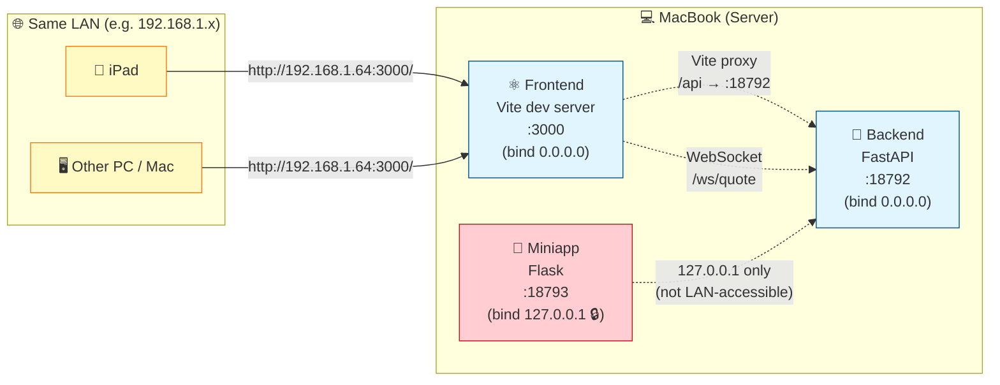

# StockPulse 系統架構 (ARCHITECTURE)

> 本文件描述 StockPulse 嘅系統架構、組件關係、data flow。
> 其他 AI 接手項目時，先讀 `README.md` → `PROJECT_SPEC.md` → **本文件**。

---

## 1. 系統全景 (System Overview)

```
┌─────────────────────────────────────────────────────────────────────┐
│                         StockPulse System                           │
│                                                                     │
│  ┌───────────────┐    ┌───────────────┐    ┌───────────────┐       │
│  │   Frontend    │    │   Backend     │    │    Miniapp    │       │
│  │   (port 3000) │ ←→ │  (port 18792) │ ←→ │ (port 18793)  │       │
│  │  React+Vite   │    │   FastAPI     │    │  Telegram Bot │       │
│  └───────┬───────┘    └───────┬───────┘    └───────┬───────┘       │
│          │ HTTP/WS           │                     │               │
│          └───────────────────┴─────────────────────┘               │
│                              │                                     │
│              ┌───────────────┴───────────────┐                     │
│              ↓                               ↓                     │
│     ┌─────────────────┐            ┌─────────────────┐            │
│     │   Data Tier     │            │  External APIs  │            │
│     │                 │            │                 │            │
│     │  SQLite (8 tbl) │            │  FutuOpenD      │            │
│     │  K-line cache   │            │  :11111         │            │
│     │  Event bus      │            │                 │            │
│     └─────────────────┘            │  MiniMax LLM    │            │
│                                    │  Kimi LLM       │            │
│                                    │  Gemini LLM     │            │
│                                    └─────────────────┘            │
└─────────────────────────────────────────────────────────────────────┘
```

### Tier 概覽

| Tier | 技術 | Port | 角色 |
|------|------|------|------|
| **Frontend** | React 18 + Vite 5 + Ant Design 5 + TS | 3000 | UI + WebSocket client |
| **Backend** | FastAPI + SQLAlchemy + Futu | 18792 | API + WS server + 算法 pipeline |
| **Miniapp** | Telegram Bot + 微信小程序 | 18793 | Mobile 簡化版 |
| **Data** | SQLite + in-memory cache | — | 持久化 + cache |
| **External** | FutuOpenD + LLM providers | 11111 (Futu) | 數據源 + AI |

---

## 2. Frontend Architecture

```
web/src/
├── main.tsx                       # Vite entry, mount <App/>
├── App.tsx                        # React Router setup (11 routes)
│
├── pages/                         # 13 頁面 (見 PROJECT_SPEC.md §UI 設計)
│   ├── HomePage/                  # 組別列表
│   ├── WatchlistPage/
│   ├── StrategyPage/
│   ├── AlgorithmStrategyPage/     # AS-XX 入口
│   ├── LibraryPage/               # Saved runs
│   ├── SettingsPage/              # LLM provider 切換
│   ├── CalendarPage/
│   └── ...
│
├── components/                    # 11 類組件庫
│   ├── common/                    # 通用 UI (Button/Card/Modal/...)
│   ├── layout/                    # AppLayout / Header / Sidebar / MobileNav
│   ├── stock/                     # StockCard / StockSearch / StockDetail
│   ├── group/                     # GroupCard / AddToGroupModal
│   ├── strategy/                  # StrategyEditor / StrategyResult
│   ├── algorithm/                 # AlgorithmSpec / RunButton / ProgressBar
│   ├── library/                   # ViewRunModal
│   ├── chart/                     # Lightweight Charts wrappers
│   ├── calendar/
│   ├── watchlist/
│   └── debug/
│
├── context/                       # React Context (global state)
│   ├── AuthContext                # 用戶登入狀態
│   ├── StockContext               # Stock list / watchlist
│   ├── WebSocketContext           # WS connection + 報價 stream
│   └── ThemeContext               # 暗色 / 亮色主題
│
├── hooks/                         # Custom hooks
│   ├── useWebSocket.ts
│   ├── useStockSearch.ts
│   ├── useGroups.ts
│   ├── useStrategy.ts
│   └── useWatchlist.ts
│
├── services/                      # API service layer (per resource)
│   ├── api.ts                     # axios / fetch wrapper
│   ├── stockService.ts
│   ├── groupService.ts
│   ├── strategyService.ts
│   ├── algorithmService.ts        # AS02 run / health
│   ├── libraryService.ts          # Saved runs CRUD
│   ├── settingsService.ts         # LLM provider 切換
│   └── wsService.ts               # WebSocket subscribe
│
└── types/                         # TypeScript 類型 (mirror backend models)
```

### 路由 (App.tsx)

| Path | Page | 角色 |
|------|------|------|
| `/login` | LoginPage | 登入 |
| `/` | HomePage | 組別列表 |
| `/watchlist` | WatchlistPage | 關注股票 |
| `/strategy` | StrategyPage | 策略管理 |
| `/algorithms` | AlgorithmStrategyPage | AS-XX 入口 |
| `/library` | LibraryPage | Saved runs |
| `/calendar` | CalendarPage | 日曆視圖 |
| `/settings` | SettingsPage | LLM provider 切換 |
| `/test-kline` | KlineDebugPage | Dev |
| `/ew-test` | ElliottWaveTestPage | Dev |
| `/grid-test` | GridTestPage | Dev |

### State management 策略
- **Local state** — `useState` / `useReducer` 喺 component 內
- **Shared state** — React Context (Auth/Stock/WS/Theme)
- **Server state** — 直接 fetch + local cache (冇用 Redux / SWR)
- **WebSocket state** — `WebSocketContext` 統一管理連線 + 報價 stream

---

## 3. Backend Architecture

```
backend/
├── main.py                        # FastAPI app + CORS + router mounts
│                                  #   - /api/* (HTTP)
│                                  #   - /ws/quote (WebSocket)
│                                  #   - /api/health (health check)
│
├── api/                           # HTTP Routes (11 modules)
│   ├── as02.py                    # POST /api/as02/run, GET /api/as02/health
│   ├── debug.py                   # GET /api/debug/* (dev only)
│   ├── group.py                   # /api/groups/* (9 endpoints)
│   ├── kline.py                   # GET /api/kline
│   ├── llm_settings.py            # /api/llm-settings/* (6 endpoints)
│   ├── plates.py                  # /api/plates/* (5 endpoints)
│   ├── saved_runs.py              # /api/saved-runs/* (9 endpoints)
│   ├── settings.py                # /api/settings/* (3 endpoints)
│   ├── stocks.py                  # /api/stocks/* (3 endpoints)
│   └── subscribe.py               # /api/subscribe/* (2 endpoints)
│
├── services/                      # 業務邏輯 (唔直接 expose HTTP)
│   ├── as02_analyzer.py           # AS02 公司質素分析 (核心)
│   ├── encryption.py              # API key 加密 (Fernet)
│   ├── event_bus.py               # 內部 event pub/sub
│   ├── futu_financials.py         # 從 Futu 攞財務數據
│   ├── kline_cache.py             # K 線 cache (memory + DB)
│   └── web_search.py              # MiniMax web search
│
├── llm/                           # LLM Provider Abstraction (NEW 2026-06)
│   ├── base.py                    # AbstractProvider interface
│   ├── factory.py                 # get_active_provider() — 單一入口
│   └── custom.py                  # OpenAI-compatible adapter
│
├── models/                        # SQLAlchemy ORM (8 tables)
│   ├── plate.py
│   ├── llm_settings.py            # API key encrypted at rest
│   ├── stock.py
│   ├── settings.py                # General key-value settings
│   ├── group.py
│   ├── group_stock.py
│   ├── saved_runs.py
│   └── algorithm_dq_log.py
│
├── futu_conn/                     # 富途行情 (port 11111)
│   ├── handler.py                 # QuoteHandler — 解析 push callback
│   └── subscription.py            # SubscriptionManager — 訂閱生命週期
│
├── ws/                            # WebSocket server
│   ├── manager.py                 # ConnectionManager — client 連線管理
│   ├── session.py                 # SessionManager — session 狀態
│   ├── broadcaster.py             # QuoteBroadcaster — quote 廣播
│   └── router.py                  # /ws/quote route
│
├── utils/
│   └── zh_normalize.py
│
├── scripts/                       # 一次性 scripts (板塊 populate / popularity compute)
└── tests/                         # pytest
```

### Layer 規則
- **api/** — 只負責 HTTP protocol (parse request, format response)
- **services/** — 業務邏輯，可以由 api / ws / 其他 services call
- **models/** — SQLAlchemy ORM，唔好喺呢度寫 business logic
- **llm/** — 唯一可以 import 個別 provider 嘅地方，**永遠** 經 factory
- **futu_conn/** — 隔離富途 SDK，外面唔可以直接 import futu

---

## 3.5 KlineCache v2 — Date-based Gap Detection (大少 #8602, 2026-08-06)

### 背景

舊 warm cache gap-fill 有 bug — 當 user query 嘅 `end < today`，`if today_in_range:` 跳過成個 Step 3 gap-fill，導致中間缺口（例如 HK.00700 2026-07-28 → 2026-08-04 嘅 7 日 gap）冇自動補返。

### 三個 Fix (OpenCode Daemon 落地)

| Fix | 內容 | 影響 |
|-----|------|------|
| **Fix 2** | `_compute_fetch_max_count(period)` helper | Cold + warm 共用 `max_count` override (30 yrs daily, 10 yrs other)；防止 caller 嘅 `max_count=100` miss 早期缺口 |
| **Fix 3** | `_fetch_today_bar()` 用 `ctx.get_cur_kline(num=1)` | 拎今日 intraday partial bar；T-1 rule 唔寫 DB |
| **Fix 4** | 刪走 `if today_in_range:` gate | Warm cache gap-fill 唔再受 user query 影響，永遠做 wide-fetch (`earliest_cached` → `today`) |

### Refactor 結構

```
get_or_fetch(code, ctx, ktype, period, start, end)
│
├─ Step 1: get_klines(code, period, start, end)
│          → user-range cached (for response merge)
│
├─ Step 2 (cold): _fetch_klines + _insert_klines(< today)
│          → full-range fetch 1996→today, insert all < today
│
├─ Step 3 (warm): wide-fetch earliest_cached → today
│          → diff OpenD vs FULL cache, fill missing (< today)
│          → NOT gated by today_in_range (Fix 4)
│
└─ Step 4: _fetch_today_bar (independent of path)
         → get_cur_kline(num=1), try/except fallback
         → append to all_klines_dict (overwrite history fetch 嘅 today bar)
```

### Helper Methods (extracted)

| Method | 角色 |
|--------|------|
| `_insert_klines(code, period, klines)` | DB INSERT OR REPLACE；caller 確保 `k['time'] < today` |
| `_fetch_klines(ctx, code, ktype, period, start, end, max_count)` | Pure OpenD fetch，no DB write |
| `_fetch_today_bar(ctx, code, ktype, period)` | Today real-time via `get_cur_kline()`；try/except 包住，mock 或 OpenD quirk → return None |
| `_compute_fetch_max_count(period)` | `1d` → 30×365；else → 10×365 |

### 永久 Rule (大少 #8602)

- ✅ Gap-fill 永遠做 wide-fetch (`earliest_cached → today`)，唔受 user query 嘅 `today_in_range` 影響
- ✅ Today 用 `get_cur_kline()` 而唔係 `request_history_kline()`（拎 intraday partial bar）
- ✅ Today NEVER 寫 DB（T-1 rule 不變 — 大少 #7983）
- ✅ Helper extraction — `_insert_klines` / `_fetch_klines` / `_fetch_today_bar` 拆出嚟，方便獨立 unit test
- ❌ 唔好再用 `max_count=100` caller default（會 miss 早期缺口）

### Test Coverage

`backend/tests/test_kline_cache.py` **14/14 pass**：

| Test | 驗證 |
|------|------|
| `test_gap_fill_db_jump` | DB 缺口自動 wide-fetch 補 |
| `test_today_in_response_not_in_db` | 今日 bar 喺 response 但唔入 DB |
| `test_repeat_call_today_not_duplicated` | 重複 call 唔重複今日 data |

### Source

- 大少 trigger #10714-#10721 (2026-08-06 02:15-02:19) — 問題發現 (00700 7-day gap) + workaround
- 大少 #8602 (OpenCode Daemon session 2026-08-06 02:08) — 3 個 fix 落地
- `backend/services/kline_cache.py` — 主要改動
- `backend/tests/test_kline_cache.py` — 14/14 tests pass
- `memory/2026-08-06-0208.md` — OpenCode session log

---

## 4. Algorithm Pipeline (AS02 detail)

```
[User clicks "Run" on /algorithms page]
          ↓
[Frontend POST /api/as02/run { stocks: ["HK.00700", ...] }]
          ↓
backend/api/as02.py::run_as02()
          ↓
backend/services/as02_analyzer.py::analyze_stocks(stocks)
          ↓
   for each stock:
          ↓
   analyze_one_stock(stock_code, provider)
          ↓
   ┌──────┴──────────────────────────────┐
   ↓                                     ↓
check_hard_dq_triggers()          futu_financials.get(stock_code)
   ↓                                     ↓
fail → algorithm_dq_log           calculate_financial_score()
   ↓                                     ↓
skip                          calculate_valuation_score()
                                        ↓
                                call_llm_analysis(provider, ...)
                                        ↓
                                backend/llm/factory.get_active_provider()
                                        ↓
                                AbstractProvider.chat_json()
                                        ↓
                                MiniMax / Kimi / Gemini / Custom
                                        ↓
                                (returns reason + scores)
                                        ↓
                                merge into final result
          ↓
[all stocks processed]
          ↓
backend/api/as02.py logs to algorithm_dq_log table (Python 寫 DQ trace - qualified + disqualified 全部)
          ↓
[Frontend 顯示結果 — 唔寫入 saved_runs]
          ↓
[User 手動點「💾 儲存 N 隻合格股票」button]
          ↓
[Frontend POST /api/saved-runs { algorithm_id: "AS-02", stocks: [...], saved_stocks: [...] }]
          ↓
backend/api/saved_runs.py::save_run()
          ↓
[Frontend navigates to /library]
```

> **📌 大少 2026-08-02 #9700 永久 rule:** AS-02 runtime endpoint (`/api/as02/run`) **唔可以** 寫入 `saved_algorithm_runs` table。execute 同 persist 行為唔可以 binding 死於單一 trigger — user 必須喺 frontend 手動點「💾 儲存」先入庫。原因：避免 execute 與 persist 行為 binding 死於單一 trigger,方便 user retry / refine 之後再決定儲存與否。詳細見 `ALGORITHM_SPECS.md` AS-XX 段嘅 none-auto-save rule。

### AS02 函數 (`backend/services/as02_analyzer.py`)

| Function | 角色 |
|----------|------|
| `check_hard_dq_triggers(financials)` | 財務數據 DQ check — missing/stale 即 fail |
| `calculate_financial_score(financials)` | 純數字計分 (ROE / margin / growth) |
| `calculate_valuation_score(financials)` | 估值分 (PE / PB / dividend) |
| `call_llm_analysis(provider, stock, financials, news)` | LLM 分析質素 + 故事 |
| `analyze_stocks(stocks)` | 批量入口 (parallel) |
| `analyze_one_stock(stock, provider)` | 單隻入口 |

### Data quality log
- 每個 DQ fail 都會寫入 `algorithm_dq_log` 表
- Severity: `warn` (可繼續) / `error` (skip 該 stock)
- 可以 query 統計某段時間 DQ rate

---

## 5. LLM Abstraction Layer

### 目標
- 統一所有 LLM call 嘅 interface
- 加新 provider = 加 1 個 adapter + register factory
- Fallback chain + retry policy 一處管理

### Interface (`backend/llm/base.py`)

```python
class AbstractProvider(ABC):
    @abstractmethod
    def chat(self, messages: list[dict], *,
             model: str | None = None,
             temperature: float = 0.3) -> str: ...

    @abstractmethod
    def chat_json(self, messages: list[dict], *,
                 schema: dict) -> dict: ...

    @abstractmethod
    def count_tokens(self, text: str) -> int: ...

    @abstractmethod
    def health_check(self) -> bool: ...
```

### Factory (`backend/llm/factory.py`)

```python
def get_active_provider() -> AbstractProvider:
    """單一入口。讀 llm_settings table 揾 active profile."""
    profile = db.query(LLMSettings).filter_by(is_active=True).first()
    return _build_provider(profile)
```

### Fallback chain (openclaw.json, 全局)

```json
{
  "agents": {
    "defaults": {
      "model": {
        "primary": "minimax/MiniMax-M3-highspeed",
        "fallbacks": ["minimax/MiniMax-M3", "minimax/MiniMax-M2.7"]
      }
    }
  },
  "auth": {
    "cooldowns": {
      "overloadedProfileRotations": 3,
      "rateLimitedProfileRotations": 3,
      "overloadedBackoffMs": 2000
    }
  }
}
```

### 規則 (重要!)
- ✅ 永遠 call `get_active_provider()` 或用 OpenClaw fallback chain
- ❌ 唔好 import 個別 provider 直接用
- ❌ 唔好 hard-code MiniMax / Kimi 嘅 endpoint
- ✅ API key 入 DB 必須 encrypt (`services/encryption.py` Fernet)
- ✅ 加新 provider 用 Settings UI (`/settings`)

---

## 6. Data Flow

### Flow A — 即時報價 (Real-time Quote)

```
[FutuOpenD push callback]
        ↓ (每 250ms 報價)
backend/futu_conn/handler.py::on_recv_quote()
        ↓
backend/services/event_bus.py::emit('quote', data)
        ↓
backend/ws/broadcaster.py (subscribe to 'quote' event)
        ↓
WebSocket.send() to all connected clients
        ↓
[Frontend WebSocketContext receives 'quote' message]
        ↓
update StockCard real-time price
```

### Flow B — Algorithm 執行

(見 §4 Algorithm Pipeline)

### Flow C — 用戶設定 LLM Provider

```
[User changes active provider on /settings page]
        ↓
[Frontend POST /api/llm-settings/switch { provider: "kimi" }]
        ↓
backend/api/llm_settings.py::switch_provider()
        ↓
db.update(LLMSettings.is_active) — atomic toggle
        ↓
[Frontend reloads settings, shows confirmation]
        ↓
[Next LLM call uses new provider via factory]
```

### Flow D — Saved Run 入庫

```
[AS02 run completes]
        ↓
backend/services/as02_analyzer.py returns List[Dict]
        ↓
backend/api/as02.py serializes to JSON
        ↓
db.insert(SavedRun)  with stocks + results + reason as JSON strings
        ↓
[User navigates to /library, GET /api/saved-runs]
        ↓
[Frontend renders runs in saved_runs table]
```

---

## 7. Miniapp Architecture

```
miniapp/
├── backend/main.py                # FastAPI (port 18793)
├── bot_command.py                 # Telegram Bot API (polling-based)
├── frontend/                      # 微信小程序 (Vue / WXML)
└── .env / .env.example
```

### 與主 backend 通訊
- Miniapp backend 唔直接 import 主 backend
- 用 HTTP client (`httpx`) call 主 backend API (e.g. `http://localhost:18792/api/...`)
- 共用同一個 SQLite DB (透過 SQLAlchemy 同 instance)

### Telegram Bot commands
- `/quote HK.00700` — 即時報價
- `/strategy list` — 列出 strategy
- `/run as02 HK.00700` — 簡易 AS02 run

---

## 8. External Dependencies

| 依賴 | 用途 | Failure handling |
|------|------|------------------|
| **FutuOpenD** (port 11111) | 報價 + K 線 + 財務數據 | auto-reconnect + retry subscribe |
| **MiniMax LLM** (`api.minimaxi.com`) | 主要 LLM provider | fallback chain + retry 3x |
| **Kimi LLM** (`api.moonshot.cn`) | 備選 (暫時未用) | 同上 |
| **Gemini** | planned | — |
| **SQLite** | 持久化 | WAL mode + 定期 backup |

### Critical: 連接依賴

- **Backend 啟動時必須 FutuOpenD 已運行**，否則 subscribe 全部 fail
- **LLM call 唔需要 Futu**，可以獨立運作 (Settings + Library 唔靠 Futu)
- **Frontend dev mode** 可以直接打 backend localhost:18792
- **Background services** — macOS LaunchAgent 自動管理 (2026-08-03 起) — Vite / Backend / Miniapp / Logrotate，reboot / crash 後 auto-restart

---

## 9. Deployment (production reference)

### 本地 dev (LaunchAgent-managed, 2026-08-03 起)

> 所有 background service 由 macOS LaunchAgent 自動管理 — reboot / crash 後 auto-restart。
> 修咗兩個 deadlock：(1) Vite reboot 後永遠死、(2) log 長期塞爆 disk (96% full)。

#### Service 清單

| Service | Label | Schedule | Port | Process |
|---------|-------|----------|------|---------|
| Backend | `com.stockpulse.trigger` | RunAtLoad + KeepAlive | 18792 | uvicorn main:app |
| Vite dev | `com.user.stockpulse-vite` | RunAtLoad + KeepAlive | 3000 | npm run dev |
| Miniapp | `com.user.stockpulse-miniapp` | RunAtLoad | 18793 | flask |
| Logrotate | `com.user.stockpulse-logrotate` | StartInterval=1800s (30min) | — | bash script |

#### 文件路徑

```
~/stockpulse/
├── scripts/
│   ├── start_vite.sh        # Vite launcher (absolute npm/node path)
│   └── rotate_logs.sh       # Safe rotation (tail + truncate)
└── logs/
    ├── vite.log             # Vite stdout/stderr
    ├── launchd.log          # Backend (uvicorn) log
    ├── stockpulse.log       # Python logging
    └── *.log.1 / .2 / .3    # Rotated backups (3 layers max)
~/Library/LaunchAgents/
├── com.stockpulse.trigger.plist
├── com.user.stockpulse-vite.plist
├── com.user.stockpulse-miniapp.plist
└── com.user.stockpulse-logrotate.plist
```

#### 啟動鏈條 (Frontend → Backend)

```
[User opens http://localhost:3000]
        ↓
[macOS launchd: com.user.stockpulse-vite RunAtLoad 已經起咗 Vite]
        ↓
Vite dev server 喺 port 3000 listen
        ↓
[Frontend 攞 /api/plates]
        ↓
[Vite proxy: /api → http://localhost:18792]
        ↓
[macOS launchd: com.stockpulse.trigger 已經起咗 Backend]
        ↓
Backend (uvicorn) 喺 port 18792 respond
```

#### 啟動鏈條 (FutuOpenD 報價)

```
[FutuOpenD 預先由大少人手啟動, port 11111]
        ↓
[Backend startup 連 OpenD 攞報價]
        ↓
[WebSocket push 落 Frontend]
```

**⚠️ 重要 — OpenD 唔由 LaunchAgent 管**，要由大少人手啟動 (`/Applications/Futu_OpenD.app`)。

#### 設計原則

1. **絕對 path + export PATH** — LaunchAgent 唔繼承 `~/.zshrc`，要 hard-code `/opt/homebrew/bin/npm` + `export PATH` 確保 child process 都搵到 node
2. **殺舊 → 釋 port → 起新** — `start_vite.sh` pattern 避免 double-bind (跟 start_trigger.sh)
3. **KeepAlive with SuccessfulExit=false** — crash 即 restart，但 intentional kill 唔會 loop
4. **ThrottleInterval=10** — 防 crash loop thrash
5. **Disk-safe rotation** — `rotate_logs.sh` 用 tail + truncate，**唔用 cp**（會 disk-double，tight space 必 crash）

#### 常用 commands

```bash
# Check status
launchctl list | grep stockpulse

# Reload (after edit plist)
launchctl unload ~/Library/LaunchAgents/com.user.stockpulse-vite.plist
launchctl load ~/Library/LaunchAgents/com.user.stockpulse-vite.plist

# 手動 trigger log rotation
bash ~/stockpulse/scripts/rotate_logs.sh

# Tail logs
tail -f ~/stockpulse/logs/vite.log
tail -f ~/stockpulse/logs/launchd.log
```

### Production (not yet)
- Backend: Docker + gunicorn
- Frontend: nginx static files
- DB: SQLite + Litestream (S3 backup)
- OpenD: 必須同機 (latency 考慮)

---

## 9.5 跨機訪問 (Cross-device LAN Access)

> **情境：** 大少喺屋企用 iPad / 第二部電腦訪問 StockPulse。
> **原理：** MacBook 跑 Backend + Frontend；其他設備透過 LAN IP 訪問。

### 拓樸圖 (Topology)



### 訪問鏈條詳解

| 步驟 | 動作 | 細節 |
|------|------|------|
| 1 | **用家查 MacBook LAN IP** | `ipconfig getifaddr en0` → e.g. `192.168.1.64` |
| 2 | **其他設備瀏覽器輸入** | `http://192.168.1.64:3000/` |
| 3 | **Frontend (Vite) 接到 request** | Vite dev server 喺 `0.0.0.0:3000`，所以 LAN 任何 device 都摸得到 |
| 4 | **Frontend 要打 backend API** | 唔係直接打 LAN IP，而係打 `window.location.hostname` (即 `192.168.1.64:18792`) → Vite proxy 轉去 localhost:18792 |
| 5 | **Backend 接到 request** | Backend 喺 `0.0.0.0:18792`，響 MacBook 本機處理 |
| 6 | **WebSocket 一樣** | `ws://192.168.1.64:18792/ws/quote`，proxy 內部轉去 localhost |

### Frontend LAN fallback chain (QW-2a)

`web/src/config/api.ts` 嘅 API host resolution 順序：

```
1. import.meta.env.VITE_API_BASE  ← 最高優先 (build-time env)
2. window.location.hostname      ← 自動 fallback (i.e. 用家個 browser URL 個 host)
3. 'localhost' (default)          ← dev 預設
```

**點解咁重要：**
- 大少喺 MacBook 自己開 → `window.location.hostname` = `localhost` → backend 用 localhost ✅
- 大少喺 iPad 訪問 → `window.location.hostname` = `192.168.1.64` → backend 用 LAN IP ✅
- 唔使 hardcode！同一份 build 兩個地方都 work

### Miniapp 鎖本地 (QW-1)

Miniapp backend (port 18793) 已經喺 QW-1 改 bind `127.0.0.1`：

- ✅ MacBook 自己用 Telegram bot command → OK
- ❌ 其他 LAN 設備 → 唔可以直訪問 Miniapp backend
- 🔒 原因：Miniapp backend 設計上只係 bot 嘅 internal API，唔需要對外

> 📘 詳細 PUBLIC / LOOPBACK 分類見 `~/.openclaw/workspace-main/PORTS.md`
> 📘 凡人 step-by-step 教學見 `README.md` §「🌐 其他電腦訪問 StockPulse」

---

## 10. 設計 trade-offs (要知)

| 決策 | 原因 | Trade-off |
|------|------|-----------|
| SQLite (not Postgres) | 單機部署 + 簡單 | 唔支援 concurrent write 多 |
| 冇用 Redux/SWR | 簡單 | Server state 唔自動 refetch |
| LLM abstraction 而唔直接 call MiniMax | 加新 provider 易 | 多一層 indirection |
| AlgoSpec 喺 `.md` 而唔係 code | 大少易改 | 要 sync script 確保一致 |
| Miniapp 共用 SQLite | 簡單 | 唔可以 horizontal scale |
| WebSocket (not SSE) | bidirectional | 連線管理複雜 |

---

_最後更新：2026-08-03 (LaunchAgent 永久 fix: Vite + logrotate)_
---

## 📦 Stock Reasons Architecture (大少 #9920)

### 改動概要

原本每隻 stock 嘅 reason 喺 `saved_stocks[i].reason` (String, plain text)，新架構獨立 `stock_reasons` table 儲存 sanitized HTML，獨立 components 渲染 PopUp。

### Data Flow

```
[Algorithm run] → backend/services/<algo>_analyzer.build_<algo>_reason_html(result)
                ↓
[Frontend SaveRunModal] → POST /api/saved-runs { ..., reasons: [{code, source_type, source_ref, title, html}] }
                ↓
[Backend api/saved_runs.py] → sanitize_html(req.html) → models.stock_reasons.upsert_reasons_batch()
                ↓
[SQLite stock_reasons table] → UNIQUE(code, source_type, source_ref) ON CONFLICT DO UPDATE
                ↓
[Frontend ViewRunModal] → ReasonCell v2 → useStockReasons(code) → GET /api/stock-reasons?code=X
                ↓
[Title list rendered] → click title → ReasonPopUp (DOMPurify sanitized HTML, 900px modal)
```

### Sanitization Pipeline (defense-in-depth)

1. **Algorithm-side** — `build_<algo>_reason_html()` 寫 structured HTML (no user input)
2. **Backend write** — `services.html_sanitizer.sanitize_html()` 用 bleach + post-scrub regex 移除 XSS vectors
3. **Frontend render** — `DOMPurify.sanitize()` client-side 第二重保險
4. **CSP** (將來 optional) — iframe sandbox 為極端 paranoia level

### 累積語意 (Q1 Smart Dedupe)

- 同 `(code, source_type, source_ref)` 重做 → **overwrite 最新** (RECOVER semantics)
- 唔同 algorithm (AS-01 vs AS-02) → 分開 row
- 唔同 source_type (algorithm vs manual) → 分開 row
- Result: ViewRunModal 入面睇一隻 stock 嘅 reasons = 全部做過嘅 algorithm reports + 任何 manual/news/research


---

## ⚠️ CSS Module Scoping in innerHTML (Permanent Rule, 2026-08-04)

**Problem**: 2026-08-04 大少 screenshot 報「什麼 Chart 都沒有」 — bar chart 0 width render 唔出

**Root Cause**:
```css
/* Vite CSS Modules 編譯時 scope 變 local */
.dim-row { display: flex; }     /* → ReasonPopUp_dim-row__abc123 */
.dim-bar-bg { height: 22px; }  /* → ReasonPopUp_dim-bar-bg__abc123 */
```
但 `dangerouslySetInnerHTML` content 嘅 class 係 raw:
```html
<div class="dim-row">...</div>  <!-- 仍然係 dim-row -->
```

**CSS 變 `_dim-row__abc123`，HTML 係 `dim-row` — selector 唔 match，styles 唔 apply**。

### 解決方案

凡係 component 嘅 HTML content 用 `dangerouslySetInnerHTML`，module.css 入面對應嘅 class 必須加 `:global()` 前綴：

```css
/* Fixed — 用 :global() keep raw class name */
:global(.dim-row) {
  display: flex;
  align-items: center;
  margin: 12px 0;
  gap: 14px;
}

:global(.dim-bar-bg) {
  flex: 1;
  height: 22px;
  background: rgba(255, 255, 255, 0.08);
  border-radius: 6px;
}
```

編譯後變:
```css
.dim-row { display: flex; ... }   /* global, no scoping */
.dim-bar-bg { height: 22px; ... }
```

跟 raw HTML `class="dim-row"` match ✅。

### 應用範圍 (大少 #9920 + #10031)

- `web/src/components/library/ReasonPopUp.module.css` — 32 個 `:global()` wrappers (bar chart + score colors + width classes)
- 將來其他 component 用 innerHTML 都要跟呢條 rule


---

## 🎨 Dim-Score Background Pill (大少 #10176, 2026-08-04)

### 設計 Trigger

大少 screenshot #10176 (HK.01347 AS-02 PopUp)：6 個 dimension 紅框（right side `dim-score`）只 show 純文字，score 數字同紅框嘅關聯唔夠 clear。Trigger：紅框加 score 數字 — 但 `dim-score` 已經有 text（`{v:.1f}`），所以 enhancement 純 CSS：將純文字 span 改 background pill。

### 設計 (大少 #10176)

**PopUp** (`ReasonPopUp.module.css`): `.dim-score` 改 background pill — 顯眼嘅 full-color background + 白字。

```css
/* 大少 #10176: 紅框 background pill — score 數字顯眼 */
:global(.dim-score) {
  flex: 0 0 64px;        /* up from 60px (pill 預留空間) */
  text-align: center;    /* changed from right (text-align center for pill) */
  font-weight: 700;
  font-size: 19px;
  padding: 2px 0;
  border-radius: 6px;
  background: rgba(255, 255, 255, 0.1);   /* fallback 半透明 */
  color: rgba(255, 255, 255, 0.95);
}

:global(.dim-score.score-high) {
  background: #52c41a;   /* 綠 full-color */
  color: #fff;
}
:global(.dim-score.score-med) {
  background: #faad14;   /* 黃 full-color */
  color: #fff;
}
:global(.dim-score.score-low) {
  background: #ff4d4f;   /* 紅 full-color */
  color: #fff;
}
```

**Backend HTML 唔需要改** — `build_as01_reason_html` / `build_as02_reason_html` 入面 `<span class="dim-score">70.0</span>` 已經有 score text，CSS 改即時對 stock_reasons table 入面嘅舊 HTML 生效（sanitize 後 class 保留）。

### AS-02「結果」inline (大少 #10176, AS02ResultPanel.tsx)

AS-02 inline render 用 AntD `<Progress>` component（唔用 `dim-bar` / `dim-score` custom CSS），已經有 `format` 函數顯示分數。原本 `format={(p) => \`${p?.toFixed(0) ?? 0}\`}` 用整數，改做 `${p?.toFixed(1) ?? '0.0'}` 顯示一位小數（與 PopUp 入面 `dim-score` 一致）。Stroke color 已分數 class 顯示（high 綠 / med 黃 / low 紅）。

### AS-01「結果」inline

AS-01「結果」inline (`ResultGrid.tsx`) 用 `ReasonCell` plain text mode（mirror #10097），唔屬 dimension bar 模式，**唔影響**呢個 scope。

### 行為對照 (大少 #10176 verify)

| 位置 | Before (#10176) | After (#10176) |
|---|---|---|
| PopUp `dim-score` | 純文字 19px, color by class, 冇 background | Background pill 64px, full-color (高/黃/紅), 白字 |
| AS-02 inline `Progress` format | 整數 (e.g. 70) | 一位小數 (e.g. 70.0) |
| AS-01 inline | plain text (ReasonCell) | — (唔變) |


---

## 📌 Update Stockpluse Trigger — 永久 Rule (大少 #10203, 2026-08-04 07:56)

### Trigger Keywords (case insensitive)

| Keyword | 備註 |
|---|---|
| `更新Stockpluse` | 大少 typo form (常見) |
| `Update Stockpluse` | typo form |
| `Update StockPulse` | correct form |
| `update stockpluse` / `update stockpulse` | lowercase 都收 |

大少 trigger 任何一個 keyword, 自動執行下面 4 個 steps — **唔再 ask 大少 confirm trigger 邊個** (override `#9664` 嘅「問大少 confirm trigger 邊個」rule)。

### Auto-execute 4 Steps

| Step | Action | File / Repo |
|---|---|---|
| **1** | Update ARCHITECTURE.md | `~/stockpulse/ARCHITECTURE.md` (append new feature section) |
| **2** | Update STOCKPULSE_REFERENCE.md | `~/.openclaw/workspace-main/STOCKPULSE_REFERENCE.md` (append new feature section) |
| **3** | Daily Log | `~/.openclaw/workspace-main/memory/YYYY-MM-DD.md` (append entry 記錄新 feature + spec update) |
| **4** | Commit And Push | `~/stockpulse` + `~/.openclaw/workspace-main` 兩個 repos |

### Override `#9664` StockPulse Spec Update Protocol

- ✅ `#9664` rule 仍然 work 但「直接做」4 steps (唔再 ask confirm) 當 trigger keyword match
- ✅ 其他 trigger (大少「普通 spec update」唔 trigger keyword) 仍然 follow `#9664` 嘅「建議 update + 等大少 confirm」flow

### Apply Scope

- ✅ 所有 StockPulse feature commit 之後大少 trigger「Update Stockpluse」
- ✅ Override 之前 `#9664` 嘅「問大少 confirm trigger 邊個」rule 對呢個 trigger keyword
- ❌ 其他 trigger (大少「普通 spec update」) 仍然 follow `#9664` rule

### Trigger Source

- 大少 2026-08-04 07:56:01 GMT+8 message #10203: 「記住以後當我講更新Stockpluse或Update Stockpluse，你就做Update ARCHITECTURE.md + STOCKPULSE_REFERENCE.md ＋ Daily Log ＋ Commit And Push」

---

## 📦 AS-01 Reason HTML Build Flow (大少 #10075, 2026-08-04)

### Flow Diagram

```
[AS-01 Algorithm run] → backend/models/plate.py::run_plate_leaders()
  → per-plate _rank_one_plate() → emit leaders with mcap_rank / volume_rank / score
  ↓
[Frontend AS-01 panel] → POST /api/saved-runs {algorithm_id: "AS-01", saved_stocks: [Leader with raw fields]}
  ↓
[Backend api/saved_runs.py] → save_run() auto-build block:
  - Group saved_stocks by plate_code
  - For each plate, compute plate_total = len(plate_stocks)
  - Call build_as01_reason_html(stock, plate_total_stocks=plate_total)
  - Append to all_reasons list
  - sanitize_html() + upsert_reasons_batch() → SQLite stock_reasons table
  ↓
[SQLite stock_reasons table] → UNIQUE(code, source_type, source_ref) ON CONFLICT DO UPDATE
  ↓
[Frontend ViewRunModal] → ReasonCell v2 → useStockReasons(code) → GET /api/stock-reasons?code=***
  ↓
[Title list rendered] → click title → ReasonPopUp (DOMPurify sanitized HTML, 1000px modal)
  → 4 個維度 bar chart + 顏色 + 龍頭因素分析
```

### Key Architectural Decisions (大少 #10075)

1. **Plate-grouping**: Backend auto-build 時按 `plate_code` group stocks — 同一板塊內所有 stocks 嘅 relative rank width 一致 (e.g. 全部 #1 都係 w-100, 全部 #5 都係 w-50)。
2. **4 個維度 display weights**: 40/40/10/10 (市值/成交量/綜合/龍頭度) — display 而唔係 algorithm weight。實際 AS-01 algorithm 只用 mcap_rank + volume_rank (50/50)。
3. **Cross-cutting helpers** (`_score_class`, `_width_class`): Duplicated 喺 `models/plate.py` 同 `services/as02_analyzer.py` — 唔 extract 避免 scope creep (將來可抽 `utils/scoring.py`)。
4. **Generic v2 template pattern**: 每個 algorithm 都用同一個 stock_reasons table (title + html + score_class + width_class) — 將來 AS-03/AS-04 跟同一個 pattern。


---

## 📋 Hybrid Reason Display — AS-01 vs AS-02 (大少 #10097, 2026-08-04)

### Decision Matrix

| 維度 | AS-01 板塊龍頭股 | AS-02 公司質素分析 |
|---|---|---|
| Reason 複雜度 | 簡單 (~30 chars plain text) | 複雜 (~1500 chars HTML with bar chart) |
| Data source | `_generate_reason()` 喺 AS-01 ranking | `build_as02_reason_html()` + LLM analysis |
| 即時 inline display | ✅ 喺 ResultGrid (ResultGrid.tsx line ~150) | ❌ 用 AS02StockCard panel 顯示分數 |
| Library PopUp | ✅ stock_reasons table (build_as01_reason_html v1) | ✅ stock_reasons table (build_as02_reason_html v2) |
| Title 喺 PopUp | "板塊龍頭股篩選" | "公司質素分析篩選" |

### Rationale (大少 #10097)

AS-01 reason ("市值 top 1 (5324億) / 成交 top 1") 太短太簡單，inline display 已經夠 clear。PopUp 反而 over-engineered (需 user 額外 click 睇)。

AS-02 reason 太複雜 (6 dimensions × score × LLM summary × 龍頭因素)，inline 顯示 會擠到 grid。所以用 stock_reasons table + PopUp。

### Implementation Diff (大少 #10097, 1 file edit)

`web/src/components/algorithm/ResultGrid.tsx`:
- Added: `{stock.reason && <Text type="secondary">{stock.reason}</Text>}` conditional render
- Comment: 大少 #10097 註明係 AS-01 inline，AS-02 仍用 stock_reasons PopUp (大少 #9920)
- No backend changes (saved_stocks[i].reason 已經 populated by `_generate_reason()` 喺 AS-01 ranking)
- No spec changes for stock_reasons table schema


---

## 📋 ViewRunModal Per-Run Scoped Query (大少 #10103, 2026-08-04)

### Data Flow Update (per-run scoped)

```
[Frontend ViewRunModal #86 (AS-01, 10 stocks)]
  ↓
[ReasonCell v2 (code="HK.00981", runId=86)]
  ↓
[useStockReasons(code="HK.00981", sourceRunId=86)]
  ↓
[GET /api/stock-reasons?code=HK.00981&source_run_id=86]
  ↓
[Backend list_reasons endpoint → list_reasons_filtered()]
  ↓
[SELECT * FROM stock_reasons
 WHERE code IN (codes from saved_algorithm_runs #86 saved_stocks)
   AND is_active = 1
 ORDER BY created_at DESC]
  ↓
[Return only reasons for stocks IN #86 run's saved_stocks]
  ↓
[Frontend render title list (1 reason: AS-01)]
```

### Old vs New Display Logic

| Scenario | Old (bug) | New (大少 #10103) |
|---|---|---|
| ViewRunModal #86 (AS-01), HK.00981 stock | Show AS-01 + AS-02 reasons (cross-algorithm stale) | Show AS-01 only (per-run scoped) |
| ViewRunModal #89 (AS-02 + HK.00981 qualified), HK.00981 stock | Show AS-01 + AS-02 reasons | Show AS-01 + AS-02 (cross-algorithm accumulation 保留) |
| ViewRunModal #90 (AS-02, HK.00981 disqualified) | HK.00981 不會出現 (frontend filter) | 同 left (frontend filter 已經 work) |

### Key Architectural Decisions

1. **Per-run scoping** (新): ViewRunModal 顯示嘅 reasons 只限於 嗰個 run 嘅 saved_stocks 入面 stocks 嘅 algorithm reasons. 解決 cross-run cross-algorithm stale display.
2. **Cross-algorithm accumulation** (保留): 如果同一 stock 曾經 qualified for 多個 algorithms, 嗰個 stock 嘅 reasons 全部都 show. Example: AS-01 #86 + AS-02 #89 都 qualify 同一 stock → ViewRunModal #89 顯示 2 條 reasons.
3. **Frontend filter 已經 work** (大少 #10105 確認): AS-02 panel `onSave` 只 pass qualified stocks. Backend 唔需要 enforce qualification check. Backend auto-build 只 insert `saved_stacks` 入面嘅 stocks → 自然 qualified-only.
4. **Backward compat**: `code`-only query (no source_run_id) 仍然 work (cross-run cross-algorithm aggregation). 為咗 AS-01 結果頁面 inline render (without runId context).


---

## 📋 ViewRunModal Per-Run Scoped Query — Option C (大少 #10144, 2026-08-04 07:03)

### Decision

取代 commit `f25d287f` 嘅 source_ref hard filter，改用 **is_stale runtime flag** + UI filter。

### Final Implementation (大少 #10144)

```python
# backend/models/stock_reasons.py::list_reasons_filtered

if source_run_id is not None:
    run_row = conn.execute(
        "SELECT algorithm_id, saved_stocks FROM saved_algorithm_runs WHERE id = ?",
        (source_run_id,),
    ).fetchone()
    run_algorithm_id = run_row["algorithm_id"]
    codes_in_run = [...]
    
    # SQL filter: code IN run's stocks (唔 filter source_ref — 保留 accumulation)
    where_parts: list[str] = []
    params: list[Any] = []
    if code:
        where_parts.append("code = ?")
        params.append(code)
    else:
        placeholders = ",".join(["?"] * len(codes_in_run))
        where_parts.append(f"code IN ({placeholders})")
        params.extend(codes_in_run)
    where_parts.append("is_active = 1")
    
    rows = conn.execute(
        f"SELECT * FROM stock_reasons WHERE {' AND '.join(where_parts)} ORDER BY created_at DESC",
        params,
    ).fetchall()
    
    # Compute is_stale per reason (Option C runtime flag)
    results: list[dict[str, Any]] = []
    for row in rows:
        d = _row_to_dict(row)
        d["is_stale"] = (
            d["source_run_id"] != source_run_id        # 跨-run
            and d["source_ref"] != run_algorithm_id    # 跨-algorithm
        )
        results.append(d)
    return results
```

```typescript
// web/src/components/library/ReasonCell.tsx (frontend filter)
const { reasons, loading } = useStockReasons(code, runId);
const visibleReasons = reasons.filter((r) => !r.is_stale);  // hide stale
```

### Data Flow Update (Option C)

```
[Frontend ViewRunModal #86 (AS-01, 10 stocks)]
  ↓
[ReasonCell v2 (code="HK.00981", runId=86)]
  ↓
[useStockReasons(code="HK.00981", sourceRunId=86)]
  ↓
[GET /api/stock-reasons?code=HK.00981&source_run_id=86]
  ↓
[Backend list_reasons_filtered(code, source_run_id=86)]
  ↓
[SELECT * FROM stock_reasons
 WHERE code = HK.00981
   AND is_active = 1
 ORDER BY created_at DESC]
 ↓
[For each row, compute is_stale based on run #86 (AS-01) context]
 ↓
[Return reasons + is_stale flag (id=34 AS-01 NOT stale + id=1 AS-02 STALE)]
 ↓
[Frontend filter: visibleReasons = reasons.filter(r => !r.is_stale)]
 ↓
[Render 1 AS-01 title only (hide AS-02 stale)]
```

### Smoke Test Evidence (大少 #10144 verification, 5/5 pass)

| Scenario | Expected | Actual | Result |
|---|---|---|---|
| AS-01 #86, HK.00981 | 1 visible (AS-01) + 1 stale (AS-02) | id=34 stale=False + id=1 stale=True | ✅ |
| AS-01 #83, HK.00981 | 1 visible (AS-01) + 1 stale (AS-02) | id=34 stale=False + id=1 stale=True | ✅ |
| AS-02 #52, HK.00981 | 1 stale (AS-01) + 1 visible (AS-02) | id=34 stale=True + id=1 stale=False | ✅ |
| AS-02 #82, HK.00981 | 1 stale (AS-01) + 1 visible (AS-02) | id=34 stale=True + id=1 stale=False | ✅ |
| code='HK.00981' (no run_id) | 全部 not stale (caller 冇 context) | id=34, id=1 stale=False | ✅ |
| HK.99999 + run_id=86 | 0 reasons | 0 reasons | ✅ |

### Key Architectural Decisions (Option C)

1. **Per-run scoping (SQL)**: `code IN (run's stocks)` — 保留 accumulation, 唔做 source_ref hard filter。
2. **is_stale runtime flag (Python)**: 每個 reason compute `is_stale = (cross-run) AND (cross-algo)` — runtime attribute, 唔做 DB column。
3. **UI filter (Frontend)**: `visibleReasons = reasons.filter(r => !r.is_stale)` — 1 行 hide stale。
4. **Cross-algorithm accumulation 保留**: 同一 stock 跨-run 同-algo 嘅 reasons 全部 not stale (visible)。例: HK.00981 AS-01 from #87 喺 AS-01 #86/#83 view 都 NOT stale (accumulation)。
5. **Cross-algorithm stale hide**: HK.00981 AS-02 from #82 喺 AS-01 #86 view STALE (hide)；AS-01 from #87 喺 AS-02 #52/#82 view STALE (hide)。
6. **Frontend filter 已經 work (大少 #10105)**: AS-02 panel `onSave` 只 pass qualified stocks. Backend 唔需要 enforce qualification check。
7. **Backward compat**: code-only query (no source_run_id) 仍然 work, 全部 `is_stale=False` (e.g. AS-01「結果」頁面 inline render)。

### f25d287f → 075ff644 Comparison

| 項目 | f25d287f (hard filter) | 075ff644 (Option C) |
|---|---|---|
| Cross-algo cross-run stale leak | ❌ Filter 咗 | ❌ UI filter 咗 |
| Cross-run same-algo accumulation | ❌ 失效 | ✅ 保留 |
| Backend SQL 複雜度 | 中 (JOIN + filter) | 低 (code IN only) |
| Frontend 邏輯 | 簡單 (顯示) | 加 1 行 filter |
| Design intent | 嚴格 per-run algorithm | 保留 accumulation + hide stale |

---

## N. Algorithm Layer — `algorithms/` (AS-03 股票周期性判定)

> **新章節 (2026-08-04)** — AS-03 cycle detection sub-project

### 位置

```
~/stockpulse/algorithms/AS-03-cycle-detection/
├── README.md           # 入口 + 快速開始
├── ARCHITECTURE.md     # 完整架構 + 數據流
├── DECISIONS.md        # D001-D010 ADR 決策記錄
├── types.ts            # CycleState / Verdict / Report / Alert 共用類型
├── config.ts           # 所有 tunable thresholds (DEFAULT_CYCLE_CONFIG)
├── data-loader.ts      # HTTP client → GET /api/kline (cache-aside 沿用)
├── index.ts            # CycleDetector 主入口 (runModule / analyze)
├── modules/            # 5 個 peer modules (Module 1-5)
│   ├── ma-alignment.ts
│   ├── hl-structure.ts
│   ├── trendline.ts
│   ├── indicators.ts
│   └── volume.ts
├── orchestrator/       # Module 6 + 7 + 輔助
│   ├── multi-tf.ts     # Module 6 — HTF 約束 LTF (orchestrator step 0)
│   ├── synthesize.ts   # Module 7 — placeholder
│   ├── aggregator.ts   # conflict resolution (placeholder)
│   └── alert.ts        # regime change reminders
└── __tests__/smoke.mjs
```

### 目標

識別股票當前所處嘅周期 (上升 / 下跌 / 橫行 / 轉勢)，輔助大少做交易決策。

### 架構 (7 個點)

- **Module 1-5** (peer modules): MA Alignment, HL Structure, Trendline, Indicators, Volume — 每個都係獨立判斷方法，可單獨調用
- **Module 6** (orchestrator step 0): MultiTFOrchestrator — HTF 約束 LTF (架構上唔係 peer, 見 D001)
- **Module 7** (orchestrator): Synthesizer + Aggregator — placeholder majority vote (D004 待大少決定策略)
- **RegimeChangeAlerter**: 轉勢時 emit alert，大少手動 confirm (D003 唔做 state machine)

### 4 個 Cycle State (D002)

`UP | DOWN | SIDEWAYS | TRANSITION` + 每個 verdict 必填 `interpretation: string` 中文解讀

### 數據來源 (D008)

- **Frontend (data-loader.ts)** HTTP client → `GET /api/kline`
- **Backend `KlineCache`** (cache-aside) 處理 DB + 當日 OpenD 組合
- AS-03 唔需要 re-implement cache — backend 已有 (`backend/services/kline_cache.py`)

### 狀態

- **v0.1.0-skeleton** (2026-08-04) — 5 peer modules + orchestrator + alert 全部 return placeholder verdict (`state='TRANSITION'`, `confidence=0`)
- 等待大少逐個 module 提供詳細做法後實作
- tsc type-check **EXIT=0**

### 相關文檔

- [AS-03 README](../algorithms/AS-03-cycle-detection/README.md)
- [AS-03 ARCHITECTURE.md](../algorithms/AS-03-cycle-detection/ARCHITECTURE.md)
- [AS-03 DECISIONS.md](../algorithms/AS-03-cycle-detection/DECISIONS.md)
- [AS-03 RESEARCH_LOG](../docs/research/AS-03-cycle-detection/RESEARCH_LOG.md)

### Apply Scope (永久 rules)

- ✅ 6 個 module 全包 (D009 / Q3) — 唔分 priority
- ✅ 6 個 model 結果都顯示 (D006) — UI 顯示 5 peer + 1 HTF + 1 synthesized = 7 個 verdict card
- ⚠️ Backtest ground truth (D010 / Q4) — 暫緩，日後先傾
- ⚠️ Synthesizer 策略 (D004) — 3 選 1 (htf-override / weighted-vote / expert-rules)，最後先定


---

## 10. AS-03 算法層 (v0.3.0, 2026-08-04 大少 #10332)

AS-03 係 StockPulse 第一個完全實裝嘅 stock analysis algorithm (Module 1 ma-alignment done)。

### 架構圖

```
┌─────────────────────────────────────────────────────┐
│  AS-03 Cycle Detector                                │
│  algorithms/AS-03-cycle-detection/index.ts          │
└───────────────────┬─────────────────────────────────┘
                    │
   ┌────────────────┼────────────────┐
   ▼                ▼                ▼
┌────────┐   ┌─────────────┐   ┌──────────┐
│ 5 Peer │   │ MultiTF     │   │  Synth   │
│Module  │   │Orchestrator │   │ (Module7)│
│ 1-5    │   │ (Module 6)  │   │          │
└───┬────┘   └─────────────┘   └──────────┘
    │
    ├─ Module 1: ma-alignment (v0.3.0 ✅ DONE — 19/19 tests pass)
    ├─ Module 2: hl-structure (v0.1.0 ✅ DONE)
    ├─ Module 3: trendline (v0.1.0 ✅ DONE — 14/14 tests pass, 大少 #11031)
    ├─ Module 4: indicators (⏳ TBD)
    └─ Module 5: volume OBV (⏳ TBD — 等新 Model)
```

### Module 1: ma-alignment 嘅 10 條算法 (A-J)

| # | 算法 | 規則 | 對應 state |
|---|------|------|-----------|
| A | 上升勢 | 連續 5 日 MA5 > MA60 | UP |
| B | 下跌勢 | 連續 5 日 MA5 < MA60 | DOWN |
| C | 橫行向下 | 5 日裡 MA5 > MA60 但當日 low < MA60 | SIDEWAYS |
| D | 橫行向上 | 5 日裡 MA5 < MA60 但當日 high > MA60 | SIDEWAYS |
| E | 末位日優先 | C/D 多過一日，最後一日為準 | (隱含) |
| F | 升勢調整向下 | MA5+MA10 都 > MA60 但 MA5 < MA10 | UP |
| G | 跌勢調整向上 | MA5+MA10 都 < MA60 但 MA5 > MA10 | DOWN |
| H | 7 日趨勢反轉 | 1/2/3 日新方向 vs 4-7 日舊方向 (3 sub-case) | TRANSITION |
| I | 有機會長升狀態 | 連續 5 日 low ≥ MA5 × 0.98 | supplementary |
| J | 有機會長跌狀態 | 連續 5 日 high ≤ MA5 × 1.02 | supplementary |

### 數據流向

```
[backend /api/kline] (cache-aside: DB + 當日 OpenD)
       ↓
[CycleDetector.analyze(symbol, ltf)]
       ↓
[DataLoader.loadKLines()] → KLine[]
       ↓
[5 Peer Modules.runModule(KLine[], ctx)]
       ├─ ma-alignment → CycleVerdict (A-J rules fired)
       ├─ hl-structure → CycleVerdict (placeholder)
       ├─ trendline → CycleVerdict (placeholder)
       ├─ indicators → CycleVerdict (placeholder)
       └─ volume → CycleVerdict (placeholder)
       ↓
[Synthesizer] → Final CycleVerdict (待 D004 strategy 落實)
       ↓
[RegimeChangeAlerter] (D003 手動 confirm)
       ↓
UI: 5 peer + 1 HTF + 1 synthesized = 7 個 verdict card (D006)
```

### Spec

- Spec: `~/stockpulse/docs/research/AS-03-cycle-detection/MODULE-01-MA-ALIGNMENT.md`
- Code: `~/stockpulse/algorithms/AS-03-cycle-detection/`
- Tests: 19/19 pass, TSC=0

### 已 Drop (v0.2.0 Kimi 13 個算法)

Step 1-7a-d + magic numbers。原因：三個折扣叠太狠 (worst case 0.31)。

---

## §11 · Algorithm Testing Page（2026-08-05, 大少 #10383）

> **背景：** AS-03 算法已 implement + tested，但 StockPulse web/backend 仲未接。為咗畀大少人手測試，建咗 standalone testing page framework。

### Folder Structure

```
~/stockpulse/
├── testing-page/                              ← 中央 testing framework
│   ├── index.html                             ← 主頁
│   ├── testing-page.js                        ← Logic (algorithm registry + dynamic UI)
│   ├── testing-page.css                       ← Style
│   ├── start.command                          ← 啟動 script（nohup + auto-open browser）
│   └── REGISTRY.md                            ← Algorithm list + 加新 AS-XX 步驟
└── algorithms/
    └── AS-03-cycle-detection/
        ├── adapter.mjs                        ← AS-03 adapter（vanilla JS port of ma-alignment.ts）
        └── ... (existing files)
```

### Adapter Pattern（永久 contract）

每個 algorithm 寫 `adapter.mjs`：
```javascript
export const id, name, version, description;
export const inputs = [...];                  // 'string' | 'number' | 'select' | 'autocomplete'
export async function analyze(klines, options) { return verdict; }
export function renderResult(verdict) { return HTML_string; }
export function getHelp() { return HTML_string; }
```

Testing page 自動 discover + render。加新 algorithm 只需要：
1. 寫 `adapter.mjs`
2. 加 1 行落 `testing-page.js` 嘅 `REGISTRY`
3. Browser reload

### Backend Integration

| Resource | Endpoint |
|----------|----------|
| K 線 | `GET /api/kline?code=***&period=***&count=***` |
| 股票搜尋 | `GET /api/stocks/search?q=***&market=HK|US&limit=***` |
| 跑算法 (generic) | TBD — AS-XX 自己實作 `/api/asXX/run` |

### K 線圖表（testing page 自己 render，2026-08-05 大少 #10431）

大少想撳完 AS-03 test 後下邊出日 K 線圖表，full width。原本想 iframe embed StockPulse，但發現 HomePage default 入面係 watchlist widget 唔係 chart（要 user 揀 stock + 登入）。

**最終方案：** CDN load lightweight-charts v4.2.3，vanilla JS render candlestick + volume。
- ✅ 100% width
- ✅ height 600px
- ✅ Auto render 撳完「跑算法」後
- ✅ Dispose 舊 chart + render 新嘅

**Permanent Rule：** testing page 自己 render chart，唔 iframe embed StockPulse。

### Server Lifecycle

- `start.command` 用 `nohup + disown`（server survive terminal close）
- Auto `open http://localhost:8765/testing-page/`（大少 #10396）
- `stop.command` kill server
- Port 8765 reserved

### Spec

- Adapter pattern: `~/stockpulse/testing-page/REGISTRY.md`
- AS-03 adapter: `~/stockpulse/algorithms/AS-03-cycle-detection/adapter.mjs`
- Source: 大少 #10383 / #10396 / #10400 / #10409 / #10423 / #10431

### § Testing Page UI Enhancement (2026-08-06, 大少 #10846 / #10859 / #10871)

**Architecture Overview:**
- Testing page 用 vanilla JS standalone HTML（CDN lightweight-charts v4.2.3）
- Backend adapter (`adapter.mjs`) 將 algorithm port 到 JS
- Frontend render verdict + plain language 解讀

**Recent enhancements (5 commits, 2026-08-06):**

| Commit | Scope | Trigger |
|--------|-------|---------|
| `c62d5fcb` | Module 5 VolumePrice + Module 8 SlopeMomentum + option toggle (D019) | #10809 |
| `4dfe7771` | ARCHITECTURE spec sync + archive quick-draft reference | #10809 |
| `a9c1dd20` | Testing page checkbox UI for VolumePrice + SlopeMomentum | #10846 |
| `a4463444` | Testing page REGISTRY cleanup (remove AS-03-VP/SM dropdown) + UI text 繁→普 | #10859 |
| `2f1f8cc7` | Testing page module section headers + plain language 解讀 templates | #10871 |

**Module Section Pattern (commit `2f1f8cc7`):**
- 兩粒 module section header: 「量价分析」「斜率动能」
- 每個 verdict 旁邊加「人話解讀」面板：
  - 量价: 💰 錢跟價 / ⚠️ 錢唔跟價 / 🔍 無明確信號
  - 斜率: 🚀 強勢升 / 📉 強勢跌 / 🔄 轉勢中 / ⏸️ 等待方向

**Checkbox UI Pattern (commit `a9c1dd20`):**
- Adapter `inputs[]` 加 `type: 'checkbox'` field
- Default `false` — 大少要求 user 主動剔
- `analyze()` 接受 `enableVolumePrice` + `enableSlopeMomentum` flags
- Pass 落 backend `enableFlags` 機制 (D019)

**Permanent Rules:**
- Testing page UI 統一簡體普通話 (commit `a4463444`)
- Module 5/8 + VolumePrice/SlopeMomentum 都係 optional toggle，MA alignment core mandatory (D019)
- Synthesizer default = expert-rules (D004 pending decision)
- Backend emit labels（e.g.「上升勢」「下跌勢」）保持繁體/algorithm context，不強行轉普通話

### § Testing Page Chart Overlay Contract (2026-08-07, 大少指示)

Generic contract 畀 testing page 嘅 K 線圖加多 module 自己嘅 visual overlay (peaks/troughs / MA trend lines / pattern box)：

```javascript
// testing-page/testing-page.js line 476
if (currentAdapter.renderChartOverlay) {
  currentAdapter.renderChartOverlay(verdict, klines, chartRefs);
}
```

`chartRefs` 結構 (testing-page.js line 601):
```javascript
{ chart, candleSeries, priceLines: {} }
// chartRefs.maLineSeries (line series refs) — adapter 自己儲, framework 唔 hard-code
```

**Module 1 (MA alignment) 嘅 overlay (commit `830927cc`):**
- **Trend lines (唔係水平價線)** — 大少要「跟股價走」嘅斜線, 主流 trading app 風格
- 用 `chart.addLineSeries({ color, lineWidth: 2, lastValueVisible: true })` 加 3 條 line series:
  - MA5: 紅 `#FF6B6B`
  - MA10: 青 `#4ECDC4`
  - MA60: 藍 `#45B7D1`
- Re-compute MA 歷史 series (`_computeMASeries(klines, period)` in adapter.mjs) — 頭 `period-1` 個 point 直接 skip (唔 emit null, 避免 lightweight-charts 將 null 當 0 畫)
- 跟 ma-alignment.ts 嘅 `avgClose` 一樣嘅算法, period = 5 / 10 / 60

**Module 2 (高低點結構法) 嘅 overlay:** peaks/troughs markers + 箱體線 + 形態預警 banner (commit `4950de63`)

**Permanent Rules:**
- **Function name 必須叫 `renderChartOverlay`** (testing page 嘅 contract, 唔好 alias) — 之前 `renderMAChartOverlay` 命名錯咗導致 function 永遠 skip (commit `9d77021a`)
- **Trend line 唔好水平價線** — 大少要 `addLineSeries` 跟股價走嘅斜線, 唔係 `createPriceLine` 嘅水平線
- **Skip 唔夠 data 嘅 point, 唔好 emit null** — lightweight-charts v4.2.3 將 null 當 0 處理, 會拉到 y-axis 底部
- 每個 module 自己 implement `renderChartOverlay`, framework 唔 hard-code 任何 algorithm 嘅 visual

---

## 11. AS-03 Cycle Detection — Module 1-9 進度 + 3-Section Rule (2026-08-07, 大少 #11056)

`algorithms/AS-03-cycle-detection/` — 股票週期判定系統,Stage 1 (完成 Module 1-9) Roadmap。

### Module 進度 (8 個 done + 1 個獨立 + 2 個 hidden, Stage 1 + Sprint 3 收官)

> 大少 2026-08-08 10:06 指示: 6 個 modules 加編號 01-06 喺 dropdown displayName 同 spec table, zmen均算法 唔加 (獨立算法, 唔屬 7 個 modules 之一)。
> 大少 2026-08-08 10:28 指示: 4 個 UX 優化 (data-summary 排版 + 信心指數解讀 + interpretation + 觀望/策略 box 詳細解說) 應用到全部 7 個 modules, renderResult 統一一個 format。
> 大少 2026-08-08 22:28 指示: M9 Back Test 開工, Sprint 3 全部 6 個 sub-tasks (9.1-9.6) + 9.7 UI 升級 全部 done (23:55 收官).

| 編號 | Module | 檔案 | Version | 3 Sections | Status |
|------|--------|------|---------|-----------|--------|
| 01 | **均線系統週期判斷法 v2.0** (with Volume & Slope) | `modules/ma-alignment.ts` | **v2.0.0** | ✅ | ✅ Production — 大少 2026-08-08 09:13 跟 docx Kimi v2.0 spec 全新做, 3 cycles + 13 fields + 三階段信心調整 + 4 條 MA overlay (5/10/20/60, 大少 2026-08-08 09:50) |
| 02 | HL Structure 高低點結構 | `modules/hl-structure.ts` | v0.1.0 | ✅ | ✅ Production |
| 03 | Trendline 趨勢線法 | `modules/trendline.ts` | v0.1.0 | ✅ | ✅ Production |
| 04 | Indicators 動能背馳與衰竭 | `modules/indicators.ts` | v1.0.0 | ✅ | ✅ Production (RSI + MACD + Bollinger + 背馳 + 衰竭) |
| 05 | VolumePrice 成交量價格行為確認 | `modules/volume.ts` | v2.0.0 | ✅ | ✅ Production (v2.0 overwrite, 15 rules V1-V15) |
| 06 | **Volatility 波動率收縮擴張** | `modules/volatility.ts` | **v1.0.0** | ✅ | ✅ Production (全新, 12 rules S1-S12, 5 setups, 3 failure modes) |
| 07 | **終極綜合判定** (Synthesizer — M7) | `modules/synthesizer.ts` | **v1.0.0 (Sprint 1 done, 2026-08-08 13:30)** | ✅ | ✅ **Sprint 1 done (大少 2026-08-08 13:30 Plan A 拆返 M7+M8)**: M7 Synthesizer 邏輯 (SSI + TCM + Alignment + 8 個 Grade + Kelly 倉位) + 6 個 modules standard verdict interface + 64 個 tests + synthesizerAdapter + testing page enable (commits `e96f673f` `4b8b64fe` `f991d9db` `2acab95d` `e96f673f` 重 commit) |
| 08 | **終極綜合判斷引擎** (Decision Engine — M8) | `modules/decision-engine.ts` | **v2.0.0 (Sprint 2 收官, 2026-08-09 13:15)** | ✅ | ✅ **Sprint 2 收官 (大少 16:55 8 commits + 13:15 2.9 spec doc final + 4 fix commits)**: 8 個 finalAction 決策樹 (2.1) + Trading card adaptive (2.2) + 短期走勢 9 scenarios (2.3) + 人話詳細解讀 LLM hook (2.4) + 5 個 adaptive params auto-calibrate (2.5) + L2 JSON file cache (2.6) + 10 隻 demo 股票 tests (2.7) + 4 個 SVG chart + 「🔄 重新校準」按鈕 (2.8) + 2.9 spec doc final (Spec Sync #7) + **Bug 1 fix** (testing page race condition, `da32c4db`) + **Bug 2 fix** (M8 kelly override 落 Synthesizer `applyAdaptiveParamsToSynthesizer` + KELLY_NUMERIC_MAP const, `639e6d70`) + **Bug 3+4 fix** (version 1.0.0 → 2.0.0 + testing page .mjs cache bust sync 永久 rule 加 ALGO_CACHE_BUST const, `d61d96d6`). 728 assertions pass (682 node + 46 python). |
| **09** | **回測驗證** (Back Test — M9, 時光機驗證官) | `modules/back-test.ts` | **v0.6.0 (Sprint 3 done, 2026-08-08 23:55)** | ✅ | ✅ **Sprint 3 done (大少 22:28 啟動, 23:55 收官, 7 commits 9.1-9.7)**: Replay engine (9.1) + Coarse grid 9 + Fine tune ±20% top 5 (9.2) + Walk-Forward CV 3 folds rolling (9.3) + Per-symbol optimal cache 30 日 + Forward return 永久 (9.4) + Testing page entry 09 (9.5) + HK.00700 pilot + spec + ROADMAP (9.6) + M9 UI 升級: 3 SVG (Kelly pie + Walk-Forward bar + Forward return scatter) + 6 色標 + 永遠 full show 過往判決 + 大少話你知 box (4 scenario LLM hook) + 2 個 button (重新校準 + 立即套用 M8) (9.7). 776 assertions pass (730 node + 46 python, +48 新 tests: 17+16+13+15=61 pytest 包括 9.4 optimal/forward return cache). |
| **獨立** | **zmen均算法** (舊 M1 抽出, 唔加編號) | `modules/zmen-ma-alignment.ts` | v0.3.0 | ✅ | ⭐ **獨立算法** — 大少 2026-08-08 08:47 將舊 M1 改名 + 抽離 7 個 modules, 排去 dropdown 最後, 唔屬於 AS-03 7 個 modules 計算 |
| ⏸️ Deferred (舊 M5) | Multi-TF (日/週/月) | `modules/multi-tf.ts` | v1.0.0 | — | ⏸️ Deferred — 大少 2026-08-09 14:16 揀 A drop 呢個 task, Stage 2+ 重新 plan |
| ⏸️ Deferred (舊 M8) | SlopeMomentum 斜率動能 | `modules/slope-momentum.ts` | v1.0.0 | — | ⏸️ Deferred — 大少 2026-08-09 14:16 揀 A drop 呢個 task, Stage 2+ 重新 plan |

### 3-Section Rule (大少 #11056, 2026-08-07, 永久)

**所有 AS-03 module 必須有 3 個 sections**(adapter.mjs 強制):每個 module 嘅 `render{Module}Result()` 必須 render 呢 3 段,缺一唔得。

1. **📖 詳細解讀** — 17+ 個 algorithm 輸出 field,逐個用人話解釋(plain language,大少只識 PE/ETF/MACD/limit order 嘅 level)
2. **🎯 策略建議** — 按 state (UP/DOWN/SIDEWAYS/TRANSITION) 各自建議用戶點做
3. **💡 點用點睇** — 9-10 步 step-by-step guide 教 user 點睇呢個結果

**Helper function 命名**:
- `renderDetailedExplanation{Module}` / `renderStrategyAdvice{Module}` / `renderUsageGuide{Module}` (5 個 modules × 3 = 15 helper)
- MA/HL 例外:`renderDetailedExplanation` / `renderStrategyAdvice` / `renderUsageGuide` (冇 suffix, 之前已寫)

### 永久 Rules (大少 #11056 + 之前)

- ✅ Rule-based + additive confidence (唔用 multiplicative, 大少 #10097)
- ✅ List all matched rules (唔好 silently pick 一個)
- ✅ State priority 一致: H > A > B > F > G > C > D > SIDEWAYS + H+G → TRANSITION
- ✅ 假設大少只識 PE/ETF/MACD/limit order 嘅 trading term, 其他 technical term 第一次用要 plain language 解
- ✅ 3 sections 必須齊 (📖 + 🎯 + 💡) — 大少 #11056

### Spec 連結

詳細 spec: `docs/research/AS-03-cycle-detection/ROADMAP.md` (228 行, 7 stages)
每 module: `docs/research/AS-03-cycle-detection/MODULE-XX-*.md`

| Module | Spec 連結 | 備註 |
|--------|-----------|------|
| 1. 均線系統週期判斷法 v2.0 | `MODULE-01-MA-ALIGNMENT.md` | **v2.0.0 全新** (跟 docx Kimi v2.0 spec, 3 cycles + 成交量加權 + 斜率動能, 信心 = base × volume × slope) |
| 2. HL Structure | `MODULE-02-HL-STRUCTURE.md` | v0.1.0 (Peak-Trough) |
| 3. Trendline | `MODULE-03-TRENDLINE.md` | v0.1.0 (10 rules A-J) |
| 4. Indicators | `MODULE-04-MOMENTUM-DIVERGENCE.md` | v1.0.0 (RSI/MACD/背馳/衰竭) |
| 5. VolumePrice v2.0 | `MODULE-05-VOLUME-PRICE-V2.md` | **v2.0 overwrite** (15 rules V1-V15, 5 buy + 4 減分, 9 個根治 vs v1.0) |
| 6. Volatility | `MODULE-06-VOLATILITY.md` | **v1.0 全新** (12 rules S1-S12, Squeeze + ATR 分解 + VCP, 5 setups, 3 failure modes) |
| 7. **終極綜合判定 (Synthesizer — M7)** | `MODULE-07-SYNTHESIZER.md` | **v1.0.0 (Sprint 1 done, 2026-08-08 13:30 Plan A 拆返)** — M7 Synthesizer 邏輯 impl (SSI 戰略強度指數 + TCM 戰術交叉驗證矩陣 + Alignment + 8 個 Grade + Kelly 倉位) + 6 個 modules standard verdict interface + 64 個 tests + synthesizerAdapter + testing page enable. Sprint 1 scope done. |
| 8. **終極綜合判斷引擎 (Decision Engine — M8)** | `MODULE-08-DECISION-ENGINE.md` | **v2.0.0 (Sprint 2 收官, 2026-08-09 13:15)** — M8 chain M7 output → finalAction 8 個決策樹 (揸車比喻) + Trading card adaptive (3 個 vol buckets) + 短期走勢 9 scenarios + 人話詳細解讀 (LLM hook 預留, hardcoded template) + 5 個 adaptive params auto-calibrate (R²/ATR/Pearson/Hurst) + L2 JSON file cache (7 日 expiry, Python FastAPI) + 10 隻 demo 股票 test cases + 4 個 SVG chart + 「🔄 重新校準」按鈕 + **Bug 1 fix (testing page race condition) + Bug 2 fix (M8 kelly override 落 Synthesizer) + Bug 3+4 fix (version 1.0.0 → 2.0.0)**. 9 sub-tasks (2.1-2.9) 全部 done, 8 commits + 4 fix commits (cd1d5ac6, c4e072a5, 8ad3af82, 917cc08d, f33774e9, 16388296, ccb13d2b, a3ffb91f, da32c4db, 639e6d70, d61d96d6). Stage 1 + Sprint 2 雙收官. |
| **9. 回測驗證 (Back Test — M9, 時光機驗證官)** | `MODULE-09-BACK-TEST.md` | **v0.6.0 (Sprint 3 done, 2026-08-08 23:55)** — M9 用歷史 K 線重播之前嘅判決, 對比 5/10/20 日後真實升跌, 自動搵出呢隻股票嘅最佳設定. 7 個 sub-tasks (9.1-9.7): Replay engine + Coarse grid 9 + Fine tune ±20% top 5 + Adaptive window 6→9→12→15→18 個月 + Walk-Forward CV 3 folds rolling (大少 22:28 揀 B, tune 2/3 + validate 1/3) + Per-symbol optimal cache 30 日 + Forward return 永久累積 (半衰期 180 日 weighted) + Testing page entry 09 + HK.00700 pilot (3/3 folds, 24ms) + M9 UI 升級: 3 SVG (Kelly pie + Walk-Forward bar + Forward return scatter) + 6 色標 (colorByScore/ByStability/ByKelly) + 永遠 full show 過往判決 + 大少話你知 box (4 scenario LLM hook `generateInterpretation`) + 2 個 button (重新校準 `__recalibrateM9Optimal` + 立即套用 M8 `__applyM9OptimalToM8`). 7 commits (40457749, 1d71e1d9, e474a266, c6835456, 5be54214, 7f222549, f2c0a8d8) + 1 i18n commit (72a892a7). Sprint 3 收官. |
| **獨立 (zmen均算法)** | `ZMEN-MA-ALIGNMENT.md` (舊 M1 改名) | v0.3.0 (10 rules A-J) — 舊 M1 抽離獨立處理, 改名做 zmen-ma-alignment.ts + ZMEN-MA-ALIGNMENT.md |
| ⏸️ Deferred Multi-TF | — | 已刪除 spec (v1.0 仍喺 archive, Stage 2+ 重新 plan) |
| ⏸️ Deferred SlopeMomentum | — | 已刪除 spec (v1.0 仍喺 archive, Stage 2+ 重新 plan) |

---

## 12. K-line Endpoint 改動 (大少 #11070, 2026-08-07) + Testing Page UX (大少 #11085)

### 12.1 dataWindowDays 對齊 backend 永久 Rule (大少 #11070)

**Root cause (before fix)**:
- 1d 默認 start = 6 個月前 (~120 trading days)
- Response 唔 trim 落 user count
- Frontend 改 dataWindowDays 冇效 — chart 仲係顯示 100 日 (cache wide-fetch 鎖死咗 earliest)

**Fix (commit `c2b8b278`)**:
- `backend/api/kline.py` line 117-122: 1d default `start_date = count * 1.5` calendar days back
  - 1 trading day ≈ 1.5 calendar days (cover weekends + holidays)
  - count=300 → start=450 calendar days ago → ~300 trading days target
- Response trim: `klines = klines[-requested_count:]`
- Response metadata 4 個新 field: `requested_count` / `actual_count` / `data_limited` / `fetch_count`
- `testing-page.js` line 465-481: runStatus 顯示「設定 X 日 / 實際 Y 日 — 數據限制」hint

**Verify**: count=300 → actual=182 (OpenD 1d history 限), data_limited=True ✅

### 12.2 Testing Page UX 改動 (大少 #11085, 2026-08-07)

| 改動 | Commit | Detail |
|------|--------|--------|
| Rename `AS-03` → `AS-03-MA` (display only) | `bf46c232` | REGISTRY entry 加 `displayName: 'AS-03-MA'` field, 內部 id 維持 `AS-03` 唔變 (避免影響 code + backend + log) |
| 切算法時清空結果 | `bf46c232` | `resetResultPanel()` function 在 `onAlgorithmChange()` 開頭 invoke: 清 runStatus + resultPanel + chart (3 個 sections 都喺 resultPanel 入面, 清 resultPanel 即清晒) |

**Permanent Rule (大少 #11085)**:
- ✅ Dropdown 顯示一律跟 `displayName || id`
- ✅ 切算法 = 清結果 (runStatus / resultPanel / chart)
- ✅ Internal id 唔好改 (影響連鎖), 用 displayName 做 user-facing 層

---

## 13. Cache 永久 Rule + Known Issue (2026-08-07)

### 13.1 Cold Cache Wide-fetch 永久 Rule (大少發現, 2026-08-07)

**Root cause discovery**:
- 之前 cold cache 第一次 fetch 用咗 caller 嘅 `max_count=100` (太細)
- OpenD 對 HK.00700 1d 返 181 條 (~9 個月),earliest_cached 鎖死喺 2025-11-10
- 之後所有 warm cache wide-fetch 由 `earliest_cached` 開始, 永遠拎唔到 20 年歷史
- 結果: `dataWindowDays=500` 都係得 181 條

**Fix verification**:
- 清 HK.00700 1d row → cold cache path trigger → fetch 4934 條 (2006-07-24 上市起 → 2026-08-07, 20.0 年) ✅
- DB 寫入 4933 條 (差 1 = today, T-1 rule 唔寫)
- 對比: HK.00981 4916 條 (2006-07-14 開始) — OpenD 1d 真實 limit 係 20 年+

**永久 Rule** (commit `c2b8b278` 之前已落 `_compute_fetch_max_count`):
- ✅ 1d period cold + warm cache 必須用 `max_count = 30 * 365 = 10950` (30 年 window)
- ✅ Other period 用 `10 * 365 = 3650`
- ✅ caller 傳嘅 `max_count` 只作 trim response 用, 唔可以影響 cache fetch window

### 13.2 Known Issue: OpenD qfq 復權 2006 數據負值 (大少發現, 2026-08-07)

**症狀**:
- HK.00700 2006-07-24 嗰條 kline: `open=-20.88, high=-20.88, low=-20.90, close=-20.89` (全部負值!)
- 對比實際: 騰訊 2006 年股價約 3-5 蚊
- OpenD `autype='qfq'` (前復權) 對 2014 年 1:5 拆股前嘅早期數據計算錯誤

**影響**:
- 唔影響 cache / fetch 邏輯 (data 已經 persist)
- 會影響 AS-03 算法 (MA / Slope 算錯)
- MA60 喺首 60 條會被負值污染

**永久 Fix ✅ Done (大少 #11099, commit `a58ce65c`)**:
- `backend/services/kline_cache._fetch_klines()` 加 defensive filter: 任何 OHLC < 0 嘅 row skip 咗唔寫入 DB
- Frontend 算法唔需要再自己 guard (backend 保證 data clean)
- Commit: `a58ce65c fix(cache): filter negative OHLC (OpenD qfq 復權 bug) + start.sh +x`

**Workaround (歷史紀錄)**:
- 之前: 唔好 query HK.00700 早過 2014 年 (拆股後) 嘅 data
- 之前: AS-03 algorithm 加 guard: `if close < 0 → skip 該 kline`
- 而家: 唔需要 workaround,backend 已保證 data clean

**Known Issue 編號**: 大少 #11099 (2026-08-07, ✅ 永久 fix done `a58ce65c`)

---

## 14. Spec Sync Activity Log (大少 #10203 trigger)

| Date | Trigger | Commits | Doc updates |
|------|---------|---------|-------------|
| 2026-08-08 23:55 | **大少 23:55 + 大少「Update Stockpulse」24:00 觸發: Sprint 3 收官 (9.1-9.7) + i18n 繁體人話 (commit 72a892a7) + Spec Sync #5** | `f2c0a8d8` + `72a892a7` + (本 commit) | ARCHITECTURE §11 (Module 進度表 row 09 = M9 v0.6.0 + Spec 連結表 row 9 = MODULE-09-BACK-TEST.md), §14 (本 row + 上 1 row 22:28 9.6 補登); README §AS03 模組表 row 09 M9 v0.6.0 + Sprint 3 mention + 776 assertions; PROJECT_SPEC §Module 結構 (8 done + 1 獨立 + 2 hidden, Stage 1 + Sprint 3 收官), §Testing page (加 09 — AS-03-BT entry 排 [8]); API §Adaptive Params API (8 endpoints: 4 舊 M8 + 4 新 M9); testing-page.js REGISTRY (加 `09 — AS-03-BT` entry 排 [8], zmen均算法 變 [9]) |
| 2026-08-09 13:15 | **大少 13:15 揀 A: Spec Sync #7 (Sprint 2 收官 + 4 followup bugs 全部 done)** | `da32c4db` + `639e6d70` + `d61d96d6` + (本 commit) | ARCHITECTURE §11 (M8 row v2.3.0 → v2.0.0 + 4 fix commits list) + Spec 連結表 row 8 (M8 spec 連結 v2.0.0 + 4 fix commits) + §15.4 4 bugs 改 "ALL FIXED" + §15.8 新 (Sprint 2 收官 + Spec Sync #7), §14 (本 row); README §AS03 模組表 (M8 v2.0.0 + Bug 1+2+3+4 fix mention) + §近期重要更新 (13:15 Sprint 2 收官 + 4 fixes); PROJECT_SPEC §Module 結構 row 08 (M8 v2.0.0 + 2.9 spec doc final + 4 fix commits); testing-page.js ALGO_CACHE_BUST '1.8.0' → '2.0.0' + .mjs cache bust 永久 rule 應用; testing-page/index.html ?v=2.3.4 → ?v=2.3.5 (HTML cache bust sync 永久 rule 應用) |
| 2026-08-09 10:57 | **大少 10:57 揀 A: M9 Pilot 4 個 followup bugs 全部 defer 落 Stage 1+ 處理, Pilot 收官優先 + Spec Sync #6** | `bdbdb120` + `6b71affc` + `7099a6a3` + `7d8ba649` + `94c4a885` + `f2c0a8d8` + `72a892a7` + (本 commit) | ARCHITECTURE §11 (M9 v0.6.0 + Pilot 收官 10:02) + §15 (新 — M9 Pilot 收官 + 1w fix + apply-to-m8 + 4 followup bugs), §14 (本 row); README §AS03 模組表 (M9 Pilot 收官 + Top 3 + Apply to M8), §近期重要更新 (10:02 Pilot 收官 + 09:29 1w fix); PROJECT_SPEC §Module 結構 row 09 (Pilot 收官 + Apply to M8 + 1w fix) + §Module 結構 指示 (10:57 defer 4 bugs); API §K-line API (1w period 永久 fix) + §Adaptive Params API (apply-to-m8 workflow note); testing-page.js 4 個 followup bugs (待 Stage 1+) |
| 2026-08-08 22:28 | **大少 2026-08-08 22:28: M9 Back Test 啟動 + Sprint 3 9.1-9.5 done (5 commits 40457749 1d71e1d9 e474a266 c6835456 5be54214) + 9.6 HK.00700 pilot done (commit 7f222549) + Stage 1+ Bayesian tuning roadmap** | `40457749` + `1d71e1d9` + `e474a266` + `c6835456` + `5be54214` + `7f222549` | ARCHITECTURE §11 (M9 v0.5.0 啟動 entry, 9.1-9.6 5+1 commits, 8 endpoints 4 舊 + 4 新); README §AS03 模組表 (M9 v0.5.0 進入中, 9 個 algorithms 全部 Active + 1 獨立 + 2 hidden, HK.00700 pilot 3/3 folds ✅); PROJECT_SPEC §Module 結構 (8 done + 1 獨立 + 2 hidden); API §Adaptive Params API scaffold (4 個新 endpoint 預備) |
| 2026-08-08 | **大少 2026-08-08 12:02: Stage 1 收官 spec + doc 同步 (M7+M8 combined spec done, impl pending, 待大少 review + confirm Plan A)** | TBD (commit pending) | ARCHITECTURE §11 (Module 進度表 row 07 = M7+M8 merged mega module; Spec 連結表 row 7 = MODULE-07-08-DECISION-ENGINE.md 36.6KB 16 sections), §14 (本 row); README §AS03 模組表 (6 → 7+1 entries, 7 = 終極綜合判斷引擎 v2.0); PROJECT_SPEC §Module 結構 (6 done + 1 Pending → 7 done + 1 獨立 + 2 hidden, Stage 1 收官), §Testing page (加 08 — AS-03-ENG entry 排 [6]); ROADMAP §2+§3 (Stage 1 內部排序 + 12 Modules 目標 加 M7+M8 merged row, 新 6 個 → 新 5 個); testing-page.js REGISTRY (加 `08 — AS-03-ENG` entry 排 [6], zmen均算法 變 [7]) |
| 2026-08-08 17:00 | **大少 2026-08-08 16:55: Sprint 2 done — M7+M8 拆返 (Plan A) + Sprint 2 9 個 sub-tasks (2.1-2.9) 全部 done — Stage 1 收官 + Spec Sync #4** | TBD (本 commit) | ARCHITECTURE §11 (Module 進度表 row 08 M8 v2.3.0 done, 加 8 commits list); Spec 連結表 row 8 (MODULE-08-DECISION-ENGINE.md v2.3.0 9 sub-tasks done); README §AS03 模組表 (8 個 algorithms 全部 Active + 1 獨立 + 2 hidden, 5 港股 + 5 美股 demo); PROJECT_SPEC §Module 結構 (8 done + 1 獨立 + 2 hidden, Stage 1 收官), §Testing page (8 — AS-03-DEC 從 disabled 改 enabled), §Algorithms (加 M8 8 個 finalAction); ROADMAP §12 Status (Stage 1 收官, M7+M8 done) |
| 2026-08-08 | **大少 2026-08-08 10:43: 4 個 UX 優化 + Spec Sync #3** | `4f3728f1` | testing-page.css `.summary-row` layout fix, adapter.mjs 7 個 render function 加 detail (信心指數 + 3 段 interpretation + 觀望/策略 box 詳細解說), ARCHITECTURE §11 + §14 |
| 2026-08-08 | **大少 2026-08-08 10:28: 4 個 UX 優化 (data-summary + 信心指數 + interpretation + 觀望/策略)** | `a0826c87` | testing-page.css + adapter.mjs 7 個 render function (+170/-14, +232 assertions 仲 pass) |
| 2026-08-08 | **大少 2026-08-08 10:06: 6 個 modules 加編號 01-06 (上 turn)** | `0428c910` | testing-page.js REGISTRY 6 個 entries 加 `displayName: '0N — AS-03-XX'`, ARCHITECTURE §11 + §14 表格加編號 column |
| 2026-08-08 | **大少 2026-08-08 09:50: M1 v2.0 MA overlay + zmen均算去 → zmen均算法 rename (上 turn)** | `142ae0b4` | testing-page.js REGISTRY displayName, adapter.mjs M1 v2.0 renderChartOverlay (4 條 MA5/10/20/60), 15 個 files spec + impl rename (40 replacements) |
| 2026-08-08 | **大少 2026-08-08 09:13: 新 M1 v2.0 跟 docx spec done (上 turn)** | `d7c55529` + `156170b6` + `478ed1b5` | ARCHITECTURE §11 (M1 v2.0 done), README §AS03 模組, PROJECT_SPEC §Module 結構, ROADMAP §2+§3, testing-page.js REGISTRY 加 `AS-03-MA` [0] entry, algorithm/spec/tests 全套 |
| 2026-08-08 | **大少 2026-08-08 08:47: M1 改名 + 抽出獨立 (上 turn)** | `e7247602` | ARCHITECTURE §11 (6 done + 1 pending + 1 獨立 + 2 hidden, Spec 連結), README §AS03 模組, PROJECT_SPEC §Module 結構 + Testing page, ROADMAP §2+§3, testing-page.js REGISTRY (M1 搬去尾, displayName `AS-03-MA` → `zmen均算法`) |
| 2026-08-08 | 大少「Update Stockpulse」(上 turn) | `fdc5321d` + `6441feef` + `2280f7d0` + `79eaa3ae` + `9de7f0eb` + `47a9e88a` + `a58ce65c` | ARCHITECTURE §11 (Module 5/6 done, 2 hidden, Spec 連結 table), §13.2 (qfq 永久 fix done) |
| 2026-08-07 | 大少「Update Stockpulse」(上 turn) | `bf46c232` + `c2b8b278` + `1dab3422` + `c0152bae` + `ec8b2cfe` + `9aa429fe` | ARCHITECTURE §11-14, API §K-line endpoint, README §Algorithm System, PROJECT_SPEC §Algorithm |
| 2026-08-06 | 大少 #8602 KlineCache v2 | `2f1f8cc7` 等 | ARCHITECTURE §3.5 |
| 2026-08-06 | AS-02 Spec sync | `4dfe7771` | ARCHITECTURE §4 |

---

## 15. M9 Pilot 收官 (2026-08-09 10:02) + 4 個 Followup Bugs (Stage 1+ 處理)

> **Trigger**: 大少 2026-08-09 08:00 「Go」啟動 5 港 + 5 美 Pilot → 09:34 完成統一 1w 10 隻 bench → 09:54 Apply Top 3 落 M8 → 10:02 M8 verify 完成 (1 隻 US.AAPL 成功) → 10:57 揀 A: 4 bugs defer

### 15.1 Pilot 收官結果 (10 隻 1w 統一 bench, 大少 11:57 永久 rule stability ≥ 70%)

| Rank | Stock | Score | Stability | Samples | 結論 |
|------|-------|-------|-----------|---------|------|
| ⭐ 1 | **US.AAPL** Apple | 103.6 🟢 | **82%** 🟢 | 39 | **🏆 冠軍 (高 + 穩)** |
| ⭐ 2 | **US.MSFT** Microsoft | 88.8 🟢 | 78% 🟢 | 39 | **穩定推薦** |
| ⭐ 3 | **US.GOOGL** Alphabet | 82.0 🟢 | 76% 🟢 | 39 | **穩定推薦** |
| 4 | US.NVDA NVIDIA | 143.2 🟢 | 65% 🟡 | 39 | 中穩 |
| 5 | HK.09988 阿里 | 133.9 🟢 | 57% 🟡 | 15 | 中穩 |
| 6 | HK.00981 中芯 | 121.9 🟢 | 47% 🟡 | 39 | 中穩 |
| 7 | HK.01810 小米 | 74.9 🟡 | 17% 🔴 | 27 | ❌ 低穩 |
| 8 | HK.00700 騰訊 | 53.7 🟡 | **0%** 🔴 | 39 | ❌ 0% stable |
| 9 | US.TSLA Tesla | 160.2 🟢 | **0%** 🔴 | 39 | ❌ Overfit |
| 10 | **HK.03690** 美團 | **-39.6** 🔴 | 0% 🔴 | 24 | ❌ **永遠 avoid** |

**Cache 累積 (永久)**: 10 optimal + 399 forward return records

### 15.2 Backend 1w period 永久 fix (大少 09:29 揀 B)

**Bug**: `backend/api/kline.py` PERIOD_MAP 只有 `1m / 1d / 1M / 1y`, doc 講 `1w` 支持但實作缺。

**Fix** (commit `6b71affc`, 1 行):
```python
PERIOD_MAP = {
    '1m': KLType.K_1M,
    '1d': KLType.K_DAY,
    '1w': KLType.K_WEEK,  # ← 加呢行, 大少 09:29 永久 fix
    '1M': KLType.K_MON,
    '1y': KLType.K_YEAR,
}
```

**永久 Rule (大少 09:29)**: 所有 PERIOD 必須 register 落 PERIOD_MAP, doc 同實作必須 sync。將來加新 period (5m/15m/30m/60m 仲欠) 跟 same pattern。

### 15.3 M9 → M8 Apply Flow (大少 09:54 Option B)

**流程**:
1. `GET /api/adaptive-params/{symbol}/back-test` → 拎 M9 1w bestParams (`optimal_params: {kelly, rsiWeight, ssiWeights}`)
2. Map M9 → M8 (5 個 fields):
   - `kelly` (float) → `kellyFraction` (enum: `kelly < 0.15 → 'octo' | 0.15-0.30 → 'quarter' | ≥0.30 → 'half'`)
   - `rsiWeight` (float) → `rsiWeight` (float)
   - `ssiWeights: {ma, hl, tl}` → `ssiWeights: {ma, hl, trendline}`
   - `markowitzCorr`: default `{dailyWeekly: 0.85, dailyMonthly: 0.6, weeklyMonthly: 0.7}`
   - `hurstThresholds`: default `{persistent: 0.55, reverting: 0.45}`
3. `POST /api/adaptive-params/{symbol}` → 寫 M8 cache (7 日 expiry)
4. Testing page 切 08 — AS-03-DEC 跑 → M8 自動用 M9 嘅 bestParams

**Verify** (US.AAPL 10:02): M8 render 顯示 SSI 戰略層權重 MA 40% / HL 30% / TL 30% (M9 1w bestParams ✅), RSI 情緒權重 10% ✅。

### 15.4 4 個 Followup Bugs (Stage 1+ 處理, 大少 10:57 揀 A) — **ALL FIXED (2026-08-09 13:15 Spec Sync #7)**

| # | Bug | Severity | 原因 | 修法 + Commit | Status |
|---|-----|----------|------|----------------|--------|
| **1** | Testing page fill + click race condition | Medium | `fill` 後 'input' event 同步 'change' listener (testing-page.js `renderText()`) 可能 race condition, MSFT/GOOGL fill 後 click 跑算法 button 結果 panel 唔 refresh | Fix 1: runAlgorithm() 嘅 fix code (line 553-559) 移到 return check 之前 (直接讀 DOM value sync 落 currentOptions.code). Fix 2: HTML cache bust sync (`?v=2.3.0` → `?v=2.3.1`). Commit `da32c4db` | ✅ **FIXED** |
| **2** | M8 kellyFraction=octo POST 落唔 work | Medium-High | `applyAdaptiveParamsToSynthesizer()` 之前只 apply ssiWeights 落 module_verdicts[].module_specific, 完全冇 apply params.kellyFraction 落 sv.kelly_fraction (永遠用 M8 內部 default `decisionEngineComputeKelly(standardVerdicts)` base on `max_drawdown_estimate`) | Fix: 改 `applyAdaptiveParamsToSynthesizer()` 加 3 行 override `kelly_fraction` / `kelly_numeric` / `kelly_position` (用新加 `KELLY_NUMERIC_MAP` const: half=0.5, quarter=0.25, octo=0.125). Commit `639e6d70` | ✅ **FIXED** |
| **3** | 08 — AS-03-DEC dropdown 顯示 v1.0.0 (而唔係 v2.3.0) | Low (cosmetic) | testing page 嘅 `await import(algo.adapterPath)` 冇 cache bust, 改 adapter.mjs 之後 browser 仍 load 緊 cached 舊 version | Fix: 加 `ALGO_CACHE_BUST` const (testing-page.js) + `?v=` query string 落 `adapterPath` + bump `?v=2.3.4` → `?v=2.3.5` (index.html). Commit `d61d96d6` | ✅ **FIXED** |
| **4** | 08 — AS-03-DEC 文字解讀「v1.0.0 — M8」 | Low (cosmetic) | adapter.mjs 入面 `getHelp()` 嘅 hardcode 文字 | Fix: 改 'v1.0.0' → 'v2.0.0' (Sprint 2 spec doc final 收官). Commit `d61d96d6` | ✅ **FIXED** |

**大少揀 A 處理 plan 改變** (2026-08-09 12:00-13:15):
- 大少 12:00 揀 B 直接修 Bug 1 (唔再 defer)
- 大少 12:30 揀 A 落手修 Bug 2 (1-2 小時 deep investigation)
- 大少 13:00 揀 A 修 Bug 3+4 (順手清)
- 大少 13:15 揀 A Spec Sync #7 (Sprint 2 收官) — 4 bugs 全部 done

**永久 rule 收穫 (testing page 永久 testing gap 解決)**:
- testing-page HTML cache bust sync 永久 rule (改 testing-page.js 要同步 bump `?v=2.3.X`)
- testing-page .mjs cache bust 永久 rule (改 adapter.mjs 要同步 bump `ALGO_CACHE_BUST` + `?v=2.3.X`)
- 對應 commits: `da32c4db` `639e6d70` `d61d96d6`

### 15.5 Pilot 收官 Commits (大少 10:02)

```
bdbdb120 feat(as03-m9-pilot): M9 Pilot v4 — Re-run v2 3 隻用 1w
6b71affc fix(kline): backend PERIOD_MAP 加 1w 支援 + M9 Pilot v3.5 re-run
7099a6a3 feat(as03-m9-pilot): M9 Pilot v3 — Re-run 7 隻用 1d fallback
7d8ba649 feat(as03-m9-pilot): M9 Pilot 10 隻 standalone Node script + 真 M8 chain
```

加上 Sprint 3 commits (9.1-9.7) + i18n + Spec Sync #5, M9 完整 stack 8 commits 全部 push 完。

### 15.6 簡單解讀 (plain language)

- **🏆 Top 3 真正可落實倉位** (US.AAPL/MSFT/GOOGL stability ≥ 70%, 大少 11:57 永久 rule) — M8 已套用 1w bestParams, 大少 click testing page 嘅 08 — AS-03-DEC 拎到 high score finalAction
- **⚠️ Overfit warning**: US.TSLA 160.2 但 0% stable, HK.00700 53.7 但 0% stable — 高分低穩, 3 folds 差異大, 過度 fit tune set, **唔好用**
- **❌ 永遠 avoid**: HK.03690 -39.6 負分, algorithm 唔啱美團近期走勢
- **399 forward return records 永久累積** 落 cache, 將來 Stage 1+ Bayesian tuning 用

### 15.7 Followup (Stage 1+ 流程)

- **Stage 1+ 真實 forward return tracking** — 大少 真正買咗 stock 落實倉位後, 真實 forward return 自動累積
- **Bayesian tuning** — 30+ 真實 samples 後 tune 5 個 adaptive params (per AS-03 M7-M9 spec)
- **Trade Journal UI** — 大少 mark 啱/錯, 永久 record
- **Stage 2+ Module 10-12** (Probability / Backtest Timeline / R:R)
- **重新做舊 M5 Multi-TF + M8 SlopeMomentum** — ⏸️ **Deferred (大少 2026-08-09 14:16 揀 A drop 呢個 task, Stage 2+ 重新 plan)**
- **Module 6 input special** 統一處理 (testing page 唔支援 3 timeframe) — Stage 2
- **4 個 followup bugs** (Section 15.4) — ✅ **ALL FIXED (大少 13:15 Spec Sync #7)**

---

### 15.8 Sprint 2 收官 + Spec Sync #7 (大少 13:15)

大少 13:15 揀 A「Spec Sync #7」收官 Sprint 2 + 4 個 followup bugs。

**Sprint 2 收官進度**:
- Sprint 2 sub-task 2.1-2.8 done (大少 16:55, 8 commits)
- Sprint 2 sub-task 2.9 spec doc final done (大少 13:15, 1 commit — 本 Spec Sync)
- AS-03-DEC version 1.0.0 → 1.8.0 (Bug 3+4 fix, 大少 13:00) → 2.0.0 (Sprint 2 收官, 大少 13:15)

**Sprint 2 commits 列表** (11 個, 由 8 個 sprint sub-tasks + 3 個 bug fixes):
1. `cd1d5ac6` (Sprint 2.1 — 8 finalAction 決策樹)
2. `c4e072a5` (Sprint 2.1 — Render + Trading card static)
3. `8ad3af82` (Sprint 2.1-2.3 — Trading card adaptive + forecast)
4. `917cc08d` (Sprint 2.4 — LLM hook interpretation)
5. `f33774e9` (Sprint 2.4-2.5 — 5 adaptive params auto-calibrate)
6. `16388296` (Sprint 2.6 — L2 cache)
7. `ccb13d2b` (Sprint 2.7 — 10 demo tests)
8. `a3ffb91f` (Sprint 2.8 — 4 SVG charts + UI)
9. `da32c4db` (Bug 1 — testing page race condition)
10. `639e6d70` (Bug 2 — M8 kelly override)
11. `d61d96d6` (Bug 3+4 — version 1.0.0 → 2.0.0 + .mjs cache bust rule)

**Spec Sync #7 本 commit scope (3 個跟住做嘅 commit + 1 個本 commit)**:
- `algorithms/AS-03-cycle-detection/adapter.mjs` — 1.8.0 → 2.0.0 (header + version + getHelp)
- `testing-page/testing-page.js` — ALGO_CACHE_BUST '1.8.0' → '2.0.0'
- `testing-page/index.html` — ?v=2.3.4 → ?v=2.3.5
- `README.md` — M8 row v2.3.0 → v2.0.0 + Bug 1+2+3+4 fix + Sprint 2 收官 row in 近期重要更新
- `PROJECT_SPEC.md` — M8 row v2.3.0 → v2.0.0 + 2.9 spec doc final + 4 fix commits mention
- `ARCHITECTURE.md` — M8 row v2.3.0 → v2.0.0 + 4 fix commits + §15.4 4 bugs 改 "ALL FIXED" + §15.8 本節 + §14 Spec Sync #7 row
- `API.md` — 加 Bug 2 note: M8 kelly override 已經 work (applyAdaptiveParamsToSynthesizer 加 KELLY_NUMERIC_MAP)

**永久 rule 收穫 (2 個 testing page 永久 testing gap 解決)**:
1. testing-page HTML cache bust sync 永久 rule — 改 testing-page.js 要同步 bump `?v=2.3.X`
2. testing-page .mjs cache bust 永久 rule — 改 adapter.mjs 要同步 bump `ALGO_CACHE_BUST` + `?v=2.3.X`
- 兩個永久 rule 都已加落 User Memory (大少 12:00 + 13:10)

---

### 15.9 Trade Journal Followup (Stage 1+ Full scope, 大少 15:04 揀 A)

大少 15:04 揀 A「Full scope (PUT mark 啱/錯 + DELETE 刪 entry + GET 統計 6 metrics) + 全部 6 個 metrics」, 1 hour scope 落地。

**4 個新 column (DB schema, idempotent migration 喺 `models/trade_journal.py._ensure_columns`):**
- `actual_exit_date` (TEXT, optional) — 真實賣出日期
- `actual_exit_price` (REAL, optional) — 真實賣出價
- `is_correct` (INTEGER 0/1/NULL) — 啱(True)/錯(False)/未 mark(NULL)
- `updated_at` (TEXT) — 最後改時間

**3 個新 endpoint (Stage 1+ followup):**
- `PUT /api/trade-journal/{id}` — Body 全部 optional (actual_exit_date / actual_exit_price / is_correct / notes), 只 update 有 fill in 嘅 field, updated_at 自動 set
- `DELETE /api/trade-journal/{id}` — 刪 entry, 200 `{deleted: true, id: N}` / 404
- `GET /api/trade-journal/stats?symbol=&days=30` — 6 metrics (見下), **必須 register 喺 GET /{entry_id} 之前** (FastAPI route 配對係順序嘅)

**6 個 metrics 設計 (大少 15:04 揀 default):**
- `total` — window 內 total entries
- `correct_count` — `is_correct = 1` 嘅 entry 數
- `hit_rate` — `correct_count / (entries with is_correct not null)`, 0-1 之間 (前端顯示乘 100 加 %)
- `avg_return_5d` — holding period <= 5 日嘅 entry 平均 forward return
- `avg_return_20d` — holding period 5-20 日嘅 entry 平均 forward return
- `best_worst_trade.best` / `.worst` — 所有 holding period 嘅最高/最低 forward return

**3 forward return bucket 邏輯 (大少 15:04 default):**
- holding period = `actual_exit_date - entry_date` (日數)
- holding ≤ 5 日 → 入 `avg_return_5d` bucket
- 5 < holding ≤ 20 日 → 入 `avg_return_20d` bucket
- holding > 20 日 → 唔入 avg bucket (但入 `best_worst_trade`)
- 自動分桶, 大少只需要 mark 一次 actual_exit_date + actual_exit_price, system 自動根據 holding period 分桶

**Forward return 計算:**
```python
return = (actual_exit_price - entry_price) / entry_price
```

**大少 15:04 預設 (defaults):**
- forward return 用 `actual_exit_price` (大少手動 mark 真實賣出價, 唔自動 fetch 5/20 日後股價)
- `is_correct` 手動 mark (大少自己判斷, NULL = 未 mark)
- hit_rate 用小數 (0.667), 前端顯示 * 100 加 % 號
- DB column 用 standard naming (`actual_exit_*` / `is_correct` / `updated_at`)

**Testing page UI 改:**
- 每個 entry 旁邊加 4 個 button: ✅ 啱 (綠) / ❌ 錯 (紅) / ✏️ 改 (黃, prompt 拎 actual_exit_price + actual_exit_date + is_correct) / 🗑️ 刪 (灰, confirm dialog)
- 統計 panel 加喺 section 最頂, 6 個 metrics chip 永遠 full show, 6 個顏色 (藍/綠/紫/黃/橙/灰藍)
- 永遠 full show 即使 null 都 show `—` (跟 M8/M9 永久 rule, 大少 11:57)

**Pytest 加 5 個 test:**
1. `test_trade_journal_put_happy` — POST + PUT mark 啱 → 200, 4 個 field 全部 persist
2. `test_trade_journal_put_404` — PUT 不存在 id → 404
3. `test_trade_journal_delete_happy` — POST + DELETE → 200, 再 GET 應該 404
4. `test_trade_journal_delete_404` — DELETE 不存在 id → 404
5. `test_trade_journal_stats_6_metrics` — POST 3 entry (唔同 holding period 5d/20d/超出) + PUT 標記 + GET stats → 驗 6 個 metrics 齊

**Conftest.py 永久 fixture (Stage 1+ followup 加):**
- `scope="session"` autouse fixture — session 開始 reset schema (init_trade_journal_table + DELETE) 1 次
- 原因: TestClient 唔 trigger FastAPI lifespan, 所以 4 個新 column 唔會自動加, 必須 explicit init
- scope=session 因為 existing test (duplicate_409 / list_filter / get_by_id) 依賴前一個 test 嘅 entry, function scope 會清晒

**Spec sync scope (本 §15.9 commit 涉及 4 份 spec doc + 1 個 testing page cache bust):**
- `API.md` — 加 Trade Journal API section (6 個 endpoint + 4 個新 column + 6 個 metrics schema)
- `ARCHITECTURE.md` — 本 §15.9 section
- `README.md` — Trade Journal row 加 PUT/DELETE/stats
- `PROJECT_SPEC.md` — Stage 1+ Trade Journal section 加 PUT/DELETE/stats
- `testing-page/index.html` — `?v=2.3.5` → `?v=2.3.6` (跟 HTML cache bust 永久 rule)
- `testing-page/testing-page.js` — `ALGO_CACHE_BUST` 唔使 bump (冇改 .mjs)

**Use case:**
1. 大少喺 testing page 見 M8 BUY 訊號 (US.AAPL / MSFT / GOOGL Top 3) → 落實倉位 → 加 Trade Journal entry
2. 過 5/20 日 → 返去 testing page → 撳「✏️ 改」+ 輸入 actual_exit_price + actual_exit_date
3. 撳「✅ 啱」或「❌ 錯」 mark 啱錯
4. 統計 panel 自動計算 6 個 metrics (命中率 / avg return / best/worst)
5. 累積 30+ 樣本 → tune 5 個 adaptive params (Stage 1+ Bayesian tune, 1-2 hour)
6. Stage 1+ 真實 forward return workflow 完成

**Files 改動 (本 §15.9 commit):**
1. `backend/models/trade_journal.py` — 加 4 column + update_entry() + delete_entry() + get_stats()
2. `backend/api/trade_journal.py` — 加 PUT/DELETE/stats endpoint + Pydantic schema
3. `backend/tests/test_trade_journal_followup.py` (新 file) — 5 個新 test
4. `backend/tests/conftest.py` (新 file) — session scope autouse fixture
5. `testing-page/testing-page.js` — 4 個 button + 統計 panel + 5 個新 function
6. `testing-page/index.html` — `?v=2.3.5` → `?v=2.3.6`
7. `API.md` — 加 Trade Journal API section
8. `ARCHITECTURE.md` — 本 §15.9 section
9. `README.md` — Trade Journal row 加 PUT/DELETE/stats
10. `PROJECT_SPEC.md` — Stage 1+ Trade Journal section 加 PUT/DELETE/stats

