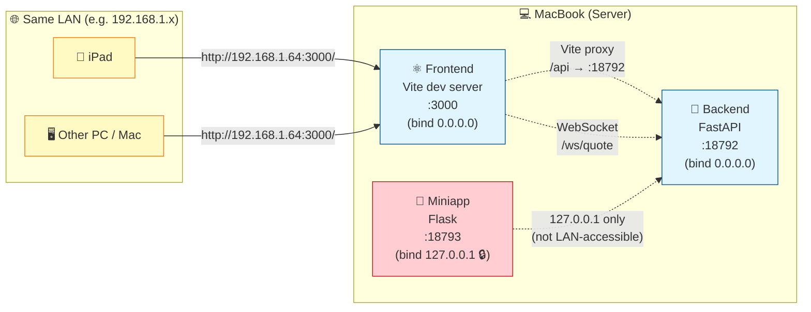

# StockPulse 系統架構 (ARCHITECTURE)

> 本文件描述 StockPulse 嘅系統架構、組件關係、data flow。
> 其他 AI 接手項目時，先讀 `README.md` → `PROJECT_SPEC.md` → **本文件**。

---

## 1. 系統全景 (System Overview)

```
┌─────────────────────────────────────────────────────────────────────┐
│                         StockPulse System                           │
│                                                                     │
│  ┌───────────────┐    ┌───────────────┐    ┌───────────────┐       │
│  │   Frontend    │    │   Backend     │    │    Miniapp    │       │
│  │   (port 3000) │ ←→ │  (port 18792) │ ←→ │ (port 18793)  │       │
│  │  React+Vite   │    │   FastAPI     │    │  Telegram Bot │       │
│  └───────┬───────┘    └───────┬───────┘    └───────┬───────┘       │
│          │ HTTP/WS           │                     │               │
│          └───────────────────┴─────────────────────┘               │
│                              │                                     │
│              ┌───────────────┴───────────────┐                     │
│              ↓                               ↓                     │
│     ┌─────────────────┐            ┌─────────────────┐            │
│     │   Data Tier     │            │  External APIs  │            │
│     │                 │            │                 │            │
│     │  SQLite (8 tbl) │            │  FutuOpenD      │            │
│     │  K-line cache   │            │  :11111         │            │
│     │  Event bus      │            │                 │            │
│     └─────────────────┘            │  MiniMax LLM    │            │
│                                    │  Kimi LLM       │            │
│                                    │  Gemini LLM     │            │
│                                    └─────────────────┘            │
└─────────────────────────────────────────────────────────────────────┘
```

### Tier 概覽

| Tier | 技術 | Port | 角色 |
|------|------|------|------|
| **Frontend** | React 18 + Vite 5 + Ant Design 5 + TS | 3000 | UI + WebSocket client |
| **Backend** | FastAPI + SQLAlchemy + Futu | 18792 | API + WS server + 算法 pipeline |
| **Miniapp** | Telegram Bot + 微信小程序 | 18793 | Mobile 簡化版 |
| **Data** | SQLite + in-memory cache | — | 持久化 + cache |
| **External** | FutuOpenD + LLM providers | 11111 (Futu) | 數據源 + AI |

---

## 2. Frontend Architecture

```
web/src/
├── main.tsx                       # Vite entry, mount <App/>
├── App.tsx                        # React Router setup (11 routes)
│
├── pages/                         # 13 頁面 (見 PROJECT_SPEC.md §UI 設計)
│   ├── HomePage/                  # 組別列表
│   ├── WatchlistPage/
│   ├── StrategyPage/
│   ├── AlgorithmStrategyPage/     # AS-XX 入口
│   ├── LibraryPage/               # Saved runs
│   ├── SettingsPage/              # LLM provider 切換
│   ├── CalendarPage/
│   └── ...
│
├── components/                    # 11 類組件庫
│   ├── common/                    # 通用 UI (Button/Card/Modal/...)
│   ├── layout/                    # AppLayout / Header / Sidebar / MobileNav
│   ├── stock/                     # StockCard / StockSearch / StockDetail
│   ├── group/                     # GroupCard / AddToGroupModal
│   ├── strategy/                  # StrategyEditor / StrategyResult
│   ├── algorithm/                 # AlgorithmSpec / RunButton / ProgressBar
│   ├── library/                   # ViewRunModal
│   ├── chart/                     # Lightweight Charts wrappers
│   ├── calendar/
│   ├── watchlist/
│   └── debug/
│
├── context/                       # React Context (global state)
│   ├── AuthContext                # 用戶登入狀態
│   ├── StockContext               # Stock list / watchlist
│   ├── WebSocketContext           # WS connection + 報價 stream
│   └── ThemeContext               # 暗色 / 亮色主題
│
├── hooks/                         # Custom hooks
│   ├── useWebSocket.ts
│   ├── useStockSearch.ts
│   ├── useGroups.ts
│   ├── useStrategy.ts
│   └── useWatchlist.ts
│
├── services/                      # API service layer (per resource)
│   ├── api.ts                     # axios / fetch wrapper
│   ├── stockService.ts
│   ├── groupService.ts
│   ├── strategyService.ts
│   ├── algorithmService.ts        # AS02 run / health
│   ├── libraryService.ts          # Saved runs CRUD
│   ├── settingsService.ts         # LLM provider 切換
│   └── wsService.ts               # WebSocket subscribe
│
└── types/                         # TypeScript 類型 (mirror backend models)
```

### 路由 (App.tsx)

| Path | Page | 角色 |
|------|------|------|
| `/login` | LoginPage | 登入 |
| `/` | HomePage | 組別列表 |
| `/watchlist` | WatchlistPage | 關注股票 |
| `/strategy` | StrategyPage | 策略管理 |
| `/algorithms` | AlgorithmStrategyPage | AS-XX 入口 |
| `/library` | LibraryPage | Saved runs |
| `/calendar` | CalendarPage | 日曆視圖 |
| `/settings` | SettingsPage | LLM provider 切換 |
| `/test-kline` | KlineDebugPage | Dev |
| `/ew-test` | ElliottWaveTestPage | Dev |
| `/grid-test` | GridTestPage | Dev |

### State management 策略
- **Local state** — `useState` / `useReducer` 喺 component 內
- **Shared state** — React Context (Auth/Stock/WS/Theme)
- **Server state** — 直接 fetch + local cache (冇用 Redux / SWR)
- **WebSocket state** — `WebSocketContext` 統一管理連線 + 報價 stream

---

## 3. Backend Architecture

```
backend/
├── main.py                        # FastAPI app + CORS + router mounts
│                                  #   - /api/* (HTTP)
│                                  #   - /ws/quote (WebSocket)
│                                  #   - /api/health (health check)
│
├── api/                           # HTTP Routes (11 modules)
│   ├── as02.py                    # POST /api/as02/run, GET /api/as02/health
│   ├── debug.py                   # GET /api/debug/* (dev only)
│   ├── group.py                   # /api/groups/* (9 endpoints)
│   ├── kline.py                   # GET /api/kline
│   ├── llm_settings.py            # /api/llm-settings/* (6 endpoints)
│   ├── plates.py                  # /api/plates/* (5 endpoints)
│   ├── saved_runs.py              # /api/saved-runs/* (9 endpoints)
│   ├── settings.py                # /api/settings/* (3 endpoints)
│   ├── stocks.py                  # /api/stocks/* (3 endpoints)
│   └── subscribe.py               # /api/subscribe/* (2 endpoints)
│
├── services/                      # 業務邏輯 (唔直接 expose HTTP)
│   ├── as02_analyzer.py           # AS02 公司質素分析 (核心)
│   ├── encryption.py              # API key 加密 (Fernet)
│   ├── event_bus.py               # 內部 event pub/sub
│   ├── futu_financials.py         # 從 Futu 攞財務數據
│   ├── kline_cache.py             # K 線 cache (memory + DB)
│   └── web_search.py              # MiniMax web search
│
├── llm/                           # LLM Provider Abstraction (NEW 2026-06)
│   ├── base.py                    # AbstractProvider interface
│   ├── factory.py                 # get_active_provider() — 單一入口
│   └── custom.py                  # OpenAI-compatible adapter
│
├── models/                        # SQLAlchemy ORM (8 tables)
│   ├── plate.py
│   ├── llm_settings.py            # API key encrypted at rest
│   ├── stock.py
│   ├── settings.py                # General key-value settings
│   ├── group.py
│   ├── group_stock.py
│   ├── saved_runs.py
│   └── algorithm_dq_log.py
│
├── futu_conn/                     # 富途行情 (port 11111)
│   ├── handler.py                 # QuoteHandler — 解析 push callback
│   └── subscription.py            # SubscriptionManager — 訂閱生命週期
│
├── ws/                            # WebSocket server
│   ├── manager.py                 # ConnectionManager — client 連線管理
│   ├── session.py                 # SessionManager — session 狀態
│   ├── broadcaster.py             # QuoteBroadcaster — quote 廣播
│   └── router.py                  # /ws/quote route
│
├── utils/
│   └── zh_normalize.py
│
├── scripts/                       # 一次性 scripts (板塊 populate / popularity compute)
└── tests/                         # pytest
```

### Layer 規則
- **api/** — 只負責 HTTP protocol (parse request, format response)
- **services/** — 業務邏輯，可以由 api / ws / 其他 services call
- **models/** — SQLAlchemy ORM，唔好喺呢度寫 business logic
- **llm/** — 唯一可以 import 個別 provider 嘅地方，**永遠** 經 factory
- **futu_conn/** — 隔離富途 SDK，外面唔可以直接 import futu

---

## 4. Algorithm Pipeline (AS02 detail)

```
[User clicks "Run" on /algorithms page]
          ↓
[Frontend POST /api/as02/run { stocks: ["HK.00700", ...] }]
          ↓
backend/api/as02.py::run_as02()
          ↓
backend/services/as02_analyzer.py::analyze_stocks(stocks)
          ↓
   for each stock:
          ↓
   analyze_one_stock(stock_code, provider)
          ↓
   ┌──────┴──────────────────────────────┐
   ↓                                     ↓
check_hard_dq_triggers()          futu_financials.get(stock_code)
   ↓                                     ↓
fail → algorithm_dq_log           calculate_financial_score()
   ↓                                     ↓
skip                          calculate_valuation_score()
                                        ↓
                                call_llm_analysis(provider, ...)
                                        ↓
                                backend/llm/factory.get_active_provider()
                                        ↓
                                AbstractProvider.chat_json()
                                        ↓
                                MiniMax / Kimi / Gemini / Custom
                                        ↓
                                (returns reason + scores)
                                        ↓
                                merge into final result
          ↓
[all stocks processed]
          ↓
backend/api/as02.py logs to algorithm_dq_log table (Python 寫 DQ trace - qualified + disqualified 全部)
          ↓
[Frontend 顯示結果 — 唔寫入 saved_runs]
          ↓
[User 手動點「💾 儲存 N 隻合格股票」button]
          ↓
[Frontend POST /api/saved-runs { algorithm_id: "AS-02", stocks: [...], saved_stocks: [...] }]
          ↓
backend/api/saved_runs.py::save_run()
          ↓
[Frontend navigates to /library]
```

> **📌 大少 2026-08-02 #9700 永久 rule:** AS-02 runtime endpoint (`/api/as02/run`) **唔可以** 寫入 `saved_algorithm_runs` table。execute 同 persist 行為唔可以 binding 死於單一 trigger — user 必須喺 frontend 手動點「💾 儲存」先入庫。原因：避免 execute 與 persist 行為 binding 死於單一 trigger,方便 user retry / refine 之後再決定儲存與否。詳細見 `ALGORITHM_SPECS.md` AS-XX 段嘅 none-auto-save rule。

### AS02 函數 (`backend/services/as02_analyzer.py`)

| Function | 角色 |
|----------|------|
| `check_hard_dq_triggers(financials)` | 財務數據 DQ check — missing/stale 即 fail |
| `calculate_financial_score(financials)` | 純數字計分 (ROE / margin / growth) |
| `calculate_valuation_score(financials)` | 估值分 (PE / PB / dividend) |
| `call_llm_analysis(provider, stock, financials, news)` | LLM 分析質素 + 故事 |
| `analyze_stocks(stocks)` | 批量入口 (parallel) |
| `analyze_one_stock(stock, provider)` | 單隻入口 |

### Data quality log
- 每個 DQ fail 都會寫入 `algorithm_dq_log` 表
- Severity: `warn` (可繼續) / `error` (skip 該 stock)
- 可以 query 統計某段時間 DQ rate

---

## 5. LLM Abstraction Layer

### 目標
- 統一所有 LLM call 嘅 interface
- 加新 provider = 加 1 個 adapter + register factory
- Fallback chain + retry policy 一處管理

### Interface (`backend/llm/base.py`)

```python
class AbstractProvider(ABC):
    @abstractmethod
    def chat(self, messages: list[dict], *,
             model: str | None = None,
             temperature: float = 0.3) -> str: ...

    @abstractmethod
    def chat_json(self, messages: list[dict], *,
                 schema: dict) -> dict: ...

    @abstractmethod
    def count_tokens(self, text: str) -> int: ...

    @abstractmethod
    def health_check(self) -> bool: ...
```

### Factory (`backend/llm/factory.py`)

```python
def get_active_provider() -> AbstractProvider:
    """單一入口。讀 llm_settings table 揾 active profile."""
    profile = db.query(LLMSettings).filter_by(is_active=True).first()
    return _build_provider(profile)
```

### Fallback chain (openclaw.json, 全局)

```json
{
  "agents": {
    "defaults": {
      "model": {
        "primary": "minimax/MiniMax-M3-highspeed",
        "fallbacks": ["minimax/MiniMax-M3", "minimax/MiniMax-M2.7"]
      }
    }
  },
  "auth": {
    "cooldowns": {
      "overloadedProfileRotations": 3,
      "rateLimitedProfileRotations": 3,
      "overloadedBackoffMs": 2000
    }
  }
}
```

### 規則 (重要!)
- ✅ 永遠 call `get_active_provider()` 或用 OpenClaw fallback chain
- ❌ 唔好 import 個別 provider 直接用
- ❌ 唔好 hard-code MiniMax / Kimi 嘅 endpoint
- ✅ API key 入 DB 必須 encrypt (`services/encryption.py` Fernet)
- ✅ 加新 provider 用 Settings UI (`/settings`)

---

## 6. Data Flow

### Flow A — 即時報價 (Real-time Quote)

```
[FutuOpenD push callback]
        ↓ (每 250ms 報價)
backend/futu_conn/handler.py::on_recv_quote()
        ↓
backend/services/event_bus.py::emit('quote', data)
        ↓
backend/ws/broadcaster.py (subscribe to 'quote' event)
        ↓
WebSocket.send() to all connected clients
        ↓
[Frontend WebSocketContext receives 'quote' message]
        ↓
update StockCard real-time price
```

### Flow B — Algorithm 執行

(見 §4 Algorithm Pipeline)

### Flow C — 用戶設定 LLM Provider

```
[User changes active provider on /settings page]
        ↓
[Frontend POST /api/llm-settings/switch { provider: "kimi" }]
        ↓
backend/api/llm_settings.py::switch_provider()
        ↓
db.update(LLMSettings.is_active) — atomic toggle
        ↓
[Frontend reloads settings, shows confirmation]
        ↓
[Next LLM call uses new provider via factory]
```

### Flow D — Saved Run 入庫

```
[AS02 run completes]
        ↓
backend/services/as02_analyzer.py returns List[Dict]
        ↓
backend/api/as02.py serializes to JSON
        ↓
db.insert(SavedRun)  with stocks + results + reason as JSON strings
        ↓
[User navigates to /library, GET /api/saved-runs]
        ↓
[Frontend renders runs in saved_runs table]
```

---

## 7. Miniapp Architecture

```
miniapp/
├── backend/main.py                # FastAPI (port 18793)
├── bot_command.py                 # Telegram Bot API (polling-based)
├── frontend/                      # 微信小程序 (Vue / WXML)
└── .env / .env.example
```

### 與主 backend 通訊
- Miniapp backend 唔直接 import 主 backend
- 用 HTTP client (`httpx`) call 主 backend API (e.g. `http://localhost:18792/api/...`)
- 共用同一個 SQLite DB (透過 SQLAlchemy 同 instance)

### Telegram Bot commands
- `/quote HK.00700` — 即時報價
- `/strategy list` — 列出 strategy
- `/run as02 HK.00700` — 簡易 AS02 run

---

## 8. External Dependencies

| 依賴 | 用途 | Failure handling |
|------|------|------------------|
| **FutuOpenD** (port 11111) | 報價 + K 線 + 財務數據 | auto-reconnect + retry subscribe |
| **MiniMax LLM** (`api.minimaxi.com`) | 主要 LLM provider | fallback chain + retry 3x |
| **Kimi LLM** (`api.moonshot.cn`) | 備選 (暫時未用) | 同上 |
| **Gemini** | planned | — |
| **SQLite** | 持久化 | WAL mode + 定期 backup |

### Critical: 連接依賴

- **Backend 啟動時必須 FutuOpenD 已運行**，否則 subscribe 全部 fail
- **LLM call 唔需要 Futu**，可以獨立運作 (Settings + Library 唔靠 Futu)
- **Frontend dev mode** 可以直接打 backend localhost:18792
- **Background services** — macOS LaunchAgent 自動管理 (2026-08-03 起) — Vite / Backend / Miniapp / Logrotate，reboot / crash 後 auto-restart

---

## 9. Deployment (production reference)

### 本地 dev (LaunchAgent-managed, 2026-08-03 起)

> 所有 background service 由 macOS LaunchAgent 自動管理 — reboot / crash 後 auto-restart。
> 修咗兩個 deadlock：(1) Vite reboot 後永遠死、(2) log 長期塞爆 disk (96% full)。

#### Service 清單

| Service | Label | Schedule | Port | Process |
|---------|-------|----------|------|---------|
| Backend | `com.stockpulse.trigger` | RunAtLoad + KeepAlive | 18792 | uvicorn main:app |
| Vite dev | `com.user.stockpulse-vite` | RunAtLoad + KeepAlive | 3000 | npm run dev |
| Miniapp | `com.user.stockpulse-miniapp` | RunAtLoad | 18793 | flask |
| Logrotate | `com.user.stockpulse-logrotate` | StartInterval=1800s (30min) | — | bash script |

#### 文件路徑

```
~/stockpulse/
├── scripts/
│   ├── start_vite.sh        # Vite launcher (absolute npm/node path)
│   └── rotate_logs.sh       # Safe rotation (tail + truncate)
└── logs/
    ├── vite.log             # Vite stdout/stderr
    ├── launchd.log          # Backend (uvicorn) log
    ├── stockpulse.log       # Python logging
    └── *.log.1 / .2 / .3    # Rotated backups (3 layers max)
~/Library/LaunchAgents/
├── com.stockpulse.trigger.plist
├── com.user.stockpulse-vite.plist
├── com.user.stockpulse-miniapp.plist
└── com.user.stockpulse-logrotate.plist
```

#### 啟動鏈條 (Frontend → Backend)

```
[User opens http://localhost:3000]
        ↓
[macOS launchd: com.user.stockpulse-vite RunAtLoad 已經起咗 Vite]
        ↓
Vite dev server 喺 port 3000 listen
        ↓
[Frontend 攞 /api/plates]
        ↓
[Vite proxy: /api → http://localhost:18792]
        ↓
[macOS launchd: com.stockpulse.trigger 已經起咗 Backend]
        ↓
Backend (uvicorn) 喺 port 18792 respond
```

#### 啟動鏈條 (FutuOpenD 報價)

```
[FutuOpenD 預先由大少人手啟動, port 11111]
        ↓
[Backend startup 連 OpenD 攞報價]
        ↓
[WebSocket push 落 Frontend]
```

**⚠️ 重要 — OpenD 唔由 LaunchAgent 管**，要由大少人手啟動 (`/Applications/Futu_OpenD.app`)。

#### 設計原則

1. **絕對 path + export PATH** — LaunchAgent 唔繼承 `~/.zshrc`，要 hard-code `/opt/homebrew/bin/npm` + `export PATH` 確保 child process 都搵到 node
2. **殺舊 → 釋 port → 起新** — `start_vite.sh` pattern 避免 double-bind (跟 start_trigger.sh)
3. **KeepAlive with SuccessfulExit=false** — crash 即 restart，但 intentional kill 唔會 loop
4. **ThrottleInterval=10** — 防 crash loop thrash
5. **Disk-safe rotation** — `rotate_logs.sh` 用 tail + truncate，**唔用 cp**（會 disk-double，tight space 必 crash）

#### 常用 commands

```bash
# Check status
launchctl list | grep stockpulse

# Reload (after edit plist)
launchctl unload ~/Library/LaunchAgents/com.user.stockpulse-vite.plist
launchctl load ~/Library/LaunchAgents/com.user.stockpulse-vite.plist

# 手動 trigger log rotation
bash ~/stockpulse/scripts/rotate_logs.sh

# Tail logs
tail -f ~/stockpulse/logs/vite.log
tail -f ~/stockpulse/logs/launchd.log
```

### Production (not yet)
- Backend: Docker + gunicorn
- Frontend: nginx static files
- DB: SQLite + Litestream (S3 backup)
- OpenD: 必須同機 (latency 考慮)

---

## 9.5 跨機訪問 (Cross-device LAN Access)

> **情境：** 大少喺屋企用 iPad / 第二部電腦訪問 StockPulse。
> **原理：** MacBook 跑 Backend + Frontend；其他設備透過 LAN IP 訪問。

### 拓樸圖 (Topology)



### 訪問鏈條詳解

| 步驟 | 動作 | 細節 |
|------|------|------|
| 1 | **用家查 MacBook LAN IP** | `ipconfig getifaddr en0` → e.g. `192.168.1.64` |
| 2 | **其他設備瀏覽器輸入** | `http://192.168.1.64:3000/` |
| 3 | **Frontend (Vite) 接到 request** | Vite dev server 喺 `0.0.0.0:3000`，所以 LAN 任何 device 都摸得到 |
| 4 | **Frontend 要打 backend API** | 唔係直接打 LAN IP，而係打 `window.location.hostname` (即 `192.168.1.64:18792`) → Vite proxy 轉去 localhost:18792 |
| 5 | **Backend 接到 request** | Backend 喺 `0.0.0.0:18792`，響 MacBook 本機處理 |
| 6 | **WebSocket 一樣** | `ws://192.168.1.64:18792/ws/quote`，proxy 內部轉去 localhost |

### Frontend LAN fallback chain (QW-2a)

`web/src/config/api.ts` 嘅 API host resolution 順序：

```
1. import.meta.env.VITE_API_BASE  ← 最高優先 (build-time env)
2. window.location.hostname      ← 自動 fallback (i.e. 用家個 browser URL 個 host)
3. 'localhost' (default)          ← dev 預設
```

**點解咁重要：**
- 大少喺 MacBook 自己開 → `window.location.hostname` = `localhost` → backend 用 localhost ✅
- 大少喺 iPad 訪問 → `window.location.hostname` = `192.168.1.64` → backend 用 LAN IP ✅
- 唔使 hardcode！同一份 build 兩個地方都 work

### Miniapp 鎖本地 (QW-1)

Miniapp backend (port 18793) 已經喺 QW-1 改 bind `127.0.0.1`：

- ✅ MacBook 自己用 Telegram bot command → OK
- ❌ 其他 LAN 設備 → 唔可以直訪問 Miniapp backend
- 🔒 原因：Miniapp backend 設計上只係 bot 嘅 internal API，唔需要對外

> 📘 詳細 PUBLIC / LOOPBACK 分類見 `~/.openclaw/workspace-main/PORTS.md`
> 📘 凡人 step-by-step 教學見 `README.md` §「🌐 其他電腦訪問 StockPulse」

---

## 10. 設計 trade-offs (要知)

| 決策 | 原因 | Trade-off |
|------|------|-----------|
| SQLite (not Postgres) | 單機部署 + 簡單 | 唔支援 concurrent write 多 |
| 冇用 Redux/SWR | 簡單 | Server state 唔自動 refetch |
| LLM abstraction 而唔直接 call MiniMax | 加新 provider 易 | 多一層 indirection |
| AlgoSpec 喺 `.md` 而唔係 code | 大少易改 | 要 sync script 確保一致 |
| Miniapp 共用 SQLite | 簡單 | 唔可以 horizontal scale |
| WebSocket (not SSE) | bidirectional | 連線管理複雜 |

---

_最後更新：2026-08-03 (LaunchAgent 永久 fix: Vite + logrotate)_
---

## 📦 Stock Reasons Architecture (大少 #9920)

### 改動概要

原本每隻 stock 嘅 reason 喺 `saved_stocks[i].reason` (String, plain text)，新架構獨立 `stock_reasons` table 儲存 sanitized HTML，獨立 components 渲染 PopUp。

### Data Flow

```
[Algorithm run] → backend/services/<algo>_analyzer.build_<algo>_reason_html(result)
                ↓
[Frontend SaveRunModal] → POST /api/saved-runs { ..., reasons: [{code, source_type, source_ref, title, html}] }
                ↓
[Backend api/saved_runs.py] → sanitize_html(req.html) → models.stock_reasons.upsert_reasons_batch()
                ↓
[SQLite stock_reasons table] → UNIQUE(code, source_type, source_ref) ON CONFLICT DO UPDATE
                ↓
[Frontend ViewRunModal] → ReasonCell v2 → useStockReasons(code) → GET /api/stock-reasons?code=X
                ↓
[Title list rendered] → click title → ReasonPopUp (DOMPurify sanitized HTML, 900px modal)
```

### Sanitization Pipeline (defense-in-depth)

1. **Algorithm-side** — `build_<algo>_reason_html()` 寫 structured HTML (no user input)
2. **Backend write** — `services.html_sanitizer.sanitize_html()` 用 bleach + post-scrub regex 移除 XSS vectors
3. **Frontend render** — `DOMPurify.sanitize()` client-side 第二重保險
4. **CSP** (將來 optional) — iframe sandbox 為極端 paranoia level

### 累積語意 (Q1 Smart Dedupe)

- 同 `(code, source_type, source_ref)` 重做 → **overwrite 最新** (RECOVER semantics)
- 唔同 algorithm (AS-01 vs AS-02) → 分開 row
- 唔同 source_type (algorithm vs manual) → 分開 row
- Result: ViewRunModal 入面睇一隻 stock 嘅 reasons = 全部做過嘅 algorithm reports + 任何 manual/news/research


---

## ⚠️ CSS Module Scoping in innerHTML (Permanent Rule, 2026-08-04)

**Problem**: 2026-08-04 大少 screenshot 報「什麼 Chart 都沒有」 — bar chart 0 width render 唔出

**Root Cause**:
```css
/* Vite CSS Modules 編譯時 scope 變 local */
.dim-row { display: flex; }     /* → ReasonPopUp_dim-row__abc123 */
.dim-bar-bg { height: 22px; }  /* → ReasonPopUp_dim-bar-bg__abc123 */
```
但 `dangerouslySetInnerHTML` content 嘅 class 係 raw:
```html
<div class="dim-row">...</div>  <!-- 仍然係 dim-row -->
```

**CSS 變 `_dim-row__abc123`，HTML 係 `dim-row` — selector 唔 match，styles 唔 apply**。

### 解決方案

凡係 component 嘅 HTML content 用 `dangerouslySetInnerHTML`，module.css 入面對應嘅 class 必須加 `:global()` 前綴：

```css
/* Fixed — 用 :global() keep raw class name */
:global(.dim-row) {
  display: flex;
  align-items: center;
  margin: 12px 0;
  gap: 14px;
}

:global(.dim-bar-bg) {
  flex: 1;
  height: 22px;
  background: rgba(255, 255, 255, 0.08);
  border-radius: 6px;
}
```

編譯後變:
```css
.dim-row { display: flex; ... }   /* global, no scoping */
.dim-bar-bg { height: 22px; ... }
```

跟 raw HTML `class="dim-row"` match ✅。

### 應用範圍 (大少 #9920 + #10031)

- `web/src/components/library/ReasonPopUp.module.css` — 32 個 `:global()` wrappers (bar chart + score colors + width classes)
- 將來其他 component 用 innerHTML 都要跟呢條 rule


---

## 📦 AS-01 Reason HTML Build Flow (大少 #10075, 2026-08-04)

### Flow Diagram

```
[AS-01 Algorithm run] → backend/models/plate.py::run_plate_leaders()
  → per-plate _rank_one_plate() → emit leaders with mcap_rank / volume_rank / score
  ↓
[Frontend AS-01 panel] → POST /api/saved-runs {algorithm_id: "AS-01", saved_stocks: [Leader with raw fields]}
  ↓
[Backend api/saved_runs.py] → save_run() auto-build block:
  - Group saved_stocks by plate_code
  - For each plate, compute plate_total = len(plate_stocks)
  - Call build_as01_reason_html(stock, plate_total_stocks=plate_total)
  - Append to all_reasons list
  - sanitize_html() + upsert_reasons_batch() → SQLite stock_reasons table
  ↓
[SQLite stock_reasons table] → UNIQUE(code, source_type, source_ref) ON CONFLICT DO UPDATE
  ↓
[Frontend ViewRunModal] → ReasonCell v2 → useStockReasons(code) → GET /api/stock-reasons?code=***
  ↓
[Title list rendered] → click title → ReasonPopUp (DOMPurify sanitized HTML, 1000px modal)
  → 4 個維度 bar chart + 顏色 + 龍頭因素分析
```

### Key Architectural Decisions (大少 #10075)

1. **Plate-grouping**: Backend auto-build 時按 `plate_code` group stocks — 同一板塊內所有 stocks 嘅 relative rank width 一致 (e.g. 全部 #1 都係 w-100, 全部 #5 都係 w-50)。
2. **4 個維度 display weights**: 40/40/10/10 (市值/成交量/綜合/龍頭度) — display 而唔係 algorithm weight。實際 AS-01 algorithm 只用 mcap_rank + volume_rank (50/50)。
3. **Cross-cutting helpers** (`_score_class`, `_width_class`): Duplicated 喺 `models/plate.py` 同 `services/as02_analyzer.py` — 唔 extract 避免 scope creep (將來可抽 `utils/scoring.py`)。
4. **Generic v2 template pattern**: 每個 algorithm 都用同一個 stock_reasons table (title + html + score_class + width_class) — 將來 AS-03/AS-04 跟同一個 pattern。

